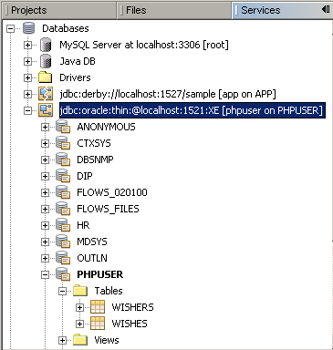

// 
//     Licensed to the Apache Software Foundation (ASF) under one
//     or more contributor license agreements.  See the NOTICE file
//     distributed with this work for additional information
//     regarding copyright ownership.  The ASF licenses this file
//     to you under the Apache License, Version 2.0 (the
//     "License"); you may not use this file except in compliance
//     with the License.  You may obtain a copy of the License at
// 
//       http://www.apache.org/licenses/LICENSE-2.0
// 
//     Unless required by applicable law or agreed to in writing,
//     software distributed under the License is distributed on an
//     "AS IS" BASIS, WITHOUT WARRANTIES OR CONDITIONS OF ANY
//     KIND, either express or implied.  See the License for the
//     specific language governing permissions and limitations
//     under the License.
//

= Lesson 1b: Creating Oracle Database Tables
:jbake-type: tutorial
:jbake-tags: tutorials 
:jbake-status: published
:icons: font
:syntax: true
:source-highlighter: pygments
:toc: left
:toc-title:
:description: Lesson 1b: Creating Oracle Database Tables - Apache NetBeans
:keywords: Apache NetBeans, Tutorials, Lesson 1b: Creating Oracle Database Tables

This lesson describes the last preliminary step in developing the Wish List application, that of creating a sample database with test data. To complete the steps in this tutorial, you will need a database in which to store data of wishers. With the NetBeans IDE you can perform all these activities through the IDE interface. 
Before starting, see the tutorial requirements described in xref:wish-list-tutorial-main-page.adoc[+Creating a CRUD Application with PHP - Main page+].

The current document is a part of the Creating a CRUD Application in the NetBeans IDE for PHP tutorial.

== Creating the Database User

In this procedure you first create a user and then create tables as that user.

You can create a user either by using Oracle's tools, or by connecting NetBeans IDE to the database and using the IDE's SQL editor. NetBeans 7.0, currently available only as beta or development builds, provides improved connection to Oracle databases. To learn how to connect NetBeans IDE to Oracle Database and to create a user in that database, see the xref:../ide/oracle-db.adoc[+Connecting to an Oracle Database+] tutorial.

Using the tool of your choice, create the following user:

|===
|User Name |phpuser 

|Password |phpuserpw 

|System Privileges |CREATE TABLE 

|CREATE VIEW 

|CREATE SEQUENCE 

|CREATE TRIGGER 

|Roles (Oracle Database 10.x) |CONNECT 

|RESOURCE 
|===

An example set of SQL commands for creating this user follows. These commands assume the database has the tablespaces USERS and TEMP.

[source,sql]
----

drop user phpuser cascade;
create user phpuser identified by phpuserpw;
grant connect, resource to phpuser;
alter user phpuser default tablespace users temporary tablespace temp account unlock;
----

== Designing the Structure of the Sample Database

To arrange and store all the necessary data you need two tables:

* A wishers table for storing names and passwords of registered users
* A wishes table for storing descriptions of wishes

image::images/wishlist-db.png[]

The wishers table contains three fields:

1. id - the unique ID of a wisher. This field is used as the Primary Key
2. name
3. password

The wishes table contains four fields:

1. id - the unique ID of a wish. The field is used as the Primary Key
2. wisher_id - the ID of the wisher to whom the wish belongs. The field is used as the Foreign Key.
3. description
4. due_date - the date by when the wish is requested

The tables are related through the wisher's ID. All the fields are mandatory except due_date in wishes.

== Creating the Oracle Database Schema

1. Log into the database as the user you have created.

If you are connecting through NetBeans IDE, create a connection with the new user's name and password. Be certain to select the schema with the same name as the user. (See the xref:../ide/oracle-db.adoc#connect[+Establishing a Connection to Oracle DB+] section of the Connecting to an Oracle Database tutorial.)

. To create the wishers table, run the following SQL query:

[source,sql]
----

create table wishers (id number not null,name varchar2(50) unique not null, password varchar2(50) not null, constraint wishers_pk primary key(id));
----

. To create the wishes table. run the following SQL query. Note that you create a foreign key, to associate wishes with a wisher.

[source,sql]
----

create table wishes (id number not null, wisher_id number not null,description varchar2(255) not null, due_date date, constraint wishes_pk primary key(id), constraint wishes_fk1 foreign key(wisher_id) references wishers(id));
----

. Verify that the new tables are added to the database. If you are using NetBeans IDE to connect to the database, go to the Services window to the jdbc:oracle:thin:@localhost:1521:XE [phpuser on PHPUSER] connection node. The new tables are listed in the Tables node. (If they do not appear, right-click the connection and choose Refresh.) 

Note: You can download a set of SQL commands for creating the Oracle Database tables link:https://netbeans.org/projects/www/downloads/download/php%252FSQL-files-for-Oracle.zip[+here+].

== Adding Sequences and Triggers to Increment the ID Values

With Oracle Database, you must specify a sequence in order to increment a value. For the value to increment when a new member is added to a table, you add a trigger.

1. To add a sequence for the wishers table, run the following SQL command:

[source,sql]
----

create sequence wishers_id_seq start with 1 increment by 1;
----

. To trigger the sequence on the ID column of the wishers table when you add a new wisher, run the following SQL command:

[source,sql]
----

create or replace trigger wishers_insert
before insert on wishers
for each row
begin
    select wishers_id_seq.nextval into :new.id from dual;
end;
/
----

. Add a sequence for the wishes table.

[source,sql]
----

create sequence wishes_id_seq start with 1 increment by 1;
----

. Add a trigger to run the sequence on the ID column of the wishes table when you add a new wish.

[source,sql]
----

create or replace trigger wishes_insert
before insert on wishes
for each row
begin
    select wishes_id_seq.nextval into :new.id from dual;
end;
/
----

Note: You can download a set of SQL commands for creating the Oracle Database tables, including sequences and triggers, link:https://netbeans.org/projects/www/downloads/download/php%252FSQL-files-for-Oracle.zip[+here+].

== Entering the Test Data

To test your application you will need some data in the database. The example below shows how to add two wishers and four wishes.

1. Add a wisher named Tom, with the password 'tomcat.'

[source,sql]
----

insert into wishers (name, password) values ('Tom','tomcat');
----

. Add a wisher named Jerry, with the password 'jerrymouse.'

[source,sql]
----

insert into wishers (name, password) values ('Jerry', 'jerrymouse');commit;
----

. Add the wishes.

[source,sql]
----

insert into wishes (wisher_id, description, due_date) values (1, 'Sausage', to_date('2008-04-01', 'YYYY-MM-DD'));
insert into wishes (wisher_id, description) values (1, 'Icecream');insert into wishes (wisher_id, description, due_date) values (2, 'Cheese', to_date('2008-05-01', 'YYYY-MM-DD'));
insert into wishes (wisher_id, description)values (2, 'Candle');
commit;
----

. Verify that you added test data. If you are using NetBeans IDE to view the test data, click the right mouse button on the relevant table and from the context menu choose View Data. 

image::images/view-test-data.png[]

To get some general understanding of database principles and design patterns, check the following tutorial: link:http://www.tekstenuitleg.net/en/articles/database_design_tutorial/1[+http://www.tekstenuitleg.net/en/articles/database_design_tutorial/1+].

For more information on the syntax of Oracle  `CREATE TABLE`  statements, see link:http://download.oracle.com/docs/cd/B19306_01/server.102/b14200/statements_7002.htm[+http://download.oracle.com/docs/cd/B19306_01/server.102/b14200/statements_7002.htm+].

Note: You can download a set of SQL commands for creating the Oracle Database tables link:https://netbeans.org/projects/www/downloads/download/php%252FSQL-files-for-Oracle.zip[+here+].

== Next Step

xref:wish-list-lesson2.adoc[+Next Lesson >>+]

xref:wish-list-tutorial-main-page.adoc[+Back to the Tutorial main page+]
