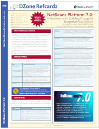

// 
//     Licensed to the Apache Software Foundation (ASF) under one
//     or more contributor license agreements.  See the NOTICE file
//     distributed with this work for additional information
//     regarding copyright ownership.  The ASF licenses this file
//     to you under the Apache License, Version 2.0 (the
//     "License"); you may not use this file except in compliance
//     with the License.  You may obtain a copy of the License at
// 
//       http://www.apache.org/licenses/LICENSE-2.0
// 
//     Unless required by applicable law or agreed to in writing,
//     software distributed under the License is distributed on an
//     "AS IS" BASIS, WITHOUT WARRANTIES OR CONDITIONS OF ANY
//     KIND, either express or implied.  See the License for the
//     specific language governing permissions and limitations
//     under the License.
//

= NetBeans Platform Learning Trail
:jbake-type: platform_tutorial
:jbake-tags: tutorials 
:jbake-status: published
:syntax: true
:source-highlighter: pygments
:toc: left
:toc-title:
:icons: font
:experimental:
:description: NetBeans Platform Learning Trail - Apache NetBeans
:reviewed: 2020-03-22
:keywords: Apache NetBeans Platform, Platform Tutorials, NetBeans Platform Learning Trail

== What is the NetBeans Platform?

The NetBeans Platform is a broad Java framework on which you can base large
desktop applications. NetBeans IDE itself is
xref:../../projects/platform/screenshots.adoc[one of the hundreds of
applications] based on the NetBeans Platform. The NetBeans Platform contains
APIs that simplify the handling of windows, actions, files, and many other
things typical in applications.

Each distinct feature in a NetBeans Platform application can be provided by a
distinct NetBeans module, which is comparable to a plugin. A NetBeans module is
a group of Java classes that provides an application with a specific feature.

You can also create new modules for NetBeans IDE itself. For example, you can
write modules that make your favorite cutting-edge technologies available to
users of NetBeans IDE. Alternatively, you might create a module to provide an
additional editor feature.

== Getting Started

*  link:https://bits.netbeans.org/dev/javadoc/[NetBeans API Javadoc]
*  link:https://mail-archives.apache.org/mod_mbox/netbeans-dev/[NetBeans Developer Mailing List]
*  xref:../../../wiki/index.adoc[NetBeans Developer FAQ]
*  xref:../../../tutorials/nbm-google.adoc[NetBeans Plugin Quick Start]
*  xref:../../../tutorials/nbm-quick-start.adoc[NetBeans Platform Quick Start]
*  xref:../../../tutorials/nbm-dukescript.adoc[NetBeans Platform Plugins with DukeScript]
// * What's New in NetBeans Platform  link:http://platform.netbeans.org/whatsnew/65.html[6.5],  link:http://platform.netbeans.org/whatsnew/67.html[6.7],  link:http://platform.netbeans.org/whatsnew/68.html[6.8],  link:http://platform.netbeans.org/whatsnew/69.html[6.9],  link:http://platform.netbeans.org/whatsnew/70.html[7.0],  link:http://platform.netbeans.org/whatsnew/71.html[7.1],  link:http://platform.netbeans.org/whatsnew/72.html[7.2],  link:http://bits.netbeans.org/7.2.1/javadoc/apichanges.html[7.2.1],  link:http://bits.netbeans.org/7.3/javadoc/apichanges.html[7.3],  link:http://bits.netbeans.org/7.3.1/javadoc/apichanges.html[7.3.1],  link:http://bits.netbeans.org/7.4/javadoc/apichanges.html[7.4],  link:http://bits.netbeans.org/8.0/javadoc/apichanges.html[8.0]?  link:http://bits.netbeans.org/8.1/javadoc/apichanges.html[8.1]?

== Porting

*  xref:../../../tutorials/nbm-porting-basic.adoc[Porting Swing Components]
*  xref:../../../tutorials/nbm-javafx.adoc[Porting JavaFX Components]

== Using the NetBeans APIs

Are you new to the NetBeans Platform? If so, after following the documents in
the "Getting Started" section above, please continue your learning path by
reading the documents below. In particular, the book, published in 2014,
"NetBeans Platform for Beginners", is very highly recommended!

=== NetBeans Platform for Beginners

[.feature]
--
image::images/nbp4beginners.jpg[role="left", link="https://leanpub.com/nbp4beginners"]
--

*  xref:../../../tutorials/nbm-runtime-container.adoc[Runtime Container Tutorial]
*  xref:../../../tutorials/nbm-10-top-apis.adoc[Top 10 NetBeans APIs (Video)]
*  xref:../../../wiki/NbmIdioms.adoc[NetBeans APIs in a Nutshell]

[.feature]
--

--

==== Quick Overviews
*  link:https://dzone.com/articles/netbeans-lookups-explained[NetBeans Lookups Explained!]
*  link:https://dzone.com/articles/netbeans-extension-points[How Do NetBeans Extension Points Work?]

==== Selection Management Series
*  xref:../../../tutorials/nbm-selection-1.adoc[Part 1: Selection Management Tutorial]
*  xref:../../../tutorials/nbm-selection-2.adoc[Part 2: Selection Management Tutorial II—Using Nodes]
*  xref:../../../tutorials/nbm-nodesapi2.adoc[Part 3: Nodes API Tutorial]
*  xref:../../../tutorials/nbm-property-editors.adoc[Part 4: Property Editor API Tutorial]

=== Applications Built on the NetBeans Platform

==== Applications
*  xref:../../../tutorials/nbm-paintapp.adoc[Paint Application Tutorial]
*  xref:../../../tutorials/nbm-feedreader.adoc[Feed Reader Tutorial]
*  xref:../../../tutorials/nbm-htmleditor.adoc[HTML Editor Tutorial]
*  xref:../../../tutorials/nbm-povray-1.adoc[POV-Ray Renderer Tutorial]

==== Common Scenarios
*  xref:../../../tutorials/nbm-crud.adoc[Create/Read/Update/Delete (CRUD)]
*  xref:../../../tutorials/nbm-geospatial.adoc[Geospatial]
*  xref:../../../tutorials/nbm-workflow.adoc[Workflow]
*  xref:../../../tutorials/nbm-ide.adoc[Development Environment]

== NetBeans APIs for Developing Code Editors

*  xref:../../../tutorials/nbm-filetype.adoc[File Type Integration Tutorial]
*  xref:../../../tutorials/nbm-javacc-lexer.adoc[JavaCC Lexer Generator Integration Tutorial]
*  xref:../../../tutorials/nbm-javacc-parser.adoc[JavaCC Parser Generator Integration Tutorial]
*  xref:../../../tutorials/nbm-copyfqn.adoc[Java Language Infrastructure Tutorial]
*  xref:../../../tutorials/nbm-code-generator.adoc[Code Generator Integration Tutorial]
*  xref:../../../tutorials/nbm-code-completion.adoc[Code Completion Integration Tutorial]
*  xref:../../../tutorials/nbm-mark-occurrences.adoc[Mark Occurrences Module Tutorial]
*  xref:../../../tutorials/nbm-palette-api1.adoc[Code Snippet Tutorial]
*  xref:../../../tutorials/nbm-palette-api2.adoc[Editor Component Palette Module Tutorial]
*  xref:../../../tutorials/nbm-xmleditor.adoc[XML Editor Extension Module Tutorial]
*  xref:../../../tutorials/nbm-hyperlink.adoc[Hyperlink Navigation Tutorial]
*  xref:../../../tutorials/nbm-java-hint.adoc[Java Hints Tutorial]
*  xref:../../../tutorials/nbm-code-template.adoc[Code Templates Tutorial]

== NetBeans APIs for Visualizing Data

*  xref:../../../tutorials/nbm-visual_library.adoc[Visual Library Tutorial]
*  xref:../../../tutorials/nbm-quick-start-visual.adoc[Visual Library Tutorial for Java Applications]
*  link:http://tdamir.blogspot.com/2007/12/ddl-visualizer-visualize-sql-script.html[Visualize SQL Scripts with the NetBeans Platform]
*  xref:../../../wiki/VisualDatabaseExplorer.adoc[A Visual Database Explorer for NetBeans]
*  link:https://dzone.com/articles/how-create-visual-applications[How to Create Visual Applications in Java?]
*  link:https://dzone.com/articles/how-add-resize-functionality-v[How to Add Resize Functionality to Visual Applications in Java?]
*  link:https://netbeans.org/community/magazine/html/04/visuallibrary.html[Creative Uses of the Visual Library]

== Miscellaneous NetBeans Platform Tutorials

NOTE: These tutorials are alphabetically ordered.

*  xref:../../../tutorials/nbm-filetemplates.adoc[File Template Module Tutorial]
*  xref:../../../tutorials/nbm-nbi.adoc[Installer Integration Tutorial]
*  xref:../../../tutorials/nbm-options.adoc[Options Window Module Tutorial]
*  xref:../../../tutorials/nbm-projectsamples.adoc[Project Sample Module Tutorial]
*  xref:../../../tutorials/nbm-projectextension.adoc[Project Type Extension Module Tutorial]
*  xref:../../../tutorials/nbm-projecttype.adoc[Project Type Module Tutorial]
*  xref:../../../tutorials/nbm-propertyeditors-integration.adoc[Property Editor Integration Tutorial]
*  xref:../../../tutorials/nbm-quick-search.adoc[Quick Search Integration Tutorial]
*  xref:../../../tutorials/nbm-ribbonbar.adoc[Ribbon Bar Tutorial]
*  xref:../../../tutorials/nbm-nodesapi.adoc[System Properties Module Tutorial]
*  xref:../../../tutorials/nbm-wizard.adoc[Wizard Module Tutorial]

== Command Line

*  xref:../../../tutorials/nbm-ant.adoc[Ant]
*  xref:../../../tutorials/nbm-maven-commandline.adoc[Maven]

== YouTube: Five Simple Ways to Extend NetBeans IDE

[.feature]
--
image::images/five-easy-extend.png[role="left", link="http://www.youtube.com/watch?v=h4k5JpluJM8"]
--

== Using Maven with the NetBeans Platform

=== General Introductions
*  xref:../../../wiki/MavenBestPractices.adoc[Maven Best Practices in NetBeans IDE]
*  link:https://bits.netbeans.org/mavenutilities/nbm-maven-plugin/[About the NetBeans Module Maven Plugin]

=== NetBeans Platform Tutorials
*  xref:../../../tutorials/nbm-maven-commandline.adoc[NetBeans Platform Maven Command Line Tutorial]
*  xref:../../../tutorials/nbm-maven-quickstart.adoc[NetBeans Platform Quick Start Using Maven]
*  xref:../../../tutorials/nbm-maven-modulesingle.adoc[NetBeans Platform File Type Tutorial Using Maven]
*  xref:../../../tutorials/nbm-maven-modulesuite.adoc[NetBeans Platform Selection Tutorial Using Maven]
*  xref:../../../tutorials/nbm-maven-crud.adoc[NetBeans Platform CRUD Tutorial Using Maven]

=== Miscellaneous
*  xref:../../../blogs/geertjan/mavenized_netbeans_platform_runtime_container.adoc[Mavenized NetBeans Platform Runtime Container]
*  link:https://dzone.com/articles/how-create-maven-nb-project-type[Creating Custom Project Types with Maven and the NetBeans Platform]
*  link:https://dzone.com/articles/nb-how-create-javahelp-mavenized[Creating JavaHelp with Maven and the NetBeans Platform]
*  link:https://dzone.com/articles/video-nbm-maven-archetypes[Screencast: Maven and the NetBeans Platform]

== Diagnostics

*  xref:../../../tutorials/nbm-test.adoc[NetBeans Platform Test Infrastructure Tutorial]
*  xref:../../../tutorials/nbm-gesture.adoc[NetBeans Platform Gesture Collection Infrastructure Tutorial]

== Using OSGi with the NetBeans Platform

*  xref:../../../tutorials/nbm-osgi-quickstart.adoc[NetBeans Platform Quick Start Using OSGi]
*  xref:../../../tutorials/nbm-emf.adoc[NetBeans Platform EMF Integration Tutorial]

== Screencasts

*  link:http://prezi.com/b5ntwnpvu9j8/free-netbeans-platform-crash-course/[Slides: Free NetBeans Platform Crash Course]
*  xref:../../../tutorials/nbm-10-top-apis.adoc[Video: Top 10 NetBeans APIs]
*  xref:../../../kb/docs/screencasts.adoc[NetBeans Screencasts]

== Community-Contributed Docs

*  xref:../../../wiki/VisualDatabaseExplorer.adoc[A Visual Database Explorer for NetBeans], by Toni Epple
*  link:http://tdamir.blogspot.com/2007/12/ddl-visualizer-visualize-sql-script.html[DDL Visualizer: Visualize SQL Script with NetBeans], by Damir Tesanovic
*  link:http://blogs.kiyut.com/tonny/2007/10/18/customize-netbeans-platform-splash-screen-and-about-dialog/[Customize the Splash Screen and About Dialog], by Tonny Kohar
*  xref:../../../wiki/AddingMRUList.adoc[Create the 'Most Recently Used Files' List], by Tonny Kohar
*  xref:../../../wiki/TranslateNetbeansModule.adoc[Translate Your NetBeans Module], by Michel Graciano
*  link:https://dzone.com/articles/quickstart-guide-language-supp[Quick Start: Creating Language Tools In NetBeans IDE], by Jordi R. Cardona

== Reference Material

=== Official NetBeans Platform Reference Material

*  link:https://bits.netbeans.org/dev/javadoc/index.html[NetBeans API Javadoc]
*  link:https://bits.netbeans.org/dev/javadoc/org-openide-modules/org/openide/modules/doc-files/api.html[Module System API]
*  link:https://bits.netbeans.org/dev/javadoc/org-openide-windows/org/openide/windows/doc-files/api.html[Window System API]
*  link:https://bits.netbeans.org/dev/javadoc/org-openide-filesystems/org/openide/filesystems/doc-files/api.html[Filesystems API]
*  link:https://bits.netbeans.org/dev/javadoc/org-openide-loaders/org/openide/loaders/doc-files/api.html[Datasystems API]
*  link:https://bits.netbeans.org/dev/javadoc/org-openide-nodes/org/openide/nodes/doc-files/api.html[Nodes API]
*  link:https://bits.netbeans.org/dev/javadoc/org-openide-explorer/org/openide/explorer/doc-files/api.html[Explorer API]
*  link:https://bits.netbeans.org/dev/javadoc/org-openide-explorer/org/openide/explorer/doc-files/propertyViewCustomization.html[Property Sheet Customization]
*  link:https://bits.netbeans.org/dev/javadoc/org-netbeans-api-visual/org/netbeans/api/visual/widget/doc-files/documentation.html[Visual Library API]
*  link:https://bits.netbeans.org/dev/javadoc/org-openide-util/org/openide/util/doc-files/api.html[Utilities API]
*  link:https://bits.netbeans.org/dev/javadoc/branding.html[Branding]
*  link:https://bits.netbeans.org/dev/javadoc/layers.html[Description of Layer Registrations in NetBeans APIs]
*  link:https://bits.netbeans.org/dev/javadoc/apichanges.html[Latest NetBeans API Changes]

== Other Resources

=== Online Magazine Articles

*  link:http://java.sun.com/developer/technicalArticles/javase/extensible/index.html[Creating Extensible Applications With the Java Platform]
*  link:https://dzone.com/articles/how-create-pluggable-photo-alb[How to Create a Pluggable Photo Album in Java]
*  link:https://netbeans.org/community/magazine/html/04/maven.html[NetBeans Platform Development with Maven and Mevenide]

=== NetBeans Platform Blogs

*  xref:../../../blogs/geertjan/index.adoc[Geertjan Wielenga],  link:http://eppleton.de[Toni Epple],  link:http://www.aljoscha-rittner.de/blog/[Aljoscha Rittner (German)],  link:http://blogs.oracle.com/scblog[Sandip Chitale],  link:http://blogs.oracle.com/jglick[Jesse Glick],  link:https://www.java.net/blogs/timboudreau[Tim Boudreau],  link:http://blogs.kiyut.com/tonny/[Tonny Kohar].

=== NetBeans Platform Books

*  link:https://leanpub.com/nbp4beginners["NetBeans Platform for Beginners"]

[.feature]
--
image::images/nbp4beginners.jpg[role="left", link="https://leanpub.com/nbp4beginners"]
--

*  link:https://link.springer.com/book/10.1007/978-1-4302-4102-7["The Definitive Guide to NetBeans Platform 7"]
*  link:https://www.packtpub.com/netbeans-platform-6-9-developers-guide/book["NetBeans Platform 6.9 Developer's Guide"]
*  link:https://link.springer.com/book/10.1007/978-1-4302-2418-1["The Definitive Guide to NetBeans Platform 6.5"]
*  link:https://www.amazon.com/Rich-Client-Programming-Plugging-NetBeans/dp/0132354802["Rich Client Programming: Plugging into the NetBeans Platform"]

