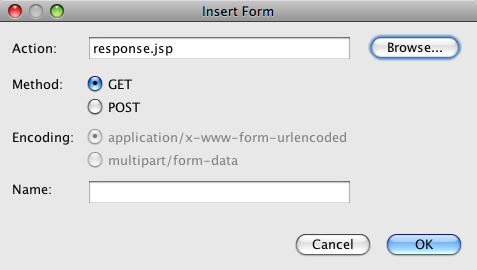
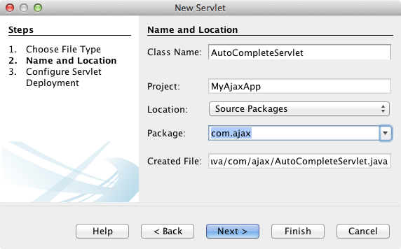
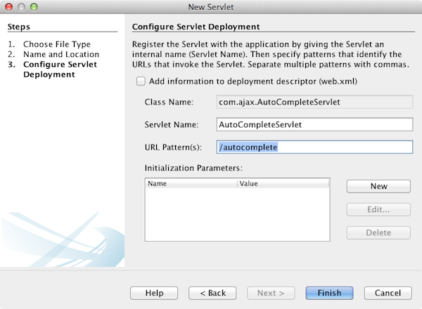
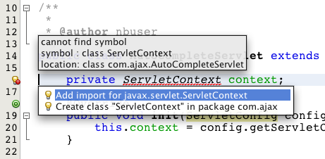
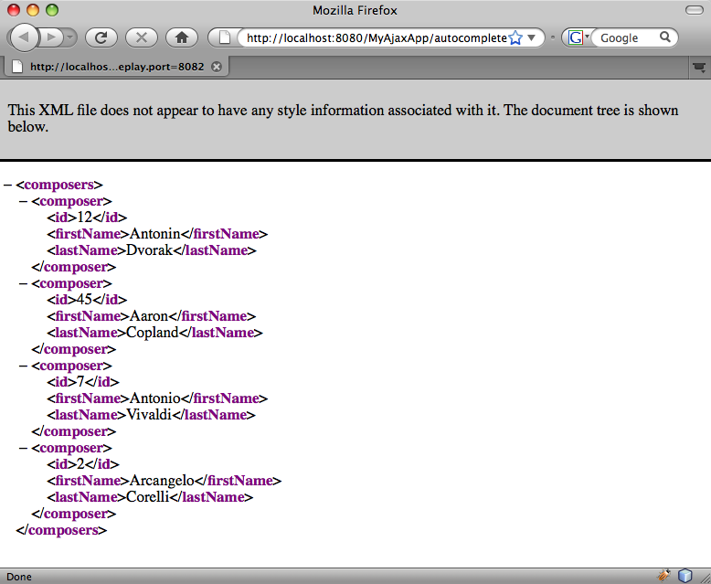

// 
//     Licensed to the Apache Software Foundation (ASF) under one
//     or more contributor license agreements.  See the NOTICE file
//     distributed with this work for additional information
//     regarding copyright ownership.  The ASF licenses this file
//     to you under the Apache License, Version 2.0 (the
//     "License"); you may not use this file except in compliance
//     with the License.  You may obtain a copy of the License at
// 
//       http://www.apache.org/licenses/LICENSE-2.0
// 
//     Unless required by applicable law or agreed to in writing,
//     software distributed under the License is distributed on an
//     "AS IS" BASIS, WITHOUT WARRANTIES OR CONDITIONS OF ANY
//     KIND, either express or implied.  See the License for the
//     specific language governing permissions and limitations
//     under the License.
//

= Introduction to Ajax for Java Web Applications
:jbake-type: tutorial
:jbake-tags: tutorials 
:jbake-status: published
:icons: font
:syntax: true
:source-highlighter: pygments
:toc: left
:toc-title:
:description: Introduction to Ajax for Java Web Applications - Apache NetBeans
:keywords: Apache NetBeans, Tutorials, Introduction to Ajax for Java Web Applications
:reviewed: 2022-01-21

This document provides an introduction to Ajax and demonstrates some of the features in the NetBeans IDE that allow you to program faster and more efficiently when working with Ajax-related technologies. While learning about the low-level functionality of Ajax, you build a simple application that employs auto-completion in a text field. Content here has been adapted from Greg Murray's article and sample application from link:http://weblogs.java.net/blog/gmurray71/archive/2005/12/using_ajax_with_1.html[+Using Ajax with Java Technology+].

Ajax stands for Asynchronous JavaScript and XML. In essence, Ajax is an efficient way for a web application to handle user interactions with a web page - a way that reduces the need to do a page refresh or full page reload for every user interaction. This enables rich behavior (similar to that of a desktop application or plugin-based web application) using a browser. Ajax interactions are handled asynchronously in the background. As this happens, a user can continue working with the page. Ajax interactions are initiated by JavaScript code. When the Ajax interaction is complete, JavaScript updates the HTML source of the page. The changes are made immediately without requiring a page refresh. Ajax interactions can be used to do things such as validate form entries (while the user is entering them) using server-side logic, retrieve detailed data from the server, dynamically update data on a page, and submit partial forms from the page.

*To complete this tutorial, you need the following software and resources.*

|===
|Software or Resource |Version Required 

|xref:../../../download/index.adoc[+NetBeans IDE, Java EE bundle+] | 

|link:http://www.oracle.com/technetwork/java/javase/downloads/index.html[+Java Development Kit (JDK)+] | 8

|link:https://glassfish.java.net/[+GlassFish server+] 
_or_ 
link:http://tomcat.apache.org/index.html[+Tomcat server+] |Open Source Edition 3.1.x or 4.x 
_ _ 
version 7.x or 8.x 
|===

[NOTE]
====
* The Java EE installation of the IDE enables you to optionally install the GlassFish server and the Apache Tomcat servlet container.
* This tutorial assumes that you have a working knowledge of the various technologies it employs (i.e., HTML, CSS, JavaScript, Java and JSP). It attempts to provide an overview of the functionality provided by the code, but _does not_ explain how the code works on a line-to-line basis.
* If you need to compare your project with a working solution, you can link:http://web.archive.org/web/20101218014131/http://netbeans.org/project_downloads/samples/Samples/JavaScript/MyAjaxApp.zip[+download the sample application+].
====

[[overview]]
== Overview of the Application

Imagine a web page in which a user can search for information about musical composers. The page includes a field where the user can enter the name of the composer. In the example application, the entry field has an auto-complete feature. In other words, the user can type in part of the composer name, and the web application attempts to complete the name by listing all composers whose first or last name begins with the characters entered. The auto-complete feature saves the user from having to remember the complete name of the composer and can provide a more intuitive and direct path to the sought-after information.

image::images/sample-app.png[title="Sample application displayed in browser"]

Implementing auto-completion in a search field is something that can be performed using Ajax. Ajax works by employing an `XMLHttpRequest` object to pass requests and responses asynchronously between the client and server. The following diagram illustrates the process flow of the communication that takes place between the client and server.

image::images/ajax-process-flow.png[title="Ajax process flow diagram"]

The process flow of the diagram can be described by the following steps:

1. The user triggers an event, for example by releasing a key when typing in a name. This results in a JavaScript call to a function that initializes an `XMLHttpRequest` object.
2. The `XMLHttpRequest` object is configured with a request parameter that includes the ID of the component that triggered the event, and any value that the user entered. The `XMLHttpRequest` object then makes an asynchronous request to the web server.
3. On the web server, an object such as a servlet or listener handles the request. Data is retrieved from the data store, and a response is prepared containing the data in the form of an XML document.
4. Finally, the `XMLHttpRequest` object receives the XML data using a callback function, processes it, and updates the HTML DOM (Document Object Model) to display the page containing the new data.

This tutorial demonstrates how to construct the auto-complete scenario by following the process flow indicated in the above diagram. You first create the client-side files for the presentation and functionality needed to generate the `XMLHttpRequest` object. Then, you set up the server-side by creating the data store and business logic using Java-based technology. Finally, you return to the client-side and implement `callback()`, and other JavaScript functionality to update the HTML DOM.

[[client1]]
== Programming the Client-Side: Part 1

Begin by creating a new web application project in the IDE. The IDE contains built-in templates for numerous project types.

1. Choose File > New Project. Under Categories, select Java Web. Under Projects, select Web Application then click Next.
2. In the Name and Location panel, enter `MyAjaxApp` for Project Name. The Project Location field enables you to specify the location of the project on your computer. Leave other options at their defaults and click Next. 

image::images/java-name-location.png[title="Specify the name and location for your application project"]

[start=3]
. In the Server and Settings panel, select the server you want to deploy your application to. Only servers that are registered with the IDE are listed. 

image::images/java-server-settings.png[title="Specify the server your application will be deployed to"]

[start=4]
. Accept other default settings and click Finish. The project is generated in your file system and opens in the IDE.

When Java-based web projects are created, an link:http://ant.apache.org/[+Ant+] build script is automatically generated which enables you to compile the project so that it can be immediately deployed and run on a server that has been registered in the IDE.

A default entry page is generated and opens in the IDE's Source Editor. Depending on the target server, the entry page will be either `index.jsp` or `index.html`.

image::images/java-proj-win.png[title="Projects window displays MyAjaxApp project"]

Before beginning to code, quickly try running the application to ensure that configuration between the IDE, your server, and browser is set up properly.

[start=5]
. In the Projects window, right-click the project node and choose Run.

The application is compiled, the application server starts and the application is deployed to it and run. The IDE opens your default browser and displays the default entry page.

=== Using the HTML Editor

image::images/palette.png[title="Palette displaying HTML elements"] 

Now that you are certain your environment is set up correctly, begin by transforming your index page into the auto-completion interface that will be viewed by users.

One of the advantages of using an IDE is that the editor you work in often provides you with code completion which, if you learn to apply it when you code, can rapidly increase your productivity. The IDE's Source Editor generally adapts to the technology you are using, so if you are working in an HTML page, pressing the code completion key combination (Ctrl-Space) will produce suggestions for HTML tags and attributes. As will later be shown, the same applies for other technologies, such as CSS and JavaScript.

A second feature you can make use of is the IDE's Palette. The Palette provides easy-to-use templates for elements that are commonly applied in the technology you are coding in. You simply click on an item, and drag it to a location in the file open in the Source Editor.

You can view large icons (as displayed here) by right-clicking in the Palette and choosing Show Big Icons.

1. Replace the content for the `<title>` and `<h1>`tags to read: `Auto-Completion using AJAX`. The index page requires no server-side scripting code, so you can safely delete any remnants that were created by default. The index page should now appear as shown below.

[source,html]
----

<!DOCTYPE html>

<html>
    <head>
        <meta http-equiv="Content-Type" content="text/html; charset=UTF-8">
        <title>Auto-Completion using AJAX</title>
    </head>
    <body>
        <h1>Auto-Completion using AJAX</h1>
    </body>
</html>

----

. Add some explanatory text to describe the purpose of the text field. You can copy and paste in the following text at a point just beneath the `<h1>` tags:

[source,html]
----

This example shows how you can do real time auto-completion using Asynchronous
    JavaScript and XML (Ajax) interactions.

In the form below enter a name. Possible names that will be completed are displayed
    below the form. For example, try typing in "Bach," "Mozart," or "Stravinsky,"
    then click on one of the selections to see composer details.

----

. Add an HTML form to the page. You can do this by making use of the elements listed in the IDE's Palette. If the Palette is not open, choose Window > Palette from the main menu. Then, under HTML Forms, click on and drag a Form element into the page to a point beneath the `
` tags that you just added. The Insert Form dialog box opens. Specify the following: 

* Action: autocomplete
* Method: GET
* Name: autofillform

Click OK. The HTML `<form>` tags are inserted into the page containing the attributes you specified. (GET is applied by default, and so is not explicitly declared.)

. Add an HTML table to the page. Under the HTML category in the Palette, click on a Table element and drag it to a point between the `<form>` tags. The Insert Table dialog box opens. Specify the following: 

* Rows: 2
* Columns: 2
* Border Size: 0
* Cell Padding: 5

image::images/insert-table.png[title="Insert table dialog"]

. Right-click inside the Source Editor and choose Format. This tidies up the code. Your form should now display similar to that below:

[source,html]
----

<form name="autofillform" action="autocomplete">
  <table border="0" cellpadding="5">
    <thead>
      <tr>
        <th></th>
        <th></th>
      </tr>
    </thead>
    <tbody>
      <tr>
        <td></td>
        <td></td>
      </tr>
      <tr>
        <td></td>
        <td></td>
      </tr>
    </tbody>
  </table>
</form>

----

. Within the first row of the table, type the following text into the first column (changes in *bold*):

[source,html]
----

<td><strong>Composer Name:</strong></td>
----

. Within the second column of the first row, instead of dragging a Text Input field from the Palette, type in the code below manually (changes in *bold*):

[source,html]
----

<td>
    <input type="text"
        size="40"
        id="complete-field"
        onkeyup="doCompletion();">
</td>

----
When you type, try using the IDE's built-in code completion support. For example, type in `<i`, then press Ctrl-Space. A list of suggested options displays below your cursor, and a description of the selected element appears in a box above. You can in fact press Ctrl-Space at anytime you are coding in the Source Editor to bring up possible options. Also, if there is only one possible option, pressing Ctrl-Space will automatically complete the element name. 

image::images/code-completion.png[title="Press Ctrl-Space in the editor to invoke code completion and documentation support"]

The `onkeyup` attribute that you typed in above points to a JavaScript function named `doCompletion()`. This function is called each time a key is pressed in the form text field, and maps to the JavaScript call depicted in the Ajax <<flow-diagram,flow diagram>> above.

[[javascript]]
=== Using the JavaScript Editor

The IDE's JavaScript Editor provides many advanced editing capabilities, such as intelligent code completion, semantic highlighting, instant renaming and refactoring capabilities, as well as many more features.

JavaScript code completion is automatically provided when you code in `.js` files, as well as within `
----

You can quickly toggle between pages opened in the Source Editor by pressing Ctrl-Tab.

. Insert a call to `init()` in the opening `<body>` tag.

[source,html]
----

<body *onload="init()"*>
----
This ensures that `init()` is called each time the page is loaded.

The role of `doCompletion()` is to:

* create a URL that contains data that can be utilized by the server-side,
* initialize an `XMLHttpRequest` object, and
* prompt the `XMLHttpRequest` object to send an asynchronous request to the server.

The `XMLHttpRequest` object is at the heart of Ajax and has become the de facto standard for enabling XML data to be passed asynchronously over HTTP. _Asynchronous_ interaction implies that the browser can continue to process events in the page after the request is sent. Data is passed in the background, and can be automatically loaded into the page without requiring a page refresh.

Notice that the `XMLHttpRequest` object is actually created by `initRequest()`, which is called by `doCompletion()`. The function checks whether `XMLHttpRequest` can be understood by the browser, and if so it creates an `XMLHttpRequest` object. Otherwise, it performs a check on `ActiveXObject` (the `XMLHttpRequest` equivalent for Internet Explorer 6), and creates an `ActiveXObject` if identified.

Three parameters are specified when you create an `XMLHttpRequest` object: a URL, the HTTP method (`GET` or `POST`), and whether or not the interaction is asynchronous. In the above example, the parameters are:

* The URL `autocomplete`, and the text entered into the `complete-field` by the user:

[source,javascript]
----

var url = "autocomplete?action=complete&amp;id=" + escape(completeField.value);
----
* `GET`, signifying that HTTP interactions use the `GET` method, and
* `true`, signifying that the interaction is asynchronous:

[source,javascript]
----

req.open("GET", url, true);
----

If the interaction is set as asynchronous, a callback function must be specified. The callback function for this interaction is set with the statement:

[source,javascript]
----

req.onreadystatechange = callback;
----

and a `callback()` function <<callback,must later be defined>>. The HTTP interaction begins when `XMLHttpRequest.send()` is called. This action maps to the HTTP request that is sent to the web server in the above <<flow-diagram,flow diagram>>.

[[serverside]]
== Programming the Server-Side

The IDE provides comprehensive support for server-side web programming. While this includes basic editor support for many popular programming and scripting languages, it also encompasses web services, such as SOAP, REST, SaaS, and MVC-oriented frameworks, such as JSF, Spring and Struts. Several NetBeans plugins are available from the link:http://plugins.netbeans.org/[+NetBeans Plugin Portal+] for Ajax-driven frameworks, including link:https://developers.google.com/web-toolkit/[+GWT+] and link:http://struts.apache.org/2.x/[+Struts2+].

The application's business logic processes requests by retrieving data from the data store, then preparing and sending the response. This is implemented here using a servlet. Before you begin coding the servlet, set up the data store and the functionality required by the servlet to access data.

* <<data,Creating the Data Store>>
* <<servlet,Creating a Servlet>>

=== Creating the Data Store

For this simple application, you create a class called `ComposerData` that retains composer data using a link:http://download.oracle.com/javase/1.5.0/docs/api/java/util/HashMap.html[+`HashMap`+]. A `HashMap` allows you to store pairs of linked items in key-value pairs. You also create a `Composer` class that enables the servlet to retrieve data from entries in the `HashMap`.

1. Right-click on the project node in the Projects window and choose New > Java Class.
2. Name the class `ComposerData`, and enter `com.ajax` in the Package field. This creates a new package to contain the class, as well as other classes that will later be created.
3. Click Finish. The class is created and opens in the Source Editor.
4. In the Source Editor, paste in the following code:

[source,java]
----

package com.ajax;

import java.util.HashMap;

/**
 *
 * @author nbuser
 */
public class ComposerData {

    private HashMap composers = new HashMap();

    public HashMap getComposers() {
        return composers;
    }

    public ComposerData() {

        composers.put("1", new Composer("1", "Johann Sebastian", "Bach", "Baroque"));
        composers.put("2", new Composer("2", "Arcangelo", "Corelli", "Baroque"));
        composers.put("3", new Composer("3", "George Frideric", "Handel", "Baroque"));
        composers.put("4", new Composer("4", "Henry", "Purcell", "Baroque"));
        composers.put("5", new Composer("5", "Jean-Philippe", "Rameau", "Baroque"));
        composers.put("6", new Composer("6", "Domenico", "Scarlatti", "Baroque"));
        composers.put("7", new Composer("7", "Antonio", "Vivaldi", "Baroque"));

        composers.put("8", new Composer("8", "Ludwig van", "Beethoven", "Classical"));
        composers.put("9", new Composer("9", "Johannes", "Brahms", "Classical"));
        composers.put("10", new Composer("10", "Francesco", "Cavalli", "Classical"));
        composers.put("11", new Composer("11", "Fryderyk Franciszek", "Chopin", "Classical"));
        composers.put("12", new Composer("12", "Antonin", "Dvorak", "Classical"));
        composers.put("13", new Composer("13", "Franz Joseph", "Haydn", "Classical"));
        composers.put("14", new Composer("14", "Gustav", "Mahler", "Classical"));
        composers.put("15", new Composer("15", "Wolfgang Amadeus", "Mozart", "Classical"));
        composers.put("16", new Composer("16", "Johann", "Pachelbel", "Classical"));
        composers.put("17", new Composer("17", "Gioachino", "Rossini", "Classical"));
        composers.put("18", new Composer("18", "Dmitry", "Shostakovich", "Classical"));
        composers.put("19", new Composer("19", "Richard", "Wagner", "Classical"));

        composers.put("20", new Composer("20", "Louis-Hector", "Berlioz", "Romantic"));
        composers.put("21", new Composer("21", "Georges", "Bizet", "Romantic"));
        composers.put("22", new Composer("22", "Cesar", "Cui", "Romantic"));
        composers.put("23", new Composer("23", "Claude", "Debussy", "Romantic"));
        composers.put("24", new Composer("24", "Edward", "Elgar", "Romantic"));
        composers.put("25", new Composer("25", "Gabriel", "Faure", "Romantic"));
        composers.put("26", new Composer("26", "Cesar", "Franck", "Romantic"));
        composers.put("27", new Composer("27", "Edvard", "Grieg", "Romantic"));
        composers.put("28", new Composer("28", "Nikolay", "Rimsky-Korsakov", "Romantic"));
        composers.put("29", new Composer("29", "Franz Joseph", "Liszt", "Romantic"));

        composers.put("30", new Composer("30", "Felix", "Mendelssohn", "Romantic"));
        composers.put("31", new Composer("31", "Giacomo", "Puccini", "Romantic"));
        composers.put("32", new Composer("32", "Sergei", "Rachmaninoff", "Romantic"));
        composers.put("33", new Composer("33", "Camille", "Saint-Saens", "Romantic"));
        composers.put("34", new Composer("34", "Franz", "Schubert", "Romantic"));
        composers.put("35", new Composer("35", "Robert", "Schumann", "Romantic"));
        composers.put("36", new Composer("36", "Jean", "Sibelius", "Romantic"));
        composers.put("37", new Composer("37", "Bedrich", "Smetana", "Romantic"));
        composers.put("38", new Composer("38", "Richard", "Strauss", "Romantic"));
        composers.put("39", new Composer("39", "Pyotr Il'yich", "Tchaikovsky", "Romantic"));
        composers.put("40", new Composer("40", "Guiseppe", "Verdi", "Romantic"));

        composers.put("41", new Composer("41", "Bela", "Bartok", "Post-Romantic"));
        composers.put("42", new Composer("42", "Leonard", "Bernstein", "Post-Romantic"));
        composers.put("43", new Composer("43", "Benjamin", "Britten", "Post-Romantic"));
        composers.put("44", new Composer("44", "John", "Cage", "Post-Romantic"));
        composers.put("45", new Composer("45", "Aaron", "Copland", "Post-Romantic"));
        composers.put("46", new Composer("46", "George", "Gershwin", "Post-Romantic"));
        composers.put("47", new Composer("47", "Sergey", "Prokofiev", "Post-Romantic"));
        composers.put("48", new Composer("48", "Maurice", "Ravel", "Post-Romantic"));
        composers.put("49", new Composer("49", "Igor", "Stravinsky", "Post-Romantic"));
        composers.put("50", new Composer("50", "Carl", "Orff", "Post-Romantic"));

    }
}
----

You will notice that a warning is displayed in the left margin of the editor because the  ``Composer``  class cannot be found. Perform the following steps to create the `Composer` class.

1. Right-click on the project node in the Projects window and choose New > Java Class.
2. Name the class `Composer`, and choose `com.ajax` from the drop-down list in the Package field. Click Finish.

When you click Finish the IDE creates the class and opens the file in the Source Editor.

. In the Source Editor, paste in the following code:

[source,java]
----

package com.ajax;

public class Composer {

    private String id;
    private String firstName;
    private String lastName;
    private String category;

    public Composer (String id, String firstName, String lastName, String category) {
        this.id = id;
        this.firstName = firstName;
        this.lastName = lastName;
        this.category = category;
    }

    public String getCategory() {
        return category;
    }

    public String getId() {
        return id;
    }

    public String getFirstName() {
        return firstName;
    }

    public String getLastName() {
        return lastName;
    }
}
----

After you create the  ``Composer``  class if you look at the  ``ComposerData``  class in the editor you can see that the warning annotations are no longer there. If you still see warning annotations in  ``ComposerData``  you can try to resolve the error by adding any missing import statements.

[[servlet]]
=== Creating a Servlet

Create a servlet to handle the `autocomplete` URL that is received by the incoming request.

1. Right-click on the project node in the Projects window and choose New > Servlet to open the New Servlet wizard. (Choose Other and select Servlet from the Web category if Servlet is not displayed by default in the popup menu.)
2. Name the servlet `AutoCompleteServlet`, and choose `com.ajax` from the drop-down list in the Package field. Click Next.

. In the Configure Servlet Deployment panel, change the URL pattern to *`/autocomplete`* so that it matches the URL that you previously set in the `XMLHttpRequest` object. 

This panel saves you the step of needing to manually add these details to the deployment descriptor.

. Optionally, select "Add servlet information to deployment descriptor." This is so your project is the same as the downloaded sample. With later versions of the IDE, by default the servlet is registered by a `@WebServlet` annotation instead of in a deployment descriptor. The project will still work if you use the `@WebServlet` annotation instead of a deployment descriptor.

. Click Finish. The servlet is created and opens in the Source Editor.

The only methods you need to override are `doGet()`, to define how the servlet handles the `autocomplete` `GET` request, and `init()`, which needs to initiate a `ServletContext` so the servlet can access other classes in the application once it is put into service.

You can override methods from superclasses using the IDE's Insert Code popup menu. Implement `init()` by performing the following steps.

1. Place your cursor beneath the `AutoCompleteServlet` class declaration in the Source Editor. Press Alt-Insert (Ctrl-I on Mac) to open the Generate Code popup menu. 

image::images/insert-code.png[title="Insert Code popup menu displayed in Source Editor"]

. Choose Override Method. In the dialog that displays, all classes that `AutoCompleteServlet` inherits from are displayed. Expand the GenericServlet node and select `init(Servlet Config config)`. 

image::images/new-override.png[title="Override dialog lists inherited classes"]

. Click OK. The `init()` method is added in the Source Editor.

. Add a variable for a `ServletContext` object and modify `init()` (changes in *bold*):

[source,java]
----

private ServletContext context;

@Override
public void init(ServletConfig config) throws ServletException {
    this.context = config.getServletContext();
}
----

. Add an import statement for `ServletContext`. You can do this by clicking on the lightbulb icon that displays in the left margin of the Source Editor 

The `doGet()` method needs to parse the URL of the request, retrieve data from the data store, and prepare a response in XML format. Note that the method declaration was generated when you created the class. To view it, you may need to expand the HttpServlet methods by clicking on the expand icon (image:images/expand-icon.png[]) in the left margin.

1. Add the following variable declarations beneath the `AutocompleteServlet` class declaration.

[source,java]
----

private ComposerData compData = new ComposerData();
private HashMap composers = compData.getComposers();
----
This creates a `HashMap` of all composer data, which is then employed by `doGet()`.

. Scroll down to `doGet()` and implement the method as follows:

[source,java]
----

@Override
public void doGet(HttpServletRequest request, HttpServletResponse response)
        throws IOException, ServletException {

    String action = request.getParameter("action");
    String targetId = request.getParameter("id");
    StringBuffer sb = new StringBuffer();

    if (targetId != null) {
        targetId = targetId.trim().toLowerCase();
    } else {
        context.getRequestDispatcher("/error.jsp").forward(request, response);
    }

    boolean namesAdded = false;
    if (action.equals("complete")) {

        // check if user sent empty string
        if (!targetId.equals("")) {

            Iterator it = composers.keySet().iterator();

            while (it.hasNext()) {
                String id = (String) it.next();
                Composer composer = (Composer) composers.get(id);

                if ( // targetId matches first name
                     composer.getFirstName().toLowerCase().startsWith(targetId) ||
                     // targetId matches last name
                     composer.getLastName().toLowerCase().startsWith(targetId) ||
                     // targetId matches full name
                     composer.getFirstName().toLowerCase().concat(" ")
                        .concat(composer.getLastName().toLowerCase()).startsWith(targetId)) {

                    sb.append("<composer>");
                    sb.append("<id>" + composer.getId() + "</id>");
                    sb.append("<firstName>" + composer.getFirstName() + "</firstName>");
                    sb.append("<lastName>" + composer.getLastName() + "</lastName>");
                    sb.append("</composer>");
                    namesAdded = true;
                }
            }
        }

        if (namesAdded) {
            response.setContentType("text/xml");
            response.setHeader("Cache-Control", "no-cache");
            response.getWriter().write("<composers>" + sb.toString() + "</composers>");
        } else {
            //nothing to show
            response.setStatus(HttpServletResponse.SC_NO_CONTENT);
        }
    }
    if (action.equals("lookup")) {

        // put the target composer in the request scope to display 
        if ((targetId != null) &amp;&amp; composers.containsKey(targetId.trim())) {
            request.setAttribute("composer", composers.get(targetId));
            context.getRequestDispatcher("/composer.jsp").forward(request, response);
        }
    }
}
----

As you can see in this servlet, there is nothing really new you need to learn to write server-side code for Ajax processing. The response content type needs to be set to `text/xml` for cases where you want to exchange XML documents. With Ajax, you can also exchange plain text or even snippets of JavaScript which may be evaluated or executed by the callback function on the client. Note too that some browsers might cache the results, and so it may be necessary to set the Cache-Control HTTP header to `no-cache`.

In this example, the servlet generates an XML document that contains all composers with a first or last name beginning with the characters typed in by the user. This document maps to the XML Data depicted in the <<flow-diagram,flow diagram>> above. Here is an example of an XML document that is returned to the `XMLHttpRequest` object:

[source,html]
----

<composers>
    <composer>
        <id>12</id>
        <firstName>Antonin</firstName>
        <lastName>Dvorak</lastName>
    </composer>
    <composer>
        <id>45</id>
        <firstName>Aaron</firstName>
        <lastName>Copland</lastName>
    </composer>
    <composer>
        <id>7</id>
        <firstName>Antonio</firstName>
        <lastName>Vivaldi</lastName>
    </composer>
    <composer>
        <id>2</id>
        <firstName>Arcangelo</firstName>
        <lastName>Corelli</lastName>
    </composer>
</composers>

----

You can use the IDE's <<httpMonitor,HTTP Monitor>> to view the returned XML data once you complete the application.

[[client2]]
== Programming the Client-Side: Part 2

You must now define the callback function to handle the server's response, and add any functionality necessary to reflect changes in the page that is viewed by the user. This requires modifying the HTML DOM. You need to create JSP pages to display the results of a successful request or the error messages of a failed request. You can then create a simple stylesheet for the presentation.

* <<callback,Adding Callback Functionality>>
* <<htmldom,Updating the HTML DOM>>
* <<displayresults,Displaying the Results>>
* <<stylesheet,Attaching a Stylesheet>>

=== Adding Callback Functionality

The callback function is called asynchronously at specific points during HTTP interaction when the `readyState` property of the `XMLHttpRequest` object changes. In the application you are building, the callback function is `callback()`. You recall that in `doCompletion()`, `callback` was set as the `XMLHttpRequest.onreadystatechange` property to a function. Now, implement the callback function as follows.

1. Open `javascript.js` in the Source Editor and type in the code below.

[source,javascript]
----

function callback() {
    if (req.readyState == 4) {
        if (req.status == 200) {
            parseMessages(req.responseXML);
        }
    }
}
----

A `readyState` of "4" signifies the completion of the HTTP interaction. The API for `XMLHttpRequest.readState` indicates that there are 5 possible values that can be set. These are:

|===
|`readyState` Value |Object Status Definition 

|0 |uninitialized 

|1 |loading 

|2 |loaded 

|3 |interactive 

|4 |complete 
|===

Notice that the `parseMessages()` function is called only when the `XMLHttpRequest.readyState` is "4" and the `status` -- the HTTP status code definition of the request -- is "200", signifying a success. You will define `parseMessages()` next in <<htmldom,Updating the HTML DOM>>.

=== Updating the HTML DOM

The `parseMessages()` function handles the incoming XML data. In doing so, it relies on several ancillary functions, such as `appendComposer()`, `getElementY()`, and `clearTable()`. You must also introduce new elements to the index page, such as a second HTML table which serves as the auto-complete box, and ID's for elements so they can be referenced in `javascript.js`. Finally, you create new variables corresponding to ID's for elements in the index page, initialize them in the `init()` function that you previously implemented, and add some functionality that is needed each time the index page is loaded.

*Note:* The functions and elements that you create in the following steps work interdependently. It is recommended that you work through this section, then examine the code once it is all in place.

1. Open the index page in the Source Editor and type in the below code for the second row of the HTML table you previously created.

[source,html]
----

<tr>
    <td id="auto-row" colspan="2">
        <table id="complete-table" />
    </td>
</tr>
----
The second row of the table contains another HTML table. This table represents the auto-complete box that will be used to populate composer names.

. Open `javascript.js` in the Source Editor and the following three variables to the top of the file.

[source,javascript]
----

var completeField;
var completeTable;
var autoRow;
----

. Add the following lines (in *bold*) to the `init()` function.

[source,javascript]
----

function init() {
    completeField = document.getElementById("complete-field");
    completeTable = document.getElementById("complete-table");
    autoRow = document.getElementById("auto-row");
    completeTable.style.top = getElementY(autoRow) + "px";
}
----
One purpose of `init()` is to make elements inside the index page accessible to other functions that will modify the index page's DOM.

. Add `appendComposer()` to `javascript.js`.

[source,javascript]
----

function appendComposer(firstName,lastName,composerId) {

    var row;
    var cell;
    var linkElement;

    if (isIE) {
        completeTable.style.display = 'block';
        row = completeTable.insertRow(completeTable.rows.length);
        cell = row.insertCell(0);
    } else {
        completeTable.style.display = 'table';
        row = document.createElement("tr");
        cell = document.createElement("td");
        row.appendChild(cell);
        completeTable.appendChild(row);
    }

    cell.className = "popupCell";

    linkElement = document.createElement("a");
    linkElement.className = "popupItem";
    linkElement.setAttribute("href", "autocomplete?action=lookup&amp;id=" + composerId);
    linkElement.appendChild(document.createTextNode(firstName + " " + lastName));
    cell.appendChild(linkElement);
}
----
This function creates a new table row, inserts a link to a composer into it using the data passed to the function via its three parameters, and inserts the row into the index page's `complete-table` element.

. Add `getElementY()` to `javascript.js`.

[source,javascript]
----

function getElementY(element){

    var targetTop = 0;

    if (element.offsetParent) {
        while (element.offsetParent) {
            targetTop += element.offsetTop;
            element = element.offsetParent;
        }
    } else if (element.y) {
        targetTop += element.y;
    }
    return targetTop;
}
----
This function is applied to find the vertical position of the parent element. This is necessary because the actual position of the element, when it is displayed, is often dependent on browser type and version. Note that the `complete-table` element, when displayed containing composer names, is shifted to the lower right of the table in which it exists. The correct height positioning is determined by `getElementY()`. 

NOTE: See link:http://www.quirksmode.org/js/findpos.html[+this explanation+] of `offset` on link:http://www.quirksmode.org/[+http://www.quirksmode.org/+].

. Add `clearTable()` to `javascript.js`.

[source,javascript]
----

function clearTable() {
    if (completeTable.getElementsByTagName("tr").length > 0) {
        completeTable.style.display = 'none';
        for (loop = completeTable.childNodes.length -1; loop >= 0 ; loop--) {
            completeTable.removeChild(completeTable.childNodes[loop]);
        }
    }
}
----
This function sets the display of the `complete-table` element to 'none', (i.e., makes it invisible), and it removes any existing composer name entries that were created.

. Modify the `callback()` function to call `clearTable()` each time new data is received from the server. Any composer entries that already exist in the auto-complete box are therefore removed before it becomes populated with new entries.

[source,javascript]
----

function callback() {

    *clearTable();*

    if (req.readyState == 4) {
        if (req.status == 200) {
            parseMessages(req.responseXML);
        }
    }
}
----

. Add `parseMessages()` to `javascript.js`.

[source,javascript]
----

function parseMessages(responseXML) {

    // no matches returned
    if (responseXML == null) {
        return false;
    } else {

        var composers = responseXML.getElementsByTagName("composers")[0];

        if (composers.childNodes.length > 0) {
            completeTable.setAttribute("bordercolor", "black");
            completeTable.setAttribute("border", "1");

            for (loop = 0; loop < composers.childNodes.length; loop++) {
                var composer = composers.childNodes[loop];
                var firstName = composer.getElementsByTagName("firstName")[0];
                var lastName = composer.getElementsByTagName("lastName")[0];
                var composerId = composer.getElementsByTagName("id")[0];
                appendComposer(firstName.childNodes[0].nodeValue,
                    lastName.childNodes[0].nodeValue,
                    composerId.childNodes[0].nodeValue);
            }
        }
    }
}
----

The `parseMessages()` function receives as a parameter an object representation of the XML document returned by the `AutoComplete` servlet. The function programmatically traverses the XML document, extracting the `firstName`, `lastName`, and `id` of each entry, then passes this data to `appendComposer()`. This results in a dynamic update to the contents of the `complete-table` element. For example, an entry that is generated and inserted into `complete-table` might look as follows:

[source,html]
----

<tr>
    <td class="popupCell">
        <a class="popupItem" href="autocomplete?action=lookup&amp;id=12">Antonin Dvorak</a>
    </td>
</tr>
----

The dynamic update to the `complete-table` element represents the final step of the process flow of communication that takes place during communication using Ajax. This update maps to the HTML &amp; CSS data being sent to the presentation in the <<flow-diagram,flow diagram>> above.

[[displayresults]]
=== Displaying the Results

To display the results, you need a JSP file named `composers.jsp`. This page is called from `AutoCompleteServlet` during a lookup action. You also need an `error.jsp` file, which is called from `AutoCompleteServlet` if the composer cannot be found.

To display results and errors:

1. In the Projects window, right-click the application's Web Pages folder and select New > JSP. The New JSP wizard opens.
2. In the File Name field, type `composer`. In the Created File field, you should see a path ending in `/web/composer.jsp`.
3. Click Finish. The file `composer.jsp` opens in the editor. A node for the file appears in the Projects window in the Web Pages folder.
4. Replace the placeholder code in `composer.jsp` with the following code:

[source,html]
----

<html>
  <head>
    <title>Composer Information</title>

    <link rel="stylesheet" type="text/css" href="stylesheet.css">
  </head>
  <body>

    <table>
      <tr>
        <th colspan="2">Composer Information</th>
      </tr>
      <tr>
        <td>First Name: </td>
        <td>${requestScope.composer.firstName}</td>
      </tr>
      <tr>
        <td>Last Name: </td>
        <td>${requestScope.composer.lastName}</td>
      </tr>
      <tr>
        <td>ID: </td>
        <td>${requestScope.composer.id}</td>
      </tr>
      <tr>
        <td>Category: </td>
        <td>${requestScope.composer.category}</td>
      </tr>      
    </table>

    
Go back to <a href="index.html" class="link">application home</a>.

  </body>
</html>
----

NOTE: You will need to change the link to return to the index page if your index page is  ``index.jsp`` .

. Create another JSP file in the project's Web Pages folder. Name the file `error.jsp`.

. Replace the placeholder code in `error.jsp` with the following code:

[source,html]
----

<!DOCTYPE html>

<html>
    <head>
        <link rel="stylesheet" type="text/css" href="stylesheet.css">      
        <meta http-equiv="Content-Type" content="text/html; charset=UTF-8">
        <title>Seach Error</title>
    </head>
    <body>
        <h2>Seach Error</h2>
        
        
An error occurred while performing the search. Please try again.

        
        
Go back to <a href="index.html" class="link">application home</a>.

    </body>
</html>
----

NOTE: You will need to change the link to return to the index page if your index page is  ``index.jsp`` .

[[stylesheet]]
=== Attaching a Stylesheet

At this stage, you have completed all the code needed for the functionality of the application. To see the results of your efforts, try running the application now.

1. In the Projects window, right-click the project node and choose Run. The project is recompiled and deployed to the target server. Your browser opens, and you can see the index page. 

image::images/no-css.png[title="Successful deployment without stylesheet"]

To add a stylesheet to your application, simply create a `.css` file and link to it from your presentation page(s). When you work in `.css` files, the IDE provides you with code completion support, as well as the following windows to help you generate and edit stylesheet rules.

* *CSS Styles window.* The CSS Styles window enables you to edit the declarations of rules for HTML elements and selectors in a CSS file.
* *Create CSS Rules dialog box.* The Create CSS Rule dialog box enables you to create new rules in a CSS style sheet.
* *Add CSS Property dialog box.*The Add CSS Property dialog box enables you to add declarations to a CSS rule in a style sheet by adding properties and values.

To add a stylesheet to your application perform the following steps.

1. In the Projects window, right-click the Web Pages node and choose New > Cascading Style Sheet (If Cascading Style Sheet is not listed, choose Other. Then choose Cascading Style Sheet from the Web category in the New File wizard.)
2. In the CSS File Name text field, type *`stylesheet`*. Click Finish.

The new file is created and opens in the editor.

. Type the following rules in `stylesheet.css` in the editor. You can make use of the IDE's code completion support by pressing Ctrl-Space at points when you want to call up suggestions.

[source,css]
----

body {
   font-family: Verdana, Arial, sans-serif;
   font-size: smaller;
   padding: 50px;
   color: #555;
   width: 650px;
}

h1 {
   letter-spacing: 6px;
   font-size: 1.6em;
   color: #be7429;
   font-weight: bold;
}

h2 {
   text-align: left;
   letter-spacing: 6px;
   font-size: 1.4em;
   color: #be7429;
   font-weight: normal;
   width: 450px;
}

table {
   width: 550px;
   padding: 10px;
   background-color: #c5e7e0;
}

td {
   padding: 10px;
}

a {
  color: #be7429;
  text-decoration: none;
}

a:hover {
  text-decoration: underline;
}

.popupBox {
  position: absolute;
  top: 170px;
  left: 140px;
}

.popupCell {
   background-color: #fffafa;
}

.popupCell:hover {
  background-color: #f5ebe9;
}

.popupItem {
  color: #333;
  text-decoration: none;
  font-size: 1.2em;
}
----

. Open the CSS Styles window by choosing Window > Web > CSS Styles. 

image::images/css-styles-window.png[title="CSS Styles window displaying h1 rule properties"]

You can use the CSS Styles window to quickly view the properties and edit style rules. When you select a rule in the upper pane of the CSS Style window you can see the properties of the rule in the lower pane. You can add a CSS Rules to the stylesheet by clicking the Edit CSS Rules icon (image:images/newcssrule.png[title="New CSS Property icon"]) in the toolbar of the upper pane. You can modify rules in the lower pane by editing the property sheet and add properties by clicking the Add Property icon () in the toolbar of the lower pane.

. Switch to the index page in the Source Editor, and add a reference to the stylesheet between the `<head>` tags.

[source,html]
----

<link rel="stylesheet" type="text/css" href="stylesheet.css">
----

. Add the `popupBox` class that is defined in the stylesheet to the `complete-table` element (changes in *bold*).

[source,html]
----

<tr>
    <td id="auto-row" colspan="2">
        <table id="complete-table" *class="popupBox"* />
    </td>
</tr>
----

You can use the code completion in the editor to help you select the style rule that you want to apply to the selector.

image::images/css-completion.png[title="CSS code completion in the editor"]

As indicated in `stylesheet.css`, this rule positions the `complete-table` element so that it displays slightly to the right of its parent element.

When you save the index page the application is automatically redeployed to the server. If the page is still open in your browser you can reload the page to see that the page is now rendered according to the rules in the CSS stylesheet.

[[run]]
== Running the Project

When you run the application again, it displays in the browser using the stylesheet you just created. Each time you type in a character, an asynchronous request is sent to the server, and returned with XML data that has been prepared by `AutoCompleteServlet`. As you enter more characters, the number of composer names decreases to reflect the new list of matches.

[[httpMonitor]]
=== Using the HTTP Server Monitor

You can use the IDE's HTTP Server monitor to verify the HTTP communication that takes place as requests and responses are passed between the client and server. The HTTP Server Monitor displays information such as client and server headers, session properties, cookie details, as well as request parameters.

Before you begin using the HTTP monitor, you must first enable it on the server you are using.

1. Open the Servers window by choosing Tools > Servers from the main menu.
2. In the left pane, select the server you are using with the project. Then, in the right pane, select the Enable HTTP Monitor option.

NOTE: This option displays under the Common tab for the GlassFish server. For Tomcat, it resides under the Connection tab.

. Click Close.

If the server is already running, you need to restart it in order to allow changes to take effect. You can restart the server by opening the Services window (Window > Services), then right-clicking your server beneath the Servers node and choosing Restart.

Now, when you run the application again, the HTTP monitor opens in the lower region of the IDE. You can select a record in the left pane, then click the tabs in the main window to view information concerning each request that is made.

image::images/http-monitor.png[title="HTTP Server monitor displays in the IDE"]

You can verify the XML data that is sent from the server as a result of the asynchronous request made when a user enters a character in the auto-complete field.

1. In the tree view on the left side of the HTTP monitor, right-click a request record and choose Replay.

The response is generated in your browser. In this case, because the response consists of XML data, the browser displays the data in it's native XML viewer.

[[conclusion]]
=== Conclusion

This concludes the Introduction to Ajax. Hopefully by now you realize that Ajax is simply exchanging information over HTTP in the background, and updating that page dynamically based on the results.

You may note that the application you built has numerous shortcomings, for example nothing happens when a composer name is selected from the auto-complete box! You are welcome to link:https://netbeans.org/projects/samples/downloads/download/Samples%252FJavaScript%252FMyAjaxApp.zip[+download the solution project+] to see how this can be implemented using JSP technology. Furthermore, you might want to investigate server-side validation that prevents a user from requesting a name that does not exist in the data store. You can learn more about these techniques and technologies by following other tutorials on the xref:../java-ee.adoc[+Java EE &amp; Java Web Learning Trail+].

[[seeAlso]]
== See Also

For more information about Ajax and Java technology on xref:../../../index.adoc[+netbeans.org+], see the following resources:

* xref:js-toolkits-jquery.adoc[+Using jQuery to Enhance the Appearance and Usability of a Web Page+]. Demonstrates how to integrate jQuery core and UI libraries into a NetBeans project.
* xref:js-toolkits-dojo.adoc[+Connecting a Dojo Tree to an ArrayList using JSON+]. Based on a JavaOne Hands-On Lab, this document shows how to implement a Dojo Tree widget into a web page and enable the server-side to respond to Tree requests in JSON format.
* link:http://www.oracle.com/pls/topic/lookup?ctx=nb8000&id=NBDAG2272[+Creating JavaScript Files+] in _Developing Applications with NetBeans IDE_.
* xref:quickstart-webapps-wicket.adoc[+Introduction to the Wicket Web Framework+]. An introduction to creating reusable components and applying them to a web application using the Wicket framework.
