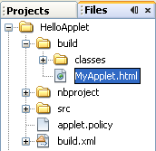
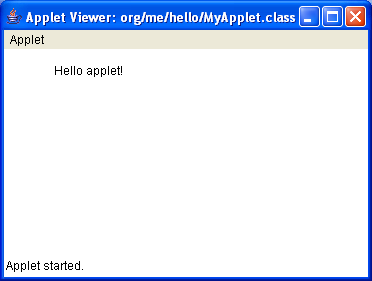
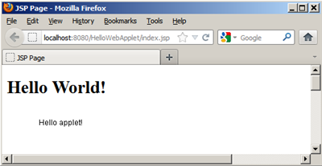

// 
//     Licensed to the Apache Software Foundation (ASF) under one
//     or more contributor license agreements.  See the NOTICE file
//     distributed with this work for additional information
//     regarding copyright ownership.  The ASF licenses this file
//     to you under the Apache License, Version 2.0 (the
//     "License"); you may not use this file except in compliance
//     with the License.  You may obtain a copy of the License at
// 
//       http://www.apache.org/licenses/LICENSE-2.0
// 
//     Unless required by applicable law or agreed to in writing,
//     software distributed under the License is distributed on an
//     "AS IS" BASIS, WITHOUT WARRANTIES OR CONDITIONS OF ANY
//     KIND, either express or implied.  See the License for the
//     specific language governing permissions and limitations
//     under the License.
//

= 在 Web 应用程序中集成小应用程序
:jbake-type: tutorial
:jbake-tags: tutorials 
:jbake-status: published
:icons: font
:syntax: true
:source-highlighter: pygments
:toc: left
:toc-title:
:description: 在 Web 应用程序中集成小应用程序 - Apache NetBeans
:keywords: Apache NetBeans, Tutorials, 在 Web 应用程序中集成小应用程序

小应用程序是采用 Java 编程语言编写的程序，该程序可以包含在 HTML 页中，与在页中包含图像的方式大致相同。本教程中构建的应用程序向您展示了如何在 IDE 中构建和部署小应用程序。

*注：*尽管没有专门设计用于在 IDE 中创建小应用程序的项目模板，但是您可以在 Java 项目中轻松开发它们并将其打包在 Web 项目中，如本教程所示。

image::images/netbeans-stamp-80-74-73.png[title="此页上的内容适用于 NetBeans IDE 7.2、7.3、7.4 和 8.0"]

*要学习本教程，您需要具备以下软件和资源。*

|===
|软件或资源 |要求的版本 

|link:https://netbeans.org/downloads/index.html[+NetBeans IDE+] |7.2、7.3、7.4、8.0、Java 版本 

|link:http://www.oracle.com/technetwork/java/javase/downloads/index.html[+Java 开发工具包 (JDK)+] |版本 7 或 8 

|GlassFish Server Open Source Edition 
_或_ 
Tomcat Servlet 容器 |3.x 或 4.x
_ _ 
版本 7.x 或 8.x 
|===

== 创建或导入小应用程序源文件

在此部分中，您将创建第一个小应用程序。可能已经拥有了一个小应用程序，如果是这样，您可以使用下面的说明将其导入到 IDE 中。

=== 从头开始创建 Java 项目或从现有源创建 Java 项目

1. 选择 "File"（文件）> "New Project"（新建项目）（Ctrl-Shift-N 组合键）。在 "Categories"（类别）下，选择 "Java"。
2. 执行以下操作之一：
* 如果是创建一个新的小应用程序源文件，请在 "Projects"（项目）下选择 "Java Class Library"（Java 类库）。单击 "Next"（下一步）。
* 如果想导入小应用程序源文件，则选择 "Java Project with Existing Sources"（基于现有源代码的 Java 项目）。单击 "Next"（下一步）。在 "Source Packages Folder"（源包文件夹）文本框中指定该文件的位置。

. 在 "Project Name"（项目名称）下，键入  ``HelloApplet`` 。将 "Project Location"（项目位置）更改为计算机上的任意文件夹。

. 单击 "Finish"（完成）。如果已导入一个小应用程序源文件，则<<runanddebug,运行该文件>>。

=== 创建小应用程序源文件

1. 右键单击 HelloApplet 项目，然后选择 "Properties"（属性）以打开 "Properties"（属性）窗口。
2. 为项目选择所需的源代码/二进制格式，然后单击 "OK"（确定）。

*注：*例如，如果选择 JDK 6，则小应用程序可能不会在具有旧版本 JRE 或 Java 浏览器插件的计算机上运行。

. 右键单击 "Projects"（项目）窗口中的 HelloApplet 项目节点，然后选择 "New"（新建）> "Other"（其他）（Ctrl-N 组合键）。

. 在 "Categories"（类别）下，选择 "Java"。在 "File Types"（文件类型）下，选择 "Applet"（小应用程序）。

或者，如果想以可视方式设计您的小应用程序，则选择 "Swing GUI Forms"（Swing GUI 窗体）> "JApplet Form"（JApplet 窗体）。

单击 "Next"（下一步）。

. 在 "Class Name"（类名）下，键入  ``MyApplet`` 。在 "Package"（包）下，键入  ``org.me.hello`` 。

. 单击 "Finish"（完成）。

IDE 会在指定的包中创建小应用程序源文件。小应用程序源文件会在源代码编辑器中打开。

. 通过复制以下代码并将其粘贴到现有默认代码上来定义您的小应用程序类：

[source,java]
----

     package org.me.hello;

     import java.applet.Applet;
     import java.awt.Graphics;

     public class MyApplet extends Applet {
         @Override
         public void paint(Graphics g) {
             g.drawString("Hello applet!", 50, 25);
         }
     }
                    
----

或者，如果您在设计小应用程序窗体，则使用link:../java/quickstart-gui.html[+在 NetBeans IDE 中设计 Swing GUI+] 文档来创建类似于下图的内容：

image::images/movie-magic-quiz-design.png[]

有关编写小应用程序的详细信息，请参见 Java^TM^ 教程的link:http://download.oracle.com/javase/tutorial/deployment/applet/index.html[+小应用程序+]部分。

== 运行小应用程序源文件

可以在 IDE 中运行您创建的小应用程序。此部分向您介绍如何进行该操作。

=== 构建和运行小应用程序源文件

在 "Projects"（项目）窗口中，右键单击 MyApplet.java 文件节点，然后从上下文菜单中选择 "Run File"（运行文件）。将在  ``build``  文件夹中创建嵌入了小应用程序的  ``MyApplet.html``  启动程序文件，如果切换到 "Files"（文件）窗口（Ctrl-2 组合键），便可查看该文件：

在小应用程序查看器中启动小应用程序：

还可以在小应用程序查看器中显示小应用程序窗体：

image::images/movie-magic-quiz.png[]

== 在 Web 应用程序中嵌入小应用程序

您的小应用程序已经完成。现在需要使它可用于用户。为此，创建一个 Web 应用程序，将小应用程序 JAR 放置在其类路径上，然后向 Web 应用程序的 HTML 文件中添加一个小应用程序标记。

=== 创建 Web 项目

1. 选择 "File"（文件）> "New Project"（新建项目）。
2. 在 "Java Web" 类别中选择 "Web Application"（Web 应用程序）。单击 "Next"（下一步）。
3. 在 "Project Name"（项目名称）下，键入  ``HelloWebApplet`` 。
4. 将 "Project Location"（项目位置）更改为计算机上的任意文件夹。单击 "Next"（下一步）。
5. 选择目标服务器。单击 "Finish"（完成）。

=== 向 Web 项目中添加小应用程序 JAR 文件

如果想在 Web 项目中包含小应用程序 JAR 文件，则可以通过添加包含 JAR 文件的 Java 项目或通过添加 JAR 文件本身来执行该操作。尽管由您来选择，但请注意，当向 Web 项目中添加 Java 项目时，只要构建 Web 应用程序，IDE 就能够构建小应用程序。因此，当在 Java 项目中修改小应用程序时，只要构建 Web 项目，IDE 就会构建一个新版本的小应用程序。另一方面，如果小应用程序 JAR 文件不在 NetBeans IDE 项目中，则构建 Web 项目时不会重新构建小应用程序源文件。

*注：*如果在 IDE 中使用  ``HelloApplet``  项目，则此时没有  ``HelloApplet.jar``  文件。这很正常。构建  ``HelloWebApplet``  项目时将会构建  ``HelloApplet.jar``  文件。

1. 在 "Projects"（项目）窗口中，右键单击 HelloWebApplet 项目节点，然后从上下文菜单中选择 "properties"（属性）。
2. 选择 "Packaging"（打包）类别。
3. 执行以下操作之一：
* 如果小应用程序在某个 Java 项目中，则单击 "Add Project"（添加项目），然后查找包含该 Java 项目的文件夹。单击 "Add JAR/Folder"（添加 JAR/文件夹）。

*注：*IDE 项目由 NetBeans IDE 项目图标标记。

* 如果您使用的小应用程序 JAR 文件不在 IDE 项目中，请单击 "Add File/Folder"（添加文件/文件夹），然后查找包含该 JAR 文件的文件夹。单击 "Choose"（选择）。

. 确认在 "Project Properties"（项目属性）窗口的表中列出包含小应用程序源文件的 JAR。单击 "OK"（确定）。

默认情况下，会将小应用程序 JAR 文件复制到 Web 应用程序的 Web 页库，即  ``build/web `` 文件夹中。 ``build/web``  文件夹是应用程序的根目录，且在表 WAR 列的 "Path"（路径）中显示为 " ``/`` "。通过在 WAR 列的 "Path"（路径）中键入小应用程序的新位置，可以修改 WAR 中的小应用程序位置。

. 单击 "Close"（关闭）以关闭 "Project Properties"（项目属性）窗口。

在构建  ``HelloWebApplet``  项目（从 IDE 的主菜单中选择 "Run"（运行）> "Build Project (HelloWebApplet)"（构建项目 (HelloWebApplet)））时，小应用程序的 JAR 文件将在原始的  ``HelloApplet``  项目中生成，并在  ``HelloWebApplet``  项目的 WAR 文件中打包。还会将其添加到  ``build/Web``  文件夹中。可在 "Output"（输出）窗口中执行此过程，并在 "Files"（文件）窗口中查看结果。

[.feature]
--
image:images/helloapplet-jar-in-files-small.png[role="left", link="images/helloapplet-jar-in-files.png"]
--

=== 创建和运行 JSP 文件或 HTML 文件

1. 执行以下操作之一：
* 如果想将小应用程序嵌入到 JSP 文件中，则在 "Projects"（项目）窗口中，双击默认的  ``index.jsp``  文件。当创建 Web 项目时，由 IDE 创建该文件。将在源代码编辑器中打开该文件。
* 如果想将小应用程序嵌入到 HTML 文件中，则右键单击 HelloWebApplet 项目节点，然后从上下文菜单中选择 "New"（新建）> "Other"（其他）。在 "Categories"（类别）下，选择 "Web"。在 "File Types"（文件类型）下，选择 "HTML"。单击 "Next"（下一步）。指定 HTML 文件的名称，选择 Web 文件夹作为其位置，然后单击 "Finish"（完成）。

. 通过在文件的  ``<body>``  ``</body>``  标记之间的任意位置添加以下小应用程序标记，将小应用程序嵌入到该文件中：

* 在 HTML 文件中：[examplecode]# ``<applet code="org.me.hello.MyApplet" archive="HelloApplet.jar"></applet>``  #
* 在 JSP 文件中：[examplecode]# ``<applet code="org.me.hello.MyApplet" archive="HelloApplet.jar" width="600" height="480"/>`` #

*注：*

* 对于本教程，如果将小应用程序代码添加到 HTML 文件中，则可以忽略左旁注中的提示图标。
*  ``org.me.hello.MyApplet``  是您的小应用程序的完整类名。
*  ``HelloApplet.jar``  是包含此小应用程序的 JAR 文件。

. 右键单击 "Projects"（项目）窗口中的 JSP 节点或 HTML 节点，然后从上下文菜单中选择 "Run File"（运行文件）。

服务器将 JSP 文件或 HTML 文件部署在 IDE 的默认浏览器中。

您应该看到类似于下图的内容（在 "Security Warning"（安全警告）对话框中单击 "Run"（运行）以允许运行应用程序之后）：

[.feature]
--

--

对于小应用程序窗体，您应该看到类似于下图的内容：

image::images/movie-magic-quiz-html.png[]

link:/about/contact_form.html?to=3&subject=Feedback:%20Introduction%20to%20Developing%20Applets[+发送有关此教程的反馈意见+]

