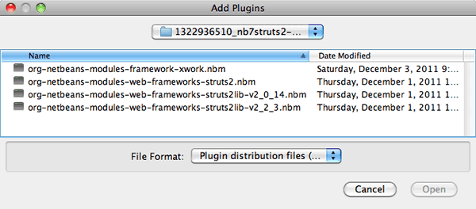
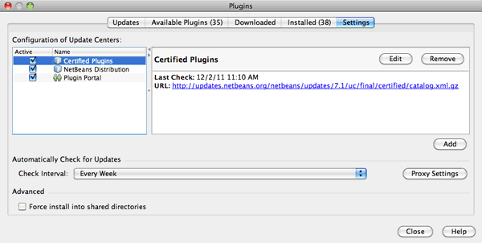
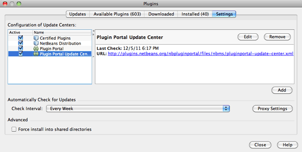

// 
//     Licensed to the Apache Software Foundation (ASF) under one
//     or more contributor license agreements.  See the NOTICE file
//     distributed with this work for additional information
//     regarding copyright ownership.  The ASF licenses this file
//     to you under the Apache License, Version 2.0 (the
//     "License"); you may not use this file except in compliance
//     with the License.  You may obtain a copy of the License at
// 
//       http://www.apache.org/licenses/LICENSE-2.0
// 
//     Unless required by applicable law or agreed to in writing,
//     software distributed under the License is distributed on an
//     "AS IS" BASIS, WITHOUT WARRANTIES OR CONDITIONS OF ANY
//     KIND, either express or implied.  See the License for the
//     specific language governing permissions and limitations
//     under the License.
//

= Adicionando Suporte Para um Framework da Web
:jbake-type: tutorial
:jbake-tags: tutorials 
:jbake-status: published
:icons: font
:syntax: true
:source-highlighter: pygments
:toc: left
:toc-title:
:description: Adicionando Suporte Para um Framework da Web - Apache NetBeans
:keywords: Apache NetBeans, Tutorials, Adicionando Suporte Para um Framework da Web

Este documento fornece uma descrição geral de como adicionar suporte para um framework da Web no NetBeans IDE. As etapas fornecidas mostram como você pode adicionar suporte, instalando um plug-in de framework da Web no IDE usando o Gerenciador de Plug-ins. Depois de instalar o plug-in, você poderá selecionar o framework no assistente Novo Projeto quando criar um projeto Web. O novo projeto Web que você cria irá conter a infraestrutura específica necessária para o framework escolhido.

A forma mais fácil de adicionar suporte para um determinado framework da Web é instalando um plug-in do NetBeans e usando o gerenciador de Plug-ins do IDE, se estiver disponível. Isso é conveniente se você tiver acesso à Internet enquanto trabalha no IDE. Plug-ins para muitos frameworks da Web também estão disponíveis no link:http://plugins.netbeans.org/PluginPortal/[+Portal de Plug-ins do NetBeans+]. Caso não tenha acesso regular à Internet, você pode fazer download dos módulos de plug-in (por exemplo, no Portal de Plug-ins) quando tiver oportunidade e instalá-los no IDE mais tarde.

Neste tutorial você irá adicionar o suporte para o framework Apache Struts 2 fazendo download de um plug-in do Portal de Plug-in do NetBeans e instalando o plug-in usando o gerenciador de Plug-ins.

*Observação: *o IDE encapsula suporte para os frameworks link:../../docs/web/jsf20-support.html[+JavaServer Faces 2.x+] e link:../../docs/web/quickstart-webapps-struts.html[+Struts 1.3.10+] e link:../../docs/web/quickstart-webapps-spring.html[+Spring 3.x e 4.x+]. A versão específica do framework encapsulado depende da versão do IDE.

image::images/netbeans-stamp-80-74-73.png[title="O conteúdo desta página se aplica ao NetBeans IDE 7.2, 7.3, 7.4 e 8.0"]

*Para concluir este tutorial, você precisa dos seguintes recursos e softwares.*

|===
|Software ou Recurso |Versão Necessária 

|link:https://netbeans.org/downloads/index.html[+NetBeans IDE, pacote Java EE+] |7.2, 7.3, 7.4, 8.0 

|link:http://www.oracle.com/technetwork/java/javase/downloads/index.html[+JDK (Java Development Kit)+] |versão 7 ou 8 
|===

*Observações:*

* A instalação Web e Java EE permite que você instale, como opção, o GlassFish Server 3.1 e o contêiner do servlet Apache Tomcat 7.x. Dependendo do framework que planeja usar, você deve instalar um deles para trabalhar neste tutorial.
* Você também deve ter uma conexão com a Internet para fazer download dos plug-ins necessários e/ou acessá-los por meio do Gerenciador de Plug-ins do IDE.

== Instalando os Plug-ins para Suporte do Framework

Você pode adicionar suporte para um framework específico, instalando o plug-in de suporte a framework apropriado no IDE. Para fazê-lo, você pode fazer download dos módulos de plug-ins de um site externo, como o link:http://plugins.netbeans.org/PluginPortal/[+Portal de Plug-ins do NetBeans+] e, em seguida, instalar o plug-in por meio do Gerenciador de Plug-ins ou, se o plug-in for mantido por uma Central de Atualização, você poderá se registrar na central de atualização com o Gerenciador de Plug-ins do IDE e, em seguida, fazer download e instalar o plug-in diretamente por meio do Gerenciador de Plug-ins.

* <<manually,Fazendo Download Manualmente>>
* <<updateCenter,Instalando de uma Central de Atualização>>

Alguns plug-ins estão disponíveis para download em sites, como o link:http://plugins.netbeans.org/PluginPortal/[+Portal de Plug-ins do NetBeans+] ou diretamente do site do desenvolvedor do plug-in. A tabela a seguir fornece os links para locais onde você pode fazer download de alguns plug-ins para frameworks.

|===
|Framework |Localização do Plug-in |Localização do Download 

|link:http://struts.apache.org/[+Apache Struts 2+] |link:http://java.net/projects/nbstruts2support/[+http://java.net/projects/nbstruts2support/+] |link:http://plugins.netbeans.org/plugin/39218/struts2-support-repack-for-nb-7-0[+ http://plugins.netbeans.org/plugin/39218/struts2-support-repack-for-nb-7-0+] 

|link:http://wicket.apache.org/[+Wicket+] |link:http://nbwicketsupport.dev.java.net/[+https://nbwicketsupport.dev.java.net+] |link:http://plugins.netbeans.org/PluginPortal/faces/PluginDetailPage.jsp?pluginid=3586[+ http://plugins.netbeans.org/PluginPortal/faces/PluginDetailPage.jsp?pluginid=3586+] 

|link:http://www.icefaces.org/main/home/[+ICEfaces 2.0+] |link:http://www.icefaces.org/main/home/[+http://www.icefaces.org/main/home/+] |link:http://www.icefaces.org/main/downloads/[+ http://www.icefaces.org/main/downloads/+] 
|===

=== Fazendo Download e Instalando o Plug-in Apache Struts2 Support

Para fins de demonstração, esta seção irá descrever como fazer download e instalar o plug-in link:http://plugins.netbeans.org/plugin/39218/struts2-support-repack-for-nb-7-0[+Apache Struts2 Support Repack for NB 7.0+] do Portal de Plug-ins do NetBeans. Este plug-in instala as bibliotecas e o suporte de IU para o Apache Struts 2.

*Observação.* O plug-in reencapsula o link:http://java.net/projects/nbstruts2support/[+plug-in NetBeans Struts2 Support+], pois o plug-in NetBeans Struts2 Support não foi atualizado para o NetBeans IDE 7.0. Para obter informações adicionais sobre cada um dos plug-ins, consulte as páginas de detalhes dos respectivos pluh-ins.

1. Faça download do arquivo compactado zip que contém os plug-ins necessários do Apache Struts 2 da link:http://plugins.netbeans.org/plugin/39218/struts2-support-repack-for-nb-7-0[+ página Struts2 Support Repack para NB 7.0+] no link:http://plugins.netbeans.org/PluginPortal/[+Portal de Plug-ins do NetBeans+] e faça a extração do conteúdo para o computador.

Após ter extraído o conteúdo, você verá que o arquivo compactado contém três arquivos.

*  ``org-netbeans-modules-web-frameworks-struts2.nbm`` 
*  ``org-netbeans-modules-web-frameworks-struts2lib218.nbm`` 
*  ``org-netbeans-modules-web-frameworks-struts2lib20011.nbm`` 

Os plug-ins do NetBeans podem ser identificados pela extensão  ``.nbm`` .

. No menu principal do IDE, selecione Ferramentas > Plug-ins para abrir o Gerenciador de Plug-ins.

. Selecione a guia Download e clique no botão Adicionar Plug-ins.

. Na caixa de diálogo Adicionar Plug-ins, navegue para o diretório que contém os plug-ins e selecione Plug-ins do NetBeans. Clique em Abrir.

Mantenha pressionada a tecla Ctrl para selecionar vários itens.

. No gerenciador de Plug-ins, selecione cada um dos plug-ins do Struts 2.

Uma descrição do plug-in selecionado será exibida no painel direito do gerenciador de Plug-ins.

[.feature]
--

image::images/add-plugins-sm.png[role="left", link="images/add-plugins.png"]

--

. Clique em Instalar para abrir o Instalador do NetBeans IDE e, em seguida, clique em Próximo e aceite o contrato de licença.

*Observação.* Se você receber uma advertência de validação, clique em Continuar para instalar o plug-in. Um advertência de validação ocorre se você tentar instalar um plug-in que não foi assinado. Embora você geralmente possa confiar em todos os plug-ins, quando instala um plug-in que não foi assinado, estará fazendo isso por seu próprio risco.

. Reinicie o IDE para que as alterações tenham efeito.

Depois de ter instalado o plug-in e reiniciado o IDE, você poderá confirmar se o plug-in foi instalado ao abrir o gerenciador de Plug-ins, clicando na guia Instalados e localizando o plug-in na lista de plug-ins instalados.

=== Instalando de uma Central de Atualização

Se o plug-in de suporte a framework for mantido por uma central de atualizaçção, você deverá pensar em instalar a central de atualização no IDE. Isso permite que você depois instale o plug-in de suporte a framework diretamente por meio do gerenciador de Plug-ins. Além disso, o gerenciador de Plug-ins registra quaisquer atualização em plug-ins mantidos pelas centrais de atualização, oferecendo-lhe um meio simples e eficaz de manter atualizados os plug-ins instalados.

Várias centrais de atualização já estão registradas no IDE por default. Para ver uma lista das centrais de atualização que estão registradas no momento, abra o gerenciador de Plug-ins (Ferramentas > Plug-ins) e selecione a guia Definições.

[.feature]
--

--

Caso deseje registrar um nova central de atualização, clique no botão Adicionar na guia Definições e forneça os detalhes no Personalizador da Central de Atualização.

image::images/uc-customizer.png[title="Caixa de diálogo Personalizador da Central de Atualização"] 

=== Registrando na Central de Atualização do Portal de Plug-ins do NetBeans

A central de atualização do Portal de Plug-ins que está registrada no IDE por default, contém um subconjunto dos plug-ins enviados pela comunidade e que sabemos ser compatíveis com a versão do IDE que você instalou. Caso deseje usar o gerenciador de Plug-ins para procurar por todos os plug-ins que estão disponíveis no link:http://plugins.netbeans.org/[+Portal de Plug-ins do NetBeans+], poderá executar as etapas a seguir para instalar um plug-in a ser adicionado à Central de Atualização do Portal de Plug-ins do NetBeans na lista de centrais de atualização registradas.

1. Faça download do link:http://plugins.netbeans.org/plugin/1616/plugin-portal-update-center[+plug-in da Central de Atualização do Portal de Plug-ins do NetBeans+].
2. Abra a guia Download no gerenciador de Plug-ins.
3. Clique em Adicionar plug-ins e localize o arquivo  ``1252666924798_org-netbeans-pluginportaluc.nbm``  do qual você fez download. Clique em Instalar.

Após você ter instalado o plug-in, a Central de Atualização do Portal de Plug-ins do NetBeans será adicionada à lista de centrais de atualização registradas na guia Definições do gerenciador de Plug-ins

*Observação.* Você pode desativar uma central de atualização desmarcando a caixa de seleção da central de atualização na coluna Ativa da guia Definições.

[.feature]
--

--

Se você clicar na guia Plug-ins Disponíveis, poderá ver que todos os plug-ins que foram contribuídos pela comunidade para o Portal de Plug-ins do NetBeans foram adicionados à lista de plug-ins disponíveis.

Clique em Recarregar Catálogo para atualizar a lista de plug-ins.

[.feature]
--

image::images/portal-uc-list-sm.png[role="left", link="images/portal-uc-list.png"]

--

Você pode classificar a lista ao clicar em um cabeçalho de coluna e pode filtrar a lista ao digitar termos no campo Pesquisar.

* A Central de Atualização do Portal de Plug-ins lista todos os plug-ins que estão disponíveis no link:http://plugins.netbeans.org/[+Portal de Plug-ins do NetBeans+]. Muitos dos plug-ins serão para versões mais antigas do IDE e serão incompatíveis com a versão do IDE que você estiver usando. Instalar plug-ins para outras versões do IDE pode tornar sua instalação do IDE instável.* Em muitos casos, mas não todos, haverá uma mensagem informando se um plug-in não puder ser instalado. Assim como na instalação de todos os softwares, você deve tomar cuidado e ler atentamente a documentação, antes de tentar instalar o plug-in.

== Trabalhando com Suporte a Framework no IDE

O suporte a framework no IDE é geralmente específico para o framework em que você está trabalhando. Por exemplo, o suporte para o Struts2 fornece assistentes que permitem criar com facilidade classes Strut de uso comum, assim como a funcionalidade de autocompletar código nos arquivos de configuração do Struts.

Você pode adicionar suporte a framework em uma aplicação Web por meio do assistente Novo Projeto no momento em que cria a aplicação, ou pode integrar o suporte com uma aplicação existente.

* <<newProject,Criando um Novo Projeto com Suporte a Framework>>
* <<existingProject,Adicionando Suporte a Framework a um Projeto Existente>>

=== Criando um Novo Projeto com Suporte de Framework

1. Escolha Arquivo > Novo Projeto (Ctrl-Shift-N; &amp;#8984-Shift-N no Mac) no menu principal. O Assistente Novo Projeto será Aberto. Selecione Web em Categorias e, em seguida, em Projetos, selecione Aplicação Web. Clique em Próximo.
2. Digite um nome para o Nome do Projeto e especifique um local para o projeto em seu computador.
3. Passe pelo assistente e aceite quaisquer definições default. Especifique um servidor para implantar a aplicação, selecionando um que já esteja registrado no IDE (ou seja, GlassFish Server ou Tomcat).
4. No painel Frameworks do assistente Novo Projeto, feche o framework que deseja adicionar. Clique em Finalizar. 

image::images/newproject-wizard-frameworks-sm.png[title="Struts 2 Support listado no painel Frameworks do assistente Novo Projeto"]

Neste exemplo, o suporte para o framework Struts2 é selecionado no painel Frameworks. Você pode ver que o painel Frameworks agora oferece a opção para escolher o Struts 1.3.8 (incorporado com o IDE) ou Struts2 (adicionado ao instalar um plug-in). O plug-in de suporte do Struts 2 adiciona a opção Struts2 ao assistente Novos Projetos e exibe guias com opções para Configuração e Bibliotecas. A guia Configuração fornece a opção de criar uma página de exemplo no projeto. A guia Bibliotecas permite selecionar a versão das bibliotecas Strut2 que você deseja adicionar no classpath.

Quando você clicar em Finalizar, o IDE criará a aplicação Web. Os arquivos adicionais que o assistente cria irão variar de acordo com o framework. Neste exemplo, o assistente criou o arquivo XML de configuração  ``struts.xml``  na pasta Pacotes de Código-Fonte e adicionou as bibliotecas Struts2 necessárias no classpath. O assistente também adicionou automaticamente uma classe de filtro Servlet e um mapeamento de filtro ao  ``web.xml`` .

image::images/project-structure-frameworks.png[title="Estrutura lógica de aplicação Web Struts exibida na janela Projetos"]  

=== Adicionando Suporte a Framework a um Projeto Existente

Caso você tenha um projeto Web existente e gostaria de adicionar o suporte a um framework para o projeto, poderá usar a caixa de diálogo Propriedades do Projeto para adicionar frameworks que estão disponíveis no IDE.

1. Na janela Projetos, clique com o botão direito do mouse no nó do projeto da aplicação web e esolha Propriedades para abrir a janela Propriedades do Projeto.
2. Selecione Frameworks na lista de Categorias.

Quando você selecionar Frameworks o painel direito exibe uma área de texto de Frameworks Usado, que fica vazia caso a aplicação não usa um framework.

. Clique no botão Adicionar e, em seguida, selecione o framework que deseja usar e clique em OK. 

image::images/properties-add-framework.png[title="Framework JavaServer Faces selecionado na caixa de diálogo Adicionar Framework aberta na janela Propriedades do Projeto"]

. Dependendo do framework escolhido, você pode especificar definições ou componentes de configuração específicas do framework na janela Propriedades do Projeto. 

image::images/add-icefaces.png[title="Adicionando uma biblioteca do conjunto de componentes ICEfaces ao projeto"]

Por exemplo, se quiser especificar o conjunto de componentes ICEfaces você pode selecionar ICEfaces na guia Componentes da janela Propriedades do Projeto e especificar a biblioteca ICEfaces.

*Observações.* As bibliotecas dos componentes JSF não estão incluídas no IDE. Para usar um conjunto de componentes você precisa fazer download das bibliotecas necessárias e, em seguida, criar uma biblioteca NetBeans que você pode adicionar ao classpath do projeto na janela Propriedades do Projeto.

. Clique em OK para confirmar sua seleção e feche a janela Propriedades do Projeto. Os artefatos e bibliotecas específicos do framework são adicionados ao seu projeto, que você pode examinar na janela Projetos.
link:/about/contact_form.html?to=3&subject=Feedback:%20Adding%20Web%20Framework%20Support[+ Enviar Feedback neste Tutorial+]

== Consulte Também

Este documento descreveu como adicionar suporte para um framework da Web no NetBeans IDE. Ele demonstra como instalar os plug-ins de suporte a framework fazendo download manualmente ou por meio de uma central de atualização no Gerenciador de Plug-ins do IDE. Ele também mostrou como adicionar um framework suportado pelo IDE em um novo projeto de aplicação Web e em um projeto existente.

Este tutorial focou na adição do framework Struts2. Caso deseje explorar as outras finalidades oferecidas por este framework, consulte link:../../docs/web/quickstart-webapps-struts.html[+Introdução ao Framework Web Struts+].

Para obter mais informações sobre o uso de outros frameworks da Web no NetBeans IDE, consulte os seguintes recursos:

* link:../../docs/web/quickstart-webapps-spring.html[+Introdução ao Spring Web Framework+]
* link:../../docs/web/quickstart-webapps-struts.html[+Introdução ao Struts Web Framework+]
* link:../../docs/web/quickstart-webapps-wicket.html[+Introdução ao Wicket Web Framework+]
