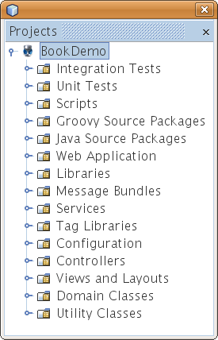
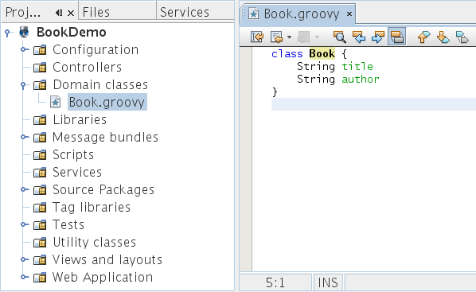
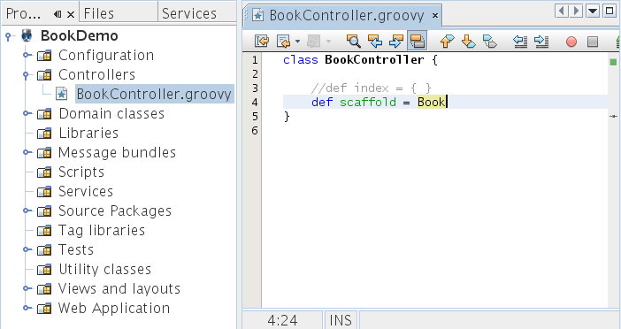

// 
//     Licensed to the Apache Software Foundation (ASF) under one
//     or more contributor license agreements.  See the NOTICE file
//     distributed with this work for additional information
//     regarding copyright ownership.  The ASF licenses this file
//     to you under the Apache License, Version 2.0 (the
//     "License"); you may not use this file except in compliance
//     with the License.  You may obtain a copy of the License at
// 
//       http://www.apache.org/licenses/LICENSE-2.0
// 
//     Unless required by applicable law or agreed to in writing,
//     software distributed under the License is distributed on an
//     "AS IS" BASIS, WITHOUT WARRANTIES OR CONDITIONS OF ANY
//     KIND, either express or implied.  See the License for the
//     specific language governing permissions and limitations
//     under the License.
//

= Introdução ao Framework do Grails na Web
:jbake-type: tutorial
:jbake-tags: tutorials 
:jbake-status: published
:icons: font
:syntax: true
:source-highlighter: pygments
:toc: left
:toc-title:
:description: Introdução ao Framework do Grails na Web - Apache NetBeans
:keywords: Apache NetBeans, Tutorials, Introdução ao Framework do Grails na Web

Este documento introduz o link:http://www.grails.org[+Grails+] no NetBeans IDE. No site do Grails: "O objetivo do Grails é trazer o paradigma 'codificação por convenção' para o Groovy. Trata-se de um framework de aplicações Web de código-fonte aberto que utiliza a linguagem Groovy e complementa o desenvolvimento Java Web. É possível utilizar o Grails como um ambiente de desenvolvimento standalone que oculta todos os detalhes da configuração ou integra sua lógica de negócios de Java. O Grails tem por objetivo tornar o desenvolvimento o mais simples possível e, portanto, deve recorrer para uma ampla gama de desenvolvedores, não apenas aqueles da comunidade Java."

image::images/netbeans-stamp-80-74-73.png[title="O conteúdo desta página se aplica ao NetBeans IDE 7.2, 7.3, 7.4 e 8.0"]

*Para seguir este tutorial, são necessários os recursos e o software a seguir.*

|===
|Software ou Recurso |Versão Necessária 

|link:https://netbeans.org/downloads/index.html[+NetBeans IDE+] |Java versão 7.2 ou acima 

|link:http://www.oracle.com/technetwork/java/javase/downloads/index.html[+JDK (Java Development Kit)+] |versão 7 

|link:http://www.grails.org/Installation[+Grails+] |versão atual 
|===

*Observações.*

* Use o JDK 7 como Plataforma Java. O Grails atualmente não é executado no JDK 8.
* Ative o plug-in do Groovy para desenvolver aplicações Grails no IDE.
* Abra a janela Opções do IDE e defina o local do Grails na guia Groovy da categoria Diversos.

Se você quiser utilizar o Groovy, defina também a localização do Groovy aqui.

* Leia o link:http://grails.org/Quick%20Start[+Guia de início rápido do Grails+] oficial, que apresenta o cenário que reproduziremos nas seções a seguir.

== Criando a Aplicação

Nesta seção, executamos o comando "grails create-app" no IDE, utilizando o modelo de projeto "Aplicação do Grails" para criar uma nova aplicação do Grails.

1. Instale o Grails no sistema local e confirme se ele foi configurado corretamente.

Você pode confirmar se ele está funcionando corretamente executando o Grails na linha de comandos (isto é, digite "grails" no prompt de comandos).

. Selecione Arquivo > Novo Projeto (Ctrl-Shift-N) e selecione "Aplicação do Grails" na categoria "Groovy". Clique em Próximo.

. Em Nome do Projeto, digite "BookDemo"; em Localização do Projeto, selecione a pasta em que a aplicação será criada. Clique em Finalizar.

O IDE executa o comando "grails create-app", mostrando a saída na janela de Saída. A janela Projetos deverá mostrar o seguinte:

Expanda as pastas e observe a estrutura do código-fonte criado pelo IDE usando os scripts do Grails. Além disso, observe os arquivos gerados e veja que muitos deles têm os valores default preenchidos.

== Criando a Classe de Domínio

Nesta seção, usamos o IDE para executar o script "grails create-domain-class".

1. Clique com o botão direito do mouse no nó Classes de Domínio e selecione Novo > Classe de Domínio do Grails.
2. Nomeie a classe de domínio como "Book" e clique em Finalizar. O domínio "Book.groovy" é criado no nó Classes de Domínio.
3. Abra a classe Book e preencha duas Strings, "title" e "author". O seguinte deverá ser exibido:

. Crie alguns valores iniciais na classe Bootstrap.groovy, que está no nó Configuração. O código adicionado à classe é mostrado em negrito a seguir:

[source,java]
----

class BootStrap {

     def init = { servletContext ->
         *new Book(author:"Stephen King",title:"The Shining").save()
         new Book(author:"James Patterson",title:"Along Came a Spider").save()*
     }
     
     def destroy = {
     }
     
}
----

*Observação.* Adicione uma importação de  ``bookdemo.Book``  se você vir uma advertência na margem esquerda do editor de código-fonte.

== Criando o Controlador

Nesta seção, usamos o script "grails create-controller" para criar um controlador para nossa classe de domínio:

1. Clique com o botão direito do mouse no nó Controladores e selecione Novo > Controlador do Grails.
2. Digite "Book" em Nome da Classe e observe que a classe gerada se chamará "BookController":

image::images/grails-65-11.png[]

Clique em Finalizar. O controlador é gerado.

. Comente a linha gerada entre as chaves e adicione "def scaffold = Book". O seguinte deverá ser exibido: 

== Executando a Aplicação

Nossa aplicação Grails simples está completa. Nesta seção, ela será implantada.

1. Clique com o botão direito do mouse na aplicação e escolha "Executar". A aplicação é implantada no Jetty, como você pode ver na janela Serviços: 

image::images/grails-65-19.png[]

. O URL é mostrado na janela de Saída. Se o browser não abrir automaticamente, cole o URL em um browser e você verá sua aplicação. Clique no link "BookController" e você verá isto: 

image::images/grails-65-14.png[]

. Clique em Novo Livro e crie uma nova entrada: 

image::images/grails-65-15.png[]

. Quando você clicar em Criar, observe que poderá editar ou deletar a entrada: 

image::images/grails-65-17.png[]

. ...e que a entrada é refletida na lista de entradas: 

image::images/grails-65-18.png[]

link:/about/contact_form.html?to=3&subject=Feedback: NetBeans IDE 6.5 Grails Quick Start Guide[+Enviar Feedback neste Tutorial+]

== Consulte Também

Isso conclui a introdução ao Grails no NetBeans IDE. Agora você sabe como criar um aplicação básica no framework do Grails utilizando o IDE.

Para obter mais informações sobre a tecnologia Grails e Groovy em link:https://netbeans.org/[+netbeans.org+], consulte link:../java/groovy-quickstart.html[+Introdução ao Groovy+].

