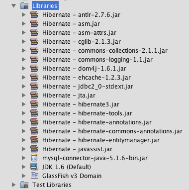
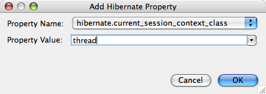
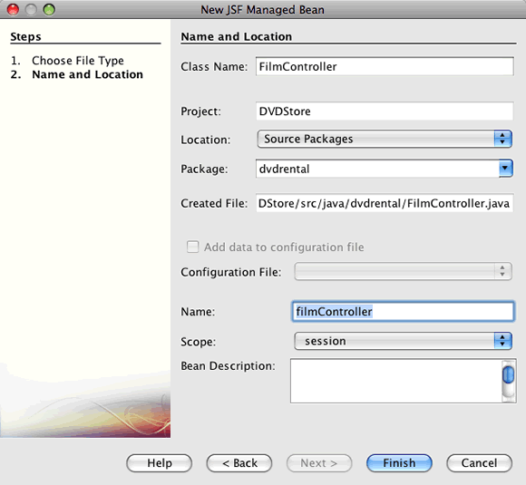

// 
//     Licensed to the Apache Software Foundation (ASF) under one
//     or more contributor license agreements.  See the NOTICE file
//     distributed with this work for additional information
//     regarding copyright ownership.  The ASF licenses this file
//     to you under the Apache License, Version 2.0 (the
//     "License"); you may not use this file except in compliance
//     with the License.  You may obtain a copy of the License at
// 
//       http://www.apache.org/licenses/LICENSE-2.0
// 
//     Unless required by applicable law or agreed to in writing,
//     software distributed under the License is distributed on an
//     "AS IS" BASIS, WITHOUT WARRANTIES OR CONDITIONS OF ANY
//     KIND, either express or implied.  See the License for the
//     specific language governing permissions and limitations
//     under the License.
//

= Using Hibernate in a Web Application
:jbake-type: tutorial
:jbake-tags: tutorials 
:jbake-status: published
:icons: font
:syntax: true
:source-highlighter: pygments
:toc: left
:toc-title:
:description: Using Hibernate in a Web Application - Apache NetBeans
:keywords: Apache NetBeans, Tutorials, Using Hibernate in a Web Application

In this tutorial, you use the NetBeans IDE to create and deploy a web application that displays data from a database. The web application uses the Hibernate framework as the persistence layer for retrieving and storing plain old Java objects (POJOs) to a relational database.

Hibernate is framework that provides tools for object relational mapping (ORM). The tutorial demonstrates how to add support for the Hibernate framework to the IDE and create the necessary Hibernate files. After creating the Java objects and configuring the application to use Hibernate, you create a JSF managed bean and JSF 2.0 pages to display the data.

Before starting this tutorial you may want to familiarize yourself with the following documents.

* Hibernate documentation at link:http://www.hibernate.org/[+hibernate.org+]
* xref:quickstart-webapps.adoc[+Introduction to Developing Web Applications+]
* xref:jsf20-intro.adoc[+Introduction to JavaServer Faces 2.x+]

image::images/netbeans-stamp-74-73-72.png[title="Content on this page applies to the NetBeans IDE 7.2, 7.3 and 7.4"]

*To follow this tutorial, you need the following software and resources.*

|===
|Software or Resource |Version Required 

|xref:../../../download/index.adoc[+NetBeans IDE+] |7.1, 7.2, 7.3, 7.4, Java EE version 

|link:http://www.oracle.com/technetwork/java/javase/downloads/index.html[+Java Development Kit (JDK)+] |Version 6 or 7 

|GlassFish Server Open Source Edition |3.x or 4.x 

|link:http://www.mysql.com/[+MySQL database server+] |Version 5.x 

|Sakila Database |Plugin available from update center 
|===

You can download link:https://netbeans.org/projects/samples/downloads/download/Samples/JavaEE/DVDStoreEE6.zip[+a zip archive of the finished project+].

== Creating the Database

This tutorial uses a MySQL database called  ``sakila`` , a free sample MySQL database that is available from the MySQL site. The sakila database is not included when you install the IDE so you need to first create the database to follow this tutorial.

To create the sakila database you can download and install the Sakila Sample Database plugin using the Plugins manager. After you install the plugin the sakila database is added to the list of databases in the Create MySQL database dialog box.

For more information on configuring the IDE to work with MySQL, see the xref:../ide/mysql.adoc[+Connecting to a MySQL Database+] tutorial.

1. Open the Plugins manager and install the Sakila Sample Database plugin.
2. After installing the plugin, start the MySQL database by expanding the Databases node in the Services window, right-clicking the MySQL Server node and choosing Start.
3. Right-click the MySQL Server node and choose Create Database.
4. Select the Sakila database from the New Database Name drop down list in the Create MySQL Database dialog box. Click OK.

image::images/create-sakila-mysql.png[title="Screenshot of Create MySQL Database dialog"]

When you click OK a Sakila node appears under the MySQL Server node.

. Right-click the Sakila node and choose Connect.

When you click Connect a database connection node for the Sakila database ( ``jdbc:mysql://localhost:3306/sakila [_username_ on Default]`` ) is listed under the Databases node. When a connection is open you can view the data in the database by expanding the connection node.

== Creating the Web Application Project

In this exercise you will create a web application project and add the Hibernate libraries to the project. When you create the project, you will select Hibernate in the Frameworks panel of the New Project wizard and specify the database.

1. Choose File > New Project (Ctrl-Shift-N; ⌘-Shift-N on Mac) from the main menu. Select Web Application from the Java Web category and click Next.
2. Type *DVDStore* for the project name and set the project location.
3. Deselect the Use Dedicated Folder option, if selected. Click Next.

For this tutorial there is little reason to copy project libraries to a dedicated folder because you will not need to share libraries with other users.

. Set the server to the GlassFish Server and set the Java EE Version to Java EE 6 Web or Java EE 7 Web. Click Next.

. Select the JavaServer Faces checkbox and use the default JSF 2.x libraries.

. Select the Hibernate checkbox in the list of frameworks.

. Select the sakila database from the Database Connection drop down list. Click Finish.

*Note:* If the sakila database is not available as an option in the Frameworks panel in the wizard, check to see if the connection is listed under the Databases node in the Services window. If the connection is not there, you need to create the database connection.

image::images/hib-newwebapp.png[title="Frameworks panel of New Project wizard showing adding Hibernate support to project"]

When you click Finish, the IDE creates the web application project and opens the  ``hibernate.cfg.xml``  file and  ``index.xhtml``  in the editor.

If you expand the Libraries node in the Projects window, you can see that the IDE added the Hibernate libraries to the project.

 

== Modifying the Hibernate Configuration File

When you create a new project that uses the Hibernate framework, the IDE automatically creates the  ``hibernate.cfg.xml``  configuration file at the root of the context classpath of the application (in the Files window,  ``src/java`` ). The file is located in the  ``<default package>``  under the Source Packages node in the Projects window. The configuration file contains information about the database connection, resource mappings, and other connection properties. You can edit the file using the multi-view editor, or edit the XML directly in the XML editor.

In this exercise you will edit the default properties specified in  ``hibernate.cfg.xml``  to enable debug logging for SQL statements and to enable Hibernate's session context management.

1. Open  ``hibernate.cfg.xml``  in the Design tab. You can open the file by expanding the  ``<default package>``  node under Source Packages in the Projects window and double-clicking  ``hibernate.cfg.xml`` .
2. In the multi-view XML editor, expand the Configuration Properties node under Optional Properties.
3. Click Add to open the Add Hibernate Property dialog box.
4. In the dialog box, select the  ``hibernate.show_sql``  property and set the value to  ``true`` . This enables the debug logging of the SQL statements.

image::images/add-property-showsql.png[title="Add Hibernate Property dialog box showing setting value for the hibernate.show_sql property"]

. Expand the Miscellaneous Properties node and click Add.

. In the dialog box, select the  ``properties hibernate.current_session_context_class``  and set the value to  ``thread``  to enable Hibernate's automatic session context management.

. Click Add again under the Miscellaneous Properties node and select  ``hibernate.query.factory_class``  in the Property Name dropdown list.

. Select *org.hibernate.hql.classic.ClassicQueryTranslatorFactory* as the Property Value. Click OK.

image::images/add-property-factoryclass.png[title="Add Hibernate Property dialog box showing setting value for the hibernate.query.factory_class property"]

If you click the XML tab in the editor you can see the file in XML view. Your file should look similar to the following (the three new properties are bold):

[source,xml]
----

<hibernate-configuration>
    <session-factory name="session1">
        <property name="hibernate.dialect">org.hibernate.dialect.MySQLDialect</property>
        <property name="hibernate.connection.driver_class">com.mysql.jdbc.Driver</property>
        <property name="hibernate.connection.url">jdbc:mysql://localhost:3306/sakila</property>
        <property name="hibernate.connection.username">root</property>
        <property name="hibernate.connection.password">######</property>
        *<property name="hibernate.show_sql">true</property>
        <property name="hibernate.current_session_context_class">thread</property>
        <property name="hibernate.query.factory_class">org.hibernate.hql.classic.ClassicQueryTranslatorFactory</property>*
    </session-factory>
</hibernate-configuration>
----

. Save your changes to the file.

You can close the file because you do not need to edit the file again.

== Creating the  ``HibernateUtil.java``  Helper File

To use Hibernate you need to create a helper class that handles startup and that accesses Hibernate's  ``SessionFactory``  to obtain a Session object. The class calls  ``configure()``  and loads the  ``hibernate.cfg.xml``  configuration file and then builds the  ``SessionFactory``  to obtain the Session object.

In this section you use the New File wizard to create the helper class  ``HibernateUtil.java`` .

1. Right-click the Source Packages node and select New > Other to open the New File wizard.
2. Select Hibernate from the Categories list and HibernateUtil.java from the File Types list. Click Next.
3. Type *HibernateUtil* for the class name and *dvdrental* for the package. Click Finish.

image::images/hibernate-util-wizard.png[title="Screenshot of HibernateUtil wizard"]

When you click Finish,  ``HibernateUtil.java``  opens in the editor. You can close the file because you do not need to edit the file.

== Generating Hibernate Mapping Files and Java Classes

In this tutorial you use a POJO (plain old Java object) to represent the data in each of the tables in the database that you will use. The Java class specifies the fields for the columns in the tables and uses simple setters and getters to retrieve and write the data. To map the POJOs to the tables you can use a Hibernate mapping file or use annotations in the class.

You can use the Hibernate Mapping Files and POJOs from a Database wizard to create multiple POJOs and mapping files based on database tables. When you use the wizard you select all the tables for which you want POJOs and mapping files and the IDE then generates the files for you based on the database tables and adds the mapping entries to  ``hibernate.cfg.xml`` . When you use the wizard you can choose the files that you want the IDE to generate (only the POJOs, for example) and select code generation options (generate code that uses EJB 3 annotations, for example).

*Note.* The IDE also has wizards to help you create individual POJOs and mapping files from scratch.

=== Creating the Hibernate Reverse Engineering File

If you want to use the Hibernate Mapping Files and POJOs from a Database wizard, you first need to create a  ``hibernate.reveng.xml``  reverse engineering file. The Hibernate Mapping Files and POJOs from a Database wizard requires  ``hibernate.reveng.xml``  and  ``hibernate.cfg.xml`` .

The reverse engineering file enables you to have greater control over the database mapping strategy. The Hibernate Reverse Engineering Wizard creates a reverse engineering file with a default configuration that you can edit in the XML editor.

To create the Hibernate reverse engineering file, perform the following steps.

1. Right-click the Source Packages node in the Projects window and choose New > Other to open the New File wizard.
2. Select Hibernate Reverse Engineering Wizard in the Hibernate category. Click Next.
3. Specify  ``hibernate.reveng``  as the File Name and  ``src/java``  for the Folder. Click Next.
4. Select  ``hibernate.cfg.xml``  from the Configuration File drop down list, if not selected.
5. Select the following tables from Available Tables and click Add to add the tables to Selected Tables.
* actor
* category
* film
* film_actor
* film_category
* language

Click Finish.

image::images/hibernate-reveng-wizard.png[title="New Hibernate Reverse Engineering wizard"]

The wizard generates a  ``hibernate.reveng.xml``  reverse engineering file and opens the file in the editor. You can close the reverse engineering file because you will not need to edit the file.

For more details about working with the  ``hibernate.reveng.xml``  file, see link:http://docs.jboss.org/tools/2.1.0.Beta1/hibernatetools/html/reverseengineering.html[+Chapter 5. Controlling reverse engineering+] in the link:http://docs.jboss.org/tools/2.1.0.Beta1/hibernatetools/html/[+Hibernate Tools Reference Guide+].

=== Creating the Hibernate Mapping Files and POJOs

You can use the Hibernate Mapping Files and POJOs from a Database wizard to generate files for you. The wizard can generate a POJO and a corresponding mapping file for each table that you select in the wizard. The mapping files are XML files that contain data about how the columns in the tables are mapped to the fields in the POJOs. You need to have the  ``hibernate.reveng.xml``  and  ``hibernate.cfg.xml``  files to use the wizard.

To create the POJOS and mapping files using a wizard, perform the following steps.

1. Right-click the Source Packages node in the Projects window and choose New > Other to open the New File wizard.
2. Select Hibernate Mapping Files and POJOs from a Database in the Hibernate category. Click Next.
3. Ensure that the  ``hibernate.cfg.xml``  and  ``hibernate.reveng.xml``  files are selected in the drop down lists.
4. Select *JDK 5 Language Features* under the General Settings options.
5. Ensure that the *Domain Code* and *Hibernate XML Mappings* options are selected.
6. Select *dvdrental* for the Package name. Click Finish.

image::images/hibernate-pojo-wizard2.png[title="Generate Hibernate Mapping Files and POJOs wizard"]

When you click Finish the IDE generates POJOs and Hibernate mapping files with the fields mapped to the columns specified in  ``hibernate.reveng.xml`` . The IDE also adds mapping entries to  ``hibernate.cfg.xml`` .

[source,xml]
----

<hibernate-configuration>
  <session-factory>
    <property name="hibernate.dialect">org.hibernate.dialect.MySQLDialect</property>
    <property name="hibernate.connection.driver_class">com.mysql.jdbc.Driver</property>
    <property name="hibernate.connection.url">jdbc:mysql://localhost:3306/sakila</property>
    <property name="hibernate.connection.username">myusername</property>
    <property name="hibernate.connection.password">mypassword</property>
    <property name="hibernate.show_sql">true</property>
    <property name="hibernate.current_session_context_class">thread</property>
    <property name="hibernate.query.factory_class">org.hibernate.hql.classic.ClassicQueryTranslatorFactory</property>
    <mapping resource="dvdrental/FilmActor.hbm.xml"/>
    <mapping resource="dvdrental/Language.hbm.xml"/>
    <mapping resource="dvdrental/Film.hbm.xml"/>
    <mapping resource="dvdrental/Category.hbm.xml"/>
    <mapping resource="dvdrental/Actor.hbm.xml"/>
    <mapping resource="dvdrental/FilmCategory.hbm.xml"/>
  </session-factory>
</hibernate-configuration>
----

*Note.* Confirm that the  ``mapping``  elements are listed after the  ``property``  elements in the  ``hibernate.cfg.xml``  file.

You can expand the  ``dvdrental``  package to see the files generated by the wizard.

image::images/hib-projectswindow.png[title="Projects window showing generated POJOs"]

You can use the Hibernate Mapping wizard if you want to create a Hibernate mapping file that maps a specific table to a specific class.

For more details about working with the  ``hibernate.reveng.xml``  file, see link:http://docs.jboss.org/hibernate/core/3.3/reference/en/html/mapping.html[+Chapter 5. Basic O/R Mapping+] in the link:http://docs.jboss.org/hibernate/stable/core/reference/en/html/[+Hibernate Reference Documentation+].

== Creating the  ``FilmHelper.java``  Helper Class

You will now create a helper class in the  ``dvdrental``  package that will be used to perform Hibernate queries on the database. You will use the Hibernate Query Language (HQL) editor to construct and test the queries for retrieving data. After you test the queries you will create methods in the helper class that construct and run the queries. You will then invoke the methods in the helper class from a JSF managed bean.

=== Creating the Class

In this section you use the New File wizard to create the helper class  ``FilmHelper.java``  in the  ``dvdrental``  package. You will create a Hibernate session by calling  ``getSessionFactory``  in  ``HibernateUtil.java``  and create some helper methods to create queries to retrieve data from the database. You will invoke the helper methods from the JSP pages.

1. Right-click the  ``dvdrental``  source package node and select New > Java Class to open the New File wizard.
2. Type *FilmHelper* for the class name.
3. Confirm that *dvdrental* is selected as the Package. Click Finish.
4. Adding the following code (in bold) to create a Hibernate session.

[source,java]
----

public class FilmHelper {

    *Session session = null;

    public FilmHelper() {
        this.session = HibernateUtil.getSessionFactory().getCurrentSession();
    }*

}
----

. Right-click in the editor and choose Fix Imports (Alt-Shift-I; ⌘-Shift-I on Mac) to add any required import statements ( ``org.hibernate.Session`` ) and save your changes.

You will now modify  ``FilmHelper.java``  to add methods that query the DB.

=== Enumerating Film Titles and Retrieving Actors Using an HQL Query

In this exercise you will create a Hibernate Query Language (HQL) query that queries the database to retrieve a list of film titles from the Film table. You will then add a method that queries both the Actor and Film_actor tables to fetch the actors involved in a particular film.

The Film table has 1000 records so the method to retrieve the list of films should be able to retrieve records based on the  ``filmId``  primary key. You will use the HQL editor to construct and test the HQL query. After you have created the correct query you will add a method to the class that can generate the proper query.

1. Right-click the project node in the Projects window and choose Clean and Build.
2. Right-click  ``hibernate.cfg.xml``  in the Projects window and choose Run HQL Query to open the HQL query editor.
3. Select hibernate.cfg from the drop down list in the toolbar.
4. Test the connection by typing the following in the editor and clicking the Run HQL Query button ( image:images/run_hql_query_16.png[title="Run HQL Query button"] ) in the toolbar.

[source,java]
----

from Film
----

When you click Run HQL Query you can see the results of the query in the bottom window of the HQL query editor.

image::images/hibernate-hqleditor1.png[title="Generate Hibernate Mapping Files and POJOs wizard"]

If you click the SQL button you can see the equivalent SQL query.

[source,java]
----

select film0_.film_id as col_0_0_ from sakila.film film0_
----

. Type the following query to retrieve the records in the Film table where the film id is between 100 and 200.

[source,java]
----

from Film as film where film.filmId between 100 and 200
----

The result window displays a list of records. Now that you have tested that the query returns the desired results, you can use the query in the helper class.

. Add the following method  ``getFilmTitles``  to  ``FilmHelper.java``  to retrieve the films where the film id is between a certain range specified by the variables  ``startID``  and  ``endID`` .

[source,java]
----

public List getFilmTitles(int startID, int endID) {
    List<Film> filmList = null;
    try {
        org.hibernate.Transaction tx = session.beginTransaction();
        Query q = session.createQuery ("from Film as film where film.filmId between '"+startID+"' and '"+endID+"'");
        filmList = (List<Film>) q.list();
    } catch (Exception e) {
        e.printStackTrace();
    }
    return filmList;
}
----

. Add the following method  ``getActorsByID``  that retrieves the actors in a particular film. The method constructs the query using  ``filmId``  as the input variable.

[source,java]
----

public List getActorsByID(int filmId){
    List<Actor> actorList = null;
    try {
        org.hibernate.Transaction tx = session.beginTransaction();
        Query q = session.createQuery ("from Actor as actor where actor.actorId in (select filmActor.actor.actorId from FilmActor as filmActor where filmActor.film.filmId='" + filmId + "')");
        actorList = (List<Actor>) q.list();

    } catch (Exception e) {
        e.printStackTrace();
    }

    return actorList;
}
----

. Fix your imports and save your changes.

When you fix your imports you want to choose  ``java.util.List``  and  ``org.hibernate.Query`` .

=== Adding Additional Helper Methods

You will now add additional helper methods that create queries based on an input variable. You can check the queries in the HQL query editor.

1. Add the following method to retrieve a list of categories according to  ``filmId`` .

[source,java]
----

public Category getCategoryByID(int filmId){
    List<Category> categoryList = null;
    try {
        org.hibernate.Transaction tx = session.beginTransaction();
        Query q = session.createQuery("from Category as category where category.categoryId in (select filmCat.category.categoryId from FilmCategory as filmCat where filmCat.film.filmId='" + filmId + "')");
        categoryList = (List<Category>) q.list();

    } catch (Exception e) {
        e.printStackTrace();
    }

    return categoryList.get(0);
}
----

. Add the following method to retrieve a single film according to  ``filmId`` .

[source,java]
----

public Film getFilmByID(int filmId){

    Film film = null;

    try {
        org.hibernate.Transaction tx = session.beginTransaction();
        Query q = session.createQuery("from Film as film where film.filmId=" + filmId);
        film = (Film) q.uniqueResult();
    } catch (Exception e) {
        e.printStackTrace();
    }

    return film;
}
----

. Add the following method to retrieve the film language according to  ``langId`` .

[source,java]
----

public String getLangByID(int langId){

    Language language = null;

    try {
        org.hibernate.Transaction tx = session.beginTransaction();
        Query q = session.createQuery("from Language as lang where lang.languageId=" + langId);
        language = (Language) q.uniqueResult();
    } catch (Exception e) {
        e.printStackTrace();
    }

    return language.getName();
}
----

. Save your changes.

== Creating the JSF Managed Bean

In this exercise you will create a JSF managed bean. The methods in the managed bean are used for displaying data in the JSF pages and for accessing methods in the helper class to retrieve records. The JSF 2.0 specification enables you to use annotations in a bean class to identify the class as a JSF managed bean, to specify the scope and to specify a name for the bean.

To create the managed bean, perform the following steps.

1. Right-click the  ``dvdrental``  source package node and choose New > Other.
2. Select JSF Managed Bean from the JavaServer Faces category. Click Next.
3. Type *FilmController* for the Class Name.

You will use the Managed Bean name  ``filmController``  as the value for the  ``inputText``  and  ``commandButton``  in the JSF page  ``index.xhtml``  when calling methods in the bean.

. Select *dvdrental* for the Package.

. Type *filmController* for the Name that will be used for the managed bean.

. Set Scope to Session. Click Finish.

When you click Finish, the IDE creates the bean class and opens the class in the editor. The IDE added the  ``@ManagedBean``  and  ``@SessionScoped``  annotations.

[source,java]
----

@ManagedBean
@SessionScoped
public class FilmController {

    /** Creates a new instance of FilmController */
    public FilmController() {
    }

}

----

*Note.* Note that the name of the managed bean is not explicitly specified. By default, the name of the bean is the same as the class name and begins with a lower-case letter. If you want the name of the bean to be different from the class name, you can explicitly specify the name as a parameter of the  ``@ManagedBean``  annotations (for example,  ``@ManagedBean(name="myBeanName")`` .

1. Add the following fields (in bold) to the class.

[source,java]
----

@ManagedBean
@SessionScoped
public class FilmController {
    *int startId;
    int endId;
    DataModel filmTitles;
    FilmHelper helper;
    private int recordCount = 1000;
    private int pageSize = 10;

    private Film current;
    private int selectedItemIndex;*
}
----

. Add the following code (in bold) to create the FilmController instance and retrieve the films.

[source,java]
----

    /** Creates a new instance of FilmController */
    public FilmController() {
        *helper = new FilmHelper();
        startId = 1;
        endId = 10;
    }

    public FilmController(int startId, int endId) {
        helper = new FilmHelper();
        this.startId = startId;
        this.endId = endId;
    }

    public Film getSelected() {
        if (current == null) {
            current = new Film();
            selectedItemIndex = -1;
        }
        return current;
    }

    public DataModel getFilmTitles() {
        if (filmTitles == null) {
            filmTitles = new ListDataModel(helper.getFilmTitles(startId, endId));
        }
        return filmTitles;
    }

    void recreateModel() {
        filmTitles = null;
    }*
----

. Add the following methods that are used to display the table and navigate the pages.*    public boolean isHasNextPage() {
        if (endId + pageSize <= recordCount) {
            return true;
        }
        return false;
    }

    public boolean isHasPreviousPage() {
        if (startId-pageSize > 0) {
            return true;
        }
        return false;
    }

    public String next() {
        startId = endId+1;
        endId = endId + pageSize;
        recreateModel();
        return "index";
    }

    public String previous() {
        startId = startId - pageSize;
        endId = endId - pageSize;
        recreateModel();
        return "index";
    }

    public int getPageSize() {
        return pageSize;
    }

    public String prepareView(){
        current = (Film) getFilmTitles().getRowData();
        return "browse";
    }
    public String prepareList(){
        recreateModel();
        return "index";
    }
*

The methods that return "index" or "browse" will prompt the JSF navigation handler to try to open a page named  ``index.xhtml``  or  ``browse.xhtml`` . The JSF 2.0 specification enables the use of implicit navigation rules in applications that use Facelets technology. In this application, no navigation rules are configured in  ``faces-config.xml`` . Instead, the navigation handler will try to locate a suitable page in the application.

. Add the following methods that access the helper class to retrieve additional film details.*    public String getLanguage() {
        int langID = current.getLanguageByLanguageId().getLanguageId().intValue();
        String language = helper.getLangByID(langID);
        return language;
    }

    public String getActors() {
        List actors = helper.getActorsByID(current.getFilmId());
        StringBuffer totalCast = new StringBuffer();
        for (int i = 0; i < actors.size(); i++) {
            Actor actor = (Actor) actors.get(i);
            totalCast.append(actor.getFirstName());
            totalCast.append(" ");
            totalCast.append(actor.getLastName());
            totalCast.append("  ");
        }
        return totalCast.toString();
    }

    public String getCategory() {
        Category category = helper.getCategoryByID(current.getFilmId());
        return  category.getName();
    }*

[source,java]
----

----

. Fix your imports (Ctrl-Shift-I) and save your changes.

You can use the code completion in the editor to help you type your code.

== Creating the Web Pages

In this exercise you will create two web pages for displaying the data. You will modify the  ``index.xhtml``  generated by the IDE to add a table that displays the films in the database. You will then create  ``browse.xhtml``  to display a film's details when you click the "View" link in the table. You will also create a JSF template page that is used by  ``index.xhtml``  and  ``browse.xhtml`` .

For more about using JSF 2.0 and Facelets templates, see xref:jsf20-intro.adoc[+Introduction to JavaServer Faces 2.0+]

=== Creating  ``template.xhtml`` 

You will first create the JSF Facelets template  ``template.xhtml``  that is used in the composition of the  ``index.xhtml``  and  ``browse.xhtml``  pages.

1. Right-click the DVDStore project node in the Projects window and choose New > Other.
2. Select Facelets Template in the JavaServer Faces category. Click Next.
3. Type *template* for the File Name and choose the first CSS layout style.
4. Click Finish.

When you click Finish, the file  ``template.xhtml``  opens in the editor. The template contains the following default code.

[source,html]
----

<h:body>

    

        <ui:insert name="top">Top</ui:insert>
    

    

        <ui:insert name="content">Content</ui:insert>
    

</h:body>
----

. Modify the  ``<ui:insert>``  element to change the default generated name to "body".

[source,html]
----

        <ui:insert name="*body*">Content</ui:insert>

----

. Save your changes.

The content enclosed within the  ``<ui:define name="body">``  element in  ``index.xhtml``  and  ``browse.xhtml``  will be inserted into the location identified with  `` <ui:insert name="body">Content</ui:insert>``  in the template.

=== Modifying  ``index.xhtml`` 

When you created the web application, the IDE automatically generated the page  ``index.xhtml`` . In this exercise you modify the page to display a list of film titles. The JSF page calls the methods in the JSF Managed Bean FilmController to retrieve the list of films and then displays a table with the film titles and descriptions.

1. Expand the Web Pages folder in the Projects window and open  ``index.xhtml``  in the editor.

The New Project wizard generated the following default  ``index.xhtml``  page.

[source,xml]
----

<html xmlns="http://www.w3.org/1999/xhtml"
      xmlns:h="http://java.sun.com/jsf/html">
<h:head>
        <title>Facelet Title</title>
    </h:head>
    <h:body>
        Hello from Facelets
    </h:body>
</html>
----

. Modify the page to use the JSF  ``<ui:composition>``  and  ``<ui:define>``  elements and add a  ``<h:form>``  element.

[source,xml]
----

<html xmlns="http://www.w3.org/1999/xhtml"
  xmlns:h="http://java.sun.com/jsf/html"
  *xmlns:ui="http://java.sun.com/jsf/facelets">
    <ui:composition template="./template.xhtml">
        <ui:define name="body">
            <h:form>

            </h:form>
        </ui:define>
    </ui:composition>*
</html>
----

When you start typing the tags, the IDE adds  ``xmlns:ui="http://java.sun.com/jsf/facelets"``  tag library declaration.

The  ``<ui:composition>``  and  ``<ui:define>``  elements are used in combination with the page template that you will create. The  ``<ui:composition>``  element references the location of the template that will be used by this page. The  ``<ui:define>``  element references the position in the template that the enclosed code will occupy.

. Add the following navigation links that call the  ``previous``  and  ``next``  methods in the JSF managed bean.

[source,xml]
----

    <ui:define name="body">
            <h:form>
                *<h:commandLink action="#{filmController.previous}" value="Previous #{filmController.pageSize}" rendered="#{filmController.hasPreviousPage}"/> 
                <h:commandLink action="#{filmController.next}" value="Next #{filmController.pageSize}" rendered="#{filmController.hasNextPage}"/> *
            </h:form>
    </ui:define>
----

. Add the following  ``dataTable``  element (in bold) to generate the table to display the retrieved items.

[source,xml]
----

            <h:form styleClass="jsfcrud_list_form">
                <h:commandLink action="#{filmController.previous}" value="Previous #{filmController.pageSize}" rendered="#{filmController.hasPreviousPage}"/> 
                <h:commandLink action="#{filmController.next}" value="Next #{filmController.pageSize}" rendered="#{filmController.hasNextPage}"/> 
                *<h:dataTable value="#{filmController.filmTitles}" var="item" border="0" cellpadding="2" cellspacing="0" rowClasses="jsfcrud_odd_row,jsfcrud_even_row" rules="all" style="border:solid 1px">
                    <h:column>
                        <f:facet name="header">
                            <h:outputText value="Title"/>
                        </f:facet>
                        <h:outputText value="#{item.title}"/>
                    </h:column>
                    <h:column>
                        <f:facet name="header">
                            <h:outputText value="Description"/>
                        </f:facet>
                        <h:outputText value="#{item.description}"/>
                    </h:column>
                    <h:column>
                        <f:facet name="header">
                            <h:outputText value=" "/>
                        </f:facet>
                        <h:commandLink action="#{filmController.prepareView}" value="View"/>
                    </h:column>
                </h:dataTable>
                 *
            </h:form>

----

. Save your changes.

The index page will now display a list of film titles in the database. Each row in the table includes a "View" link that invokes the  ``prepareView``  method in the managed bean. The  ``prepareView``  method returns "browse" and will open  ``browse.xhtml`` .

*Note.* When you type the  ``<f:facet>``  tag, the IDE will add  ``xmlns:f="http://java.sun.com/jsf/core``  tag library declaration. *Confirm that the tag library is declared in the file.*

 

=== Creating  ``browse.xhtml`` 

You will now create the  ``browse.xhtml``  page for displaying details of the selected film. You can use the Facelets Template Client wizard to create the page based on the JSF Facelets template  ``template.xhtml``  that you created.

1. Right-click DVDStore project node in the Projects window and choose New > Other.
2. Select Facelets Template Client in the JavaServer Faces category. Click Next.

image::images/hib-faceletsclient.png[title="Facelets Template Client file type in New File wizard"]

. Type *browse* for the File Name.

. Locate the Template for the page by clicking Browse to open the Browse Files dialog box.

. Expand the Web Pages folder and select  ``template.xhtml`` . Click Select File.

image::images/hib-browsetemplate.png[title="Select the template in the Browse Files dialog"]

. Select *<ui:composition>* for the Generated Root Tag. Click Finish.

When you click Finish, the file  ``browse.xhtml``  opens in the editor with the following code.

[source,xml]
----

<ui:composition xmlns:ui="http://java.sun.com/jsf/facelets"
    template="./template.xhtml">

    <ui:define name="top">
        top
    </ui:define>

    <ui:define name="body">
        body
    </ui:define>

</ui:composition>
----

You can see that the new file specifies the  ``template.xhtml``  file and that the  ``<ui:define>``  tag has the property  ``name="body"`` 

. Add the following code (in bold) between the  ``<ui:define>``  tags to create the form and call the methods in the managed bean FilmController to retrieve the data and populate the form.

[source,xml]
----

<ui:composition xmlns:ui="http://java.sun.com/jsf/facelets"
    template="./template.xhtml"
    *xmlns:h="http://java.sun.com/jsf/html"
    xmlns:f="http://java.sun.com/jsf/core"*>

        <ui:define name="top">
            top
        </ui:define>

        <ui:define name="body">
        *
            <h:form>
                <h:panelGrid columns="2">
                    <h:outputText value="Title:"/>
                    <h:outputText value="#{filmController.selected.title}" title="Title"/>
                    <h:outputText value="Description"/>
                    <h:outputText value="#{filmController.selected.description}" title="Description"/>
                    <h:outputText value="Genre"/>
                    <h:outputText value="#{filmController.category}"/>

                    <h:outputText value="Cast"/>
                    <h:outputText value="#{filmController.actors}"/>

                    <h:outputText value="Film Length"/>
                    <h:outputText value="#{filmController.selected.length} min" title="Film Length"/>

                    <h:outputText value="Language"/>
                    <h:outputText value="#{filmController.language}" title="Film Length"/>

                    <h:outputText value="Release Year"/>
                    <h:outputText value="#{filmController.selected.releaseYear}" title="Release Year">
                        <f:convertDateTime pattern="MM/dd/yyyy" />
                    </h:outputText>
                    <h:outputText value="Rental Duration"/>
                    <h:outputText value="#{filmController.selected.rentalDuration}" title="Rental DUration"/>
                    <h:outputText value="Rental Rate"/>
                    <h:outputText value="#{filmController.selected.rentalRate}" title="Rental Rate"/>
                    <h:outputText value="Replacement Cost"/>
                    <h:outputText value="#{filmController.selected.replacementCost}" title="Replacement Cost"/>
                    <h:outputText value="Rating"/>
                    <h:outputText value="#{filmController.selected.rating}" title="Rating"/>
                    <h:outputText value="Special Features"/>
                    <h:outputText value="#{filmController.selected.specialFeatures}" title="Special Features"/>
                    <h:outputText value="Last Update"/>
                    <h:outputText value="#{filmController.selected.lastUpdate}" title="Last Update">
                        <f:convertDateTime pattern="MM/dd/yyyy HH:mm:ss" />
                    </h:outputText>
                </h:panelGrid>
                 
                 
                <h:commandLink action="#{filmController.prepareList}" value="View All List"/>
                 
            </h:form>
*
        </ui:define>
    </ui:composition>
</html>
----

You can see that  ``browse.xhtml``  and  ``index.xhtml``  will use the same page template.

. Save your changes.

== Running the Project

The basics of the application are now complete. You can now run the application to check if everything is working correctly.

1. Click Run Main Project in the main toolbar or right-click the DVDStore application node in the Projects window and choose Run.

The IDE saves all changed files, builds the application, and deploys the application to the server. The IDE opens a browser window to the URL  ``http://localhost:8080/DVDStore/``  that displays the list of films.

image::images/hib-browser1.png[title="Screenshot of browser displaying film list on index page"]

. In your browser, click "View" to load  ``browse.xhtml``  to view the film details.

=== Downloading the Solution Project

You can download the solution to this tutorial as a project in the following ways.

* Download link:https://netbeans.org/projects/samples/downloads/download/Samples/JavaEE/DVDStoreEE6.zip[+a zip archive of the finished project+].
* Checkout the project sources from the NetBeans Samples by performing the following steps:
1. Choose Team > Subversion > Checkout from the main menu.
2. In the Checkout dialog box, enter the following Repository URL:
 ``https://svn.netbeans.org/svn/samples~samples-source-code`` 
Click Next.

. Click Browse to open the Browse Repostiory Folders dialog box.

. Expand the root node and select *samples/javaee/DVDStoreEE6*. Click OK.

. Specify the Local Folder for the sources.

. Click Finish.

When you click Finish, the IDE initializes the local folder as a Subversion repository and checks out the project sources.

. Click Open Project in the dialog that appears when checkout is complete.

*Notes.* For more about installing Subversion, see the section on xref:../ide/subversion.adoc#settingUp[+Setting up Subversion+] in the xref:../ide/subversion.adoc[+Guide to Subversion in NetBeans IDE+].

=== Troubleshooting

Most of the problems that occur with the tutorial application are due to communication difficulties between the GlassFish Server Open Source Edition and the MySQL database server. If your application does not display correctly, or if you are receiving a server error, you might want to look at the xref:mysql-webapp.adoc#troubleshoot[+Troubleshooting+] section of the xref:mysql-webapp.adoc[+Creating a Simple Web Application Using a MySQL Database+] tutorial or the xref:../ide/mysql.adoc[+Connecting to a MySQL Database+] tutorial.

If you download and run the solution project you might see the following error in the Output window if it is the first time that you have deployed an application that uses the MySQL database.

[source,java]
----

    SEVERE: JDBC Driver class not found: com.mysql.jdbc.Driver
    java.lang.ClassNotFoundException: com.mysql.jdbc.Driver
	at org.glassfish.web.loader.WebappClassLoader.loadClass(WebappClassLoader.java:1509)

        [...]

	at java.lang.Thread.run(Thread.java:680)

    SEVERE: Initial SessionFactory creation failed.org.hibernate.HibernateException: JDBC Driver class not found: com.mysql.jdbc.Driver
    INFO: cleaning up connection pool: null
    INFO: Domain Pinged: stable.glassfish.org
----

In your browser window you might see a  ``java.lang.ExceptionInInitializerError``  and the following stack trace.

[source,java]
----

    java.lang.ExceptionInInitializerError
	at dvdrental.HibernateUtil.<clinit>(HibernateUtil.java:28)
	...
    Caused by: org.hibernate.HibernateException: JDBC Driver class not found: com.mysql.jdbc.Driver
	
	... 
    Caused by: java.lang.ClassNotFoundException: com.mysql.jdbc.Driver
	... 
----

The output message states that the JDBC driver for the MySQL database was not found. The most probable reason is that you need to add the MySQL JDBC driver file to your GlassFish server installation. To confirm that the driver is missing, navigate to the  ``_GLASSFISH-INSTALL_/glassfish/domains/domain1/lib``  directory on your local system (where _GLASSFISH-INSTALL_ is your GlassFish installation directory). If the  ``domain1/lib``  directory does not contain the JDBC driver file (for example, `mysql-connector-java-5.1.13-bin.jar`) you need to copy the JDBC driver to the directory. The MySQL JDBC driver is not added to your GlassFish installation when you install the server.

You can add a copy of the MySQL JDBC driver to your GlassFish installation by performing the following steps.

1. Download the link:http://dev.mysql.com/downloads/connector/j/[+MySQL Connector/J JDBC driver+].
2. Extract the driver and copy the driver file (for example, `mysql-connector-java-5.1.13-bin.jar`) to the  ``domain1/lib``  directory of your GlassFish installation.

Alternatively, when you use the IDE to create an application that uses the MySQL database, the IDE can automatically copy the bundled MySQL JDBC driver to the GlassFish server when you deploy the project, if required. To confirm that the IDE will copy the necessary JDBC drivers, choose Tools > Servers from the main menu to open the Servers manager and confirm that the Enable JDBC Driver Deployment option is selected for your GlassFish server.

After you create and deploy a web application that uses the MySQL database, if you navigate to the `domain1/lib` directory of your local GlassFish installation you will see that directory contains the JDBC driver file.

xref:../../../community/mailing-lists.adoc[Send Feedback on This Tutorial]

== See Also

* xref:jsf20-support.adoc[+JSF 2.x Support in NetBeans IDE+]
* xref:jsf20-intro.adoc[+Introduction to JavaServer Faces 2.x+]
* xref:../java-ee.adoc[+Java EE &amp; Java Web Learning Trail+]
