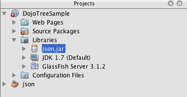

// 
//     Licensed to the Apache Software Foundation (ASF) under one
//     or more contributor license agreements.  See the NOTICE file
//     distributed with this work for additional information
//     regarding copyright ownership.  The ASF licenses this file
//     to you under the Apache License, Version 2.0 (the
//     "License"); you may not use this file except in compliance
//     with the License.  You may obtain a copy of the License at
// 
//       http://www.apache.org/licenses/LICENSE-2.0
// 
//     Unless required by applicable law or agreed to in writing,
//     software distributed under the License is distributed on an
//     "AS IS" BASIS, WITHOUT WARRANTIES OR CONDITIONS OF ANY
//     KIND, either express or implied.  See the License for the
//     specific language governing permissions and limitations
//     under the License.
//

= Connecting a Dojo Tree to an ArrayList using JSON
:jbake-type: tutorial
:jbake-tags: tutorials 
:jbake-status: published
:icons: font
:syntax: true
:source-highlighter: pygments
:toc: left
:toc-title:
:description: Connecting a Dojo Tree to an ArrayList using JSON - Apache NetBeans
:keywords: Apache NetBeans, Tutorials, Connecting a Dojo Tree to an ArrayList using JSON
include::../../../inc/database.adoc[]

Web 2.0 features are becoming increasingly predominant in web applications. Many web applications now use JavaScript toolkits such as link:http://www.dojotoolkit.org/[+Dojo+], which allow web pages to behave more like desktop interfaces while overcoming browser incompatibilities and utilizing code that is maintainable, accessible, and standards-compliant.

This tutorial has been adapted from the link:http://developers.sun.com/learning/javaoneonline/j1lab.jsp?lab=LAB-5573&yr=2009&track=1[+Java One Hands-On Lab: Leveraging JavaScript Toolkits for End-to-End Connectivity in Web Applications+], and demonstrates how to add and configure a link:http://dojocampus.org/explorer/#Dijit_Tree_Basic[+Dojo Tree widget+] in a web page and enable the server-side to respond to Tree requests in JSON format. In doing so, you will utilize a set of freely available Java classes from link:http://json.org[+http://json.org+] to process data from an ArrayList into JSON format.

image::images/netbeans-stamp-80-74-73.png[title="Content on this page applies to the NetBeans IDE 7.2, 7.3, 7.4 and 8.0"]

*To complete this document, you need the following software and resources.*

|===
|Software or Resource |Version Required 

|xref:../../../download/index.adoc[+NetBeans IDE+] |7.2, 7.3, 7.4, 8.0, Java EE 

|link:http://www.oracle.com/technetwork/java/javase/downloads/index.html[+Java Development Kit (JDK)+] |7 or 8 

|GlassFish server 
_or_ 
Tomcat servlet container |Open Source Edition 3.1.x or 4.x 
_ _ 

.x or 8.x 

|link:http://www.dojotoolkit.org/download[+Dojo Toolkit+] |version 1.8.x or later 

|link:https://netbeans.org/projects/samples/downloads/download/Samples/Java%20Web/DojoTreeSample.zip[+Dojo sample project+] |n/a 
|===

*Notes:*

* You will require an Internet connection to complete several of the steps included in this tutorial.
* The NetBeans IDE Java EE download bundle enables you to optionally install and register the GlassFish Server Open Source Edition with the IDE. You require a server to simulate client-server communication in this tutorial.
* The completed project looks as follows: 

image::images/dojo-tree-complete.png[title="Completed exercise viewed in a browser"]

== Opening the Sample Project

Begin by opening the sample project in the IDE. When the project is open, expand the project node in the Projects window and examine the Dojo resources and libraries that are used in the project.

1. Download the tutorial's link:https://netbeans.org/projects/samples/downloads/download/Samples%252FJavaScript%252FDojoTreeSample.zip[+Dojo sample project+] to a location on your computer.
2. Click the Open Project button ( image:images/open-project-btn.png[] ) in the IDE toolbar to open the Open Project dialog box.
3. In the Open Project dialog, locate the Dojo sample project on your computer and click Open Project.

When you open the `DojoTreeSample` project in the IDE you will see that the project is badged with an error badge to indicate that a reference problem exists.

image::images/proj-win-ref-problems.png[title="Project reference problems are indicated by red text and error badge"]

The reference problem exists because the Java classes used in the project (`Tribe`, and `TribeDataManager`) reference classes found in the JSON JAR file, which you will later add in the section <<addJSON,Adding the JSON JAR Files to the Project>>.

*Note: *The Projects window (Ctrl-1; ⌘-1 on Mac) provides a _logical view_ of important project contents, and is the main entry point to your project sources. The Files window (Ctrl-2; ⌘-2 on Mac) shows a _directory-based view_ of your projects, and includes any files and folders that are not displayed in the Projects Window.

. Expand the `Web Pages` node in the Projects window.

You can see that a  ``resources``  folder is listed under the `Web Pages` node in the Projects window. The  ``resources``  folder contains the Dojo core and Dijit libraries from the link:http://www.dojotoolkit.org/download[+Dojo toolkit+]. In order to implement Dojo's Tree widget, you essentially require two components: the `ItemFileReadStore` module from the core library and the `Tree` widget itself contained in the Dijit library.

* `link:http://docs.dojocampus.org/dojo/data/ItemFileReadStore[+dojo.data.ItemFileReadStore+]`: reads the JSON structured contents from an HTTP endpoint (in this tutorial, a servlet) and stores all the items in-memory for simple and quick access.
* `link:http://docs.dojocampus.org/dijit/Tree[+dijit.Tree+]`: The Tree widget that provides a view of the JSON data retrieved from `ItemFileReadStore`.

*Note.* The `DojoX` library is not required for this project.

. Expand the `Libraries` node in the Projects window and confirm that all the required libraries are on the classpath.

*Note.* Depending on your configuration, you might need to resolve a missing server problem. If you see a  ``<Missing Java EE Server>``  node under the `Libraries` node, right-click the project node and choose Resolve Missing Server Problem in the popup menu.

image::images/proj-win-dojo-resources.png[title="Dojo and Dijit libraries are added to the Project's 'resources' folder"]

Select the GlassFish Server in the Resolve References dialog box. Click OK.

image::images/dojo-add-server.png[title="Dojo and Dijit libraries are added to the Project's 'resources' folder"]

At this stage, you have successfully opened the `DojoTreeSample` project in the IDE and confirmed that the Dojo libraries are included in the application. In the next step, you will begin working in the HTML file that will display the Tree widget to the end user.

== Linking to the Toolkit Resources from a Project File

In order to use resources from the toolkit, you need to link to the `dojo.js` file, found in the core library. The `dojo.js` file is the _source loader_ for Dojo and determines the correct host environment to use. While doing so, you can also configure `djConfig` by adding the `parseOnLoad` parameter.

1. In the Projects window, double-click the `dojoDemo.html` file to open it in the editor.
2. In the `dojoDemo.html` file, add the following ` 
*
    
</head>
----
* `link:http://dojotoolkit.org/reference-guide/1.6/djConfig.html[+djConfig+]` allows you to override global settings that control how Dojo operates (e.g., using the `parseOnLoad` property).
* `parseOnLoad` set to `true` ensures that widgets and page mark-up are parsed as the page is loaded.

. Add a link to the `nihilo` link:http://docs.dojocampus.org/dijit/themes[+sample theme+] contained in the toolkit by adding the following `@import` statement (in bold) between the `<head>` tags and beneath the ` 

**
----

The `nihilo` theme is included by default in the toolkit. You can expand the `dijit/themes` folder in the Projects window to see other sample themes that are provided by default.

. Add the following class selector to the `<body>` tag of the page to specify the name of the theme you are using. When you do this, any Dojo widget which has been loaded into the page will be rendered using the styles associated with the theme.

[source,java]
----

<body *class="nihilo"*>
----

At this stage, the `dojoDemo.html` file is ready to accept any code that references the Dojo core and Dijit libraries, and will render any widgets using Dojo's `nihilo` theme.

== Adding and Configuring the Dojo Tree Widget

After you have linked to `dojo.js`, you can begin adding code to utilize Dojo's modules and widgets. First add code to load the `dijit.Tree` widget and `dojo.data.ItemFileReadStore` using `link:http://docs.dojocampus.org/dojo/require[+dojo.require+]` statements. Then, add the widget and module themselves to the page.

1. Add the following `dojo.require` statements (in bold) to the file between the  ``<body<``  tags.

[source,xml]
----

----
* `link:http://docs.dojocampus.org/dojo/data/ItemFileReadStore[+dojo.data.ItemFileReadStore+]`: reads the JSON structured contents from an HTTP endpoint (In <<prepareServlet,Preparing a Servlet to Initiate a JSON Response>>, you'll implement a servlet for this purpose.) and stores all the items in-memory for simple and quick access.
* `link:http://docs.dojocampus.org/dijit/Tree[+dijit.Tree+]`: The Tree widget that provides a view of the JSON data retrieved from `ItemFileReadStore`.

. Add the following code (in bold) to add an `ItemFileReadStore` and `Tree` widget.

[source,html]
----

<!-- TODO: specify AJAX retrieval -->

<!-- TODO: add Tree widget and configure attributes -->
*

*
----
* `ItemFileReadStore` requires you to specify the `url` property by pointing to the server-side resource that returns the JSON data. As will be later demonstrated, this is the `TribeServlet`. You can use the `jsId` property to give the retrieved JSON data an id, which widgets can then use to refer to the data store.
* `Tree` uses the `store` property to point to the `ItemFileReadStore`, which provides the JSON data. The `query` property enables you to arrange the display of data, based on a keyword used in the JSON file.

*Note.* You can ignore the warnings that appear in the editor after adding this code.

At this stage, your `dojoDemo.html` file is complete, and all _client-side_ modifications to the project are in place. In the following two steps, you'll make changes that affect the project's _server-side_ behavior when Tree requests are made.

== Adding Third-Party JSON Conversion Sources as a JAR File to the Project

In this tutorial, the logic that extracts the ArrayList sample data has been prepared for you in the `Tribe` and `TribeDataManager` classes. Essentially, it is only necessary to include the third-party Java classes that handle JSON conversion to the project, then add `import` statements for these classes in the `Tribe` and `TribeDataManager` classes. To accomplish this however, you need to first compile the third-party Java classes and create a Java Archive (JAR file). The IDE can help you do this using the Java Class Library wizard.

1. Visit link:http://json.org/java[+http://json.org/java+] and note that Java classes for JSON conversion are freely available. Click the 'Free source code is available' link to download the `JSON-java-master.zip` file that contains the sources.
2. Unzip the `JSON-java-master.zip` file and note that the extracted folder contains the sources listed on link:http://json.org/java[+http://json.org/java+].

At this point, you want to compile these sources and create a Java archive (JAR file) which you will add to the `DojoTreeSample` project.

. Click the New Project button ( image:images/new-project-btn.png[] ) in the toolbar to open the New Project wizard.

. In the New Project wizard, select the Java Class Library project template in the Java category. Click Next.

. In the Name and Location panel of the Java Class Library wizard, type *`json`* as the Project Name. Click Finish.

When you click Finish the new project is created and opens in the Projects window.

You now need to copy the JSON sources that you download to the  ``json``  project in the same way that you copied the Dojo toolkit resources to the  ``DojoTreeSample``  project.

. Extract the `JSON-java-master.zip` archive and copy (Ctrl-C; ⌘-C on Mac) the Java source files that are in the root folder.

*Note.* You do not need to copy the `zip` folder and its contents that is also located in the root folder of the extracted archive.

. In the IDE's Projects window, right-click the Source Packages node and choose New > Java Package in the popup menu.

. Type *json* as the Package Name. Click Finish.

. Right-click the `json` source package and choose Paste in the popup menu.

When you expand the package you can see the  ``json``  sources.

image::images/proj-win-json-sources.png[title="Sources are now contained in the new 'json' project"]

. Right-click the `json` project node in the Projects window and choose Clean and Build to build the project.

When you build your project, all Java classes get compiled into `.class` files. The IDE creates a `build` folder to contain compiled classes, as well as a `dist` folder that contains a JAR file for the project. These folders can be viewed from the IDE's Files window.

After you build the `json` project, open the Files window (Ctrl-2; ⌘-2 on Mac) and expand the `json` folder. The `build` folder contains the compiled sources from the `JSON-java-master.zip` file and the `dist` folder contains the JAR file which the `DojoTreeSample` project needs to reference.

image::images/files-win-compiled-classes.png[title="Compiled sources can be viewed in a project's 'build' folder"]

Now that you have the `json.jar` file, you can resolve the reference problems that the `DojoTreeSample` project has been exhibiting since you opened it.

. In the Projects window, right-click the `DojoTreeSample`'s Libraries node and choose Add JAR/Folder. Then, in the dialog, navigate to the location of the `json` project's `dist` folder and select the `json.jar` file.

Alternatively, you can right-click the Libraries node and choose Add Project in the popup menu and locate the `json` project in the Add Project dialog box.

When you exit the dialog, the `json.jar` file is listed under the project's `Libraries` node.

*Note: *Although the `json.jar` file is listed under the project's `Libraries` node, it is referenced from its original location - not copied and added to the project (e.g., you won't be able to locate it under the `DojoTreeSample` project in the Files window). Therefore, if you change the location of the JAR file, the reference will be broken.

. Expand the `Source Packages` > `dojo.indians` package and double-click the `Tribe` and `TribeDataManager` classes to open them in the editor.

. Add necessary import statements to both classes. In each class, right-click in the editor and choose Fix Imports. 

The `Tribe` class requires the following imports:

[source,java]
----

import dojo.org.json.JSONException;
import dojo.org.json.JSONObject;
----
The `TribeDataManager` class requires the following imports:

[source,java]
----

import dojo.org.json.JSONArray;
import dojo.org.json.JSONException;
import dojo.org.json.JSONObject;
----

Note that the APIs for JSON classes are also provided at link:http://json.org/java[+http://json.org/java+] - you may want to keep this page open as you later examine code in `Tribe` and `TribeDataManager`.

. Examine the ArrayList in `TribeDataManager`. The ArrayList is a collection of `Tribe` objects. Looking at the first element of the ArrayList, you can see a new `Tribe` object created and added to the list:

[source,java]
----

indians.add(new Tribe("Eskimo-Aleut", "Arctic", "Alaska Natives"));
----
Each `Tribe` object captures three points of information: _tribe_, _category_, and _region_. The data for this exercise has been taken from Wikipedia's entry on link:{wikipedia}Native_Americans_in_the_United_States#Ethno-linguistic_classification[Native Americans in the United States]. As you can determine, multiple _tribes_ are classified within a _category_, and numerous categories may be contained within a larger _region_.

. Open the `Tribe` class in the editor, and note that it is basically a link:http://java.sun.com/docs/books/tutorial/javabeans/index.html[+JavaBean+], with the exception of the `toJSONObject()` method:

[source,java]
----

public JSONObject toJSONObject() throws JSONException {
    JSONObject jo = new JSONObject();
    jo.put("name", this.name);
    jo.put("type", "tribe");

    return jo;
}
----

. Switch back to `TribeDataManager` (Ctrl-Tab) and examine the methods included in the class. Open the Navigator (Ctrl-7; ⌘-7 on Mac) to view a list of fields and properties contained in the class. 

image::images/dojo-navigator.png[title="Use the Navigator to view class fields and properties"] 

The most significant method contained therein is `getIndiansAsJSONObject()`. This method scans the ArrayList, processes the data, and returns it in the form of a `JSONObject`. The `String` form of the JSONObject is what is required by Dojo's `ItemFileReadStore`.

[source,java]
----

public static JSONObject getIndiansAsJSONObject() throws JSONException {

    JSONObject jo = new JSONObject();
    JSONArray itemsArray = new JSONArray();

    jo.put("identifier", "name");
    jo.put("label", "name");

    // add regions
    addRegionsToJSONArray(itemsArray);

    // add categories
    addCategoriesToJSONArray(itemsArray);

    // add tribes
    addTribesToJSONArray(itemsArray);

    jo.put("items", itemsArray);
    return jo;
}
----

. Open the Javadoc on the `getIndiansAsJSONObject()` method. You can do this by returning to the Navigator (Ctrl-7; ⌘-7 on Mac) and hovering over the method. Otherwise, choose Window > Other > Javadoc from the main menu, then click on the method signature in the editor. 

 image::images/javadoc-window.png[title="The Javadoc for TribeDataManager provides an example of JSON data"]

. Examine the example of JSON data that is provided in the Javadoc. Note that the format of the data conforms to the examples provided in the link:http://o.dojotoolkit.org/book/dojo-book-0-9/part-3-programmatic-dijit-and-dojo/what-dojo-data/available-stores/dojo-data-item[+Dojo documentation+].

=== NetBeans IDE's Java Debugger

You will implement a servlet that calls the `getIndiansAsJSONObject()` method in the next step. Once you do this, you can perform the following steps to use the IDE's Java debugger to step through the method and examine how the `JSONObject` is formed.

1. Set a breakpoint on the method (click the line number (i.e., line 99) in the left margin of the editor). 

image::images/debugger-breakpoint.png[title="Use the Java Debugger to step through code"]

. Select the  ``DojoTreeSample``  project in the Projects window.

. Run the debugger (click the Debug Project button ( image:images/debug-btn.png[] ) in the toolbar).

. Use the Step Into ( image:images/step-into-btn.png[] ) and Step Over (  ) buttons in the toolbar.

. Examine variable and expression values in the Local Variables window (Window > Debugging > Variables).

For more information on the Java Debugger, see the following screencasts:

* xref:../java/debug-stepinto-screencast.adoc[+Visual Step Into Action in NetBeans Debugger+]
* xref:../java/debug-deadlock-screencast.adoc[+Deadlock Detection Using the NetBeans Debugger+]
* xref:../java/debug-evaluator-screencast.adoc[+Using the Code Snippet Evaluator in the NetBeans Debugger+]

Within this step, you've compiled third-party sources from link:http://json.org[+http://json.org+] and added them as a JAR file to the `DojoTreeSample` project. You then added import statements to classes from the JAR file in the `Tribe` and `TribeDataManager` classes. Finally, you examined some of the methods contained in `TribeDataManager` which are used to convert the ArrayList data into a JSON string.

In the next step, you'll create a servlet which will handle incoming requests by calling the `TribeDataManager`'s `getIndiansAsJSONObject()` method, and send the resulting JSON string a response to the client.

== Preparing a Servlet to Initiate a JSON Response

<<TribeServlet,Recall that you specified '`TribeServlet`' as the value for the `url` property>> when adding the `ItemFileReadStore` to your web page. This is the destination on the server-side that is tasked with preparing and returning the JSON data to the client. Let's now create this servlet.

1. In the Projects window, right-click the `dojo.indians` source package and choose New > Servlet.
2. In the New Servlet wizard, type *`TribeServlet`* for the class name. Confirm that `dojo.indians` is specified as the package. Click Next. 

image::images/new-servlet-wizard.png[title="Use the New Servlet wizard to create servlets"]

. Confirm that the default Servlet Name and URL Patterns values are correct. Click Finish to generate the skeleton class for the servlet.

The function of the servlet is to call the `getIndiansAsJSONObject()` method, and use the data from this method to respond to the client request. In order to prepare a response in JSON format, we have to first set the mime type of the response to JSON format.

*Note.* The wizard will automatically add the servlet name and URL pattern to `web.xml`. Consequently, any requests to the host domain (i.e., `http://localhost:8080/DojoTreeSample/`) for `TribeServlet` will be handled by the `dojo.indians.TribeServlet` class. If you open `web.xml` in the editor you can see that the file now contains the `<servlet>` and `<servlet-mapping>` elements.

. Modify the `processRequest()` method by making the following changes (in bold).

[source,java]
----

response.setContentType("*application/json*");
----

This change sets the `Content-Type` header of the HTTP Response to indicate that any returned content is in JSON format.

. Replace the commented code within the `processRequest()` method's `try` block with the following (changes in *bold*):

[source,java]
----

try {

    *JSONObject jo = null;
    try {
        jo = TribeDataManager.getIndiansAsJSONObject();
    } catch (JSONException ex) {
        System.out.println("Unable to get JSONObject: " + ex.getMessage());
    }

    out.println(jo);*

} finally {
    out.close();
}
----

To reformat your code, right-click within the editor and choose Format.

. Use the IDE's hints to add the following import statements.

[source,java]
----

import dojo.org.json.JSONException;
import dojo.org.json.JSONObject;
----

. To run the project, select the `DojoTreeSample` project node in the Projects window, then click the Run Project ( image:images/run-project-btn.png[] ) button in the IDE's toolbar. 

The browser opens to display the welcome page (`dojoDemo.html`), and you can see that the Dojo Tree widget is displaying data from the ArrayList properly, as in the <<final,screenshot above>>.

xref:../../../community/mailing-lists.adoc[Send Feedback on This Tutorial]

== See Also

For more information about Dojo, refer to the official documentation:

* Dojo Toolkit Reference Guide: link:http://dojotoolkit.org/reference-guide/[+Reference Guide+]
* Online API Reference: link:http://api.dojotoolkit.org/[+http://api.dojotoolkit.org/+]
* Dojo Demo: link:http://demos.dojotoolkit.org/demos/[+http://demos.dojotoolkit.org/demos/+]

For more information about JavaScript and JavaScript toolkit features on xref:../../../index.adoc[+netbeans.org+], see the following resources:

* xref:js-toolkits-jquery.adoc[+Using jQuery to Enhance the Appearance and Usability of a Web Page+]. An introduction to jQuery is provided, and steps are given showing how to apply jQuery's accordion widget to HTML markup in a web page.
* xref:ajax-quickstart.adoc[+Introduction to Ajax (Java)+]. Describes how to build a simple application using servlet technology while teaching the underlying process flow of an Ajax request.
* link:http://www.oracle.com/pls/topic/lookup?ctx=nb8000&id=NBDAG2272[+Creating JavaScript Files+] in _Developing Applications with NetBeans IDE_.
