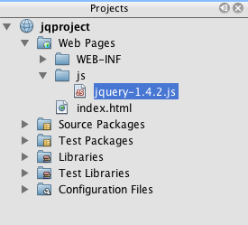
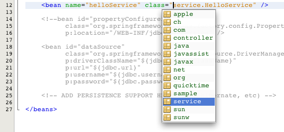
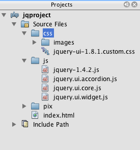

// 
//     Licensed to the Apache Software Foundation (ASF) under one
//     or more contributor license agreements.  See the NOTICE file
//     distributed with this work for additional information
//     regarding copyright ownership.  The ASF licenses this file
//     to you under the Apache License, Version 2.0 (the
//     "License"); you may not use this file except in compliance
//     with the License.  You may obtain a copy of the License at
// 
//       http://www.apache.org/licenses/LICENSE-2.0
// 
//     Unless required by applicable law or agreed to in writing,
//     software distributed under the License is distributed on an
//     "AS IS" BASIS, WITHOUT WARRANTIES OR CONDITIONS OF ANY
//     KIND, either express or implied.  See the License for the
//     specific language governing permissions and limitations
//     under the License.
//

= 使用 jQuery 改善 Web 页的外观和可用性
:jbake-type: tutorial
:jbake-tags: tutorials 
:jbake-status: published
:icons: font
:syntax: true
:source-highlighter: pygments
:toc: left
:toc-title:
:description: 使用 jQuery 改善 Web 页的外观和可用性 - Apache NetBeans
:keywords: Apache NetBeans, Tutorials, 使用 jQuery 改善 Web 页的外观和可用性

link:http://jquery.com/[+jQuery+] 是一个小型的 JavaScript 库，它允许程序员方便快速地改进 Web 页面的外观和行为。jQuery 的语法简洁，以 CSS 选择器的形式使用变量，作为将 DOM 的任何目标元素（可以是一个唯一元素 (`id`)，或者元素集 (`class`) 或者所选择的任何元素）与效果联系起来的途径。因为 jQuery 是 JavaScript，能把它嵌入到 JavaScript 所应用到的任何项目标中。

本教程说明了如何在 NetBeans 项目中开始使用 jQuery，以及如何在处理任何涉及 HTML、CSS 和 JavaScript 文件的前端项目时利用 IDE。首先，将向您演示如何调用代码完成函数和使用集成的 API 支持。还将向您介绍 jQuery 的关键概念，包括 `$(document).ready` 函数调用、类似 CSS 选择器的 jQuery 对象的使用以及 jQuery 效果和行为的链接方式。通过设置简单的 "contacts list" 示例文档并对其应用 link:http://jqueryui.com/demos/accordion/[+jQuery 可折叠面板窗口部件+]，您还将了解 link:http://jqueryui.com[+jQuery UI 库+]的优点。

有关如何在 HTML5 应用程序中使用 jQuery 的示例，请参见 link:../webclient/html5-gettingstarted.html[+HTML5 应用程序入门+]教程。

== 要完成本教程，需要使用以下资源。

|===
|软件或资源 |要求的版本 

|link:https://netbeans.org/downloads/index.html[+NetBeans IDE、Java EE 或 HTML5 和 PHP 包+] |7.0 或更高版本 

|link:http://www.oracle.com/technetwork/java/javase/downloads/index.html[+Java 开发工具包 (JDK)+] |7 或 8 

|link:http://docs.jquery.com/Downloading_jQuery#Current_Release[+jQuery Core 库+] |1.4.2 或更高版本 

|link:http://jqueryui.com/download[+jQuery 可折叠面板窗口部件+] |1.8.1 或更高版本 

|link:https://netbeans.org/projects/samples/downloads/download/Samples%252FJavaScript%252Fpix.zip[+项目资源+] |N/A 
|===

*注：*

* link:https://netbeans.org/projects/samples/downloads/download/Samples%252FJavaScript%252FjQueryProjectFiles.zip[+项目资源+]包含完成此教程所需的 JPG 文件。
* 如果需要将项目与工作解决方案进行比较，可以link:https://netbeans.org/projects/samples/downloads/download/Samples%252FJavaScript%252FjQueryProjectFiles.zip[+下载样例项目+]。（同时包括 PHP 和 Java Web 版本。）
* 如果您计划使用 Java 项目，则应考虑为开发环境配置服务器。GlassFish Server 包含在 IDE 的 Java 下载内容中，默认配置为从 NetBeans 中运行。
* 如果您计划使用 PHP 项目，将需要下载 PHP 并配置环境。有关详细信息，请参见 link:../../trails/php.html[+PHP 学习教程+]。
* 本文档假定您具备 HTML、CSS 和 JavaScript 的一些基本知识或编程经验。

[[settingup]]
== 设置 NetBeans 项目

1. 首先，创建一个新项目。选择 "File"（文件）> "New Project"（新建项目）（Ctrl-Shift-N 组合键；在 Mac 上为 ⌘-Shift-N 组合键）。
2. 如果要使用 PHP 项目，请选择 *PHP* 类别，然后选择 *PHP Application*（PHP 应用程序）。

如果要使用 Java Web 项目，请选择 *Java Web* 类别，然后选择 *Web Application*（Web 应用程序）。

. 单击 "Next"（下一步）并将项目命名为 `jqproject`。还要指定计算机中要用于保存项目的目录。单击 "Next"（下一步）。

. 在步骤 3 中，就本教程而言，请接受向导中提供的默认设置。 

*注：*如果您是初次创建 PHP 项目并且需要帮助，请参见 link:../../trails/php.html[+PHP 学习教程+]中的“为 PHP 开发配置环境”。

. 单击 *Finish*（完成），以完成向导并创建新项目。`jqproject` 将在 "Projects"（项目）窗口中打开，并在编辑器中打开项目欢迎页。

. 创建一个纯 HTML 文件，在本教程的剩余部分中，可以使用该文件。由于将要添加的 jQuery 代码不需要与后端服务器进行任何通信，因此只需在浏览器中运行该 HTML 文件便可查看结果。

右键单击项目节点并选择 "New"（新建）> "HTML file"（HTML 文件）（Ctrl-N 组合键）。

. 将文件命名为 `index`，然后单击 *Finish*（完成）。在 "Projects"（项目）窗口中，注意项目中已列出新的 `index.html` 文件，且在编辑器中打开该文件。

. 在浏览器中查看欢迎页的外观。要执行此操作，请右键单击 "Projects"（项目）窗口中的 `index.html` 节点并选择 "View"（查看）。（还可以在编辑器中从文件的右键单击菜单中选择 "View"（查看）。）将在浏览器窗口中显示该页。 

image::images/browser-test.png[title="查看浏览器窗口中的空 HTML 模板"]

. 在 NetBeans 编辑器的 `index.html` 文件中，在 `<title>` 标记之间键入 `jQuery Test Project`，并在页面的 `<head>` 标记内创建一对 `*
  </head>
  <body>
    TODO write content
  </body>
</html>
----

. 配置项目，以便在部署和运行应用程序时将 `index.html` 文件显示为欢迎文件。要执行此操作，请右键单击 "Projects"（项目）窗口中的 `jqproject` 节点，然后选择 "Properties"（属性）。
* *PHP 项目：*选择 *Run Configuration*（运行配置）类别，然后在 *Index File*（索引文件）字段中键入 `index.html`。
* *Java Web 项目：*选择 *Run*（运行）类别，然后在 *Relative URL*（相对 URL）字段中键入 `index.html`。

. 单击 "OK"（确定）关闭 "Project Properties"（项目属性）窗口并保存更改。

. 在此阶段，您可以删除随项目创建的原始索引文件。在 PHP 项目中，该文件为 `index.php` 文件；在 Java Web 项目中，该文件为 `index.jsp` 文件。

要删除该文件，请在 "Projects"（项目）窗口中右键单击文件，然后选择 "Delete"（删除）。在显示的确认对话框中，单击 *Yes*（是）。

[[addingjquery]]
== 将 jQuery 库添加到项目中

在开始使用 jQuery 之前，我们必须将 jQuery 库添加到项目中。如果尚未执行此操作，请从 link:http://jquery.com/[+http://jquery.com/+] 中下载 jQuery 库。

在下载之前选择未压缩的版本，即 "Development"。使用未压缩版本将允许您在编辑器中检查 JavaScript 代码并辅助任何调试过程。

要将 jQuery 库添加到 NetBeans 项目中，只需从计算机上的相应位置复制库文件夹，然后在 IDE 的 "Projects"（项目）窗口中将其直接粘贴到项目中。下面是详细信息。

1. 在 IDE 中，创建一个名为 `js` 的文件夹并将其添加到项目中。为此，请单击 IDE 工具栏中的 "New File"（新建文件）() 按钮。（也可以按 Ctrl-N 组合键；在 Mac 上按 ⌘-N 组合键。）
2. 选择 *Other*（其他）类别，然后选择 *Folder*（文件夹）。
3. 将该文件夹命名为 `js`。

[alert]#对于 Java Web 项目，确保将 `js` 文件夹放在项目的 Web 根中。为此，请在 *Parent Folder*（父文件夹）字段中输入 `web`。#

. 单击 *Finish*（完成）退出向导。

. 查找下载到计算机中的 jQuery 库。到目前为止，最新库版本为 1.4.2，因此文件通常命名为 `jquery-1.4.2.js`。将文件复制到剪贴板（Ctrl-C 组合键；在 Mac 上为 ⌘-C 组合键）。

. 将库文件粘贴到新的 `js` 文件夹中。为此，请右键单击 `js` 并选择 "Paste"（粘贴）（Ctrl-V 组合键；在 Mac 上为 ⌘-V 组合键）。`jquery-1.4.2.js` 文件节点将出现在该文件夹中。 
|===

|
==== PHP 项目：

 |

==== Java Web 项目：

 

|image:images/jquery-lib-php.png[title="将 jQuery 库直接粘贴到您的项目"] | 
|===

. 在编辑器中，从 `index.html` 文件中引用 jQuery 库。为此，请添加一对 `*

    
  </head>
  ...
----

. 保存文件（Ctrl-S；在 Mac 上为 ⌘-S）。

现在，jQuery 库包含在 `jqproject` 项目中，并从 `index.html` 文件中引用。我们可以开始向页面中添加 jQuery 功能。

[[gettingacquainted]]
== 熟悉 jQuery

jQuery 的原理是将动态应用的 JavaScript 属性和行为与 DOM（文档对象模型）元素连接在一起。让我们为 DOM 添加一个元素并试着改变其属性。我们将创建一个标题，当单击该标题时其颜色会由黑变蓝。

1. 首先创建该标题，在结构上创建一个 `<h1>` 元素。删除 "`TODO write content`" 注释并在 `<body>` 标记之间输入以下内容：

[source,xml]
----

<h1>Test.</h1>
----

. 现在我们将创建一个 CSS 类，当应用该类时使元素出现蓝色。在文档 `<head>` 的 `
    </head>
    ...
----

通过在编辑器中单击右键并选择 "Format"（格式化代码）可以清理代码。

我们将要添加的 jQuery 指令必须在浏览器加载所有 DOM 元素之后才能执行。这点很重要，因为 jQuery 行为与 DOM 元素连接在一起，jQuery 必须可以使用这些元素，以便得到预期结果。jQuery 通过其内置的 `(document).ready` 函数帮助实现此目的，该函数在 jQuery 对象之后，由 `$` 表示。

. 在刚创建的脚本标记间输入以下结构：

[source,java]
----

$(document).ready(function(){

});
----

还可以使用此函数的缩写版本：

[source,java]
----

$(function(){

});
----
jQuery 指令采用 JavaScript 方法的形式，通过一个可选的对象字面值来表示参数数组，且必须置于 `(document).ready` 函数内的花括号 `{}` 之间，从而只在合适的时间执行，也就是在 DOM 完全加载后。

在此阶段，`index.html` 文件应如下所示：

[source,xml]
----

<!DOCTYPE HTML PUBLIC "-//W3C//DTD HTML 4.01 Transitional//EN">
<html>
    <head>
        <title>jQuery Test Project</title>
        <meta http-equiv="Content-Type" content="text/html; charset=UTF-8">
        

        

        
    </head>
    <body>
        <h1>Test.</h1>
    </body>
</html>
----

. 为了演示 jQuery 语法的原理，我们将尝试一些简单操作。将 jQuery 指令添加到页面中，单击 "Test" 时，该指令使该词变为蓝色。为实现此功能，我们希望 jQuery 在接收到鼠标单击事件后将 CSS 类 `.blue` 添加到 DOM 的 `<h1>` 元素中。

在 `(document).ready` 函数的花括号 `{}` 内输入下面的代码：

[source,java]
----

$("h1").click(function(){
	$(this).addClass("blue");
});
----

. 保存文档（Ctrl-S 组合键；在 Mac 上为 ⌘-S 组合键），然后在编辑器中单击右键并选择 "View"（查看），将其加载到 Web 浏览器中。测试其运行情况。当单击 "Test" 单词，该词将变成蓝色。

image::images/blue-test.png[title="单击文本时文本将变为蓝色"] 

在本例中，当与 CSS 选择器 "`h1`" 相匹配的元素出现时，可使用 jQuery `click()` 函数调用 jQuery `addClass()` 函数。`$(this)` 指向调用元素。如果想在页面中添加更多的 `<h1>`，可以采用同一套规则下的相同行为，各行为单独与 jQuery 进行交互。（您可以自己尝试此练习）

. jQuery 的另一项重要特质是其函数可被简单链接起来，以创建更加复杂甚至是串行化的行为。为演示这一点，我们将为 `click()` 函数添加一条“慢 fadeOut”指令。在 `addClass` 函数后面添加一个 `fadeOut("slow")` jQuery 函数，如下所示：

[source,java]
----

$(this).addClass("blue").fadeOut("slow");
----
完整的 jQuery 函数如下所示：

[source,java]
----

$(document).ready(function(){
    $("h1").click(function(){
        $(this).addClass("blue").fadeOut("slow");
    });
});
----

. 在浏览器中刷新页面，然后单击 "Test"。您将看到 "Test" 变蓝，然后淡出，并从页面中消失。（想再试一次，必须刷新页面。）

=== NetBeans 代码完成和 API 支持

只要在编辑器中键入内容，便可以通过按 Ctrl-空格键调用代码完成。IDE 会显示一个可供您选择的建议列表，以及一个定义所列项目、提供代码示例并显示目标浏览器支持的 API 文档窗口。

通过打开 IDE 的 JavaScript 选项窗口可为代码完成和 API 文档指定目标浏览器。选择 "Tools"（工具）> "Options"（选项）（在 Mac 上为 "NetBeans" > "Preferences"（首选项）），然后选择 "Miscellaneous"（其他）> "JavaScript"（JavaScript）。

[[addingaccordion]]
== 将 jQuery 可折叠面板窗口部件添加到项目中

通过使用包含在核心 jQuery 库中的 JavaScript 行为，我们创建了上面的简单测试。现在，我们通过使用基本 HTML 标记设置员工联系人列表来检查更真实的示例。然后，我们将 link:http://jqueryui.com/demos/accordion/[+jQuery 可折叠面板窗口部件+]应用于该联系人列表。

可折叠面板窗口部件属于 link:http://jqueryui.com/[+jQuery UI 库+]的一部分。UI 库在核心库的基础上构建，提供了用于为 Web 页启用交互、窗口部件和效果的模块化方法。可使文件大小保持为最小值，并可以方便地从位于 link:http://jqueryui.com/download[+http://jqueryui.com/download+] 的 jQuery 下载界面中只选择所需组件。

如果尚未执行此操作，请访问 link:http://jqueryui.com/download[+http://jqueryui.com/download+] 并下载可折叠面板导航窗口部件。请注意，在选择可折叠面板窗口部件时，会自动选择 UI 核心库和窗口部件工厂。还请注意，在下载页面中，默认情况下会选择 "`UI lightness`" 主题并将其包括在下载包中。在<<usingcss,以下部分>>中，会将此主题应用于联系人列表。

1. 将以下代码粘到文档中代替 `<h1>Test。</h1>`。

[source,html]
----

    <h3><a href="#">Mary Adams</a></h3>
    

        
        <ul>
            <li><h4>Vice President</h4></li>
            <li><b>phone:</b> x8234</li>
            <li><b>office:</b> 102 Bldg 1</li>
            <li><b>email:</b> m.adams@company.com</li>
        </ul>
         
    

    <h3><a href="#">John Matthews</a></h3>
    

        
        <ul>
            <li><h4>Middle Manager</h4></li>
            <li><b>phone:</b> x3082</li>
            <li><b>office:</b> 307 Bldg 1</li>
            <li><b>email:</b> j.matthews@company.com</li>
        </ul>
         
    

    <h3><a href="#">Sam Jackson</a></h3>
    

        
        <ul>
            <li><h4>Deputy Assistant</h4></li>
            <li><b>phone:</b> x3494</li>
            <li><b>office:</b> 457 Bldg 2</li>
            <li><b>email:</b> s.jackson@company.com</li>
        </ul>
         
    

    <h3><a href="#">Jennifer Brooks</a></h3>
    

        
        <ul>
            <li><h4>Senior Technician</h4></li>
            <li><b>phone:</b> x9430</li>
            <li><b>office:</b> 327 Bldg 2</li>
            <li><b>email:</b> j.brooks@company.com</li>
        </ul>
         
    

----
注意整个 `
` 闭合元素被赋予了一个值为 `infolist` 的 `id` 属性。在此 `
` 元素中，有四组包含图像和未排序列表的 `<h3>` 标记和 `
` 标记。

. 向上面的标记中添加一些内联 CSS 规则。删除您为上面的测试创建的 `.blue` 样式规则。在其位置添加以下规则。（更改内容以*粗体*显示。）

[source,xml]
----

----

在 `<style>` 标记内键入内容时，可以通过按 Ctrl-空格键利用 IDE 的内置 CSS 代码完成。

. 保存文件（Ctrl-S；在 Mac 上为 ⌘-S）。

. 现在，我们将向项目添加以前代码片段中涉及的 JPG 肖像。从<<requiredSoftware,之前下载的项目资源>>中检索 `pix` 目录，将整个目录复制到项目文件夹中，将其与 `index.html` 目录同级放置。稍后，NetBeans 将自动更新 "Projects"（项目）窗口，可以看到该项目中已经添加了一个新目录。

. 切换到浏览器并刷新页面。

image::images/structured-list.png[title="结构化列表显示在浏览器中"] 

我们还要说明本文档的许多问题。首先，在列表中快速扫描以找到您要找的人变得更加困难：必须滚动页面查看大量可能和当前利益无关的信息。四个联系人的列表都是可管理的，但如果人数上升到 50 人（举例来说），使用列表将变得更加困难。其次，该文档看起来是简单的，不大可能很美观地插入大多数 Web 站点的设计，特别是有很强图形特征的设计。我们将通过组合使用 jQuery 可折叠面板窗口部件和 jQuery UI 的默认主题来解决这些问题。

. 要生成可折叠面板效果，请导航至计算机上下载可折叠面板窗口部件的位置。在下载的文件夹中，您将发现一个名为 "`development-bundle`" 的文件夹。在 `development-bundle` 文件夹中，展开 `ui` 文件夹并查找以下三个脚本：
* `jquery.ui.core.js`
* `jquery.ui.widget.js`
* `jquery.ui.accordion.js`

工具包脚本的开发版未进行_最小化处理_，这意味着在编辑器中查看时，其代码易于读取。通常，您要切换到产品应用程序的已压缩的最小化版本，以节省下载时间。

. 复制（Ctrl-C 组合键；在 Mac 上为 ⌘-C 组合键）这三个脚本，回到 IDE 中，将其粘贴到您之前在 `jqproject` 文件夹中<<js,创建>>的 `js` 文件夹。

可以通过按 Ctrl-V 组合键（在 Mac 上为 ⌘-V 组合键）或右键单击 `js` 文件夹并选择 "Paste"（粘贴）来进行粘贴。

`development-bundle` > `ui` 文件夹也包含一个名为 `jquery-ui-1.8.1.custom.js` 的文件。此文件将上面所列的三个脚本组合为一个脚本。也可以将此文件粘贴到项目中，以代替三个单独的脚本。

. 通过输入三个链接到这些新 JavaScript 文件的 `
    
    
    

    
</head>
----

. 让静态、无样式的列表接受折叠行为就和添加一行 jQuery 代码一样简单。将此行输入 `(document).ready` 函数中。（更改内容以*粗体*显示。）

[source,java]
----

$(document).ready(function(){
    *$("#infolist").accordion({
        autoHeight: false
    });*
});
----
在此行代码中，`#infolist` 是一个 CSS 选择器，连接到一个唯一的 DOM 元素中，该元素有一个值为 `infolist`（换言之，即联系列表）的 `id` 属性。 它使用典型的 JavaScript 点表示法 ("`.`") 连接到使用 `accordion()` 方法的 jQuery 指令，以显示此元素。

您还在上面的代码片段中指定了 "`autoHeight: false`"。这样可以防止可折叠面板窗口部件根据标记内包含的最高内容部分设置每个面板的高度。有关详细信息，请参见link:http://docs.jquery.com/UI/Accordion[+可折叠面板 API 文档+]。

. 保存文件（Ctrl-S；在 Mac 上为 ⌘-S）。

. 返回 Web 浏览器并刷新。单击其中一个姓名（除了顶部第一个），查看实际的折叠效果。jQuery 可折叠面板窗口部件可处理有关处理 DOM 和响应用户鼠标单击的所有详细信息。 

image::images/accordion-list.png[title="可折叠面板窗口部件处理用户单击并生成可折叠面板效果"]

[[usingcss]]
== 将 jQuery 的默认主题用于样式增强

我们的项目现有具有了我们想要的行为。现在，我们通过并入 jQuery 的默认 "`UI lightness`" 主题来解决此问题。

1. 导航至计算机中下载可折叠面板窗口部件的位置。在下载的文件夹中，展开 `development-bundle` > `themes` > `ui-lightness` 文件夹。
2. 在 `ui-lightness` 文件夹中，复制（Ctrl-C 组合键；在 Mac 上为 ⌘-C 组合键）`jquery-ui-1.8.1.custom.css` 文件和 `images` 文件夹，其中包含正确呈现主题所需的所有图像。
3. 在 IDE 中，在名为 `css` 的项目中创建一个新文件夹。此文件夹将包含可折叠面板窗口部件的 "`UI lightness`" 主题。

为此，请右键单击项目节点并选择 "New"（新建）> "Folder"（文件夹）。（如果文件夹未显示为选项，请单击 IDE 工具栏中的 "New File"（新建文件）() 按钮，然后在新建文件向导中选择 "Other"（其他）> "Folder"（文件夹）。）将该文件夹命名为 `css` 并将其与 `index.html` 文件放在同一目录中。

[alert]#对于 Java Web 项目，请确保将 `css` 文件夹放在项目的 Web 根中。为此，请在 *Parent Folder*（父文件夹）字段中输入 `web`。#

. 将这两项直接粘贴到新的 `css` 文件夹中。为此，请右键单击 `css` 文件夹节点并选择 "Paste"（粘贴）。项目文件夹应如下所示。 
|===

|
==== PHP 项目：

 |

==== Java Web 项目：

 

| |image:images/proj-win-java.png[title="项目包含 jQuery 默认主题"] 
|===

. 从 `index.html` Web 页中引用 `jquery-ui-1.8.1.custom.css` 文件。在页的头中添加以下 `<link>` 标记。

[source,java]
----

<link rel="stylesheet" href="css/jquery-ui-1.8.1.custom.css" type="text/css">
----

. 保存文件（Ctrl-S；在 Mac 上为 ⌘-S）。

. 返回到 Web 浏览器并刷新页面。请注意，现在使用 jQuery 的默认主题显示列表，这是简单、未风格化的版本的美学改进。 

image::images/ui-lightness-theme.png[title="jQuery 默认主题增强可折叠面板窗口部件的外观"]

[[summary]]
== 小结

在本教程中，您了解了如何在项目中添加 jQuery 库以及如何使用 jQuery 语法编写一些基本指令。您还了解了 jQuery 如何使用和 CSS 选择器类似的变量与 DOM（文档对象模型）进行交互，从而影响 Web 页面中元素的外观和行为。

最后，通过将可折叠面板窗口部件应用于简单的联系人列表，您简要地了解了 jQuery UI 库的功能。在实现可折叠面板效果后，您将 jQuery 的默认样式主题应用于该列表。现在，您应该能更好地体会到如何使用 jQuery 来创建动态 Web 页，并改进整体外观和可用性。

link:/about/contact_form.html?to=3&subject=Feedback: Using jQuery to Enhance the Appearance and Usability of a Web Page[+发送有关此教程的反馈意见+]

[[seealso]]
== 另请参见

有关 link:https://netbeans.org/[+netbeans.org+] 上的 IDE 中 HTML5 应用程序和 JavaScript 支持的详细信息，请参见以下资源：

* link:../webclient/html5-gettingstarted.html[+HTML5 应用程序入门+]。此文档说明如何安装用于 Chrome 的 NetBeans Connector 扩展以及创建和运行简单 HTML5 应用程序。
* link:../webclient/html5-editing-css.html[+在 HTML5 应用程序中使用 CSS 样式表+]。该文档继续使用在本教程中创建的应用程序，说明如何在 IDE 中使用部分 CSS 向导和窗口，以及如何在 Chrome 浏览器中使用检测模式以直观地在项目源代码中查找元素。
* link:../webclient/html5-js-support.html[+在 HTML5 应用程序中调试和测试 JavaScript+]。此文档说明 IDE 如何提供工具来帮助您在 IDE 中调试和测试 JavaScript 文件。
* link:js-toolkits-dojo.html[+使用 JSON 将 Dojo 树连接至 ArrayList+]。提供了 Dojo 工具包简介，还介绍了演示如何使用 Ajax 和 JSON 与后端服务器交互的步骤。
* link:../../docs/php/ajax-quickstart.html[+Ajax 简介 (PHP)+]。介绍如何使用 PHP 技术构建简单的应用程序，同时讲解了 Ajax 请求的基础过程流。
* link:ajax-quickstart.html[+Ajax 简介 (Java)+]。介绍如何使用 Servlet 技术构建简单的应用程序，同时讲解了 Ajax 请求的基础过程流。

有关 jQuery 的更多信息，请参见官方文档：

* 官方主页：link:http://jquery.com[+http://jquery.com+]
* UI 主页：link:http://jqueryui.com/[+http://jqueryui.com/+]
* 教程：link:http://docs.jquery.com/Tutorials[+http://docs.jquery.com/Tutorials+]
* 文档主页：link:http://docs.jquery.com/Main_Page[+http://docs.jquery.com/Main_Page+]
* UI 演示和文档：link:http://jqueryui.com/demos/[+http://jqueryui.com/demos/+]

