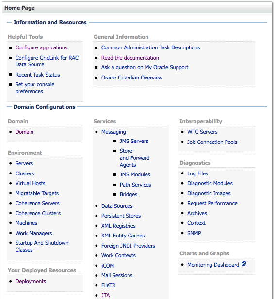
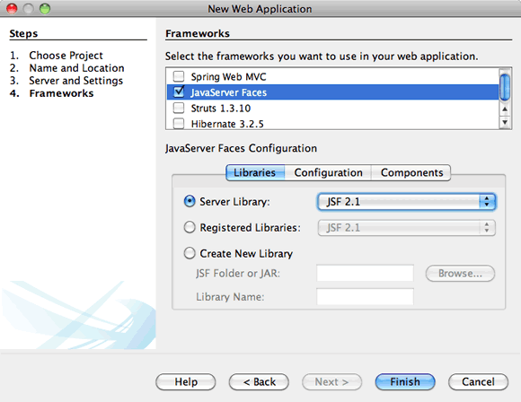
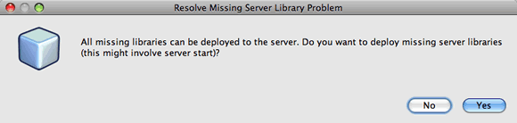
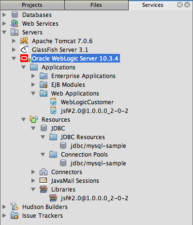

// 
//     Licensed to the Apache Software Foundation (ASF) under one
//     or more contributor license agreements.  See the NOTICE file
//     distributed with this work for additional information
//     regarding copyright ownership.  The ASF licenses this file
//     to you under the Apache License, Version 2.0 (the
//     "License"); you may not use this file except in compliance
//     with the License.  You may obtain a copy of the License at
// 
//       http://www.apache.org/licenses/LICENSE-2.0
// 
//     Unless required by applicable law or agreed to in writing,
//     software distributed under the License is distributed on an
//     "AS IS" BASIS, WITHOUT WARRANTIES OR CONDITIONS OF ANY
//     KIND, either express or implied.  See the License for the
//     specific language governing permissions and limitations
//     under the License.
//

= Developing an Enterprise Application for Oracle WebLogic Server
:jbake-type: tutorial
:jbake-tags: tutorials 
:jbake-status: published
:icons: font
:syntax: true
:source-highlighter: pygments
:toc: left
:toc-title:
:description: Developing an Enterprise Application for Oracle WebLogic Server - Apache NetBeans
:keywords: Apache NetBeans, Tutorials, Developing an Enterprise Application for Oracle WebLogic Server

This tutorial demonstrates how to use the IDE to create a web application that uses JavaServer Faces (JSF) 2.x and the Java Persistence API (JPA) 2.0 and then deploy the application to the Oracle WebLogic Server. In this tutorial you will register the WebLogic Server with the IDE, and then use wizards in the IDE to create a JDBC resource and entity and bean classes. You will then use the IDE to deploy the application to the server and register the new datasource.

image::images/netbeans-stamp-80-74-73.png[title="Content on this page applies to the NetBeans IDE 7.2, 7.3, 7.4 and 8.0"]

*To follow this tutorial, you need the following software and resources.*

|===
|Software or Resource |Version Required 

|xref:../../../download/index.adoc[+NetBeans IDE+] |7.2, 7.3, 7.4, 8.0, Java EE 

|link:http://www.oracle.com/technetwork/java/javase/downloads/index.html[+Java Development Kit (JDK)+] |Version 6 or 7 

|link:http://www.oracle.com/technetwork/middleware/weblogic/downloads/index.html[+Oracle WebLogic Server+] |11g Rel 1 (10.3.4, 10.3.5), 12c (12.1.1.0) 

|sample database |MySQL or JavaDB 
|===

*Notes.*

* This project uses the * ``sample`` * database that is available for either the MySQL or JavaDB database servers. For details on using a MySQL database server with the IDE and creating a database connection, see the xref:../ide/mysql.adoc[+Connecting to a MySQL Database+] tutorial. Alternatively, you can use the database connection for the JavaDB  ``sample``  database that is registered with the IDE by default if you install the GlassFish server during the IDE installation.

== Registering the Oracle WebLogic Server

In this tutorial you will deploy a web application to the Oracle WebLogic Server. To deploy applications to the WebLogic Server from the IDE, you need to register an instance of the server with the IDE. This section describes how to use the Add Server Instance wizard in the IDE to register an instance of the WebLogic Server.

=== Downloading and Installing the Server

Before you can register the server, you need to download the WebLogic Server installer and follow the steps described in the link:http://download.oracle.com/docs/cd/E17904_01/doc.1111/e14142/toc.htm[+Oracle WebLogic Server installation guide+] to install the server on your local machine. In addition to installing the server, you will need to create a WebLogic domain before you can register the server with the IDE.

1. Download the installer from the link:http://www.oracle.com/technetwork/middleware/weblogic/downloads/index.html[+Oracle WebLogic Server Downloads+] page.
2. Install the server by following the steps in the link:http://download.oracle.com/docs/cd/E17904_01/doc.1111/e14142/toc.htm[+Oracle WebLogic Server installation guide+].

Remember to note the user name and password.

. Create a WebLogic domain.

You can use the link:http://download.oracle.com/docs/cd/E17904_01/web.1111/e14140/newdom.htm#i1073602[+Graphical Mode of the WebLogic Configuration Wizard+] to help you create the domain.

You might want to look at the following sections of the WebLogic Server Installation Guide for details on installing and setting up the server.

* link:http://download.oracle.com/docs/cd/E17904_01/doc.1111/e14142/prepare.htm[+Preparing for Installation+]
* link:http://download.oracle.com/docs/cd/E17904_01/web.1111/e14140/intro.htm[+Introduction to WebLogic Domains+]
* link:http://download.oracle.com/docs/cd/E17904_01/web.1111/e14140/newdom.htm[+Creating a WebLogic domain+]
 

=== Registering the Server with the IDE

After you install the server, you can use the Add Server Instance wizard to register an instance of the server by specifying the server domain.

1. Open the Services window.
2. Right-click the Servers node and choose Add Server.
3. Select Oracle WebLogic Server. Click Next.
4. Click Browse and locate the directory that contains the installation of the server. Click Next.

The IDE will automatically identify the domain for the server instance.

. Type the username and password for the domain.

. Enable JPA 2.0 (WebLogic Server 10.3.4 or 10.3.5 only). Click Finish.

*Note.* If you are registering an instance of WebLogic Server 12c (12.1.1.0) you do not need to enable JPA 2.0 because JPA 2.0 is enabled by default. If you are registering an instance of WebLogic Server 11g Rel 1 (10.3.4 or 10.3.5) you can enable JPA 2.0 when you register the server or in the Servers manager after the server is registered. See the section <<01e,Enabling Support for JPA 2.0 on Oracle WebLogic Server 11g>> below for more details.

image::images/add-weblogic-server2.png[title="Add Server wizard"]

When you click Finish, the Oracle WebLogic Server will appear under the Servers node in the Services window.

You can right-click the Oracle WebLogic Server node to perform various actions, including the following:

* Start and Stop the server
* Open the Admin Console in your browser
* View the Server Log in the Output window of the IDE

image::images/weblogic-services-window1.png[title="WebLogic Server in the Services window"]  

=== Opening the Admin Console

In this exercise you will open the Admin Console for the WebLogic Server in your browser. The Admin Console enables you to configure the server settings and view the deployed applications and available resources.

1. Start the server by right-clicking the Oracle WebLogic Server node in the Services window and choosing Start.

When you start the server you can see the server log in the Oracle WebLogic Server tab of the Output window.

You can right-click the Oracle WebLogic Server node and choose View Server Log if the tab is not visible.

. Right-click the Oracle WebLogic Server node and choose View Admin Console.

When you choose View Admin Console, the login screen of the server opens in your browser.

. Log in with the username and password that you specified when you installed the server.

After you log in, you will see the Home Page of the Admin Console in your browser.

=== Enabling Support for JPA 2.0 on Oracle WebLogic Server 11g 

If you are using Oracle WebLogic Server 11g (10.3.4, 10.3.5) you need to enable support for Java Persistence API (JPA) 2.0 and set the default persistence provider to TopLink. Oracle WebLogic Server 11g is a Java EE 5 container and is JPA 1.0 and JPA 2.0 compliant. JPA 1.0 is enabled by default when you install Oracle WebLogic Server 10.3.4 and 10.3.5, but the WebLogic Server installation includes the necessary files to support JPA 2.0. You can enable JPA 2.0 for the WebLogic Server when you register the server instance or in the Servers manager in the IDE. Alternatively, you can follow the steps for link:http://download.oracle.com/docs/cd/E17904_01/web.1111/e13720/using_toplink.htm#EJBAD1309[+Using JPA 2.0 with TopLink in WebLogic Server+] in the WebLogic Server documentation.

The WebLogic Server supports Java Persistence API (JPA) and comes bundled with the Oracle TopLink and Kodo persistence libraries. In this exercise you will change the default persistence provider from Kodo to Oracle Toplink in the Admin Console of the WebLogic Server.

*Note.* TopLink and JPA 2.0 support are enabled by default when you install WebLogic Server 12c.

To enable support for JPA 2.0 in the Servers manager and set the default persistence provider, perform the following steps.

1. Right-click the Oracle WebLogic Server node in the Services window and choose Properties to open the Servers manager.

Alternatively, you can choose Tools > Servers from the main menu to open the Server manager.

image::images/weblogic-properties-enablejpa.png[title="Domain tab in Servers manager"]

The Domain tab of the Servers manager enables you to view and modify the username and password.

. Click Enable JPA 2. Click Close.

When you click Enable JPA 2, the IDE will modify the WebLogic Server classpath to add the files to enable support for JPA 2.

*Note.* You can also enable JPA 2.0 using Oracle Smart Update or by manually modifying the WebLogic classpath. For more details on enabling support for JPA 2.0, please see the following links.

* link:http://download.oracle.com/docs/cd/E17904_01/web.1111/e13720/using_toplink.htm#EJBAD1309[+Using JPA 2.0 with TopLink in WebLogic Server+]
* link:http://forums.oracle.com/forums/thread.jspa?threadID=1112476[+OTN Discussion Forum: 11g Release 1 Patch Set 3 (WLS 10.3.4) +]
* link:http://wiki.eclipse.org/EclipseLink/Development/JPA_2.0/weblogic[+Running JPA 2.0 API on WebLogic 10.3+]

. Open the Oracle WebLogic Server Admin Console in your browser and log in.

. Click *Domain* under the Domain Configurations section of the Admin Console.

. Click the *JPA* tab under the Configuration tab.

. Select *TopLink* in the Default JPA Provider dropdown list. Click Save.

image::images/admin-console-jpa.png[title="JPA tab in Oracle WebLogic Server Admin Console"]

When you click Save, Oracle TopLink will be the default persistence provider for applications deployed to the server when no persistence provider is explicitly specified by the application.

*Note.* The application in this tutorial will use the Java Transaction API (JTA) to manage transactions. JTA is enabled by default when you install WebLogic. You can modify the JTA settings in the JTA tab in the Configuration tab for the domain.

== Creating the Web Application

In this tutorial you will create a Java EE web application. The web application will contain entity classes that are based on tables in the sample database. After you create the connection to the database, you will create a persistence unit and use a wizard in the IDE to generate entity classes from the database. You will then use a wizard to create JSF pages based on the entity classes.

=== Creating the Project

In this exercise you will use the New Project wizard to create a web application and specify the Oracle WebLogic Server as the target server.

1. Choose File > New Project (Ctrl-Shift-N; ⌘-Shift-N on Mac).
2. Select Web Application from the Java Web category. Click Next.
3. Type *WebLogicCustomer* for the project name and specify the project location.
4. Deselect the Use Dedicated Folder option, if selected. Click Next.
5. Select *Oracle WebLogic Server* from the Server dropdown list.
6. Select *Java EE 5* or *Java EE 6 Web* as the Java EE Version. Click Next.

*Note.* Java EE 6 Web is only available if you registered an instance of WebLogic Server 12c.

image::images/new-project-ee6.png[title="Weblogic selected in New Project wizard"]

. Select JavaServer Faces framework.

. Select JSF 2.x from the Server Library dropdown list. Click Finish.

When you click Finish, the IDE creates the web application project and opens  ``index.xhtml``  in the editor. In the Projects window you can see that the IDE created the  ``weblogic.xml``  descriptor file and  ``web.xml``  under the Configuration Files node.

image::images/wl-projects-window1.png[title="weblogic.xml selected in Projects window"]

If you open  ``web.xml``  in the editor you can see that  ``faces/index.xhtml``  is specified as the default index page. If you open  ``weblogic.xml``  in the editor the file will be similar to the following.

[source,xml]
----

<?xml version="1.0" encoding="UTF-8"?>
<weblogic-web-app xmlns="http://xmlns.oracle.com/weblogic/weblogic-web-app" xmlns:xsi="http://www.w3.org/2001/XMLSchema-instance" xsi:schemaLocation="http://java.sun.com/xml/ns/javaee http://java.sun.com/xml/ns/javaee/web-app_2_5.xsd http://xmlns.oracle.com/weblogic/weblogic-web-app http://xmlns.oracle.com/weblogic/weblogic-web-app/1.0/weblogic-web-app.xsd">
  <jsp-descriptor>
    <keepgenerated>true</keepgenerated>
    <debug>true</debug>
  </jsp-descriptor>
  <context-root>/WebLogicCustomer</context-root>
</weblogic-web-app>
----

*Notes.*

* If the  ``weblogic.xml``  file contains the  ``<fast-swap>``  element, confirm that  ``fast-swap``  is disabled by confirming that the value for the  ``<enabled>``  element is *false*.

[source,xml]
----

    <fast-swap>
        <enabled>*false*</enabled>
    </fast-swap>
----
* If the target server is WebLogic Server 11g (10.3.4 or 10.3.5), the server installation includes the libraries necessary for using JSF 1.2 and JSF 2.x in your applications but they are deactivated by default. You need to deploy and install the JSF 2.x libraries before you can start using the libraries. If the library is not already installed, the IDE will prompt you and can install the library for you if you choose the library in the New Project wizard. The library only needs to be installed once.

After you create the application, when you view the  ``weblogic.xml``  descriptor file you can see that the IDE modified the file to specify the JSF library that will be used with the application.

[source,xml]
----

<?xml version="1.0" encoding="UTF-8"?>
<weblogic-web-app xmlns="http://www.bea.com/ns/weblogic/90" xmlns:j2ee="http://java.sun.com/xml/ns/j2ee" xmlns:xsi="http://www.w3.org/2001/XMLSchema-instance" xsi:schemaLocation="http://www.bea.com/ns/weblogic/90 http://www.bea.com/ns/weblogic/90/weblogic-web-app.xsd">
  <context-root>/WebLogicCustomer</context-root>
  *<library-ref>
      <library-name>jsf</library-name>
      <specification-version>2.0</specification-version>
      <implementation-version>1.0.0.0_2-0-2</implementation-version>
      <exact-match>true</exact-match>
  </library-ref>*
</weblogic-web-app>
----
 

=== Creating the Database Connection

This tutorial uses a database that is named *sample* and running on the MySQL database server. In this exercise you will use the IDE to create the database and populate the database tables. You will then open a database connection to the database. The IDE will use the database connection details to create the persistence unit for the application. For more details about using a MySQL database server with the IDE, see the xref:../ide/mysql.adoc[+Connecting to a MySQL Database+] tutorial

*Note.* Alternatively, if you installed the GlassFish server when you installed the IDE, you can use the database connection to the sample database on the JavaDB database server that was registered automatically during the IDE installation.

In this exercise you will create and open a connection to the database.

1. Right-click the MySQL Server node in the Services window and choose Connect.
2. Type the user name and password. Click OK.
3. Right-click the MySQL Server node and choose Create Database.
4. Select *sample* in the New Database Name dropdown list. Click OK.

image::images/create-db.png[title="Create Database dialog box"]

*Note.* Depending on how you configured your database, you may need to explicitly specify access permissions for the new database.

When you click OK, the IDE creates the sample database and populates the database tables. If you expand the MySQL server node you can see that the list of databases now contains the new  ``sample``  database.

. Expand the MySQL server node and right-click the sample database and choose Connect.

When you click Connect, a database connection node for the database appears under the Databases node. You can expand the node to view the database tables.

image::images/services-window2.png[title="Sample database node in in the Services window"]

The IDE uses the database connection to connect to the database and retrieve the database details. The IDE also uses the details from the database connection to generate the XML file that the WebLogic Server uses to create the data sources on the server and identify the appropriate drivers.

If you do not have a MySQL database installed, you can use the  ``sample``  database running on JavaDB. If the  ``sample``  database does not exist, you can right-click the MySQL (or JavaDB) node and choose Create Database.

For more details see xref:../ide/mysql.adoc[+Connecting to a MySQL Database+] tutorial.

 

=== Creating the Persistence Unit

To manage persistence in the application you only need to create a persistence unit, specify which data source and entity manager to use, and then let the container do the work of managing entities and persistence. You create a persistence unit by defining it in  ``persistence.xml`` .

*Note.* For the purpose of demonstration, in this exercise you will use the New Persistence Unit wizard to create the  ``persistence.xml``  file. The wizard will help you specify the properties of the persistence unit. You can also create a persistence unit in the New Entity Class from Database wizard. If no persistence unit exists, the wizard provides the option to create a persistence unit for the project. The wizard will create a persistence unit that uses the WebLogic Server default persistence provider.

1. Right-click the project node in the Projects window and choose Properties.
2. In the Sources category of the Properties window, select *JDK 6* as the Source/Binary Format. Click OK.
3. Choose New File (Ctrl-N; ⌘-N on Mac) to open the New File wizard.
4. Select Persistence Unit from the Persistence category. Click Next.
5. Keep the default name for the persistence unit suggested by the wizard.
6. Choose *EclipseLink* in the Persistence Provider drop-down list.
7. Choose New Data Source in the Data Source dropdown list.
8. Type *jdbc/mysql-sample* for the JNDI name in the New Data Source dialog box.
9. Choose the MySQL sample database connection. Click OK to close the dialog box.
10. Click Finish in the New Persistence Unit wizard.

image::images/new-persistence-eclipselink1.png[title="New Persistence Unit wizard"]

When you click Finish,  ``persistence.xml``  is created for your project and opens in the editor. You can click Source in the toolbar of the editor to open  ``persistence.xml``  in the XML source editor. This file contains all the information the server needs to manage the entities and persistence of the application.

*Note.* If you are not using an existing datasource, the IDE will generate an XML file under the Server Resources node (for example,  ``datasource-1-jdbc.xml`` ) that contains the details that are used to create the datasource on the server, including the JDBC driver for the database.

If you open  ``persistence.xml``  in the XML source editor, you can see that the IDE specified the persistence version as 2.0 and that the schema as  ``persistence_2_0.xsd`` . The IDE specifies  ``org.eclipse.persistence.jpa.PersistenceProvider``  as the persistence provider in  ``persistence.xml`` . EclipseLink is the primary persistence implementation for Oracle TopLink and the reference implementation of JPA.

[source,xml]
----

<?xml version="1.0" encoding="UTF-8"?>
<persistence *version="2.0"* xmlns="http://java.sun.com/xml/ns/persistence" xmlns:xsi="http://www.w3.org/2001/XMLSchema-instance" xsi:schemaLocation="http://java.sun.com/xml/ns/persistence http://java.sun.com/xml/ns/persistence/*persistence_2_0.xsd*">
  <persistence-unit name="WebLogicCustomerPU" transaction-type="JTA">
    <provider>org.eclipse.persistence.jpa.PersistenceProvider</provider>
    <jta-data-source>jdbc/mysql-sample</jta-data-source>
    <exclude-unlisted-classes>false</exclude-unlisted-classes>
    <properties>
      <property name="eclipselink.ddl-generation" value="create-tables"/>
    </properties>
  </persistence-unit>
</persistence>
----

You can also choose TopLink in the wizard, in which case the wizard will specify  ``oracle.toplink.essentials.PersistenceProvider``  as the persistence provider in  ``persistence.xml`` . The IDE will add the Oracle TopLink Essentials - 2.0.1 libraries to the classpath. In current and future versions of Oracle TopLink, Oracle TopLink Essentials is replaced by EclipseLink. Where possible, you should choose to use Oracle TopLink/EclipseLink instead of Oracle TopLink Essentials.

 

=== Creating the Entity Classes

You will now use the Entity Classes from Database wizard to create the entity classes based on the relational database.

1. Choose New File (Ctrl-N) to open the New File wizard.
2. Select Entity Classes from Database from the Persistence category. Click Next.
3. In the Entity Classes from Database wizard, select *jdbc/mysql-sample* from the Data Source drop-down list and supply the password, if necessary.
4. Select the *Customer* table from the Available Tables and click Add. Click Next.

The wizard lists the  ``customer``  table and the related tables under Selected Tables.

. Type *ejb* as the package for the generated classes. Click Finish.

When you click Finish, the IDE generates entity classes for each of the selected tables. You can expand the  ``ejb``  source package node to view the generated entity classes.

 

=== Generating JSF Pages

In this exercise you will use a wizard to generate JSF pages based on the existing entity classes.

1. Right-click the project node and choose New > Other.
2. Select JSF Pages from Entity Classes in the JavaServer Faces category of the New File wizard. Click Next.
3. Click Add All to create JSF pages for all the available entities. Click Next.
4. Type *web* for the package for the session beans and JPA controller classes. Click Finish.

When you click Finish, the IDE generates JSF 2.0 pages and controller and converter classes for the JSF pages. The IDE generates a set of JSF pages for each entity class in the default Web Pages directory. The IDE also generates a managed bean class for each entity that accesses the corresponding session facade class for the entity.

 

=== Running the Project

In this exercise you will build and deploy the web application to the WebLogic Server. You will use the Run command in the IDE to build, deploy and launch the application.

1. Right-click the project node and choose Run.

When you click Run, the IDE builds the project and deploys the WAR archive to the WebLogic Server and creates and registers the new JDBC datasource. The welcome page of the application (link:http://localhost:7001/WebLogicCustomer/[+http://localhost:7001/WebLogicCustomer/+]) opens in your browser.

image::images/browser-welcome.png[title="Welcome page in browser"]

If you log in to the Admin Console, you can click Deployments in the Your Deployed Resources section to see a table with the resources that are currently deployed to the server.

image::images/adminconsole-deployments.png[title="Deployments table in WebLogic Server Admin Console"]

You can click the name of each of the resources to view additional details about the resource. You can also delete resources in the Deployments table.

*Notes about deploying to WebLogic Server 10.3.4 or 10.3.5.*

* If you deployed the application to WebLogic Server 10.3.4 or 10.3.5 you can see in the table that the JSF 2.0 library was also deployed to the server in addition to the  ``WebLogicCustomer.war``  web application and the  ``jdbc/mysql-sample``  JDBC configuration. 

image::images/admin-console-deployments.png[title="Deployments table in WebLogic Server Admin Console"]

* If you expand the Oracle WebLogic Server instance in the Services window, you can view the applications and resources that are deployed to the server. You can see that the JDBC resources were created on the server and that the JSF libraries were installed.

For more information about deploying applications, see link:http://download.oracle.com/docs/cd/E12840_01/wls/docs103/deployment/index.html[+Deploying Applications to WebLogic Server +]

xref:../../../community/mailing-lists.adoc[Send Feedback on This Tutorial]

== See Also

For more information about using NetBeans IDE to develop web applications using Java Persistence and JavaServer Faces, see the following resources:

* xref:../javaee/weblogic-javaee-m1-screencast.adoc[+Video of Deploying a Web Application to the Oracle WebLogic Server+]
* xref:jsf20-intro.adoc[+Introduction to JavaServer Faces 2.0+]
* xref:../javaee/ecommerce/intro.adoc[+The NetBeans E-commerce Tutorial+]
* xref:../java-ee.adoc[+Java EE &amp; Java Web Learning Trail+]
