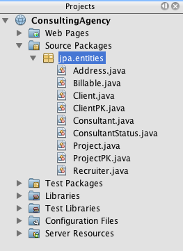
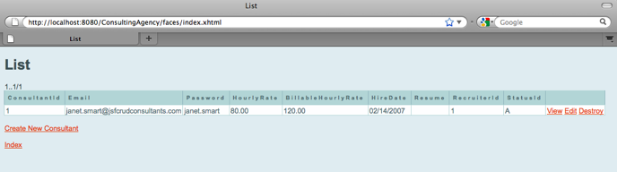
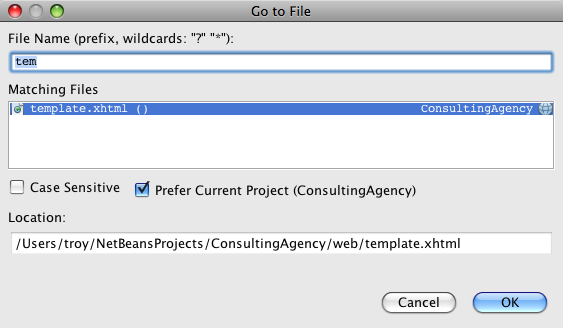
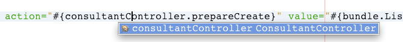
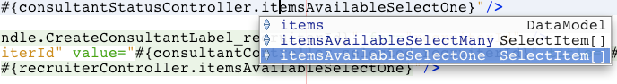
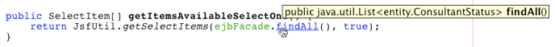

// 
//     Licensed to the Apache Software Foundation (ASF) under one
//     or more contributor license agreements.  See the NOTICE file
//     distributed with this work for additional information
//     regarding copyright ownership.  The ASF licenses this file
//     to you under the Apache License, Version 2.0 (the
//     "License"); you may not use this file except in compliance
//     with the License.  You may obtain a copy of the License at
// 
//       http://www.apache.org/licenses/LICENSE-2.0
// 
//     Unless required by applicable law or agreed to in writing,
//     software distributed under the License is distributed on an
//     "AS IS" BASIS, WITHOUT WARRANTIES OR CONDITIONS OF ANY
//     KIND, either express or implied.  See the License for the
//     specific language governing permissions and limitations
//     under the License.
//

= Создание приложения JavaServer Faces 2.x CRUD на основе базы данных
:jbake-type: tutorial
:jbake-tags: tutorials 
:jbake-status: published
:icons: font
:syntax: true
:source-highlighter: pygments
:toc: left
:toc-title:
:description: Создание приложения JavaServer Faces 2.x CRUD на основе базы данных - Apache NetBeans
:keywords: Apache NetBeans, Tutorials, Создание приложения JavaServer Faces 2.x CRUD на основе базы данных

В этом учебном курсе описывается использование NetBeans IDE для создания веб-приложения, взаимодействующего с серверной базой данных. Приложение предоставляет возможность просмотра и изменения данных, содержащихся в базе данных, другими словами – функциональные возможности _CRUD_ (Create, Read, Update, Delete – создание, чтение, обновление, удаление). Разрабатываемое приложение основывается на следующих технологиях.

* *JavaServer Faces (JSF) 2.x* для веб-страниц внешнего интерфейса, обработки проверки и управления циклом "запрос-ответ".
* *Интерфейс API сохранения состояния Java (Java Persistence API, JPA) 2.0* с использованием EclipseLink для создания классов сущностей из базы данных и управления транзакциями. (EclipseLink является образцовой реализацией JPA и поставщиком сохранения состояния для сервера GlassFish по умолчанию).
* *Enterprise JavaBeans (EJB) 3.1* – предоставление компонентов EJB без сохранения состояния, которые имеют доступ к классам сущностей и содержат бизнес-логику для приложения.

В среде IDE предоставляются два мастера для создания всех строк кода приложения. Первый – <<generateEntity,мастер создания классов сущностей из базы данных>>, позволяющий создавать классы сущностей из предоставленной базы данных. После создания классов сущностей используйте <<jsfPagesEntityClasses,мастер создания страниц JSF из классов сущностей>> для создания управляемых компонентов JSF и компонентов EJB для классов сущностей, а также набор страниц Facelets для обработки представления данных классов сущностей. Последний раздел руководства <<explore,Анализ приложения>> является дополнительным. В него включено множество упражнений, помогающих лучше понять приложение и ознакомиться со средой IDE.

Для работы с этим учебным курсом требуется программное обеспечение и материалы, перечисленные ниже.

|===
|Программное обеспечение или материал |Требуемая версия 

|link:https://netbeans.org/downloads/index.html[+IDE NetBeans+] |7.2, 7.3, 7.4, 8.0, пакет Java EE 

|link:http://www.oracle.com/technetwork/java/javase/downloads/index.html[+Комплект для разработчика на языке Java (JDK)+] |7 или 8 

|link:http://glassfish.dev.java.net/[+GlassFish Server Open Source Edition 3.1.2.2+] |3.x, 4.x 

|link:https://netbeans.org/projects/samples/downloads/download/Samples%252FJavaEE%252Fmysql-consult.zip[+mysql-consult.zip+] (MySQL) 
_или_
link:https://netbeans.org/projects/samples/downloads/download/Samples%252FJavaEE%252Fjavadb-consult.zip[+javadb-consult.zip+] (JavaDB) |неприменимо 
|===

*Примечания*

* В комплект Java EE в среде IDE NetBeans также входит сервер GlassFish - сервер, совместимый с Java EE 6, который требуется для этого учебного курса.
* Для проекта решения в этом учебном курсе загрузите link:https://netbeans.org/projects/samples/downloads/download/Samples%252FJavaEE%252FConsultingAgencyJSF20.zip[+ConsultingAgencyJSF20.zip+]

[[createDB]]
== Создание базы данных

В целях этого руководства используется база данных консультационного агентства с именем `consult`. Эта база данных не входит в устанавливаемую среду IDE, поэтому перед изучением этого руководства необходимо создать базу данных.

База данных `consult` разработана для демонстрации области поддержки среды IDE для обработки различных структур баз данных. Таким образом, эта база данных не предназначена для использования в качестве рекомендуемого примера разработки базы данных или в качестве практической рекомендации. Тем не менее, в нее включено множество возможностей, которые потенциально требуются при разработке базы данных. Например, база данных `consult` содержит все возможные типы отношений, составные первичные ключи и многие другие типы данных. Подробный обзор структуры базы данных приведен в таблице ниже.

*Примечания:*

* В данном учебном курсе используется сервер базы данных MySQL, однако для работы с этим учебным руководством можно также использовать сервер базы данных JavaDB. Чтобы создать базу данных в JavaDB, загрузите и извлеките архив link:https://netbeans.org/projects/samples/downloads/download/Samples%252FJavaEE%252Fjavadb-consult.zip[+javadb-consult.zip+]. Архив содержит сценарии SQL для создания, удаления и заполнения базы данных `consult`.
* Для получения дополнительной информации о настройке среды IDE для работы с MySQL см. учебный курс link:../ide/mysql.html[+Подключение к базе данных MySQL+].
* Дополнительные сведения о настройке среды IDE для работы с JavaDB приведены в учебном курсе link:../ide/java-db.html[+Работа с базой данных Java DB (Derby)+].

*Сочетание MySQL с GlassFish:*

При использовании сервера баз данных MySQL и вместе с ним GlassFish версии 3 или Open Source Edition версии 3.0.1 необходимо убедиться, что база данных защищена паролем. (Дополнительную информацию можно получить в описании link:https://java.net/jira/browse/GLASSFISH-12221[+Issue 12221+] (проблема 12221) сервера GlassFish.) При использовании учетной записи MySQL `root` по умолчанию с пустым паролем с помощью командной строки можно установить другой пароль. 

К примеру, чтобы установить пароль к `_nbuser_`, необходимо в командную строку ввести следующие команды.

[source,java]
----

shell> mysql -u root
mysql> UPDATE mysql.user SET Password = PASSWORD('_nbuser_') WHERE User = 'root';
mysql> FLUSH PRIVILEGES;
----

Если в ответ получена ошибка "`mysql: command not found`" (mysql: не найдена команда), это означает, что команда `mysql` не была добавлена в переменную среды `PATH`. Вместо этого команду можно вызвать, выбрав полный путь к установочному каталогу MySQL `bin`. Например, если команда `mysql` находится на компьютере по пути `/usr/local/mysql/bin`, выберите следующее:

[source,java]
----

shell> /usr/local/mysql/bin/mysql -u root
----

Дополнительные сведения приведены в официальном справочном руководстве по MySQL:

* link:http://dev.mysql.com/doc/refman/5.1/en/default-privileges.html[+Обеспечение защиты начальных счетов MySQL +]
* link:http://dev.mysql.com/doc/refman/5.1/en/invoking-programs.html[+4.2.1. Invoking MySQL Programs ("Вызов программ MySQL")+]
* link:http://dev.mysql.com/doc/refman/5.1/en/setting-environment-variables.html[+4.2.4. Setting Environment Variables ("Настройка переменных среды")+]

Для создания базы данных и подключения к ней из среды IDE выполните следующие действия.

1. Загрузите link:https://netbeans.org/projects/samples/downloads/download/Samples%252FJavaEE%252Fmysql-consult.zip[+mysql-consult.zip+] и извлеките архив в локальную систему. В результате извлечения архива появятся сценарии SQL для создания и заполнения базы данных. Архив также содержит сценарии для перетаскивания таблиц.
2. В окне 'Службы' разверните узел Databases, щелкните правой кнопкой мыши узел MySQL и выберите 'Запустить сервер'.
3. Щелкните правой кнопкой мыши узел "MySQL Server" и выберите "Create Database".
4. В диалоговом окне "Создание базы данных MySQL" введите *consult* в поле "Имя базы данных". Нажмите кнопку "ОК". Под узлом "Базы данных" появится новый узел (`jdbc:mysql://localhost:3306/consult [корень в схеме по умолчанию]`).
5. Правой кнопкой мыши щелкните новый узел и выберите "Подключить".
6. В основном меню выберите "Файл > Открыть файл" и перейдите к извлеченному файлу `mysql_create_.sql`. Нажмите кнопку Open ("Открыть"). Файл автоматически откроется в редакторе SQL. 

image::images/run-sql-script.png[title="Откройте файлы SQL в редакторе IDE"]

. Убедитесь, что база данных `consult` выбрана в раскрывающемся списке "Соединение" на панели инструментов редактора SQL, затем нажмите кнопку 'Выполнить SQL' ( image:images/run-sql-btn.png[] ).

После нажатия кнопки "Запустить SQL" в окне вывода появятся следующие выходные данные.

image::images/run-sql-output.png[title="Окно вывода, в котором указываются сведения о выполнении SQL"]

[[examineDB]]
== Изучение структуры базы данных

Чтобы убедиться в том, что таблицы созданы правильно, разверните узел "Таблицы" под узлом подключения к базе данных. В развернутом узле таблицы можно посмотреть столбцы, индексы и внешние ключи. Для просмотра дополнительных сведений о столбце щелкните правой кнопкой мыши и выберите 'Свойства'.

image::images/services-window-tables.png[title="В окне 'Службы' отображаются подключения к базам данных, таблицы, столбцы таблиц, индексы и внешние ключи"]

*Примечание.* Если таблицы не отображаются в узле 'Таблицы', щелкните правой кнопкой мыши узел 'Таблицы' и выберите 'Обновить'.

Анализ структуры базы данных `consult` позволяет установить, что база данных содержит таблицы с множеством отношений и различными типами полей. При создании классов сущностей в базе данных в среде IDE автоматически создается соответствующий код для различных типов полей.

image::images/diagram_consult.png[title="Диаграмма связей сущностей базы данных consult"]

В следующей таблице представлено описание таблиц, обнаруженных в базе данных `consult`.

|===
|Таблица базы данных |Описание |Функции разработки 

|CLIENT |Клиент консультационного агентства |Несгенерированный составной первичный ключ (поля которого не являются частью внешнего ключа) 

|CONSULTANT |Сотрудник консультационного агентства, которого могут нанять клиенты на контрактной основе. |Включает в себя поле резюме типа LONG VARCHAR. 

|CONSULTANT_STATUS |Состояние консультанта в консультационном агентстве (пример возможных состояний: "Активно" и "Неактивно"). |Несгенерированный первичный ключ типа CHAR. 

|RECRUITER |Сотрудник консультационного агентства, ответственный за установление связи между клиентами и консультантами. |  

|PROJECT |Проект, под который клиент укомплектовывает штат консультантами консультационного агентства. |Несгенерированный составной первичный ключ, который содержит два поля, составляющие внешний ключ для таблицы CLIENT. 

|BILLABLE |Количество часов, отработанных консультантом над проектом, которые консультационное агентство выставляет в счете на оплату соответствующему клиенту. |Включает в себя поле артефакта типа CLOB. 

|ADDRESS |Адрес для выставления счета клиенту. |  

|PROJECT_CONSULTANT |Таблица перекрестных ссылок, определяющая текущие присвоения консультантов проектам. |Перекрестные ссылки PROJECT и CONSULTANT, при этом последней соответствует составной первичный ключ. 
|===

База данных `consult` имеет множество отношений. При создании классов сущностей из базы данных в среде IDE автоматически создаются свойства соответствующего типа Java на основе типа SQL столбцов. Следующая таблица описывает отношения сущностей для базы данных `consult` (обратные отношения не отображаются).

|===
|Сущность |Связанная сущность |Информация об отношениях |Описание 

|CLIENT |RECRUITER |нулевое, "один к одному", с правкой вручную; нулевое, "один ко многим", если без правки. |CLIENT соответствует несколько RECRUITER, а RECRUITER соответствует нуль или один CLIENT (если без правки вручную). 

|CLIENT |ADDRESS |ненулевое, "один к одному". |CLIENT соответствует один ADDRESS, а ADDRESS соответствует нуль или один CLIENT. 

|CLIENT |PROJECT |ненулевое, "один ко многим"; в сущности "Проект" значение поля клиента является частью первичного ключа проекта. |CLIENT соответствует несколько PROJECT, а PROJECT соответствует один CLIENT. 

|CONSULTANT |PROJECT |"многие ко многим". |CONSULTANT соответствует несколько PROJECT, а PROJECT соответствует несколько CONSULTANT. 

|CONSULTANT |BILLABLE |ненулевое, "один ко многим". |CONSULTANT соответствует несколько BILLABLE, а BILLABLE соответствует один CONSULTANT. 

|CONSULTANT_STATUS |CONSULTANT |ненулевое, "один ко многим". |CONSULTANT_STATUS соответствует несколько CONSULTANT, а CONSULTANT соответствует один CONSULTANT_STATUS. 

|CONSULTANT |RECRUITER |нулевое, "один ко многим". |CONSULTANT соответствует нуль или одного RECRUITER, а RECRUITER соответствует несколько CONSULTANT. 

|BILLABLE |PROJECT |ненулевое, "один ко многим". |BILLABLE соответствует один PROJECT, а PROJECT соответствует несколько BILLABLE. 
|===

Теперь, после создания базы данных, можно создать веб-приложение и использовать мастер создания классов сущностей из базы данных для создания классов сущностей на основе таблиц баз данных.

[[createProject]]
== Создание проекта веб-приложения

В этом упражнении будет создан веб-проект и добавлена платформа JavaServer Faces к проекту. При создании проекта выбираем JavaServer Faces на панели "Платформы" мастера создания проекта.

1. Выберите "Файл > Новый проект" (CTRL+SHIFT+N; &amp;#8984+SHIFT+N в Mac ОС) в главном меню.
2. Выберите "Веб-приложение" в категории "Java Web". Нажмите кнопку "Далее".
3. Введите `ConsultingAgency` в качестве имени проекта и укажите местоположение проекта. Нажмите кнопку "Далее".
4. Укажите GlassFish в качестве сервера и Java 6 Web или Java EE 7 Web в качестве версии Java EE. Нажмите кнопку "Далее".
5. На панели "Платформы" выберите параметр JavaServer Faces. Нажмите кнопку "Завершить".

При нажатии кнопки "Готово" в среде IDE будет создан проект веб-приложения и открыт `index.xhtml` в редакторе.

[[generateEntity]]
== Создание классов сущностей из базы данных

После подключения к базе данных в среде IDE можно использовать мастер создания классов сущностей из базы данных для быстрого создания классов сущностей на основе таблиц в базе данных. В среде IDE можно создавать классы сущностей для каждой выбранной таблицы, а также создавать любые классы сущностей для соответствующих таблиц.

1. В окне 'Проекты' щелкните правой кнопкой мыши узел проекта `ConsultingAgency` и выберите 'Создать' > 'Классы сущностей' в базе данных. Если данная команда отсутствует, выберите пункт "Прочие". После этого в мастере создания файла выберите категорию "Сохранение состояния", а затем - пункт "Классы сущностей из базы данных".
2. Для открытия диалогового окна "Создание источника данных" в раскрывающемся списке "Источник данных" выберите "Новый источник данных".
3. В поле "Имя JNDI" введите `jdbc/consult` и выберите подключение `jdbc:mysql://localhost:3306/consult` в списке "Подключение к базе данных". 

image::images/create-datasource.png[title="Укажите имя JNDI и соединение с базой данных для создания источника данных"]

. Нажмите кнопку "ОК" для закрытия диалогового окна и возврата в мастер. Таблицы базы данных `consult` выводятся в окне списка "Доступные таблицы".

. Для выбора всех таблиц, имеющихся в базе данных, нажмите кнопку "Добавить все". Нажмите кнопку "Далее". 

image::images/new-entities-wizard.png[]

. Введите `jpa.entities` в качестве имени пакета.

. Убедитесь, что установлены оба флажка — и создания именованных запросов, и создания блоков сохранения состояния. Нажмите кнопку "Завершить".

При нажатии кнопки "Готово" среда IDE создает классы сущностей в пакете проекта `jpa.entities`.

При использовании мастера создания классов сущностей из базы данных в среде IDE проверяются отношения между таблицами базы данных. В окне 'Проекты' при развертывании узла проекта `jpa.entities` можно увидеть, что в IDE создан класс сущности для всех таблиц, кроме таблицы `PROJECT_CONSULTANT`. В среде IDE класс сущностей для таблицы `PROJECT_CONSULTANT` не создан, так как она является таблицей перекрестных ссылок.

В среде IDE также создано два дополнительных класса для таблиц с составными первичными ключами: `CLIENT` и `PROJECT`. К именам классов первичных ключей для этих таблиц (`ClientPK.java` и `ProjectPK.java`) добавлено `PK`.

При просмотре созданного кода для классов сущностей можно отметить, что мастером добавлены аннотации `@GeneratedValue` к автоматически созданным полям ID и аннотации `@Basic(optional = "false")` к полям в классах сущностей. На основе аннотаций `@Basic(optional = "false")` мастер создания страниц JSF из классов сущностей способен создавать код с блоками проверок для предотвращения нарушений в ненулевых столбцах для этих полей.

[[jsfPagesEntityClasses]]
== Создание страниц JSF из классов сущностей

Теперь, после создания классов сущностей, можно создать веб-интерфейс для отображения и изменения данных. Для создания страниц JavaServer Faces используется страницы JSF мастера создания классов сущностей. Код, созданный мастером, основан на аннотациях сохранения состояния, содержащихся в классах сущностей.

Для каждого класса сущностей мастер создает следующие файлы.

* сеансный компонент без сохранения состояния, расширяющий  ``AbstractFacade.java`` 
* управляемый компонент JSF в контексте сеанса;
* каталог, содержащий четыре файла Facelets возможностей CRUD (`Create.xhtml`, `Edit.xhtml`, `List.xhtml` и `View.xhtml`);

Мастер также создает следующие файлы.

* класс  ``AbstractFacade.java`` , содержащий бизнес-логику для создания, извлечения, изменения и удаления экземпляров сущностей
* служебные классы, используемые управляемыми компонентами JSF (`JsfUtil`, `PaginationHelper`);
* набор свойств для локализованных сообщений и соответствующая запись в файле настройки Faces проекта (создается файл `faces-config.xml`, если он на данный момент отсутствует);
* вспомогательные веб-файлы, включая стандартную таблицу стилей для отображения компонентов и файл шаблона Facelets.

Чтобы создать страницу JSF, выполните следующие действия:

1. В окне 'Проекты' щелкните правой кнопкой мыши узел проекта и выберите 'Создать' > 'Страницы JSF' в 'Классы сущностей', чтобы открыть мастер. Если данная команда отсутствует, выберите пункт "Прочие". После этого в мастере создания файла выберите категорию "JavaServer Faces", затем "Страницы JSF из классов сущностей".)

В окне "Доступные классы сущностей" выводится список из семи классов сущностей, имеющихся в этом проекте. В окне не выводятся встраиваемые классы (`ClientPK.java` и `ProjectPK.java`).

. Нажмите кнопку "Добавить все" для переноса всех классов в окно "Выбранные классы сущностей". 

image::images/newjsf-wizard.png[title="В мастере создания страниц JSF из классов сущностей отображаются все классы сущностей, содержащиеся в проекте"] 

Нажмите кнопку "Далее".

. На третьем экране мастера "Создание страниц JSF и классов" в поле "Пакет сеансного компонента JPA" введите `jpa.session`.

. В поле "Пакет классов JSF" введите `jsf`.

. В поле "Имя набора локализаций" введите "`/resources/Bundle`". Будет создан пакет с именем `resources`, в который входит файл `Bundle.properties`. (Если поле оставить пустым, набор свойств будет создан в пакете проекта по умолчанию.) 

image::images/newjsf-wizard2.png[title="Укажите имена пакетов и папок для созданных файлов"]

Для оптимизации правил проекта в среде IDE настройте файлы, созданные в мастере. Для изменения шаблонов, используемых в мастере, щелкните ссылку "Настройка шаблона". 

image::images/customize-template.png[title="Настройка шаблонов для файлов, созданных мастером"] 

В целом, для вызова и изменения всех шаблонов, поддерживаемых в среде IDE, используйте диспетчер шаблонов ("Сервис" > "Шаблоны").

. Нажмите кнопку "Завершить". В среде IDE создаются сеансные компоненты без сохранения состояния в пакете `jpa.session` и управляемые компоненты JSF в контексте сеанса в пакете `jsf`. Каждый сеансный компонент без сохранения состояния обрабатывает операции для соответствующего класса сущностей, включая создание, правку и удаление экземпляров класса сущностей, с помощью интерфейса Java Persistence API. Каждый управляемый компонент JSF реализует интерфейс `javax.faces.convert.Converter` и играет роль экземпляров преобразования соответствующего класса сущностей в объекты `String` и наоборот.

При развертывании узла "Веб-страницы" можно отметить, что в среде IDE была создана папка для каждого класса сущностей. Каждая папка содержит файлы `Create.xhtml`, `Edit.xhtml`, `List.xhtml` и `View.xhtml`. В среде IDE также изменен файл `index.xhtml` посредством вставки ссылок на каждую из страниц `List.xhtml`.

image::images/projects-jsfpages.png[title="Страницы Facelets для всех классов сущностей создаются мастером"]

Каждый управляемый компонент JSF относится к четырем соответствующим файлам Facelets и содержит код, вызывающий методы в соответствующем сеансном компоненте.

Разверните узел папки `resources` для поиска таблицы стилей по умолчанию `jsfcrud.css`, созданной в мастере. При открытии страницы приветствия приложения (`index.xhtml`) или файла шаблона Facelets (`template.xhtml`) в редакторе отобразится ссылка на таблицу стилей.

[source,java]
----

<h:outputStylesheet name="css/jsfcrud.css"/>
----

Файл шаблона Facelets используется в каждом из четырех файлов Facelets для каждого класса сущностей.

При развертывании узла "Пакеты с исходными файлами" отображаются сеансные компоненты, управляемые компоненты JSF, служебные классы и набор свойств, созданные мастером.

image::images/projects-generated-classes70.png[title="снимок каталога 'Исходные пакеты' в окне 'Проекты', в котором отображаются созданные мастером классы сущностей"]

Также мастером был создан файл настройки Faces (`faces-config.xml`) для регистрации местоположения набора свойств. При развертывании узла "Файлы настройки" и открытии `faces-config.xml` в редакторе XML отобразится следующая запись.

[source,xml]
----

<application>
    <resource-bundle>
        <base-name>/resources/Bundle</base-name>
        <var>bundle</var>
    </resource-bundle>
</application>
----

Кроме того, при развертывании нового пакета `resources` отображается файл `Bundle.properties`, содержащий сообщения для языка клиента по умолчанию. Сообщения произведены из свойств класса сущностей.

Для добавления нового комплекта свойств щелкните правой кнопкой файл `Bundle.properties` и выберите 'Настройка'. В диалоговом окне "Средство настройки" можно добавить к приложению новые локали.

[[explore]]
== Анализ приложения

Теперь, при наличии в проекте классов сущностей, сеансных компонентов EJB для управления классами сущностей и внешнего интерфейса на основе JSF для отображения и изменения базы данных, попробуйте выполнить проект и посмотрите результаты.

Ниже приведены несколько коротких дополнительных упражнений, которые помогут лучше узнать приложение, а также возможности и функции среды IDE.

* <<completedProject,Изучение выполненного проекта>>
* <<populateDB,Заполнение базы данных с помощью сценария SQL>>
* <<editorSupport,Изучение поддержки редактора на страницах Facelets>>
* <<dbIntegrity,Изучение целостности базы данных с проверкой поля>>
* <<editEntity,Правка классов сущностей>>

[[completedProject]]
=== Изучение выполненного проекта

1. Для запуска проекта щелкните правой кнопкой мыши узел проекта в окне 'Проекты' и выберите 'Запустить' или нажмите кнопку 'Запустить проект' ( image:images/run-project-btn.png[] ) на главной панели инструментов.

При отображении страницы приветствия приложения выводится список ссылок, позволяющих просмотреть записи, которые включены в каждую таблицу базы данных.

image::images/welcome-page-links.png[title="Ссылки для отображения содержимого баз данных для всех таблиц"]

После завершения выполнения всех шагов мастера создания страниц JSF из классов сущностей ссылки добавлены на страницу приветствия (`index.xhtml`). Они представлены в качестве точек входа на страницы Facelets, обеспечивающие функциональность CRUD в базе данных "Консультационное агентство".

[source,xml]
----

<h:body>
    Hello from Facelets
    <h:form>
        <h:commandLink action="/address/List" value="Show All Address Items"/>
    </h:form>
    <h:form>
        <h:commandLink action="/billable/List" value="Show All Billable Items"/>
    </h:form>
    <h:form>
        <h:commandLink action="/client/List" value="Show All Client Items"/>
    </h:form>
    <h:form>
        <h:commandLink action="/consultant/List" value="Show All Consultant Items"/>
    </h:form>
    <h:form>
        <h:commandLink action="/consultantStatus/List" value="Show All ConsultantStatus Items"/>
    </h:form>
    <h:form>
        <h:commandLink action="/project/List" value="Show All Project Items"/>
    </h:form>
    <h:form>
        <h:commandLink action="/recruiter/List" value="Show All Recruiter Items"/>
    </h:form>
</h:body>
----

. Щелкните ссылку "`Показать все элементы консультантов`". При анализе приведенного выше кода можно отметить, что целевая страница – `/consultant/List.xhtml`. (В JSF 2.x расширение файла является предполагаемым из-за неявного перехода.) 

image::images/empty-consultants-list.png[title="Таблица 'Consultants' в настоящее вермя пуста"] 

Текущая база данных не содержит данные примера. Данные можно добавить вручную посредством нажатия ссылки "`Create New Consultant`" и использования предоставленной веб-формы. При этом инициируется отображение страницы `/consultant/Create.xhtml`. Для заполнения таблиц данными примера также можно выполнить сценарий SQL в среде IDE. В следующих подразделах рассматриваются оба эти варианта.

Для возврата к списку ссылок на странице приветствия щелкните индексную ссылку. По ссылкам открывается представление данных, хранящихся в каждой таблице базы данных, и инициируется файл `List.xhtml` для каждой отображаемой папки сущностей. Как будет показано ниже, после внесения данных в таблицу появятся другие ссылки для каждой записи, с помощью которых можно просматривать (`View.xhtml`), править (`Edit.xhmtl`) и удалять данные отдельной записи таблицы.

*Примечание.* Если при развертывании приложения произойдет ошибка, см. раздел <<troubleshooting,устранение неполадок>>. (См. также статью об устранении неполадок в разделе link:mysql-webapp.html#troubleshoot[+Создание простого веб-приложения с помощью базы данных MySQL+].)

[[populateDB]]
=== Заполнение базы данных с помощью сценария SQL

Запустите предоставленный сценарий, создающий данные примера для таблиц базы данных. Сценарий (`mysql_insert_data_consult.sql`) включен в файл ZIP "База данных консультационного агентства", который можно загрузить из <<requiredSoftware,таблицы требуемого программного обеспечения>>.

В зависимости от сервера базы данных, с которым вы работаете (MySQL или JavaDB), можно выполнить запуск предоставленного сценария, создающего данные примера для таблиц базы данных. Для MySQL таким сценарием является `mysql_insert_data_consult.sql`. Для JavaDB таким сценарием является `javadb_insert_data_consult.sql`. Оба сценария включены в соответствующие архивы, которые можно загрузить из <<requiredSoftware,таблицы требуемого программного обеспечения>>.

1. Выберите в основном меню "Файл" > "Открыть файл", затем перейдите к папке сценария на компьютере. Нажмите кнопку Open ("Открыть"). Файл автоматически открывается в редакторе SQL среды IDE.
2. Убедитесь, что база данных `consult` выбрана в раскрывающемся списке "Соединение" на панели инструментов редактора SQL. 

image::images/run-sql-insert.png[title="Откройте сценарий в редакторе SQL в IDE"]

Щелкните правой кнопкой мыши в редакторе и выберите 'Запустить оператор' или нажмите кнопку 'Запустить SQL' ( image:images/run-sql-btn.png[] ). Результаты выполнения сценария отображаются в окне вывода.

. Перезапустите сервер приложений GlassFish. Это необходимо для перезагрузки и кэширования новых данных при помощи сервера, содержащихся в базе данных `consult`. Чтобы это сделать, перейдите на вкладку 'Сервер GlassFish' в окне вывода (на вкладке 'Сервер GlassFish' отображается журнал сервера). Затем нажмите кнопку 'Перезапустить сервер' в левом поле ( image:images/glassfish-restart.png[] ). Сервер остановится, затем перезапустится.

. Выполните проект еще раз и щелкните ссылку "`Показать все элементы консультантов`". Теперь можно заметить, что список больше не пуст. 
[.feature]
--

--

=== Поддержка баз данных NetBeans

Можно использовать средство просмотра для таблиц базы данных в среде IDE, чтобы отображать и изменять данные таблиц, управляемые непосредственно в базе данных. Например, щелкните правой кнопкой мыши таблицу `consultant` в окне 'Службы' и выберите 'Просмотреть данные'.

image::images/view-data.png[title="В контекстном меню таблиц баз данных выберите 'Просмотреть данные'"]

Запрос SQL, который используется для выполнения действий, отображается в верхней части редактора, а графическое представление таблицы помещено ниже.

[.feature]
--

image::images/view-data-table-small.png[role="left", link="images/view-data-table.png"]

--

Дважды щелкните ячейки таблицы для выполнения внутристрочных изменений данных. Щелкните значок 'Фиксировать записи' ( image:images/commit-records-icon.png[] ) для фиксации изменений базы данных.

Графическое представление обеспечивает большую функциональность. Дополнительные сведения см. в разделе link:../../docs/ide/database-improvements-screencast.html[+Поддержка баз данных в IDE NetBeans+].

[[editorSupport]]
=== Изучение поддержки редактора на страницах Facelets

1. Откройте страницу `/consultant/List.xhtml` в редакторе. В строке 8 указывается, что визуализация страницы зависит от файла `template.xhtml` Facelets.

[source,java]
----

<ui:composition template="/template.xhtml">
----

Чтобы отобразить номера строк, щелкните правой кнопкой мыши на левой границе редактора и выберите 'Показать номера строк'.

. С помощью диалогового окна "Переход к файлу" в среде IDE откройте файл `template.xhtml`. Нажмите сочетание клавиш ALT+SCHIFT+O (CTRL+SHIFT+O в Mac), затем введите `template`. 

Нажмите кнопку "ОК" (или нажмите ENTER).

. В шаблоне применяются теги `<ui:insert>` для вставки содержимого из других файлов в заголовок и тело. Установите курсор на тег `<ui:insert>`, затем нажмите сочетание клавиш CTRL+ПРОБЕЛ для вызова всплывающего окна документации. 

image::images/doc-popup.png[title="Нажмите сочетание клавиш CTRL+ПРОБЕЛ для вызова всплывающего окна документации в тегах Facelets"]

Для вызова всплывающего окна документации можно нажать сочетание клавиш CTRL+ПРОБЕЛ, установив курсор на тегах JSF и соответствующих атрибутах. Отображаемая документация взята из описаний, предоставленных в официальной link:http://javaserverfaces.java.net/nonav/docs/2.1/vdldocs/facelets/index.html[+Документации о библиотеке тегов JSF+].

. Вернитесь к файлу `List.xhtml` (нажмите CTRL+TAB). Теги `<ui:define>` используются для определения содержимого, которое применяется в заголовке и теле шаблона. Этот шаблон используется для всех четырех файлов Facelets (`Create.xhtml`, `Edit.xhtml`, `List.xhtml` и `View.xhtml`), созданных для каждого класса сущностей.

. Установите курсор на одном из выражений на языке выражений, используемых для локализованных сообщений, содержащихся в файле `Bundle.properties`. Для просмотра локализованного сообщения нажмите сочетание клавиш CTRL+ПРОБЕЛ. 
[.feature]
--

image::images/localized-messages-small.png[role="left", link="images/localized-messages.png"]

--

На приведенном выше изображении можно заметить, что выражение на языке выражений разрешено в списке "`List`", который применяется для заголовка шаблона и проверяется из отображаемой в браузере страницы.

. Выполните прокрутку до конца файла и найдите код для ссылки `Create New Consultant` (строка 92). Это выглядит следующим образом:

[source,java]
----

<h:commandLink action="#{consultantController.prepareCreate}" value="#{bundle.ListConsultantCreateLink}"/>
----

. Для вызова всплывающего окна документации нажмите сочетание клавиш CTRL+ПРОБЕЛ на атрибуте `action` для `commandLink`. 

Атрибут `action` указывает на метод, обрабатывающий запрос при щелчке ссылки в браузере. Предоставлена следующая документация: 

_Компонент MethodExpression определяет вызываемую операцию приложения при его активации пользователем. Выражение должно определять общедоступный метод, который не принимает параметры и возвращает объект (метод toString() которого вызывается для получения логического результата), передаваемый в NavigationHandler для этого приложения._
Другими словами, значение `action` обычно относится к методу в управляемом компоненте JSF, который имеет значение `String`. Затем строка используется в `NavigationHandler` JSF для передачи запроса в соответствующее представление. Проверка этого осуществляется при выполнении следующих действий.

. Установите курсор на `consultantController` и нажмите сочетание клавиш CTRL+ПРОБЕЛ. Функция автозавершения кода в редакторе указывает на то, что `consultantController` является управляемым компонентом JSF. 

. Переместите курсор на `prepareCreate` и нажмите сочетание клавиш CTRL+ПРОБЕЛ. При вызове функции автозавершения кода выводится список методов, содержащихся в управляемом компоненте `ConsultantController`. 

image::images/code-completion-properties.png[title="Автозавершение кода обеспечено для методов классов"]

. Нажмите CTRL (&amp;#8984 в Mac), затем наведите указатель мыши на `prepareCreate`. Будет создана ссылка, с помощью которой можно перейти непосредственно к методу `prepareCreate()` в управляемом компоненте `ConsultantController`. 

image::images/editor-navigation.png[title="Используйте навигацию в редакторе для быстрого перехода по исходному коду"]

. Щелкните ссылку и просмотрите метод `prepareCreate()` (отображаемый ниже).

[source,java]
----

public String prepareCreate() {
    current = new Consultant();
    selectedItemIndex = -1;
    return "Create";
}
----
Метод возвращает `Create`. Метод `NavigationHandler` собирает информацию в фоновом режиме и применяет строку `Create` в пути для открытия представления, отправленного в ответ на запрос: `/consultant/*Create*.xhtml`. (В JSF 2.x расширение файла является предполагаемым из-за неявного перехода.)

[[dbIntegrity]]
=== Изучение целостности базы данных с проверкой поля

1. На <<consultantsList,странице "Consultants List">> в браузере щелкните ссылку "`Create New Consultant`". Как показано в предыдущем подразделе, это инициирует визуализацию страницы `/consultant/Create.xhtml`.
2. Введите в форму следующие подробные сведения. На данный момент оставьте оба поля `RecruiterId` и `StatusId` пустыми. 

|===
|Поле |Значение 

|Id консультанта |2 

|Эл. почта |jack.smart@jsfcrudconsultants.com 

|Пароль |jack.smart 

|Почасовая ставка |75 

|Оплачиваемая почасовая ставка |110 

|Дата принятия на работу |07/22/2008 

|Резюме |У меня большой опыт работы консультантом. Примите меня на эту должность, и вы не разочаруетесь! 

|RecruiterId |--- 

|StatusId |--- 
|===

. Нажмите кнопку "Сохранить". При подобном заполнении поле `StatusId` будет отмечено ошибкой проверки. 

image::images/create-new-consultant.png[title="Введите в форму образец данных"] 

Почему это произошло? Повторно проверьте <<er-diagram,диаграмму "сущность/отношение" для базы данных консультационного агентства>>. Как указано выше в <<relationships,таблице связей>>, в таблицах `CONSULTANT` и `CONSULTANT_STATUS` совместно используется ненулевое отношение "один ко многим". Поэтому каждая запись в таблице `CONSULTANT` должна содержать ссылку на запись в таблице `CONSULTANT_STATUS`. Это отмечено во внешнем ключе `consultant_fk_consultant_status`, который имеет ссылки на две таблицы.

Внешние ключи, хранящиеся в таблицах, можно просмотреть посредством развертывания узла "Внешние ключи" таблицы в окне "Службы" (CTRL+5; &amp;#8984+5 на компьютере Mac).

image::images/consultant-fk.png[title="Проверьте атрибуты внешних ключей в окне 'Службы'"]

. Для устранения ошибки проверки выберите `entity.ConsultantStatus[statusId=A]` в раскрывающемся списке `StatusId`. 

*Примечание. *Поле `RecruiterId` можно оставить пустым. Как указано на <<er-diagram,диаграмме "сущность/отношение" для базы данных>>, между таблицами `CONSULTANT` и `RECRUITER` существует нулевое отношение "один ко многим", что означает, что создавать отношение между записями в таблице `CONSULTANT` с записью `RECRUITER` не требуется.

. Нажмите кнопку "Сохранить". На экран выводится сообщение об успешном сохранении записи consultant. При щелчке ссылки `Show All Consultant Items` в таблице появится новая запись.

Как правило, на созданных страницах Facelets отображаются ошибки вводимой пользователем информации:

* пустые поля для ненулевых ячеек таблицы;
* изменения данных, которые нельзя изменять (например, первичные ключи);
* вставка данных неверного типа;
* изменения данных, когда представление пользователя больше не синхронизируется с базой данных.

[[editEntity]]
=== Правка классов сущностей

В предыдущем подразделе был показан не совсем интуитивно понятный параметр `entity.ConsultantStatus[statusId=A]` в раскрывающемся списке `StatusId`. Необходимо учитывать, что текст, отображаемый для каждой позиции в этом раскрывающемся списке, является строковым представлением каждой обнаруженной сущности `ConsultantStatus` (т.е., вызывается метод `toString()` класса сущностей).

В этом подразделе описаны способы использования автозавершения кода в редакторе, документация и поддержка функции переходов, чтобы сделать такой вывод. Кроме того, подготовка наиболее интуитивно понятного сообщения для раскрывающегося списка.

1. Откройте в редакторе файл `/consultant/Create.xhtml`. Это форма "Create New Consultant", отображаемая в браузере. Выполните прокрутку вниз до кода раскрывающегося списка `StatusId` (выделено ниже *жирным шрифтом*).

[source,xml]
----

    <h:outputLabel value="#{bundle.CreateConsultantLabel_resume}" for="resume" />
    <h:inputTextarea rows="4" cols="30" id="resume" value="#{consultantController.selected.resume}" title="#{bundle.CreateConsultantTitle_resume}" />
    *<h:outputLabel value="#{bundle.CreateConsultantLabel_statusId}" for="statusId" />
    <h:selectOneMenu id="statusId" value="#{consultantController.selected.statusId}" title="#{bundle.CreateConsultantTitle_statusId}" required="true" requiredMessage="#{bundle.CreateConsultantRequiredMessage_statusId}">
        <f:selectItems value="#{consultantStatusController.itemsAvailableSelectOne}"/>
    </h:selectOneMenu>*
    <h:outputLabel value="#{bundle.CreateConsultantLabel_recruiterId}" for="recruiterId" />
    <h:selectOneMenu id="recruiterId" value="#{consultantController.selected.recruiterId}" title="#{bundle.CreateConsultantTitle_recruiterId}" >
        <f:selectItems value="#{recruiterController.itemsAvailableSelectOne}"/>
    </h:selectOneMenu>
</h:panelGrid>
----

. Проверьте атрибут `value`, применяемый к тегу `<f:selectItems>`. Атрибут `value` определяет текст, отображаемый для каждой позиции в раскрывающемся списке. 

Нажмите сочетание клавиш CTRL+ПРОБЕЛ, установив курсор на `itemsAvailableSelectOne`. Автозавершение кода в редакторе указывает, что метод `getItemsAvailableSelectOne()` для `ConsultantStatusController` возвращает массив объектов `SelectItem`. 

. Нажмите CTRL (&amp;#8984 в Mac), затем наведите указатель мыши на `itemsAvailableSelectOne`. Создается ссылка, позволяющая переходить непосредственно к методу `getItemsAvailableSelectOne()` в исходном коде сущностей `ConsultantStatus`. Щелкните эту ссылку.

. Установите курсор на значении возврата `SelectItem[]` в сигнатуре метода и нажмите сочетание клавиш CTRL+ПРОБЕЛ для вызова всплывающего окна документации. 

image::images/documentation-select-item.png[title="Для вызова поддержки документации нажмите сочетание клавиш CTRL+ПРОБЕЛ."]

Щелкните значок веб-браузера ( image:images/web-browser-icon.png[] ) в окне документации, чтобы открыть Javadoc во внешнем веб-браузере.

Итак, класс `SelectItem` относится к инфраструктуре JSF. Компонент `UISelectOne`, как упоминалось в документации, представлен тегом `<h:selectOneMenu>` из разметки, проверенной выше в <<markup,Шаге 1>>.

. Нажмите CTRL (&amp;#8984 в Mac), затем наведите указатель мыши на `findAll()`. Появится всплывающее окно, отображающее сигнатуру метода. 

 

Здесь можно отметить, что `ejbFacade.findAll()` возвращает `List` объектов `ConsultantStatus`.

. Перейдите к `JsfUtil.getSelectItems`. Наведите указатель мыши на `getSelectItems` и нажмите CTRL (&amp;#8984 на компьютере Mac), затем щелкните появившуюся ссылку. 

*Примечание. *Помните, что `JsfUtil` является одним из классов служебных программ, созданных при завершении <<jsfPagesEntityClasses,страниц JSF из мастера классов логических объектов>>. 

Этот метод организует цикл по списку сущностей (т.е., по списку `List` объектов `ConsultantStatus`) и создает `SelectItem` для каждой позиции. Как показано ниже (*выделено жирным шрифтом*), каждая позиция `SelectItem` создана с помощью объекта сущностей и _метки_ объекта.

[source,java]
----

public static SelectItem[] getSelectItems(List<?> entities, boolean selectOne) {
    int size = selectOne ? entities.size() + 1 : entities.size();
    SelectItem[] items = new SelectItem[size];
    int i = 0;
    if (selectOne) {
        items[0] = new SelectItem("", "---");
        i++;
    }
    *for (Object x : entities) {
        items[i++] = new SelectItem(x, x.toString());
    }*
    return items;
}
----

Эта метка создана с помощью метода `toString()` сущностей и является представлением объекта, отображаемым в этом ответе. (См. определение документации Javadoc для конструктора `SelectItem(значение java.lang.Object, метка java.lang.String)`.)

После проверки того, что методом `toString()` сущности является метод, отображаемый в браузере при просмотре позиций в раскрывающемся списке, измените метод `ConsultantStatus` `toString()`.

. Откройте класс сущностей `ConsultantStatus` в редакторе. Измените метод `toString` для возврата `statusId` и `description`. Это свойства записей, соответствующие двум столбцам таблицы `CONSULTANT_STATUS`.

[source,java]
----

public String toString() {
    return *statusId + ", " + description;*
}
----

. Выполните проект еще раз. При отображении в браузере страницы приветствия щелкните ссылку `Show All Consultant Items`, затем нажмите `Create New Consultant`.

Просмотрите раскрывающийся список `StatusId`. Теперь на экран будет выведен идентификатор состояния и описание записи, содержащейся в таблице `CONSULTANT_STATUS` базы данных.

image::images/drop-down.png[title="В раскрывающемся списке StatusId отображаются элементы в соответствии с методом toString() сущности ConsultantStatus"]

[[troubleshooting]]
== Устранение проблем

В зависимости от конфигурации при развертывании приложения на сервере может произойти ошибка. В этом случае в окне "Результаты" отображается следующее сообщение.

[source,java]
----

GlassFish Server 4 is running.
In-place deployment at /MyDocuments/ConsultingAgency/build/web
GlassFish Server 4, deploy, null, false
/MyDocuments/ConsultingAgency/nbproject/build-impl.xml:1045: The module has not been deployed.
See the server log for details.
----

Основная причина таких ошибок - проблемы при создании ресурсов JDBC на сервере. В этом случае на вкладке "Журнал сервера" в окне "Результаты" может отобразиться следующее или аналогичное сообщение.

[source,java]
----

Severe:   Exception while preparing the app : Invalid resource : jdbc/consult__pm
com.sun.appserv.connectors.internal.api.ConnectorRuntimeException: Invalid resource : jdbc/consult__pm
----

Если вкладка "Журнал сервера" отсутствует, ее можно добавить. Для этого щелкните правой кнопкой мыши узел GlassFish Server в окне "Службы" и выберите "Просмотр журнала доменного сервера".

Для этого приложения требуются два ресурса JDBC:

* Ресурс JDBC или источник данных. Поиск ресурса JDBC в приложении осуществляется посредством поиска JNDI. Если посмотреть на элемент постоянного соединения (`persistence.xml`), можно увидеть, что имя JNDI для источника данных JTA этого приложения - `jdbc/consult`.

Ресурс JDBC определяет текущий пул соединений, используемый приложением.

* Пул соединений JDBC. Пул соединений определяет параметры подключения к базе данных, в том числе местоположение, имя пользователя и пароль. Для данного приложения используется пул соединений `consultPool`.

Ресурс JDBC и пул соединений указываются в файле `glassfish-resources.xml`. Чтобы открыть файл `glassfish-resources.xml` в редакторе, разверните узел "Ресурсы сервера" в окне "Проекты" и дважды щелкните этот файл. Файл имеет примерно следующий вид.

[source,xml]
----

<?xml version="1.0" encoding="UTF-8"?>
<!DOCTYPE resources PUBLIC "-//GlassFish.org//DTD GlassFish Application Server 3.1 Resource Definitions//EN" "http://glassfish.org/dtds/glassfish-resources_1_5.dtd">
<resources>
  <jdbc-connection-pool allow-non-component-callers="false" associate-with-thread="false" connection-creation-retry-attempts="0" connection-creation-retry-interval-in-seconds="10" connection-leak-reclaim="false" connection-leak-timeout-in-seconds="0" connection-validation-method="auto-commit" datasource-classname="com.mysql.jdbc.jdbc2.optional.MysqlDataSource" fail-all-connections="false" idle-timeout-in-seconds="300" is-connection-validation-required="false" is-isolation-level-guaranteed="true" lazy-connection-association="false" lazy-connection-enlistment="false" match-connections="false" max-connection-usage-count="0" max-pool-size="32" max-wait-time-in-millis="60000" name="consultPool" non-transactional-connections="false" ping="false" pool-resize-quantity="2" pooling="true" res-type="javax.sql.DataSource" statement-cache-size="0" statement-leak-reclaim="false" statement-leak-timeout-in-seconds="0" statement-timeout-in-seconds="-1" steady-pool-size="8" validate-atmost-once-period-in-seconds="0" wrap-jdbc-objects="false">
    <property name="serverName" value="localhost"/>
    <property name="portNumber" value="3306"/>
    <property name="databaseName" value="consult"/>
    <property name="User" value="root"/>
    <property name="Password" value="nb"/>
    <property name="URL" value="jdbc:mysql://localhost:3306/consult?zeroDateTimeBehavior=convertToNull"/>
    <property name="driverClass" value="com.mysql.jdbc.Driver"/>
  /<jdbc-connection-pool>
  <jdbc-resource enabled="true" jndi-name="jdbc/consult" object-type="user" pool-name="consultPool"/>
/<resources>
----

Как видите, указанный в файле `glassfish-resources.xml` ресурс JDBC `jdbc/consult` определяет `consultPool` как имя пула соединений. Также здесь видны свойства `consultPool`. Для данного приложения в файле `glassfish-resources.xml` указан только один источник данных и только один пул соединений. Иногда возникает необходимость указать дополнительные ресурсы, например, временное хранилище данных, используемое только для разработки или тестирования.

Если ресурс JDBC и пул соединений не созданы на сервере автоматически при запуске приложения, их можно создать вручную в консоли администрирования GlassFish.

1. Если файл `glassfish-resources.xml` еще не открыт, откройте его в редакторе.

Для создания ресурса JDBC и пула соединений потребуются значения свойств, указанные в файле `glassfish-resources.xml`.

. Щелкните правой кнопкой мыши узел GlassFish Server в окне "Службы" и выберите пункт меню "Открыть консоль администрирования домена". Консоль GlassFish откроется в браузере.

. На панели "Общие задачи" в консоли GlassFish разверните узел *JDBC*, а также узлы *Ресурсы JDBC* и *Пулы соединений JDBC*. 
[.feature]
--

image::images/gf-admin-console-sm.png[role="left", link="images/gf-admin-console-lg.png"]

--

В консоли отображаются текущие ресурсы JDBC, зарегистрированные на сервере. Если в списке под узлом JDBC на панели навигации "Общие задачи" отсутствуют ресурсы `jdbc/consult` и `consultPool`, их необходимо создать. Некоторые ресурсы JDBC , созданные по умолчанию при установке сервера, отображаются в виде дочерних узлов.

. Выберите узел *Пулы соединений JDBC*, затем в разделе "Новый пул соединений JDBC" нажмите "Создать". 

image::images/gf-new-jdbc-pool1.png[title="Раздел "Новый пул соединений JDBC" в консоли администрирования GlassFish"]

. Укажите *consultPool* в качестве имени пула, выберите *javax.sql.ConnectionPoolDataSource* в списке "Тип ресурса", затем выберите *MySql* в списке "Поставщик драйверов базы данных". Нажмите кнопку "Далее".

. На экране 2 укажите значения свойств *URL*, *имя пользователя* и *пароль*, найденные в файле. Нажмите "Готово". 

image::images/gf-new-jdbc-pool2.png[title="Панель "Новый пул соединений JDBC" в консоли администрирования GlassFish"]

Значения свойств можно найти в файле `glassfish-resources.xml`.

При нажатии на кнопку "Готово" на сервере создается новый пул соединений, и под узлом "Пулы соединений JDBC" в консоли появляется соответствующий узел.

. Выберите узел *Ресурсы JDBC* на панели навигации "Общие задачи" и нажмите "Создать".

. Укажите *jdbc/consult* в качестве имени JNDI и выберите *consultPool* в списке "Имя пула". Нажмите OK. 

image::images/gf-new-jdbc-resource.png[title="Раздел "Новый ресурс JDBC" в консоли администрирования GlassFish"]

При нажатии на кнопку "Готово" на сервере создается новый ресурс JDBC, и под узлом "Ресурсы JDBC" в консоли появляется соответствующий узел.

В окне "Службы" в IDE раскройте узел "Ресурсы", находящийся под узлом GlassFish Server, и убедитесь, что в IDE добавлены новые ресурсы. Возможно, для отображения изменений потребуется обновить представление (щелкните правой кнопкой мыши узел "Ресурсы" и выберите "Обновить").

image::images/gf-services-jdbc-resources.png[title="Ресурсы JDBC в окне "Службы" в IDE"]

Другие советы по устранению проблем с MySQL и IDE см. в следующих документах:

* Учебный курс link:../ide/mysql.html[+Подключение к базе данных MySQL+].
* Статья об устранении неполадок в разделе link:mysql-webapp.html#troubleshoot[+Создание простого веб-приложения с помощью базы данных MySQL+]
link:/about/contact_form.html?to=3&subject=Feedback:%20Creating%20a%20JSF%202.0%20CRUD%20Application[+Отправить отзыв по этому учебному курсу+]

[[seealso]]
== Дополнительные сведения

Подробнее о JSF 2.x см. в следующих ресурсах.

=== Статьи и учебные курсы по NetBeans

* link:jsf20-intro.html[+Введение в JavaServer Faces 2.x в IDE NetBeans+]
* link:jsf20-support.html[+Поддержка JSF 2.x в IDE NetBeans+]
* link:../../samples/scrum-toys.html[+Scrum Toys – полный пример приложения JSF 2.0+]
* link:../javaee/javaee-gettingstarted.html[+Начало работы с приложениями Java EE+]
* link:../../trails/java-ee.html[+Учебная карта по Java EE и Java Web+]

=== Внешние ресурсы

* link:http://www.oracle.com/technetwork/java/javaee/javaserverfaces-139869.html[+Технология JavaServer Faces+] (официальная домашняя страница)
* link:http://jcp.org/aboutJava/communityprocess/final/jsr314/index.html[+Спецификация JSR 314 для JavaServer Faces 2.0+]
* Глава link:http://docs.oracle.com/javaee/7/tutorial/doc/jsf-intro.htm[+Технология JavaServer Faces+] в учебном курсе по Java EE 7
* link:http://javaserverfaces.dev.java.net/[+GlassFish Project Mojarra+] (официальный пример реализации JSF 2.х)
* link:http://forums.oracle.com/forums/forum.jspa?forumID=982[+Интернет-форум OTN: JavaServer Faces+]
* link:http://www.jsfcentral.com/[+JSF Central+]

=== Блоги

* link:http://www.java.net/blogs/edburns/[+Эд Бернс (Ed Burns)+]
* link:http://www.java.net/blogs/driscoll/[+Джим Дрисколл (Jim Driscoll)+]
