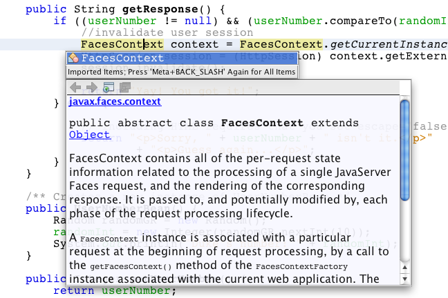
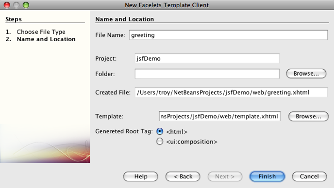
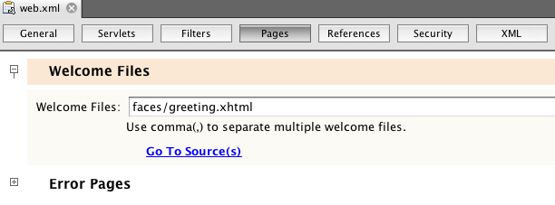

// 
//     Licensed to the Apache Software Foundation (ASF) under one
//     or more contributor license agreements.  See the NOTICE file
//     distributed with this work for additional information
//     regarding copyright ownership.  The ASF licenses this file
//     to you under the Apache License, Version 2.0 (the
//     "License"); you may not use this file except in compliance
//     with the License.  You may obtain a copy of the License at
// 
//       http://www.apache.org/licenses/LICENSE-2.0
// 
//     Unless required by applicable law or agreed to in writing,
//     software distributed under the License is distributed on an
//     "AS IS" BASIS, WITHOUT WARRANTIES OR CONDITIONS OF ANY
//     KIND, either express or implied.  See the License for the
//     specific language governing permissions and limitations
//     under the License.
//

= Introduction to JavaServer Faces 2.x
:jbake-type: tutorial
:jbake-tags: tutorials 
:jbake-status: published
:icons: font
:syntax: true
:source-highlighter: pygments
:toc: left
:toc-title:
:description: Introduction to JavaServer Faces 2.x - Apache NetBeans
:keywords: Apache NetBeans, Tutorials, Introduction to JavaServer Faces 2.x
include::../../../inc/database.adoc[]

JavaServer Faces (JSF) is a user interface (UI) framework for Java web applications. It is designed to significantly ease the burden of writing and maintaining applications that run on a Java application server and render their UIs back to a target client. JSF provides ease-of-use in the following ways:

* Makes it easy to construct a UI from a set of reusable UI components
* Simplifies migration of application data to and from the UI
* Helps manage UI state across server requests
* Provides a simple model for wiring client-generated events to server-side application code
* Allows custom UI components to be easily built and re-used

For an in-depth description of the JSF framework, see the link:http://docs.oracle.com/javaee/7/tutorial/doc/jsf-develop.htm[+Java EE 7 Tutorial, Chapter 12 Developing with JavaServer Faces Technology+].

This tutorial demonstrates how you can apply JSF 2.x support to a web application using the NetBeans IDE. You begin by adding JSF 2.x framework support to a basic web application, and then proceed to perform the following tasks:

* create a JSF managed bean to handle request data,
* wire the managed bean to the application's web pages, and
* convert the web pages into Facelets template files.

The NetBeans IDE has provided long-standing support for JavaServer Faces. Starting with the release of JSF 2.0 and Java EE 6, NetBeans IDE has provided support for JSF 2.0 and JSF 2.1. For more information, see xref:jsf20-support.adoc[+JSF 2.x Support in NetBeans IDE+].

To complete this tutorial, you need the following software and resources.

|===
|Software or Resource |Version Required 

|xref:../../../download/index.adoc[+NetBeans IDE+] |7.2, 7.3, 7.4, 8.0, Java EE bundle 

|link:http://www.oracle.com/technetwork/java/javase/downloads/index.html[+Java Development Kit (JDK)+] |7 or 8 

|link:http://glassfish.dev.java.net/[+GlassFish server+] |Open Source Edition 3.x or 4 

|link:https://netbeans.org/projects/samples/downloads/download/Samples%252FJavaEE%252FjsfDemo.zip[+`jsfDemo` web application project+] |n/a 
|===

*Notes:*

* The NetBeans IDE Java Bundle also includes the GlassFish server, a Java EE-compliant server, which you require for this tutorial.
* To compare your project with a working solution, download the link:https://netbeans.org/projects/samples/downloads/download/Samples%252FJavaEE%252FjsfDemoCompleted.zip[+completed sample project+].

[[support]]
== Adding JSF 2.x Support to a Web Application

Begin by opening the <<requiredSoftware,`jsfDemo` web application project>> in the IDE. Once you have the project opened in the IDE, you can add framework support to it using the project's Properties window.

The IDE also allows you to create new projects with JSF 2.x support. For more information, see xref:jsf20-support.adoc#creatingSupport[+Creating a New Project with JSF 2.x Support+].

1. Click the Open Project (  ) button in the IDE's main toolbar, or press Ctrl-Shift-O (⌘-Shift-O on Mac).
2. In the Open Project dialog, navigate to the location on your computer where you stored the unzipped tutorial project. Select it, then click Open Project to open it in the IDE.

*Note.* You might be prompted to resolve the reference to the JUnit libraries when you open the NetBeans project if you did not install the JUnit plugin when you installed the IDE.

. Run the project to see what it looks like in a browser. Either right-click the `jsfDemo` project node in the Projects window and choose Run, or click the Run Project ( image:images/run-project-btn.png[] ) button in the main toolbar. The project is packaged and deployed to the GlassFish server, and your browser opens to display the welcome page (`index.xhtml`). 

image::images/run-project.png[title="Run the project to view it in a browser"]

. Click the Submit button. The response page (`response.xhtml`) displays as follows: 

image::images/response.png[title="The welcome and response pages are currently static pages"]

Currently the welcome and response pages are static and, together with the `stylesheet.css` file and `duke.png` image, are the only application files accessible from a browser.

. In the Projects window (Ctrl-1; ⌘-1 on Mac), right-click your project node and choose Properties to open the Project Properties window.

. Select the Frameworks category and then click the Add button.

. Select JavaServer Faces in the Add a Framework dialog box. Click OK. 

image::images/add-framework.png[title="Add JSF support to an existing project"]

After selecting JavaServer Faces, various configuration options become available. Under the Libraries tab, you can specify how the project accesses JSF 2.x libraries. The JSF version that is available will depend upon the version of the IDE and the GlassFish server. The default option is to use the libraries included with the server (the GlassFish server). However, the IDE also bundles the JSF 2.x libraries. (You can select the Registered Libraries option if you want your project to use these.)

image::images/libraries-tab.png[title="Specify access to JSF 2.x libraries"]

. Click the Configuration tab. You can specify how the Faces servlet is registered in the project's deployment descriptor. You can also indicate whether you want Facelets or JSP pages to be the used with the project. 

image::images/jsf-configuration.png[title="Specify Faces servlet options and preferred language"]

You can also easily configure your project to use various JSF component suites in the Components tab. To use a component suite you will need to download the required libraries and use the Ant Library manager to create a new library with the component suite libraries.

image::images/jsf-components.png[title="Specify Faces servlet options and preferred language"]

. Click OK to finalize changes and exit the Project Properties window.

After adding JSF support to your project, the project's `web.xml` deployment descriptor is modified to look as follows. (Changes in *bold*.)

[source,xml]
----

<web-app version="3.0" xmlns="http://java.sun.com/xml/ns/javaee" xmlns:xsi="http://www.w3.org/2001/XMLSchema-instance" xsi:schemaLocation="http://java.sun.com/xml/ns/javaee http://java.sun.com/xml/ns/javaee/web-app_3_0.xsd">
    *<context-param>
        <param-name>javax.faces.PROJECT_STAGE</param-name>
        <param-value>Development</param-value>
    </context-param>
    <servlet>
        <servlet-name>Faces Servlet</servlet-name>
        <servlet-class>javax.faces.webapp.FacesServlet</servlet-class>
        <load-on-startup>1</load-on-startup>
    </servlet>
    <servlet-mapping>
        <servlet-name>Faces Servlet</servlet-name>
        <url-pattern>/faces/*</url-pattern>
    </servlet-mapping>*
    <welcome-file-list>
        <welcome-file>*faces/*index.xhtml</welcome-file>
    </welcome-file-list>
</web-app>
----

*Important:* Confirm that the `web.xml` contains only one `<welcome-file>` entry and that the entry contains '`faces/`' as shown in the example. This ensures that the project's welcome page (`index.xhtml`) passes through the Faces servlet before being displayed in a browser. This is necessary in order to render the Facelets tag library components properly.

The Faces servlet is registered with the project, and the `index.xhtml` welcome page is now passed through the Faces servlet when it is requested. Also, note that an entry for the `PROJECT_STAGE` context parameter has been added. Setting this parameter to '`Development`' provides you with useful information when debugging your application. See  link:http://blogs.oracle.com/rlubke/entry/jsf_2_0_new_feature2[+http://blogs.oracle.com/rlubke/entry/jsf_2_0_new_feature2+] for more information.

You can locate the JSF libraries by expanding the project's Libraries node in the Projects window. If you are using the default libraries included with GlassFish Server 3.1.2 or GlassFish Server 4 this is the `javax.faces.jar` that is visible under the GlassFish Server node. (If you are using an older version of GlassFish you will see the `jsf-api.jar` and `jsf-impl.jar` libraries instead of `javax.faces.jar`.)

The IDE's JSF 2.x support primarily includes numerous JSF-specific wizards, and special functionality provided by the Facelets editor. You explore these functional capabilities in the following steps. For more information, see xref:jsf20-support.adoc[+JSF 2.x Support in NetBeans IDE+].

[[managedBean]]
== Creating a Managed Bean

You can use JSF's managed beans to process user data and retain it between requests. A managed bean is a link:{wikipedia}Plain_Old_Java_Object[POJO] (Plain Old Java Object) that can be used to store data, and is managed by the container (e.g., the GlassFish server) using the JSF framework.

A POJO is essentially a Java class that contains a public, no argument constructor and conforms to the link:http://download.oracle.com/javase/tutorial/javabeans/[+JavaBeans+] naming conventions for its properties.

Looking at the <<staticPage,static page>> produced from running the project, you need a mechanism that determines whether a user-entered number matches the one currently selected, and returns a view that is appropriate for this outcome. Use the IDE's xref:jsf20-support.adoc#managedBean[+Managed Bean wizard+] to create a managed bean for this purpose. The Facelets pages that you create in the next section will need to access the number that the user types in, and the generated response. To enable this, add `userNumber` and `response` properties to the managed bean.

* <<usingManagedBean,Using the Managed Bean Wizard>>
* <<creatingConstructor,Creating a Constructor>>
* <<addingProperties,Adding Properties>>

[[usingManagedBean]]
=== Using the Managed Bean Wizard

1. In the Projects window, right-click the `jsfDemo` project node and choose New > JSF Managed Bean. (If Managed Bean is not listed, choose Other. Then select the JSF Managed Bean option from the JavaServer Faces category. Click Next.)
2. In the wizard, enter the following:
* *Class Name:* UserNumberBean
* *Package:* guessNumber
* *Name:* UserNumberBean
* *Scope:* Session

image::images/managed-bean.png[title="Use the JSF Managed Bean wizard to create a new managed bean"]

. Click Finish. The `UserNumberBean` class is generated and opens in the editor. Note the following annotations (shown in *bold*):

[source,java]
----

package guessNumber;

import javax.faces.bean.ManagedBean;
import javax.faces.bean.SessionScoped;

/**
 *
 * @author nbuser
 */
*@ManagedBean(name="UserNumberBean")
@SessionScoped*
public class UserNumberBean {

    /** Creates a new instance of UserNumberBean */
    public UserNumberBean() {
    }

}
----

Because you are using JSF 2.x, you can declare all JSF-specific components using annotations. In previous versions, you would need to declare them in the Faces configuration file (`faces-config.xml`).

[tips]#To view the Javadoc for all JSF 2.1 annotations, see the link:http://javaserverfaces.java.net/nonav/docs/2.1/managed-bean-javadocs/index.html[+Faces Managed Bean Annotation Specification+].#

[[creatingConstructor]]
=== Creating a Constructor

The `UserNumberBean` constructor must generate a random number between 0 and 10 and store it in an instance variable. This partially forms the business logic for the application.

1. Define a constructor for the `UserNumberBean` class. Enter the following code (changes displayed in *bold*).

[source,java]
----

public class UserNumberBean {

    *Integer randomInt;*

    /** Creates a new instance of UserNumberBean */
    public UserNumberBean() {
        *link:http://docs.oracle.com/javase/7/docs/api/java/util/Random.html[+Random+] randomGR = new Random();
        randomInt = new Integer(randomGR.link:http://docs.oracle.com/javase/7/docs/api/java/util/Random.html#nextInt%28int%29[+nextInt+](10));
        System.out.println("Duke's number: " + randomInt);*
    }

}
----

The above code generates a random number between 0 and 10, and outputs the number in the server log.

. Fix imports. To do so, click the hint badge ( image:images/hint-icon.png[] ) that displays in the editor's left margin, then choose the option to import `java.util.Random` into the class.

. Run the project again (click the Run Project ( image:images/run-project-btn.png[] ) button, or press F6; fn-F6 on Mac). When you run your project, the server's log file automatically opens in the Output window. 

image::images/output1.png[title="The server's log file is automatically opens in the Output window"]

Notice that you do not see "`Duke's number: `" listed in the output (as would be indicated from the constructor). A `UserNumberBean` object was not created because JSF uses _lazy instantiation_ by default. That is, beans in particular scopes are only created and initialized when they are needed by the application.

The link:http://javaserverfaces.java.net/nonav/docs/2.1/managed-bean-javadocs/index.html[+Javadoc for the `@ManagedBean` annotation+] states:

_If the value of the `eager()` attribute is `true`, and the `managed-bean-scope` value is "application", the runtime must instantiate this class when the application starts. This instantiation and storing of the instance must happen before any requests are serviced. If _eager_ is unspecified or `false`, or the `managed-bean-scope` is something other than "application", the default "lazy" instantiation and scoped storage of the managed bean happens._

. Because `UserNumberBean` is session-scoped, have it implement the `Serializable` interface.

[source,java]
----

@ManagedBean(name="UserNumberBean")
@SessionScoped
public class UserNumberBean *implements Serializable* {
----
Use the hint badge ( image:images/hint-icon.png[] ) to import `java.io.Serializable` into the class.

[[addingProperties]]
=== Adding Properties

The Facelets pages that you create in the next section will need to access the number that the user types in, and the generated response. To facilitate this, add `userNumber` and `response` properties to the class.

1. Start by declaring an `Integer` named `userNumber`.

[source,java]
----

@ManagedBean(name="UserNumberBean")
@SessionScoped
public class UserNumberBean implements Serializable {

    Integer randomInt;
    *Integer userNumber;*
----

. Right-click in the editor and choose Insert Code (Alt-Insert; Ctrl-I on Mac). Choose Getter and Setter. 

image::images/getter-setter.png[title="Use the IDE to generate accessor methods for properties"]

. Select the `userNumber` : `Integer` option. Click Generate. 

image::images/generate-getters-setters.png[title="Use the IDE to generate accessor methods for properties"]

Note that the `getUserNumber()` and `setUserNumber(Integer userNumber)` methods are added to the class.

. Create a `response` property. Declare a `String` named `response`.

[source,java]
----

@ManagedBean(name="UserNumberBean")
@SessionScoped
public class UserNumberBean implements Serializable {

    Integer randomInt;
    Integer userNumber;
    *String response;*
----

. Create a getter method for `response`. (This application will not require a setter.) You could use the IDE's Generate Code pop-up shown in step 2 above to generate template code. For purposes of this tutorial however, just paste the below method into the class.

[source,html]
----

public String getResponse() {
    if ((userNumber != null) &amp;&amp; (userNumber.link:http://download.oracle.com/javase/6/docs/api/java/lang/Integer.html#compareTo(java.lang.Integer)[+compareTo+](randomInt) == 0)) {

        //invalidate user session
        FacesContext context = FacesContext.getCurrentInstance();
        HttpSession session = (HttpSession) context.getExternalContext().getSession(false);
        session.invalidate();

        return "Yay! You got it!";
    } else {

        return "
Sorry, " + userNumber + " isn't it.
"
                + "
Guess again...
";
    }
}
----
The above method performs two functions:
1. It tests whether the user-entered number (`userNumber`) equals the random number generated for the session (`randomInt`) and returns a `String` response accordingly.
2. It invalidates the user session if the user guesses the right number (i.e., if `userNumber` equals `randomInt`). This is necessary so that a new number is generated should the user want to play again.

. Right-click in the editor and choose Fix Imports (Alt-Shift-I; ⌘-Shift-I on Mac). Import statements are automatically created for:
* `javax.servlet.http.HttpSession`
* `javax.faces.context.FacesContext`

You can press Ctrl-Space on items in the editor to invoke code-completion suggestions and documentation support. Press Ctrl-Space on `FacesContext` to view the class description from the Javadoc.

 

Click the web browser ( image:images/web-browser-icon.png[] ) icon in the documentation window to open the Javadoc in an external web browser.

[[wire]]
== Wiring Managed Beans to Pages

One of the primary purposes of JSF is to remove the need to write boilerplate code to manage <<pojo,POJO>>s and their interaction with the application's views. You saw an example of this in the previous section, where JSF instantiated a `UserNumberBean` object when you ran the application. This notion is referred to as link:http://martinfowler.com/articles/injection.html[+Inversion of Control+] (IoC), which enables the container to take responsibility for managing portions of the application that would otherwise require the developer to write repetitious code.

In the previous section you created a managed bean that generates a random number between 0 and 10. You also created two properties, `userNumber`, and `response`, which represent the number input by the user, and the response to a user guess, respectively.

In this section, you explore how you can use the `UserNumberBean` and its properties in web pages. JSF enables you to do this using its expression language (EL). You use the expression language to bind property values to JSF's UI components contained in your application's web pages. This section also demonstrates how you can take advantage of JSF 2.x's implicit navigation feature to navigate between the index and response pages.

The IDE provides support for this work through its code completion and documentation facilities, which you can invoke by pressing Ctrl-Space on items in the editor.

Start by making changes to `index.xhtml`, then make changes to `response.xhtml`. In both pages, replace HTML form elements with their JSF counterparts, as they are defined in the link:http://javaserverfaces.java.net/nonav/docs/2.1/vdldocs/facelets/index.html[+JSF HTML tag library+]. Then, use the JSF expression language to bind property values with selected UI components.

* <<index,index.xhtml>>
* <<response,response.xhtml>>

[[index]]
=== index.xhtml

1. Open the `index.xhtml` page in the editor. Either double-click the `index.xhtml` node from the Projects window, or press Alt-Shift-O to use the Go to File dialog. 

Both index and response pages already contain the JSF UI components you require for this exercise. Simply uncomment them and comment out the HTML elements currently being used.

. Comment out the HTML form element. To do so, highlight the HTML form element as in the image below, then press Ctrl-/ (⌘-/ on Mac). 

*Note: *To highlight, either click and drag in the editor with your mouse, or, using the keyboard, hold Shift and press the arrow keys. 

image::images/comment-out.png[title="Highlight code, then press Ctrl-/ to comment out code"]

Use Ctrl-/ (⌘-/ on Mac) to toggle comments in the editor. You can also apply this keyboard shortcut to other file types, such as Java and CSS.

. Uncomment the JSF HTML form component. Highlight the component as in the image below, then press Ctrl-/ (⌘-/ on Mac).

*Note.* You might need to press Ctrl-/ twice to uncomment the code.

image::images/comment.png[title="Highlight commented-out code, then press Ctrl-/ to uncomment it"]

After uncommenting the JSF HTML form component, the editor indicates that the `<h:form>`, `<h:inputText>`, and `<h:commandButton>` tags haven't been declared.

image::images/undeclared-component.png[title="The editor provides error messages for undeclared components"]

. To declare these components, use the IDE's code completion to add the tag library namespace to the page's `<html>` tag. Place your cursor on any of the undeclared tags and press Alt-Enter and click Enter to add the suggested tag library. (If there are multiple options, make sure to select the tag that is displayed in the editor before clicking Enter.) The JSF HTML tag library namespace is added to the `<html>` tag (shown in *bold* below), and the error indicators disappear.

*Note.* If the IDE does not provide the option to add the tag library you will need to manually modify the  ``<html>``  element.

[source,java]
----

<html xmlns="http://www.w3.org/1999/xhtml"
      *xmlns:h="http://xmlns.jcp.org/jsf/html"*>
----

. Use the JSF expression language to bind `UserNumberBean`'s `userNumber` property to the `inputText` component. The `value` attribute can be used to specify the current value of the rendered component. Type in the code displayed in *bold* below.

[source,java]
----

<h:form>
    <h:inputText id="userNumber" size="2" maxlength="2" *value="#{UserNumberBean.userNumber}"* />
----

JSF expression language uses the `#{}` syntax. Within these delimiters, you specify the name of the managed bean and the bean property you want to apply, separated by a dot (`.`). Now, when the form data is sent to the server, the value is automatically saved in the `userNumber` property using the property's setter (`setUserNumber()`). Also, when the page is requested and a value for `userNumber` has already been set, the value will automatically display in the rendered `inputText` component. For more information, see the link:http://docs.oracle.com/javaee/7/tutorial/doc/jsf-develop001.htm#BNAQP[+Java EE 7 Tutorial: 12.1.2 Using the EL to Reference Managed Beans+].

. Specify the destination for the request that is invoked when clicking the form button. In the HTML version of the form, you were able to do this using the `<form>` tag's `action` attribute. With JSF, you can use the `commandButton`'s `action` attribute. Furthermore, due to JSF 2.x's implicit navigation feature, you only need to specify the name of the destination file, without the file extension.

Type in the code displayed in *bold* below.

[source,xml]
----

<h:form>
    <h:inputText id="userNumber" size="2" maxlength="2" value="#{UserNumberBean.userNumber}" />
    <h:commandButton id="submit" value="submit" *action="response"* />
</h:form>
----

The JSF runtime searches for a file named `response`. It assumes the file extension is the same as the extension used by file from which the request originated (`index*.xhtml*`) and looks for for the `response.xhtml` file in the same directory as the originating file (i.e., the webroot).

*Note: *JSF 2.x aims to make developers' tasks much easier. If you were using JSF 1.2 for this project, you would need to declare a navigation rule in a Faces configuration file that would look similar to the following:

[source,xml]
----

<navigation-rule>
    <from-view-id>/index.xhtml</from-view-id>

    <navigation-case>
        <from-outcome>response</from-outcome>
        <to-view-id>/response.xhtml</to-view-id>
    </navigation-case>
</navigation-rule>
----

Steps 7 through 12 below are optional. If you'd like to quickly build the project, skip ahead to <<response,`response.xhtml`>>.

. Test whether the above EL expression does in fact call the `setUserNumber()` method when the request is processed. To do so, use the IDE's Java debugger.

Switch to the `UserNumberBean` class (Press Ctrl-Tab and choose the file from the list.) Set a breakpoint on the `setUserNumber()` method signature. You can do this by clicking in the left margin. A red badge displays, indicating a method breakpoint has been set.

image::images/set-breakpoint.png[title="Click in the editor's left margin to set breakpoints"]

. Click the Debug Project ( image:images/breakpoint-btn.png[] ) button in the IDE's main toolbar. A debug session starts, and the project welcome page opens in the browser.

*Notes.*

* You might be prompted to confirm the server port for debugging the application.
* If a Debug Project dialog displays, select the default 'Server side Java' option and click Debug.

. In the browser, enter a number into the form and click the 'submit' button.

. Switch back to the IDE and inspect the `UserNumberBean` class. The debugger is suspended within the `setUserNumber()` method. 

image::images/debugger-suspended.png[title="Debugger suspends according to breakpoints"]

. Open the Debugger's Variables window (Choose Window > Debugging > Variables, or press Ctrl-Shift-1). You see the variable values for the point at which the debugger is suspended. 

image::images/variables-window.png[title="Monitor variable values using the Debugger's Variables window"]

In the image above, a value of '`4`' is provided for the `userNumber` variable in the `setUserNumber()` signature. (The number 4 was entered into the form.) '`this`' refers to the `UserNumberBean` object that was created for the user session. Beneath it, you see that the value for the `userNumber` property is currently `null`.

. In the Debugger toolbar, click the Step Into ( image:images/step-into-btn.png[] ) button. The debugger executes the line on which it is currently suspended. The Variables window refreshes, indicating changes from the execution. 

image::images/variables-window2.png[title="Variables window refreshes when stepping through code"] 

The `userNumber` property is now set to the value entered in the form.

. Choose Debug > Finish Debugger Session (Shift-F5; Shift-Fn-F5 on Mac) from the main menu to stop the debugger.

[[response]]
=== response.xhtml

1. Open the `response.xhtml` page in the editor. Either double-click the `response.xhtml` node from the Projects window, or press Alt-Shift-O to use the Go to File dialog.
2. Comment out the HTML form element. Highlight the opening and closing HTML `<form>` tags and the code between them, then press Ctrl-/ (⌘-/ on Mac).

*Note: *To highlight, either click and drag in the editor with your mouse, or, using the keyboard, hold Shift and press the arrow keys.

. Uncomment the JSF HTML form component. Highlight the opening and closing `<h:form>` tags and the code between them, then press Ctrl-/ (⌘-/ on Mac).

At this stage, your code between the `<body>` tags looks as follows:

[source,html]
----

<body>
    

        

            <h4>[ response here ]</h4>

            <!--<form action="index.xhtml">

                <input type="submit" id="backButton" value="Back"/>

            </form>-->

            <h:form>

                <h:commandButton id="backButton" value="Back" />

            </h:form>

        

        

            
             <!--<h:graphicImage url="/duke.png" alt="Duke waving" />-->

        

    

</body>
----

After uncommenting the JSF HTML form component, the editor indicates that the `<h:form>` and `<h:commandButton>` tags haven't been declared.

. To declare these components, use the IDE's code completion to add the tag library namespace to the page's `<html>` tag.

Use the editor's code completion support to add required JSF namespaces to the file. When selecting a JSF or Facelets tag through code completion, the required namespace is automatically added to the document's root element. For more information, see xref:jsf20-support.adoc#facelets[+JSF 2.x Support in NetBeans IDE+].

Place your cursor on any of the undeclared tags and press Ctrl-Space. Code completion suggestions and documentation support displays.

image::images/code-completion2.png[title="Press Ctrl-Space to invoke code completion suggestions and a documentation pop-up window"]

Click Enter. (If there are multiple options, make sure to select the tag that is displayed in the editor before clicking Enter.) The JSF HTML tag library namespace is added to the `<html>` tag (shown in *bold* below), and the error indicators disappear.

[source,java]
----

<html xmlns="http://www.w3.org/1999/xhtml"
      *xmlns:h="http://xmlns.jcp.org/jsf/html"*>
----

. Specify the destination for the request that is invoked when the user clicks the form button. You want to set the button so that when a user clicks it, he or she is returned to the index page. To accomplish this, use the `commandButton`'s `action` attribute. Type in the code displayed in *bold*.

[source,xml]
----

<h:form>

    <h:commandButton id="backButton" value="Back" *action="index"* />

</h:form>
----

*Note: *By typing `action="index"`, you are relying on JSF's implicit navigation feature. When a user clicks the form button, the JSF runtime searches for a file named `index`. It assumes the file extension is the same as the extension used by file from which the request originated (`response*.xhtml*`) and looks for for the `index.xhtml` file in the same directory as the originating file (i.e., the webroot).

. Replace the static "[ response here ]" text with the value of the `UserNumberBean`'s `response` property. To do this, use the JSF expression language. Enter the following (in *bold*).

[source,html]
----

    <h4>*<h:outputText value="#{UserNumberBean.response}"/>*</h4>
----

. Run the project (click the Run Project ( image:images/run-project-btn.png[] ) button, or press F6; fn-F6 on Mac). When the welcome page displays in the browser, enter a number and click `submit`. You see the response page display similar to the following (provided you did not guess the correct number). 

image::images/response2.png[title="View the current status of the project in a browser"]

Two things are wrong with the current status of the response page:

1. The html `
` tags are displaying in the response message.
2. The Back button is not displaying in the correct location. (Compare it to the <<originalVersion,original version>>.)

The following two steps correct these points, respectively.

. Set the `<h:outputText>` tag's `escape` attribute to `false`. Place your cursor between `outputText` and `value`, insert a space, then press Ctrl-Space to invoke code-completion. Scroll down to choose the `escape` attribute and inspect the documentation. 

image::images/escape-false.png[title="Press Ctrl-Space to view possible attribute values and documentation"]

As indicated by the documentation, the `escape` value is set to `true` by default. This means that any characters that would normally be parsed as html are included in the string, as shown above. Setting the value to `false` enables any characters that can be parsed as html to be rendered as such.

Click Enter, then type `false` as the value.

[source,xml]
----

<h4><h:outputText *escape="false"* value="#{UserNumberBean.response}"/></h4>
----

. Set the `<h:form>` tag's `prependId` attribute to `false`. Place your cursor just after '`m`' in `<h:form>` and insert a space, then press Ctrl-Space to invoke code-completion. Scroll down to choose the `prependId` attribute and inspect the documentation. Then click Enter, and type `false` as the value.

[source,java]
----

<h:form *prependId="false"*>
----

JSF applies internal id's to keep track of UI components. In the current example, if you inspect the source code of the rendered page, you will see something like the following:

[source,xml]
----

<form id="j_idt5" name="j_idt5" method="post" action="/jsfDemo/faces/response.xhtml" enctype="application/x-www-form-urlencoded">
<input type="hidden" name="j_idt5" value="j_idt5" />
    <input *id="j_idt5:backButton"* type="submit" name="j_idt5:backButton" value="Back" />
    <input type="hidden" name="javax.faces.ViewState" id="javax.faces.ViewState" value="7464469350430442643:-8628336969383888926" autocomplete="off" />
</form>
----

The id for the form element is `j_idt5`, and this id is _prepended_ to the id for the Back button included in the form (shown in *bold* above). Because the Back button relies on the `#backButton` style rule (defined in `stylesheet.css`), this rule becomes obstructed when the JSF id is prepended. This can be avoided by setting `prependId` to `false`.

. Run the project again (click the Run Project ( image:images/run-project-btn.png[] ) button, or press F6; fn-F6 on Mac). Enter a number in the welcome page, then click Submit. The response page now displays the response message without the `
` tags, and the Back button is positioned correctly. 

image::images/response3.png[title="View the current status of the project in a browser"]

. Click the Back button. Because the current value of `UserNumberBean`'s `userNumber` property is bound to the JSF `inputText` component, the number you previously entered is now displayed in the text field.

. Inspect the server log in the IDE's Output window (Ctrl-4; ⌘-4 on Mac) to determine what the correct guess number is.

If you can't see the server log for any reason, you can open it by switching to the Services window (Ctrl-5; ⌘-5 on Mac) and expanding the Servers node. Then right-click the GlassFish server on which the project is deployed and choose View Server Log. If you cannot see the number in the server log, try rebuilding the application by right-clicking the project node and choosing Clean and Build.

. Type in the correct number and click Submit. The application compares your input with the currently saved number and displays the appropriate message. 

image::images/yay.png[title="Correct response is displayed when entering the matching number"]

. Click the Back button again. Notice that the previously entered number is no longer displayed in the text field. Recall that `UserNumberBean`'s `getResponse()` method <<getResponse,invalidates the current user session>> upon guessing the correct number.

[[template]]
== Applying a Facelets Template

Facelets has become the standard display technology for JSF 2.x. Facelets is a light-weight templating framework that supports all of the JSF UI components and is used to build and render the JSF component tree for application views. It also provides development support when EL errors occur by enabling you to inspect the stack trace, component tree, and scoped variables.

Although you may not have realized it, the `index.xhtml` and `response.xhtml` files you have been working with so far in the tutorial are Facelets pages. Facelets pages use the `.xhtml` extension and since you are working in a JSF 2.x project (The JSF 2.x libraries include the Facelets JAR files.), the views were able to appropriately render the JSF component tree.

The purpose of this section is to familiarize you with Facelets templating. For projects containing many views, it is often advantageous to apply a template file that defines the structure and appearance for multiple views. When servicing requests, the application inserts dynamically prepared content into the template file and sends the result back to the client. Although this project only contains two views (the welcome page and the response page), it is easy to see that they contain a lot of duplicated content. You can factor out this duplicated content into a Facelets template, and create template client files to handle content that is specific to the welcome and response pages.

The IDE provides a xref:jsf20-support.adoc#faceletsTemplate[+Facelets Template wizard+] for creating Facelets templates, and a Facelets Template Client wizard for creating files that rely on a template. This section makes use of these wizards.

*Note:* The IDE also provides a JSF Page wizard that enables you to create individual Facelets pages for your project. For more information, see xref:jsf20-support.adoc#jsfPage[+JSF 2.x Support in NetBeans IDE+].

* <<templateFile,Creating the Facelets Template File>>
* <<templateClient,Creating Template Client Files>>

[[templateFile]]
=== Creating the Facelets Template File

1. Create a Facelets template file. Press Ctrl-N (⌘-N on Mac) to open the File wizard. Select the JavaServer Faces category, then Facelets Template. Click Next.
2. Type in `template` for the file name.
3. Choose from any of the eight layout styles and click Finish. (You will be using the existing stylesheet, so it does not matter which layout style you choose.) 

image::images/layout-style.png[title="Facelets Template wizard lets you select from common layout styles"] 

The wizard generates the `template.xhtml` file and accompanying stylesheets based on your selection, and places these in a `resources` > `css` folder within the project's webroot.

After completing the wizard, the template file opens in the editor. To view the template in a browser, right-click in the editor and choose View.

. Examine the template file markup. Note the following points:
* The `facelets` tag library is declared in the page's `<html>` tag. The tag library has the `ui` prefix.

[source,java]
----

<html xmlns="http://www.w3.org/1999/xhtml"
      *xmlns:ui="http://xmlns.jcp.org/jsf/facelets"*
      xmlns:h="http://xmlns.jcp.org/jsf/html">
----
* The Facelets page uses the `<h:head>` and `<h:body>` tags instead of the html `<head>` and `<body>` tags. By using these tags, Facelets is able to construct a component tree that encompasses the entire page.
* The page references the stylesheets that were also created when you completed the wizard.

[source,xml]
----

<h:head>
    <meta http-equiv="Content-Type" content="text/html; charset=UTF-8" />
    *<link href="./resources/css/default.css" rel="stylesheet" type="text/css" />*
    *<link href="./resources/css/cssLayout.css" rel="stylesheet" type="text/css" />*
    <title>Facelets Template</title>
</h:head>
----
* `<ui:insert>` tags are used in the page's body for every compartment associated with the layout style you chose. Each `<ui:insert>` tag has a `name` attribute that identifies the compartment. For example:

[source,html]
----

    *<ui:insert name="top">Top</ui:insert>*

----

. Reexamine the <<staticPage,welcome>> and <<responsePage,response>> pages. The only content that changes between the two pages is the title and the text contained in the grey square. The template, therefore, can provide all remaining content.

. Replace the entire content of your template file with the content below.

[source,html]
----

<?xml version='1.0' encoding='UTF-8' ?>
<!DOCTYPE html PUBLIC "-//W3C//DTD XHTML 1.0 Transitional//EN" "http://www.w3.org/TR/xhtml1/DTD/xhtml1-transitional.dtd">
<html xmlns="http://www.w3.org/1999/xhtml"
      xmlns:ui="http://xmlns.jcp.org/jsf/facelets"
      xmlns:h="http://xmlns.jcp.org/jsf/html">

    <h:head>
        <meta http-equiv="Content-Type" content="text/html; charset=UTF-8" />
        <link href="css/stylesheet.css" rel="stylesheet" type="text/css" />

        <title><ui:insert name="title">Facelets Template</ui:insert></title>
    </h:head>

    <h:body>

        

            <ui:insert name="box">Box Content Here</ui:insert>
        

    </h:body>

</html>
----
The above code implements the following changes:
* The project's `stylesheet.css` file replaces the template stylesheet references created by the wizard.
* All `<ui:insert>` tags (and their containing `
` tags) have been removed, except for one named `box`.
* An `<ui:insert>` tag pair has been placed around the page title, and named `title`.

. Copy relevant code from either the `index.xhtml` or `response.xhtml` file into the template. Add the content shown in *bold* below to the template file's `<h:body>` tags.

[source,html]
----

<h:body>
    *
*
        

            <ui:insert name="box">Box Content Here</ui:insert>
        

        *

            
        

    
*
</h:body>
----

. Run the project. When the welcome page opens in the browser, modify the URL to the following:

[source,java]
----

http://localhost:8080/jsfDemo/faces/template.xhtml
----
The template file displays as follows: 

image::images/facelets-template.png[title="View the Facelets template in a browser"]

The project now contains a template file that provides the appearance and structure for all views. You can now create client files that invoke the template.

[[templateClient]]
=== Creating Template Client Files

Create template client files for the welcome and response pages. Name the template client file for the welcome page `greeting.xhtml`. For the response page, the file will be `response.xhtml`.

==== greeting.xhtml

1. Press Ctrl-N (⌘-N on Mac) to open the New File wizard. Select the JavaServer Faces category, then select Facelets Template Client. Click Next.
2. Type in `greeting` for the file name.
3. Click the Browse button next to the Template field, then use the dialog that displays to navigate to the `template.xhtml` file you created in the previous section. 

. Click Finish. The new `greeting.xhtml` template client file is generated and displays in the editor.

. Examine the markup. Note the content hightlighted in *bold*.

[source,xml]
----

<html xmlns="http://www.w3.org/1999/xhtml"
      xmlns:ui="http://xmlns.jcp.org/jsf/facelets">

    <body>

        <ui:composition *template="./template.xhtml"*>

            <ui:define *name="title"*>
                title
            </ui:define>

            <ui:define *name="box"*>
                box
            </ui:define>

        </ui:composition>

    </body>
</html>
----
The template client file references a template using the `<ui:composition>` tag's `template` attribute. Because the template contains `<ui:insert>` tags for `title` and `box`, this template client contains `<ui:define>` tags for these two names. The content that you specify between the `<ui:define>` tags is what will be inserted into the template between the `<ui:insert>` tags of the corresponding name.

. Specify `greeting` as the title for the file. Make the following change in *bold*.

[source,xml]
----

<ui:define name="title">
    *Greeting*
</ui:define>
----

. Switch to the `index.xhtml` file (press Ctrl-Tab) and copy the content that would normally appear in the grey square that displays in the rendered page. Then switch back to `greeting.xhtml` and paste it into the template client file. (Changes in *bold*.)

[source,xml]
----

<ui:define name="box">
    *<h4>Hi, my name is Duke!</h4>

    <h5>I'm thinking of a number

         
        between
        0 and
        10.</h5>

    <h5>Can you guess it?</h5>

    <h:form>
        <h:inputText size="2" maxlength="2" value="#{UserNumberBean.userNumber}" />
        <h:commandButton id="submit" value="submit" action="response" />
    </h:form>*
</ui:define>
----

. Declare the JSF HTML tag library for the file. Place your cursor on any of the tags that are flagged with an error (any tag using the '`h`' prefix), and press Ctrl-Space. Then select the tag from the list of code completion suggestions. The tag library namespace is added to the file's `<html>` tag (shown in *bold* below), and the error indicators disappear.

[source,java]
----

<html xmlns="http://www.w3.org/1999/xhtml"
      xmlns:ui="http://xmlns.jcp.org/jsf/facelets"
      *xmlns:h="http://xmlns.jcp.org/jsf/html"*>
----

If you place your cursor after the '`m`' in `<h:form>` and press Ctrl-Space, the namespace is automatically added to the file. If only one logical option is available when pressing Ctrl-Space, it is immediately applied to the file. JSF tag libraries are automatically declared when invoking code completion on tags.

==== response.xhtml

Because the project already contains a file named `response.xhtml`, and since you know what the template client file should look like now, modify the existing `response.xhtml` to become the template client file. (For purposes of this tutorial, just copy and paste the provided code.)

1. Open `response.xhtml` in the editor. (If it is already opened, press Ctrl-Tab and choose it.) Replace the contents of the entire file with the code below.

[source,xml]
----

<?xml version='1.0' encoding='UTF-8' ?>
<!DOCTYPE html PUBLIC "-//W3C//DTD XHTML 1.0 Transitional//EN" "http://www.w3.org/TR/xhtml1/DTD/xhtml1-transitional.dtd">
<html xmlns="http://www.w3.org/1999/xhtml"
      xmlns:ui="http://xmlns.jcp.org/jsf/facelets"
      xmlns:h="http://xmlns.jcp.org/jsf/html">

    <body>

        <ui:composition template="./template.xhtml">

            <ui:define name="title">
                Response
            </ui:define>

            <ui:define name="box">
                <h4><h:outputText escape="false" value="#{UserNumberBean.response}"/></h4>

                <h:form prependId="false">

                    <h:commandButton id="backButton" value="Back" action="greeting" />

                </h:form>
            </ui:define>

        </ui:composition>

    </body>
</html>
----
Note that the file is identical to `greeting.xhtml`, except for the content specified between the `<ui:define>` tags for `title` and `box`.

. In the project's `web.xml` deployment descriptor, modify the welcome file entry so that `greeting.xhtml` is the page that opens when the application is run. 

In the Projects window, double-click Configuration Files > `web.xml` to open it in the editor. Under the Pages tab, change the Welcome Files field to `faces/greeting.xhtml`. 

. Run the project to see what it looks like in a browser. Press F6 (fn-F6 on Mac), or click the Run Project ( image:images/run-project-btn.png[] ) button in the main toolbar. The project is deployed to the GlassFish server, and opens in a browser.

Using the Facelets template and template client files, the application behaves in exactly the same way as it did previously. By factoring out duplicated code in the application's welcome and response pages, you succeeded in reducing the size of the application and eliminated the possibility of writing more duplicate code, should more pages be added at a later point. This can make development more efficient and easier to maintain when working in large projects.

xref:../../../community/mailing-lists.adoc[Send Feedback on This Tutorial]

[[seealso]]
== See Also

For more information about JSF 2.x, see the following resources.

=== NetBeans Articles and Tutorials

* xref:jsf20-support.adoc[+JSF 2.x Support in NetBeans IDE+]
* xref:jsf20-crud.adoc[+Generating a JavaServer Faces 2.x CRUD Application from a Database+]
* xref:../../samples/scrum-toys.adoc[+Scrum Toys - The JSF 2.0 Complete Sample Application+]
* xref:../javaee/javaee-gettingstarted.adoc[+Getting Started with Java EE Applications+]
* xref:../java-ee.adoc[+Java EE &amp; Java Web Learning Trail+]

=== External Resources

* link:http://www.oracle.com/technetwork/java/javaee/javaserverfaces-139869.html[+JavaServer Faces Technology+] (Official homepage)
* link:http://jcp.org/aboutJava/communityprocess/final/jsr314/index.html[+JSR 314 Specification for JavaServer Faces 2.0+]
* link:http://docs.oracle.com/javaee/7/tutorial/doc/jsf-develop.htm[+The Java EE 7 Tutorial, Chapter 12: Developing with JavaServer Faces Technology+]
* link:http://javaserverfaces.dev.java.net/[+GlassFish Project Mojarra+] (Official reference implementation for JSF 2.x)
* link:http://forums.oracle.com/forums/forum.jspa?forumID=982[+OTN Discussion Forums : JavaServer Faces+]
* link:http://www.jsfcentral.com/[+JSF Central+]

=== Blogs

* link:http://www.java.net/blogs/edburns/[+Ed Burns+]
* link:http://www.java.net/blogs/driscoll/[+Jim Driscoll+]
