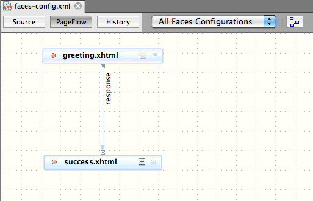
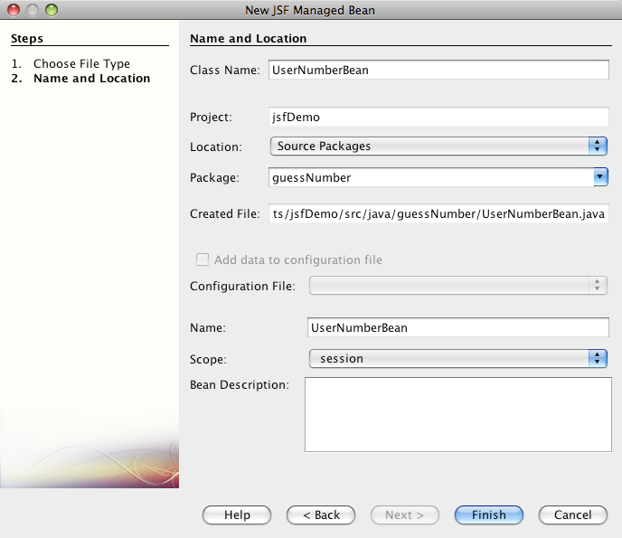
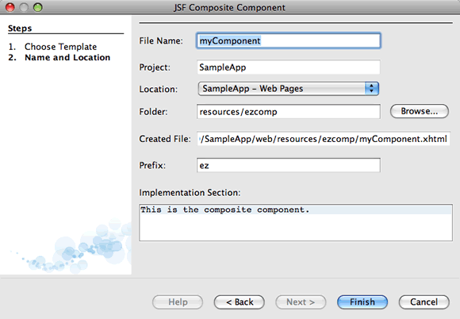
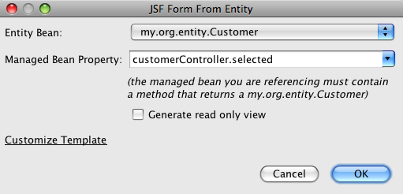
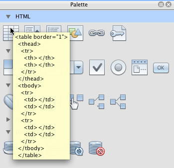
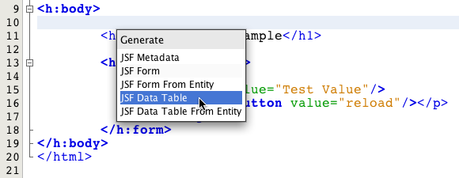

// 
//     Licensed to the Apache Software Foundation (ASF) under one
//     or more contributor license agreements.  See the NOTICE file
//     distributed with this work for additional information
//     regarding copyright ownership.  The ASF licenses this file
//     to you under the Apache License, Version 2.0 (the
//     "License"); you may not use this file except in compliance
//     with the License.  You may obtain a copy of the License at
// 
//       http://www.apache.org/licenses/LICENSE-2.0
// 
//     Unless required by applicable law or agreed to in writing,
//     software distributed under the License is distributed on an
//     "AS IS" BASIS, WITHOUT WARRANTIES OR CONDITIONS OF ANY
//     KIND, either express or implied.  See the License for the
//     specific language governing permissions and limitations
//     under the License.
//

= JSF 2.x Support in NetBeans IDE
:jbake-type: tutorial
:jbake-tags: tutorials 
:jbake-status: published
:icons: font
:syntax: true
:source-highlighter: pygments
:toc: left
:toc-title:
:description: JSF 2.x Support in NetBeans IDE - Apache NetBeans
:keywords: Apache NetBeans, Tutorials, JSF 2.x Support in NetBeans IDE

image::images/netbeans-stamp-80-74-73.png[title="Content on this page applies to the NetBeans IDE 7.2, 7.3, 7.4 and 8.0"]

NetBeans IDE provides numerous features that enable built-in support for JavaServer Faces (JSF) 2.0 and 2.1. The IDE's JSF 2.x support builds upon its previous support for JavaServer Faces, and includes versatile editor enhancements for Facelets pages, various facilities for working with entity classes, and a suite of JSF wizards for common development tasks, such as creating JSF managed beans, Facelets templates and composite components.

The following topics demonstrate the JSF 2.x features that are at your disposal when working in the NetBeans IDE. To try out the new JSF features, xref:../../../download/index.adoc[+download the Java bundle of the NetBeans IDE+], which includes Java Web and EE technologies. The download bundle also includes the GlassFish Server Open Source Edition, which is the reference implementation of the Java EE 6 platform specification (JSR 316).

[[support]]
== JSF 2.x Support for Projects

JSF support for projects can be categorized as follows.

* Facelets template files are included in the project
* JSF 2.x libraries are added to the project's classpath
* The Faces servlet and servlet mapping are added to the project's deployment descriptor

Using the GlassFish server, or any other Java EE-compliant server, you can create projects with JSF 2.x support, or add JSF 2.x support to an existing project.

* <<creatingSupport,Creating a New Project with JSF 2.x Support>>
* <<addingSupport,Adding JSF 2.x Support to an Existing Project>>

[[creatingSupport]]
=== Creating a New Project with JSF 2.x Support

Use the IDE's Project wizard to create a new Java web application. To do so, click the New Project ( image:images/new-project-btn.png[] ) button in the IDE's main toolbar, or press Ctrl-Shift-N (⌘-Shift-N on Mac). When you arrive at Step 4: Frameworks, select JavaServer Faces.

image::images/new-proj-wizard-framework.png[title="Add JSF Framework support when creating a project"]

After selecting JavaServer Faces, various configuration options become available to you, as shown in the above image. You can determine how your project has access to JSF 2.x libraries. Click the Configuration tab to specify how the Faces servlet will be registered in the project's deployment descriptor.

image::images/jsf-configuration.png[title="Specify Faces servlet settings under the Configuration tab"]

[[addingSupport]]
=== Adding JSF 2.x Support to an Existing Project

If you want to add JSF 2.x support to an existing Java web application, you can do so from your project's Properties window.

1. In the Projects window (Ctrl-1; ⌘-1 on Mac), right-click your project node and choose Properties. The Project Properties window displays.
2. Select the Frameworks category and then click the Add button.
3. Select JavaServer Faces in the Add a Framework dialog box. Click OK. 

image::images/add-framework.png[title="Add JSF support to an existing project"]

After selecting JavaServer Faces, various configuration options become available, such as specifying the path to JSF 2.x libraries, and registration of the Faces servlet in the project's deployment descriptor.

[[editor]]
== Utilizing the Editor

The IDE's editor is language-specific, and provides support depending on the file type you are working in. Generally speaking, you can press Ctrl-Space on an element in your file to invoke code completion and API documentation. You can also take advantage of keyboard shortcuts and code templates.

Choose Help > Keyboard Shortcuts Card from the IDE's main menu to view common keyboard shortcuts and code templates. For the full list, see the link:http://wiki.netbeans.org/KeymapProfileFor60[+NetBeans IDE 6.x Keyboard Shortcuts Specification+].

The IDE provides built-in Javadoc support for the link:http://javaserverfaces.java.net/nonav/docs/2.0/javadocs/index.html[+JSF 2.0 API+] and link:http://javaserverfaces.java.net/nonav/docs/2.1/javadocs/index.html[+JSF 2.1 API+], as well as JSF's link:http://javaserverfaces.java.net/nonav/docs/2.1/vdldocs/facelets/index.html[+Tag Library Documentation+]. To take advantage of these resources in your work, simply press Ctrl-Space on a given element in the editor.

If you prefer continuous access to Javadoc documentation, you can open the IDE's Javadoc window (Window > Other > Javadoc). The Javadoc window automatically refreshes depending on the location of your cursor in the editor.

When working on a JSF project, your editing efforts will primarily be spent in Facelets files, JSF managed beans, and the Faces configuration file (`faces-config.xml`). The following briefly demonstrates the editor support that is at your disposal.

* <<facelets,Facelets editor>>
* <<xml,Faces XML configuration editor>>

[[facelets]]
=== Facelets Editor

The IDE's Facelets editor provides numerous features that facilitate JSF development, including syntax highlighting and error checking for JSF tags, documentation support, and code completion for EL expressions, core Facelets libraries and namespaces.

You can press Ctrl-Space to invoke code completion and documentation support, where applicable.

image::images/doc-support.png[title="Press Ctrl-Space to invoke code completion and documentation support"]

When your cursor is not positioned on a tag, pressing Ctrl-Space will invoke a pop-up list of items. These items can equally be accessed from the IDE's <<palette,Palette>> (Ctrl-Shift-8; ⌘-Shift-8 on Mac).

You can also type a prefix before pressing Ctrl-Space, e.g., `jsf`, to filter items.

image::images/code-completion.png[title="Press Ctrl-Space in the editor to invoke a list of items"]

You can press Ctrl-Space to invoke code completion for Facelets namespaces.

image::images/namespace.png[title="Press Ctrl-Space to complete Facelets namespaces"]

Similarly, if you type in a JSF tag whose namespace has not been declared in the page, the IDE automatically adds it to the page's `<html>` tag.

The editor provides completion support for Expression Language (EL) syntax. Press Ctrl-Space on EL code to invoke suggestions for implicit objects, JSF managed beans, and their properties.

image::images/el-code-completion.png[title="Press Ctrl-Space on EL expressions to invoke completion support for implicit objects, JSF managed beans, and bean properties"]

You can also highlight code snippets in the editor, and choose Convert to Composite Component in order to create JSF composite components. See the <<composite,Composite Component wizard>> for more details.

The editor provides basic error checking capabilities. An error displays with a red underline and corresponding badge in the left margin. Warnings are underlined in yellow and are denoted by a yellow badge in the left margin. You can hover your mouse over the badge or underlined text to view a description of the error.

When you enter JSF tags, various checks are performed. These include whether:

* the declared library exists
* the library matched by the tag prefix contains such a component or tag
* the tag contains all required attributes
* all entered attributes are defined in the component's interface

The editor also checks for:

* the existence of undeclared components
* the presence of taglib declarations without usages

[[xml]]
=== Faces XML Configuration Editor

If you include a `faces-config.xml` file in your JSF project, you can press Ctrl-Space when defining navigation rules or declaring managed beans in order to bring up code completion and documentation support.

If you prefer to enter navigation rules and managed beans using dialogs rather than hand-coding them, the IDE provides several JSF-specific dialogs for this purpose. These are accessible from the editor's right-click menu.

image::images/faces-config-menu.png[title="JSF-specific dialogs provided in faces-config.xml's right-click menu"]

The IDE provides two distinct _views_ for the `faces-config.xml` file: the Source view, which displays the XML source code, and the PageFlow view, which is a graphical interface that depicts JSF navigation rules defined in the `faces-config.xml` file.

For example, if your file contains the following navigation rule:

[source,xml]
----

<navigation-rule>
    <from-view-id>/greeting.xhtml</from-view-id>
    <navigation-case>
        <from-outcome>response</from-outcome>
        <to-view-id>/success.xhtml</to-view-id>
    </navigation-case>
</navigation-rule>
----

The PageFlow view displays the following relationship, indicating that a navigation from `greeting.xhtml` to `success.xhtml` occurs when "`response`" is passed to JSF's `NavigationHandler`.

Double-clicking components in the PageFlow view enables you to navigate directly to the source file. For example, when you double-click the `greeting.xhtml` component, the `greeting.xhtml` file opens in the editor. Likewise, if you double-click the arrow between the two components, the editor will focus on the navigation rule defined in the `faces-config.xml` XML view.

[[wizard]]
== JSF Wizards

The NetBeans IDE provides numerous wizards that facilitate development with JSF 2.x. You can create new Facelets pages, Facelets templates, JSF managed beans, composite components, Faces configuration files, and more.

All wizards are accessible via the IDE's generic File wizard. To access the File wizard, press the New File ( image:images/new-file-btn.png[] ) button, or choose File > New File from the main menu (or press Ctrl-N; ⌘-N on Mac). JSF-specific wizards are listed within the JavaServer Faces category.

image::images/file-wizard.png[title="JSF-oriented wizards are accessible from the File wizard"]

The following wizards are available to you when working in a Java web project with JSF support.

* <<jsfPage,JSF Page Wizard>>
* <<managedBean,JSF Managed Bean Wizard>>
* <<facesConfig,Faces Configuration Wizard>>
* <<composite,Composite Component Wizard>>
* <<jsfPagesEntity,JSF Pages from Entity Classes Wizard>>
* <<faceletsTemplate,Facelets Template Wizard>>
* <<faceletsTemplateClient,Facelets Template Client Wizard>>

[[jsfPage]]
=== JSF Page Wizard

Use the JSF Page wizard to create Facelets and JSP pages for your project. In the IDE's File wizard, select the JavaServer Faces category, then select JSF Page. In JSF 2.x, Facelets is the preferred way to declare JSF pages. The Facelets option in the wizard is selected by default. Select the JSP File option if you want to create new JSP pages, or JSP fragments (`.jspf` files).

image::images/jsf-file-wizard.png[title="Create Facelets pages using the IDE's JSF File wizard"]

[[managedBean]]
=== Managed Bean Wizard

You can create JSF managed beans for your application using the IDE's Managed Bean wizard. From the JavaServer Faces category in the IDE's <<fileWizard,File wizard>>, select JSF Managed Bean.

By default, any metadata that you specify in the wizard is translated into annotations that are applied to the managed bean once it is generated. For example, in the image below, you can create a new, session-scoped class named `NewJSFManagedBean` and name it `myManagedBean`.

When the managed bean is generated, it appears as follows with appropriate annotations.

[source,java]
----

package my.org;

import javax.faces.bean.ManagedBean;
import javax.faces.bean.SessionScoped;

*@ManagedBean(name="myManagedBean")*
*@SessionScoped*
public class NewJSFManagedBean {

    /** Creates a new instance of NewJSFManagedBean */
    public NewJSFManagedBean() {
    }

}
----

If your project already contains a `faces-config.xml` file, the wizard's 'Add data to configuration file' option becomes active, enabling you to either declare the managed bean in the Faces configuration file, or have any metadata specified via annotations in the managed bean.

[[facesConfig]]
=== Faces Configuration Wizard

JSF 2.x introduces annotations as an alternative to the standard Faces configuration file (`faces-config.xml`) for configuring your application. Therefore, when adding JSF 2.x support to a project, the IDE _does not_ generate a default `faces-config.xml` file (as was the case for JSF 1.2). Naturally, you may want to add a `faces-config.xml` file to your project in order to define certain configuration settings. To do so, use the IDE's Faces Configuration wizard.

From the JavaServer Faces category in the IDE's <<fileWizard,File wizard>>, select JSF Faces Configuration. This enables you to create a new `faces-config.xml` file, which is placed in your project's `WEB-INF` folder by default.

See <<xml,Faces XML configuration editor>> for a description of the IDE's editor support for `faces-config.xml`.

[[composite]]
=== Composite Component Wizard

JSF 2.x has simplified the process of creating composite user interface (UI) components, which can be reused in web pages. You can use the IDE's Composite Component wizard to generate a Facelets template for a JSF composite component.

Like all JSF-related wizards, you can access the Composite Component wizard from the JavaServer Faces category in the IDE's <<fileWizard,File wizard>>. However, a more intuitive way to prompt the wizard is by highlighting the code snippet from a Facelets page in the editor, then choosing Refactor > Convert to Composite Component from the popup menu.

The following example describes the actions that occur, and facilities at your disposal, when invoking the Composite Component wizard on the snippet, '`
This is the composite component.
`'.

image::images/convert-comp-component.png[title="Highlight a snippet, and choose Convert to Composite Component from the right-click menu"]

The Composite Component wizard opens, containing the selected snippet in its Implementation Section panel.

By default, the wizard creates an `ezcomp` folder to contain composite components. For example, if you are creating a new component named `myComponent`, the wizard generates a `myComponent.xhtml` Facelets page, residing in the `resources/ezcomp` folder of your application's web root.

When you complete the wizard, the composite component source file is generated for the given code snippet. The template includes a reference to JSF 2.x's `composite` tag library.

[source,html]
----

<?xml version='1.0' encoding='UTF-8' ?>
<!DOCTYPE html PUBLIC "-//W3C//DTD XHTML 1.0 Transitional//EN" "http://www.w3.org/TR/xhtml1/DTD/xhtml1-transitional.dtd">
<html xmlns="http://www.w3.org/1999/xhtml"
    *xmlns:cc="http://xmlns.jcp.org/jsf/composite"*>

  <!-- INTERFACE -->
  <cc:interface>
  </cc:interface>

  <!-- IMPLEMENTATION -->
  <cc:implementation>
    *
This is the composite component.
*
  </cc:implementation>
</html>
----

Also, a new component tag is inserted into the location in the editor where you highlighted the snippet. In this case, the generated tag is: `<ez:myComponent/>`. Note that the IDE automatically adds the namespace where the composite component resides to the page's `<html>` tag.

image::images/comp-component-editor.png[title="Component tag is automatically inserted into your page"]

The IDE also supports hyperlinking to composite component source files. You can navigate to a composite component from a Facelets page by pressing Ctrl (⌘ on Mac) while hovering your mouse over the component tag. Clicking the hyperlink causes the composite component source file to open in the editor.

For more information on composite components in JSF 2.x, see link:http://blogs.oracle.com/enterprisetechtips/entry/true_abstraction_composite_ui_components[+True Abstraction: Composite UI Components in JSF 2.0+].

[[jsfPagesEntity]]
=== JSF Pages from Entity Classes Wizard

See the topic <<jsfPages,Creating JSF Pages from Entity Classes>> under <<entity,Support for Entity Classes>>.

[[faceletsTemplate]]
=== Facelets Template Wizard

Use the Facelets Template wizard to generate a Facelets template. From the JavaServer Faces category in the IDE's <<fileWizard,File wizard>>, select Facelets Template. You can choose from eight unique layout styles, and specify whether the layout is implemented using CSS or an HTML `<table>` tag.

image::images/template-wizard.png[title="Create a Facelets template using the Facelets Template wizard"]

The wizard creates an XHTML template file using `<h:head>` and `<h:body>` tags, and places associated stylesheets in the `resources/css` folder of your application's web root. The wizard generates a `default.css` file, and a `cssLayout.css` or `tableLayout.css` file, depending on your layout selection.

To view your template in a browser, right-click in the editor and choose View. A browser window opens to display the template.

[[faceletsTemplateClient]]
=== Facelets Template Client Wizard

Use the Facelets Template Client wizard to generate a page that references a Facelets template in your project. From the JavaServer Faces category in the IDE's <<fileWizard,File wizard>>, select Facelets Template Client. You can specify the location of the Facelets Template that is used by the client. You can specify if the root tag is  ``<html>``  or  ``<ui:composition>`` 

image::images/new-template-client.png[title="Create a Client for a Facelets template using the Facelets Template Client wizard"]

For more details on using Facelets templates and clients, see the section on xref:jsf20-intro.adoc#template[+Applying a Facelets Template+] in the xref:jsf20-intro.adoc[+Introduction to JavaServer Faces 2.x in NetBeans IDE+].

[[entity]]
== Support for Entity Classes

If you are using Java persistence in your application and have entity classes based on your database schema, the IDE provides functionality that lets you work efficiently with entity class data.

*Note: *To create entity classes from a database table, use the IDE's Entity Classes from Database wizard, accessible from the Persistence category in the IDE's <<fileWizard,File wizard>>.

* <<jsfPages,Creating JSF Pages from Entity Classes>>
* <<form,Creating a JSF Form for Entity Data>>
* <<dataTable,Creating a JSF Data Table for Entity Data>>

[[jsfPages]]
=== Creating JSF Pages from Entity Classes

Once you have entity classes in your application, you can use the IDE's JSF Pages from Entity Classes wizard to create a web interface for displaying and modifying entity class data. The code generated by the wizard is based on persistence annotations contained in the entity classes.

For each entity class, the wizard generates the following:

* a stateless session bean for creation, retrieval, modification and removal of entity instances
* a JSF session-scoped, managed bean
* a directory containing four Facelets files for CRUD capabilities (`Create.xhtml`, `Edit.xhtml`, `List.xhtml`, and `View.xhtml`)
* utility classes used by the JSF managed beans (`JsfUtil`, `PaginationHelper`)
* a properties bundle for localized messages, and a corresponding entry in the project's Faces configuration file (A `faces-config.xml` file is created if one does not already exist.)
* auxilary web files, including a default stylesheet for rendered components, and a Facelets template file

To use the JSF Pages from Entity Classes wizard, <<fileWizard,access the IDE's File wizard>>. Select the JavaServer Faces category, then select JSF Pages from Entity Classes.

When you reach Step 3: Generate JSF Pages and Classes, you can specify the locations of the files that will be generated.

image::images/jsf-entity-wizard.png[title="Specify the locations of the files that will be generated"]

For example, if you are applying the wizard to a `Customer` entity class, the settings shown in the image above will generate the following files:

|===
|image:images/projects-win-generated-files.png[title="The Projects window displays newly generated files"] |

* A `faces-config.xml` file to register the location of the properties bundle that contains localized messages for the JSF views. For example, specifying `/my/org/Bundle` for Localization Bundle Name in the wizard generates the following entry:

[source,xml]
----

<application>
    <resource-bundle>
        <base-name>/my/org/Bundle</base-name>
        <var>bundle</var>
    </resource-bundle>
</application>
----
* A `customer` folder in your web root, that contains four Facelets files for CRUD capabilities:
* `Create.xhtml`: A JSF form for creating a new customer.
* `Edit.xhtml`: A JSF form for editing a customer.
* `List.xhtml`: A JSF data table for scrolling through customers.
* `View.xhtml`: A JSF form for viewing customer details.
* `jsfcrud.css`: A stylesheet used to render the JSF forms and data table.
* `template.xhtml`: An optional Facelets template page, which includes a reference to the generated `jsfcrud.css` stylesheet.
* A stateless session (enterprise) bean named `CustomerFacade`, that resides in the `my.org.data` package. This class can equally be accessed from the project's Enterprise Beans node.
* `Bundle.properties`: A properties bundle that contains default localized messages for the JSF views.
* A JSF session-scoped, managed bean named `CustomerController`, that resides in the `my.org.ui` package.
* Two utility classes (`JsfUtil` and `PaginationHelper`) residing in the `my.org.ui.util` package. These are used by the `CustomerController` managed bean.
 
|===

[[form]]
=== Creating a JSF Form for Entity Data

You can use the Form from Entity dialog to generate a JSF form that contains fields for all properties contained in an entity class. You must already have a JSF managed bean created to handle any user data associated with the form.

*Note: *If you use this dialog without having an associated managed bean, you can enter a name for the managed bean in the dialog, and that name will be used in the page regardless of whether it is valid or not. You can then create a managed bean using the IDE's <<managedBean,Managed Bean wizard>>, or if you use the <<jsfPages,JSF Pages from Entity Classes wizard>>, managed beans are generated for all selected entity classes.

You can access the Form from Entity dialog either by <<popup,pressing Ctrl-Space in the editor of a Facelets page>> then choosing JSF Form From Entity, or by double-clicking the Form From Entity item listed in the IDE's <<palette,Palette>> (Ctrl-Shift-8; ⌘-Shift-8 on Mac).

For example, in the following image, a `Customer` entity class already exists in the `my.org` package of the given project. A `customerController` managed bean also already exists in the given project, and the managed bean contains a property named `selected` which returns a `Customer` object.

*Note: *Select the 'Generate read only view' option to create a form that contains read-only fields. When this option is selected, the IDE applies `<h:outputText>` tags for form fields, whereas `<h:inputText>` tags are applied when the option is not selected.

When you complete the dialog, the IDE generates code for your Facelets page. For example, a `Customer` entity class containing a `customerId` property is displayed in the following format:

[source,xml]
----

<f:view>
    <h:form>
        <h1><h:outputText value="Create/Edit"/></h1>
        <h:panelGrid columns="2">
            <h:outputLabel value="CustomerId:" for="customerId" />
            <h:inputText id="customerId" value="#{customerController.selected.customerId}" title="CustomerId" required="true" requiredMessage="The CustomerId field is required."/>
            ...
            _[ Other fields added here. ]_
            ...
        </h:panelGrid>
    </h:form>
</f:view>
----

To modify the template used for the generated code, click the Customize Template link within the Form from Entity dialog.

[[dataTable]]
=== Creating a JSF Data Table for Entity Data

You can use the Data Table from Entity dialog to generate a JSF data table that contains columns for all properties contained in an entity class. In order to make use of this facility, you must already have a JSF managed bean created to handle any back-end data associated with the entity class.

*Note: *If you use this dialog without having an associated managed bean, you can enter a name for the managed bean in the dialog, and that name will be used in the page regardless of whether it is valid or not. You can then create a managed bean using the IDE's <<managedBean,Managed Bean wizard>>, or if you use the <<jsfPages,JSF Pages from Entity Classes wizard>>, managed beans are generated for all selected entity classes.

You can access the Data Table from Entity dialog either by <<popup,pressing Ctrl-Space in the editor of a Facelets page>> then choosing JSF Data Table From Entity, or by double-clicking the Data Table From Entity item listed in the IDE's <<palette,Palette>> (Ctrl-Shift-8; ⌘-Shift-8 on Mac).

For example, in the following image, a `Product` entity class already exists in the `my.org.entity` package of the given project. A `productController` managed bean also exists in the project, and the managed bean contains a method named `getProductItems()` which returns a `List` of `Product` objects.

image::images/jsf-data-table-from-entity.png[title="Use the Data Table from Entity dialog to generate a JSF data table from entity data"]

When you complete the dialog, the IDE generates code for your Facelets page. For example, a `Product` entity class containing a `productId` property is displayed in the following format:

[source,xml]
----

<f:view>
    <h:form>
        <h1><h:outputText value="List"/></h1>
        <h:dataTable value="#{productController.productItems}" var="item">
            <h:column>
                <f:facet name="header">
                    <h:outputText value="ProductId"/>
                </f:facet>
                <h:outputText value="#{item.productId}"/>
            </h:column>
            ...
            _[ Other columns added here. ]_
            ...
        </h:dataTable>
    </h:form>
</f:view>
----

To modify the template used for the generated code, click the Customize Template link within the Form from Data Table dialog.

[[palette]]
== JSF Palette Components

When working in Facelets pages, you can take advantage of the IDE's Palette to drag and drop JSF tags onto the page. You can access the Palette either by choosing Window > Palette from the main menu, or press Ctrl-Shift-8 (⌘-Shift-8 on Mac).

You can also choose Source > Insert Code (Alt-Insert; Ctrl-I on Mac) from the IDE's main menu to invoke a pop-up list that contains JSF-specific components contained in the Palette.

The Palette provides you with five JSF-related components:

* *Metadata: * Invokes a dialog to add name-value pairs within JSF metadata tags. For example, if you specify '`myId`' and '`myValue`' as a name-value pair, the following code snippet is produced:

[source,xml]
----

<f:metadata>
    <f:viewParam id='myId' value='myValue'/>
</f:metadata>
----
* *JSF Form: * Adds the following code snippet to the page.

[source,xml]
----

<f:view>
    <h:form>
    </h:form>
</f:view>
----
* *JSF Form From Entity: *Invokes a dialog enabling you to associate data from an entity class to fields contained in a JSF form. See <<form,Creating a JSF Form for Entity Data>>.
* *JSF Data Table: *Adds the following code snippet to the page.

[source,xml]
----

<f:view>
    <h:form>
        <h:dataTable value="#{}" var="item">
        </h:dataTable>
    </h:form>
</f:view>
----
* *JSF Data Table from Entity: *Invokes a dialog enabling you to associate data from an entity class to fields contained in a JSF data table. See <<dataTable,Creating a JSF Data Table for Entity Data>>.

xref:../../../community/mailing-lists.adoc[Send Feedback on This Tutorial]

[[seealso]]
== See Also

For more information about JSF 2.x, see the following resources.

=== NetBeans Articles and Tutorials

* xref:jsf20-intro.adoc[+Introduction to JavaServer Faces 2.x in NetBeans IDE+]
* xref:jsf20-crud.adoc[+Generating a JavaServer Faces 2.x CRUD Application from a Database+]
* xref:../../samples/scrum-toys.adoc[+Scrum Toys - The JSF 2.0 Complete Sample Application+]
* xref:../javaee/javaee-gettingstarted.adoc[+Getting Started with Java EE Applications+]
* xref:../java-ee.adoc[+Java EE &amp; Java Web Learning Trail+]

=== External Resources

* link:http://www.oracle.com/technetwork/java/javaee/javaserverfaces-139869.html[+JavaServer Faces Technology+] (Official homepage)
* link:http://jcp.org/aboutJava/communityprocess/final/jsr314/index.html[+JSR 314 Specification for JavaServer Faces 2.0+]
* link:http://download.oracle.com/javaee/6/tutorial/doc/bnaph.html[+The Java EE 6 Tutorial, Chapter 5: JavaServer Faces Technology+]
* link:http://javaserverfaces.java.net/[+the GlassFish server Project Mojarra+] (Official reference implementation for JSF 2.x)
* link:http://forums.oracle.com/forums/forum.jspa?forumID=982[+OTN Discussion Forums : JavaServer Faces+]
* link:http://www.jsfcentral.com/[+JSF Central+]

=== Blogs

* link:http://www.java.net/blogs/edburns/[+Ed Burns+]
* link:http://www.java.net/blogs/driscoll/[+Jim Driscoll+]

 

