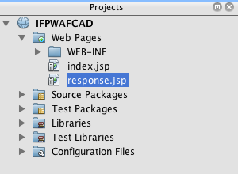
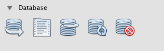
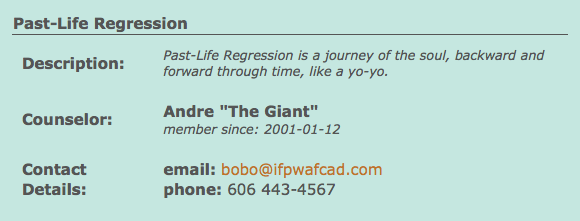
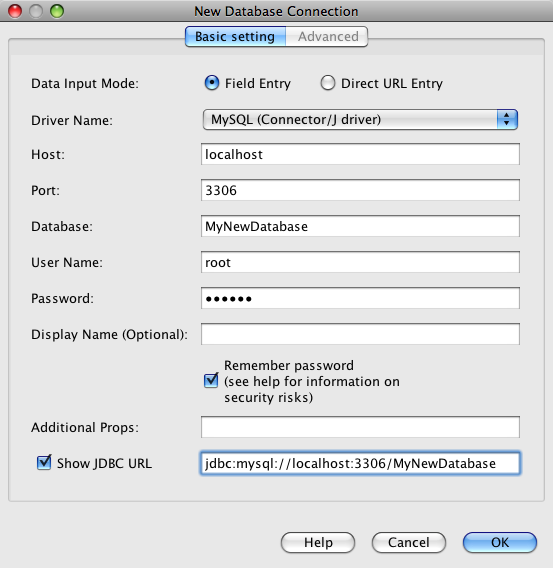

// 
//     Licensed to the Apache Software Foundation (ASF) under one
//     or more contributor license agreements.  See the NOTICE file
//     distributed with this work for additional information
//     regarding copyright ownership.  The ASF licenses this file
//     to you under the Apache License, Version 2.0 (the
//     "License"); you may not use this file except in compliance
//     with the License.  You may obtain a copy of the License at
// 
//       http://www.apache.org/licenses/LICENSE-2.0
// 
//     Unless required by applicable law or agreed to in writing,
//     software distributed under the License is distributed on an
//     "AS IS" BASIS, WITHOUT WARRANTIES OR CONDITIONS OF ANY
//     KIND, either express or implied.  See the License for the
//     specific language governing permissions and limitations
//     under the License.
//

= Creating a Simple Web Application Using a MySQL Database
:jbake-type: tutorial
:jbake-tags: tutorials 
:jbake-status: published
:icons: font
:syntax: true
:source-highlighter: pygments
:toc: left
:toc-title:
:description: Creating a Simple Web Application Using a MySQL Database - Apache NetBeans
:keywords: Apache NetBeans, Tutorials, Creating a Simple Web Application Using a MySQL Database

Written by Troy Giunipero

This document describes how to create a simple web application that connects to a MySQL database server. It also covers some basic ideas and technologies in web development, such as link:http://www.oracle.com/technetwork/java/overview-138580.html[+JavaServer Pages+] (JSP), link:http://www.oracle.com/technetwork/java/index-jsp-135995.html[+JavaServer Pages Standard Tag Library+] (JSTL), the link:http://docs.oracle.com/javase/tutorial/jdbc/overview/index.html[+Java Database Connectivity+] (JDBC) API, and two-tier, client-server architecture. This tutorial is designed for beginners who have a basic understanding of web development and are looking to apply their knowledge using a MySQL database.

link:http://www.mysql.com[+MySQL+] is a popular open source database management system commonly used in web applications due to its speed, flexibility and reliability. MySQL employs SQL, or _Structured Query Language_, for accessing and processing data contained in databases.

This tutorial is a continuation from the xref:../ide/mysql.adoc[+Connecting to a MySQL Database+] tutorial and assumes that you have already created a MySQL database named `MyNewDatabase`, which you have registered a connection for in the NetBeans IDE. The table data used in that tutorial is contained in link:https://netbeans.org/projects/samples/downloads/download/Samples%252FJava%2520Web%252Fifpwafcad.sql[+ifpwafcad.sql+] and is also required for this tutorial. This SQL file creates two tables, `Subject` and `Counselor`, then populates them with sample data. If needed, save this file to your computer, then open it in the NetBeans IDE and run it on the MySQL database named `MyNewDatabase`.

image::images/netbeans-stamp-80-74-73.png[title="Content on this page applies to the NetBeans IDE 7.2, 7.3, 7.4 and 8.0"]

*To follow this tutorial, you need the following software and resources.*

|===
|Software or Resource |Version Required 

|xref:../../../download/index.adoc[+NetBeans IDE+] |7.2, 7.3, 7.4, 8.0, Java EE bundle 

|link:http://www.oracle.com/technetwork/java/javase/downloads/index.html[+Java Development Kit (JDK)+] |version 7 or 8 

|link:http://dev.mysql.com/downloads/mysql/[+MySQL database server+] |5.x 

|MySQL Connector/J JDBC Driver |version 5.x 

|GlassFish Server Open Source Edition |3.x or 4.x 
|===

*Notes:*

* The Java download bundle of the NetBeans IDE enables you to install the GlassFish server. You require the GlassFish server to work through this tutorial.
* The link:http://dev.mysql.com/downloads/connector/j/[+MySQL Connector/J JDBC Driver+], necessary for communication between Java platforms and the MySQL database protocol, is included in the NetBeans IDE.
* If you need to compare your project with a working solution, you can link:https://netbeans.org/projects/samples/downloads/download/Samples%252FJava%2520Web%252FIFPWAFCAD.zip[+download the sample application+].

[[planStructure]]
== Planning the Structure

Simple web applications can be designed using a _two-tier architecture_, in which a client communicates directly with a server. In this tutorial, a Java web application communicates directly with a MySQL database using the Java Database Connectivity API. Essentially, it is the link:http://dev.mysql.com/downloads/connector/j/[+MySQL Connector/J JDBC Driver+] that enables communication between the Java code understood by the application server (the GlassFish server), and any content in SQL, the language understood by the database server (MySQL).

The application you build in this tutorial involves the creation of two JSP pages. In each of these pages you use HTML and CSS to implement a simple interface, and apply JSTL technology to perform the logic that directly queries the database and inserts the retrieved data into the two pages. The two database tables, `Subject` and `Counselor`, are contained in the MySQL database, `MyNewDatabase`, which you create by completing the xref:../ide/mysql.adoc[+Connecting to a MySQL Database+] tutorial. Consider the following two-tier scenario.

 image::images/ifpwafcad-structure.png[title="Sample structure of a two-tier web application"]

The welcome page (`index.jsp`) presents the user with a simple HTML form. When a browser requests `index.jsp`, the JSTL code within the page initiates a query on `MyNewDatabase`. It retrieves data from the `Subject` database table, and inserts it into to the page before it is sent to the browser. When the user submits his or her selection in the welcome page's HTML form, the submit initiates a request for the response page (`response.jsp`). Again, the JSTL code within the page initiates a query on `MyNewDatabase`. This time, it retrieves data from both the `Subject` and `Counselor` tables and inserts it into to the page, allowing the user to view data based upon his or her selection when the page is returned to the browser.

In order to implement the scenario described above, you develop a simple application for a fictitious organization named IFPWAFCAD, The International Former Professional Wrestlers' Association for Counseling and Development.

=== index.jsp

image::images/index-page.png[title="index.jsp displayed in a browser"] 

=== response.jsp

image::images/response-page.png[title="response.jsp displayed in a browser"]

[[createProject]]
== Creating a New Project

Begin by creating a new Java web project in the IDE:

1. Choose File > New Project (Ctrl-Shift-N; ⌘-Shift-N on Mac) from the main menu. Select the Java Web category, then select Web Application. Click Next. 

image::images/new-project.png[title="Use the IDE's New Project wizard to create a new project"]

The New Project wizard allows you to create an empty web application in a standard IDE project. The standard project uses an IDE-generated Ant build script to compile, deploy, and run the application.

. In Project Name, enter *IFPWAFCAD*. Also, specify the location for the project on your computer. (By default, the IDE places projects in a `NetBeansProjects` folder located in your home directory.) Click Next.

. In the Server and Settings panel, specify the GlassFish server as server which will be used to run the application.

*Note. *The GlassFish server displays in the Server drop-down field if you installed the Java version of the xref:../../../download/index.adoc[+NetBeans IDE+]. Because the GlassFish server is included in the download, it is automatically registered with the IDE. If you want to use a different server for this project, click the Add button located next to the Server drop-down field, and register a different server with the IDE. However, working with servers other than the GlassFish server is beyond the scope of this tutorial.

. In the Java EE Version field, select *Java EE 5*. 

image::images/server-settings.png[title="Specify server settings in the New Web Application wizard"]

Java EE 6 and Java EE 7 web projects do not require the use of the `web.xml` deployment descriptor, and the NetBeans project template does not include the `web.xml` file in Java EE 6 and Java EE 7 projects. However, this tutorial demonstrates how to declare a data source in the deployment descriptor, and it does not rely on any features specific to Java EE 6 or Java EE 7, so you can set the project version to Java EE 5.

*Note.* You could equally set the project version to Java EE 6 or Java EE 7 and then create a `web.xml` deployment descriptor. (From the New File wizard, select the Web category, then Standard Deployment Descriptor.)

. Click Finish. The IDE creates a project template for the entire application, and opens an empty JSP page (`index.jsp`) in the editor. The `index.jsp` file serves as the welcome page for the application.

[[prepareInterface]]
== Preparing the Web Interface

Begin by preparing the welcome (`index.jsp`) and response (`response.jsp`) pages. The welcome page implements an HTML form that is used to capture user data. Both pages implement an HTML table to display data in a structured fashion. In this section, you also create a stylesheet that enhances the appearance of both pages.

* <<welcomePage,Setting up the welcome page>>
* <<responsePage,Creating the response page>>
* <<stylesheet,Creating a stylesheet>>

[[welcomePage]]
=== Setting up the welcome page

Confirm that `index.jsp` is open in the editor. If the file is not already open, double-click `index.jsp` under the Web Pages node in the IFPWAFCAD project in the Projects window.

1. In the editor, change the text between the `<title>` tags to: `IFPWAFCAD Homepage`.
2. Change the text between the `<h1>` tags to: `Welcome to IFPWAFCAD, the International Former Professional Wrestlers' Association for Counseling and Development!`.
3. Open the IDE's Palette by choosing Window > Palette (Ctrl-Shift-8; ⌘-Shift-8 on Mac) from the main menu. Hover your pointer over the Table icon from the HTML category and note that the default code snippet for the item displays. 

image::images/palette.png[title="Palette displays code snippet when hovering over an item"] 

[tips]#You can configure the Palette to your liking - right-click in the Palette and choose Show Big Icons and Hide Item Names to have it display as in the image above.#

. Place your cursor at a point just after the `<h1>` tags. (This is where you want to implement the new HTML table.) Then, in the Palette, double-click the Table icon.

. In the Insert Table dialog that displays, specify the following values then click OK: 

* *Rows*: 2
* *Columns*: 1
* *Border Size*: 0
The HTML table code is generated and added to your page.

. Add the following content to the table heading and the cell of the first table row (new content shown in *bold*):

[source,xml]
----

<table border="0">
    <thead>
        <tr>
            <th>*IFPWAFCAD offers expert counseling in a wide range of fields.*</th>
        </tr>
    </thead>
    <tbody>
        <tr>
            <td>*To view the contact details of an IFPWAFCAD certified former
                professional wrestler in your area, select a subject below:*</td>
        </tr>
----

. For the bottom row of the table, insert an HTML form. To do so, place your cursor between the second pair of `<td>` tags, then double-click the HTML form ( image:images/html-form-icon.png[] ) icon in the Palette. In the Insert Form dialog, type in `response.jsp` in the Action text field, then click OK. 

image::images/insert-form.png[title="Specify form settings in the Insert Form dialog"]

. Type in the following content between the `<form>` tags (new content shown in *bold*):

[source,xml]
----

<tr>
    <td>
        <form action="response.jsp">
            *<strong>Select a subject:</strong>*
        </form>
    </td>
</tr>
----

. Press Enter to add an empty line after the content you just added and then double-click Drop-down List in the Palette to open the Insert Drop-down dialog box.

. Type `subject_id` for the Name text field in the Insert Drop-down dialog and click OK. Note that the code snippet for the drop-down list is added to the form.

The number of options for the drop-down is currently not important. Later in the tutorial you will add JSTL tags that dynamically generate options based on the data gathered from the Subject database table.

. Add a submit button item ( image:images/submit-button.png[] ) to a point just after the drop-down list you just added. You can either use the Palette to do this, or invoke the editor's code completion as illustrated in the previous step. In the Insert Button dialog, enter `submit` for both the Label and Name text fields, then click OK.

. To format your code, right-click in the editor and choose Format (Alt-Shift-F; Ctrl-Shift-F on Mac). Your code is automatically formatted, and should now look similar to the following:

[source,xml]
----

<body>
    <h2>Welcome to <strong>IFPWAFCAD</strong>, the International Former
        Professional Wrestlers' Association for Counseling and Development!
    </h2>

    <table border="0">
        <thead>
            <tr>
                <th>IFPWAFCAD offers expert counseling in a wide range of fields.</th>
            </tr>
        </thead>
        <tbody>
            <tr>
                <td>To view the contact details of an IFPWAFCAD certified former
                    professional wrestler in your area, select a subject below:</td>
            </tr>
            <tr>
                <td>
                    <form action="response.jsp">
                        <strong>Select a subject:</strong>
                        <select name="subject_id">
                            <option></option>
                        </select>
                        <input type="submit" value="submit" name="submit" />
                    </form>
                </td>
            </tr>
        </tbody>
    </table>
</body>
----

To view this page in a browser, right-click in the editor and choose Run File (Shift-F6; Fn-Shift-F6 on Mac). When you do this, the JSP page is automatically compiled and deployed to your server. The IDE opens your default browser to display the page from its deployed location.

image::images/browser-output.png[title="index.jsp displays in a browser"]

[[responsePage]]
=== Creating the response page

In order to prepare the interface for `response.jsp` you must first create the file in your project. Note that most of the content that displays in this page is generated dynamically using JSP technology. Therefore, in the following steps you add _placeholders_ which you will later substitute for the JSP code.

1. Right-click the IFPWAFCAD project node in the Projects window and choose New > JSP. The New JSP File dialog opens.
2. In the JSP File Name field, enter `response`. Note that Web Pages is currently selected for the Location field, meaning that the file will be created in the project's `web` directory. This is the same location as where the `index.jsp` welcome page resides.
3. Accept any other default settings and click Finish. A template for the new `response.jsp` page is generated and opens in the editor. A new JSP node also displays under Web Pages in the Projects window. 

. In the editor, change the title to: `IFPWAFCAD - {placeholder}`.

. Remove the `<h1>Hello World!</h1>` line between the `<body>` tags, then copy and paste the following HTML table into the body of the page:

[source,xml]
----

<table border="0">
    <thead>
        <tr>
            <th colspan="2">{placeholder}</th>
        </tr>
    </thead>
    <tbody>
        <tr>
            <td><strong>Description: </strong></td>
            <td>{placeholder}</td>
        </tr>
        <tr>
            <td><strong>Counselor: </strong></td>
            <td>{placeholder}
                 
                
                member since: {placeholder}
            </td>
        </tr>
        <tr>
            <td><strong>Contact Details: </strong></td>
            <td><strong>email: </strong>
                <a href="mailto:{placeholder}">{placeholder}</a>
                 <strong>phone: </strong>{placeholder}
            </td>
        </tr>
    </tbody>
</table>
----

To view this page in a browser, right-click in the editor and choose Run File (Shift-F6; Fn-Shift-F6 on Mac). The page compiles, is deployed to the GlassFish server, and opens in your default browser.

image::images/browser-response.png[title="response.jsp displays in a browser"]

[[stylesheet]]
=== Creating a stylesheet

Create a simple stylesheet that enhances the display of the web interface. This tutorial assumes that you understand how style rules function, and how they affect corresponding HTML elements found in `index.jsp` and `response.jsp`.

1. Open the New File wizard by pressing the New File ( image:images/new-file-btn.png[] ) button in the IDE's main toolbar. Select the Web category, then select Cascading Style Sheet and click Next.
2. Type `style` for CSS File Name and click Finish. The IDE creates an empty CSS file and places it in the same project location as `index.jsp` and `response.jsp`. Note that a node for `style.css` now displays within the project in the Projects window, and the file opens in the editor.
3. In the editor, add the following content to the `style.css` file:

[source,java]
----

body {
    font-family: Verdana, Arial, sans-serif;
    font-size: smaller;
    padding: 50px;
    color: #555;
}

h1 {
    text-align: left;
    letter-spacing: 6px;
    font-size: 1.4em;
    color: #be7429;
    font-weight: normal;
    width: 450px;
}

table {
    width: 580px;
    padding: 10px;
    background-color: #c5e7e0;
}

th {
    text-align: left;
    border-bottom: 1px solid;
}

td {
    padding: 10px;
}

a:link {
   color: #be7429;
   font-weight: normal;
   text-decoration: none;
}

a:link:hover {
   color: #be7429;
   font-weight: normal;
   text-decoration: underline;
}
----

. Link the stylesheet to `index.jsp` and `response.jsp`. In both pages, add the following line between the `<head>` tags:

[source,java]
----

<link rel="stylesheet" type="text/css" href="style.css">
----
[tips]#To quickly navigate between files that are open in the editor, press Ctrl-Tab, then select the file you are wanting.#

[[prepareCommunication]]
== Preparing Communication between the Application and Database

The most efficient way to implement communication between the server and database is to set up a database _connection pool_. Creating a new connection for each client request can be very time-consuming, especially for applications that continuously receive a large number of requests. To remedy this, numerous connections are created and maintained in a connection pool. Any incoming requests that require access to the application's data layer use an already-created connection from the pool. Likewise, when a request is completed, the connection is not closed down, but returned to the pool.

After preparing the data source and connection pool for the server, you then need to instruct the application to use the data source. This is typically done by creating an entry in the application's `web.xml` deployment descriptor. Finally, you need to ensure that the database driver (MySQL Connector/J JDBC Driver) is accessible to the server.

*Important: * From this point forward, you need you ensure that you have a MySQL database instance named `MyNewDatabase` set up that contains sample data provided in link:https://netbeans.org/projects/samples/downloads/download/Samples%252FJava%2520Web%252Fifpwafcad.sql[+ifpwafcad.sql+]. This SQL file creates two tables, `Subject` and `Counselor`, then populates them with sample data. If you have not already done this, or if you need help with this task, see xref:../ide/mysql.adoc[+Connecting to a MySQL Database+] before proceeding further.

Also, your database needs to be password-protected to create a data source and work with the GlassFish server in this tutorial. If you are using the default MySQL `root` account with an empty password, you can set the password from a command-line prompt. 

This tutorial uses `nbuser` as an example password. To set your password to `_nbuser_`, navigate to your MySQL installation's `bin` directory in the command-line prompt and enter the following:

[source,java]
----

shell> mysql -u root
mysql> UPDATE mysql.user SET Password = PASSWORD('_nbuser_')
    ->     WHERE User = 'root';
mysql> FLUSH PRIVILEGES;
----

For more information, see the official MySQL Reference Manual: link:http://dev.mysql.com/doc/refman/5.1/en/default-privileges.html[+Securing the Initial MySQL Accounts+].

1. <<setUpJDBC,Setting up a JDBC data source and connection pool>>
2. <<referenceDataSource,Referencing the data source from the application>>
3. <<addJar,Adding the database driver's JAR file to the server>>

[[setUpJDBC]]
=== Setting up a JDBC data source and connection pool

The GlassFish Server Open Source Edition contains Database Connection Pooling (DBCP) libraries that provide connection pooling functionality in a way that is transparent to you as a developer. To take advantage of this, you need to configure a link:http://docs.oracle.com/javase/tutorial/jdbc/overview/index.html[+JDBC+] (Java Database Connectivity) _data source_ for the server which your application can use for connection pooling.

For more information on JDBC technology, see link:http://docs.oracle.com/javase/tutorial/jdbc/basics/index.html[+The Java Tutorials: JDBC Basics+].

You could configure the data source directly within the GlassFish server Admin Console, or, as described below, you can declare the resources that your application needs in a `glassfish-resources.xml` file. When the application is deployed, the server reads in the resource declarations, and creates the necessary resources.

The following steps demonstrate how to declare a connection pool, and a data source that relies on the connection pool. The NetBeans JDBC Resource wizard allows you to perform both actions.

1. Open the New File wizard by pressing the New File ( image:images/new-file-btn.png[] ) button in the IDE's main toolbar. Select the GlassFish server category, then select JDBC Resource and click Next.
2. In step 2, General Attributes, choose the Create New JDBC Connection Pool option, then in the JNDI Name text field, type in *jdbc/IFPWAFCAD*. 

image::images/jdbc-resource-wizard.png[title="Specify data source settings in the JDBC Resource wizard"] 

[tips]#The JDBC data source relies on link:http://www.oracle.com/technetwork/java/jndi/index.html[+JNDI+], the Java Naming and Directory Interface. The JNDI API provides a uniform way for applications to find and access data sources. For more information, see link:http://docs.oracle.com/javase/jndi/tutorial/[+The JNDI Tutorial+].#

. Optionally, add a description for the data source. For example, type in: `Accesses the database that provides data for the IFPWAFCAD application`.

. Click Next, then click Next again to skip step 3, Additional Properties.

. In Step 4, type in *IfpwafcadPool* for JDBC Connection Pool Name. Make sure the Extract from Existing Connection option is selected, and choose `jdbc:mysql://localhost:3306/MyNewDatabase` from the drop-down list. Click Next. 

image::images/jdbc-resource-wizard2.png[title="Specify connection pool settings in the JDBC Resource wizard"] 

*Note: *The wizard detects any database connections that have been set up in the IDE. Therefore, you need to have already created a connection to the `MyNewDatabase` database at this point. You can verify what connections have been created by opening the Services window (Ctrl-5; ⌘-5 on Mac) and looking for connection nodes ( image:images/connection-node-icon.png[] ) under the Databases category.

. In Step 5, select `javax.sql.ConnectionPoolDataSource` in the Resource Type drop-down list.

Note that the IDE extracts information from the database connection you specified in the previous step, and sets name-value properties for the new connection pool.

image::images/jdbc-resource-wizard3.png[title="Default values are based on information extracted from the selected database connection"]

. Click Finish. The wizard generates a `glassfish-resources.xml` file that contains entries for the data source and connection pool you specified.

In the Projects window, you can open the `glassfish-resources.xml` file that was created under the Server Resources node and note that, within the `<resources>` tags, a data source and connection pool have been declared containing the values you previously specified.

To confirm that a new data source and connection pool are indeed registered with the GlassFish server, you can deploy the project to the server, then locate the resources in the IDE's Services window:

1. In the Projects window, right-click the IFPWAFCAD project node and choose Deploy. The server starts up if not already running, and the project is compiled and deployed to it.
2. Open the Services window (Ctrl-5; ⌘-5 on Mac) and expand the Servers > GlassFish > Resources > JDBC > JDBC Resources and Connection Pools nodes. Note that the new data source and connection pool are now displayed: 

image::images/services-window-glassfish.png[title="New data source and connection pool displayed in Services window"]

[[referenceDataSource]]
=== Referencing the data source from the application

You need to reference the JDBC resource you just configured from the web application. To do so, you can create an entry in the application's `web.xml` deployment descriptor.

Deployment descriptors are XML-based text files that contain information describing how an application is to be deployed to a specific environment. For example, they are normally used to specify application context parameters and behavioral patterns, security settings, as well as mappings for servlets, filters and listeners.

*Note.* If you specified Java EE 6 or Java EE 7 as the Java version when you created the project, you need to create the deployment descriptor file by choosing Web > Standard Deployment Descriptor in the New File wizard.

Perform the following steps to reference the data source in the application's deployment descriptor.

1. In the Projects window, expand the Configuration Files folder and double-click `web.xml` to open the file in the editor.
2. Click the References tab located along the top of the editor.
3. Expand the Resource References heading and click Add to open the Add Resource Reference dialog.
4. For Resource Name, enter the resource name that you gave when configuring the data source for the server above (`jdbc/IFPWAFCAD`).
5. Type *`javax.sql.ConnectionPoolDataSource`* in the Resource Type field. Click OK.

The Description field is optional, but you can enter a human-readable description of the resource, e.g., `Database for IFPWAFCAD application`.

image::images/add-resource-reference.png[title="Specify resource properties in the Add Resource Reference dialog"]

The new resource is now listed under the Resource References heading.

. To verify that the resource is now added to the `web.xml` file, click the Source tab located along the top of the editor. Notice that the following <`resource-ref`> tags are now included.

[source,xml]
----

<resource-ref>
    <description>Database for IFPWAFCAD application</description>
    <res-ref-name>jdbc/IFPWAFCAD</res-ref-name>
    <res-type>javax.sql.ConnectionPoolDataSource</res-type>
    <res-auth>Container</res-auth>
    <res-sharing-scope>Shareable</res-sharing-scope>
</resource-ref>
----

[[addJar]]
=== Adding the database driver's JAR file to the server

Adding the database driver's JAR file is another step that is vital to enabling the server to communicate with your database. Ordinarily, you would need to locate your database driver's installation directory and copy the `mysql-connector-java-5.1.6-bin.jar` file from the driver's root directory into the library folder of the server you are using. Fortunately, the IDE's server management is able to detect at deployment whether the JAR file has been added - and if not, it does so automatically.

In order to demonstrate this, open the Servers manager (Choose Tools > Servers). The IDE provides a JDBC driver deployment option. If the option is enabled, it initiates a check to determine whether any drivers are required for the server's deployed applications. In the case of MySQL, if the driver is required and it is missing, the IDE's bundled driver is deployed to the appropriate location on the server.

1. Choose Tools > Servers to open the Servers manager. Select the GlassFish server in the left pane.
2. In the main pane, select the Enable JDBC Driver Deployment option. 

image::images/servers-window.png[title="JDBC Driver Deployment option enables automatic driver deployment"]

. Before you close the Servers manager, make a note of the path indicated in the Domains folder text field. When you connect to the GlassFish server in the IDE, you are actually connecting to an _instance_ of the application server. Each instance runs applications in a unique domain, and the Domain Name field indicates the name of the domain your server is using. As shown in the image above, the driver JAR file should be located within `domain1`, which is the default domain created upon installing the GlassFish server.

. Click Close to exit the Servers manager.

. On your computer, navigate to the GlassFish server installation directory and drill into the `domains` > `domain1` > `lib` subfolder. Because you should have already deployed the IFPWAFCAD project to the server, you should see the `mysql-connector-java-5.1.6-bin.jar` file. If you do not see the driver JAR file, perform the following step.

. Deploy your project to the server. In the IDE's Projects window, choose Deploy from the right-click menu of the project node. You can view progress in the IDE's Output window (Ctrl-4; ⌘-4 on Mac). The output indicates that the MySQL driver is deployed to a location in the GlassFish server. 

image::images/output-window.png[title="Output window indicates that the MySQL driver has been deployed"] 

Now, if you return to the `domain1/lib` subfolder on your computer, you can see that the `mysql-connector-java-5.1.6-bin.jar` file has been automatically added.

[[addLogic]]
== Adding Dynamic Logic

Returning to the `index.jsp` and `response.jsp` placeholders that you created earlier in the tutorial, you can now implement the JSTL code that enables pages to generate content _dynamically_, i.e., based on user input. To do so, perform the following three tasks.

1. <<addJSTL,Add the JSTL library to the project's classpath>>
2. <<implementCode,Implement JSTL code>>

[[addJSTL]]
=== Adding the JSTL library to the project's classpath

You can apply the link:http://www.oracle.com/technetwork/java/index-jsp-135995.html[+JavaServer Pages Standard Tag Library+] (JSTL) to access and display data taken from the database. The GlassFish server includes the JSTL library by default. You can verify this by expanding the GlassFish Server node under the Libraries node in the Projects window, and searching for the `javax.servlet.jsp.jstl.jar` library. (Older versions of the GlassFish server use the `jstl-impl.jar` library.) Because the GlassFish server libraries are by default added to your project's classpath, you do not have to perform any steps for this task.

JSTL provides the following four basic areas of functionality.

* `core`: common, structural tasks such as iterators and conditionals for handling flow control
* `fmt`: internationalization and localization message formatting
* `sql`: simple database access
* `xml`: handling of XML content

This tutorial focuses on usage of the `core` and `sql` tag libraries.

[[implementCode]]
=== Implementing JSTL code

Now you can implement the code that dynamically retrieves and displays data for each page. Both pages require that you implement an SQL query that utilizes the data source created earlier in the tutorial.

The IDE provides several database-specific JSTL snippets which you can select from the Palette (Ctrl-Shift-8; ⌘-Shift-8 on Mac).

==== index.jsp

In order to dynamically display the contents of the form in `index.jsp`, you need to access all `name`s from the `Subject` database table.

1. Hover your mouse over the DB Report item in the Palette. 

image::images/db-report.png[title="Type 'db' and press Ctrl-Space to access database-specific JSTL snippets"]

The DB Report item uses the `<sql:query>` tag to create an SQL query, then it uses the `<c:forEach>` tag to loop through the query's `resultset` and output the retrieved data.

. Place your cursor above the `<%@page ... %>` declaration (line 7), then double-click the DB Report item in the Palette. In the dialog that displays, enter the following details:
* *Variable Name:* `subjects`
* *Scope:* `page`
* *Data Source:* `jdbc/IFPWAFCAD`
* *Query Statement:* `SELECT subject_id, name FROM Subject`

image::images/insert-db-report.png[title="Use the Insert DB Report dialog to specify query-specific details"]

. Click OK. The following content is generated in the `index.jsp` file. (New content shown in *bold*.)

[source,xml]
----

*<%@taglib prefix="c" uri="http://java.sun.com/jsp/jstl/core"%>
<%@taglib prefix="sql" uri="http://java.sun.com/jsp/jstl/sql"%>*
<%--
    Document   : index
    Author     : nbuser
--%>

*<sql:query var="subjects" dataSource="jdbc/IFPWAFCAD">
    SELECT subject_id, name FROM Subject
</sql:query>

<table border="1">
    <!-- column headers -->
    <tr>
    <c:forEach var="columnName" items="${subjects.columnNames}">
        <th><c:out value="${columnName}"/></th>
    </c:forEach>
</tr>
<!-- column data -->
<c:forEach var="row" items="${subjects.rowsByIndex}">
    <tr>
    <c:forEach var="column" items="${row}">
        <td><c:out value="${column}"/></td>
    </c:forEach>
    </tr>
</c:forEach>
</table>*

<%@page contentType="text/html" pageEncoding="UTF-8"%>
<!DOCTYPE HTML PUBLIC "-//W3C//DTD HTML 4.01 Transitional//EN"
    "http://www.w3.org/TR/html4/loose.dtd">
----
Note that the IDE automatically added `taglib` directives needed for the JSTL tags used in the generated content (`<sql:query>` and `<c:forEach>`). A `taglib` directive declares that the JSP page uses custom (i.e., JSTL) tags, names the tag library that defines them, and specifies their tag prefix.

. Run the project to see how it displays in a browser. Right-click the project node in the Projects window and choose Run.

When you choose Run, the IDE deploys the project to the GlassFish server, the index page is compiled into a servlet, and the welcome page opens in your default browser. The code generated from the DB Report item creates the following table in the welcome page.

image::images/db-report-table.png[title="Use DB Report for quick prototyping of database table data"]

As you can see, the DB Report item enables you to quickly test your database connection, and enables you to view table data from the database in your browser. This can be particularly useful when prototyping.

The following steps demonstrate how to integrate the generated code into the HTML drop-down list you created earlier in the tutorial.

. Examine the column data in the generated code. Two `<c:forEach>` tags are used; one is nested inside the other. This causes the JSP container (i.e., the GlassFish server) to perform a loop on all table rows, and for each row, it loops through all columns. In this manner, data for the entire table is displayed.

. Integrate the `<c:forEach>` tags into the HTML form as follows. The value of each item becomes the `subject_id`, and the output text becomes the `name`, as recorded in the database. (Changes are displayed in *bold*).

[source,xml]
----

<form action="response.jsp">
    <strong>Select a subject:</strong>
    <select name="subject_id">
        *<c:forEach var="row" items="${subjects.rowsByIndex}">
            <c:forEach var="column" items="${row}">*
                <option *value="<c:out value="${column}"/>"*>*<c:out value="${column}"/>*</option>
            *</c:forEach>
        </c:forEach>*
    </select>
    <input type="submit" value="submit" name="submit" />
</form>
----
[tips]#An alternative, simpler way to integrate the `<c:forEach>` tags into the HTML form would be as follows.#

[source,xml]
----

<form action="response.jsp">
    <strong>Select a subject:</strong>
    <select name="subject_id">
        *<c:forEach var="row" items="${subjects.rows}">*
            <option *value="${row.subject_id}"*>*${row.name}*</option>
        *</c:forEach>*
    </select>
    <input type="submit" value="submit" name="submit" />
</form>
----

In either case, the `<c:forEach>` tags loop through all `subject_id` and `name` values from the SQL query, and insert each pair into the HTML `<option>` tags. In this manner, the form's drop-down list is populated with data.

. Delete the table that was generated from the DB Report item. (Deletion shown below as *[.line-through]#strike-through text#*.)

[source,xml]
----

<%@taglib prefix="c" uri="http://java.sun.com/jsp/jstl/core"%>
<%@taglib prefix="sql" uri="http://java.sun.com/jsp/jstl/sql"%>
<%--
    Document   : index
    Created on : Dec 22, 2009, 7:39:49 PM
    Author     : nbuser
--%>

<sql:query var="subjects" dataSource="jdbc/IFPWAFCAD">
    SELECT subject_id, name FROM Subject
</sql:query>

*[.line-through]#<table border="1">
    <!-- column headers -->
    <tr>
    <c:forEach var="columnName" items="${subjects.columnNames}">
        <th><c:out value="${columnName}"/></th>
    </c:forEach>
</tr>
<!-- column data -->
<c:forEach var="row" items="${subjects.rowsByIndex}">
    <tr>
    <c:forEach var="column" items="${row}">
        <td><c:out value="${column}"/></td>
    </c:forEach>
    </tr>
</c:forEach>
</table>#*

<%@page contentType="text/html" pageEncoding="UTF-8"%>
<!DOCTYPE HTML PUBLIC "-//W3C//DTD HTML 4.01 Transitional//EN"
    "http://www.w3.org/TR/html4/loose.dtd">
----

. Save your changes (Ctrl-S; ⌘-S on Mac).

. Refresh the welcome page of the project in your browser.

Note that the drop-down list in the browser now contains subject names that were retrieved from the database.

You do not need to redeploy your project because compile-on-save is enabled for your project by default. This means that when you modify and save a file, the file is automatically compiled and deployed and you do not need to recompile the entire project. You can enable and disable compile-on-save for your project in the Compiling category of the Properties window of the project.

==== response.jsp

The response page provides details for the counselor who corresponds to the subject chosen in the welcome page. The query you create must select the counselor record whose `counselor_id` matches the `counselor_idfk` from the selected subject record.

1. Place your cursor above the `<%@page ... %>` declaration (line 7), and double-click DB Query in the Palette to open the Insert DB Query dialog box.
2. Enter the following details in the Insert DB Query dialog box.
* *Variable Name:* `counselorQuery`
* *Scope:* `page`
* *Data Source:* `jdbc/IFPWAFCAD`
* *Query Statement:* `SELECT * FROM Subject, Counselor WHERE Counselor.counselor_id = Subject.counselor_idfk AND Subject.subject_id = ? <sql:param value="${param.subject_id}"/>`

image::images/insert-db-query2.png[title="Use the Insert DB Query dialog to specify query-specific details"]

. Click OK. The following content is generated in the `response.jsp` file. (New content shown in *bold*.)

[source,xml]
----

*<%@taglib prefix="sql" uri="http://java.sun.com/jsp/jstl/sql"%>*
<%--
    Document   : response
    Created on : Dec 22, 2009, 8:52:57 PM
    Author     : nbuser
--%>

*<sql:query var="counselorQuery" dataSource="jdbc/IFPWAFCAD">
    SELECT * FROM Subject, Counselor
    WHERE Counselor.counselor_id = Subject.counselor_idfk
    AND Subject.subject_id = ? <sql:param value="${param.subject_id}"/>
</sql:query>*

<%@page contentType="text/html" pageEncoding="UTF-8"%>
<!DOCTYPE HTML PUBLIC "-//W3C//DTD HTML 4.01 Transitional//EN"
    "http://www.w3.org/TR/html4/loose.dtd">
----
Note that the IDE automatically added the `taglib` directive needed for the `<sql:query>` tag. Also, note that you used an `<sql:param>` tag directly within the query. Because this query relies on the `subject_id` value that was submitted from `index.jsp`, you can extract the value using an EL (Expression Language) statement in the form of `${param.subject_id}`, and then pass it to the `<sql:param>` tag so that it can be used in place of the SQL question mark (`?`) during runtime.

. Use a `<c:set>` tag to set a variable that corresponds to the first record (i.e., row) of the `resultset` returned from the query. (New content shown in *bold*.)

[source,xml]
----

<sql:query var="counselorQuery" dataSource="jdbc/IFPWAFCAD">
    SELECT * FROM Subject, Counselor
    WHERE Counselor.counselor_id = Subject.counselor_idfk
    AND Subject.subject_id = ? <sql:param value="${param.subject_id}"/>
</sql:query>

*<c:set var="counselorDetails" value="${counselorQuery.rows[0]}"/>*
----
Although the `resultset` returned from the query should only contain a single record, this is a necessary step because the page needs to access values from the record using EL (Expression Language) statements. Recall that in `index.jsp`, you were able to access values from the `resultset` simply by using a `<c:forEach>` tag. However, the `<c:forEach>` tag operates by setting a variable for the rows contained in the query, thus enabling you to extract values by including the row variable in EL statements.

. Add the `taglib` directive for the JSTL `core` library to the top of the file, so that the `<c:set>` tag is understood. (New content shown in *bold*.)

[source,java]
----

*<%@taglib prefix="c" uri="http://java.sun.com/jsp/jstl/core"%>*
<%@taglib prefix="sql" uri="http://java.sun.com/jsp/jstl/sql"%>
----

. In the HTML markup, replace all placeholders with EL statements code that display the data held in the `counselorDetails` variable. (Changes below shown in *bold*):

[source,xml]
----

<html>
    <head>
        <meta http-equiv="Content-Type" content="text/html; charset=UTF-8"/>
        <link rel="stylesheet" type="text/css" href="style.css">
        <title>*${counselorDetails.name}*</title>
    </head>

    <body>
        <table>
            <tr>
                <th colspan="2">*${counselorDetails.name}*</th>
            </tr>
            <tr>
                <td><strong>Description: </strong></td>
                <td>*${counselorDetails.description}*</td>
            </tr>
            <tr>
                <td><strong>Counselor: </strong></td>
                <td><strong>*${counselorDetails.first_name} ${counselorDetails.nick_name} ${counselorDetails.last_name}*</strong>
                     
                    <em>member since: *${counselorDetails.member_since}*</em></td>
            </tr>
            <tr>
                <td><strong>Contact Details: </strong></td>
                <td><strong>email: </strong>
                    <a href="mailto:*${counselorDetails.email}*">*${counselorDetails.email}*</a>
                     <strong>phone: </strong>*${counselorDetails.telephone}*</td>
            </tr>
        </table>
    </body>
</html>
----

[[run]]
== Running the Completed Application

You've now completed the application. Try running it again to see how it displays in a browser. Note that because of NetBeans' Compile on Save feature, you do not need to worry about compiling or redeploying the application. When you run a project, you can be sure the deployment contains your latest changes.

Click the Run Project ( image:images/run-project-btn.png[] ) button in the main toolbar. The `index.jsp` page opens in the IDE's default browser.

When `index.jsp` displays in the browser, select a subject from the drop-down list and click `submit`. You should now be forwarded to the `response.jsp` page, showing details corresponding to your selection.

This concludes the Creating a Simple Web Application Using a MySQL Database tutorial. This document demonstrated how to create a simple web application that connects to a MySQL database. It also demonstrated how to construct an application using a basic two-tier architecture, and utilized numerous technologies including JSP, JSTL, JDBC, and JNDI as a means of accessing and displaying data dynamically.

[[troubleshoot]]
== Troubleshooting

Most of the problems that occur with the tutorial application are due to communication difficulties between the GlassFish Server Open Source Edition and the MySQL database server. If your application does not display correctly, or if you are receiving a server error, the following examinations may be useful.

* <<access?,Do database resources exist?>>
* <<datasource?,Do the connection pool and data source exist on the server?>>
* <<driver?,Is the MySQL Connector/J driver accessible to the GlassFish server?>>
* <<password?,Is the database password-protected?>>
* <<ping?,Are the connection pool properties correctly set?>>

[[access]]
=== Do database resources exist?

Use the IDE's Services window (Ctrl-5; ⌘-5 on Mac) to ensure that the MySQL server is running, and that `MyNewDatabase` is accessible and contains appropriate table data.

* To connect to the MySQL database server, right-click the MySQL Server node and choose Connect.
* If a connection node ( image:images/db-connection-node.png[] ) for `MyNewDatabase` does not display in the Services window, you can create a connection by right-clicking the MySQL driver node ( image:images/driver-node.png[] ) and choosing Connect Using. Enter the required details in the dialog that displays. 

 

[tips]#The fields provided in the New Database Connection dialog mirror the URL string entered in the Show JDBC URL option. Therefore, if you know the URL (e.g., `jdbc:mysql://localhost:3306/MyNewDatabase`) you can paste it into the Show JDBC URL field, and the remaining dialog fields become automatically populated.#
* To ensure that the `Subject` and `Counselor` tables exist and that they contain sample data, expand the `MyNewDatabase` connection node ( image:images/db-connection-node.png[] ) and locate the `MyNewDatabase` catalog node ( image:images/db-catalog-node.png[] ). Expand the catalog node to view existing tables. You can view table data by right-clicking a table node and choosing View Data. 

image::images/services-window-view-data.png[title="View table data by choosing View Data from the right-click menu of a database table node"]

[[datasource]]
=== Do the connection pool and data source exist on the server?

After deploying the application to the GlassFish server, the `glassfish-resources.xml` contained in the project should instruct the server to create a JDBC resource and connection pool. You can determine whether these exist from the Servers node in the Services window.

* Expand the Servers > the GlassFish Server > Resources node. Expand JDBC Resources to view the `jdbc/IFPWAFCAD` data source that was created from `glassfish-resources.xml`. Expand the Connection Pools node to view the `IfpwafcadPool` connection pool that was created from `glassfish-resources.xml`. (This is <<view-connection-pool,demonstrated above>>.)

[[driver]]
=== Is the MySQL Connector/J driver accessible to the GlassFish server?

Make sure that the MySQL Connector/J driver has been deployed to the GlassFish server. (This is discussed in <<addJar,Adding the database driver's JAR file to the server>>.)

* Locate the GlassFish server installation folder on your computer and drill down into the `GlassFish domains/domain1/lib` subfolder. Here you should find the `mysql-connector-java-5.1.6-bin.jar` file.

[[password]]
=== Is the database password-protected?

The database needs to be password-protected to enable the GlassFish server data source to work properly in this tutorial. If you are using the default MySQL `root` account with an empty password, you can set the password from a command-line prompt.

* To set your password to `_nbuser_`, navigate to your MySQL installation's `bin` directory in the command-line prompt and enter the following:

[source,java]
----

shell> mysql -u root
mysql> UPDATE mysql.user SET Password = PASSWORD('_nbuser_')
    ->     WHERE User = 'root';
mysql> FLUSH PRIVILEGES;
----
For more information, see the official MySQL Reference Manual: link:http://dev.mysql.com/doc/refman/5.1/en/default-privileges.html[+Securing the Initial MySQL Accounts+].

[[ping]]
=== Are the connection pool properties correctly set?

Ensure that the connection pool is working correctly for the server.

1. Open the Services window (Ctrl-5; ⌘-5 on Mac) and expand the Servers node.
2. Right-click the GlassFish server node and choose View Admin Console.
3. Enter the username and password if you are prompted. You can view the username and password in the Servers manager.
4. In the tree on the left side of the console, expand the Resources > JDBC > JDBC Connection Pools > `IfpwafcadPool` node. Details for the `IfpwafcadPool` connection pool display in the main window.
5. Click the Ping button. If the connection pool is set up correctly, you will see a '`Ping Succeeded`' message. 

image::images/ping-succeeded.png[title="Test your connection pool by clicking Ping in the GlassFish server Admin Console"]

. If the ping fails, click the Additional Properties tab and ensure that the listed property values are correctly set.

xref:../../../community/mailing-lists.adoc[Send Feedback on This Tutorial]

[[seealso]]
== See Also

For more information about Java web development, see the following resources.

* *NetBeans Articles and Tutorials*
* xref:../ide/mysql.adoc[+Connecting to a MySQL Database in NetBeans IDE+]. Covers the basics of working with a MySQL database in the IDE.
* xref:jsf20-intro.adoc[+Introduction to JavaServer Faces 2.x+]. An introductory tutorial describing how to use the JSF framework in a Java web project.
* xref:quickstart-webapps-spring.adocl[+Introduction to the Spring Framework+]. An introductory tutorial describing how to create an MVC web application using the Spring Framework.
* *Java Database Connectivity (JDBC)*
* link:http://docs.oracle.com/javase/tutorial/jdbc/overview/index.html[+JDBC Overview+]
* link:http://download.oracle.com/javase/6/docs/technotes/guides/jdbc/getstart/GettingStartedTOC.fm.html[+Getting Started with the JDBC API+]
* link:http://docs.oracle.com/javase/tutorial/jdbc/basics/index.html[+The Java Tutorials: JDBC Basics+]
* *JavaServer Pages Standard Tag Library (JSTL)*
* link:http://www.oracle.com/technetwork/java/index-jsp-135995.html[+JavaServer Pages Standard Tag Library+] (official product page)
* *Java Naming and Directory Interface (JNDI)*
* link:http://www.oracle.com/technetwork/java/jndi-136720.html[+Java SE Core Technologies - Java Naming and Directory Interface+]
* link:http://docs.oracle.com/javase/jndi/tutorial/[+The JNDI Tutorial+]
* link:http://docs.oracle.com/javase/tutorial/jndi/index.html[+The Java Tutorials: Java Naming and Directory Interface+]

 

