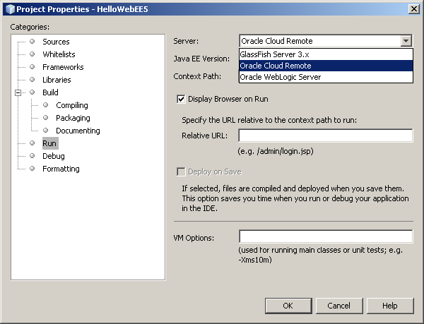
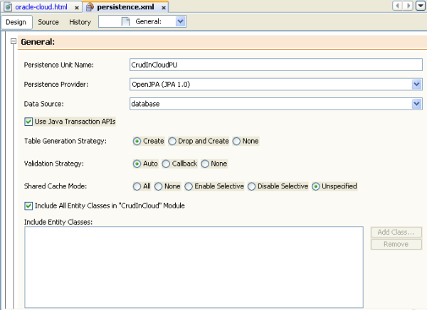
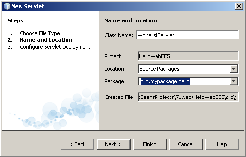
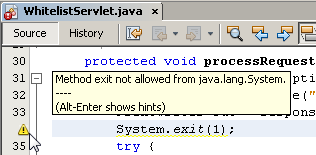
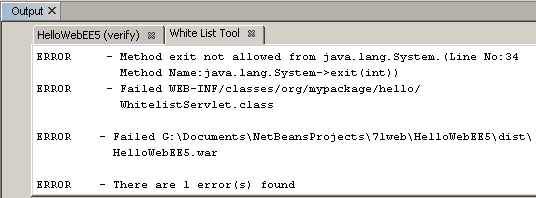
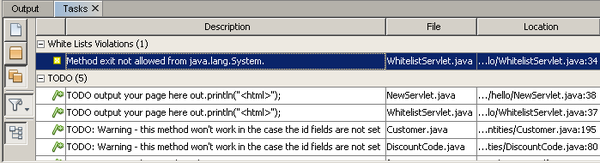

// 
//     Licensed to the Apache Software Foundation (ASF) under one
//     or more contributor license agreements.  See the NOTICE file
//     distributed with this work for additional information
//     regarding copyright ownership.  The ASF licenses this file
//     to you under the Apache License, Version 2.0 (the
//     "License"); you may not use this file except in compliance
//     with the License.  You may obtain a copy of the License at
// 
//       http://www.apache.org/licenses/LICENSE-2.0
// 
//     Unless required by applicable law or agreed to in writing,
//     software distributed under the License is distributed on an
//     "AS IS" BASIS, WITHOUT WARRANTIES OR CONDITIONS OF ANY
//     KIND, either express or implied.  See the License for the
//     specific language governing permissions and limitations
//     under the License.
//

= Running Web Applications on Oracle Cloud
:jbake-type: tutorial
:jbake-tags: tutorials 
:jbake-status: published
:icons: font
:syntax: true
:source-highlighter: pygments
:toc: left
:toc-title:
:description: Running Web Applications on Oracle Cloud - Apache NetBeans
:keywords: Apache NetBeans, Tutorials, Running Web Applications on Oracle Cloud

The Oracle Cloud is an enterprise cloud for business. The Oracle Cloud offers self-service business applications delivered on an integrated development and deployment platform with tools to rapidly extend and create new services. For more information about Oracle Cloud, see the link:https://cloud.oracle.com[+Oracle Cloud homepage+].

This document shows you how to register the Oracle Cloud with NetBeans IDE and some of the Oracle Cloud features that are supported in the IDE. This document discusses some of the advantages and disadvantages of working completely on the Cloud versus working with a local server and then deploying to the Cloud. At the end you create a simple web application, following the instructions in xref:quickstart-webapps.adoc[+Introduction to Web Applications+], and run it on Oracle Cloud.

You might also want to look at the link:https://blogs.oracle.com/javatraining/entry/oracle_cloud_development_with_netbeans[+Oracle Cloud Development with NetBeans and Eclipse (OEPE)+] series of tutorials on the Java Training Beat blog.

image::images/netbeans-stamp-80-74-73.png[title="Content on this page applies to the NetBeans IDE 7.2, 7.3, 7.4 and 8.0"]

*To follow this tutorial, you need the following software and resources.*

|===
|Software or Resource |Version Required 

|xref:../../../download/index.adoc[+NetBeans IDE+] |7.3, 7.4, 8.0, Java EE Version 

|Oracle Cloud plugin |available from NetBeans Update Center via NetBeans Plugins manager 

|link:http://www.oracle.com/technetwork/java/javase/downloads/index.html[+Java Development Kit (JDK)+] |version 7 or version 8 

|Oracle Java Cloud Service |Sign up at the link:http://cloudcentral.c9dev.oraclecorp.com/mycloud/f?p=SERVICE:free_trial:0[+Oracle Cloud Public Availability homepage+] 

|Oracle Java Cloud Service SDK |Download from link:http://cloud.oracle.com[+Oracle Cloud homepage+]. 

|link:http://www.oracle.com/technetwork/middleware/weblogic/overview/index.html[+Oracle WebLogic server+] 
(for developing and testing applications locally)

 |
Version indicated in chapter 4 of the Oracle Java Cloud Service Users Guide
This document is available from the Resources > Documentation tab link:https://cloudeap.oracle.com/mycloud/f?p=service:home:0[+within your activated Java Cloud service+]. 

|link:http://www.oracle.com/technetwork/products/express-edition/downloads/index.html[+OracleXE database server+] 
(for developing and testing applications locally) |11g 
|===

[[sdk-download]]
== Downloading Oracle Java Cloud Service SDK

You need a local copy of the Oracle Java Cloud Service SDK to develop web applications on the Oracle Cloud. You can download the Oracle Java Cloud Service SDK from the link:http://cloud.oracle.com[+Oracle Cloud homepage+].

*To download the Oracle Java Cloud Service SDK:*

1. Point a browser window to the link:http://cloud.oracle.com[+Oracle Cloud homepage+].
2. Expand the *Resources* dropdown list in the main menu and click *Downloads*.
3. Click *Download Oracle Cloud Java Service SDK* in the Oracle Java Cloud Service SDK section.
4. On the Oracle Java Cloud Service SDK download page, read and accept the OTN License Agreement to activate the download link.
5. Download and extract the SDK to your local system.

[[install-plugin]]
== Install Oracle Cloud Plugin

To enable support for the Oracle Java Cloud Service in the IDE you need to install the Oracle Cloud plugin from the NetBeans Update Center. You can use the NetBeans Plugins manager to install the Oracle Cloud plugin.

Perform the following steps to install the Oracle Cloud plugin.

1. Choose Tools > Plugins from the main menu to open the Plugins manager.
2. Select the Available Plugins tab in the Plugins manager.
3. Locate and select the checkbox for the Oracle Cloud plugin. Click Install.

When you click Install the IDE opens the NetBeans IDE Installer. You need to complete the steps in the installer wizard to install the plugin.

After you install the Oracle Cloud plugin the Add Cloud Provider wizard will display Oracle Cloud in the list of supported cloud providers.

== Registering Oracle Cloud In the IDE

You need to register the Oracle Cloud in the IDE's Services window before you can use it. Note that you need a separate installation of the Oracle Java Cloud Service SDK.

*Note.* To work with Oracle Cloud in NetBeans IDE you need to have an account on the Oracle Cloud.

*To register Oracle Cloud in the IDE perform the following steps.*

1. Open the Services window in the IDE (Window > Services or Ctrl-5).
2. Right-click the Cloud node and select Add Cloud to open the Add Cloud Provider wizard.

image::images/add-cloud.png[]

. In the Choose Cloud field, select Oracle Cloud and click Next to open the Oracle Cloud panel. 

image::images/oracle-cloud1.png[]

. Fill in all fields. Browse for the folder containing the Oracle Java Cloud Service SDK JAR. Click Next.

When you click Next the IDE tests the connection to the cloud. A list of Cloud services appears if the connection is successful. Only the Oracle Cloud Remote server (Oracle WebLogic) is currently available.

*Note:* After you register an Oracle Cloud provider, you can change the Cloud details in its Properties. Open Properties by right-clicking the Oracle Cloud node and selecting Properties.

. Confirm that the Oracle Cloud provider is displayed in the list of Cloud resources. Click Finish.

Oracle Cloud is now listed under the Cloud node in the Services window. You can right-click the Oracle Cloud node to open a context menu that provides commands for refreshing the list of services, opening a list of jobs and logs, removing the cloud instance or viewing the cloud's properties.

image::images/cloud-contextmenu.png[]

When you register Oracle Cloud in the IDE an instance of the Oracle Cloud Remote server node also appears under the Servers node. (If it does not appear, right-click the Oracle Cloud node and select Refresh.)

image::images/registered-cloud-and-server.png[]

You can expand the Oracle Cloud Remote node to view a list of the applications that are deployed to the remote server.

== Viewing Jobs and Logs

Every request that NetBeans IDE sends to the Oracle Cloud results in a job. Every job has a status (submitted, running, failed, complete) and may have one or more log files (whitelist check log, antivirus scan log, deployment log). You can view recent jobs and their logs with the View Jobs and Logs action.

Right-click the Oracle Cloud node and select View Jobs and Logs. In the editor window, a list appears of the last 50 jobs and logs. It takes a moment to load. The jobs list does not refresh automatically. Click Refresh to refresh the list.

image::images/jobs-n-logs.png[]

== Oracle Cloud Remote Server

Oracle Cloud Remote server is an instance of Oracle WebLogic running on Oracle Cloud. Expand the Oracle Cloud Remote node and see a list of applications running on that server. You can right-click an application to open a popup menu that contains commands for starting, stopping and undeploying the application. You can click View in the menu to open the application home page in a browser.

image::images/webapp-contextmenu.png[]

To update the list of deployed applications, right-click the Oracle Cloud Remote node and select Refresh.

image::images/server-contextmenu.png[]

 

== Developing Applications on a Local Machine

We recommend developing the application on a local machine and deploying it to the Cloud periodically. While it is possible to develop a web application entirely on the Oracle Cloud, local development is preferrable for the following reasons:

* Local deployment takes seconds on a running server. Deployment to the Cloud can take minutes.
* Incremental deployment is only available locally.
* Debugging is only available locally.

Risks also exist in developing locally and deploying to the Oracle Cloud, however. The application you develop locally may not run on the Oracle Cloud Remote server. For safety, develop locally on an Oracle WebLogic server 11g, which is the same server as Oracle Cloud Remote.

You must manually change the web application's server between your local server and the Oracle Cloud server. There is no automatic way to develop locally and deploy to the Cloud periodically.

*To change a web application's server between local and Oracle Cloud:*

1. In the Projects window, right-click the application's node and select Properties.

image::images/project-contextmenu.png[]

. In the Project Properties, select the Run category.

. From the Server drop-down list, select the server you want (either Oracle Cloud Remote or local Oracle WebLogic). The server must be registered in the IDE. You can add a server by right-clicking the Servers node in the Services window.

== Creating a Web Application

Go to xref:quickstart-webapps.adoc[+Introduction to Developing Web Applications+] and complete that tutorial. Develop the web application on a local Oracle WebLogic server. After the application is complete, change the server to Oracle Cloud Remote and run the application.

*Note.* You need to install Oracle WebLogic Server locally and register the server with the IDE. See xref:../javaee/weblogic-javaee-m1-screencast.adoc[+Video of Deploying a Web Application to Oracle WebLogic Server+] for more information.

Before you deploy the application to the Oracle Cloud Remote server, open the Output window (Window > Output > Output or Ctrl-4). Note the Oracle Cloud Remote Deployment tab in the output window. This tab shows you the progress of the deployment.

image::images/output-cloud-tab.png[]

[[crud]]
== Creating a CRUD Application with JSF

NetBeans IDE and Oracle Cloud can be used in use cases where you have an Oracle database backend that is managed through a web application hosted by Oracle WebLogic server. NetBeans IDE enables you to create entity classes for an existing Oracle database and create JavaServer Faces (JSF) pages for the resulting entity classes. This scenario requires on-premise installations of OracleXE database server and Oracle WebLogic application server.

*Important: *The Oracle Cloud Remote WebLogic server does not support JPA 2.0. If your on-premises WebLogic server is JPA 2.0-enabled, either disable JPA 2.0 or use a JPA 1.0 persistence provider for CRUD applications.

*Note: *This document gives only brief directions for creating entity classes and JSF pages. For a more detailed treatment, see xref:jsf20-crud.adoc[+Generating a JavaServer Faces 2.0 CRUD Application from a Database+].

*To create a CRUD Application with JSF:*

1. Enable the sample HR schema on your OracleXE database server and register the schema in NetBeans IDE. For details, see xref:../ide/oracle-db.adoc[+Connecting to Oracle Database from NetBeans IDE+].

Use the HR username and password when you register the HR schema with NetBeans IDE.

. Create a Java Web Application using Java EE5 and your on-premises installation of WebLogic server. Enable the JSF framework for the application.

image::images/crudapp-eevers.png[]

image::images/crudapp-jsf.png[]

. In the Projects window, right-click the project's root node and select New > Entity Classes from Database. The Entity Classes from Database wizard opens.

. In the Entity Classes from Database wizard, select New Data Source from the Data Source drop-down box. The Create Data Source dialog opens.

image::images/crudapp-newdatasource.png[]

. Name this datasource to match the database service name in your registered Oracle Cloud account.

image::images/cloud-db-name.png[]

. Select the OracleXE HR database connection you created in Step 1. Click OK. The Create Data Source dialog closes.

image::images/create-datasource.png[]

. In the Entity Classes from Database wizard, the Available Tables field fills with the HR schema table names. Select one of the tables, such as EMPLOYEES, and click Add. Click through the rest of the wizard, giving an arbitrary name to the package containing the entity classes and accepting all default values in other fields.

. In the Projects window, right-click the project's root node and select New > JSF Pages from Entity Classes. The New JSF Pages from Entity Classes wizard opens.

. In the Entity Classes panel, click Select All and click Next.

. In the Generate JSF Pages and Classes panel, give appropriate names to the packages and JSF file folder and click Finish.

. In the Projects window, right-click the project's root node and select Run. The IDE builds the project and deploys it to the on-premises WebLogic server. A browser opens on the project's landing page.

You now have a local version of a Java web application using CRUD and JSF. You can test and tweak the application locally. When the application is in a final state, deploy it to Oracle Cloud.

*Deploying the CRUD/JSF Application to Oracle Cloud*

1. In the Projects window, right-click the project's root node and select Properties.
2. Select the Run category in the Properties window. In this category, expand the Server drop-down list and select Oracle Cloud Remote. Click OK.

image::images/crudapp-properties.png[]

. In the Projects window, expand the project's Configuration Files node and double-click ` persistence.xml`. The file opens in the XML Editor's Design view.

. Under Table Generation Strategy, select Create. 

. If your on-premises WebLogic server has JPA 2.0 enabled, you must change the persistence provider from the default EclipseLink, which uses JPA 2.0, to a JPA 1.0 provider such as OpenJPA.

*Note: *If your on-premises WebLogic server is not JPA 2.0-enabled, EclipseLink falls back to JPA 1.0. In this case you do not need to change persistence providers.

. In the Projects window, right-click the project's root node and select Run. The IDE builds the project and deploys it to the Oracle Cloud Remote server. You can follow the progress of deployment in the IDE's Output window, in the Oracle Cloud Remote Deployment tab.

*Caution: *Oracle Cloud does not yet support the uploading of database tables. Therefore no data is available for your application when it is on Oracle Cloud.

== Testing Whitelisting Support

Oracle Cloud does not support some standard Java API methods, such as  ``System.exit()`` . The Oracle Cloud _whitelist_ defines all methods that are allowed. During deployment of an application to Oracle Cloud, the Cloud server tests whitelist compliance. If the whitelist is violated, the Cloud server refuses to deploy the application.

NetBeans IDE helps prevent whitelist-related errors by notifying you of whitelist violations while you code. Code completion is limited by whitelisting, and whitelist violations are highlighted in the code. Run the Verify action on a web application deployed to Oracle Cloud Remote server, and the Output window shows you any whitelisting violations.

*To test whitelisting:*

1. In the Projects window, right-click <<create-webapp,the web application you created>> and select New > Servlet. The New Servlet wizard opens.

. Give the servlet an arbitrary name, select an existing package for it and click Finish. The servlet class opens in the editor.

. Find the servlet's  ``processRequest``  method, type  ``System.ex``  in the method body and press Ctrl-Space to open code completion. Code completion does not offer you the possibility to complete  ``System.exit``  because  ``System.exit``  is disallowed by the Oracle Cloud whitelist. The IDE shows  ``exit``  with a line through it.

image::images/cc-failure.png[]

. Finish typing  ``System.exit(1);`` . A warning appears. Scroll the cursor over the warning icon, and a tooltip appears informing you that  ``java.lang.System.exit``  is not allowed.

. In the Projects window, right-click the application's node and select Verify. Open the Output window (Window > Output > Output or Ctrl-4). The Output window includes a Whitelist tab that shows errors due to whitelist restrictions.

. Open the Action Items window (Window > Action Items or Ctrl-6). Whitelist violations appear as a separate group of action items.

*Tip:* Turn on Group Action Items by Category (bottom button on left) to see whitelist violations more easily.

. Try to deploy the project. A warning dialog appears informing you that whitelist violations were detected and asking if you want to continue with deployment. Click No. The dialog disappears.

. 
In the Projects window, right-click the application's node and select Properties. The application's Project Properties open. Select the Whitelists category. A list of active whitelists appears. In this dialog you can disable the whitelist.

When a web application's server is set to Oracle Cloud Remote, the Oracle Cloud whitelist applies both to that project and any of that project's subprojects. For example, an Enterprise application set to run on Oracle Cloud Remote has the Oracle Cloud whitelist apply to the Enterprise application itself and any EJB modules or web applications that are part of the Enterprise application. Both the project and its subprojects have a Whitelist category in their Project Properties. You can use the Project Properties dialog to set whitelists separately for the project and its individual subprojects.

image::images/whitelist-properties.png[]

xref:../../../community/mailing-lists.adoc[Send Feedback on This Tutorial]

== See Also

For information about Oracle Cloud services, see the following resources:

* link:https://blogs.oracle.com/javatraining/entry/oracle_cloud_development_with_netbeans[+Oracle Cloud Development with NetBeans and Eclipse (OEPE)+] (Java Training Beat blog)
* link:https://cloud.oracle.com/mycloud/f?p=service:home:0[+Oracle Cloud Homepage+]

For related information about developing web applications in NetBeans IDE, see the following resources:

* xref:../java-ee.adoc[Java EE &amp; Java Web Learning Trail]
