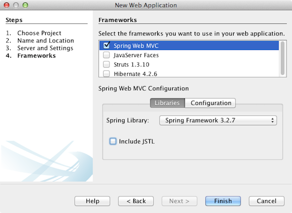
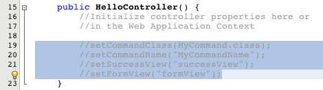
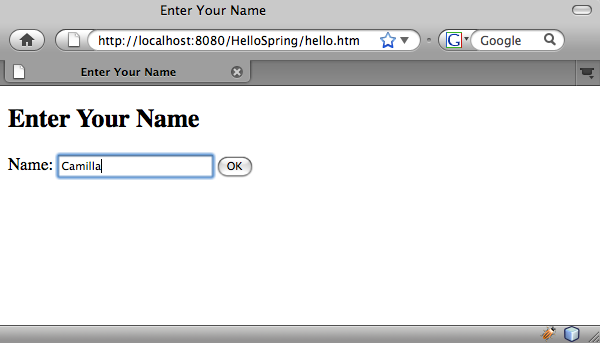
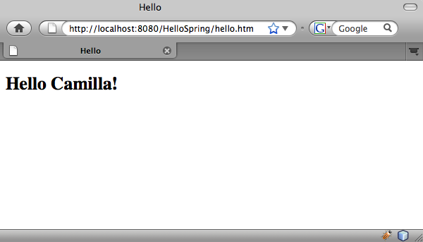

// 
//     Licensed to the Apache Software Foundation (ASF) under one
//     or more contributor license agreements.  See the NOTICE file
//     distributed with this work for additional information
//     regarding copyright ownership.  The ASF licenses this file
//     to you under the Apache License, Version 2.0 (the
//     "License"); you may not use this file except in compliance
//     with the License.  You may obtain a copy of the License at
// 
//       http://www.apache.org/licenses/LICENSE-2.0
// 
//     Unless required by applicable law or agreed to in writing,
//     software distributed under the License is distributed on an
//     "AS IS" BASIS, WITHOUT WARRANTIES OR CONDITIONS OF ANY
//     KIND, either express or implied.  See the License for the
//     specific language governing permissions and limitations
//     under the License.
//

= Introduction to Spring Web MVC
:jbake-type: tutorial
:jbake-tags: tutorials 
:jbake-status: published
:icons: font
:syntax: true
:source-highlighter: pygments
:toc: left
:toc-title:
:description: Introduction to Spring Web MVC - Apache NetBeans
:keywords: Apache NetBeans, Tutorials, Introduction to Spring Web MVC

This document shows you how to construct a simple web link:http://www.oracle.com/technetwork/articles/javase/index-142890.html[+MVC+] application using the link:http://www.springframework.org/[+Spring Framework+]. The application enables a user to enter her name in a text field, and upon clicking OK, the name is returned and displayed on a second page with a welcome greeting.

The Spring Framework is a popular open source application framework that can make Java EE development easier. It consists of a container, a framework for managing components, and a set of snap-in services for web user interfaces, transactions, and persistence. A part of the Spring Framework is Spring Web MVC, an extensible MVC framework for creating web applications.

The IDE provides built-in support for Spring Framework 4.x and 3.x. Framework libraries are packaged with the IDE and are automatically added to the project classpath when the framework is selected. Configuration settings are provided, such as naming and mapping of the Spring Web MVC `DispatcherServlet`. The JSTL library can optionally be registered upon project creation. Support for Spring XML bean configuration files is also provided, including the following functionality:

* *Code completion*. Invoked in Spring XML configuration files for Java classes as well as bean references.
* *Navigation*. Hyperlinking of Java classes and properties mentioned in Spring bean definitions, as well as hyperlinking to other Spring bean references.
* *Refactoring*. Renaming of references to Java classes in Spring XML configuration files.

For more information on the Spring Framework, visit link:http://www.springsource.org/[+http://www.springsource.org/+]. For a more fine-grained explanation of how Spring Framework artifacts behave and interact with other objects in an application, see the official link:http://static.springsource.org/spring/docs/3.1.x/spring-framework-reference/html/[+Spring Framework Reference Documentation+], or consult the link:http://static.springsource.org/spring/docs/3.1.x/javadoc-api/[+Spring Framework API documentation+].

image::images/netbeans-stamp-80-74-73.png[title="Content on this page applies to the NetBeans IDE 7.2, 7.3, 7.4 and 8.0"]

*To complete this tutorial, you need the following software and resources.*

|===
|Software or Resource |Version Required 

|xref:../../../download/index.adoc[+NetBeans IDE+] |7.2, 7.3, 7.4, 8.0, Java EE 

|link:http://www.oracle.com/technetwork/java/javase/downloads/index.html[+Java Development Kit (JDK)+] |version 7 or 8 

|link:http://glassfish.dev.java.net/public/downloadsindex.html[+GlassFish server+] |3.x, 4.x 
|===

*Notes:*

* The Java installation of the IDE enables you to optionally install and register the GlassFish server with the IDE.
* If you need to compare your project with a working solution, you can link:https://netbeans.org/projects/samples/downloads/download/Samples%252FJava%2520Web%252FHelloSpring69.zip[+download the sample application+].

[[setting]]
== Setting up a New Project with Spring Web MVC Support

* <<creating,Creating a Spring Web MVC Skeleton Project>>
* <<running,Running the Skeleton Project>>

[[creating]]
=== Creating a Spring Web MVC Skeleton Project

Start by creating a new project for a web application using the Spring Framework.

1. Choose New Project (Ctrl-Shift-N; ⌘-Shift-N on Mac) from the IDE's File menu. Select the Java Web category, then under Projects select Web Application. Click Next.
2. In Project Name, type in *HelloSpring*. Click Next.
3. In Step 3: Server and Settings, deselect the Enable Contexts and Dependency Injection option, as you are not working with the link:http://jcp.org/en/jsr/detail?id=299[+JSR-299+] specification in this tutorial.
4. Confirm that the GlassFish server is selected in the Server drop-down list. Click Next.

The Java EE version depends upon the version of the server that is selected. The default Java EE version is Java EE 7 Web when the selected server is GlassFish Server 4.0.

. In Step 4, the Frameworks panel, select Spring Web MVC.

. Select *Spring Framework 3.x* in the Spring Library drop-down list. 

Note that the IDE enables you to add the Spring 4.x library to your project, but for this tutorial you will use SimpleFormController that is not supported in Spring 4.x. Also, when you select Spring Web MVC, note that the JSTL (JavaServer Pages Standard Tag Library) library is added to the classpath during project creation by default. Deselect this option (as in the above screenshot), since you do not require JSTL for this tutorial.

. Click the Configuration tab and note that the wizard enables you to specify the name and mapping of the Spring Dispatcher servlet. 

image::images/spring-configuration.png[title="Specify the name and mapping of the Spring Dispatcher servlet under the Configuration tab"]

. Click Finish. The IDE creates a project for the entire application, including all metadata, as well as the project's Ant build script which you can inspect from the Files window (Ctrl-2; ⌘-2 on Mac). You can view the template structure from the Projects window (Ctrl-1; ⌘-1 on Mac). Also note that four files open by default in the IDE's editor: `dispatcher-servlet.xml`, `applicationContext.xml`, `redirect.jsp`, and `index.jsp`.

. In the Projects window, expand the new project's Libraries node and note that the Spring JARs are included in the project's classpath. 

image::images/spring-libraries.png[title="Spring JARs are listed under the project's Libraries node"]

[[running]]
=== Running the Skeleton Project

Before making any changes to project files, try running the new project in the IDE:

1. Click the Run Project (  ) in the IDE's main toolbar. The IDE automatically starts the GlassFish server if it is not already running, compiles the project, then deploys it to the server. Note any output displayed in the IDE's Output window (Ctrl-4; ⌘-4 on Mac). The generated output completes with a `BUILD SUCCESSFUL` message. 

image::images/output.png[title="Output window displays information when running the project"] 

The IDE's default browser starts up, and you see content from the welcome page view (`/WEB-INF/jsp/index.jsp`). 

image::images/browser-output.png[title="Welcome page output is displayed in browser"]

When you run your project in the IDE, the project is compiled and deployed to the server, and then opens in your default browser. Furthermore, the IDE provides a Deploy on Save feature, which is activated by default for web projects. When you save files in the editor, your project is automatically recompiled and deployed to the server. To view changes, you can simply refresh pages in your browser.

In order to understand what just took place, start by examining the project's deployment descriptor (`web.xml`). To open this file in the Source Editor, right-click the `WEB-INF` > `web.xml` node in the Projects window and choose Edit. The default entry point for the application is `redirect.jsp`:

[source,xml]
----

<welcome-file-list>
    <welcome-file>redirect.jsp</welcome-file>
</welcome-file-list>
----

Within `redirect.jsp`, there is a redirect statement that points all requests to `index.htm`:

[source,java]
----

<% response.sendRedirect("index.htm"); %>
----

In the deployment descriptor, note that all requests for URL patterns that match `*.htm` are mapped to Spring's link:http://static.springsource.org/spring/docs/3.1.x/javadoc-api/org/springframework/web/servlet/DispatcherServlet.html[+`DispatcherServlet`+].

[source,xml]
----

<servlet>
    <servlet-name>dispatcher</servlet-name>
    <servlet-class>org.springframework.web.servlet.DispatcherServlet</servlet-class>
    <load-on-startup>2</load-on-startup>
</servlet>

<servlet-mapping>
    <servlet-name>dispatcher</servlet-name>
    <url-pattern>*.htm</url-pattern>
</servlet-mapping>
----

The fully qualified name of the dispatcher servlet, as shown above, is `org.springframework.web.servlet.DispatcherServlet`. This class is contained in the Spring library, which was added to the project classpath when the project was created. You can verify this in the Projects window by drilling down from the Libraries node. Locate the `spring-webmvc-3.1.1.RELEASE.jar`, then expand it to find `org.springframework.web.servlet` > `DispatcherServlet`.

The `DispatcherServlet` handles incoming requests based on configuration settings found in `dispatcher-servlet.xml`. Open `dispatcher-servlet.xml` by clicking on its tab in the editor. Note the following code.

[source,xml]
----

<bean id="urlMapping" class="org.springframework.web.servlet.handler.link:http://static.springsource.org/spring/docs/3.1.x/javadoc-api/org/springframework/web/servlet/handler/SimpleUrlHandlerMapping.html[+SimpleUrlHandlerMapping+]">
    <property name="mappings">
        <props>
            <prop key="/index.htm">indexController</prop>
        </props>
    </property>
</bean>

<bean id="viewResolver"
      class="org.springframework.web.servlet.view.link:http://static.springsource.org/spring/docs/3.1.x/javadoc-api/org/springframework/web/servlet/view/InternalResourceViewResolver.html[+InternalResourceViewResolver+]"
      p:prefix="/WEB-INF/jsp/"
      p:suffix=".jsp" />

<bean name="indexController"
      class="org.springframework.web.servlet.mvc.link:http://static.springsource.org/spring/docs/3.1.x/javadoc-api/org/springframework/web/servlet/mvc/ParameterizableViewController.html[+ParameterizableViewController+]"
      p:viewName="index" />
----

Three beans are defined in this file: `indexController`, `viewResolver`, and `urlMapping`. When the `DispatcherServlet` receives a request that matches `*.htm` such as `index.htm`, it looks for a controller within `urlMapping` that can accommodate the request. Above, you see that there is a `mappings` property that links `/index.htm` to `indexController`.

The runtime environment then searches for the definition of a bean named `indexController`, which is conveniently provided by the skeleton project. Note that `indexController` extends link:http://static.springsource.org/spring/docs/3.1.x/javadoc-api/org/springframework/web/servlet/mvc/ParameterizableViewController.html[+`ParameterizableViewController`+]. This is another class provided by Spring, which simply returns a view. Above, note that `p:viewName="index"` specifies the logical view name, which is resolved using the `viewResolver` by prepending `/WEB-INF/jsp/` and appending `.jsp` to it. This allows the runtime to locate the file within the application directory, and respond with the welcome page view (`/WEB-INF/jsp/index.jsp`).

[[overview]]
== Overview of the Application

The application you create is comprised of two JSP pages (which can be referred to as _views_ in link:http://www.oracle.com/technetwork/articles/javase/index-142890.html[+MVC+] terminology). The first view contains an HTML form with an input field asking for the user's name. The second view is a page that simply displays a hello message containing the user's name.

The views are managed by a _controller_, which receives requests to the application and decides which views to return. It also passes to the views any information that they need to display (this is called a _model_). This application's controller is named `HelloController`.

In a complex web application, the business logic is not contained directly in the controller. Instead, another entity, named a _service_, is used by the controller whenever it needs to perform some business logic. In our application, the business logic is limited to the act of processing the hello message, and for this purpose you create a `HelloService`. 

== Implementing a Service

Now that you are sure your environment is set up properly, you can begin extending the skeleton project according to your needs. Start by creating the `HelloService` class.

1. Click the New File ( image:images/new-file-btn.png[] ) button in the IDE's toolbar. (Alternatively, press Ctrl-N; ⌘-N on Mac.)
2. Select the *Java* category, then select *Java Class* and click Next.
3. In the New Java Class wizard that displays, type in *HelloService* for Class Name, and enter *service* for Package Name to create a new package for the class.
4. Click Finish. The IDE creates the new class and opens it in the editor.

The `HelloService` class performs a very simple service. It takes a name as a parameter, and prepares and returns a `String` that includes the name. In the editor, create the following `sayHello()` method for the class (changes in *bold*).

[source,java]
----

public class HelloService {

    *public static String sayHello(String name) {
        return "Hello " + name + "!";
    }*
}
----

[[controller]]
== Implementing the Controller and Model

You can use a link:http://static.springsource.org/spring/docs/3.1.x/javadoc-api/org/springframework/web/servlet/mvc/SimpleFormController.html[+`SimpleFormController`+] to handle user data and determine which view to return.

*Note: *SimpleFormController is deprecated in Spring 3.x. It is used in this tutorial for demonstration purposes. However, annotated controllers should be used instead of XML files.

1. Open the New File wizard by pressing Ctrl-N (⌘-N on Mac). Under Categories select *Spring Framework*; under File Types select *Simple Form Controller*. 

image::images/simple-form-controller.png[title="NetBeans IDE provides templates for various Spring artifacts"] 

[tips]#NetBeans IDE provides templates for various Spring artifacts, including the Spring XML Configuration File, the link:http://static.springsource.org/spring/docs/3.1.x/javadoc-api/org/springframework/web/servlet/mvc/AbstractController.html[+`AbstractController`+], and the link:http://static.springsource.org/spring/docs/3.1.x/javadoc-api/org/springframework/web/servlet/mvc/SimpleFormController.html[+`SimpleFormController`+].#

. Click Next.

. Name the class *HelloController* and create a new package for it by typing *controller* in the Package text field. Click Finish. The IDE creates the new class and opens it in the editor.

. Specify controller properties by uncommenting the setter methods that display by default in the class template. To uncomment the code snippet, highlight the code as in the image below, then press Ctrl-/ (⌘-/ on Mac). 

 

[tips]#Pressing Ctrl-/ (⌘-/ on Mac) toggles comments in the editor.#

. Make changes as follows (shown in *bold*).

[source,java]
----

public HelloController() {
    link:http://static.springsource.org/spring/docs/3.1.x/javadoc-api/org/springframework/web/servlet/mvc/BaseCommandController.html#setCommandClass(java.lang.Class)[+setCommandClass+](*Name*.class);
    link:http://static.springsource.org/spring/docs/3.1.x/javadoc-api/org/springframework/web/servlet/mvc/BaseCommandController.html#setCommandName(java.lang.String)[+setCommandName+]("*name*");
    link:http://static.springsource.org/spring/docs/3.1.x/javadoc-api/org/springframework/web/servlet/mvc/SimpleFormController.html#setSuccessView(java.lang.String)[+setSuccessView+]("*hello*View");
    link:http://static.springsource.org/spring/docs/3.1.x/javadoc-api/org/springframework/web/servlet/mvc/SimpleFormController.html#setFormView(java.lang.String)[+setFormView+]("*name*View");
}
----

Setting the `FormView` enables you to set the name of the view that is used to display the form. This is the page that contains the text field allowing users to enter their name. Setting the `SuccessView` likewise lets you set the name of the view that should display upon a successful submit. When you set the `CommandName` you define the name of the command in the model. In this case, the command is the form object with request parameters bound onto it. Setting the `CommandClass` allows you set the name of the command class. An instance of this class gets populated and validated upon each request.

Note that an error is flagged for `Name` in the `setCommandClass()` method:

image::images/set-command-class.png[title="An error badge displays for setCommandClass()"]

You now need to create the `Name` class as a simple bean to hold information for each request.

. In the Projects window, right-click on the project node and choose New > Java Class. The New Java Class wizard displays.

. Enter *Name* for the Class Name, and for Package select *controller* from the drop-down list.

. Click Finish. The `Name` class is created and opens in the editor.

. For the `Name` class, create a field named `value`, then create accessor methods (i.e., getter and setter methods) for this field. Start by declaring the `value` field:

[source,java]
----

public class Name {

    *private String value;*

}
----

To quickly type out '`private`' you can type '`pr`' then press Tab. The '`private`' access modifier is automatically added to the line. This is an example of using the editor's code templates. For a full list of code templates, choose Help > Keyboard Shortcuts Card.

 The IDE can create accessor methods for you. In the editor, right-click on `value` and choose Insert Code (or press Alt-Insert; Ctrl-I on Mac). In the popup menu, choose Getter and Setter. 

image::images/generate-code.png[title="The Generate Code popup menu enables you to set accessor methods"]

. In the dialog that displays, select the `value : String` option, then click OK. The `getValue()` and `setValue()` methods are added to the `Name` class:

[source,java]
----

public String getValue() {
    return value;
}

public void setValue(String value) {
    this.value = value;
}
----

. Press Ctrl-Tab and choose `HelloController` to switch back to the `HelloController` class. Note that the previous error badge has disappeared since the `Name` class now exists.

. Delete the `doSubmitAction()` method and uncomment the link:http://static.springsource.org/spring/docs/3.1.x/javadoc-api/org/springframework/web/servlet/mvc/SimpleFormController.html#setFormView(java.lang.String)[+`onSubmit()`+] method. The `onSubmit()` method enables you to create your own `ModelAndView`, which is what is required here. Make the following changes:

[source,java]
----

@Override
protected ModelAndView onSubmit(
            HttpServletRequest request,
            HttpServletResponse response,
            Object command,
            BindException errors) throws Exception {

        Name name = (Name) command;
        ModelAndView mv = new ModelAndView(getSuccessView());
        mv.addObject("helloMessage", helloService.sayHello(name.getValue()));
        return mv;
}
----
As indicated above, the `command` is recast as a `Name` object. An instance of `ModelAndView` is created, and the success view is obtained using a getter in `SimpleFormController`. Finally, the model is populated with data. The only item in our model is the hello message obtained from the `HelloService` created earlier. You use the `addObject()` method to add the hello message to the model under the name `helloMessage`.

. Fix import errors by right-clicking in the editor and choosing Fix Imports (Ctrl-Shift-I; ⌘-Shift-I on Mac). 

image::images/fix-imports70.png[title="Press Ctrl-Shift-I to fix imports in your file"]

*Note.* Confirm that * ``org.springframework.validation.BindException`` * and * ``org.springframework.web.servlet.ModelAndView`` * are selected in the Fix All Imports dialog box.

. Click OK. The following import statement is added to the top of the file:

[source,java]
----

import link:http://static.springsource.org/spring/docs/3.1.x/javadoc-api/org/springframework/web/servlet/ModelAndView.html[+org.springframework.web.servlet.ModelAndView+];
----
As stated in the API documentation, this class "represents a model and view returned by a handler, to be resolved by a `DispatcherServlet`. The view can take the form of a `String` view name which will need to be resolved by a `ViewResolver` object; alternatively a `View` object can be specified directly. The model is a `Map`, allowing the use of multiple objects keyed by name." 

Note that at this stage, not all errors are fixed because the class still cannot identify the `HelloService` class, nor make use of its `sayHello()` method.

. Within `HelloController`, declare a private field named `HelloService`:

[source,java]
----

private HelloService helloService;
----
Then create a public setter method for the field:

[source,java]
----

public void setHelloService(HelloService helloService) {
    this.helloService = helloService;
}
----
Finally, right-click in the editor and choose Fix Imports (Ctrl-Shift-I; ⌘-Shift-I on Mac). The following statement is added to the top of the file:

[source,java]
----

import service.HelloService;
----
All errors should now be fixed.

. Register `HelloService` in `applicationContext.xml`. Open `applicationContext.xml` in the editor and enter the following bean declaration:

[source,java]
----

<bean name="helloService" class="service.HelloService" />
----
Spring support in the IDE includes code completion within XML configuration files for Java classes as well as bean references. To invoke code completion, press Ctrl-Space when working in the editor: 

image::images/code-completion.png[title="Code completion invoked when pressing Ctrl-Space"]

. Register `HelloController` in `dispatcher-servlet.xml`. Open `dispatcher-servlet.xml` in the editor and enter the following bean declaration:

[source,java]
----

<bean class="controller.HelloController" p:helloService-ref="helloService"/>
----

[[view]]
== Implementing the Views

To implement the view for this project, you need to create two JSP pages. The first, which you will call `nameView.jsp`, serves as the welcome page and allows users to input a name. The other page, `helloView.jsp`, displays a greeting message that includes the input name. Begin by creating `helloView.jsp`.

1. In the Projects window, right-click the WEB-INF > `jsp` node and choose New > JSP. The New JSP File wizard opens. Name the file *helloView*.
2. Click Finish. The new JSP page is created in the `jsp` folder and opens in the editor.
3. In the editor, change the file's title to `Hello`, and change the output message to retrieve the `helloMessage` of the `ModelandView` object that is created in `HelloController`.

[source,xml]
----

<head>
    <meta http-equiv="Content-Type" content="text/html; charset=UTF-8">
    <title>*Hello*</title>
</head>
<body>
    <h1>*${helloMessage}*</h1>
</body>

----

. Create another JSP page in the same manner <<create-jsp,as above>>, but name it `nameView`.

. In the editor, add the following Spring tag library declaration to `nameView.jsp`.

[source,java]
----

<%@taglib uri="http://www.springframework.org/tags" prefix="spring" %>
----
This imports the link:http://static.springframework.org/spring/docs/2.5.x/reference/spring.tld.html[+Spring tag library+], which contains tags useful when implementing views as JSP pages.

. Change the contents of the `<title>` and `<h1>` tags to read: `Enter Your Name`.

. Enter the following code beneath the `<h1>` tags:

[source,xml]
----

<spring:nestedPath path="name">
    <form action="" method="post">
        Name:
        <spring:bind path="value">
            <input type="text" name="${status.expression}" value="${status.value}">
        </spring:bind>
        <input type="submit" value="OK">
    </form>
</spring:nestedPath>

----
link:http://static.springframework.org/spring/docs/2.5.x/reference/spring.tld.html#spring.tld.bind[+spring:bind+] allows you to bind a bean property. The bind tag provides a bind status and value, which you use as the name and value of the input field. This way, when the form is submitted, Spring will know how to extract the submitted value. Here, our command class (`controller.Name`) has a `value` property, therefore you set the `path` to `value`. 

link:http://static.springframework.org/spring/docs/2.5.x/reference/spring.tld.html#spring.tld.nestedPath[+spring:nestedPath+] enables you to prepend a specified path to a bean. So, when used with `spring:bind` as shown above, the path to the bean becomes: `name.value`. As you recall, the command name of `HelloController` is `name`. Therefore, this path refers to the `value` property of a bean named `name` in the page scope.

. Change the relative entry point for the application. Currently, the project entry point is still `index.htm` which, as described in <<running,Running the Skeleton Project>> above, redirects to `WEB-INF/jsp/index.jsp`. You can specify an entry point for the project when it is deployed and run. In the Projects window, right-click the project node and choose Properties. The Project Properties dialog displays. Under Categories select Run. In the Relative URL field, type in `/hello.htm`, then click OK. 

At this moment you may wonder where the mapping of `hello.htm` to `HelloController` is located. You have not added a mapping to the `urlMapping` bean, as is the case for `index.htm`, the skeleton project's welcome page. This is possible with a bit of Spring magic provided by the following bean definition in `dispatcher-servlet.xml`:

[source,java]
----

<bean class="org.springframework.web.servlet.mvc.support.ControllerClassNameHandlerMapping"/>
----
This bean is responsible for automatically creating an URL mapping for all controllers registered in the file. It takes the fully-qualified class name of the controller (in our case, `controller.HelloController`) and strips the package name and `Controller` suffix, then uses the result as a URL mapping. Therefore, for `HelloController` it creates a `hello.htm` mapping. This magic however does not work for controllers that are included in the Spring Framework, such as `ParameterizableViewController`. They require an explicit mapping.

. In the Projects window right-click the project node and choose Run. This compiles, deploys and runs the project. Your default browser opens, displaying `hello.htm` as the project's `nameView`: 

 

Enter your name in the text field and click enter. The `helloView` displays with a greeting message: 

xref:../../../community/mailing-lists.adoc[Send Feedback on This Tutorial]

[[seeAlso]]
== See Also

This concludes the Introduction to the Spring Framework in NetBeans IDE. This document demonstrated how to construct a simple web MVC application in the NetBeans IDE using the Spring Framework, and introduced you to the IDE's interface for developing web applications.

You are encouraged to continue learning about the Spring Framework by working through other tutorials in NetBeans IDE, such as link:http://sites.google.com/site/springmvcnetbeans/step-by-step/[+Developing a Spring Framework MVC Application Step-by-Step using NetBeans and the GlassFish server+]. This is the official link:http://static.springframework.org/docs/Spring-MVC-step-by-step/[+Spring Framework tutorial+] by Thomas Risberg which has been adapted for NetBeans IDE by Arulazi Dhesiaseelan.

Many of the Spring NetBeans Module capabilities can also be applied to non-web based Spring framework applications.

For other related tutorials, see the following resources:

* xref:framework-adding-support.adoc[Adding Support for a Web Framework]. A basic guide describing how to add support by installing a web framework plugin using the NetBeans Update Center.
* xref:jsf20-intro.adoc[Introduction to JavaServer Faces 2.0]. Demonstrates how to add JSF 2.0 support to an existing project, wire managed beans, and take advantage of Facelets templating.
