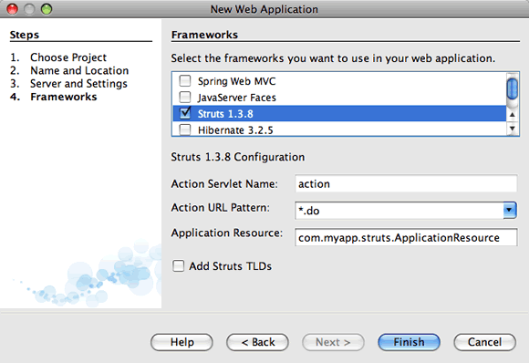
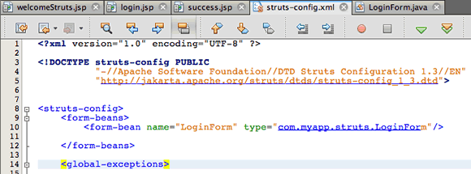
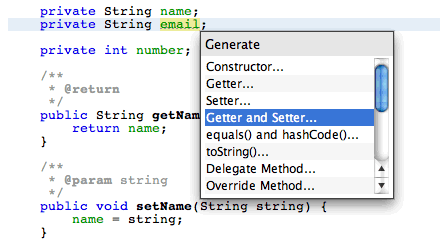
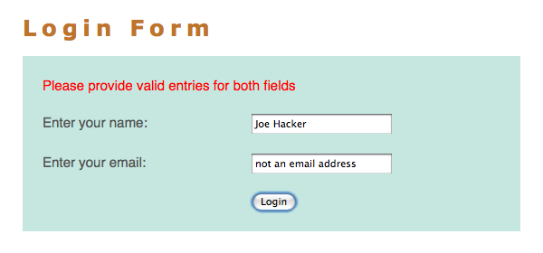

// 
//     Licensed to the Apache Software Foundation (ASF) under one
//     or more contributor license agreements.  See the NOTICE file
//     distributed with this work for additional information
//     regarding copyright ownership.  The ASF licenses this file
//     to you under the Apache License, Version 2.0 (the
//     "License"); you may not use this file except in compliance
//     with the License.  You may obtain a copy of the License at
// 
//       http://www.apache.org/licenses/LICENSE-2.0
// 
//     Unless required by applicable law or agreed to in writing,
//     software distributed under the License is distributed on an
//     "AS IS" BASIS, WITHOUT WARRANTIES OR CONDITIONS OF ANY
//     KIND, either express or implied.  See the License for the
//     specific language governing permissions and limitations
//     under the License.
//

= Introduction to the Struts Web Framework
:jbake-type: tutorial
:jbake-tags: tutorials 
:jbake-status: published
:icons: font
:syntax: true
:source-highlighter: pygments
:toc: left
:toc-title:
:description: Introduction to the Struts Web Framework - Apache NetBeans
:keywords: Apache NetBeans, Tutorials, Introduction to the Struts Web Framework

This document takes you through the basics of using NetBeans IDE to develop web applications using the Struts web framework. Struts is an open source framework that extends the Java Servlet API and employs a Model, View, Controller (MVC) architecture. It enables you to create maintainable, extensible, and flexible web applications based on standard technologies, such as JSP pages, JavaBeans, resource bundles, and XML.

This tutorial teaches you how to build a simple MVC application that displays a login page and returns a success page upon submitting data that passes validation. You learn several basic features provided by Struts, as well as how these features are implemented using the IDE. Specifically, you use Struts tags in JSP pages, maintain user data with a Struts `ActionForm` bean, and implement forwarding logic using a Struts `Action` object. You are also shown how to implement simple validation to your application, including setting up warning message for a failed login attempt.

For a more fine-grained introduction to Struts, see link:http://struts.apache.org/struts-action/faqs/works.html[+How does Struts work?+] on the official link:http://struts.apache.org/[+Struts+] website. Also, make use of the IDE's Javadoc Index Search (Help > Javadoc Index Search) to view the link:http://struts.apache.org/release/1.3.x/apidocs/index.html[+Struts Framework API+], which is packaged with the Struts libraries.

image::images/netbeans-stamp-80-74-73.png[title="Content on this page applies to the NetBeans IDE 7.2, 7.3, 7.4 and 8.0"]

*To complete this tutorial, you need the following software and resources.*

|===
|Software or Resource |Version Required 

|xref:../../../download/index.adoc[+NetBeans IDE+] |7.2, 7.3, 7.4, 8.0, Java EE 

|link:http://www.oracle.com/technetwork/java/javase/downloads/index.html[+Java Development Kit (JDK)+] |7 or 8 

|GlassFish server 
_or_ 
Tomcat servlet container |Open Source Edition 3.x or 4.0 
_ _ 
version 7.x or 8.x 
|===

*Notes:*

* The Java installation enables you to optionally install the GlassFish server and the Apache Tomcat servlet container. You must install one of these (or register a different server in the IDE) to work through this tutorial.
* If you need to compare your project with a working solution, you can link:https://netbeans.org/projects/samples/downloads/download/Samples%252FJava%2520Web%252FMyStrutsApp.zip[+download the sample application+].

== Overview of the Application

When you use Struts, the framework provides you with a controller servlet, `ActionServlet`, which is defined in the Struts libraries that are included in the IDE, and which is automatically registered in the `web.xml` deployment descriptor as <<controllerServlet,shown below>>. The controller servlet uses a `struts-config.xml` file to map incoming requests to Struts `Action` objects, and instantiate any `ActionForm` objects associated with the action to temporarily store form data. The `Action` object processes requests using its `execute` method, while making use of any data stored in the form bean. Once the `Action` object processes a request, it stores any new data (i.e., in the form bean, or in a separate result bean), and forwards the results to the appropriate view.

image::images/workflow.png[title="Struts workflow"]

Developing a Struts application is similar to developing any other kind of web application in NetBeans IDE. However, you complement your web development toolkit by taking advantage of the Struts support provided by the IDE. For example, you use templates in the IDE to create Struts `Action` objects and `ActionForm` beans. Upon creation, the IDE automatically registers these classes in the `struts-config.xml` file and lets you extend this file very easily using menu items in the Source Editor's right-click menu. Because many web applications use JSP pages for the view, Struts also provides custom tag libraries which facilitate interaction with HTML forms. Within the IDE's Source Editor, you can invoke code completion and Javadoc support that helps you to work efficiently with these libraries.

The following steps demonstrate how to create a simple form that collects user data, performs simple validation, and outputs the data on a success page.

== Setting Up a Struts Application

In the IDE, a Struts application is nothing more than a normal web application accompanied by the Struts libraries and configuration files. You create a Struts application in the same way as you create any other web application in the IDE - using the New Web Application wizard, with the additional step of indicating that you want the Struts libraries and configuration files to be included in your application.

1. Choose File > New Project (Ctrl-Shift-N; ⌘-Shift-N on Mac) from the main menu. Select Java Web in the list of Categories and then select Web Application in the list of Projects. Click Next.
2. In the Name and Location panel, enter `MyStrutsApp` for Project Name and click Next.
3. In the Server and Settings panel, select the server to which you want to deploy your application. Only servers that are registered with the IDE are listed. (To register a server, click Add next to the Server drop-down list.) Also, note that the Context Path to your deployed application becomes `/MyStrutsApp`. Click Next.
4. Select Struts in the Frameworks panel. 

For purposes of this tutorial, do not change any of the configuration values in the lower region of this panel. The wizard displays the following configuration options.

* *Action Servlet Name*: The name of the Struts action servlet used in the application. The `web.xml` deployment descriptor contains an entry for the action servlet and specifies the appropriate Struts-specific parameters, such as the path to the servlet class within the Struts library and to the `struts-config.xml` configuration file within the application.
* *Action URL Pattern*: Specifies the patterns of incoming requests which are mapped to the Struts action controller. This generates a mapping entry in the deployment descriptor. By default, only the `*.do` pattern is mapped.
* *Application Resource*: Lets you specify the resource bundle which will be used in the `struts-config.xml` file for localizing messages. By default, this is `com.myapp.struts.ApplicationResource`.
* *Add Struts TLDs*: Lets you generate tag library descriptors for the Struts tag libraries. A tag library descriptor is an XML document which contains additional information about the entire tag library as well as each individual tag. In general this is not necessary, because you can refer to on-line URIs rather than local TLD files.

. Click Finish. The IDE creates the project folder in your file system. As with any web application in the IDE, the project folder contains all of your sources and the IDE's project metadata, such as the Ant build script. However, your web application in addition has all of the Struts libraries on its classpath. Not only are they on the application's classpath, but they are included in the project and will be packaged with it later when you build the project.

The project opens in the IDE. The Projects window is the main entry point to your project sources. It shows a logical view of important project contents. For example, if you expand several nodes within the new project, it may appear as follows:

image::images/proj-window-init.png[title="Projects window displays MyStrutsApp project"]

*Note: *Use the Files window (Window > Files) to see all of your project contents in a directory-based view.

The Struts-specific configuration files, as well as the application's deployment descriptor, are conveniently placed within the Configuration Files folder. Open the deployment descriptor (double-click the `web.xml` file node to have it display in the Source Editor). In order to handle Struts processing, a mapping is provided for the Struts controller servlet.

[source,xml]
----

<servlet>
    <servlet-name>action</servlet-name>
    <servlet-class>org.apache.struts.action.ActionServlet</servlet-class>
    <init-param>
        <param-name>config</param-name>
        <param-value>/WEB-INF/struts-config.xml</param-value>
    </init-param>
    <init-param>
        <param-name>debug</param-name>
        <param-value>2</param-value>
    </init-param>
    <init-param>
       <param-name>detail</param-name>
       <param-value>2</param-value>
    </init-param>
    <load-on-startup>2</load-on-startup>
</servlet>
<servlet-mapping>
    <servlet-name>action</servlet-name>
    <url-pattern>*.do</url-pattern>
</servlet-mapping>
----

Above, the Struts controller servlet is named `action` and is defined in the Struts library (`org.apache.struts.action.ActionServlet`). It is set to handle all requests that satisfy the `*.do` mapping. In addition, initialization parameters for the servlet are specified by means of the `struts-config.xml` file, also contained in the `WEB-INF` folder.

== Creating JSP Pages

Begin by creating two JSP pages for the application. The first displays a form. The second is the view returned when login is successful.

* <<login,Creating a Login Page>>
* <<success,Creating a Success Page>>

=== Creating a Login Page

1. Right-click the `MyStrutsApp` project node, choose New > JSP, and name the new file `login`. Click Finish. The `login.jsp` file opens in the Source Editor.
2. In the Source Editor, change the content of both the `<title>` and `<h1>` tags (or `<h2>` tags, depending on the IDE version you are using) to `Login Form`.
3. Add the following two taglib directives to the top of the file:

[source,java]
----

<%@ taglib uri="http://struts.apache.org/tags-bean" prefix="bean" %>
<%@ taglib uri="http://struts.apache.org/tags-html" prefix="html" %>
----

Many web applications use JSP pages for views in the MVC paradigm, so Struts provides custom tag libraries which facilitate interaction with HTML forms. These can be easily applied to a JSP file using the IDE's support for code completion. When you type in the Source Editor, the IDE provides you with code completion for Struts tags, as well as the Struts Javadoc. You can also invoke code completion manually by pressing Ctrl-Space:

image::images/code-completion.png[title="Code completion and Javadoc are supplied for Struts tags"]

The link:http://struts.apache.org/release/1.3.x/struts-taglib/dev_bean.html[+bean taglib+] provides you with numerous tags that are helpful when associating a form bean (i.e., an `ActionForm` bean) with the data collected from the form. The link:http://struts.apache.org/release/1.3.x/struts-taglib/dev_html.html[+html taglib+] offers an interface between the view and other components necessary to a web application. For example, below you replace common html `form` tags with Struts' `<html:form>` tags. One benefit this provides is that it causes the server to locate or create a bean object that corresponds to the value provided for `html:form`'s `action` element.

. Below the `<h1>` (or `<h2>`) tags, add the following:

[source,xml]
----

<html:form action="/login">

   <html:submit value="Login" />

</html:form>
----

Whenever you finish typing in the Source Editor, you can tidy up the code by right-clicking and choosing Format (Alt-Shift-F).

. In the Palette (Window > Palette) in the right region of the IDE, drag a Table item from the HTML category to a point just above the `<html:submit value="Login" />` line. The Insert Table dialog box displays. Set the rows to `3`, columns to `2`, and leave all other settings at `0`. Later in the tutorial, you will <<style,attach a stylesheet>> to affect the table display. 

image::images/insert-table.png[title="The Palette provides dialogs for easy-to-use code templates"] 

Click OK, then optionally reformat the code (Alt-Shift-F). The form in `login.jsp` now looks as follows:

[source,xml]
----

<html:form action="/login">
    <table border="0">
        <thead>
            <tr>
                <th></th>
                <th></th>
            </tr>
        </thead>
        <tbody>
            <tr>
                <td></td>
                <td></td>
            </tr>
            <tr>
                <td></td>
                <td></td>
            </tr>
            <tr>
                <td></td>
                <td></td>
            </tr>
        </tbody>
    </table>

    <html:submit value="Login" />

</html:form>
----

*Note: *You can safely delete the `<thead>` table row, as it is not used in this tutorial.

. In the first table row, enter the following (changes in *bold*):

[source,xml]
----

<tr>
    <td>*Enter your name:*</td>
    <td>*<html:text property="name" />*</td>
</tr>
----

. In the second table row, enter the following (changes in *bold*):

[source,xml]
----

<tr>
    <td>*Enter your email:*</td>
    <td>*<html:text property="email" />*</td>
</tr>
----
The `html:text` element enables you to match the input fields from the form with properties in the form bean that will be created in the next step. So for example, the value of `property` must match a field declared in the form bean associated with this form.

. Move the <html:submit value="Login" /> element into the second column of the third table row, so that the third table row appears as follows (changes in *bold*):

[source,xml]
----

<tr>
    <td></td>
    <td>*<html:submit value="Login" />*</td>
</tr>
----

At this stage, your login form should look as follows:

[source,xml]
----

<html:form action="/login">
    <table border="0">
        <tbody>
            <tr>
                <td>Enter your name:</td>
                <td><html:text property="name" /></td>
            </tr>
            <tr>
                <td>Enter your email:</td>
                <td><html:text property="email" /></td>
            </tr>
            <tr>
                <td></td>
                <td><html:submit value="Login" /></td>
            </tr>
        </tbody>
    </table>
</html:form>
----

=== Creating a Success Page

1. Right-click the `MyStrutsApp` project node, choose New > JSP, and name the new file `success`. In the Folder field, click the adjacent Browse button and select `WEB-INF` from the dialog that displays. Click Select Folder to enter WEB-INF in the Folder field. Any files contained in the WEB-INF folder are not directly accessible to client requests. In order for `success.jsp` to be properly displayed, it must contain processed data. Click Finish.
2. In the Source Editor, change the content of the newly created page to the following:

[source,html]
----

<head>
    <meta http-equiv="Content-Type" content="text/html; charset=UTF-8">
    <title>Login Success</title>
</head>
<body>
    <h1>Congratulations!</h1>

    
You have successfully logged in.

    
Your name is: .

    
Your email address is: .

</body>
----

. Add a link:http://struts.apache.org/release/1.3.x/struts-taglib/dev_bean.html[+bean taglib+] directive to the top of the file:

[source,java]
----

<%@ taglib uri="http://struts.apache.org/tags-bean" prefix="bean" %>

----

. Add the following `<bean:write>` tags (changes in *bold*):

[source,html]
----

Your name is: *<bean:write name="LoginForm" property="name" />*.

Your email address is: *<bean:write name="LoginForm" property="email" />*.

----
By employing the `<bean:write>` tags, you make use of the bean taglib to locate the `ActionForm` bean you are about to create, and display the user data saved for `name` and `email`.

== Creating an `ActionForm` Bean

A Struts `ActionForm` bean is used to persist data between requests. For example, if a user submits a form, the data is temporarily stored in the form bean so that it can either be redisplayed in the form page (if the data is in an invalid format or if login fails) or displayed in a login success page (if data passes validation).

1. Right-click the `MyStrutsApp` project node and choose New > Other. Under Categories choose Struts, then under File Types choose Struts ActionForm Bean. Click Next.
2. Type in `LoginForm` for the Class Name. Then select `com.myapp.struts` in the Package drop-down list and click Finish.

The IDE creates the `LoginForm` bean and opens it in the Source Editor. By default, the IDE provides it with a `String` called `name` and an `int` called `number`. Both fields have accessor methods defined for them. Also, the IDE adds a bean declaration to the `struts-config.xml` file. If you open the `struts-config.xml` file in the Source Editor, you can see the following declaration, which was added by the wizard:

[source,xml]
----

<form-beans>
    *<form-bean name="LoginForm" type="com.myapp.struts.LoginForm" />*
</form-beans>

----

The IDE provides navigation support in the `struts-config.xml` file. Hold down the Ctrl key and hover your mouse over the `LoginForm` bean's fully qualified class name. The name becomes a link, enabling you to navigate directly to the class in the Source Editor:

. In the `LoginForm` bean in the Source Editor, create fields and accompanying accessor methods that correspond to the `name` and `email` text input fields that you created in `login.jsp`. Because `name` has already been created in the `LoginForm` skeleton, you only need to implement `email`.

Add the following declaration beneath `name` (changes in *bold*):

[source,java]
----

private String name;
*private String email;*
----

To create accessor methods, place your cursor on `email` and press Alt-Insert.

Select Getter and Setter, then in the dialog that displays, select `email : String` and click Generate. Accessor methods are generated for the `email` field.

*Note: *You can delete the declaration and accessor methods for `number`, as it is not used in this tutorial.

== Creating an `Action` Class

The `Action` class contains the business logic in the application. When form data is received, it is the `execute` method of an `Action` object that processes the data and determines which view to forward the processed data to. Because the `Action` class is integral to the Struts framework, NetBeans IDE provides you with a wizard.

1. In the Projects window, right-click the `MyStrutsApp` project node and choose New > Other. From the Struts category choose Struts Action and click Next.
2. In the Name and Location panel, change the name to `LoginAction`.
3. Select `com.myapp.struts` in the Package drop-down list.
4. Type `/login` in Action Path. This value must match the value you set for the `action` attribute of the `<html:form>` tags in `login.jsp`. Make sure settings appear as in the screenshot below, then click Next. 

image::images/new-struts-action.png[title="New Struts Action wizard"]

. In the third step of the wizard, you are given the opportunity to associate the `Action` class with a form bean. Notice that the `LoginForm` bean you previously created is listed as an option for ActionForm Bean Name. Make the following adjustments to the panel:
* Delete the forward slash for the Input Resource field
* Set Scope to Request (Session is the default scope setting in Struts.)
* Deselect the Validate ActionForm Bean option
Click Finish. The `LoginAction` class is generated, and the file opens in the Source Editor. Also note that the following `action` entry is added to the `struts-config.xml` file:

[source,xml]
----

<action-mappings>
    *<action name="LoginForm" path="/login" scope="request" type="com.myapp.struts.LoginAction" validate="false"/>*
    <action path="/Welcome" forward="/welcomeStruts.jsp"/>
</action-mappings>
----
The `name` and `scope` attributes apply to the form bean that is associated with the action. Specifically, when an incoming request matches `/login`, the Struts framework automatically instantiates a `LoginForm` object and populates it with the form data sent in the request. The default value of `validate` is set to `true`. This tells the framework to call the `validate` method of the form bean. You deselected this option in the wizard however because you will hand-code simple validation in the next step, which does not require the `validate` method.

== Implementing Validation

In the Source Editor, browse through the `LoginAction` class and look at the `execute` method:

[source,java]
----

public ActionForward execute(ActionMapping mapping, ActionForm form,
    HttpServletRequest request, HttpServletResponse response)
    throws Exception {

    return mapping.findForward(SUCCESS);
}
----

Notice the definition of `SUCCESS`, listed beneath the `LoginAction` class declaration:

[source,java]
----

private final static String SUCCESS = "success";
----

Currently, the `mapping.findForward` method is set to unconditionally forward any request to an output view called `success`. This is not really desirable; you want to first perform some sort of validation on the incoming data to determine whether to send the `success` view, or any different view.

* <<beanData,Accessing Bean Data and Preparing a Forwarding Condition>>
* <<errorMsg,Setting Up an Error Message>>

=== Accessing Bean Data and Preparing a Forwarding Condition

1. Type in the following code within the body of the `execute` method:

[source,java]
----

// extract user data
LoginForm formBean = (LoginForm)form;
String name = formBean.getName();
String email = formBean.getEmail();
----
In order to use the incoming form data, you need to take `execute`'s `ActionForm` argument and cast it as `LoginForm`, then apply the getter methods that you created earlier.

. Type in the following conditional clause to perform validation on the incoming data:

[source,java]
----

// perform validation
if ((name == null) ||             // name parameter does not exist
    email == null  ||             // email parameter does not exist
    name.equals("") ||            // name parameter is empty
    email.indexOf("@") == -1) {   // email lacks '@'

    return mapping.findForward(FAILURE);
}
----
At this stage, the `execute` method should look as follows:

[source,java]
----

public ActionForward execute(ActionMapping mapping, ActionForm form,
        HttpServletRequest request, HttpServletResponse response)
        throws Exception {

    // extract user data
    LoginForm formBean = (LoginForm) form;
    String name = formBean.getName();
    String email = formBean.getEmail();

    // perform validation
    if ((name == null) || // name parameter does not exist
            email == null || // email parameter does not exist
            name.equals("") || // name parameter is empty
            email.indexOf("@") == -1) {   // email lacks '@'

        return mapping.findForward(FAILURE);
    }

    return mapping.findForward(SUCCESS);
}
----

. Add a declaration for `FAILURE` to the `LoginAction` class (changes in *bold*):

[source,java]
----

private final static String SUCCESS = "success";
*private final static String FAILURE = "failure";*

----

Using the above logic, the `execute` method forwards the request to the `success` view if the user provides an entry for both `name` and `email` fields, and the email entered contains an '@' sign. Otherwise, the `failure` view is forwarded. As will be demonstrated below in <<forward,Adding `forward` Entries to `struts-config.xml`>>, you can set the `failure` view to point back to the form page, so that the user has another chance to enter data in the correct format.

=== Setting Up an Error Message

If the login form is returned, it would be good to inform the user that validation failed. You can accomplish this by adding an `error` field in the form bean, and an appropriate `<bean:write>` tag to the form in `login.jsp`. Finally, in the `Action` object, set the error message to be displayed in the event that the `failure` view is chosen.

1. Open `LoginForm` and add an `error` field to the class:

[source,java]
----

// error message
private String error;
----

. Add a getter method and a setter method for `error`, as <<accessors,demonstrated above>>.

. Modify the setter method so that it appears as follows:

[source,xml]
----

public void setError() {
    this.error =
        "Please provide valid entries for both fields";
}

----

. Open `login.jsp` and make the following changes:

[source,xml]
----

<html:form action="/login">
    <table border="0">
        <tbody>
            *<tr>
                <td colspan="2">
                    <bean:write name="LoginForm" property="error" filter="false"/>
                    &amp;nbsp;</td>
            </tr>*
            <tr>
                <td>Enter your name:</td>
                <td><html:text property="name" /></td>
            </tr>

----

. In `LoginAction`, within the `if` conditional clause, add a statement to set the error message before forwarding the `failure` condition (changes in *bold*):

[source,java]
----

if ((name == null) ||             // name parameter does not exist
    email == null  ||             // email parameter does not exist
    name.equals("") ||            // name parameter is empty
    email.indexOf("@") == -1) {   // email lacks '@'

    *formBean.setError();*
    return mapping.findForward(FAILURE);
}

----

Your completed `LoginAction` class should now appear as follows:

[source,java]
----

public class LoginAction extends org.apache.struts.action.Action {

    private final static String SUCCESS = "success";
    private final static String FAILURE = "failure";

    public ActionForward execute(ActionMapping mapping, ActionForm form,
            HttpServletRequest request, HttpServletResponse response)
            throws Exception {

        // extract user data
        LoginForm formBean = (LoginForm)form;
        String name = formBean.getName();
        String email = formBean.getEmail();

        // perform validation
        if ((name == null) ||             // name parameter does not exist
            email == null  ||             // email parameter does not exist
            name.equals("") ||            // name parameter is empty
            email.indexOf("@") == -1) {   // email lacks '@'

            formBean.setError();
            return mapping.findForward(FAILURE);
        }

        return mapping.findForward(SUCCESS);

    }
}

----

== Adding `forward` Entries to `struts-config.xml`

In order for the application to match JSP pages with forwarding conditions returned by `LoginAction`'s `execute` method, you need to add `forward` entries to the `struts-config.xml` file.

1. Open `struts-config.xml` in the Source Editor, right-click anywhere in the `action` entry for `LoginForm`, and choose Struts > Add Forward. 

image::images/add-forward.png[title="Right-click and choose Struts > Add Forward"]

. In the Add Forward dialog box, type `success` in Forward Name. Enter the path to `success.jsp` in the Resource File field (i.e., `/WEB-INF/success.jsp`). The dialog box should now look as follows: 

image::images/add-forward-dialog.png[title="Add Forward dialog creates a forward entry in struts-config.xml"] 

Click Add. Note that the following `forward` entry was added to `struts-config.xml` (changes in *bold*):

[source,xml]
----

<action name="LoginForm" path="/login" scope="request" type="com.myapp.struts.LoginAction" validate="false">
    *<forward name="success" path="/WEB-INF/success.jsp"/>*
</action>

----

. Perform the same action to add a forward entry for `failure`. Set the Resource File path to `/login.jsp`. The following `forward` entry is added to `struts-config.xml` (changes in *bold*):

[source,java]
----

<forward name="success" path="/WEB-INF/success.jsp"/>
*<forward name="failure" path="/login.jsp"/>*

----

== Configuring and Running the Application

The IDE uses an Ant build script to build and run your web application. The IDE generated the build script when you created the project, basing it on the options you entered in the New Project wizard. Before you build and run the application, you need to set the application's default entry point to `login.jsp`. Optionally, you can also add a simple stylesheet to the project.

* <<welcome,Setting the Welcome Page>>
* <<style,Attaching a Stylesheet>>
* <<run,Running the Application>>

=== Setting the Welcome Page

1. In the Projects window, double-click the `web.xml` deployment descriptor. The tabs listed along the top of the Source Editor provide you with an interface to the `web.xml` file. Click on the Pages tab. In the Welcome Files field, enter `login.jsp`. 

image::images/welcome-files.png[title="Graphical editor for the application's deployment descriptor"] 

Now click on the Source tab to view the file. Note that `login.jsp` is now listed in the `welcome-file` entry:

[source,xml]
----

<welcome-file>login.jsp</welcome-file>

----

=== Attaching a Stylesheet

1. Add a simple stylesheet to the project. One easy way to do this is by saving link:https://netbeans.org/files/documents/4/2228/stylesheet.css[+this sample stylesheet+] to your computer. Copy the file (Ctrl-C), then in the IDE, select the Web Pages node in the Projects window and press Ctrl-V). The file is added to your project.
2. Link the stylesheet to your JSP pages by adding a reference between the `<head>` tags of both `login.jsp` and `success.jsp`:

[source,java]
----

<link rel="stylesheet" type="text/css" href="stylesheet.css">

----

=== Running the Application

1. In the Projects window, right-click the project node and choose Run. The IDE builds the web application and deploys it, using the server you specified when creating the project. The browser opens and displays the `login.jsp` page. Type in some data that should fail validation, i.e., either leave either field blank, or enter an email address with a missing '@' sign: 

image::images/login-form.png[title="Form contains data that will fail validation"] 

When you click Login, the login form page redisplays, containing an error message: 

 

Try entering data that should pass validation. Upon clicking Login, you are presented with the success page: 

image::images/success-page.png[title="Success page displays showing input data"]

xref:../../../community/mailing-lists.adoc[Send Feedback on This Tutorial]

== See Also

This concludes the Introduction to the Struts Framework in NetBeans IDE. This document demonstrated how to construct a simple web MVC application in NetBeans IDE using the Struts Framework, and introduced you to the IDE's interface for developing web applications. You were shown how to use Struts tags in JSP pages, temporarily store user data in a Struts `ActionForm` bean, and implement forwarding logic using a Struts `Action` object. You are also shown how to implement simple validation to your application, including setting up warning message for a failed login attempt.

For related tutorials, see the following resources:

* xref:framework-adding-support.adoc[+Adding Support for a Web Framework+]. A general guide describing how to add web framework support to NetBeans IDE using the Plugin Manager.
* xref:quickstart-webapps-spring.adoc[+Introduction to the Spring Web Framework+]. Describes the basics of using NetBeans IDE to develop web applications using the Spring framework.
* xref:jsf20-intro.adoc[+Introduction to JavaServer Faces 2.0+]. A document describing how to wire a managed bean to web pages, and how to take advantage of Facelets templating. .
