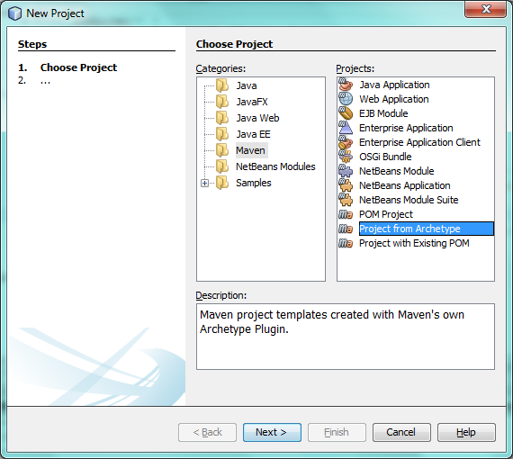
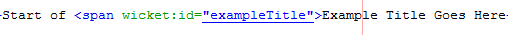
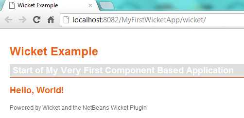
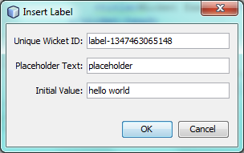
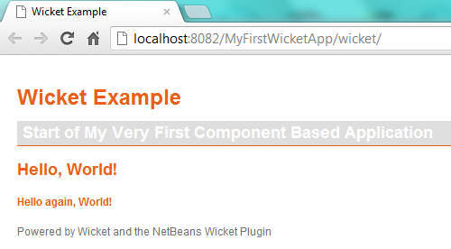
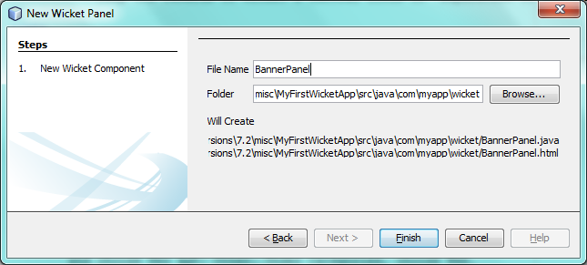
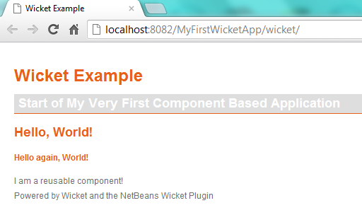
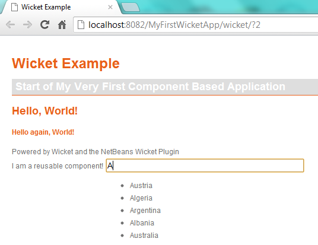

// 
//     Licensed to the Apache Software Foundation (ASF) under one
//     or more contributor license agreements.  See the NOTICE file
//     distributed with this work for additional information
//     regarding copyright ownership.  The ASF licenses this file
//     to you under the Apache License, Version 2.0 (the
//     "License"); you may not use this file except in compliance
//     with the License.  You may obtain a copy of the License at
// 
//       http://www.apache.org/licenses/LICENSE-2.0
// 
//     Unless required by applicable law or agreed to in writing,
//     software distributed under the License is distributed on an
//     "AS IS" BASIS, WITHOUT WARRANTIES OR CONDITIONS OF ANY
//     KIND, either express or implied.  See the License for the
//     specific language governing permissions and limitations
//     under the License.
//

= Wicket Web 框架简介
:jbake-type: tutorial
:jbake-tags: tutorials 
:jbake-status: published
:icons: font
:syntax: true
:source-highlighter: pygments
:toc: left
:toc-title:
:description: Wicket Web 框架简介 - Apache NetBeans
:keywords: Apache NetBeans, Tutorials, Wicket Web 框架简介

本文档逐步向您介绍创建可重用组件并将其组合到 Web 应用程序的基础知识。每个组件均由一个 Java 类和一个 HTML 文件组成。允许您以这种方式开发应用程序的框架称为 Wicket。除了基于组件的方法，Wicket 的一个显著特征就是不需要 XML 配置文件。使用 Java 类进行应用程序范围的设置（例如主页标识），而不使用 XML 配置文件。

在 Java 类中创建 Web 应用程序中的每个窗口部件并将其呈现在 HTML 页中。Java 类和 HTML 页必须具有相同的名称且存在于相同的源结构中。它们通过 Wicket 标识符彼此链接。将向您演示 IDE 如何支持 Wicket 应用程序开发，以便您可以快速有效地创建可重用组件，这样您无需执行太多操作即可生成外观一致的 Web 应用程序。

image::images/netbeans-stamp-80-74-73.png[title="此页上的内容适用于 NetBeans IDE 7.2、7.3、7.4 和 8.0"]

*要学习本教程，您需要具备以下软件和资源。*

|===
|软件或资源 |要求的版本 

|link:https://netbeans.org/downloads/index.html[+NetBeans IDE+] |7.2、7.3、7.4、8.0、Java EE 

|Java 开发工具包 (JDK) |link:http://www.oracle.com/technetwork/java/javase/downloads/index.html[+版本 7+] 或更高版本 

|NetBeans IDE 的 Wicket 插件 |link:http://plugins.netbeans.org/plugin/3586/wicket-support[+NetBeans Wicket 插件页+] 

|GlassFish Server Open Source Edition 
_或_ 
Tomcat Servlet 容器 |3.1.x 或更高版本 
_和_ 
版本 7.x 或更高版本 
|===

*注：*

* NetBeans 的 Wicket 支持插件包含以下模块：
* *org-netbeans-modules-web-wicket.nbm。*提供在本教程中使用的 Wicket 特定的功能。
* *org-netbeans-modules-wicket-templates.nbm。*提供用于创建典型 Wicket 工件（例如，页面和面板）的 Wicket 文件级别模板。
* *org-netbeans-modules-wicket-library.nbm。*提供 Wicket JAR，并将其安装在 IDE 的库管理器中。因此，您无需从 Wicket 站点下载 Wicket 发行版本，因为该插件提供了您需要的所有内容。
* 要将 Wicket 支持插件安装到 IDE，请转到 "Plugin Manager"（插件管理器）（从主菜单中选择 "Tools"（工具）> "Plugins"（插件）），然后在 "Downloaded"（已下载）标签下安装该插件。有关如何将框架插件安装到 IDE 的更详细说明，请参见link:framework-adding-support.html[+添加对 Web 框架的支持+]。
* 有关 Wicket 的更多信息，请访问 link:http://wicket.sourceforge.net/[+http://wicket.sourceforge.net/+]。有关 NetBeans IDE 中的 Wicket 支持的开发页，请访问 link:http://java.net/projects/NbWicketSupport[+http://java.net/projects/NbWicketSupport+]。如果您熟悉 Wicket，欢迎您为 NetBeans IDE 的 Wicket 插件贡献代码。

== 设置环境

在开始编写 Wicket 应用程序之前，您必须确保具有所有必需的软件并且您的项目设置正确。如上所述，安装 NetBeans IDE 的 Wicket 支持插件之后，您可以通过一个向导设置 Wicket 应用程序所需的所有基本文件。

=== 创建 Wicket 应用程序的源代码结构

应用程序的源代码结构必须包含 Wicket JAR 文件、 ``web.xml``  文件中的 Wicket servlet 注册，以及一些标准工件，例如应用程序类和主页。由于我们使用的是 IDE，因此应该不需要手动创建所有这些文件。而我们可以通过向导来执行操作。

根据您的需求，选择以下某个适当的方案：

* <<create-1,方案 1：从头开始创建基于 Ant 的 Wicket 应用程序>>
* <<create-2,方案 2：从头开始创建基于 Maven 的 Wicket 应用程序>>
* <<create-3,方案 3：根据原型创建基于 Maven 的 Wicket 应用程序>>
* <<create-4,方案 4：将 Wicket 支持添加到现有应用程序中>>

==== 方案 1：从头开始创建基于 Ant 的 Wicket 应用程序

在 IDE 中创建新的 Web 应用程序时，Web 应用程序向导的最终面板在 Wicket 应用程序的上下文中非常有用。

1. 选择 "File"（文件）> "New Project"（新建项目）。在 "Categories"（类别）下，选择 "Web"。在 "Projects"（项目）下，选择 "Web Application"（Web 应用程序）。单击 "Next"（下一步）。
2. 在 "Name and Location"（名称和位置）面板的 "Project Name"（项目名称）中，键入  ``MyFirstWicketApp`` 。将项目位置更改为计算机上的任意目录。单击 "Next"（下一步）。
3. 保留所有设置不变。您也可以根据需要更改它们。Wicket 支持任何版本的 Java EE。可以将 Wicket 应用程序部署到任何服务器。单击 "Next"（下一步）。
4. 
在 "Frameworks"（框架）面板中，选择 "Wicket"，如下所示：

image::https://blogs.oracle.com/geertjan_images/resource/wicket-160-nb.png[]

*注：*根据安装到 IDE 的模块不同，您可能会在以上屏幕快照所示的 "Frameworks"（框架）列表中看到更多或更少的项。

在以上所示的面板中，保留所有默认值不变。以上面板提供以下字段：

* *Wicket Filter Name*（Wicket 过滤器名称）。显示将在  ``web.xml``  文件中定义的过滤器的名称。
* *Wicket URL Pattern*（Wicket URL 模式）。将相对 URL 模式添加到  ``web.xml``  文件中。
* *Wicket Application Class*（Wicket 应用程序类）。指定设置应用程序范围设置（例如主页）的类的名称。
* *Wicket Home Page*（Wicket 主页）。指定将包含称为  ``xxx.java``  和  ``xxx.html``  的文件的主页名称。
* *Main Package*（主包）。IDE 将生成的所有工件放入的 Java 包。
* *Version*（版本）。Wicket 版本。以上 "Version"（版本）下拉列表中将列出库管理器中名称以 "Wicket" 开头的所有库。默认情况下，唯一列出的版本是 1.6.0，因为这是插件所提供的版本。

. 单击 "Finish"（完成）。

IDE 将创建  ``MyFirstWicketApp ``  项目。此项目包含所有源代码和项目元数据，例如项目的 Ant 构建脚本。此项目在 IDE 中打开。可以在 "Projects"（项目）窗口（Ctrl-1 组合键）中查看其逻辑结构：

image::https://blogs.oracle.com/geertjan_images/resource/wicket-160-nb-2.png[]

==== 方案 2：从头开始创建基于 Maven 的 Wicket 应用程序

当您已有一个基于 Ant 的应用程序时，IDE 可帮助您添加 Wicket 支持。

1. 选择 "File"（文件）> "New Project"（新建项目）。在 "Categories"（类别）下，选择 "Maven"。在 "Projects"（项目）下，选择 "Web Application"（Web 应用程序）。

image::images/maven-1.png[]

单击 "Next"（下一步）。

. 在 "Name and Location"（名称和位置）面板的 "Project Name"（项目名称）中，键入  ``MyFirstWicketApp`` 。根据您的需求更改 "Project Location"（项目位置）和默认 Maven 设置。

image::images/maven-3.png[]

单击 "Next"（下一步）。

. 根据您的需求选择适当的服务器，并选择 "Java EE 6 Web" 作为 "Java EE Version"（Java EE 版本）设置。

image::images/maven-4.png[]

单击 "Finish"（完成）。IDE 将创建下面显示的源代码结构：

image::images/maven-5.png[]

. 因为我们已添加对 Java EE 6 的支持，所以上一步中未创建  ``web.xml``  文件。但是，Wicket 要求在  ``web.xml``  文件中注册 Wicket 应用程序过滤器。因此，我们将在应用程序中添加新的  ``web.xml``  文件，然后继续。

右键单击应用程序，选择 "New"（新建）> "Other"（其他），然后选择 "Web" > "Standard Deployment Descriptor"（标准部署描述符）(web.xml)。单击 "Next"（下一步），然后单击 "Finish"（完成）。

. 此时我们即可将 Wicket 支持添加到应用程序中。右键单击项目节点，然后选择 "Properties"（属性）。在 "Project Properties"（项目属性）对话框中，选择 "Frameworks"（框架），然后单击 "Wicket"。使用前几部分中的描述在此对话框的 "Wicket Configuration"（Wicket 配置）部分中填写详细信息。单击 "OK"（确定）。

IDE 将创建入门所需的所有 Wicket 文件：

image::images/maven-6.png[]

==== 方案 3：根据原型创建基于 Maven 的 Wicket 应用程序

原型存在于 Maven 资源库中，用于设置 Wicket 应用程序。

1. 选择 "File"（文件）> "New Project"（新建项目）。在 "Categories"（类别）下，选择 "Maven"。在 "Projects"（项目）下，选择 "Project from Archetype"（基于原型的项目）。

单击 "Next"（下一步）。

. 在 "Search"（搜索）字段中，键入 "wicket"，然后选择要使用的原型。

image::images/maven-8.png[]

根据您的需求使用适当的值完成向导。单击 "Finish"（完成）。

IDE 将向根据原型创建的应用程序中添加 Wicket 支持。

==== 方案 4：将 Wicket 支持添加到现有应用程序中

当您已有一个应用程序（无论是基于 Ant 还是基于 Maven 创建的）时，IDE 可帮助您添加 Wicket 支持。

1. 右键单击应用程序，然后选择 "Properties"（属性）。
2. 在 "Project Properties"（项目属性）对话框中，选择 "Frameworks"（框架）面板，然后单击 "Add"（添加）。然后选择 "Wicket"。单击 "OK"（确定）。
3. 使用上一部分中的描述在 "Frameworks"（框架）面板中填写 "Wicket Configuration"（Wicket 配置）。
4. 单击确定以进行确认。

IDE 将向现有应用程序中添加 Wicket 支持。

在下一部分，我们将详细了解生成的每个文件。

=== 提供对 Wicket 的替代版本的支持

NetBeans Wicket 插件中包含的 Wicket 版本可能不是您需要的版本。执行以下步骤以注册和使用 Wicket 的替代版本。

1. 转到 "Tools"（工具）| "Ant Libraries"（Ant 库）。请注意，NetBeans Wicket 插件所注册的 Wicket JAR 可用：

image::images/maven-9.png[]

. 在上面显示的对话框中，单击 "New Library"（新建库），使用以 "Wicket" 开头的名称创建一个新库。将 JAR 添加到该库中，即，将 Wicket 的首选版本的 JAR 注册到您已创建的库中。

. 
当您接下来创建新的 Web 应用程序时，或将 Wicket 支持添加到现有应用程序中时，"Frameworks"（框架）面板将显示新注册的库（如果其名称以 "Wicket" 一词开头）：

image::images/maven-91.png[]

完成向导后，在所选库中注册的 JAR 将放在应用程序的类路径上。

*注：*以上方法适用于基于 Ant 的 Wicket 应用程序。如果要在基于 Maven 的应用程序中使用 Wicket 的替代版本，请更改相关的 POM 文件。

=== 检查生成的 Wicket 应用程序的源代码结构

IDE 的 Web 应用程序向导已经为我们创建了许多文件。在此可查看这些文件并了解这些文件在 Wicket 开发的上下文内是如何彼此相关的。

1. 让我们开始了解生成的文件。

* *Web Descriptor*（Web 描述符）。首先查看  ``web.xml``  文件，该文件是符合 Servlet 规范的所有 Web 应用程序通用的一般部署描述符。展开  ``WEB-INF``  文件夹或 "Configuration Files"（配置文件）文件夹，在原始 XML 视图中打开文件，然后查看 Wicket 过滤器的定义：

[source,xml]
----

<?xml version="1.0" encoding="UTF-8"?>
<web-app version="3.0" xmlns="http://java.sun.com/xml/ns/javaee" 
         xmlns:xsi="http://www.w3.org/2001/XMLSchema-instance" 
         xsi:schemaLocation="http://java.sun.com/xml/ns/javaee 
         http://java.sun.com/xml/ns/javaee/web-app_3_0.xsd">
    <filter>
        <filter-name>WicketApplication</filter-name>
        <filter-class>org.apache.wicket.protocol.http.WicketFilter</filter-class>
        <init-param>
            <param-name>applicationClassName</param-name>
            <param-value>com.myapp.wicket.Application</param-value>
        </init-param>
    </filter>
    <filter-mapping>
        <filter-name>WicketApplication</filter-name>
        <url-pattern>/wicket/*</url-pattern>
    </filter-mapping>
    <session-config>
        <session-timeout>
            30
        </session-timeout>
    </session-config>
    <welcome-file-list>
        <welcome-file/>
    </welcome-file-list>
</web-app>
----

*注：*应用程序类名的值设置为  ``com.myapp.wicket.Application`` 。在下一步中，我们将打开应用程序类文件并检查其内容。

* *Wicket Application Class*（Wicket 应用程序类）。打开 "Source Packages"（源包）文件夹中的  ``com.myapp.wicket``  包，然后打开  ``Application.java``  文件。此文件如下所示：

[source,java]
----

package com.myapp.wicket;           

import org.apache.wicket.protocol.http.WebApplication;

public class Application extends WebApplication {

    public Application() {
    }

    @Override
    public Class getHomePage() {
        return HomePage.class;
    }

}
----

这是提供应用程序范围设置的 Java 文件，可比较于 Struts 框架中的  ``struts-config.xml``  和 JSF 框架中的  ``faces-config.xml`` 。注意  ``getHomePage()``  方法的定义。此方法是应用程序范围类的最低要求。它指定部署应用程序时将显示的第一页（主页）。请注意，返回了  ``HomePage.class`` 。在下一步中，我们将打开  ``HomePage.java``  文件并检查其内容。

* *Wicket Home Page*（Wicket 主页）。打开  ``HomePage.java`` 。此文件如下所示：

[source,java]
----

package com.myapp.wicket;           

public class HomePage extends BasePage {

    public HomePage() {
        add(new Label("message", "Hello, World!"));
    }

}
----

此文件将向主页中添加标签。呈现在此文件中创建的 Wicket 窗口部件是在具有相同源代码结构中的相同名称的文件中完成的，该文件只能是  ``HomePage.html`` ，目前看起来如下所示：

[source,xml]
----

<!DOCTYPE html PUBLIC "-//W3C//DTD XHTML 1.0 Strict//EN" "http://www.w3.org/TR/xhtml1/DTD/xhtml1-strict.dtd">
<html xmlns="http://www.w3.org/1999/xhtml"  
      xmlns:wicket="http://wicket.apache.org/dtds.data/wicket-xhtml1.4-strict.dtd"  
      xml:lang="en"  
      lang="en"> 
    <head> 
        <wicket:head> 
            <title>Wicket Example</title> 
        </wicket:head> 
    </head> 
    <body> 
        <wicket:extend> 
            <h1 wicket:id="message">This gets replaced</h1>
        </wicket:extend> 
    </body> 
</html>
----

请注意，我们在  ``HomePage.java``  中扩展  ``BasePage`` 。在  ``HomePage.html``  中具有一个  ``wicket:id``  属性，该属性指示这是 Java 文件在某位置创建的某内容的占位符。另外，我们还引用了 IDE 生成的 CSS 样式表。您可以在 "Projects"（项目）窗口的 "Web Pages"（Web 页）文件夹中找到该样式表。在下一步中，我们将打开  ``BasePage``  并检查其内容。

* *Base Page*（基本页）。打开  ``BasePage.java`` 。内容如下所示：

[source,java]
----

package com.myapp.wicket;           

import org.apache.wicket.markup.html.WebPage;

public abstract class BasePage extends WebPage {

    public BasePage() { 
        super(); 
        add(new HeaderPanel("headerpanel", "Welcome To Wicket")); 
        add(new FooterPanel("footerpanel", "Powered by Wicket and the NetBeans Wicket Plugin"));
    } 

}
----

这是我们希望所有 Web 页扩展的类。每个扩展  ``BasePage``  的类都将继承  ``HeaderPanel``  和  ``FooterPanel``  的实例。这可确保所有 Web 页都将具有相同的页眉和页脚。基本页的 HTML 端如下所示：

[source,xml]
----

<!DOCTYPE html PUBLIC "-//W3C//DTD XHTML 1.0 Strict//EN" "http://www.w3.org/TR/xhtml1/DTD/xhtml1-strict.dtd">
<html xmlns="http://www.w3.org/1999/xhtml"  
      xmlns:wicket="http://wicket.apache.org/dtds.data/wicket-xhtml1.4-strict.dtd"  
      xml:lang="en"  
      lang="en"> 
    <head> 
        <wicket:head> 
            <wicket:link> 
                <link rel="stylesheet" type="text/css" href="style.css"/> 
            </wicket:link> 
        </wicket:head> 
    </head> 
    <body> 
        <header wicket:id="headerpanel" />
        <section class="content_container"> 
            <wicket:child/> 
        </section> 
        <footer wicket:id="footerpanel" /> 
    </body> 
</html>
----

在下一步中，我们将打开  ``HeaderPanel.java``  并检查其内容。

* *Header Panel*（页眉面板）。打开  ``HeaderPanel.java`` 。内容如下所示：

[source,java]
----

package com.myapp.wicket;           

import org.apache.wicket.markup.html.basic.Label;
import org.apache.wicket.markup.html.panel.Panel;

public class HeaderPanel extends Panel {

    public HeaderPanel(String componentName, String exampleTitle)
    {
        super(componentName);
        *add(new Label("exampleTitle", exampleTitle));*
    }

}
----

请注意上面粗体显示的行。在此我们创建一个 Wicket 标签窗口部件。HeaderPanel 是可重用组件。这是创建了窗口部件的 Java 端。接下来，我们将查看预期呈现 Wicket 标签窗口部件的 HTML 端。在下一步中，我们将打开  ``HeaderPanel.html``  文件并检查其内容。

现在，将第二个参数更改为 "My Very First Component Based Application"，以使标签的定义此时如下所示：

[source,java]
----

add(new Label("exampleTitle", "My Very First Component Based Application"));
----

打开  ``HeaderPanel.html`` 。请注意，它的名称与我们刚刚查看的 Java 文件的名称相同。在相同的包结构内找到此文件。内容如下所示：

[source,xml]
----

<!DOCTYPE html PUBLIC "-//W3C//DTD XHTML 1.0 Strict//EN" "http://www.w3.org/TR/xhtml1/DTD/xhtml1-strict.dtd">
<html xmlns="http://www.w3.org/1999/xhtml"  
      xmlns:wicket="http://wicket.apache.org/dtds.data/wicket-xhtml1.4-strict.dtd"  
      xml:lang="en"  
      lang="en"> 
    <head><title>Wicket Example</title></head>
    <body>
        <wicket:panel>
            <h1>Wicket Example</h1>
            

                <b>Start of Example Title Goes Here</b>
            

        </wicket:panel>
    </body>
</html>
----

请注意上面粗体显示的行。这是您指定应在 Web 页 HTML 端呈现窗口部件的位置的方式。按住 Ctrl 键并将鼠标移到  ``span``  标记中的  ``wicket:id``  属性值之上。请注意，此值将转变为超链接：

单击该超链接，此时注意将打开 Java 端的 Web 页。

现在，单击源代码编辑器顶部的左箭头以返回到 HTML 页：

image::images/hyperlink-2.png[]

通过这种方式，可以在 Wicket 组件的两端之间快速有效地导航。

* *Footer Panel*（页脚面板）。页脚面板的结构与页眉面板相同，如上所示。

. 
右键单击项目并运行该项目。IDE 将编译应用程序，创建 WAR 文件，将该文件发送到部署服务器，打开 IDE 的默认浏览器，并显示应用程序：

*注：*确保将 "/wicket" 附加到 URL（如上所示），以便将 URL 映射到  ``web.xml``  文件中注册的 Wicket 过滤器。

== 使用 Wicket 功能

在下面各个部分，您将了解三个关键的 Wicket 功能以及 NetBeans IDE 如何通过 NetBeans Wicket 插件支持这些功能：

* <<widget,窗口部件>>
* <<component,可重用组件>>
* <<ajax,AJAX 支持>>

下面各个部分还向您介绍了 NetBeans Wicket 插件提供的各种支持的功能。

=== 添加窗口部件

在此部分，我们将在 Wicket 中创建第一个窗口部件。就像 Wicket 中的其他大多数工件一样，窗口部件具有一个 Java 端和一个 HTML 端。在 Java 端创建窗口部件。在 HTML 端呈现窗口部件。如上所示，可通过超链接在两端之间导航。

1. 打开  ``HomePage.html`` 。如果 "Palette"（组件面板）未自动打开，请通过 "Window"（窗口）> "Palette"（组件面板）（Ctrl-Shift-8 组合键）将其打开。

image::images/widget-2.png[]

. 在 HTML 文件中的 H1 元素下方添加一行之后，将 "Label"（标签）项从 "Palette"（组件面板）拖放到 H1 元素下方。您会看到下面的对话框：

将此对话框中的值更改为以下值：

image::images/widget-4.png[]

单击 "OK"（确定）。请注意，下面粗体显示的标记已添加到文件中：

[source,xml]
----

<!DOCTYPE html PUBLIC "-//W3C//DTD XHTML 1.0 Strict//EN" "http://www.w3.org/TR/xhtml1/DTD/xhtml1-strict.dtd">
<html xmlns="http://www.w3.org/1999/xhtml"  
      xmlns:wicket="http://wicket.apache.org/dtds.data/wicket-xhtml1.4-strict.dtd"  
      xml:lang="en"  
      lang="en"> 
    <head> 
        <wicket:head> 
            <title>Wicket Example</title> 
        </wicket:head> 
    </head> 
    <body> 
        <wicket:extend> 
            <h1 wicket:id="message">This gets replaced</h1>
            *This gets replaced*
        </wicket:extend> 
    </body> 
</html>
----

现在，您即可使用 H3 标记等为新添加的窗口部件添加样式：

[source,xml]
----

<h3 wicket:id="message1">This gets replaced</h3>
----

接下来，打开  ``HomePage.java`` ，注意添加了一个标签，该标签具有 HTML 文件中的相同标识符（更改内容以*粗体*显示）：

[source,java]
----

public class HomePage extends BasePage {

    public HomePage() {
        add(new Label("message", "Hello, World!"));
        *add(new Label("message1", "Hello again, World!"));*
    }

}
----

. 
保存文件。刷新浏览器后，您将会看到在  ``HomePage.html``  文件中呈现的 Wicket 标签：

您可以创建占位符（就像在上面的  ``HomePage.html``  文件中创建的标记一样），然后将 HTML 文件传递给 Web 设计者。当 Web 设计者设计 Web 页时，您可以在 Java 端完全独立地创建窗口部件。由于 HTML 标记未嵌入到 Java 文件中，因此您和 Web 设计者可以实现 Wicket 中心焦点的“关注分离”。

打开 "Navigator"（导航器）（"Window"（窗口）> "Navigating"（导航）> "Navigator"（导航器）），同时在编辑器中选定以上 HTML 文件，然后您即可查看导航器 "Wicket Tags"（Wicket 标记）列表中的标记概览：

image::images/wicket-navigator.png[]

如果匹配的 HTML 页中不存在匹配的标记，您将会在 Java 文件中看到错误消息：

image::images/widget-1.png[]

=== 添加可重用组件

“可重用组件”概念是 Wicket 的优势之一。在此部分，我们将使用向导生成一个面板，该面板再次具有 Java 端和 HTML 端。我们将创建该面板，以便在 Web 页上重用我们具有的标帜，这样该标帜就会在 Web 站点之间保持一致。我们会看到将面板添加到 Web 页中是多么容易。

1. 右键单击  ``com.myapp.wicket``  包节点，然后选择 "New"（新建）> "Other"（其他）。在 "Categories"（类别）下，选择 "Web"。在 "File Types"（文件类型）下，注意以下模板：

image::images/panel-1.png[]

选择 "Wicket Panel"（Wicket 面板）并单击 "Next"（下一步）。

. 在 "File Name"（文件名）中键入  ``BannerPanel`` 。您现在应该看到下面的屏幕：

单击 "Finish"（完成）。

请注意，我们的包中现在包含  ``BannerPanel.html``  和  ``BannerPanel.java``  这两个新文件。

. 打开  ``BannerPanel.html`` ，注意此文件的内容如下：

[source,xml]
----

<?xml version="1.0" encoding="UTF-8"?>
<!DOCTYPE html PUBLIC "-//W3C//DTD XHTML 1.0 Strict//EN" "http://www.w3.org/TR/xhtml1/DTD/xhtml1-strict.dtd">
<html xmlns:wicket>
    <head>
        <meta http-equiv="Content-Type" content="text/html; charset=UTF-8"/>
        <title>BannerPanel</title>
    </head>
    <body>
        <wicket:panel>
            <!-- TODO - add components here, ala
            
            title here
            
            -->
        </wicket:panel>
    </body>
</html
----

在  ``wicket:panel``  标记之间找到 Wicket 占位符。删除 SPAN 标记上方和下方的行，以便不再注释掉带有 SPAN 标记的行。按住 Ctrl 键并将鼠标移到 Wicket ID 值上方，然后单击出现的超链接。 ``BannerPanel.java``  文件将打开：

[source,java]
----

package com.myapp.wicket;

import org.apache.wicket.markup.html.panel.Panel;

public final class BannerPanel extends Panel {
    BannerPanel(String id) {
        super (id);
    }
}
----

如之前在  ``HomePage.java``  文件中所做的那样，添加下面粗体显示的标签：

[source,java]
----

package com.myapp.wicket;

*import org.apache.wicket.markup.html.basic.Label;*
import org.apache.wicket.markup.html.panel.Panel;

public final class BannerPanel extends Panel {
    BannerPanel(String id) {
        super (id);
        *add(new Label("title","I am a reusable component!"));*
    }
}
----

. 我们的面板虽然简单，但实际上已经完整。将该面板添加到主页中。打开  ``HomePage.java`` ，然后通过在构造函数结尾添加以下行来创建 BannerPanel 的新实例：

[source,java]
----

add(new BannerPanel("bannerPanel"));
----

. 接下来，我们需要呈现面板。打开  ``HomePage.html`` ，然后在结束的 BODY 标记上方添加占位符标记，并确保使用 Java 文件中使用的相同 Wicket 标识符：

[source,java]
----

----

. 
重新运行项目。请注意，面板的显示位置完全如 HTML 文件指定的：

在 Wicket 术语中，面板是可重用组件。正如此部分所示，您可以任意频繁地重用该面板并且可以在任意多的 Web 页中使用。

=== 添加 AJAX 功能

代替使用 JavaScript 将异步 Web 功能（通过 link:http://en.wikipedia.org/wiki/Ajax_(programming)[+AJAX 技术+]）添加到 Wicket 应用程序中，Wicket 提供了一个封装 AJAX 功能的 Java 组件模型。下面，将向您演示如何更改 BannerPanel 以包含 AJAX 自动完成窗口部件，而不是之前创建的标签窗口部件。

1. 在  ``BannerPanel``  类的 HTML 端，从 "Palette"（组件面板）拖动 AJAX 文本输入项（Ctrl-Shift-8 组合键），如下所示：

image::images/drag-1.png[]

将此项放在现有 Wicket 占位符下方，如下所示：

[source,xml]
----

<?xml version="1.0" encoding="UTF-8"?>
<!DOCTYPE html PUBLIC "-//W3C//DTD XHTML 1.0 Strict//EN" "http://www.w3.org/TR/xhtml1/DTD/xhtml1-strict.dtd">
<html xmlns:wicket>

    <head>
        <meta http-equiv="Content-Type" content="text/html; charset=UTF-8"/>
        <title>BannerPanel</title>
    </head>

    <body>
        
        <wicket:panel>

            title here

            *<input type="text" wicket:id="countries" size="50"/>*

        </wicket:panel>

    </body>
    
</html>
----

. 在匹配的 Java 端，注意已自动添加了以下内容：

[source,java]
----

final AutoCompleteTextField field = new AutoCompleteTextField("countries", new Model("")) {
    @Override
    protected Iterator getChoices(String input) {
        if (Strings.isEmpty(input)) {
            return Collections.EMPTY_LIST.iterator();
        }
        List choices = new ArrayList(10);
        Locale[] locales = Locale.getAvailableLocales();
        for (int i = 0; i < locales.length; i++) {
            final Locale locale = locales[i];
            final String country = locale.getDisplayCountry();
            if (country.toUpperCase().startsWith(input.toUpperCase())) {
                choices.add(country);
                if (choices.size() == 10) {
                    break;
                }
            }
        }
        return choices.iterator();
    }
};
----

. 按 Ctrl-Shift-I 组合键，然后确保选择正确的 import 语句：

image::images/imports-1.png[]

单击 "OK"（确定），然后确保  ``BannerPanel``  类使用以下 import 语句：

[source,java]
----

import java.util.ArrayList;
import java.util.Collections;
import java.util.Iterator;
import java.util.List;
import java.util.Locale;
import org.apache.wicket.extensions.ajax.markup.html.autocomplete.AutoCompleteTextField;
import org.apache.wicket.markup.html.basic.Label;
import org.apache.wicket.markup.html.panel.Panel;
import org.apache.wicket.model.Model;
import org.apache.wicket.util.string.Strings;
----

. 
再次刷新浏览器后，您将具有一个 AJAX 自动完成字段。当您键入时，该字段中将填充与输入的文本匹配的国家/地区。

== 后续步骤

NetBeans IDE 中的 Wicket 开发简介到此结束。建议您通过 David R.Heffelfinger 提供的 link:http://www.ensode.net/wicket_first_look.html[+Wicket 框架入门+]中描述的 Pizza 应用程序样例，继续了解 Wicket 框架。请注意，本教程的结果作为样例与其他样例一起在 "New Project"（新建项目）向导中提供，如下所示：

image::images/samples.png[] 

link:/about/contact_form.html?to=3&subject=Feedback: Introduction to the Wicket Framework in 7.2[+请将您的反馈意见发送给我们+]

== 另请参见

有关相关或更高级的教程，请参见以下资源：

* link:../../docs/web/quickstart-webapps.html[+Web 应用程序开发简介+]
* link:../../docs/web/quickstart-webapps-struts.html[+Struts Web 框架简介+]
* link:quickstart-webapps-spring.html[+Spring Web 框架简介+]
