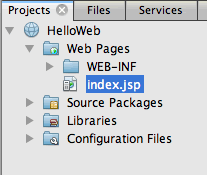
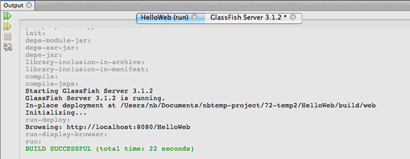

// 
//     Licensed to the Apache Software Foundation (ASF) under one
//     or more contributor license agreements.  See the NOTICE file
//     distributed with this work for additional information
//     regarding copyright ownership.  The ASF licenses this file
//     to you under the Apache License, Version 2.0 (the
//     "License"); you may not use this file except in compliance
//     with the License.  You may obtain a copy of the License at
// 
//       http://www.apache.org/licenses/LICENSE-2.0
// 
//     Unless required by applicable law or agreed to in writing,
//     software distributed under the License is distributed on an
//     "AS IS" BASIS, WITHOUT WARRANTIES OR CONDITIONS OF ANY
//     KIND, either express or implied.  See the License for the
//     specific language governing permissions and limitations
//     under the License.
//

= Введение в разработку веб-приложений
:jbake-type: tutorial
:jbake-tags: tutorials 
:jbake-status: published
:icons: font
:syntax: true
:source-highlighter: pygments
:toc: left
:toc-title:
:description: Введение в разработку веб-приложений - Apache NetBeans
:keywords: Apache NetBeans, Tutorials, Введение в разработку веб-приложений

В этой документации содержится пошаговое описание основ использования IDE NetBeans для разработки веб-приложений. Также здесь рассматриваются способы создания простого веб-приложения, его развертывания на сервере и просмотра в браузере. В этом приложении будет создана страница link:http://www.oracle.com/technetwork/java/javaee/jsp/index.html[+JavaServer Pages+](tm) (JSP) с запросом на ввод имени пользователя. Для сохранения введенного имени во время сеанса HTTP и повторения имени на другой странице JSP будет использоваться компонент JavaBeans.

image::images/netbeans-stamp-80-74-73.png[title="Содержимое этой страницы применимо к IDE NetBeans 7.2, 7.3, 7.4 и 8.0"]

*Для работы с этим учебным курсом требуется следующее программное обеспечение и ресурсы.*

|===
|Программное обеспечение или материал |Требуемая версия 

|link:https://netbeans.org/downloads/index.html[+IDE NetBeans+] |Версия 7.2, 7.3, 7.4, 8.0, Java EE 

|link:http://www.oracle.com/technetwork/java/javase/downloads/index.html[+Комплект для разработчика на языке Java (JDK)+] |версия 7 или 8 

|GlassFish Server Open Source Edition 
_или_ 
Контейнер сервлетов Tomcat 
_или_ 
Сервер Oracle Web Logic |4.x 
_ _ 

.x или 8.x

11gR1 (10.3.3) или более поздние версии 
|===

*Примечания*

* Установка Java EE (но не Java SE!) позволяет, при желании, установить сервер GlassFish и контейнер сервлетов Apache Tomcat.
* Если вы хотите сравнить проект с рабочим решением, можно link:https://netbeans.org/projects/samples/downloads/download/Samples/Java%20Web/HelloWebEE6.zip[+загрузить демонстрационное приложение+].

== Настройка проекта веб-приложения

1. Выберите в главном меню "Файл" > "Новый проект" (CTRL+SHIFT+N). В области "Категории" выберите "Java Web". В области "Projects" (Проекты) выберите "Web Application" (Веб-приложение) и нажмите кнопку "Next" (Далее).
2. В экране 2 введите  ``HelloWeb``  в текстовом поле "Project Name" (Имя проекта).
3. В поле "Project Location" укажите любой каталог на компьютере. В данном учебном курсе этот каталог будет называться  ``_$PROJECTHOME_`` .
4. Установите флажок "Использовать отдельную папку для хранения библиотек" и укажите местоположение папки библиотек (необязательно). Дополнительные сведения об этой функции см. в разделе link:http://www.oracle.com/pls/topic/lookup?ctx=nb8000&id=NBDAG366[+Создание проектов Java+] в документе _Разработка приложений в IDE NetBeans_
5. Нажмите кнопку "Далее". Откроется панель сервера и параметров настройки. Выберите версию Java EE, которую требуется использовать для приложения.
6. Выберите сервер, на котором требуется выполнить развертывание приложения. В списке представлены только те серверы, которые зарегистрированы в среде IDE. Обратите внимание, что для поля "Context Path" (например, на сервере) устанавливается значение  ``/HelloWeb``  в основе которого находится имя проекта, указанное при выполнении предыдущего действия.
7. Нажмите кнопку "Готово".

В среде IDE будет создана папка проекта  ``_$PROJECTHOME_/HelloWeb`` . Структуру файлов проекта можно просмотреть в окне "Files" (Ctrl+2), а его логическую структуру – в окне "Projects" (Ctrl+1).

Папка проекта содержит все исходные файлы и метаданные проекта, например сценарий сборки Ant. После этого проект "HelloWeb" откроется в среде IDE. В главном окне редактора исходного кода откроется страница приветствия  ``index.jsp`` .

*Примечание.* В зависимости от версий сервера и Java EE, указанных при создании проекта, IDE может создать страницу  ``index.html``  в качестве стандартной страницы приветствия для веб-проекта. Вы можете следовать инструкциям этого руководства и использовать файл  ``index.html``  либо создать файл  ``index.jsp`` , который будет использоваться в качестве страницы приветствия, в мастере создания файлов. В последнем случае необходимо удалить файл  ``index.html`` .

== Создание и изменение исходных файлов веб-приложения

Наиболее важной функцией среды IDE является создание и изменение исходных файлов. Именно эти операции при разработке чаще всего отнимают наибольшее количество времени. Среда IDE предоставляет широкий спектр средств, подходящих под личный стиль любого разработчика — как сторонника кодирования вручную, так и разработчика, предпочитающего предоставить среде IDE создание крупных блоков кода.

=== Создание пакета Java и исходного файла Java

1. В окне 'Проекты' разверните узел 'Исходные пакеты'. Обратите внимание, что узел "Source Packages" содержит только пустой узел пакета по умолчанию.
2. Щелкните узел "Source Packages" правой кнопкой мыши и выберите "New" > "Java Class". Введите  ``NameHandler``  в текстовом поле "Class Name" и  ``org.mypackage.hello``  в поле списка "Package". Нажмите кнопку 'Готово'. Новый файл  ``NameHandler.java``  будет открыт в редакторе исходного кода.
3. Объявите в редакторе исходного кода переменную  ``String`` , введя непосредственно под объявлением класса следующую строку:

[source,java]
----

String name;
----

. Добавьте следующий конструктор к классу:

[source,java]
----

public NameHandler() { }
----

. Добавьте следующую строку в конструктор  ``NameHandler()`` :

[source,java]
----

name = null;
----

=== Создание методов получения и установки

1. Щелкните правой кнопкой мыши поле  ``name``  в редакторе исходного кода и выберите "Refactor" > "Encapsulate Fields".

Откроется диалоговое окно "Encapsulate Fields", в котором имеется поле  ``name`` . Обратите внимание, что для параметра "Visibility" (Видимость) полей по умолчанию установлено значение "private" (закрытый), а для средств доступа – значение "public" (общедоступный); в результате модификатор доступа для объявления переменной класса будет определен как "private", в то время как методы получения и установки будут созданы с модификаторами  ``public``  и  ``private`` , соответственно.

image::images/encapsulatefields-dialog.png[]

. Нажмите кнопку "Refactor" (Реорганизация).

Для поля  ``name``  создаются методы получения и установки. Модификатор для переменной класса определяется как  ``private`` , в то время как методы получения и установки создаются с модификаторами "public". Класс Java должен теперь выглядеть следующим образом.

[source,java]
----

package org.mypackage.hello;

/**
 *
 * @author nbuser
 */

public class NameHandler {

    private String name;

    /** Creates a new instance of NameHandler */
    public NameHandler() {
       name = null;
    }

    public String getName() {
       return name;
    }

    public void setName(String name) {
       this.name = name;
    }

}
----

=== Изменение файла JavaServer Pages по умолчанию

1. Активируйте файл  ``index.jsp`` , перейдя на вкладку, отображаемую в верхней части редактора исходного кода.
2. 
В палитре (Ctrl+Shift+8), расположенной справа от редактора исходного кода, разверните узел "HTML Forms" и перетащите элемент "Form" в позицию, находящуюся в редакторе исходного кода непосредственно после тегов  ``<h1>`` .

Появится диалоговое окно "Insert Form".

. Установите следующие значения:
* *Action:* response.jsp;
* *Method:* GET;
* *Name:* Name Input Form.

Нажмите кнопку "ОК". К файлу  ``index.jsp``  добавляется форма HTML.

image::images/input-form.png[]

. Перетащите элемент "Text Input" в позицию непосредственно перед тегом  ``</form>`` , затем установите следующие значения:
* *Name:* name;
* *Type:* text.
Нажмите кнопку "ОК". Между тегами  ``<form>``  будет добавлен тег HTML  ``<input>`` . Удалите атрибут  ``value``  из данного тега.

. Перетащите элемент "Button" в позицию непосредственно перед тегом  ``</form>`` . Установите следующие значения:
* *Label:* OK;
* *Type:* submit.
Нажмите кнопку "ОК". Между тегами  ``<form>``  будет добавлена кнопка HTML.

. Введите  ``Enter your name:``  непосредственно перед первым тегом  ``<input>`` , затем измените текст по умолчанию  ``Hello World!`` , расположенный между тегами  ``<h1>`` , на  ``Entry Form`` .

. Щелкните правой кнопкой мыши область редактора исходного кода и выберите "Format" (Alt+Shift+F) для переформатирования кода. Файл  ``index.jsp``  должен теперь выглядеть следующим образом:

[source,xml]
----

<html>
    <head>
        <meta http-equiv="Content-Type" content="text/html; charset=UTF-8">
        <title>JSP Page</title>
    </head>
    <body>
        <h1>Entry Form</h1>

        <form name="Name Input Form" action="response.jsp">
            Enter your name:
            <input type="text" name="name" />
            <input type="submit" value="OK" />
        </form>
    </body>
</html>
----

=== Создание файлов JavaServer Pages

1. В окне 'Проекты', щелкните правой кнопкой мыши узел проекта HelloWeb и выберите 'Создать' > JSP. Откроется мастер "New JSP File". Назовите файл  ``response``  и нажмите кнопку "Finish". Обратите внимание на то, что узел файла  ``response.jsp``  отображается в окне "Projects" под файлом  ``index.jsp`` , а новый файл открывается в редакторе исходного кода.
2. 
На палитре справа от редактора исходного кода разверните узел "JSP" и поместите элемент "Use Bean" непосредственно под тегом  ``<body>``  в редакторе исходного кода. Откроется диалоговое окно "Insert Use Bean". Укажите значения, как показано на следующем рисунке.

image::images/usebean-dialog.png[]

* *ID:* mybean;
* *Class: *org.mypackage.hello.NameHandler;
* *Scope:* session.
Нажмите кнопку "ОК". Обратите внимание на то, что под тегом  ``<body>``  добавляется тег  ``<jsp:useBean>`` .

. Перетащите элемент "Set Bean Property" из палитры и поместите его непосредственно перед тегом  ``<h1>`` . Нажмите кнопку "OК". В появившемся теге  ``<jsp:setProperty>``  удалите пустой атрибут  ``value``  и измените его следующим образом: Eсли средой IDE был создан атрибут  ``value = ""`` , удалите его. В противном случае значение  ``name`` , введенное в форме  ``index.jsp`` , будет перезаписано.

[source,java]
----

<jsp:setProperty name="mybean" property="name" />
----

Как указано в

документации  ``<jsp:setProperty>`` , значение свойства можно задать различными способами. В этом случае вводимые пользователем данные из  ``index.jsp``  становятся парой имя/значение, передаваемой в объект  ``request`` . При установке свойства с помощью тега  ``<jsp:setProperty>``  можно указать значение в соответствии с именем свойства, содержащегося в объекте  ``request`` . Поэтому при определении  ``property``  в качестве  ``name``  можно получить значение, указанное пользователем при вводе.

. Измените текст между тегами <h1> следующим образом:

[source,xml]
----

<h1>Hello, !</h1>
----

. Перетащите элемент "Get Bean Property" из палитры в позицию непосредственно после запятой между тегами  ``<h1>`` . Укажите следующие значения в диалоговом окне "Insert Get Bean Property":
* *Bean Name: *mybean;
* *Property Name: *name.

Нажмите кнопку "ОК". Обратите внимание на то, что между тегами  ``<h1>``  появился тег  ``<jsp:getProperty>`` .

*Обратите внимание:* имена Property нужно вводить с учетом регистра. Свойство "name" должно быть в одном регистре как в  ``response.jsp`` , так и в форме ввода  ``index.jsp`` .

. Щелкните правой кнопкой мыши область редактора исходного кода и выберите "Format" (Alt+Shift+F) для переформатирования кода. Теперь теги  ``<body>``  файла  ``response.jsp``  должны выглядеть следующим образом:

[source,xml]
----

<body>
    <jsp:useBean id="mybean" scope="session" class="org.mypackage.hello.NameHandler" />
    <jsp:setProperty name="mybean" property="name" />
    <h1>Hello, <jsp:getProperty name="mybean" property="name" />!</h1>
</body>
----

== Выполнение проекта веб-приложения

Для сборки и выполнения веб-приложений в среде IDE используется сценарий сборки Ant. IDE создаст сценарий сборки на основе параметров, указанных в мастере создания новых проектов, а также проектов в диалоговом окне 'Свойства проектов' (в окне 'Проекты' выберите 'Свойства' в меню правой кнопки мыши узла проекта).

1. В окне 'Проекты' щелкните правой кнопкой мыши узел проекта HelloWeb и выберите 'Выполнить' (F6). При выполнении веб-приложения среда IDE выполнит следующие действия:

* Сборка и компиляция кода приложения (см. примечание ниже). Это действие можно выполнить отдельно от прочих, выбрав Build ("Сборка") или Clean and Build ("Очистка и сборка") из контекстного меню узла проекта.
* Запуск сервера.
* Развертывание приложения на сервере. Это действие можно выполнить отдельно от прочих, выбрав Deploy ("Развертывание") из контекстного меню узла проекта.
* Отображение приложения в окне браузера.

*Примечание.* По умолчанию, проект создается с включенной функцией 'Компилировать при сохранении', так что не нужно сначала компилировать код.

. Среда IDE откроет окно 'Результаты', в котором отображается ход выполнения приложения. Взгляните на вкладку HelloWeb в окне вывода. В этой вкладке можно проследить все действия, выполняемые средой IDE. При наличии проблемы IDE отображает информацию об ошибке в этом окне.

. Среда IDE открывает окно 'Результаты', которое показывает состояние сервера. Взгляните на вкладку в окне вывода с именем сервера.

*Обратите внимание.* Если сервер GlassFish не запускается, запустите его вручную и после этого выполните проект снова. Сервер можно запустить вручную из окна 'Службы', щелкнув правой кнопкой мыши узел сервера и выбрав 'Пуск'.

Окно 'Результаты' для сервера отображает полезную информацию о проблемах при выполнении веб-приложений. Также могут быть полезны журналы сервера. Они расположены в каталоге соответствующего домена сервера. Также можно сделать видимым журнал среды IDЕ, выбрав View ("Представление") > IDE log ("Журнал IDE") и просмотреть его.

image::images/gf-output-tab.png[]

. 
Страница  ``index.jsp``  откроется в браузере по умолчанию. Обратите внимание, что окно браузера может открыться до отображения выходных данных сервера средой IDE.

image::images/result1.png[]

. 
Введите имя в текстовом поле и нажмите кнопку "OК". На экране появится страница  ``response.jsp``  с простым приветствием.

image::images/result2.png[]

== Устранение проблем

_Я создал и запустил проект. При нажатии кнопки "OК" для  ``index.jsp``  на экране появляется страница ошибки, указывающая на то, что файл  ``response.jsp``  недоступен._

Откройте окно 'Результаты' в IDE (Ctrl-4) на вкладке 'Проекты' или на вкладке 'Серверы'. Какие сообщения об ошибках там отображаются? Какой JDK используется в вашем проекте? Какой сервер? Для JDK 7 требуется GlassFish 3.x или Tomcat 7.x. Щелкните правой кнопкой мыши узел проекта в окне 'Проекты' и выберите 'Свойства'. JDK находится в категории 'Библиотеки' в поле 'Платформа Java'. Версию сервера можно посмотреть в категории 'Выполнить'. Наконец, загрузите link:https://netbeans.org/projects/samples/downloads/download/Samples/Java%20Web/HelloWebEE6.zip[+ демонстрационный проект+] и сравните его с собственным.

_Я собрал и выполнил проект, но имя не выводится на экран, отображается только "Привет, !"_

В теге <jsp:setProperty> содержится атрибут  ``value = ""`` ? Он перезаписывает значение, введенное в форме  ``index.jsp`` , и заменяет его пустой строкой. Удалите атрибут  ``value`` .

_Я собрал и выполнил проект, но получаю "Hello, null!"_

В первую очередь проверьте окна выходных данных среды IDE как для приложения, так и для сервера, а также журнал сервера. Работает ли сервер? Было ли развернуто приложение? Если сервер работает и приложение было развернуто, возникает ли  ``org.apache.jasper.JasperException: java.lang.NullPointerException?``  Это обычно означает, что значение в коде неправильно инициализировано. В рамках данного курса это, вероятно, указывает на наличие ошибки где-то в имени свойства в файлах JSP. Помните, что для имен свойств важен регистр!

link:/about/contact_form.html?to=3&subject=Feedback:%20Introduction%20to%20Developing%20Web%20Applications[+Отправить отзыв по этому учебному курсу+]

== Дополнительные сведения

Это заключительный раздел учебного курса "Введение в разработку веб-приложений". В этом документе описывается создание простого веб-приложения с помощью IDE NetBeans, его развертывание на сервере и просмотр его представления в браузере. В нем также рассматривается использование технологий JavaServer Pages и JavaBeans в приложении для сбора, сохранения и вывода пользовательских данных.

Дополнительные и более детальные сведения о разработке веб-приложений в IDE NetBeans см. в следующих ресурсах:

* link:quickstart-webapps-struts.html[+Введение в веб-платформу Struts+]. Описываются основы использования IDE NetBeans для разработки веб-приложений с помощью платформы Struts.
* link:../../trails/java-ee.html[+Учебная карта по Java EE и Java Web+]
