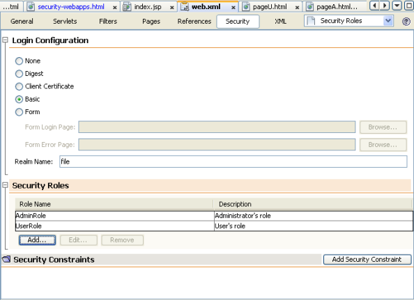
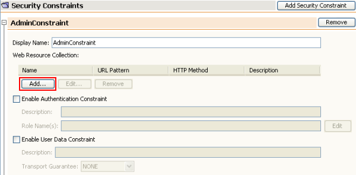
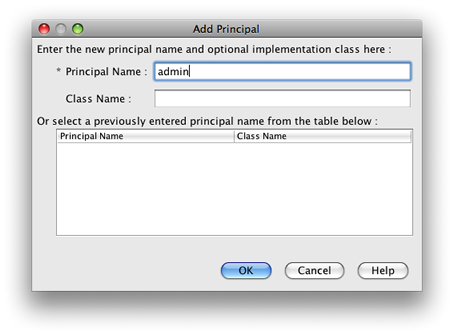

// 
//     Licensed to the Apache Software Foundation (ASF) under one
//     or more contributor license agreements.  See the NOTICE file
//     distributed with this work for additional information
//     regarding copyright ownership.  The ASF licenses this file
//     to you under the Apache License, Version 2.0 (the
//     "License"); you may not use this file except in compliance
//     with the License.  You may obtain a copy of the License at
// 
//       http://www.apache.org/licenses/LICENSE-2.0
// 
//     Unless required by applicable law or agreed to in writing,
//     software distributed under the License is distributed on an
//     "AS IS" BASIS, WITHOUT WARRANTIES OR CONDITIONS OF ANY
//     KIND, either express or implied.  See the License for the
//     specific language governing permissions and limitations
//     under the License.
//

= Securing a Web Application in NetBeans IDE
:jbake-type: tutorial
:jbake-tags: tutorials 
:jbake-status: published
:icons: font
:syntax: true
:source-highlighter: pygments
:toc: left
:toc-title:
:description: Securing a Web Application in NetBeans IDE - Apache NetBeans
:keywords: Apache NetBeans, Tutorials, Securing a Web Application in NetBeans IDE

Contributed by Dan Kolar, Maintained by James Branam and Jeff Rubinoff

This document takes you through the basics of adding security to a web application that is deployed to either the Oracle GlassFish Open Source Edition, Oracle WebLogic, or Apache Tomcat server.

This document shows you how to configure security authentication using a basic login window and also using a login form in a web page. This document takes you through the steps for creating users on the Tomcat server and the GlassFish server . After creating the users, you then create the security roles by setting the security properties in the deployment descriptor. This document also shows how you can use JDBC authentication to secure your application when deploying to the GlassFish server .

*Expected duration: _40_ minutes*

image::images/netbeans-stamp-80-74-73.png[title="Content on this page applies to the NetBeans IDE 7.2, 7.3, 7.4 and 8.0"]

*To follow this tutorial, you need the following software and resources.*

|===
|Software or Resource |Version Required 

|xref:../../../download/index.adoc[+NetBeans IDE+] |Java EE version 

|link:http://www.oracle.com/technetwork/java/javase/downloads/index.html[+Java Developer Kit (JDK)+] |Version 7 or 8 

|Java EE Platform |Java EE 6 or 7 

|Travel Database |Not Required 

|Java EE-compliant web or application server |Tomcat web server 7.x or 8.x, Oracle WebLogic 11g, or
GlassFish Server Open Source Edition 4.x 
|===

== Installing and Configuring the Working Environment

Install and start NetBeans IDE. You can do this tutorial using the bundled Tomcat server or the GlassFish server.

Make sure the server is installed and a server instance is registered with the IDE. You can use the Server Manager to register an installed server instance. (Choose Tools > Servers > Add Server. Select "GlassFish Server <version number>" or "Tomcat <version number> and click Next. Click Browse and locate the installation directory of the application server. Click Finish.)

==  Creating the Web Application

In this exercise you first create the web application project and the directory structure. You then create some simple  ``html``  files in each of the secure directories. The web application uses a basic login authentication for accessing the secure directories. If you want to use a login form for authentication, you can add a  ``jsp``  page with the form.

=== Creating the Secure Directories

1. Choose File > New Project (Ctrl-Shift-N), select Web Application from the Java Web category, and click Next.
2. Name the project  ``WebApplicationSecurity`` . Accept the default settings.
3. (Optional) Select the Use Dedicated Folder for Storing Libraries checkbox and specify the location for the libraries folder. See link:http://www.oracle.com/pls/topic/lookup?ctx=nb8000&id=NBDAG455[+Sharing a Library with Other Users+] in the _Developing Applications with NetBeans IDE_ for more information on this option.
4. Click Next.
5. Select the server to which you want to deploy your application. Only servers that are registered with the IDE are listed. Click Next.
6. You do not need to add a framework, so click Finish.
7. If you created an EE 6 application, go to the Projects window of the IDE, right-click the project's node and select New > Other > Web > Standard Deployment Descriptor (web.xml). Accept all the defaults and click through the wizard.

*Note:* This tutorial shows how to configure security in the deployment descriptor, but EE 6 and EE 7 applications use annotations instead of a deployment descriptor, by default.

. If you are using the GlassFish or WebLogic server and NetBeans IDE 7.0.1 or later, you need to generate a server-specific descriptor. Right-click the project's node and select New > Other > GlassFish > GlassFish Descriptor, or New > Other > WebLogic > WebLogic Descriptor. The Create Server-Specific Descriptor dialog opens. Accept all the defaults and click Finish. The server-specific descriptor, named either  ``glassfish-web.xml``  or  ``weblogic.xml`` , appears in the project in the Configuration Files folder.

. In the Projects window of the IDE, right-click Web Pages and choose New > Other.

. In the New File wizard, select Other as Category and Folder as File Type. Click Next.

. 
In the New Folder wizard, name the folder secureAdmin and click Finish.

The secureAdmin folder appears in the Projects window in the Web Pages folder.

. Repeat the previous 3 steps to create another folder named secureUser.

. Create a new  ``html``  file in the secureUser folder by right-clicking the folder secureUser in the Projects window and choosing New > Other.

. Select the HTML file type in the Other category. Click Next.

. Name the new file pageU and click Finish.

When you click Finish, the file  ``pageU.html``  opens in the Source Editor.

. In the Source Editor, replace the existing code in  ``pageU.html``  with the following code.[html-tag]#<html>
   <head>
      <title>#

[source,xml]
----

User secure area[html-tag]#</title>
   </head>
   <body>
      <h1>#User Secure Area[html-tag]#</h1>
   </body>
</html>#
----

. Right-click the secureAdmin folder and create a new  ``html``  file named pageA.

. In the Source Editor, replace the existing code in  ``pageA.html``  with the following code.[html-tag]#<html>
   <head>
      <title>#

[source,xml]
----

Admin secure area[html-tag]#</title>
   </head>
   <body>
      <h1>#Admin secure area[html-tag]#</h1>
   </body>
</html>#
----

=== Creating the JSP Index Page

You now create the JSP index page containing links to the secure areas. When the user clicks on the link they are prompted for the username and password. If you use a basic login, they are prompted by the default browser login window. If you use a login form page, the user enters the username and password in a form.

1. Open  ``index.jsp``  in the Source Editor and add the following links to  ``pageA.html``  and  ``pageU.html`` :[jsp-html-tag]#
#

[source,html]
----

Request a secure Admin page [jsp-html-tag]#<a# [jsp-html-argument]#href=#[jsp-xml-value]#"secureAdmin/pageA.html"#[jsp-html-tag]#>#here![jsp-html-tag]#</a>

#Request a secure User page [jsp-html-tag]#<a# [jsp-html-argument]#href=#[jsp-xml-value]#"secureUser/pageU.html"# [jsp-html-tag]#>#here![jsp-html-tag]#</a>
#
----

. Save your changes.

=== Creating a Login Form (required for Tomcat, optional for the GlassFish or WebLogic server)

If you want to use a login form instead of the basic login, you can create a  ``jsp``  page containing the form. You then specify the login and error pages when <<Basic_login_config,configuring the login method>>.

*Important:* Tomcat users must create a login form.

1. In the Projects window, right-click the folder Web Pages and choose New > JSP.
2. Name the file  ``login`` , leave the other fields at their default value and click Finish.
3. In the Source Editor, insert the following code between the  ``<body>``  tags of  ``login.jsp`` .

[source,xml]
----

<[jsp-html-tag]#form# [jsp-html-argument]#action=#[jsp-xml-value]#"j_security_check"# [jsp-html-argument]#method=#[jsp-xml-value]#"POST"#[jsp-html-tag]#>#
   Username:[jsp-html-tag]#<input# [jsp-html-argument]#type=#[jsp-xml-value]#"text"# [jsp-html-argument]#name=#[jsp-xml-value]#"j_username"#[jsp-html-tag]#> #
   Password:[jsp-html-tag]#<input# [jsp-html-argument]#type=#[jsp-xml-value]#"password"# [jsp-html-argument]#name=#[jsp-xml-value]#"j_password"#[jsp-html-tag]#>
   <input# [jsp-html-argument]#type=#[jsp-xml-value]#"submit"# [jsp-html-argument]#value=#[jsp-xml-value]#"Login"#[jsp-html-tag]#>
</form>#
----

. Create a new  ``html``  file named  ``loginError.html``  in the Web Pages folder. This is a simple error page.

. In the Source Editor, replace the existing code in  ``loginError.html``  with the following code.[html-tag]#<html>
    <head>
        <title>#

[source,xml]
----

Login Test: Error logging in[html-tag]#</title>
    </head>
    <body>
        <h1>#Error Logging In[html-tag]#</h1>
         
    </body>
</html>#
----

== Creating Users on the Target Server

To be able to use user/password authentication (basic login or form-based login) security in web applications, the users and their appropriate roles have to be defined for the target server. To log in to a server, the user account has to exist on that server.

How you define the users and roles varies according to the target server you specified. In this tutorial the users  ``admin``  and  ``user``  are used to test the security setup. You need to confirm that these users exist on the respective servers, and that the appropriate roles are assigned to the users.

=== Defining Users on the GlassFish Server

For this scenario you need to use the Admin Console of the GlassFish server to create two new users named  ``user``  and  ``admin`` . The user named  ``user``  will have limited access to the application, while  ``admin``  will have administration privileges.

1. Open the Admin Console by going to the IDE's Services window and right-clicking Servers > GlassFish server > View Domain Admin Console. The login page for the GlassFish server opens in your browser window. You need to log in using the admin username and password to access the Admin Console.

*Note: *The Application Server must be running before you can access the Admin Console. To start the server, right-click the GlassFish server node and choose Start.

. In the Admin Console, navigate to Configurations > server-config > Security > Realms > File. The Edit Realm panel opens.

image::images/edit-realm.png[]

. Click the Manage Users button at the top of the Edit Realm panel. The File Users panel opens.

image::images/file-users.png[]

. Click New. The New File Realm User panel opens. Type  ``user``  as the user ID and  ``userpw01``  as the password. Click OK.

. Follow the previous steps to create a user named  ``admin``  with password  ``adminpw1``  in the  ``file``  realm.

=== Defining Roles and Users on the Tomcat Web Server

For Tomcat 7, you create a user with the manager-script role and a password for that user when you register the server with NetBeans IDE.

The basic users and roles for the Tomcat server are in  ``tomcat-users.xml`` . You can find  ``tomcat-users.xml``  in your  ``_<CATALINA_BASE>_\conf``  directory.

*Note:* You can find your CATALINA_BASE location by right-clicking the Tomcat server node in the Services window and selecting Properties. The Server Properties opens. The location of CATALINA_BASE is in the Connection tab.

image::images/tomcat-properties.png[] image::images/catalina-base.png[]

*Note:* If you use Tomcat 6 bundled with earlier versions of the IDE, this server has the  ``ide``  user defined with a password and the administrator and manager roles. The password for the user  ``ide``  is generated when Tomcat 6 is installed. You can change the password for the user  ``ide`` , or copy the password in  ``tomcat-users.xml`` .

*To add users to Tomcat:*

1. Open  ``_<CATALINA_BASE>_/conf/tomcat-users.xml``  in an editor.
2. Add a role named  ``AdminRole`` .

[source,java]
----

<role rolename="AdminRole"/>
----

. Add a role named  ``UserRole`` .

[source,java]
----

<role rolename="UserRole"/>
----

. Add a user named  ``admin``  with the password  ``adminpw1``  and the role  ``AdminRole`` .

[source,java]
----

<user username="admin" password="adminpw1" roles="AdminRole"/>
----

. Add a user named  ``user``  with the password  ``userpw01``  and the role  ``UserRole`` .

[source,java]
----

<user username="user" password="userpw01" roles="UserRole"/>
----

The  ``tomcat-users.xml``  file now looks like this:

[source,xml]
----

<tomcat-users>
<!--
  <role rolename="tomcat"/>
  <role rolename="role1"/>
  <user username="tomcat" password="tomcat" roles="tomcat"/>
  <user username="both" password="tomcat" roles="tomcat,role1"/>
  <user username="role1" password="tomcat" roles="role1"/>
-->
...
<role rolename="AdminRole"/>
<role rolename="UserRole"/>
<user username="user" password="userpw01" roles="UserRole"/>
<user username="admin" password="adminpw1" roles="AdminRole"/>
[User with manager-script role, defined when Tomcat 7 was registered with the IDE]
...
</tomcat-users>
----

=== Defining Users and Groups on the WebLogic Server

For this scenario you first need to use the Admin Console of the WebLogic server to create two new users named  ``user``  and  ``admin`` . Add these users to the groups  ``userGroup``  and  ``adminGroup`` , respectively. Later you assign security roles to these groups. The  ``userGroup``  will have limited access to the application, while  ``adminGroup``  will have administration privileges.

General instructions on adding users and groups to the Web Logic server are in the WebLogic link:http://download.oracle.com/docs/cd/E21764_01/apirefs.1111/e13952/taskhelp/security/ManageUsersAndGroups.html[+ Administration Console Online Help+].

*To add "user" and "admin" users and groups to WebLogic:*

1. Open the Admin Console by going to the IDE's Services window and right-clicking Servers > WebLogic server > View Admin Console. The login page for the GlassFish server opens in your browser window. You need to log in using the admin username and password to access the Admin Console.

*Note: *The Application Server must be running before you can access the Admin Console. To start the server, right-click the WebLogic server node and select Start.

. In the left pane select Security Realms. The Summary of Security Realms page opens.

. On the Summary of Security Realms page select the name of the realm (default realm is "myrealm"). The Settings for Realm Name page opens.

. On the Settings for Realm Name page select Users and Groups > Users. The Users table appears.

. In the Users table, click New. The Create New User page opens.

. Type in the name "user" and the password "userpw01". Optionally type in a description. Accept default Authentication Provider. 

image::images/wl-admin-newuser.png[]

. Click OK. You return to the Users table.

. Click New and add a user with the name "admin" and the password "admin1".

. Open the Groups tab. The Groups table appears.

. Click New. The Create a New Group window opens.

. Name the group userGroup. Accept the default provider and click OK. You return to the Groups table.

. Click New and create the group adminGroup.

. Open the Users tab for the next procedure.

Now add the  ``admin``  user to  ``adminGroup``  and the  ``user``  user to  ``userGroup`` .

*To add users to groups:*

1. In the Users tab, click the  ``admin``  user. The user's Settings page opens.
2. In the Settings page, open the Groups tab.
3. In the Parent Groups: Available: table, select  ``adminGroup`` .
4. Click the right arrow, >. The  ``adminGroup``  appears in the Parent Groups: Chosen: table. 

image::images/wl-admin-usersettings.png[]

. Click Save.

. Return to the Users tab.

. Click the  ``user``  user and add it to the  ``userGroup`` .

== Configuring the Login Method

When configuring the login method for your application, you can use the login window provided by your browser for basic login authentication. Alternatively, you can create a web page with a login form. Both types of login configuration are based on user/password authentication.

To configure login, you create _security constraints _and assign roles to these security constraints. Security constraints define a set of files. When you assign a role to a constraint, users with that role have access to the set of files defined by the constraint. For example, in this tutorial you assign the AdminRole to the AdminConstraint and the UserRole and AdminRole to the UserConstraint. This means that users with the AdminRole have access to both Admin files and User files, but users with the UserRole have access only to User files.

*Note:* It is not a general use case to give a separate administrator role access to user files. An alternative is to assign only the UserRole to UserConstraint and on the server side grant the AdminRole to specific *users* who are also administrators. You should decide how to grant access on a case-by-case basis.

You configure the login method for the application by configuring  ``web.xml`` . The  ``web.xml``  file can be found in the Configuration Files directory of the Projects window.

=== Basic Login

When you use the basic login configuration, the login window is provided by the browser. A valid username and password is needed to access the secure content.

The following steps show how to configure a basic login for the GlassFish and WebLogic servers. Tomcat users need to use <<form-login,form login>>.

*To configure basic login:*

1. In the Projects window, expand the project's Configuration Files node and double-click  ``web.xml`` . The  ``web.xml``  file opens in the Visual Editor.
2. Click Security in the toolbar to open the file in Security view.
3. Expand the Login Configuration node and set the Login Configuration to Basic.

*Note: *If you want to use a form , select Form instead of basic and specify the login and login error pages.

. Enter a realm name, depending on your server.
* *GlassFish:* Enter  ``file``  as the Realm Name. This is the default realm name where you created the users on the GlassFish server.
* *Tomcat:* Do not enter a realm name.
* *WebLogic:* Enter your realm name. The default realm is  ``myrealm`` .

. Expand the Security Roles node and click Add to add a role name.

. Add the following Security Roles:
*  ``AdminRole`` . Users added to this role will have access to the  ``secureAdmin``  directory of the server.
*  ``UserRole`` . Users added to this role will have access to the  ``secureUser``  directory of the server.

*Caution:* GlassFish role names must begin with an upper-case letter.

. Create and configure a security constraint named  ``AdminConstraint``  by doing the following:
1. Click Add Security Constraint. A section for a new security constraint appears.
2. Enter  ``AdminConstraint``  for the Display Name of the new security constraint.

. Click Add. The Add Web Resource dialog opens.

. 
In the Add Web Resource dialog, set the Resource Name to  ``Admin``  and the URL Pattern to  ``/secureAdmin/*``  and click OK. The dialog closes.

*Note: * When you use an asterisk (*), you are giving the user access to all files in that folder.

image::images/addwebresource.png[]

. Select Enable Authentication Constraint and click Edit. The Edit Role Names dialog opens.

. In the Edit Role Names dialog box, select AdminRole in the left pane, click Add and then click OK.

After completing the above steps, the result should resemble the following figure:

image::images/constraints.png[]

. Create and configure a security constraint named  ``UserConstraint``  by doing the following:
1. Click Add Security Constraint to create a new security constraint.
2. Enter  ``UserConstraint``  for the Display Name of the new security constraint.
3. Click Add to add a Web Resource Collection.
4. In the Add Web Resource dialog box, set the Resource Name to  ``User``  and the URL Pattern to  ``/secureUser/*``  and click OK.
5. Select Enable Authentication Constraint and click Edit to edit the Role Name field.
6. In the Edit Role Names dialog box, select AdminRole and UserRole in the left pane, click Add and then click OK.
Note: You can also set the timeout for the session in web.xml. To set the timeout, click the General tab of the Visual Editor and specify how long you want the session to last. The default is 30 minutes. 
 

=== Form Login

Using a form for login enables you to customize the content of the login and error pages. The steps for configuring authentication using a form are the same as for the basic login configuration, except that you specify the <<loginform,login and error pages>> you created.

The following steps show how to configure a login form

1. In the Projects window, double-click  ``web.xml``  located in the  ``Web Pages/WEB-INF``  directory to open the file in the Visual Editor.
2. Click Security in the toolbar to open the file in Security view and expand the Login Configuration node.
3. Set the Login Configuration to Form.
4. Set the Form Login Page by clicking Browse and locating  ``login.jsp`` .
5. 
Set the Form Error Page by clicking Browse and locating  ``loginError.html`` .

image::images/login-forms.png[]

. Enter a realm name, depending on your server.
* *GlassFish:* Enter  ``file``  as the Realm Name. This is the default realm name where you created the users on the GlassFish server.
* *Tomcat:* Do not enter a realm name.
* *WebLogic:* Enter your realm name. The default realm is  ``myrealm`` .

. Expand the Security Roles node and click Add to add a role name.

. Add the following Security Roles:
|===

|Server role |Description 

|AdminRole |Users added to this role have access to the  ``secureAdmin``  directory of the server. 

|UserRole |Users added to this role have access to the  ``secureUser``  directory of the server. 
|===

. Create and configure a security constraint named  ``AdminConstraint``  by doing the following:
1. Click Add Security Constraint to create a new security constraint.
2. Enter  ``AdminConstraint``  for the Display Name of the new security constraint.
3. Click Add to add a Web Resource Collection.
4. 
In the Add Web Resource dialog box, set the Resource Name to  ``Admin``  and the URL Pattern to  ``/secureAdmin/*``  and click OK.

*Note: * When you use an asterisk (*), you are giving the user access to all files in that folder.

image::images/addwebresource.png[]

. Select Enable Authentication Constraint and click Edit. The Edit Role Names dialog opens.

. In the Edit Role Names dialog box, select AdminRole in the left pane, click Add and then click OK.

After completing the above steps, the result should resemble the following figure:

image::images/constraints.png[]

. Create and configure a security constraint named  ``UserConstraint``  by doing the following:
1. Click Add Security Constraint to create a new security constraint.
2. Enter  ``UserConstraint``  for the Display Name of the new security constraint.
3. Click Add to add a Web Resource Collection.
4. In the Add Web Resource dialog box, set the Resource Name to  ``User``  and the URL Pattern to  ``/secureUser/*``  and click OK.
5. Select Enable Authentication Constraint and click Edit to edit the Role Name field.
6. In the Edit Role Names dialog box, select AdminRole and UserRole in the left pane, click Add and then click OK.
Note: You can also set the timeout for the session in web.xml. To set the timeout, click the General tab of the Visual Editor and specify how long you want the session to last. The default is 30 minutes. 

== Configuring Server Deployment Descriptors

If you are deploying your application to a GlassFish or WebLogic server, you need to configure the server deployment descriptor to map the security roles defined in  ``web.xml`` . The server deployment descriptor is listed under your project's Configuration Files node in the Projects window.

=== Configuring the GlassFish Server Deployment Descriptor

The GlassFish server deployment descriptor is named  ``glassfish-web.xml`` . The server deployment descriptor is in the Configuration Files folder. If it is not there, create it by right-clicking the project's node and going to New > Other > GlassFish > GlassFish Deployment Descriptor. Accept all the defaults.

Note that the values you entered in  ``web.xml``  are displayed in  ``glassfish-web.xml`` . The IDE pulls these values from  ``web.xml``  for you.

*To configure the GlassFish deployment descriptor:*

1. In the Projects window, expand the project's Configuration Files node and double-click  ``glassfish-web.xml`` . The  ``glassfish-web.xml``  deployment descriptor opens in a special tabbed editor for GlassFish deployment descriptors.

*Note:* For GlassFish server versions older than 3.1, this file is called  ``sun-web.xml`` .

. Select the Security tab to reveal the security roles.

. Select the AdminRole security role node to open the Security Role Mapping pane.

. 
Click Add Principal and enter  ``admin``  for the principal name. Click OK.

. Select the UserRole security role node to open the Security Role Mapping pane.

. Click Add Principal and enter  ``user``  for the principal name. Click OK

. Save your changes to  ``glassfish-web.xml`` .

You can also view and edit  ``glassfish-web.xml``  in the XML editor by clicking the XML tab. If you open  ``glassfish-web.xml``  in the XML editor, you can see that  ``glassfish-web.xml``  has the following security role mapping information:

[xml-tag]#<security-role-mapping>
    <role-name>#

[source,xml]
----

AdminRole[xml-tag]#</role-name>
    <principal-name>#admin[xml-tag]#</principal-name>
</security-role-mapping>
<security-role-mapping>
    <role-name>#UserRole[xml-tag]#</role-name>
    <principal-name>#user[xml-tag]#</principal-name>
</security-role-mapping>#
----

=== Configuring the WebLogic Server Deployment Descriptor

The WebLogic deployment descriptor is named  ``weblogic.xml`` . Currently, the IDE's <<gf-dd,support for GlassFish deployment descriptors>> is not extended to WebLogic deployment descriptors. Therefore you need to make all changes to  ``weblogic.xml``  manually.

The WebLogic server deployment descriptor is in the Configuration Files folder. If it is not there, create it by right-clicking the project's node and going to New > Other > WebLogic > WebLogic Deployment Descriptor. Accept all the defaults.

*Note:* For more information about securing web applications on WebLogic, including declarative and programmatic security, see link:http://download.oracle.com/docs/cd/E21764_01/web.1111/e13711/thin_client.htm[+ Oracle Fusion Middleware Programming Security for Oracle WebLogic Server+].

*To configure the WebLogic deployment descriptor:*

1. In the Projects window, expand the project's Configuration Files node and double-click  ``weblogic.xml`` . The  ``weblogic.xml``  deployment descriptor opens in the Editor.
2. Inside the  ``<weblogic-web-app>``  element, type or paste the following security role assignment elements:[xml-tag]#<security-role-assignment>
    <role-name>#

[source,xml]
----

AdminRole[xml-tag]#</role-name>
    <principal-name>#adminGroup[xml-tag]#</principal-name>
</security-role-assignment>
<security-role-assignment>
    <role-name>#UserRole[xml-tag]#</role-name>
    <principal-name>#userGroup[xml-tag]#</principal-name>
</security-role-assignment>#
----

. Save your changes to  ``weblogic.xml`` .

== Deploying and Running the Application

In the Projects window, right-click the project node and choose Run.

*Note:* By default, the project has been created with the Compile on Save feature enabled, so you do not need to compile your code first in order to run the application in the IDE. For more information on the Compile on Save feature, see link:http://www.oracle.com/pls/topic/lookup?ctx=nb8000&id=NBDAG510[+Building Java Projects+] in the _Developing Applications with NetBeans IDE User's Guide_.

After building and deploying the application to the server, the start page opens in your web browser. Choose the secure area which you want to access by clicking either *admin* or *user*.

image::images/deploy1.png[]

After supplying the user and password, there are three possible results:

* Password for this user is correct and user has privileges for secured content -> secure content page is displayed

image::images/deploy2.png[]

* 
Password for this user is incorrect -> Error page is displayed

image::images/deploy3.png[]

* 
Password for this user is correct, but user does not have right to access the secured content -> browser displays Error 403 Access to the requested resource has been denied

image::images/deploy4.png[]

== Summary

In this tutorial, you created a secure web application. You edited security settings using the web.xml and glassfish-web.xml Descriptor editors, creating web pages with secure logins and multiple identities.

== See Also

* xref:quickstart-webapps.adoc[Introduction to Developing Web Applications]
* xref:../java-ee.adoc[Java EE &amp; Java Web Learning Trail]

xref:../../../community/mailing-lists.adoc[Send Feedback on This Tutorial]
 