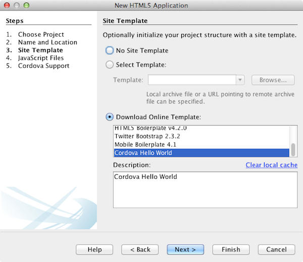
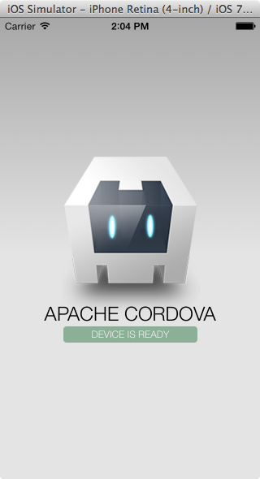
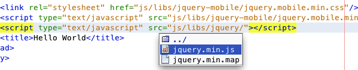
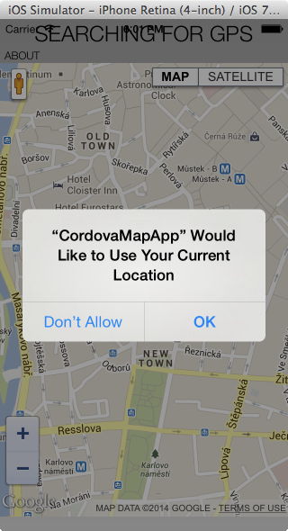
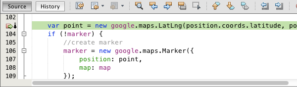
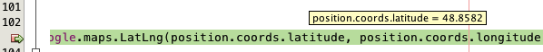
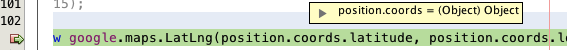
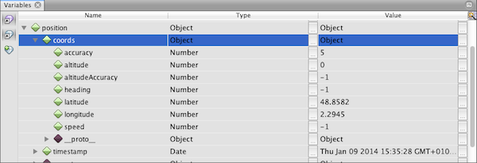

// 
//     Licensed to the Apache Software Foundation (ASF) under one
//     or more contributor license agreements.  See the NOTICE file
//     distributed with this work for additional information
//     regarding copyright ownership.  The ASF licenses this file
//     to you under the Apache License, Version 2.0 (the
//     "License"); you may not use this file except in compliance
//     with the License.  You may obtain a copy of the License at
// 
//       http://www.apache.org/licenses/LICENSE-2.0
// 
//     Unless required by applicable law or agreed to in writing,
//     software distributed under the License is distributed on an
//     "AS IS" BASIS, WITHOUT WARRANTIES OR CONDITIONS OF ANY
//     KIND, either express or implied.  See the License for the
//     specific language governing permissions and limitations
//     under the License.
//

= Getting Started with Cordova Applications
:jbake-type: tutorial
:jbake-tags: tutorials 
:jbake-status: published
:icons: font
:syntax: true
:source-highlighter: pygments
:toc: left
:toc-title:
:description: Getting Started with Cordova Applications - Apache NetBeans
:keywords: Apache NetBeans, Tutorials, Getting Started with Cordova Applications

This document demonstrates how to create an HTML5 project in the IDE that is packaged as a mobile application and run in a mobile device simulator. When you create an HTML5 application you have the option to create the application using an Apache Cordova site template. Apache Cordova provides a group of APIs that enable you to develop an application with HTML, CSS and JavaScript that is packaged as a native mobile application. The application runs on the mobile device and can access the native functions of the device such as the GPS or camera. By using the Cordova APIs a developer can build a mobile application without writing any native code.

This document demonstrates how to install the software that is necessary to install and develop an application with Cordova. After you install Cordova you will use the Cordova template in the New Project wizard to create a Cordova application. You will then add some code and run the application in the mobile device simulator. This tutorial will use the iOS simulator, but the steps are similar if you want to use an Android device emulator.

To watch a screencast that demonstrates deploying a Cordova application to the Android emulator, see xref:../web/html5-cordova-screencast.adoc[+Video of Getting Started with Cordova Development+].

== To complete this tutorial, you will need the following resources.

|===
|Software or Resource |Version Required 

|xref:../../../download/index.adoc[+NetBeans IDE, Java+] |8.0 

|link:http://www.oracle.com/technetwork/java/javase/downloads/index.html[+Java Development Kit (JDK)+] |version 7 

|link:http://cordova.apache.org/[+Apache Cordova+] |-- 

|link:http://nodejs.com/[+NodeJS+] |-- 

|link:http://git-scm.com/[+Git+] |-- 

|Mobile Platform SDK
 |Android or
iOS 
|===

*Notes:*

* This document assumes that a compatible target mobile platform SDK and device emulator is already installed.
* This document assumes that you have some basic knowledge of, or programming experience with HTML, CSS, and JavaScript. For more details on HTML5 support in NetBeans IDE, see xref:html5-gettingstarted.adoc[+Getting Started with HTML5 Applications+]

== Installing Cordova

You need to install Cordova on your local system to package an HTML5 application as a native mobile application with NetBeans IDE. You will use *npm*, the NodeJS package manager, to install and to update Cordova. You will also need to confirm that Git is installed on your local system and configured properly. Cordova uses Git to retrieve any required Cordova source files from a repository when you package the application as a native mobile application.

You will perform most of the following steps in this exercise in your terminal window.

1. Download and install Node.js, if not already installed.

You can download the installer from the link:http://nodejs.org[+Node.js site+].

[start=2]
. Open a terminal window.

[start=3]
. Run the following command to confirm that Node.js is installed.

[source,shell]
----

$ node -v
----

If node.js is installed you will see a version printed in the terminal window.

*Notes.*

* If you are behind a proxy you will need to configure node.js to use the proxy to access the network. You can run the following commands to set the proxy, replacing  ``http://proxy:8080``  with your proxy.

[source,shell]
----

$ sudo npm config set proxy http://proxy:8080
$ sudo npm config set https-proxy http://proxy:8080
----

You can run the following command to view the current configuration settings.

[source,shell]
----

$ npm config list
----
* For additional information about configuring node.js, see link:https://npmjs.org/doc/config.html[+https://npmjs.org/doc/config.html+].

[start=4]
. Run the following command to install Cordova.

[source,shell]
----

$ npm install -g cordova
----

*Notes.*

* Confirm that your proxy configuration is correct if you see an error message in the terminal window when you run the install command.
* You can run the following command to update Cordova to the most recent version.

[source,shell]
----

$ npm update -g cordova
----

[start=5]
. Run the following command to confirm that Cordova is installed and to view the version.

[source,shell]
----

$ cordova --version
----

If Cordova is installed you will see a version printed in the terminal window.

[start=6]
. Download and install the Git version control system, if not already installed.

You can download the installer from the link:http://git-scm.com/[+Git site+].

*Note.* You need to add Git to your Path environment.

[start=7]
. Run the following command to confirm that Git is installed.

[source,shell]
----

$ git --version
----

If Git is installed you will see a version printed in the terminal window.

*Notes.*

* If you are behind a proxy you will need to configure Git to use the proxy to access the network. You can run the following commands to set the proxy, replacing  ``http://proxy:8080``  with your proxy.

[source,shell]
----

$ git config --global http.proxy http://proxy:8080
$ git config --global https.proxy http://proxy:8080
----

You can run the following command to view the current configuration settings.

[source,shell]
----

$ git config --list
----
* For additional information about configuring Git, see the setup instructions at link:http://git-scm.com/book/en/Getting-Started-First-Time-Git-Setup[+http://git-scm.com/book/en/Getting-Started-First-Time-Git-Setup+].

You now have all the tools that you need to develop and package a native mobile application in the IDE. In the next exercise you will use the New Project wizard to create the application.

== Creating a Cordova Application

In this exercise you will use the New Project wizard in the IDE to create a new Cordova application. You create a Cordova application by selecting the Cordova Hello World template as the site template in the New Project wizard. A Cordova application is an HTML5 application with some additional libraries and configuration files. If you have an existing HTML5 application you can use the Project Properties window in the IDE to add the Cordova sources and other files required to package the application as a Cordova application.

For this tutorial you will create a very basic HTML5 project that has an  ``index.html``  file and some some JavaScript and CSS files. You will select some jQuery JavaScript libraries when you create the project in the wizard.

1. Select File > New Project (Ctrl-Shift-N; ⌘-Shift-N on Mac) in the main menu to open the New Project wizard.
2. Select the *HTML5* category and then select *Cordova Application*. Click Next.

image::images/cordova-newproject-wizard1.png[title="Cordova Application template in the New Project wizard"]

[start=3]
. Type *CordovaMapApp* for the Project Name and specify the directory on your computer where you want to save the project. Click Next.

[start=4]
. In Step 3. Site Template, confirm that Download Online Template is selected and that the Cordova Hello World template is selected in the list. Click Next.

*Note:* You must be online to create a project that is based on one of the online templates in the list.

[start=5]
. In Step 4. JavaScript Files, select the  ``jquery``  and  ``jquery-mobile``  JavaScript libraries in the Available pane and click the right-arrow button ( > ) to move the selected libraries to the Selected pane of the wizard. By default the libraries are created in the  ``js/libraries``  folder of the project. For this tutorial you will use the "minified" versions of the JavaScript libraries.

You can use the text field in the panel to filter the list of JavaScript libraries. For example, type *jq* in the field to help you find the  ``jquery``  libraries. You can Ctrl-click the names of the libraries to select multiple libraries.

image::images/cordova-newproject-wizard3.png[title="JavaScript Libraries panel in the New HTML5 Application wizard"]

*Notes.*

* You can click on the library version number in the Version column to open a popup window that enables you to select older versions of the library. By default the wizard displays the most recent version.
* The minimized versions of the JavaScript libraries are compressed versions and the code is not comprehensible when viewed in an editor.

[start=6]
. In Step 5. Cordova Support, use the default values. Click *Finish* to complete the wizard.

When you click Finish the IDE creates the project and displays a node for the project in the Projects window and opens the  ``index.html``  file in the editor.

image::images/cordova-projects-window1.png[title="Projects window"]

If you expand the  ``js/libs``  folder in the Projects window you can see that the JavaScript libraries that you specified in the New Project wizard were automatically added to the project. You can remove a JavaScript library from a project by right-clicking the JavaScript file and choosing Delete in the popup menu.

To add a JavaScript library to a project, right-click the project node and choose Properties to open the Project Properties window. You can add libraries in the JavaScript Libraries panel of the Project Properties window. Alternatively, you can copy a JavaScript file that is on your local system directly into the  ``js``  folder.

You can now test that your project runs and is deployed to the emulator for your target mobile device.

[start=7]
. Click the browser select icon in the toolbar and confirm that your target mobile device emulator is selected in the Cordova column in the table. In the Cordova column you can select the Android Emulator or iOS Simulator (requires OS X and XCode). 

image::images/cordova-select-browser.png[title="Browser selected in dropdown list in toolbar"]

[start=8]
. Click the Run icon in the toolbar.

When you choose Run the IDE deploys the Cordova application to the emulator.

*Note.* If you are deploying to the iOS Simulator the simulator should open automatically. If you are deploying the application to an Android emulator you will need to configure and start the emulator before you run the application. To watch a screencast that demonstrates deploying a Cordova application to the Android emulator, see xref:../web/html5-cordova-screencast.adoc[+Video of Getting Started with Cordova Development+].

== Modifying the Application

In this exercise you will edit the  ``index.html``  and  ``index.js``  files. You will replace the code generated by the Cordova Hello World template with code to display a map of your current location in the application. You will also modify the default Cordova configuration to remove the Cordova plugins that are not necessary in the application.

=== Editing the HTML File

In this exercise you edit the HTML file in the source editor to add references to the libraries and CSS files and to add the page elements.

1. Open `index.html` in the editor (if it is not already open).

In the editor you can see that the IDE generated some code based on the Cordova Hello World template.

[start=2]
. In the editor, add references to the jQuery JavaScript libraries and CSS files that you added when you created the project. Add the following code (in *bold*) between the opening and closing  ``<head>``  tags.

[source,xml]
----

<html>
    <head>
        <meta charset=UTF-8">
        <meta name="format-detection" content="telephone=no" />
        <meta name="viewport" content="user-scalable=no, initial-scale=1, maximum-scale=1, minimum-scale=1, width=device-width, height=device-height, target-densitydpi=device-dpi">
        <link rel="stylesheet" type="text/css" href="css/index.css" />
        
        *<link rel="stylesheet" href="js/libs/jquery-mobile/jquery.mobile.min.css"/>
        
        *
        <title>Hello World</title>
    </head>
    <body>
    ...
</html>
----

You can see the path to the files in the Projects window and you can use the code completion in the editor to help you.

[start=3]
. Add the following link to the Google Maps JavaScript API between the `<head>` tags.

[source,xml]
----

----

*Note.* This is a link to the deprecated v2 of the JavaScript API. This JavaScript will work for the purpose of demonstration in this tutorial but you should use the newer version in a real application.

[start=4]
. Remove all the code between the `<body>` tags except for the following links to the `index.js` and `cordova.js` JavaScript files.

[source,xml]
----

   <body>
        
        *
        *
        
    </body> 
</html>
----

The `index.js` file was generated automatically when you created the project. You can see the file under the `js` node in the Projects window. You will modify the code in `index.js` later in the tutorial.

The `cordova.js` is not visible in the Projects window because it is generated when you build the Cordova application.

[start=5]
. Add the following code (in *bold*) between the  ``body``  tags.

[source,html]
----

   <body>
        *

            

                <h1 id="header">Searching for GPS</h1>
                <a data-role="button" class="ui-btn-right" onclick="showAbout()">About</a>
            

            
            

                

                

            

            

                <h4>Google Maps</h4>
            

        

        

            

                <a data-role="button" data-rel="back" href="#mylocation" data-icon="arrow-l" data-iconpos="left" class="ui-btn-left">Back</a>
                <h1>About</h1>

            

            
 
            

                <h4>Created with NetBeans IDE</h4>
            

        

        *
        
        
    </body>
</html>
----

=== Modifying the Cordova Configuration

In this exercise you will modify the list of Cordova plugins that are installed in the application.

1. Right-click the project node in the Projects window and choose Properties in the popup menu.
2. Select *Cordova* in the list of categories. 

image::images/cordova-properties-application.png[title="Cordova Plugins tab in the Project Properties window"]

You can use the Application tab to view and edit the Cordova configuration details about the application that are specified in `config.xml`.

[start=3]
. Click the Plugins tab in the Cordova panel.

The Plugins tab contains two panes. The Available pane displays a list of the Cordova plugins that are currently available.

The Selected pane displays a list of the plugins that are installed in the application. All plugins are installed by default when you use the Cordova Hello World template to create the application. Most applications do not require all the plugins. You can use the Plugins tab in the Project Properties window to remove the plugins that are not required by your application.

*Note.* You can also edit the plugins that are installed by editing the `nbproject/plugins.properties` file in the editor.

[start=4]
. Remove all plugins except Device API, Dialogs (Notifications) and Geolocation. Click OK. 

image::images/cordova-properties-plugins.png[title="Cordova Plugins tab in the Project Properties window"]

=== Editing the JavaScript File

In this exercise you will remove the JavaScript code generated by the template and add some simple methods to display the map of your current location.

1. Open `index.js` in the editor.

The IDE generated some boilerplate code in `index.js` when you created the project. For this application you can remove all the generated code.

[start=2]
. Replace the generated code with the following code. Save your changes.

[source,java]
----

var map;
var marker;
var watchID;

$(document).ready(function() {
    document.addEventListener("deviceready", onDeviceReady, false);
    //uncomment for testing in Chrome browser
//    onDeviceReady();
});

function onDeviceReady() {
    $(window).unbind();
    $(window).bind('pageshow resize orientationchange', function(e) {
        max_height();
    });
    max_height();
    google.load("maps", "3.8", {"callback": map, other_params: "sensor=true&amp;language=en"});
}

function max_height() {
    var h = $('div[data-role="header"]').outerHeight(true);
    var f = $('div[data-role="footer"]').outerHeight(true);
    var w = $(window).height();
    var c = $('div[data-role="content"]');
    var c_h = c.height();
    var c_oh = c.outerHeight(true);
    var c_new = w - h - f - c_oh + c_h;
    var total = h + f + c_oh;
    if (c_h < c.get(0).scrollHeight) {
        c.height(c.get(0).scrollHeight);
    } else {
        c.height(c_new);
    }
}

function map() {
    var latlng = new google.maps.LatLng(50.08, 14.42);
    var myOptions = {
        zoom: 15,
        center: latlng,
        streetViewControl: true,
        mapTypeId: google.maps.MapTypeId.ROADMAP,
        zoomControl: true
    };
    map = new google.maps.Map(document.getElementById("map"), myOptions);

    google.maps.event.addListenerOnce(map, 'tilesloaded', function() {
        watchID = navigator.geolocation.watchPosition(gotPosition, null, {maximumAge: 5000, timeout: 60000, enableHighAccuracy: true});
    });
}

// Method to open the About dialog
function showAbout() {
    showAlert("Google Maps", "Created with NetBeans 7.4");
}
;

function showAlert(message, title) {
    if (window.navigator.notification) {
        window.navigator.notification.alert(message, null, title, 'OK');
    } else {
        alert(title ? (title + ": " + message) : message);
    }
}

function gotPosition(position) {
    map.setCenter(new google.maps.LatLng(position.coords.latitude, position.coords.longitude));

    var point = new google.maps.LatLng(position.coords.latitude, position.coords.longitude);
    if (!marker) {
        //create marker
        marker = new google.maps.Marker({
            position: point,
            map: map
        });
    } else {
        //move marker to new position
        marker.setPosition(point);
    }
}
----

*Note.* For this tutorial the call to the `onDeviceReady` method is commented out because the method is not necessary when you are deploying the application to a mobile device emulator. If you want to run the application in a web browser you should uncomment the call to the `onDeviceReady` method.

[start=3]
. Reset your emulator by either restarting the emulator or resetting the settings.

[start=4]
. Click Run in the toolbar to deploy the application to the emulator. 

On the iOS Simulator you are prompted to allow the application to use your current location.

You can test a simulated location in the iOS Simulator by selecting Debug > Location > Custom Location from the main menu of the iOS Simulator to open the Custom Location dialog box.

image::images/cordova-ios-customlocation.png[title="Custom Location dialog box in iOS Simulator"]

If you enter 48.8582 in the Latitude field and 2.2945 in the Longitude field for your current location the application will display your location as the Eiffel Tower on the map.

image::images/cordova-ios7-run3.png[title="Application when using a custom location in the iOS Simulator"]

== Debugging the Application

In this exercise you will set a breakpoint in the JavaScript file and run the application again.

1. Reset or relaunch the emulator.
2. Open `index.js` in the editor.
3. Place a breakpoint by clicking in the left margin in the following line in the `gotPosition` method.

[source,java]
----

var point = new google.maps.LatLng(position.coords.latitude, position.coords.longitude);
----

[start=4]
. Click Run in the toolbar to run the application again.

When you run the application the debugger will hit the breakpoint when the application tries to determine your current location.

If you hover your cursor over the variables you can see a tooltip that displays details about the variable. If your cursor is over the `latitude` variable the value of the variable is displayed in the tooltip.

If your cursor is over `position` or `coords` the tooltip contains an arrow that you can click to expand the tooltip.

The expanded tooltip enables you to see the values in greater detail.

image::images/cordova-debug-variables2.png[title="Tooltip showing variables"]

In this case it is easier to view the values in the Variables window. In the Variables window you can see the latitude and longitude of your current location.

In the Network Monitor window you can see a list of the application requests.

image::images/cordova-network-monitor.png[title="Variables window"]

[[summary]]
== Summary

In this tutorial you have learned how to install and setup the required software to create a Cordova application in the IDE. You also learned how to create a Cordova application and modify some of the Cordova configuration settings.

xref:../../../community/mailing-lists.adoc[Send Feedback on This Tutorial]

[[seealso]]
== See Also

For more information about support for HTML5 applications in the IDE on xref:../../../index.adoc[+netbeans.org+], see the following resources:

* [Video] xref:../web/html5-cordova-screencast.adoc[+Getting Started with Cordova Development+]
* xref:html5-editing-css.adoc[+Working with CSS Style Sheets in HTML5 Applications+]. A document that continues with the application that you created in this tutorial that demonstrates how to use some of the CSS wizards and windows in the IDE and how to use the Inspect mode in the Chrome browser to visually locate elements in your project sources.
* xref:html5-js-support.adoc[+Debugging and Testing JavaScript in HTML5 Applications+]. A document that demonstrates how the IDE provides tools that can help you debug and test JavaScript files in the IDE.
* link:http://www.oracle.com/pls/topic/lookup?ctx=nb8000&id=NBDAG2272[+Creating JavaScript Files+] in _Developing Applications with NetBeans IDE_.

For more information about jQuery, refer to the official documentation:

* Official Home Page: link:http://jquery.com[+http://jquery.com+]
* UI Home Page: link:http://jqueryui.com/[+http://jqueryui.com/+]
* Tutorials: link:http://docs.jquery.com/Tutorials[+http://docs.jquery.com/Tutorials+]
* Documentation Main Page: link:http://docs.jquery.com/Main_Page[+http://docs.jquery.com/Main_Page+]
* UI Demos and Documentation: link:http://jqueryui.com/demos/[+http://jqueryui.com/demos/+]
