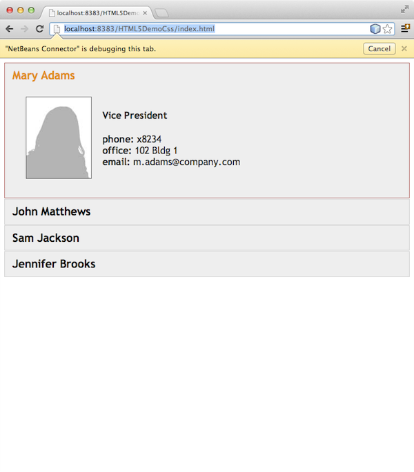
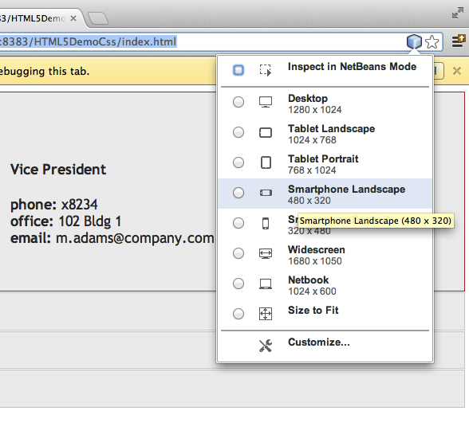
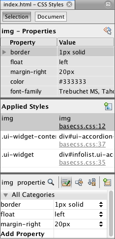
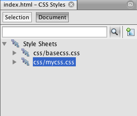
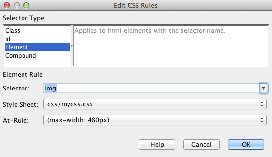
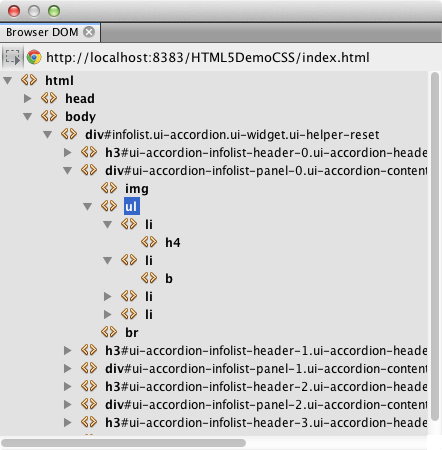
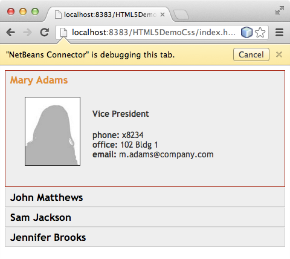

// 
//     Licensed to the Apache Software Foundation (ASF) under one
//     or more contributor license agreements.  See the NOTICE file
//     distributed with this work for additional information
//     regarding copyright ownership.  The ASF licenses this file
//     to you under the Apache License, Version 2.0 (the
//     "License"); you may not use this file except in compliance
//     with the License.  You may obtain a copy of the License at
// 
//       http://www.apache.org/licenses/LICENSE-2.0
// 
//     Unless required by applicable law or agreed to in writing,
//     software distributed under the License is distributed on an
//     "AS IS" BASIS, WITHOUT WARRANTIES OR CONDITIONS OF ANY
//     KIND, either express or implied.  See the License for the
//     specific language governing permissions and limitations
//     under the License.
//

= Working with CSS Style Sheets in an HTML5 Application
:jbake-type: tutorial
:jbake-tags: tutorials 
:jbake-status: published
:icons: font
:syntax: true
:source-highlighter: pygments
:toc: left
:toc-title:
:description: Working with CSS Style Sheets in an HTML5 Application - Apache NetBeans
:keywords: Apache NetBeans, Tutorials, Working with CSS Style Sheets in an HTML5 Application

HTML5 applications typically combine HTML, CSS and JavaScript to create applications that are run in a browser and that are displayed on a variety of devices, including smartphones, tablets and laptops. This document demonstrates how the IDE provides tools that can help you work with CSS rules to modify the layout of an application. The IDE also provides support for creating and using Sass and LESS CSS preprocessors in your application.

The NetBeans Connector extension for the Chrome browser can help you view applications as they would appear on various devices. The extension enables the Chrome browser and the IDE to communicate with each other. The Inspect in NetBeans mode can help you locate elements in your source code by selecting them in the browser. After you select an element in the browser you can use the IDE to view the CSS rules and properties that are applied to that element.

For details on how to install the NetBeans Connector extension for the Chrome browser, see the tutorial xref:html5-gettingstarted.adoc[+Getting Started with HTML5 Applications+].

To watch a screencast of this tutorial, see xref:../web/html5-css-screencast.adoc[+Video of Working with CSS Style Sheets in HTML5 Applications+].

== To complete this tutorial, you will need the following resources.

|===
|Software or Resource |Version Required 

|xref:../../../download/index.adoc[+NetBeans IDE, Java+] |7.4, 8.0 

|link:http://www.oracle.com/technetwork/java/javase/downloads/index.html[+Java Development Kit (JDK)+] |7 or 8 

|link:http://www.google.com/chrome[+Chrome Browser+] |-- 

|link:https://chrome.google.com/webstore/detail/netbeans-connector/hafdlehgocfcodbgjnpecfajgkeejnaa?utm_source=chrome-ntp-icon[+NetBeans Connector Extension for Chrome+] |1.1 or newer 

|xref:../../../index.adocprojects/samples/downloads/download/Samples/Web%20Client/HTML5DemoSiteTemplate.zip[+HTML5DemoSiteTemplate.zip+] |-- 

|CSS preprocessor |link:http://sass-lang.com/install[+Sass+] or
link:http://lesscss.org/[+LESS+] 
|===

*Notes:*

* The xref:../../../index.adocprojects/samples/downloads/download/Samples/Web%20Client/HTML5DemoSiteTemplate.zip[+HTML5DemoSiteTemplate.zip+] is a site template that you will use when you create the project.
* If you would like to compare your project with a working solution, you can download the xref:../../../index.adocprojects/samples/downloads/download/Samples/Web%20Client/HTML5DemoCssSiteTemplate.zip[+site template+] of the finished project.
* This document assumes you have some basic knowledge of, or programming experience with HTML, CSS, and JavaScript.

== Creating the HTML5 Application

In this tutorial you use a site template to create the HTML5 project. The site template that you use in this tutorial is the same template that was saved as a site template in the xref:html5-gettingstarted.adoc[+Getting Started with HTML5 Applications+] tutorial. If you performed the steps in the Getting Started tutorial you can use the site template that you saved in the last section. Alternatively, you can download the HTML5DemoSiteTemplate.zip site template.

Perform the following steps to create the application from a site template.

1. Download the HTML5 site template (xref:../../../index.adocprojects/samples/downloads/download/Samples/Web%20Client/HTML5DemoSiteTemplate.zip[+HTML5DemoSiteTemplate+])
2. Choose File > New Project (Ctrl-Shift-N; ⌘-Shift-N on Mac) in the main menu to open the New Project wizard.
3. Select the *HTML5* category and then select *HTML5 Application*. Click Next.
4. Type *HTML5DemoCss* for the project name and specify a location. Click Next.
5. Select the *Select Template* option and click Browse to locate the site template ( ``HTML5DemoSiteTemplate.zip`` ). Click Finish. 

image::images/html5-css-newproject.png[title="Specify the site templat in the New HTML5 Application wizard"]

When you click Finish the IDE creates the project and opens the  ``index.html``  file in the editor. In the Projects window you can see that the project contains  ``index.html`` , a CSS style sheet, some JavaScript libraries and some images. The CSS Rules and Navigator windows also open in the IDE.

== Viewing the Application on Different Devices

In this tutorial you will run the application in the Chrome browser with the NetBeans Connector extension installed. When the extension is installed you can use the NetBeans menu in the browser to easily resize the browser window to view the application as it would appear on some common devices.

*Notes.* For this tutorial it is recommended that you use the Chrome browser and install the NetBeans extension for Chrome. See the tutorial xref:html5-gettingstarted.adoc[+Getting Started with HTML5 Applications+] for details on how to install the NetBeans Connector extension.

Perform the following steps to run the application in the Chrome browser.

1. Confirm that Chrome with NetBeans Integration is selected in the dropdown list in the Toolbar.
2. Click the Run button in the toolbar to run the project in the Chrome browser.

In the browser you can see a simple expandable menu.

You will notice that there is a yellow bar in the browser tab that notifies you that the NetBeans Connector is debugging the tab. The IDE and the browser are connected and are able to communicate with each other when the yellow bar is visible. When you launch an HTML5 application from the IDE the JavaScript debugger is automatically enabled. When you save changes to a file or make changes to a CSS style sheet you do not need to reload the page because the browser window is automatically updated to display the changes.

If you close the yellow bar or click Cancel you will break the connection between the IDE and the browser. If you break the connection you will need to launch the HTML5 application from the IDE.

You will also notice that the NetBeans icon is visible in the URL location field of the browser. You can click the icon to open a menu that provides various options for changing the display size of the browser and for enabling the Inspect in NetBeans mode.

[start=3]
. Click the Open NetBeans Action icon in the URL field of the browser to open the NetBeans menu and select Tablet Portrait in the menu.

The window resizes to the size of a tablet browser in portrait mode. The menu stretches to fill the right side and the entire menu is visible.

If you select one of the default devices in the menu the browser window will resize to the dimensions of the device. This enables you to see how the application will look on the selected device. HTML5 applications are usually designed to respond to the size of the screen of the device on which they are viewed. You can use JavaScript and CSS rules that respond to the screen size and modify how the application is displayed so that the layout is optimized for the device.

[start=4]
. Click the NetBeans icon again and select Smartphone Landscape in the NetBeans menu. 

The window resizes to the size of a smartphone in landscape orientation and you can see that the bottom part of the menu is not visible without scrolling.

image::images/html5-css-smartphonebrowser1.png[title="Browser window resized to Smartphone Landscape"]

In the next section you will modify the style sheet so that it is possible to view the entire menu without scrolling on a smartphone in landscape view.

== Modifying the Layout

It should be possible to make some minor changes to the elements of the page so that no scrolling is required. These changes should be applied only when the size of the browser is the size of a smartphone or smaller. When oriented in landscape view, the browser window of a smartphone is 480 pixels wide and 320 pixels high.

=== Create a Media Style Sheet

In this exercise you will create a new style sheet and add a media rule for devices that have smartphone displays. You will then add some CSS Rules to the media rule.

1. Right-click the  ``css``  folder node in the Projects window and choose New > Cascading Style Sheet in the popup menu.
2. Type *mycss* as the File Name. Click Finish.

When you click Finish the new style sheet opens in the editor.

[start=3]
. Add the following media rule to the style sheet.

[source,java]
----

/*My rule for smartphone*/
@media (max-width: 480px) {

}
----

Any CSS rules that you add between the brackets for this rule will only be applied when the dimension of the browser is 480 pixels wide or less.

Create code templates for code snippets that you might use frequently. You can create CSS code templates in the Code Templates tab in the Editor category of the Options window.

[start=4]
. Save your changes.

[start=5]
. Open  ``index.html``  in the editor.

[start=6]
. Add the following link to the style sheet between the  ``<head>``  tags in  ``index.html`` . Save your changes.

[source,java]
----

<link type="text/css" rel="stylesheet" href="css/mycss.css">
----

You can use code completion in the editor to help you add the link to the style sheet.

 

=== Adding CSS Rules

1. In the Chrome browser, click the NetBeans icon and select Inspect in NetBeans Mode in the menu.
2. Click the image in the browser.

An element is highlighted when it is selected in Inspect mode. In this screenshot you can see that the image is highlighted in blue.

image::images/html5-css-selectimage.png[title="Image selected in Chrome browser"]

In the IDE you can see that the CSS rules and properties that apply to  ``img``  are listed in the CSS Styles window. The Selection tab of the CSS Styles window has three panes that provide details about the selected element.

==== Upper Pane

In the upper Properties pane of the window you can see that six property-value pairs are applied to the  ``img``  element. Three of the pairs ( ``border`` ,  ``float``  and  ``margin`` ) are applied via a CSS rule for the  ``img``  element. The remaining three pairs are applied because the  ``img``  element inherits the properties of class selectors that are applied to objects that contain the  ``img``  element. You can clearly see the structure of the DOM in the Navigator window. The  ``border``  property is currently selected in the Properties pane. of the CSS Styles window.

==== Middle Pane

In the middle Applied Styles pane you can see that the  ``border``  property and value is specified in a CSS rule that defines the  ``img``  element. The rule is located on line 12 in the  ``basecss.css``  file. You can click the location in the pane to open the style sheet in the editor.

==== Lower Pane

The lower pane displays all the properties that are defined in the CSS rule for the rule that is selected in the middle pane. In this case you can see that the rule for  ``img``  defines the  ``border`` ,  ``float``  and  ``margin-right``  properties.

[start=3]
. Click the Document tab in the CSS Styles window.

[start=4]
. Select the  ``css/mycss.css``  node and click the Edit CSS Rules button (image:images/newcssrule.png[title="Edit CSS Rules button"]) window to open the Edit CSS Rules dialog box.

[start=5]
. Select Element as the Selector Type and type *img* as the Selector.

[start=6]
. Select  ``css/mycss.css``  as the Style Sheet and *(max-width:480px)* as the At-Rule. Click OK.

When you click OK the IDE creates a CSS rule for  ``img``  in the  ``css/mycss.css``  style sheet between the brackets of the media rule. The new rule is now listed in the Applied Styles pane.

[start=7]
. Click the Selection tab in the CSS Styles window.

You can see that there are two CSS rules for  ``img`` . One of the rules is located in  ``mycss.css``  and one is located in  ``basecss.css`` .

[start=8]
. Select the new  ``img``  rule (defined in  ``mycss.css`` ) in the Applied Styles pane of the CSS Styles window. 

In the lower pane of the window you can see that the rule has no properties.

[start=9]
. Click Add Property in the left column in the lower pane of the CSS Styles window and type *width*.

[start=10]
. Type *90px* in the right column next to the  ``width``  property and hit Return on your keyboard. 

image::images/html5-css-styleswindow3.png[title="Image Properties pane of the CSS Styles window"]

When you start typing in the value column you can see that a drop-down list displays common values for the  ``width``  property.

When you hit the Return key the image in the browser is automatically resized to be 90 pixels wide. The IDE added the property to the CSS rule in the  ``mycss.css``  style sheet. In the editor the style sheet should now contain the following rule.

[source,java]
----

/*My rule for smartphone*/
@media (max-width: 480px) {

    img {
        width: 90px;
    }

}
----

Some additional changes need to be made to the style sheet because the menu still does not fit within the window.

[start=11]
. Select the unordered list ( ``<ul>`` ) element in the browser window.

image::images/html5-css-smartphonebrowser2.png[title="List element selected in browser"]

When you select the element you can see that  ``<ul>``  is selected in the Browser DOM window and you can see the styles that are applied to that element in the CSS Styles window.

If you select  ``font-family``  in the CSS Styles window you can see that the  ``font-family``  property and value are defined in the  ``.ui-widget``  class selector.

[start=12]
. Click in the  ``index.html``  file in the editor and then click the Document tab in the CSS Styles window.

[start=13]
. Expand the  ``css/mycss.css``  node in the CSS Styles window.

image::images/html5-css-styleswindow4.png[title="Style sheet selected in Document tab of CSS Styles window"]

[start=14]
. Click the Edit CSS Rules button (image:images/newcssrule.png[title="Edit CSS Rules button"]) in the CSS Styles window to open the Edit CSS Rules dialog box.

[start=15]
. Select Class as the Selector Type and type *ui-widget* as the Selector.

[start=16]
. Select * ``css/mycss.css`` * as the Style Sheet and *(max-width:480px)* as the At-Rule. Click OK.

When you click OK the IDE adds the new rule to the  ``mycss.css``  style sheet and opens the file in the editor. If the file does not open in the editor you can double-click the  ``ui-widget``  rule under the  ``css/mycss.css``  node in the CSS Styles window to open the style sheet. The cursor is placed in the line containing the rule in the style sheet.

[start=17]
. Add the following property and value (in bold) to the rule for  ``ui-widget`` .

[source,java]
----

.ui-widget {
    *font-size: 0.9em;*
}
----

When you change the value in the style sheet the page automatically updates in the browser window.

You can type the property and value in the editor and use the code completion to help you. Alternatively, you can select the  ``.ui-widget``  rule in the upper pane and click the Add Property button in the lower pane to open the Add Property dialog box.

image::images/html5-css-csseditor1.png[title="CSS code completion in the editor"]

After you add the rule you can see that the menu now fits in the page.

[start=18]
. Click the NetBeans icon in the browser and select Tablet Portrait in the menu.

When the browser window resizes you can see that the changes to the style sheet do not affect the display when the screen size is larger than 480 pixels wide.

== Using CSS Preprocessors

In addition to tools for editing standard CSS files, the IDE also supports using Sass and LESS CSS preprocessors to generate stylesheets for your applications. The IDE provides wizards for generating CSS preprocessor files and for specifying watched directories. If you specify a watched directory the CSS files will be generated automatically each time you modify the CSS preprocessor files in the directory.

*Note.* To use a CSS preprocessor you need to install the preprocessor software and specify the location of the executable. You can specify the location of the executable in the Options window.

1. Install the CSS preprocessor software on your local system.

The IDE supports the link:http://sass-lang.com/[+Sass+] and link:http://lesscss.org/[+LESS+] preprocessors. This tutorial demonstrates how to use Sass to generate the CSS files, but the configuration for LESS is similar.

*Note.* If you are installing LESS on OS X you might need to confirm that Node.js can be found in the  ``usr/bin``  directory. For details, see the following link:http://stackoverflow.com/questions/8638808/problems-with-less-sublime-text-build-system[+note+].

[start=2]
. Expand the HTML5Demo project in the Files window.

[start=3]
. Right-click the  ``public_html``  folder in the Files window and choose New > Folder in the popup menu.

If Folder is not an option in the popup menu, choose Other and then select the Folder file type in the Other category of the New File wizard.

[start=4]
. Type *scss* for the File Name. Click Finish.

When you click Finish the IDE generates the new folder in the  ``public_html``  folder.

[start=5]
. Right-click the  ``scss``  folder node in the Projects window and choose New > Sass File in the popup menu.

[start=6]
. Type *mysass* as the File Name.

[start=7]
. Click Configure to open the CSS Preprocessor tab in the Options window.

[start=8]
. Type the path to the Sass executable or click Browse to locate the executable on your local system. Click OK to close the Options window.

image::images/html5-css-cssoptions.png[title="Page viewed in browser with new CSS rules applied"]

[start=9]
. Select Compile Sass Files on Save in the New File wizard. Click OK.

image::images/html5-css-newsass.png[title="Page viewed in browser with new CSS rules applied"]

When you click OK the new Sass file  ``mysass.scss``  opens in the editor.

[start=10]
. Add the following to  ``mysass.scss``  and save your changes.

[source,java]
----

img {
    margin-right: 20px; 
    float:left; 
    border: 1px solid;

    @media (max-width: 480px) {
        width: 90px;
    }
}

.ui-widget {
    @media (max-width: 480px) {
        font-size: 0.9em;
        li {
            color: red; 
        }
    }
}
----

When you save the file the Sass preprocessor generates a new CSS file  ``mysass.css``  in the  ``css``  folder. If you open  ``mysass.css``  in the editor you can see the rules that are generated from the  ``scss``  file. By default, CSS debug information is generated in  ``mysass.css`` . When you no longer want the debug information generated you can disable generation in the CSS Preprocessors tab in the Options window.

*Notes.*

* When you want to modify the CSS rules you should edit the Sass preprocessor file  ``mysass.scss``  file and not the  ``mysass.css``  style sheet because the style sheet is regenerated each time the preprocessor file is modified and saved.
* For documentation about Sass syntax and other Sass features, see the link:http://sass-lang.com/documentation/file.SASS_REFERENCE.html#[+Sass reference+].

[start=11]
. Open  ``index.html``  and make the following changes to change the link to the style sheet from  ``mycss.css``  to  ``mysass.css`` . Save your changes.

[source,java]
----

<link type="text/css" rel="stylesheet" href="css/*mysass.css*">
----

When you save the file the page in the browser is automatically updated. You can see that the list item elements are now red.

[[summary]]
== Summary

In this tutorial, you learned how to add and modify the CSS rules of an HTML5 application to improve how the application is displayed on a device with a smaller screen size. You viewed the application in a browser that was resized to that of a standard smartphone. You used the Inspect in NetBeans Mode in the Chrome browser to help you locate CSS style rules and then modified the rules to optimize the layout for a smaller screen size.

xref:../../../community/mailing-lists.adoc[Send Feedback on This Tutorial]

[[seealso]]
== See Also

For more information about support for HTML5 applications in the IDE on xref:../../../index.adoc[+netbeans.org+], see the following resources:

* xref:html5-gettingstarted.adoc[+Getting Started with HTML5 Applications+]. A document that demonstrates how to install the NetBeans Connector extension for Chrome and creating and running a simple HTML5 application.
* xref:html5-js-support.adoc[+Debugging and Testing JavaScript in HTML5 Applications+]. A document that demonstrates how the IDE provides tools that can help you debug and test JavaScript files in the IDE.
* link:http://docs.oracle.com/cd/E50453_01/doc.80/e50452/dev_html_apps.htm[+Developing HTML5 Applications+] chapter in the link:http://www.oracle.com/pls/topic/lookup?ctx=nb8000&id=NBDAG[+Developing Applications with NetBeans IDE User's Guide+]

For more information about jQuery, refer to the official documentation:

* Official Home Page: link:http://jquery.com[+http://jquery.com+]
* UI Home Page: link:http://jqueryui.com/[+http://jqueryui.com/+]
* Tutorials: link:http://docs.jquery.com/Tutorials[+http://docs.jquery.com/Tutorials+]
* Documentation Main Page: link:http://docs.jquery.com/Main_Page[+http://docs.jquery.com/Main_Page+]
* UI Demos and Documentation: link:http://jqueryui.com/demos/[+http://jqueryui.com/demos/+]
