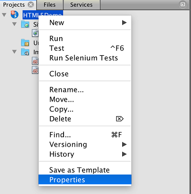
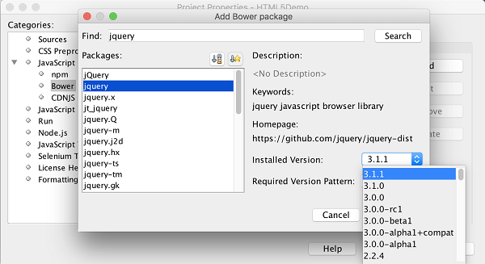

// 
//     Licensed to the Apache Software Foundation (ASF) under one
//     or more contributor license agreements.  See the NOTICE file
//     distributed with this work for additional information
//     regarding copyright ownership.  The ASF licenses this file
//     to you under the Apache License, Version 2.0 (the
//     "License"); you may not use this file except in compliance
//     with the License.  You may obtain a copy of the License at
// 
//       http://www.apache.org/licenses/LICENSE-2.0
// 
//     Unless required by applicable law or agreed to in writing,
//     software distributed under the License is distributed on an
//     "AS IS" BASIS, WITHOUT WARRANTIES OR CONDITIONS OF ANY
//     KIND, either express or implied.  See the License for the
//     specific language governing permissions and limitations
//     under the License.
//

= Getting Started with HTML5 Applications
:jbake-type: tutorial
:jbake-tags: tutorials 
:jbake-status: published
:syntax: true
:icons: font
:source-highlighter: pygments
:toc: left
:toc-title:
:description: Getting Started with HTML5 Applications - Apache NetBeans
:keywords: Apache NetBeans, Tutorials, Getting Started with HTML5 Applications

This document demonstrates how to create an HTML5 project in the IDE and some of the features in the IDE that support the use of JavaScript and CSS in your project. In this document you will create a simple HTML5 application that uses a jQuery JavaScript library to modify a list in a web page.

This document also demonstrates how to install the NetBeans Connector extension for the Chrome browser from the Chrome Web Store.

For a tutorial on how to use jQuery in a NetBeans Java web application, see the tutorial xref:../web/js-toolkits-jquery.adoc[+Using jQuery to Enhance the Appearance and Usability of a Web Page+].

To complete this tutorial, you will need the following resources:

|===
|Software or Resource |Version Required 

|link:http://www.google.com/chrome[+Chrome Browser+] |-- 

|link:https://chrome.google.com/webstore/detail/netbeans-connector/hafdlehgocfcodbgjnpecfajgkeejnaa?utm_source=chrome-ntp-icon[+NetBeans Connector Extension for Chrome+] |1.0.0 or greater 

|xref:../../../index.adocprojects/samples/downloads/download/Samples/Web%20Client/HTML5Demo-projectresources.zip[+HTML5 Demo project resources+] |-- 

|xref:../../../index.adocprojects/samples/downloads/download/Samples/Web%20Client/HTML5DemoSiteTemplate.zip[Site template of finished project] |-- 
|===

NOTE: The xref:../../../index.adocprojects/samples/downloads/download/Samples/Web%20Client/HTML5Demo-projectresources.zip[+project resources zip file+] contains the JPG images and the CSS file that you need to add to the project in this tutorial.

NOTE: If you would like to compare your project with a working solution, you can download the xref:../../../index.adocprojects/samples/downloads/download/Samples/Web%20Client/HTML5DemoSiteTemplate.zip[site template] of the finished project.

== Using the IDE with the Chrome Browser

To take full advantage of some of the tools available in the IDE that support HTML5 application development it is recommended that you use the Chrome browser and install the NetBeans Connector extension from the link:https://chrome.google.com/webstore/[+Chrome Web Store+]. You only need to install the extension once.

When installed, the NetBeans Connector extension adds a NetBeans Actions menu that is accessible from the URL location bar when you run a NetBeans HTML5 project in the Chrome browser. The NetBeans Actions menu enables you to enable Inspect in NetBeans Mode and to quickly resize the browser window to the dimensions of common display devices. The JavaScript debugger is also automatically enabled when you run an HTML5 application.

=== Installing the Extension from the Chrome Web Store

You will automatically be prompted to install the NetBeans Connector extension if you run a NetBeans HTML5 application project from the IDE and select Chrome with NetBeans Integration as the target browser. This exercise demonstrates how to install the extension by creating and running a dummy HTML5 project. You can skip this exercise and install the extension when you are prompted by the IDE or install the NetBeans Connector extension directly from the Chrome Web Store.

NOTE: The IDE will open the Chrome Web Store in the default browser. If Chrome is not set as the default browser for the IDE you need to open the Options window and select Chrome in the Web Browser dropdown list in the General category before you perform the following steps.

1. Choose File > New Project to open the New Project wizard.
2. Select *HTML5/JS Application* in the *HTML/JavaScript* category. Click Next.

image::images/html5-newproject1.png[title="HTML5 Application template in the New Project wizard"]

[start=3]
. Specify a Name and Location for the project. Click Next.

For this exercise the name is not important.

[start=4]
. Select No Site Template. Click Finish.

When you click Finish the IDE creates a new HTML5 project and opens  ``index.html``  in the editor.

[start=5]
. Confirm that Chrome with NetBeans Integration is selected in the dropdown list in the toolbar.

[start=6]
. Click Run in the toolbar.

[start=7]
. Click Go to Chrome Web Store in the Install Chrome Extension dialog box.

image::images/html5-offline-extension1.png[title="Install Chrome Extension dialog box"]

When you click Go to Chrome Web Store the NetBeans Connector page in the Chrome Web Store opens in the Chrome browser.

Note: The Install Chrome Extension displays a button that you will click after the extension is installed.

image::images/html5-rerun-dialog.png[title="Install Chrome Extension dialog box"]

[start=8]
. Go to the Chrome browser and click Add to Chrome in the NetBeans Connector page. Click Add when you are prompted to confirm that you want to add the extension.

image::images/html5-chrome-netbeanshome.png[title="NetBeans Connector page in the Chrome Web Store"]

When the extension is installed you will see a notification that the extension was added and that the NetBeans Connector icon will be visible in the URL location bar when you run a NetBeans HTML5 project in the Chrome browser.

image::images/html5-install-extension2.png[title="Confirmation in that extension was installed"]

[start=9]
. In the IDE, Click Re-Run Project in the Install Chrome Extension dialog box.

When you click Re-Run Project a new tab will open in the Chrome browser and you will see the index page of the HTML5 application.

After the extension is installed you will see the NetBeans Connector icon in the URL location bar when you run a NetBeans HTML5 project in the Chrome browser.

If you open the Chrome Extensions page ( ``chrome://extensions/`` ) for the Chrome browser you will see that the extension is now enabled.

image::images/html5-install-extension3.png[title="NetBeans Connector extension is enabled in Chrome Extensions"]

NOTE: Alternatively, you can install the NetBeans Connector extension directly from the Chrome Web Store by performing the following steps.

1. Start the Chrome browser and go to the link:https://chrome.google.com/webstore/[+Chrome Web Store+].
2. Search the Chrome Web Store for the Netbeans Connector extension.
3. Click Add To Chrome in the search results page and click Add when you are prompted to add the extension. 

image::images/html5-install-extension1.png[title="NetBeans Connector extension in Chrome Web Store"]

=== Offline Installation of the Extension

If you are unable to connect to the Chrome Web Store you can install the NetBeans Connector extension that is bundled with the IDE. If you run a NetBeans HTML5 project and you are prompted to install the NetBeans Connector extension, you can perform the following steps to install the extension if you are not able to access the Chrome Web Store.

1. Click Not Connected in the Install Chrome Extension dialog box.

image::images/html5-offline-extension1.png[title="Install Chrome extension dialog box"]

[start=2]
. Click *locate* in the dialog box to open the NetBeans IDE installation folder on your local system that contains the * ``netbeans-chrome-connector.crx`` * extension.

image::images/html5-offline-extension2.png[title="NetBeans Connector extension is enabled in Chrome Extensions"]

[start=3]
. Open the Chrome extensions page ( ``chrome://extensions/`` ) in your Chrome browser.

image::images/html5-offline-extension3.png[title="NetBeans Connector extension is enabled in Chrome Extensions"]

[start=4]
. Drag the  ``netbeans-chrome-connector.crx``  extension into the Extensions page in the browser and click Add to confirm that you want to add the extension.

After the extension is added you will see that the NetBeans Connector extension is added to the list of installed extensions.

[start=5]
. Click *Yes, the plugin is installed now* in the Install Chrome Extension dialog box to open the NetBeans HTML5 project in the Chrome browser. You will see the NetBeans Connector icon in the location bar of the browser tab.

== Using the Embedded WebKit Browser

It is recommended that you run your HTML5 applications in the Chrome browser with the NetBeans Connector extension installed when you are developing the application. The *Chrome with NetBeans Integration* option is selected by default as the run target when you create an HTML5 application. However, it is also possible to run your HTML5 application in the Embedded WebKit Browser that is bundled with the IDE.

When you run the HTML5 application in the Embedded WebKit Browser the IDE opens the Web Browser window in the IDE. The Embedded WebKit Browser supports many of the features that are enabled in the Chrome browser when the NetBeans Connector extension is installed, including Inspect mode, various screen size options and JavaScript debugging.

NOTE: When you choose Window > Web > Web Browser in the main menu the IDE opens the browser that is specified as the Web Browser in the Options window.

Perform the following steps to run an HTML5 application in the Embedded WebKit Browser.

1. Select Embedded WebKit Browser in the dropdown list in the toolbar.

image::images/html5-embedded1.png[title="List of target browsers for HTML5 applications in the dropdown list in the toolbar"]

[start=2]
. Click Run in the toolbar or right-click the project node in the Projects window and choose Run.

When you run application the Web Browser window opens in the IDE.

image::images/html5-embedded2.png[title="Embedded WebKit Browser window"]

You can click the icons in the toolbar of the Web Browser tab to enable Inspect mode and to quickly switch between different display sizes.

== Creating a NetBeans HTML5 Project

In this exercise you will use the New Project wizard in the IDE to create a new HTML5 project. For this tutorial you will create a very basic HTML5 project that only has an  ``index.html``  file. In the wizard you will also select some jQuery JavaScript libraries that you want to use in the project.

1. Select File > New Project (Ctrl-Shift-N; ⌘-Shift-N on Mac) in the main menu to open the New Project wizard.
2. Select the *HTML5/JavaScript* category and then select *HTML5/JS Application*. Click Next.

image::images/html5-newproject1.png[title="HTML5 Application template in the New Project wizard"]

[start=3]
. Type *HTML5Demo* for the Project Name and specify the directory on your computer where you want save the project. Click Next.

[start=4]
. In Step 3. Site Template, select No Site Template. Click Next.

image::images/html5-newproject2.png[title="Site Templates panel in the New HTML5 Application wizard"]

When you select the No Site Template option the wizard generates a basic empty NetBeans HTML5 project. If you click Finish now the project will only contain a Site Root folder and an  ``index.html``  file in the Site Root folder.

The Site Template page of the wizard enables you to select from a list of popular online templates for HTML5 projects or to specify the location of a  ``.zip``  archive of a site template. You can type the URL of the  ``.zip``  archive or click Browse to specify a location on your local system. When you create a project based on a site template the files, libraries and the structure of the project are determined by the template.

NOTE: You must be online to create a project that is based on one of the online templates in the list.

[start=5]
. In Step 4. Tools, select only "Bower", which is the standard HTML5 dependency management tool that you can use via the IDE.

image::images/html5-newproject3.png[title="Tools panel in the New HTML5 Application wizard"]

[start=6]
. Click *Finish* to complete the wizard.

When you click Finish the IDE creates the project and displays a node for the project in the Projects window and opens the  ``index.html``  file in the editor.

image::images/html5-projectswindow1.png[title="JavaScript Libraries panel in the New HTML5 Application wizard"]

You can now test that your project displays correctly in the Chrome browser.

[start=7]
. Confirm that Chrome with NetBeans Connector integration is selected in the browser dropdown table in the toolbar. 

image::images/html5-js-selectbrowser.png[title="Browser selected in dropdown list in toolbar"]

[start=8]
. Right-click the project node in the Projects window and choose Run.

When you choose Run the IDE opens a tab in the Chrome browser and displays the default  ``index.html``  page of the application. The Browser DOM window opens in the IDE and displays the DOM tree of the page that is open in the browser.

image::images/html5-runproject.png[title="Application in the Chrome browser tab"]

You will notice that there is a yellow bar in the browser tab that notifies you that the NetBeans Connector is debugging the tab. The IDE and the browser are connected and are able to communicate with each other when the yellow bar is visible. When you launch an HTML5 application from the IDE the JavaScript debugger is automatically enabled. When you save changes to a file or make changes to a CSS style sheet you do not need to reload the page because the browser window is automatically updated to display the changes.

If you close the yellow bar or click Cancel you will break the connection between the IDE and the browser. If you break the connection you will need to run the HTML5 application from the IDE again.

You will also notice that the NetBeans icon is visible in the URL location field of the browser. You can click the icon to open a menu that provides various options for changing the display size of the browser and for enabling the Inspect in NetBeans mode.

image::images/html5-runproject2.png[title="NetBeans menu in the Chrome browser tab"]

If you select one of the default devices in the menu the browser window will resize to the dimensions of the device. This enables you to see how the application will look on the selected device. HTML5 applications are usually designed to respond to the size of the screen of the device on which they are viewed. You can use JavaScript and CSS rules that respond to the screen size and modify how the application is displayed so that the layout is optimized for the device.

== Installing and Using Bower

In this exercise you will set up Bower (link:http://bower.io[+bower.io+]) and use it to download the JavaScript libraries that you'll use in the sections that follow.

1. Right-click the project and choose Properties.

[start=2]
. If Bower has not been installed, you will see the tab below. Click Configure Bower. If Bower has been installed, skip to step 5 below.

image::images/html5-bower-2.png[title="bower2"]

[start=3]
. Click the Install Bower link and go through the steps required for setting up Bower. To use Bower, you will also need Node, NPM, and Git. All these are standard tools used in the JavaScript ecosystem. Familiarize yourself with them if needed before continuining.

image::images/html5-bower-3.png[title="bower3"]

[start=4]
. Specify the location of the Bower installation. Click Apply.

image::images/html5-bower-4.png[title="bower4"]

[start=5]
. Back in the Bower tab, search for the  ``jquery``  and  ``jqueryui``  JavaScript libraries. By default the libraries are created in the  ``public_html/bower_components``  folder of the project. Change the  ``.bowerrc``  file in your project, if you want the libraries to be installed in a different folder.

You can use the text field in the panel to filter the list of JavaScript libraries. For example, type *jq* in the field to help you find the  ``jquery``  libraries. You can Ctrl-click the names of the libraries to select multiple libraries.

NOTE: You can click on the library version number in the Version column to open a popup window that enables you to select older versions of the library. By default the wizard displays the most recent version.

NOTE: For this tutorial, choose the latest version of the libraries.

When you have completed this step, you should see the below.

image::images/html5-bower-6.png[title="bower6"]

[start=6]
. Click OK and Bower will download the JavaScript libraries and, once the process is complete, you should see them in the Projects window.

image::images/html5-bower-7.png[title="bower7"]

== Editing the HTML File

In this exercise you will add the project resources to the project and edit the  ``index.html``  file to add links to the resources and add some CSS rules. You will see how a few simple CSS selectors when combined with JavaScript can significantly change how a page is displayed in a browser.

1. Download the xref:../../../index.adocprojects/samples/downloads/download/Samples/Web%20Client/HTML5Demo-projectresources.zip[+project resources+] archive and extract the contents.

The ZIP archive contains two folders with files that you need to add to the project:  ``pix``  and  ``css`` .

[start=2]
. Copy the  ``pix``  and  ``css``  folders into the Site Root folder.

Note: If you are looking at the directory structure of the project, you need to copy the folders into the  ``public_html``  folder.

image::images/html5-fileswindow.png[title="NetBeans menu in the Chrome browser tab"]

[start=3]
. Open `index.html` in the editor (if it is not already open).

[start=4]
. In the editor, add references to the JavaScript libraries that you added when you created the project by adding the following code (in bold) between the opening and closing  ``<head>``  tags.

[source,html]
----

<html>
  <head>
    <title></title>
    <meta charset=UTF-8">
    <meta name="viewport" content="width=device-width">
    *
    *
  </head>
  <body>
    TODO write content
  </body>
</html>
----

You can use the code completion in the editor to help you.

image::images/html5-editor1.png[title="Code completion in the editor"]

[start=5]
. Remove the default '`TODO write content`' comment and type the following code between the  ``body``  tags.

[source,html]
----

    <body>
        

            <h3><a href="#">Mary Adams</a></h3>
            

                
                <ul>
                    <li><h4>Vice President</h4></li>
                    <li><b>phone:</b> x8234</li>
                    <li><b>office:</b> 102 Bldg 1</li>
                    <li><b>email:</b> m.adams@company.com</li>
                </ul>
                 
            

            <h3><a href="#">John Matthews</a></h3>
            

                
                <ul>
                    <li><h4>Middle Manager</h4></li>
                    <li><b>phone:</b> x3082</li>
                    <li><b>office:</b> 307 Bldg 1</li>
                    <li><b>email:</b> j.matthews@company.com</li>
                </ul>
                 
            

            <h3><a href="#">Sam Jackson</a></h3>
            

                
                <ul>
                    <li><h4>Deputy Assistant</h4></li>
                    <li><b>phone:</b> x3494</li>
                    <li><b>office:</b> 457 Bldg 2</li>
                    <li><b>email:</b> s.jackson@company.com</li>
                </ul>
                 
            

            <h3><a href="#">Jennifer Brooks</a></h3>
            

                
                <ul>
                    <li><h4>Senior Technician</h4></li>
                    <li><b>phone:</b> x9430</li>
                    <li><b>office:</b> 327 Bldg 2</li>
                    <li><b>email:</b> j.brooks@company.com</li>
                </ul>
                 
            

        

    </body>
----

[start=6]
. Save your changes.

When you save your changes the page automatically reloads in the browser and the page should look similar to the following image.

image::images/html5-runproject3.png[title="Reloaded page in in the Chrome browser tab"]

[start=7]
. Type the following inline CSS rules between the  ``<head>``  tags in the file.

[source,html]
----

----

Press Ctrl-Space to use the code completion in the editor when you add the CSS rules.

image::images/html5-editor2.png[title="Code completion of CSS rules in the editor"]

If you open the Browser DOM window you can see the current structure of the page.

image::images/dom-browser.png[title="Browser DOM window showing DOM tree"]

[start=8]
. Add the following link to the style sheet (in *bold*) between the `<head>` tags.

[source,html]
----

<head>
...
    
    *<link type="text/css" rel="stylesheet" href="css/basecss.css">*
...
</head>
----

The  ``basecss.css``  style sheet is based on some of the CSS rules that are defined in the custom CSS style sheet in the jQuery "UI lightness" theme.

You can open the  ``basecss.css``  style sheet in the editor and modify the style sheet to add the CSS rules that you added in the previous step or create a new style sheet for the CSS rules.

[start=9]
. Add the following code between the  ``<head>``  tags to run a jQuery script when the elements in the page are loaded.

[source,html]
----

    **
</head>
----

jQuery works by connecting dynamically-applied JavaScript attributes and behaviors to elements of the DOM (Document Object Model). The jQuery instructions that are used in this example must be executed only after all of the elements of the DOM have been loaded by the browser. This is important because jQuery behaviors connect to elements of the DOM, and these elements must be available to jQuery in order to get the results we expect. jQuery takes care of this for us through its built-in `(document).ready` function, which follows the jQuery object, represented by `$`.

You can also use the following abbreviated version of this function.

[source,javascript]
----

$(function(){

});
----

The instructions for jQuery take the form of a JavaScript method, with an optional object literal representing an array of parameters, and must be placed between the curly braces `{}` inside the `(document).ready` function in order to execute only at the proper time, which is after the DOM has completely loaded.

[start=10]
. Add the following code (in bold) inside the `(document).ready` function, between the braces `{}`.

[source,html]
----

    
</head>
----

This code will invoke the link:http://jqueryui.com/demos/accordion/[+jQuery accordion widget+] script that is included in the link:http://jqueryui.com/[+jQuery UI library+]. The accordion script will modify the elements within the DOM object that is identified as  ``infolist`` . In this code, `#infolist` is a CSS selector connected to a unique DOM element that has an `id` attribute with the value `infolist`. It is connected using typical JavaScript dot notation ('`.`') to the jQuery instruction that uses the `accordion()` method to display this element.

In the next step you will identify an element in the page as  ``infolist`` .

NOTE: You also specified '`autoHeight: false`' in the above snippet. This prevents the accordion widget from setting the height of each panel based on the highest content part contained within the markup. For more information, consult the link:http://docs.jquery.com/UI/Accordion[+accordion API documentation+].

The  ``<head>``  section of the `index.html` file should look as follows.

[source,html]
----

<html>
    <head>
        <title></title>
        <meta charset="UTF-8">        
        <meta name="viewport" content="width=device-width">
        
        
        <link type="text/css" rel="stylesheet" href="css/basecss.css">

        
        
    </head>
----

You can tidy up your code by right-clicking in the editor and choosing Format.

[start=11]
. Modify the  ``
``  element that encloses the page contents by adding the following `id` selector and value (in bold).

[source,html]
----

<body>
    

            
----

This `
` element encloses the contents of the page (the four sets of `<h3>` tags and `
` tags that you added earlier in the tutorial).

You can add the selector to the element in the Edit CSS Rules dialog box. To open the Edit CSS Rules dialog box, right-click in the  ``
``  tag in the editor and choose Edit CSS Rules in the popup menu. Alternatively, if the insert cursor is in the  ``
``  tag in the editor you can click the Edit CSS Rules button (image:images/newcssrule.png[title="Code completion in the editor"]) in the CSS Styles window (Window > Web > CSS Styles).

image::images/html5-cssstyles.png[title="CSS Styles window"]

In the CSS Rules dialog box, select  ``id``  as the Selector Type and type *infolist* as the Selector. Confirm that Apply Changes to the Element is selected.

image::images/html5-cssrules.png[title="Edit CSS Rules dialog box"]

When you click OK in the dialog box a CSS rule for the  ``infolist``  selector is automatically added to the  ``basecss.css``  style sheet.

[start=12]
. Save your changes to  ``index.html``  (Ctrl-S; ⌘-S on Mac).

When you save your changes the page in the web browser reloads automatically. You can see that the layout of the page has changed and that the page now uses the CSS style rules that are defined in the  ``basecss.css``  style sheet. One of the lists below the  ``<h3>``  is open but the others are now collapsed. You can click an  ``<h3>``  element to expand the list.

image::images/html5-runproject5.png[title="The final project loaded in the browser"]

The jQuery accordion function now modifies all the page elements that are contained in the  ``infolist``  DOM object. In the Navigator window you can see the structure of the HTML file and that the  ``div``  element that is identified by  ``id=infolist`` .

image::images/navigator3.png[title="Browser DOM window"]

You can right-click on an element in the Navigator window and choose Go To Source to quickly navigate to the location of that element in the source file.

In the Browser DOM window you can see the DOM elements in the page that is rendered in the browser and the JQuery styles that are applied to the elements.

image::images/dom-browser3.png[title="Browser DOM window"]

When Inspect in NetBeans Mode is enabled in the browser, when you select an element in the browser window the element is highlighted in the Browser DOM window.

[[template]]
=== Saving the Project as a Site Template

You can save your project as a site template that you can use as a template to create other HTML5 sites that are based on the project. The site template can include JavaScript libraries, CSS files, images and templates for HTML files. The IDE provides a wizard to help you select the files that you want to include in the site template.

1. Right-click the project in the Projects window and choose Save as Template in the popup menu.
2. Type *HTML5DemoSiteTemplate* in the Name field and specify the location where you want to save the template.
3. Confirm that all the files are selected. Click Finish.

If you expand the nodes in the tree in the dialog box you can see the files that will be included in the site template.

image::images/html5-sitetemplate.png[title="Create Site Template dialog box"]

You can see that the site template will include the  ``index.html``  file, the CSS style sheet, the images used in the project, though not the JavaScript libraries since Bower can be used by anyone using the template to manage the libraries. The site template can also include any configuration files and tests.

When you click Finish the IDE will generate the site template as a  ``.zip``  archive.

When you want to create a project that is based on the site template you specify the location of the  ``.zip``  archive in the Site Template panel of the New Project wizard.

[[summary]]
== Summary

In this tutorial you have learned how to create an empty HTML5 project that uses a couple jQuery JavaScript libraries. You also learned how to install the NetBeans Connector extension for the Chrome browser and run the HTML5 project in the browser. When you edited the  ``index.html``  file you saw that the IDE provides some tools that can help you to edit HTML and CSS files.

