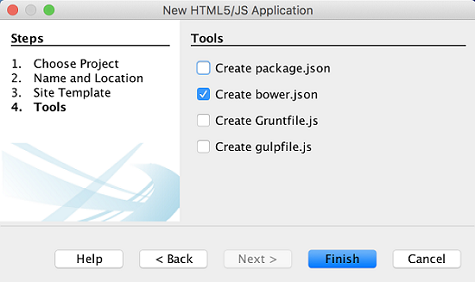
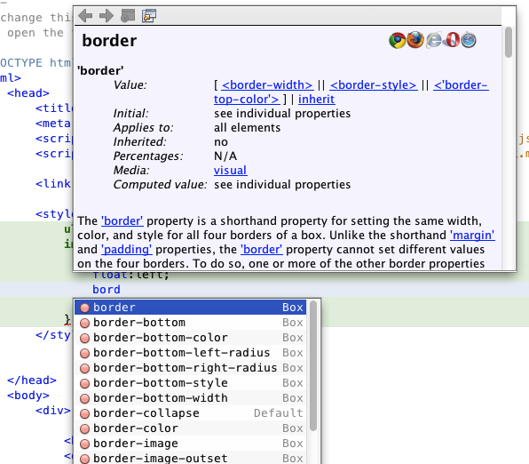
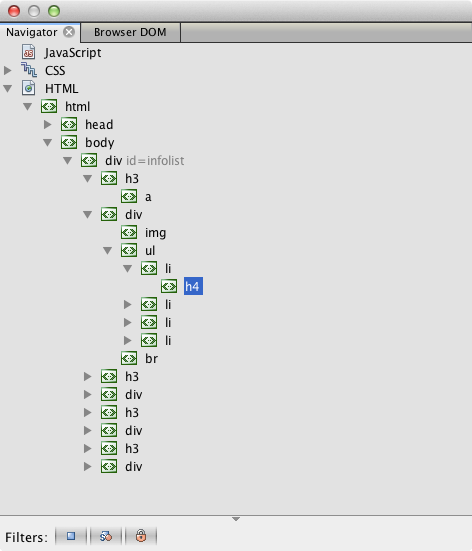

// 
//     Licensed to the Apache Software Foundation (ASF) under one
//     or more contributor license agreements.  See the NOTICE file
//     distributed with this work for additional information
//     regarding copyright ownership.  The ASF licenses this file
//     to you under the Apache License, Version 2.0 (the
//     "License"); you may not use this file except in compliance
//     with the License.  You may obtain a copy of the License at
// 
//       http://www.apache.org/licenses/LICENSE-2.0
// 
//     Unless required by applicable law or agreed to in writing,
//     software distributed under the License is distributed on an
//     "AS IS" BASIS, WITHOUT WARRANTIES OR CONDITIONS OF ANY
//     KIND, either express or implied.  See the License for the
//     specific language governing permissions and limitations
//     under the License.
//

= Начало работы с приложениями HTML5
:jbake-type: tutorial
:jbake-tags: tutorials 
:jbake-status: published
:icons: font
:syntax: true
:source-highlighter: pygments
:toc: left
:toc-title:
:description: Начало работы с приложениями HTML5 - Apache NetBeans
:keywords: Apache NetBeans, Tutorials, Начало работы с приложениями HTML5

В этом документе описывается создание проекта HTML5 в IDE и некоторые функции в IDE, которые поддерживают использование JavaScript и CSS в используемом проекте. В этом документе будет создано простое приложение HTML5, в котором будет использоваться библиотека JQuery JavaScript для изменения списка на веб-странице.

В настоящем документе также демонстрируется способ установки расширения NetBeans Connector для браузера Chrome из веб-магазина Chrome.

Для просмотра экранного рпредставления этого учебного курса см. link:../web/html5-gettingstarted-screencast.html[+Видео по началу работы с приложениями HTML5+].

Подробнее о том, как использовать JQuery в веб-приложениях Java NetBeans, см. учебный курс link:../web/js-toolkits-jquery.html[+Использование jQuery для усовершенствования внешнего вида и удобства веб-страницы+].

== Для выполнения этого учебного курса потребуются следующие материалы.

|===
|Программное обеспечение или ресурс |Требуемая версия 

|link:https://netbeans.org/downloads/index.html[+IDE NetBeans, Java+] |7.4, 8.0 

|link:http://www.oracle.com/technetwork/java/javase/downloads/index.html[+Комплект для разработчика на языке Java (JDK)+] |версия 7 или 8 

|link:http://www.google.com/chrome[+Браузер Chrome+] |-- 

|link:https://chrome.google.com/webstore/detail/netbeans-connector/hafdlehgocfcodbgjnpecfajgkeejnaa?utm_source=chrome-ntp-icon[+Расширение NetBeans Connector для Chrome+] |1.0.0 или более поздняя версия 

|link:https://netbeans.org/projects/samples/downloads/download/Samples/Web%20Client/HTML5Demo-projectresources.zip[+Демонстрационная версия ресурсов проекта HTML5+] |-- 

|link:https://netbeans.org/projects/samples/downloads/download/Samples/Web%20Client/HTML5DemoSiteTemplate.zip[+ Шаблон сайта завершенного проекта+] |-- 
|===

*Примечания.*

* Файл link:https://netbeans.org/projects/samples/downloads/download/Samples/Web%20Client/HTML5Demo-projectresources.zip[+ресурсов проекта в формате zip+] содержит изображения в формате JPG и файл CSS, который необходимо добавить к проекту в этом учебном курсе.
* При сравнении проекта с работающим решением можно загрузить link:https://netbeans.org/projects/samples/downloads/download/Samples/Web%20Client/HTML5DemoSiteTemplate.zip[+ шаблон сайта+] завершенного проекта.
* Предполагается, что читатель обладает базовыми знаниями или опытом программирования на HTML, CSS и JavaScript.

== Использование IDE с браузером Chrome

Чтобы воспользоваться некоторыми инструментами, доступными в IDE с поддержкой разработки приложений HTML5, рекомендуется использовать браузер Chrome и установить расширение NetBeans Connector link:https://chrome.google.com/webstore/[+веб-магазина Chrome+]. Расширение нужно устанавливать только один раз.

После установки расширение NetBeans Connector добавляет в меню 'Действия NetBeans', которые доступны из адресной строки URL при запуске проекта NetBeans HTML5 в браузере Chrome. В меню 'Действия NetBeans' можно включить проверку в режиме NetBeans и быстро изменить размер окна браузера в соответствии с размерами распространенных устройств отображения. Отладчик JavaScript также включается автоматически при запуске приложения HTML5.

=== Установка расширения из веб-магазина Chrome

Будет автоматически отображен запрос на установку расширения NetBeans Connector при запуске проекта приложения NetBeans HTML5 из IDE и выборе Chrome с NetBeans Integration в качестве целевого браузера. Это упражнение демонстрирует, как установить расширение путем создания и запуска фиктивного проекта HTML5. Это упражнение можно пропустить и установить расширение при появлении запроса в IDE или установить расширение NetBeans Connector напрямую из веб-магазина Chrome.

*Примечание.* IDE откроет веб-магазин Chrome в браузере, заданном по умолчанию. Если Chrome не установлен в качестве браузера по умолчанию для IDE, необходимо открыть окно настроек и выбрать Chrome в раскрывающемся списке 'Веб-браузер' в категории 'Общее', прежде чем выполнить следующие действия.

1. Выберите в меню "Файл" пункт "Новый проект", чтобы открыть мастер создания проекта.
2. Выберите 'Приложение HTML5' в категории HTML/JavaScript. Нажмите кнопку 'Далее'.
3. Задайте имя и местоположение для проекта. Нажмите кнопку 'Далее'.

Для этого упражнения имя не имеет значения.

[start=4]
. Выберите 'Без шаблона сайта'. Нажмите кнопку 'Готово'.

Когда вы нажмете кнопку 'Готово', IDE создаст новый проект HTML5 и откроет файл  ``index.html``  в редакторе.

[start=5]
. Убедитесь, что на панели инструментов в раскрывающимся списке выбран Chrome с NetBeans Integration.

[start=6]
. Нажмите кнопку 'Выполнить' на панели инструментов.

[start=7]
. Щелкните 'Перейти к веб-магазину Chrome' в диалоговом окне 'Установить расширение Chrome'.

image::images/html5-offline-extension1.png[title="Диалоговое окно 'Установить расширение Chrome'"]

При нажатии кнопки 'Перейти к веб-магазину Chrome' страница NetBeans Connector в веб-магазине Chrome откроется в браузере Chrome.

*Примечание.* В окне 'Установить расширение Chrome' отображается кнопка, после щелчка на которой выполняется установка расширения.

image::images/html5-rerun-dialog.png[title="Диалоговое окно 'Установить расширение Chrome'"]

[start=8]
. Перейдите к браузеру Chrome и нажмите кнопку 'Добавить в Chrome' на странице NetBeans Connector. Нажмите кнопку 'Добавить' при отображении запроса на подтверждение добавления расширения.

image::images/html5-chrome-netbeanshome.png[title="Страница NetBeans Connector в веб-магазине Chrome"]

Когда расширение установлено, вы увидите уведомление о том, что расширение добавлено, а значок NetBeans Connector будет отображаться в адресной строке URL при запуске проекта NetBeans HTML5 в браузере Chrome.

image::images/html5-install-extension2.png[title="Подтверждение того, что расширение было установлено"]

[start=9]
. В IDE нажмите 'Повторно запустить проект' в диалоговом окне 'Установить расширение Chrome'.

После нажатия 'Повторно запустить проект' в браузере Chrome откроется новая вкладка и отобразится страница индексов приложений HTML5.

После установки расширения вы увидите, что значок NetBeans Connector будет отображаться в адресной строке URL при запуске проекта NetBeans HTML5 в браузере Chrome.

При открытии страницы расширений Chrome ( ``chrome://extensions/`` ) для браузера Chrome вы увидите, что расширение в настоящее время включено.

image::images/html5-install-extension3.png[title="Расширение NetBeans Connector включено в расширениях Chrome"]

*Примечание.* Кроме того, можно установить расширение NetBeans Connector непосредственно из веб-магазина Chrome, выполнив следующие шаги.

1. Запустите браузер Chrome и перейдите в link:https://chrome.google.com/webstore/[+веб-магазин Chrome+].
2. Выполните поиск расширения Netbeans Connector в веб-магазине Chrome.
3. Нажмите кнопку 'Добавить к Chrome' на странице результатов поиска и нажмите кнопку 'Добавить' при отображении запроса на добавление расширения. 

image::images/html5-install-extension1.png[title="Расширение NetBeans Connector в веб-магазине Chrome"]

=== Автономная установка расширения

Если не удается подключиться к веб-магазину Chrome, можно установить расширение NetBeans Connector, который входит в комплект с IDE. Если при запуске проекта NetBeans HTML5 будет предложено установить расширение NetBeans Connector, вы можете выполнить следующие действия, чтобы установить расширение при отсутствии доступа к веб-магазину Chrome.

1. Щелкните 'Отсутствует подключение' в диалоговом окне 'Установить расширение Chrome'.

image::images/html5-offline-extension1.png[title="Диалоговое окно 'Установить расширение Chrome'"]

[start=2]
. Щелкните *найти* в диалоговом окне, чтобы открыть папку установки IDE NetBeans в локальной системе, содержащей расширение * ``netbeans-chrome-connector.crx`` *.

image::images/html5-offline-extension2.png[title="Расширение NetBeans Connector включено в расширениях Chrome"]

[start=3]
. Откройте страницу расширений Chrome ( ``chrome://extensions/`` ) в браузере Chrome.

image::images/html5-offline-extension3.png[title="Расширение NetBeans Connector включено в расширениях Chrome"]

[start=4]
. Перетащите расширение  ``netbeans-chrome-connector.crx``  на страницу 'Расширения' в браузере и нажмите кнопку 'Добавить', чтобы подтвердить добавление расширения.

После добавления расширения вы увидите, что расширение NetBeans Connector добавлено в список установленных расширений.

[start=5]
. Щелкните *Да, подключаемый модуль сейчас установлен* в диалоговом окне 'Установить расширение Chrome', чтобы открыть проект NetBeans HTML5 в браузере Chrome. Вы увидите значок NetBeans Connector в адресной строке вкладки браузера.

== Использование встроенного браузера на базе WebKit

Рекомендуется запускать приложения HTML5 в браузере Chrome с установленным расширением NetBeans Connector при разработке приложений. Параметр *Chrome с интеграцией NetBeans* выделяется по умолчанию при запуске целевого элемента при создании в приложении HTML5. Тем не менее, также возможен запуск приложений HTML5 во встроенном браузере на базе WebKit, который входит в комплект с IDE.

При запуске приложения HTML5 во встроенном браузере на базе WebKit в IDE открывается окно веб-браузера. Встроенный браузер на базе WebKit поддерживает многие функции, которые включены в браузере Chrome, при условии установки расширения NetBeans Connector, в том числе режим проверки, выбор различных вариантов размера экрана и отладка JavaScript.

*Примечание.* При выборе 'Окно' > 'Интернет' > 'Веб-браузер' в главном меню IDE открывает браузер, который указан в качестве веб-браузера в окне 'Параметры'.

Выполните следующие действия, чтобы запустить приложение HTML5 application во встроенном браузере на базе WebKit.

1. Выберите встроенный браузер на базе WebKit в раскрывающемся списке на панели инструментов.

image::images/html5-embedded1.png[title="Список целевых браузеров для приложений HTML5 в раскрывающемся списке на панели инструментов"]

[start=2]
. Нажмите 'Выполнить' на панели инструментов или щелкните правой кнопкой мыши узел проекта в окне 'Проекты' и выберите 'Выполнить'.

При запуске приложения окно веб-браузера открывается в IDE.

image::images/html5-embedded2.png[title="Окно встроенного браузера на базе WebKit"]

Можно щелкнуть значки на панели инструментов вкладки веб-браузера, чтобы включить режим проверки и быстро переключаться между различными размерами экрана.

== Создание проекта HTML5 NetBeans

В этом упражнении мы используем мастер создания проектов в IDE, чтобы создать новый проект HTML5. В этом учебном курсе создается очень простой проект HTML5, который имеет только файл  ``index.html`` . В мастере также будут выбраны некоторые библиотеки JQuery JavaScript, которые будут использоваться в проекте.

1. Выберите 'Файл' > 'Новый проект' (Ctrl-Shift-N; ⌘-Shift-N в Mac) в главном меню, чтобы открыть мастер создания проектов.
2. Выберите категорию *HTML5*, затем выберите *Приложение HTML5*. Нажмите кнопку 'Далее'.

image::images/html5-newproject1.png[title="Шаблон приложения HTML5 в мастере создания проектов"]

[start=3]
. Введите *HTML5Demo* в качестве имени проекта и укажите каталог на компьютере, где следует сохранить проект. Нажмите кнопку 'Далее'.

[start=4]
. В шаге 3. Шаблон сайта, выберите 'Без шаблона сайта'. Нажмите кнопку 'Далее'.

image::images/html5-newproject2.png[title="Панель шаблонов сайта в мастере создания приложений HTML5"]

При выборе 'Без шаблона сайта' мастер создает базовый пустой проект NetBeans HTML5. Если нажать кнопку 'Готово', проект будет содержать только папку корня сайта и файл  ``index.html``  в папке корня сайта.

Страница шаблона сайта мастера позволяет выбрать необходимое из списка популярных интерактивных шаблонов для проектов HTML5 или указать местоположение архива  ``.zip``  шаблона сайта. Можно ввести адрес URL архива  ``.zip``  или щелкнуть 'Обзор', чтобы указать местоположение в локальной системе. Когда вы создаете проект на основе шаблона сайта, файлы, библиотеки и структура проекта определяется шаблоном.

*Примечание.* Вы должны быть подключены к сети, чтобы создать проект, который основан на одном из интернет-шаблонов в списке.

[start=5]
. В шаге 4. Файлы JavaScript - выберите библиотеки JavaScript  ``jquery``  и  ``jquerygui``  на панели 'Доступные' и щелкните значок со стрелкой вправо ( > ), чтобы переместить выбранные библиотеки на панель мастера 'Выбранное'. По умолчанию библиотеки создаются в папке проекта  ``js/libraries`` . В этом учебном курсе будут использоваться "уменьшенные" версии библиотек JavaScript.

Можно использовать текстовое поле на панели, чтобы отфильтровать список библиотек JavaScript. Например, введите *jq* в поле, чтобы найти библиотеки  ``jquery`` . Вы можете удерживать нажатой клавишу Ctrl и щелкнуть левой кнопкой мыши имена библиотек для выбора нескольких библиотек.

*Примечания.*

* Можно нажать номер версии библиотеки в столбце 'Версия', чтобы открыть всплывающее окно, в котором можно выбрать предыдущие версии библиотек. По умолчанию в мастере отображается самая последняя версия.
* Минимизированные версии библиотек JavaScript - это сжатые версии, и при просмотре в редакторе код не является доступным для понимания.

[start=6]
. Для завершения мастера нажмите кнопку *Готово*.

После нажатия кнопки 'Готово' в IDE создается проект, отображается узел проекта в окне 'Проекты' и открывается файл  ``index.html``  в редакторе.

image::images/html5-projectswindow1.png[title="Панель 'Библиотеки JavaScript' в мастере создания приложений HTML5"]

Если развернуть папку  ``js/libs``  в окне 'Проекты', будет видно, что библиотеки JavaScript, которые были указаны в мастере создания проектов, были автоматически добавлены к проекту. Можно удалить библиотеку JavaScript из проекта, щелкнув правой кнопкой мыши файл JavaScript и выбрав 'Удалить' во всплывающем меню.

Чтобы добавить библиотеку JavaScript к проекту, щелкните правой кнопкой мыши узел проекта и выберите 'Свойства', чтобы открыть окно 'Свойства проекта'. Можно добавлять библиотеки к панели 'Библиотеки JavaScript' в окне 'Cвойства проекта'. Кроме того, можно скопировать файл JavaScript, который находится в локальной системе, напрямую в папку  ``js`` .

Теперь можно проверить, правильно ли отображается данный проект в браузере Chrome.

[start=7]
. Убедитесь, что на панели инструментов браузера в раскрывающимся списке выбран Chrome с NetBeans Integration.

image::images/html5-js-selectbrowser.png[title="Браузер, выбранный в раскрывающемся списке на панели инструментов."]

[start=8]
. Щелкните правой кнопкой мыши узел проекта в окне "Проекты" и выберите "Выполнить".

При выборе 'Выполнить в IDE' открывается вкладка в браузере Chrome и отображается страница  ``index.html``  по умолчанию для приложения. В среде IDE открывается окно 'Обзор DOM', в котором отображается дерево DOM открытой в браузере страницы.

image::images/html5-runproject.png[title="Приложение на вкладке браузера Chrome"]

Обратите внимание, что на вкладке браузера имеется желтая полоса, которая является уведомлением о том, NetBeans Connector выполняет отладку вкладки. IDE и браузер связаны и имеют возможность взаимодействовать друг с другом в тех случаях, когда желтая полоса видна. При запуске приложения HTML5 из IDE отладчик JavaScript включается автоматически. После сохранения изменений в файле или внесении изменений в таблицу стилей CSS не нужно перезагружать страницу, потому что окно браузера автоматически обновляется с учетом изменений.

При закрытии желтой полосы или щелчка 'Отмена' разрывается соединение между IDE и браузером. В случае разрыва соединения необходимо запустить приложение HTML5 из IDE повторно.

Также следует отметить, что значок NetBeans отображается в местоположении адреса URL поля браузера. Вы можете щелкнуть значок, чтобы открыть меню, которое предоставляет различные варианты для изменения размера изображения в браузере и для включения режима проверки в режиме NetBeans.

image::images/html5-runproject2.png[title="Меню NetBeans на вкладке браузера Chrome"]

Если выбрать одно из заданных по умолчанию устройств в меню, размер окна браузера будет изменяться в соответствии с размерами выбранного устройства. Это позволит увидеть, как приложение будет выглядеть на выбранном устройстве. Приложения HTML5 обычно реагируют на размер экрана устройства, на котором они просматриваются. Можно использовать правила JavaScript и CSS, которые реагируют на размер экрана, а также изменить способ отображения приложения таким образом, чтобы его макет был оптимизирован для устройства.

== Редактирование файла HTML

В этом упражнении будут добавлены ресурсы проекта к проекту и будет выполнено редактирование файла  ``index.html``  для добавления ссылок на ресурсы и некоторых правил CSS. Вы увидите, как несколько простых средств выбора CSS в сочетании с JavaScript могут значительно изменить то, как страница отображается в браузере.

1. Загрузите архив link:https://netbeans.org/projects/samples/downloads/download/Samples/Web%20Client/HTML5Demo-projectresources.zip[+ресурсы проекта+] и извлеките содержимое.

ZIP-архив содержит две папки с файлами, которые нужно добавить к проекту:  ``pix``  и  ``css`` .

[start=2]
. Скопируйте папки  ``pix``  и  ``css``  в корневую папку сайта.

*Примечание.* Если проанализировать структуру каталогов проекта, необходимо скопировать папки в папку  ``public_html`` .

image::images/html5-fileswindow.png[title="Меню NetBeans на вкладке браузера Chrome"]

[start=3]
. Откройте в редакторе `index.html` (если он еще не открыт).

[start=4]
. В редакторе добавьте ссылки на библиотеки JavaScript, которые были добавлены при создании проекта, добавив следующий код (выделен полужирным шрифтом) между открывающим и закрывающим тегами  ``<head>`` .

[source,xml]
----

<html>
  <head>
    <title></title>
    <meta charset=UTF-8">
    <meta name="viewport" content="width=device-width">
    *
    *
  </head>
  <body>
    TODO write content
  </body>
</html>
----

Для решения задач можно использовать функцию автозавершения кода в редакторе.

image::images/html5-editor1.png[title="Автозавершение кода в редакторе"]

[start=5]
. Удалите заданный по умолчанию комментарий '`TODO write content`' и введите следующий код между тегами  ``body`` .

[source,html]
----

    <body>
        

            <h3><a href="#">Mary Adams</a></h3>
            

                
                <ul>
                    <li><h4>Vice President</h4></li>
                    <li><b>phone:</b> x8234</li>
                    <li><b>office:</b> 102 Bldg 1</li>
                    <li><b>email:</b> m.adams@company.com</li>
                </ul>
                 
            

            <h3><a href="#">John Matthews</a></h3>
            

                
                <ul>
                    <li><h4>Middle Manager</h4></li>
                    <li><b>phone:</b> x3082</li>
                    <li><b>office:</b> 307 Bldg 1</li>
                    <li><b>email:</b> j.matthews@company.com</li>
                </ul>
                 
            

            <h3><a href="#">Sam Jackson</a></h3>
            

                
                <ul>
                    <li><h4>Deputy Assistant</h4></li>
                    <li><b>phone:</b> x3494</li>
                    <li><b>office:</b> 457 Bldg 2</li>
                    <li><b>email:</b> s.jackson@company.com</li>
                </ul>
                 
            

            <h3><a href="#">Jennifer Brooks</a></h3>
            

                
                <ul>
                    <li><h4>Senior Technician</h4></li>
                    <li><b>phone:</b> x9430</li>
                    <li><b>office:</b> 327 Bldg 2</li>
                    <li><b>email:</b> j.brooks@company.com</li>
                </ul>
                 
            

        

    </body>
----

[start=6]
. Сохраните изменения.

При сохранении изменений страница автоматически перезагружается в браузере и должна выглядеть примерно так, как показано ниже.

image::images/html5-runproject3.png[title="Перезагруженная страница на вкладке браузера Chrome"]

[start=7]
. Введите следующие встроенные правила CSS между тегами  ``<head>``  в файле.

[source,xml]
----

----

Нажмите сочетание клавиш Ctrl-Space, чтобы использовать функцию автозавершения кода в редакторе при добавлении правил CSS.

Если открыть окно 'Обзор DOM', отображается текущая структура страницы.

image::images/dom-browser.png[title="Окно 'Обзор DOM' с деревом DOM"]

[start=8]
. Добавьте следующую ссылку к странице стилей (выделена *полужирным* шрифтом) между тегами `<head>`.

[source,xml]
----

<head>
...
    
    *<link type="text/css" rel="stylesheet" href="css/basecss.css">*
...
</head>
----

Страница стилей  ``basecss.css``  основана на определенных правилах CSS, определенных на страницах стилей CSS, в теме "UI lightness" jQuery.

Можно открыть страницу стилей  ``basecss.css``  в редакторе и изменить страницу стилей для добавления правил CSS, добавленных в предыдущем шаге, или создать новую страницу стиля для правил CSS.

[start=9]
. Добавьте следующий код между тегами  ``<head>``  для запуска сценария jQuery при загрузке элементов страницы.

[source,xml]
----

    **
</head>
----

jQuery работает путем подключения динамически примененных атрибутов и поведений JavaScript к элементам модели DOM (объектной модели документа). Команды jQuery, которые будет использоваться в этом примере, должны быть выполнены только после загрузки браузером всех элементов модели DOM. Это важно, потому что поведения jQuery подключаются к элементам модели DOM, и эти элементы должны быть доступны для jQuery для получения ожидаемых результатов. jQuery выполняет это за нас с помощью встроенной функции `(document).ready`, которая следует за объектом jQuery, представленным `$`.

Также можно использовать следующую сокращенную версию этой функции.

[source,java]
----

$(function(){

});
----

Команды для jQuery принимают форму метода JavaScript с дополнительным объектным литералом, предоставляющим массив параметров, который должен быть помещен между фигурными скобками `{}` в функции `(document).ready` для выполнения только в допустимый момент, то есть после полной загрузки модели DOM.

[start=10]
. Введите следующий код (выделен полужирным шрифтом) внутри функции `(document).ready`, между скобок `{}`.

[source,xml]
----

    
</head>
----

Этот код вызовет сценарий link:http://jqueryui.com/demos/accordion/[+jQuery accordion widget+], включенный в link:http://jqueryui.com/[+библиотеку пользовательского интерфейса jQuery+]. Сценарий accordion изменит элементы в объекте DOM, идентифицированном как  ``infolist`` . В этом коде `#infolist` — это селектор CSS, подключенный к уникальному элементу DOM, имеющему атрибут `id` со значением `infolist`. С помощью обычной точечной нотации JavaScript ('`.`') он подключается к инструкции jQuery, использующей метод `accordion()` для отображения этого элемента.

В следующем шаге будет выполнена идентификация элемента на странице как  ``infolist`` .

*Примечание.* В приведенном выше фрагменте кода также было указано '`autoHeight: false`'. Это препятствует установке элементом оформления accordion высоты каждой панели на основе самой высокой части содержимого в разметке. Дополнительные сведения см. в link:http://docs.jquery.com/UI/Accordion[+документации accordion API+].

Раздел  ``<head>``  файла `index.html` должен выглядеть следующим образом.

[source,xml]
----

<html>
    <head>
        <title></title>
        <meta charset="UTF-8">        
        <meta name="viewport" content="width=device-width">
        
        
        <link type="text/css" rel="stylesheet" href="css/basecss.css">

        
        
    </head>
----

Код можно упорядочить, щелкнув правой кнопкой мыши в редакторе и выбрав 'Формат'.

[start=11]
. Измените элемент  ``
`` , заключающий содержимое страницы. путем добавления следующего средства выбора и значения `id` (выделено полужирным шрифтом).

[source,html]
----

<body>
    

            
----

Этот элемент `
` заключает содержимое страницы (четыре набора тегов `<h3>` и тегов `
`, добавленных ранее в этом учебном курсе).

Можно добавить средство выбора к элементу в диалоговом окне 'Изменить правила CSS'. Чтобы открыть диалоговое окно "Изменить правила CSS", щелкните правой кнопкой мыши тег  ``
``  в редакторе и выберите пункт меню "Изменить правила CSS". Также можно поместить курсор вставки в тег  ``
``  в редакторе и нажать кнопку "Изменить правила CSS" (image:images/newcssrule.png[title="Автозавершение кода в редакторе"]) в окне "Cтили CSS" (Окно > Веб > Стили CSS).

image::images/html5-cssstyles.png[title="Окно 'Стили CSS'"]

В диалоговом окне 'Правила CSS' выберите  ``id``  как 'Тип средства выбора' и введите *infolist* как 'Средство выбора'. Убедитесь, что установлен флажок 'Применить изменения к элементу'.

image::images/html5-cssrules.png[title="Диалоговое окно 'Изменение правил CSS'"]

При нажатии кнопки ОК в диалоговом окне правило CSS для средства выбора  ``infolist``  автоматически добавляется к таблице стилей  ``basecss.css`` .

[start=12]
. Сохраните внесенные изменения в  ``index.html``  (Ctrl-S; ⌘-S в Mac).

При сохранении изменений страница автоматически перезагружается в веб-браузере. Отображается, что макет страницы был изменен и что на странице теперь используются правила стилей CSS, которые определены в таблице стилей  ``basecss.css`` . Один из снимков ниже  ``<h3>``  открыт, но другие свернуты. Чтобы развернуть список, можно щелкнуть элемент  ``<h3>`` .

image::images/html5-runproject5.png[title="Окончательный проект будет загружен в браузер"]

Функция jQuery Accordion теперь изменяет все элементы страницы, которые содержатся в объекте DOM  ``infolist`` . В окне "Навигатор" видна структура файла HTML с элементом  ``div`` , определенным как  ``id=infolist`` .

Можно щелкнуть правой кнопкой мыши элемент в окне 'Навигатор' и выбрать 'Перейти к источнику' для быстрого перехода к местоположению этого элемента в файле исходного кода.

В окне "Обозреватель DOM" видны элементы DOM страницы, открытой в браузере, и стили JQuery, примененные к этим элементам.

image::images/dom-browser3.png[title="Окно 'Обзор DOM'"]

Если в браузере включен параметр "Проверка в режиме NetBeans", элементы, выбранные в окне браузера, подсвечиваются в окне "Обозреватель DOM".

[[template]]
== Сохранение проекта как шаблона сайта

Можно сохранить проект в виде шаблона сайта, который можно использовать в качестве шаблона для создания других сайтов HTML5, которые основаны на проекте. Шаблон сайта может включать в себя библиотеки JavaScript, файлы CSS, изображения и шаблоны для HTML файлов. IDE предоставляет мастеру вспомогательные средства, позволяющие выбрать файлы, которые необходимо включить в шаблон сайта.

1. Правой кнопкой мыши щелкните проект в окне 'Проекты' и выберите 'Сохранить как шаблон' во всплывающем меню.
2. Введите *HTML5DemoSiteTemplate* в поле 'Имя' и укажите местоположение сохранения шаблона.
3. Убедитесь, что выбраны все файлы. Нажмите кнопку 'Готово'.

Если развернуть узлы дерева в диалоговом окне, можно просмотреть файлы, которые будут включены в шаблон сайта.

image::images/html5-sitetemplate.png[title="Диалоговое окно 'Создать шаблон сайта'"]

Отображается, что шаблон сайта будет включать файл  ``index.html`` , таблицу стилей CSS и изображения, используемые в проекте, а также наличие библиотек JavaScript. Шаблон сайта может также включать любые файлы конфигурации и тесты.

При нажатии на кнопку "Готово" IDE создает шаблон сайта в виде архива  ``.zip`` .

Если необходимо создать проект, основанный на шаблоне сайта, укажите местоположение архива  ``.zip``  на панели 'Шаблон сайта' мастера создания проектов.

[[summary]]
== Заключение

В этом учебном курсе вы узнали, как создавать пустой проект HTML5, в котором используется пара библиотек jQuery JavaScript. Вы также узнали, как создавать расширение NetBeans Connector для браузера Chrome и запускать проект HTML5 в браузере. При изменении файла  ``index.html``  отображается, что IDE предоставляет определенные средства, которые можно использовать для редактирования файлов HTML и CSS.

link:/about/contact_form.html?to=3&subject=Feedback:%20Getting%20Started%20with%20HTML5%20Applications[+Отправить отзыв по этому учебному курсу+]

[[seealso]]
== См. также

Подробнее о поддержке приложений HTML5 в IDE см. в следующих материалах на сайте link:https://netbeans.org/[+www.netbeans.org+]:

* link:html5-editing-css.html[+Работа со страницами стилей CSS в приложениях HTML5+] Документ, который продолжает работу с приложением, которое было создано в этом учебном курсе. Он показывает, как использовать некоторые из мастеров CSS и окон в IDE и как использовать режим проверки в браузере Chrome для визуального определения элементов в источниках проекта.
* link:html5-js-support.html[+Отладка и тестирование JavaScript в приложениях HTML5+] Документ, который демонстрирует, как IDE предоставляет инструменты, которые могут использоваться в отладке и тестировании файлов сценариев JAVA в IDE.

Дополнительные сведения о jQuery доступны в официальной документации:

* Официальная домашняя страница: link:http://jquery.com[+http://jquery.com+]
* Домашняя страница UI: link:http://jqueryui.com/[+http://jqueryui.com/+]
* Учебные курсы: link:http://docs.jquery.com/Tutorials[+http://docs.jquery.com/Tutorials+]
* Главная страница документации: link:http://docs.jquery.com/Main_Page[+http://docs.jquery.com/Main_Page+]
* Демонстрации интерфейса пользователя и документация: link:http://jqueryui.com/demos/[+http://jqueryui.com/demos/+]
