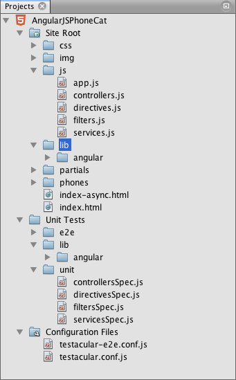
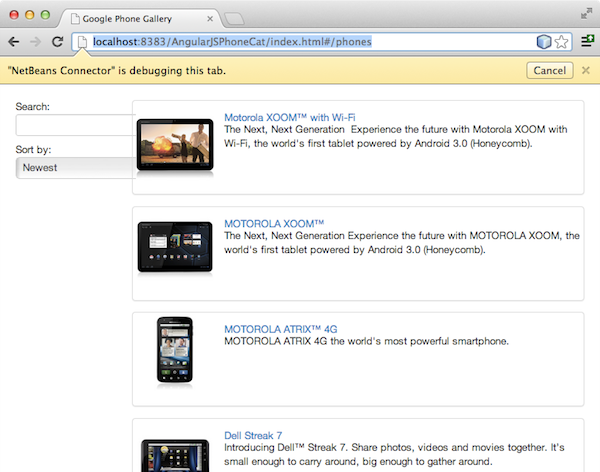
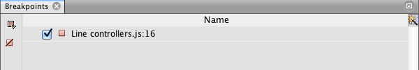
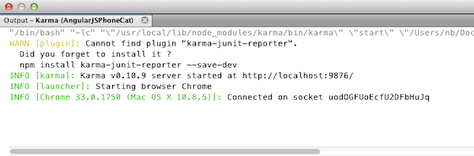
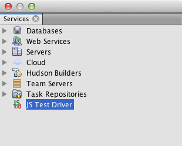
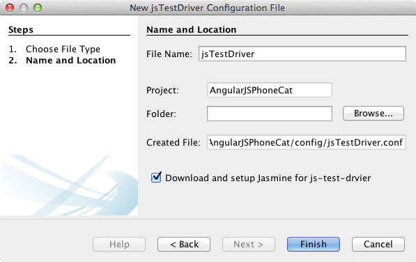
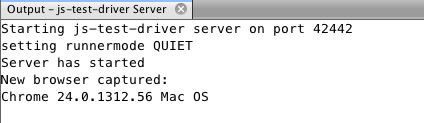
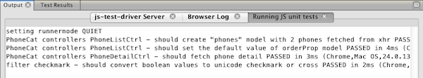
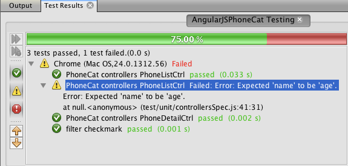
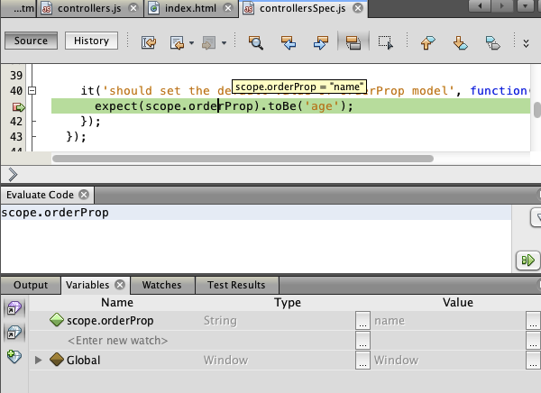

// 
//     Licensed to the Apache Software Foundation (ASF) under one
//     or more contributor license agreements.  See the NOTICE file
//     distributed with this work for additional information
//     regarding copyright ownership.  The ASF licenses this file
//     to you under the Apache License, Version 2.0 (the
//     "License"); you may not use this file except in compliance
//     with the License.  You may obtain a copy of the License at
// 
//       http://www.apache.org/licenses/LICENSE-2.0
// 
//     Unless required by applicable law or agreed to in writing,
//     software distributed under the License is distributed on an
//     "AS IS" BASIS, WITHOUT WARRANTIES OR CONDITIONS OF ANY
//     KIND, either express or implied.  See the License for the
//     specific language governing permissions and limitations
//     under the License.
//

= Debugging and Testing JavaScript in an HTML5 Application
:jbake-type: tutorial
:jbake-tags: tutorials 
:jbake-status: published
:icons: font
:syntax: true
:source-highlighter: pygments
:toc: left
:toc-title:
:description: Debugging and Testing JavaScript in an HTML5 Application - Apache NetBeans
:keywords: Apache NetBeans, Tutorials, Debugging and Testing JavaScript in an HTML5 Application

HTML5 applications typically combine HTML, CSS and JavaScript to create applications that are run in a browser and that are displayed on a variety of devices, including smartphones, tablets and laptops. This document demonstrates how the IDE provides tools that can help you debug and test JavaScript files in the IDE.

When you want to debug the JavaScript files in your HTML5 application it is recommended that you install the NetBeans Connector extension for the Chrome browser. Debugging is enabled automatically when you run the application in the browser and the extension is installed.

The IDE also enables you to easily configure and run unit tests on JavaScript files using the Jasmine testing framework and the Karma or the JS Test Driver test runners. You can configure the test runner to run unit tests against a variety of browsers and you can quickly specify the JavaScript libraries, scripts and tests that you want the IDE to load when running the tests. When a test fails you can use the debugger to help you locate the problematic code.

For details on how to install the NetBeans Connector extension for the Chrome browser, see the tutorial xref:html5-gettingstarted.adoc[+Getting Started with HTML5 Applications+].

For more information on the JavaScript editing features in the IDE, see link:http://docs.oracle.com/cd/E50453_01/doc.80/e50452/dev_html_apps.htm#BACFIFIG[+Creating JavaScript Files+] in the link:http://www.oracle.com/pls/topic/lookup?ctx=nb8000&id=NBDAG[+Developing Applications with NetBeans IDE User's Guide+].

To watch a screencast of this tutorial, see xref:../web/html5-javascript-screencast.adoc[+Video of Testing and Debugging JavaScript in HTML5 Applications+].

== To complete this tutorial, you will need the following resources.

|===
|Software or Resource |Version Required 

|xref:../../../download/index.adoc[+NetBeans IDE, Java+] |8.0 

|link:http://www.oracle.com/technetwork/java/javase/downloads/index.html[+Java Development Kit (JDK)+] |7 or 8 

|link:http://www.google.com/chrome[+Chrome Browser+] |-- 

|link:https://chrome.google.com/webstore/detail/netbeans-connector/hafdlehgocfcodbgjnpecfajgkeejnaa?utm_source=chrome-ntp-icon[+NetBeans Connector Extension for Chrome+] |1.x 

|link:http://code.google.com/p/js-test-driver/[+JS Test Driver JAR+] |-- 
|===

*Notes:*

* This document uses JS Test Driver server to run the JavaScript unit tests. You might want to familiarize yourself with the properties of the server at the link:http://code.google.com/p/js-test-driver/[+JS Test Driver project home+].
* This document assumes you have some basic knowledge of, or programming experience with HTML, CSS, and JavaScript.

== Creating the HTML5 Sample Application

Perform the following steps to create the HTML5 sample application from a site template.

1. Choose File > New Project (Ctrl-Shift-N; ⌘-Shift-N on Mac) in the main menu to open the New Project wizard.
2. Expand the *Samples* node in the New Project wizard and select the *HTML5* category.
3. Select the *AngularJS Phone Catalog Tutorial* project. Click Next.

image::images/html5-js-newproject.png[title="AngularJS Phone Catalog Tutorial sample project in New File wizard"]

[start=4]
. Specify a location for the project. Click Finish.

*Note.* Note that the URL of the template is github. The IDE needs to be able to access the network to retrieve the template archive. Check your proxy settings in the Options window if you encounter problems downloading the archive.

When you click Finish the IDE creates the project and opens the  ``index.html``  file in the editor. In the Projects window you can see that the project contains  ``index.html``  and various CSS style sheets and JavaScript files and libraries.

The project also includes several JavaScript unit test and configuration files that were generated by default.

[start=5]
. Confirm that Chrome with NetBeans Connector is selected in the dropdown list in the toolbar.

image::images/html5-js-selectbrowser.png[title="Browser selected in dropdown list in toolbar"]

[start=6]
. Click the Run button in the toolbar (F6) or right-click the project node in the Projects window and choose Run.

When you Run the project the front page of the HTML5 application opens in the Chrome browser and you can see a list of mobile phones. When you click the name of a mobile phone the page displays the phone details.

You will notice that there is a yellow bar in the browser tab that notifies you that the NetBeans Connector is debugging the tab. The IDE and the browser are connected and are able to communicate with each other when the yellow bar is visible. When you launch an HTML5 application from the IDE the JavaScript debugger is automatically enabled. When you save changes to a file or make changes to a CSS style sheet you do not need to reload the page because the browser window is automatically updated to display the changes.

If you close the yellow bar or click Cancel you will break the connection between the IDE and the browser. If you break the connection you will need to run the HTML5 application from the IDE again to use JavaScript debugger.

You will also notice that the NetBeans icon is visible in the URL location field of the browser. You can click the icon to open a menu that provides various options for changing the display size of the browser and for enabling the Inspect in NetBeans mode.

== Using the JavaScript Debugger

In this exercise you will place a breakpoint in a JavaScript file and run the application. You can use the tooltip in the editor to quickly see the values of variables.

1. Expand the  ``js``  node in the Projects window and double-click  ``controllers.js``  to open the file in the editor.
2. Place a line breakpoint on line 16 in  ``controllers.js``  by clicking in the left margin. 

image::images/html5-js-breakpoint1.png[title="Breakpoint set in editor"]

You can view the breakpoints that are set in the project by choosing Window > Debugging > Breakpoints to open the Breakpoints window.

[start=3]
. Click the Run button in the toolbar to run the project again.

When you run the project you will see the same page because the breakpoint that you set was not hit.

[start=4]
. In the browser, click one of the entries in the page, for example, Motorola Atrix4G.

You will see that the page is partially loaded but that the data for the phone is missing because the data has not been passed to the JavaScript and rendered.

image::images/html5-js-break-details.png[title="Details page of the application is partially loaded in the browser"]

[start=5]
. In the editor in the IDE you can see that the breakpoint was hit and that the Program Counter is currently in line 16 of  ``controllers.js`` .

[start=6]
. Hover your cursor over the  ``phone``  variable to view a tooltip with information about the variable.

image::images/html5-js-variables1.png[title="Variables tooltip in editor"]

In the tooltip you can see the following information:  ``phone = (Resource) Resource`` .

[start=7]
. Click the tooltip to expand the tooltip and view a list of the variables and values.

image::images/html5-js-variables.png[title="Expanded variables tooltip in editor"]

For example, when you expand the  ``android``  node you can see the values of the strings  ``os``  and  ``ui`` .

You can also choose Window > Debugging > Variables to view the list in the Variables window.

[start=8]
. Use the step buttons in the toolbar to step through the JavaScript functions in the  ``angular.js``  library or click the Continue button (F5) to resume the application.

== Running JS Unit Tests

You can easily configure the IDE to use the Karma or JS Test Driver test runners to run your unit tests. Karma and JS Test Driver are test runners that provide a URL that is the target for running JavaScript unit tests.

In this tutorial you will use Karma to run the JavaScript unit tests that are included with the sample project. The sample project already includes a Karma configuration file. When you run your tests the test runner server starts and waits to run the tests. Your browser opens and displays a status message in the window that confirms that the server is running and waiting.

=== How to Run Tests with Karma

To run tests with Karma you first need to download Karma to you local file system. After you install Karma you need to create a Karma configuration file and then specify the location of the installation and configuration file in the Project Properties window.

1. Install Karma.

You can choose how and where you want to install Karma. You will specify the installation later when you configure the project to use Karma. You can find information about the options for installing Karma on the link:http://karma-runner.github.io[+Karma website+].

[start=2]
. Create a Karma configuration file.

In this tutorial this step is optional because the sample application already includes a Karma configuration file. You can create a skeleton Karma configuration file by selecting Karma Configuration File in the Unit Tests category of the New File wizard.

image::images/karma-new-config.png[title="New Karma Configuration File in the New File wizard"]

Alternatively, you can run the Karma  ``init``  command on the command line. See the Karma documentation for more details on using the Karma  ``init``  command.

[start=3]
. Expand the Configuration Files node in the Projects window and double-click  ``karma.conf.js``  to open the file in the editor. Note that the sample includes two Karma configuration files.

In the Karma configuration file you can see the files that will be included and excluded when you run the tests. You can also see the Karma plugins that are required to run the tests with this configuration.

image::images/karma-plugins.png[title="Karma configuration file in the editor"]

[start=4]
. Right-click the project node in the Projects window and choose Properties in the popup menu.

[start=5]
. Select JavaScript Testing category in the Categories pane of the Project Properties window.

[start=6]
. Select Karma in the Testing Provider drop-down list. Click OK.

[start=7]
. Open the Project Properties window again and select Karma under the JavaScript Testing category in the Categories pane.

[start=8]
. Specify the location of your Karma installation.

If you installed Karma in your project directory you can click Search and the IDE will find the installation. You can also click Browse to manually locate your local Karma installation.

[start=9]
. Specify the location of your Karma configuration file. Click OK.

In this tutorial you can click Search and the IDE will find the default Karma configuration file. You can also click Browse to manually locate a configuration file.

image::images/karma-properties-window.png[title="Karma category in Project Properties window"]

When you click OK you can see that a Karma node appears under the project node in the Projects window. You right-click the Karma node and start and stop the Karma server and set the configuration file in the popup menu.

[start=10]
. Right-click the Karma node in the Projects window and choose Start in the popup menu.

When you click Start the Karma server starts and a browser window opens that displays the status of the server.

image::images/karma-chrome.png[title="Karma server status in the Chrome browser window"]

In the Output window you can see the status of the server. You are also prompted to install any missing plugins.

*Note.* The browser window must be open and the Karma server must be running to run the unit tests.

[start=11]
. Right-click the Karma node and choose Set Configuration >  ``karma.conf.js``  to confirm that the correct configuration file is selected. image:../../../images_www/articles/80/webclient/html5-js/karma-node.png[title="Configure jsTest Driver node in Services window"]

[start=12]
. Disable any breakpoints that you set in the project.

You can disable the breakpoints by deselecting the checkbox for the breakpoints in the Breakpoints window.

[start=13]
. Right-click the project node in the Projects window and choose Test.

When you choose Test the test runner runs the unit tests on the files. The IDE opens the Test Results window and displays the results of the test.

image::images/karma-test-results.png[title="Karma test results"]

=== How to Run Test with JS Test Driver

If you want to use JS Test Driver, the IDE provides a configuration dialog for JS Test Driver that you can open from the JS Test Driver node in the Services. The configuration dialog enables you to easily specify the location of the JS Test Driver server JAR and the browsers that you want to run tests against. The JS Test Driver node enables you to quickly see if the server is running and to start and stop the server.

For more details on configuring the JS Test Driver server, see the link:http://code.google.com/p/js-test-driver/wiki/GettingStarted[+Getting Started with JsTestDriver+] documentation.

1. Download the link:http://code.google.com/p/js-test-driver/[+JS Test Driver JAR+] and save the JAR to your local system.
2. In the Services window, right-click the JS Test Driver node and choose Configure. 

[start=3]
. In the Configure dialog box, click Browse and locate the JS Test Driver JAR that you downloaded.

[start=4]
. Select the Chrome with NetBeans Connector (in NetBeans IDE 7.3, select Chrome with NetBeans JS Debugger) for the browser. Click OK.

image::images/html5-js-testdriver-configure.png[title="Configure jsTest Driver dialog box"]

*Notes.* You only need to specify the location of the JS Test Driver JAR the first time that you configure the JS Test Driver.

The list of browsers that can be captured and used for testing is based on the browsers that are installed on your system. You can select multiple browsers as slave browsers, but to run the tests a window that can be a slave for the server must be open for each browser. The selected browsers will be captured automatically when you start the server from the IDE.

When you select Chrome with NetBeans Connector you can debug your tests that are run with JS Test Driver.

[start=5]
. Right-click the project node in the Projects window and choose New > Other.

[start=6]
. Select the *jsTestDriver Configuration File* in the Unit Tests category. Click Next.

[start=7]
. Confirm that *jsTestDriver* is the File Name.

[start=8]
. In the Created File field, confirm that the location for the file is the  ``config``  folder of the project ( ``AngularJSPhoneCat/config/jsTestDriver.conf`` ).

*Note.* The  ``jsTestDriver.conf``  configuration file must be in the  ``config``  folder of the project. If the location for the created file is not the  ``config``  folder, click Browse and select  ``AngularJSPhoneCat - Configuration Files``  folder in the dialog box.

[start=9]
. Confirm that the checkbox for downloading the Jasmine libraries is selected. Click Finish.

*Note.*You need to download the Jasmine libraries to run jsTestDriver. If you are notified that the IDE is unable to download the Jasmine libraries, check the proxy settings of the IDE in the Options window.

When you click Finish the IDE generates a skeleton  ``jsTestDriver.conf``  configuration file and opens the file in the editor. In the Projects window you can see that the configuration file is created under the Configuration Files node. If you expand the  ``lib``  folder under the Unit Tests node you can see that the Jasmine libraries were added to the project.

image::images/html5-js-testdriver-projectswindow.png[title="Unit Tests folder in the Projects window"]

In the editor you can see the following contents of the configuration file that are generated by default:

[source,java]
----

server: http://localhost:42442

load:
  - test/lib/jasmine/jasmine.js
  - test/lib/jasmine-jstd-adapter/JasmineAdapter.js
  - test/unit/*.js

exclude:

----

The configuration file specifies the default location of the local server that is used to run the tests. The file also lists the files that must be loaded. By default the list includes the Jasmine libraries and any JavaScript files that are in the  ``unit``  folder. Tests are usually located in the  ``unit``  folder but you can modify the list to specify the locations of other files that need to be loaded to run the tests. To run the unit tests you also need to add the location of the JavaScript files that you want to test and the Angular JavaScript libraries to the list of files that are loaded.

For this tutorial, if you want to run the tests using JS Test Driver you will want to add the following files (in bold) to the list of files that are loaded.

[source,java]
----

load:
    - test/lib/jasmine/jasmine.js
    - test/lib/jasmine-jstd-adapter/JasmineAdapter.js
*
    - app/lib/angular/angular.js
    - app/lib/angular/angular-mocks.js
    - app/lib/angular/angular-route.js
    - app/lib/angular/angular-animate.js
    - app/lib/angular/angular-resource.js
    - app/js/*.js
*
    - test/unit/*.js
----

[start=10]
. After you update the configuration file you can right-click the project node in the Projects window and choose Test.

When you click Test the IDE automatically opens the JS Test runner in the Chrome browser and two tabs in the Output window.

image::images/html5-js-testdriver-browserwindow.png[title="jsTestDriver running in the browser window"]

The Chrome browser window displays a message when the jsTestDriver server is running. You can see that the server is running on  ``localhost:42442`` . In the js-test-driver Server tab in the Output window you can see the status of the server.

Note that the JsTestDriver is running in a browser tab and that the NetBeans Connector is debugging the tab. You can debug your unit tests if you run tests with JS Test Driver and select Chrome with NetBeans Connector as one of the target browsers.

*Note.* The browser window must be open and the jsTestDriver server must be running to run the unit tests. You can start the server and open the window by right-clicking the JS Test Driver node in the Services window and choosing Start.

[start=11]
. Choose Window > Output > Test Results in the main menu to open the Test Results window and see the results of the tests.

image::images/html5-js-testdriver-testresultswindow.png[title="Test Results window"]

You can click the green check icon in the left margin of the window to view the the expanded list of the tests that passed.

== Debugging a JS Unit Test with JS Test Driver

This exercise demonstrates how you can use the IDE and JS Test Driver to debug your unit tests.

*Note.* NetBeans IDE 8.0 does not support debugging tests that are run with the Karma test runner.

1. Expand the  ``js``  folder in the Projects window and double-click  ``controllers.js``  to open the file in the editor.
2. Modify line 7 in the file to make the following changes (in *bold*). Save your changes.

[source,java]
----

function PhoneListCtrl($scope, Phone) {
  $scope.phones = Phone.query();
  $scope.orderProp = '*name*';
}
----

When you save your changes the page automatically reloads in the browser. You can see that the order of the phones in the list changed.

[start=3]
. Confirm that the JS Test Driver server is running and that the status message is visible in the Chrome browser window.

[start=4]
. Right-click the project node in the Projects window and choose Test.

When you run the test you can see that one of the tests failed with the message that the value "name" was encountered instead of the expected value "age".

[start=5]
. Open the Running JS unit tests tab in the Output window.

image::images/html5-js-testdriver-outputwindow-fail.png[title="Failed test in Running JS unit tests tab in Output window"]

You can see in the message that the  ``orderProp``  is expected to be  ``age``  on line 41.

[start=6]
. Click the link in the Running JS unit tests tab to navigate to the line in the test that failed. The test file  ``controllersSpec.js``  opens in the editor at line 41 (in *bold*)

[source,java]
----

it('should set the default value of orderProp model', function() {
      *expect(scope.orderProp).toBe('age');*
    });
----

You can see that the test expected "age" as the value of  ``scopeOrder.prop`` .

[start=7]
. Set a breakpoint at the line where the test failed (line 41).

[start=8]
. Right-click the project node in the Projects window and choose Test.

When you run the test again the program counter hits the breakpoint. If you hover your cursor over  ``scopeOrder.prop``  you can see in the tooltip that the value of the variable is "name" when the breakpoint is hit.

Alternatively, you can choose Debug > Evaluate Expression in the main menu to open the Evaluate Code window. If you type the expression  ``scopeOrder.prop``  in the window and click the Evaluate Code Fragment button (image:images/evaluate-button.png[title="Evaluate Expression button"])(Ctrl-Enter) the debugger displays the value of the expression in the Variables window.

[start=9]
. Click Continue in the toolbar to finish running the test.

[[summary]]
== Summary

In this tutorial you learned how the IDE provides tools that can help you debug and run unit tests on JavaScript files. Debugging is automatically enabled for HTML5 applications when you run the application in the Chrome browser and the NetBeans Connector extension is enabled. The IDE also enables you to easily configure and run unit tests on JavaScript files using the Jasmine testing framework and the JS Test Driver server.

xref:../../../community/mailing-lists.adoc[Send Feedback on This Tutorial]

[[seealso]]
== See Also

For more information about support for HTML5 applications in the IDE on xref:../../../index.adoc[+netbeans.org+], see the following resources:

* xref:html5-gettingstarted.adoc[+Getting Started with HTML5 Applications+]. A document that demonstrates how to install the NetBeans Connector extension for Chrome and creating and running a simple HTML5 application.
* xref:html5-editing-css.adoc[+Working with CSS Style Sheets in HTML5 Applications+]. A document that demonstrates how to use some of the CSS wizards and windows in the IDE and how to use the Inspect mode in the Chrome browser to visually locate elements in your project sources.
* link:http://docs.oracle.com/cd/E50453_01/doc.80/e50452/dev_html_apps.htm[+Developing HTML5 Applications+] chapter in the link:http://www.oracle.com/pls/topic/lookup?ctx=nb8000&id=NBDAG[+Developing Applications with NetBeans IDE User's Guide+]

For more information about running unit tests using JS Test Driver, refer to the following documentation:

* JS Test Driver Project Page: link:http://code.google.com/p/js-test-driver/[+http://code.google.com/p/js-test-driver/+]
* Jasmine Home Page: link:http://pivotal.github.com/jasmine/[+http://pivotal.github.com/jasmine/+]
* link:http://transitioning.to/2012/07/magnum-ci-the-jenkins-chronicles-1-intro-to-jstestdriver/[+Intro to JsTestDriver+]. An introduction to using JsTestDriver with a continuous integration server.
