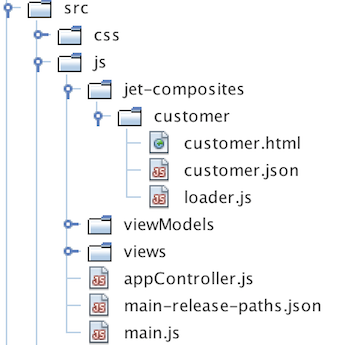
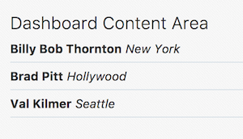

// 
//     Licensed to the Apache Software Foundation (ASF) under one
//     or more contributor license agreements.  See the NOTICE file
//     distributed with this work for additional information
//     regarding copyright ownership.  The ASF licenses this file
//     to you under the Apache License, Version 2.0 (the
//     "License"); you may not use this file except in compliance
//     with the License.  You may obtain a copy of the License at
// 
//       http://www.apache.org/licenses/LICENSE-2.0
// 
//     Unless required by applicable law or agreed to in writing,
//     software distributed under the License is distributed on an
//     "AS IS" BASIS, WITHOUT WARRANTIES OR CONDITIONS OF ANY
//     KIND, either express or implied.  See the License for the
//     specific language governing permissions and limitations
//     under the License.
//

= Composite Component Architecture in Oracle JET
:jbake-type: tutorial
:jbake-tags: tutorials 
:jbake-status: published
:icons: font
:syntax: true
:source-highlighter: pygments
:toc: left
:toc-title:
:description: Composite Component Architecture in Oracle JET - Apache NetBeans
:keywords: Apache NetBeans, Tutorials, Composite Component Architecture in Oracle JET

This document provides a step-by-step set of instructions guiding you through the process of creating link:http://www.oracle.com/webfolder/technetwork/jet/jetCookbook.html?component=composite&demo=basic[+Composite Components+] with the link:http://oraclejet.org[+Oracle JavaScript Extension Toolkit (JET)+]. JET empowers web and mobile developers by providing a modular toolkit based on modern JavaScript, CSS3, and HTML5 design and development principles.

== Setting Up an Oracle JET Application

In this exercise you set up an Oracle JET application and explore its default content.

1. Follow the steps described in xref:ojet-settingup.adoc[+Setting Up an Oracle JET Application+].

[start=2]
. Open the project into an editor or IDE of your choice, such as NetBeans IDE, which displays the application as follows:

image::images/navdrawer.png[]

Spend some time browsing through the application structure. In the next section, you'll be introduced to the main concepts of the application structure.

== Creating a CCA Component

In this exercise, you create your first link:http://www.oracle.com/webfolder/technetwork/jet/jetCookbook.html?component=composite&demo=basic[+CCA component+], which is Oracle's implementation of the link:https://www.w3.org/standards/techs/components#w3c_all[+W3C Web Component Standard+].

1. In  ``src/js``  create a folder named  ``jet-composites``  or any other name. In that folder, create another folder, named  ``customer`` . In the  ``customer``  folder, create the three files you see below, that is,  ``customer.html`` ,  ``customer.json``  and  ``loader.js`` , shown below:

[start=2]
. In  ``customer.html`` , paste the below:

[source,xml]
----

<b data-bind="text: $props.name"></b>
<i data-bind="text: $props.city"></i>

----

[start=3]
. 
In  ``customer.json`` , paste the below:

[source,java]
----

{
  "properties": {
    "name": {
      "description": "Customer name.",
      "type": "string"
    },
    "city": {
      "description": "Customer location.",
      "type": "string"
    }
  }
}
----

[start=4]
. 
In  ``loader.js`` , paste the below:

[source,java]
----

define(['ojs/ojcore', 
    'text!./customer.html', 
    'text!./customer.json', 
    'ojs/ojcomposite'],
  function(oj, view, metadata) {
    oj.Composite.register('my-customer', {
      view: {inline: view}, 
      metadata: {inline: JSON.parse(metadata)}
    });
  }
);
----

When you name your CCA component, such as  ``my-customer``  above, link:https://www.w3.org/TR/custom-elements/#valid-custom-element-name[+see this information+] and link:https://mothereff.in/custom-element-name[+validate your name here+].

You have now created a simple CCA component, providing the  ``my-customer``  custom element.

== Using a CCA Component

In this exercise, you use the CCA component you created in the previous section.

1. In the HTML file of one or more of your Oracle JET modules, use the CCA component as follows:

[source,xml]
----

<!-- ko foreach: customers -->
  <my-customer name="{{name}}" city="{{city}}"></my-customer>
<!-- /ko -->
----

Read more about Knockout for-each loops here: link:http://knockoutjs.com/documentation/foreach-binding.html[+http://knockoutjs.com/documentation/foreach-binding.html+].

[start=2]
. In the previous step, there's an assumption that an array named  ``customers``  exists. Add it to the JavaScript file in the Oracle JET module:

[source,java]
----

self.customers = [
    {name: 'Bill Bob Thornton', city: 'New York'},
    {name: 'Brad Pitt', city: 'Hollywood'},
    {name: 'Val Kilmer', city: 'Seattle'}
];
----

[start=3]
. 
In the  ``define``  block, load the following, at the end of the list of references:

[source,java]
----

'ojs/ojcomposite', 'jet-composites/customer/loader'
----

[start=4]
. 
Look in the browser and you should see the following:

== Next Steps

Read link:http://www.oracle.com/webfolder/technetwork/jet/jetCookbook.html?component=composite&demo=basic[+the related Oracle JET Cookbook section+] in detail and include another CCA component from there.

Also read link:http://docs.oracle.com/middleware/jet320/jet/developer/GUID-18F9F429-1A80-4A9F-9B78-09428EFD2530.htm#BEGIN[+Creating Composite Components+] in the Oracle JET Developer Guide.

Congratulations! You have now learned how to create and load CCA components in your Oracle JET applications.

xref:../../../community/mailing-lists.adoc[Send Feedback on This Tutorial]

[[seealso]]
== See Also

For more information about support for Oracle JET and a variety of HTML5 applications in the IDE on xref:../../../index.adoc[+netbeans.org+], see the following resources:

* link:http://www.oracle.com/webfolder/technetwork/jet/globalExamples.html[+"Learn" section on the Oracle JET site+]. A set of official Oracle JET learning resources.
* xref:html5-editing-css.adoc[+Working with CSS Style Sheets in HTML5 Applications+]. A document that continues with the application that you created in this tutorial that demonstrates how to use some of the CSS wizards and windows in the IDE and how to use the Inspect mode in the Chrome browser to visually locate elements in your project sources.
* xref:html5-js-support.adoc[+Debugging and Testing JavaScript in HTML5 Applications+]. A document that demonstrates how the IDE provides tools that can help you debug and test JavaScript files in the IDE.
