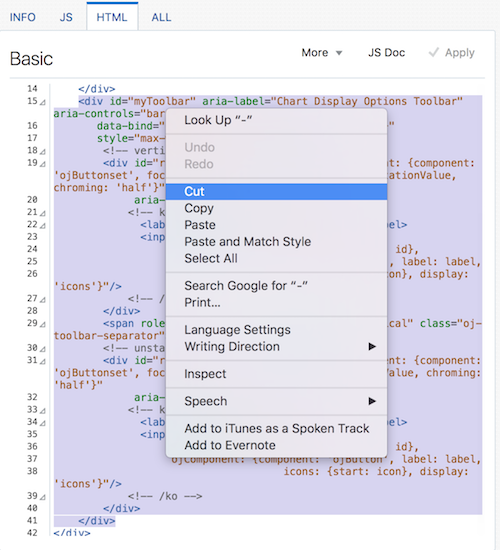
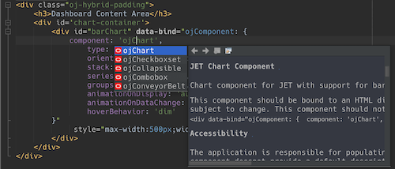

// 
//     Licensed to the Apache Software Foundation (ASF) under one
//     or more contributor license agreements.  See the NOTICE file
//     distributed with this work for additional information
//     regarding copyright ownership.  The ASF licenses this file
//     to you under the Apache License, Version 2.0 (the
//     "License"); you may not use this file except in compliance
//     with the License.  You may obtain a copy of the License at
// 
//       http://www.apache.org/licenses/LICENSE-2.0
// 
//     Unless required by applicable law or agreed to in writing,
//     software distributed under the License is distributed on an
//     "AS IS" BASIS, WITHOUT WARRANTIES OR CONDITIONS OF ANY
//     KIND, either express or implied.  See the License for the
//     specific language governing permissions and limitations
//     under the License.
//

= Using the Oracle JET Cookbook
:jbake-type: tutorial
:jbake-tags: tutorials 
:jbake-status: published
:icons: font
:syntax: true
:source-highlighter: pygments
:toc: left
:toc-title:
:description: Using the Oracle JET Cookbook - Apache NetBeans
:keywords: Apache NetBeans, Tutorials, Using the Oracle JET Cookbook

This document provides a step-by-step set of instructions guiding you through the process of getting started with the link:http://oraclejet.org[+Oracle JavaScript Extension Toolkit (JET)+]. JET empowers developers by providing a modular toolkit based on modern JavaScript, CSS3, and HTML5 design and development principles.

== Exploring the Oracle JET Cookbook

In this section, you learn how easy it is to use the Oracle JET Cookbook, which describes all the JET components, while also providing complete code snippets that you can copy/paste into your JET applications.

1. Go to the on-line link:http://www.oracle.com/webfolder/technetwork/jet/jetCookbook.html[+Oracle JET Cookbook+].

image::images/cookbook-1.png[]

[start=2]
. Browse through the Oracle JET components listed in the Oracle JET Cookbook and get an idea of what's available.

[start=3]
. 
For example, let's take a look at the link:http://www.oracle.com/webfolder/technetwork/jet/jetCookbook.html?component=barChart&demo=default[+Bar Chart+] component.

image::images/cookbook-2.png[]

Notice that for each recipe in the Oracle JET Cookbook, a lot of explanations and documentation is included, together with the JavaScript and HTML that define the component.

Spend some time looking through the Oracle JET components and supporting solutions in the Oracle JET Cookbook. When developing Oracle JET applications, you'll spend a lot of time here and the more familiar you are with the Oracle JET Cookbook, the better.

== Tweaking the Oracle JET Cookbook

In this section, you learn how you can customize recipes live in the Oracle JET Cookbook.

1. Let's imagine we'd like the chart to be incorporated into our application, though not the toolbar that is beneath it in the recipe in the Oracle JET Cookbook:

image::images/cookbook-8.png[]

[start=2]
. To achieve this, go to the HTML tab and use the mouse to select the div with id set to "myToolbar", as shown below:

Press the Delete key or right-click and delete the selected content.

[start=3]
. Click Apply, top right above the code:

image::images/cookbook-7.png[]

[start=4]
. The browser refreshes and the toolbar is no longer there:

image::images/cookbook-9.png[]

[start=5]
. Now you have a subset of the recipe customized for your needs, as described in the next section. Play with various other recipes in the Oracle JET Cookbook by tweaking them and seeing the result.

Simply refresh the browser to return the recipe to its default state.

== Using the Oracle JET Cookbook

In this section, you learn how easy it is to use the Oracle JET Cookbook, which describes all the JET components, while also providing complete code snippets that you can copy/paste into your JET applications.

1. Once you're happy with the code in the recipe, copy the content of the HTML tab from the Oracle JET Cookbook recipe into your application, within the  ``dashboard.html``  file.

[start=2]
. In NetBeans IDE, notice that there is component-specific code-completion, and documentation. Press Ctrl-Space within  ``ojChart``  to see it:

Similarly, press Ctrl-Space on a property and you will see code completion, and documentation, too:

image::images/cookbook-6.png[]

Notice that the properties shown in the code completion are context-sensitive to the currently used Oracle JET component. For example, instead of  ``ojChart``  above, use a different component and then press Ctrl-Space over the properties and you will see that only properties that are applicable to the currently used Oracle JET component are shown.

[start=3]
. In the browser's Inspect tool, notice the error messages, because the  ``dashboard.js``  file does not yet reference the chart that you are using in your  ``dashboard.html``  file:

[source,java]
----

Component ojChart is not found
----

To enable the Oracle JET Chart component to be loaded into the application, include the  ``ojs/ojchart``  reference in your  ``define``  block, in your  ``dashboard.js``  file. Add it to the end of the references, as shown in bold below:

[source,java]
----

define(['ojs/ojcore', 'knockout', 'jquery'*, 'ojs/ojchart'*],
 function(oj, ko, $) {
----

The order in which parameters are listed in the define block is important, because their order must match the order of the callback function, e.g., in the above the  ``oj``  parameter refers to the first of the parameters in the  ``define``  block, since it is the first parameter in the callback function. The reference to  ``ojs/ojchart``  in the define block does not need to be referred to in the callback function because you're only interested in loading it into the module and you have no reason to need to refer to it in the business logic.

After adding the above, you'll still see error messages in the browser, since the properties referenced in  ``dashboard.html``  have not yet been defined in  ``dashboard.js`` . That is the focus of the next step, below.

[start=4]
. In  ``dashboard.js`` , below  ``var self = this;`` , copy the body of the code in the JS tab in the Oracle JET Cookbook.

[source,java]
----

/* toggle button variables */
self.stackValue = ko.observable('off');
self.orientationValue = ko.observable('vertical');
/* chart data */
var barSeries = [{name: "Series 1", items: [42, 34]},
                 {name: "Series 2", items: [55, 30]},
                 {name: "Series 3", items: [36, 50]},
                 {name: "Series 4", items: [22, 46]},
                 {name: "Series 5", items: [22, 46]}];

var barGroups = ["Group A", "Group B"];
self.barSeriesValue = ko.observableArray(barSeries);
self.barGroupsValue = ko.observableArray(barGroups);
/* toggle buttons*/
self.stackOptions = [
    {id: 'unstacked', label: 'unstacked', value: 'off', icon: 'oj-icon demo-bar-unstack'},
    {id: 'stacked', label: 'stacked', value: 'on', icon: 'oj-icon demo-bar-stack'}
];
self.orientationOptions = [
    {id: 'vertical', label: 'vertical', value: 'vertical', icon: 'oj-icon demo-bar-vert'},
    {id: 'horizontal', label: 'horizontal', value: 'horizontal', icon: 'oj-icon demo-bar-horiz'}
];
----

Be careful not to copy everything in the JS tab in the Oracle JET Cookbook, because the JS tab has code in a  ``require``  block, while your  ``dashboard.js``  contains a  ``define``  block. Only copy the properties. Then take a careful look at whether all the properties are actually needed, i.e., whether they are referenced in the  ``dashboard.html``  file. For example, now that you have no toolbar anymore, you can remove the properties above that relate to the toggle buttons, i.e.,  ``self.stackOptions``  and  ``self.orientationOptions`` .

[start=5]
. Run the application and you should see the following in the browser:

image::images/cookbook-3.png[]

Notice that a tooltip is available as you hover over the chart and that, when you hover over the legend, the related area is highlighted in the chart.

As an exercise, choose some other Oracle JET components from the Oracle JET Cookbook and integrate them into your application.

Congratulations! You have now learned how to use the Oracle JET Cookbook.

xref:../../../community/mailing-lists.adoc[Send Feedback on This Tutorial]

[[seealso]]
== See Also

For more information about support for Oracle JET and a variety of HTML5 applications in the IDE on xref:../../../index.adoc[+netbeans.org+], see the following resources:

* link:http://www.oracle.com/webfolder/technetwork/jet/globalExamples.html[+"Learn" section on the Oracle JET site+]. A set of official Oracle JET learning resources.
* xref:html5-editing-css.adoc[+Working with CSS Style Sheets in HTML5 Applications+]. A document that continues with the application that you created in this tutorial that demonstrates how to use some of the CSS wizards and windows in the IDE and how to use the Inspect mode in the Chrome browser to visually locate elements in your project sources.
* xref:html5-js-support.adoc[+Debugging and Testing JavaScript in HTML5 Applications+]. A document that demonstrates how the IDE provides tools that can help you debug and test JavaScript files in the IDE.
