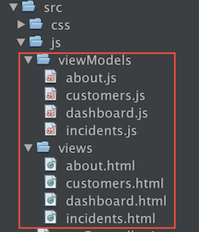
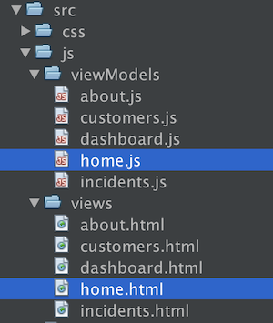

// 
//     Licensed to the Apache Software Foundation (ASF) under one
//     or more contributor license agreements.  See the NOTICE file
//     distributed with this work for additional information
//     regarding copyright ownership.  The ASF licenses this file
//     to you under the Apache License, Version 2.0 (the
//     "License"); you may not use this file except in compliance
//     with the License.  You may obtain a copy of the License at
// 
//       http://www.apache.org/licenses/LICENSE-2.0
// 
//     Unless required by applicable law or agreed to in writing,
//     software distributed under the License is distributed on an
//     "AS IS" BASIS, WITHOUT WARRANTIES OR CONDITIONS OF ANY
//     KIND, either express or implied.  See the License for the
//     specific language governing permissions and limitations
//     under the License.
//

= CRUD Application Development with Oracle JET
:jbake-type: tutorial
:jbake-tags: tutorials 
:jbake-status: published
:icons: font
:syntax: true
:source-highlighter: pygments
:toc: left
:toc-title:
:description: CRUD Application Development with Oracle JET - Apache NetBeans
:keywords: Apache NetBeans, Tutorials, CRUD Application Development with Oracle JET

This document provides a step-by-step set of instructions guiding you through the process of understanding and working with the link:http://oraclejet.org[+Oracle JavaScript Extension Toolkit (JET)+]. JET empowers web and mobile developers by providing a modular toolkit based on modern JavaScript, CSS3, and HTML5 design and development principles.

== Setting Up an Oracle JET Application

In this exercise you set up an Oracle JET application and explore its default content.

1. Follow the steps described in xref:ojet-settingup.adoc[+Setting Up an Oracle JET Application+].

[start=2]
. Open the project into an editor or IDE of your choice, such as NetBeans IDE, which displays the application as follows:

image::images/navdrawer.png[]

Spend some time browsing through the application structure. In the next section, you'll be introduced to the main concepts of the application structure.

== Understanding the Oracle JET Application Structure

In this exercise, you learn about the structure of Oracle JET applications.

* Oracle JET applications are modular. Normally, a module consists of business logic defined in a JavaScript file and a view defined in an HTML file. By convention, the name of the JavaScript file is the same as the name of the HTML file, for each module in the application. By default, the JavaScript side of a module is located in the  ``src/js/viewModels``  folder, while its matching view is located in the  ``src/js/views``  folder, as shown below:

* Whenever you run  ``ojet build``  or  ``ojet serve`` , the  ``src``  folder is copied to the  ``web``  folder. Below, you see the  ``src``  folder and  ``web``  folder highlighted.

image::images/navdrawer_2.png[]

*Never* change the files in the  ``web``  folder. They will automatically be overwritten whenever  ``ojet build``  or  ``ojet serve``  is run. *Only* change the files in the  ``src``  folder, which will all be propagated to the  ``web``  folder whenever  ``oject build``  or  ``ojet serve``  is run.

* The differences between the content of the  ``src``  folder and  ``web``  folder are highlighted below:

image::images/navdrawer_3.png[]

In the above screenshot, note the following:

*  ``main-release-paths.json`` .
*  ``libs`` . By default, the  ``web/js/libs``  folder provides the Oracle JET libraries to the application. These are automatically copied during  ``ojet build``  and  ``ojet serve`` , from the  ``node-modules``  folder, provided by  ``npm install`` . To include custom libraries in the  ``libs``  folder during  ``ojet build``  and  ``ojet-serve`` , modify the  ``scripts/grunt/config/oraclejet-build.js``  file.
* 
The files that initialize the application are highlighted below:

image::images/navdrawer_6.png[]

In the above screenshot, note the following:

*  ``index.html`` .
*  ``main.js`` .
*  ``appController.js`` .

Look again in all the folders of the Oracle JET application and familiarize yourself with everything you find there. The better you understand the structure of the application provided by the template, the easier it will be to work with it.

== Creating an Oracle JET Module

In this exercise you set up an Oracle JET application and explore its default content.

1. In each case, you will need the following when creating a new Oracle JET module:

* A JavaScript file that provides a  ``define``  block, in  ``src/js/viewModels`` .
* An HTML file that has the same name as the JavaScript file, in  ``src/js/views`` .

Simply copy the  ``dashboard.js``  file and name it  ``home.js`` . Similarly, copy the  ``dashboard.html``  file and name it  ``home.html`` . In the files, replace all references to  ``Dashboard``  with  ``Home`` . You should now have  ``src/js/viewModels/home.js``  and  ``src/js/views/home.html`` .

[start=2]
. Open the two files that have been created. The JavaScript file is a  ``define``  block, using Require.js syntax, as shown below (with most of the comments removed here):

[source,java]
----

define(['ojs/ojcore', 'knockout', 'jquery'],
 function(oj, ko, $) {
    function HomeViewModel() {
      var self = this;
      self.handleActivated = function(info) {
        // Implement if needed
      };
      self.handleAttached = function(info) {
        // Implement if needed
      };
      self.handleBindingsApplied = function(info) {
        // Implement if needed
      };
      self.handleDetached = function(info) {
        // Implement if needed
      };
    }
    return new HomeViewModel();
  }
);
----

The HTML file has the following content:

[source,html]
----

  <h3>Home Content Area</h3>
  

      To change the content of this section, you will 
      make edits to the home.html file located in 
      the /js/views folder.
  

----

[start=3]
. 
Check that your application structure in the  ``src``  folder is now as follows, that is, make sure that your new Home module is named correctly and is found in the default location, as shown below:

You have now created a new Oracle JET module. In the next section, you learn how to integrate it into the application.

== Loading an Oracle JET Module

In this exercise you load your Oracle JET modules in the router and navigation structure. Generically, a router is responsible for controling the loading of fragments into a Single Page Application. In the context of Oracle JET, each fragment is provided by an Oracle JET module. Oracle JET provides a variety of components for managing the router. In the "navdrawer" template, an  ``ojNavigationList``  component manages the router. Adding references to the  ``home``  module to the router and navigation component is a trivial task, as shown below.

1. Integrate the Oracle JET module into the application's routing mechanism by tweaking the Router setup in the  ``src/js/appController.js``  file, as shown below in bold:

[source,java]
----

// Router setup
self.router = oj.Router.rootInstance;
self.router.configure({
 'dashboard': {label: 'Dashboard', isDefault: true},
 *'home': {label: 'Home'},*
 'incidents': {label: 'Incidents'},
 'customers': {label: 'Customers'},
 'about': {label: 'About'}
});
----

Learn link:http://www.oracle.com/webfolder/technetwork/jet/jetCookbook.html?component=router&demo=simple[+about the Oracle JET Router here+].

[start=2]
. Integrate the Oracle JET module into the application's navigation component by tweaking the Navigation setup in the  ``src/js/appController.js``  file, as shown below in bold:

[source,java]
----

// Navigation setup
var navData = [
{name: 'Dashboard', id: 'dashboard',
 iconClass: 'oj-navigationlist-item-icon demo-icon-font-24 demo-chart-icon-24'},
*{name: 'Home', id: 'home',
 iconClass: 'oj-navigationlist-item-icon demo-icon-font-24 demo-fire-icon-24'},*
{name: 'Incidents', id: 'incidents',
 iconClass: 'oj-navigationlist-item-icon demo-icon-font-24 demo-fire-icon-24'},
{name: 'Customers', id: 'customers',
 iconClass: 'oj-navigationlist-item-icon demo-icon-font-24 demo-people-icon-24'},
{name: 'About', id: 'about',
 iconClass: 'oj-navigationlist-item-icon demo-icon-font-24 demo-info-icon-24'}
];
----

Learn link:http://www.oracle.com/webfolder/technetwork/jet/jetCookbook.html?component=navigationbar&demo=navbar[+about the ojNavigationList component here+].

[start=3]
. You can now run the application and you should see the "Home" item in the navigation bar, which should route the application to the  ``home``  module:

image::images/navdrawer_5.png[]

[start=4]
. Add more modules and integrate them into the application. Remove modules, by removing their references above and then deleting the related files from the application structure.

Congratulations! You have now learned how to create and load modules into your Oracle JET applications.

xref:../../../community/mailing-lists.adoc[Send Feedback on This Tutorial]

[[seealso]]
== See Also

For more information about support for Oracle JET and a variety of HTML5 applications in the IDE on xref:../../../index.adoc[+netbeans.org+], see the following resources:

* link:http://www.oracle.com/webfolder/technetwork/jet/globalExamples.html[+"Learn" section on the Oracle JET site+]. A set of official Oracle JET learning resources.
* xref:html5-editing-css.adoc[+Working with CSS Style Sheets in HTML5 Applications+]. A document that continues with the application that you created in this tutorial that demonstrates how to use some of the CSS wizards and windows in the IDE and how to use the Inspect mode in the Chrome browser to visually locate elements in your project sources.
* xref:html5-js-support.adoc[+Debugging and Testing JavaScript in HTML5 Applications+]. A document that demonstrates how the IDE provides tools that can help you debug and test JavaScript files in the IDE.
