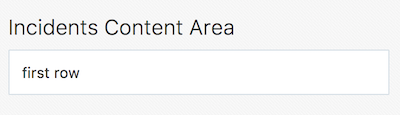
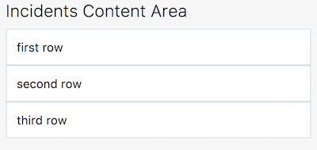
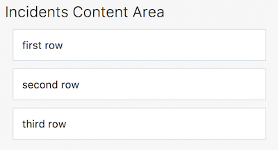
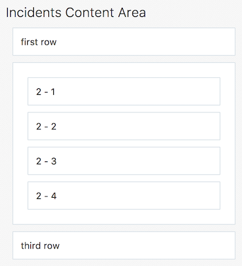
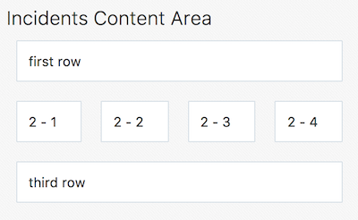

// 
//     Licensed to the Apache Software Foundation (ASF) under one
//     or more contributor license agreements.  See the NOTICE file
//     distributed with this work for additional information
//     regarding copyright ownership.  The ASF licenses this file
//     to you under the Apache License, Version 2.0 (the
//     "License"); you may not use this file except in compliance
//     with the License.  You may obtain a copy of the License at
// 
//       http://www.apache.org/licenses/LICENSE-2.0
// 
//     Unless required by applicable law or agreed to in writing,
//     software distributed under the License is distributed on an
//     "AS IS" BASIS, WITHOUT WARRANTIES OR CONDITIONS OF ANY
//     KIND, either express or implied.  See the License for the
//     specific language governing permissions and limitations
//     under the License.
//

= CSS3 Flexible Box and Oracle JET
:jbake-type: tutorial
:jbake-tags: tutorials 
:jbake-status: published
:icons: font
:syntax: true
:source-highlighter: pygments
:toc: left
:toc-title:
:description: CSS3 Flexible Box and Oracle JET - Apache NetBeans
:keywords: Apache NetBeans, Tutorials, CSS3 Flexible Box and Oracle JET

This document provides a step-by-step set of instructions guiding you through the process of working with link:http://www.oracle.com/webfolder/technetwork/jet/jetCookbook.html?component=composite&demo=basic[+Composite Components+] in link:http://oraclejet.org[+Oracle JavaScript Extension Toolkit (JET)+] applications. JET empowers web and mobile developers by providing a modular toolkit based on modern JavaScript, CSS3, and HTML5 design and development principles.

Flexible boxes, or flexbox, is a new layout mode in CSS3. Use of flexbox ensures that elements behave predictably when the page layout must accommodate different screen sizes and different display devices. For many applications, the flexible box model provides an improvement over the block model in that it does not use floats, nor do the flex container's margins collapse with the margins of its contents.

Throughout this lab, you'll be focused on two specific CSS classes provided by Oracle JET:

* oj-flex
* oj-flex-item

You'll use one or two supporting CSS classes too, specifically,  ``oj-margin``  and  ``oj-panel`` .https://netbeans.org/kb/docs/webclient/ojet-databinding.html

References:

* link:https://www.w3.org/TR/css-flexbox-1/[+https://www.w3.org/TR/css-flexbox-1/+]
* link:http://www.oracle.com/webfolder/technetwork/jet-230/stylingdoc.html[+http://www.oracle.com/webfolder/technetwork/jet-230/stylingdoc.html+]

== Setting Up an Oracle JET Application

In this exercise you set up an Oracle JET application and explore its default content.

1. Follow the steps described in xref:ojet-settingup.adoc[+Setting Up an Oracle JET Application+].

[start=2]
. Open the project into an editor or IDE of your choice, such as NetBeans IDE, which displays the application as follows:

image::images/navdrawer.png[]

Spend some time browsing through the application structure. In the next section, you'll be introduced to the main concepts of the application structure.

== Experimenting with FlexBox in Oracle JET

1. In "incidents.html", let's start simply like this:

[source,html]
----

----

[start=2]
. 
Right now, what we've got is one "div", which has been set as an "oj-flex-item". It has nothing in it and you can't tell that it's there when you look in the page, which will just be blank, aside from the "h1" content. A good tip when doing layouting with Flex Layout, i.e., at least during development, is to add an "oj-panel":

[source,html]
----

 
----

In the browser, you now see a little border, and you can tell where the flex-item is rendered:

image::images/flex-001.png[]

Therefore, the "oj-panel" is very useful when laying out items, to see where the containers and items are fitting within the page, regardless of whether you ultimately want to use "oj-panel" in the actual release of your product. It enables you to see what the padding is, while you can also use different colors in the background by using different alternate panels, via "oj-panel-alt".

[start=3]
. If that is our first row, let's put that in there: 

[source,html]
----

 
   first row

----

Of course, the above will have this result:

[start=4]
. Then copy that and put in a few of them, as follows: 

[source,html]
----

    first row

    second row

    third row

----

[start=5]
. As you can see, the items are stacking up, they're looking OK, though they definitely don't have the padding around them that we would like, according to the link:http://www.oracle.com/webfolder/ux/middleware/alta/index.html[+Oracle Alta UI+]. Let's add a margin to each item, as follows:

[source,html]
----

    first row

    second row

    third row

----

Now we have some padding in there:

That's the default that "oj-margin" gives us, from the Oracle Alta UI spec. Rather than overriding it, if needed, the better approach is to create your own CSS margin class, since the various Oracle JET components also make use of "oj-margin" and hence if you change "oj-margin" itself, you may end up with unintended side effects.

[start=6]
. Where we are now is that we have three "oj-flex-items", which are all contained by the "oj-flex" container in "index.html". Now, let's say that in the second row, i.e., the second "oj-flex-item", we want to put three or four other items:

Getting to the above point is as simple as nesting new "oj-flex-items", like this, i.e., below, only the items in bold have been added:

[source,html]
----

    first row

    *

        2 - 1
    

    

        2 - 2
    

    

        2 - 3
    

    

        2 - 4
    
*

    third row

----

[start=7]
. 
However, probably you don't need that whole border along the outside of the second level items. And maybe you want them to be side-by-side, instead. Right now, we have an "oj-flex-item", which contains other instances of "oj-flex-item". Since they're all "items", they're still children of the "container" item in the "index.html" page. Really, what you would like is for the second level items to be items for the "div" element that contains them. Therefore, let's add in an "oj-flex", which will turn that "div" element into a container:

[source,html]
----

    

        2 - 1
    

    

        2 - 2
    

    

        2 - 3
    

    

        2 - 4
    

----

The above is the only change we have made and now we have the following layout:

image::images/flex-006.png[]

[start=8]
. Once you set a "div" as being a container, you enable it to control its own content. By default, containers flow in a row, as you can see above. The link:http://www.oracle.com/webfolder/technetwork/jet/uiComponents-flex-direction.html[+"flex-direction" property+] is, by default, set to "row". You can set that to "column", instead, as will be shown later, as well as "reverse row" and "reverse column". The reverse classes probably might mess things up for RTL languages, which Oracle JET automatically incorporates. You can also mess with the order, overriding the DOM order, which might cause conflicts with accessibility requirements and RTL language support, though. Be aware that this flexibility exists, if needed, as well as the problems that might occur.

[start=9]
. If you remove "oj-panel" and "oj-margin" from that "div" element, you will have a layout like this:

The inner items are now all in a row, without a panel around them. Once you set up a container, by default, the items inside it are going to resize to fit the container. So, if you remove one of the inner items, in "incidents.html", you will automatically have the resize effect and the result will be as follows:

image::images/flex-008.png[]

Automatically, the inner items stretch across and take up the space in order to position the three items equally.

Let's now go a step further and add inner items to the third "div", after making that "div" a container, while removing its panel and margin. We'll also put back the fourth inner item in the second "div", as a starting point:

[source,html]
----

    first row

    

        2 - 1
    

    

        2 - 2
    

    

        2 - 3
    

    

        2 - 4
    

    

        3 - 1
    

    

        3 - 2
    

----

The result is as follows:

image::images/flex-009.png[]

There are now 4 columns in the middle and 2 across the bottom. As you resize this, the rows are maintained, becoming smaller and smaller as you make the browser smaller.

[start=10]
. However, let's say that we want the items in the second row to stack as we move smaller, i.e., as we get to a phone-size resolution. Since items inherit from their container, we'll use the "flex-direction" property, mentioned earlier, to switch from the default "row" direction to "column", when the resolution is "small", i.e., on mobile devices. Take note of the addition below, in bold:

[source,html]
----

    

        2 - 1
    

    

        2 - 2
    

    

        2 - 3
    

    

        2 - 4
    

----

The above causes a problem immediately because even when you're not in a small resolution, the rows are now columns, while we only wanted that for small resolutions. Be aware that when you use these resolution-related breakpoints, the related CSS classes work from whatever size you tell them on up. In this particular case, we're telling the items in a container to be small, and on up. When you look in my page, of course it's going to drop into a columnar layout, even on large and extra large.

If we only want the columnar direction on small, there are classes for small only, notice the difference below:

[source,html]
----

 
----

And now, only when the resolution is small, will you see the columnar layout:

image::images/flex-010.png[]

Also notice that the container below the one we've been working with is still making use of the default "row" direction.

Congratulations! You have now learned how to work with FlexBox in your Oracle JET applications.

xref:../../../community/mailing-lists.adoc[Send Feedback on This Tutorial]

[[seealso]]
== See Also

For more information about support for Oracle JET and a variety of HTML5 applications in the IDE on xref:../../../index.adoc[+netbeans.org+], see the following resources:

* link:http://www.oracle.com/webfolder/technetwork/jet/globalExamples.html[+"Learn" section on the Oracle JET site+]. A set of official Oracle JET learning resources.
* xref:html5-editing-css.adoc[+Working with CSS Style Sheets in HTML5 Applications+]. A document that continues with the application that you created in this tutorial that demonstrates how to use some of the CSS wizards and windows in the IDE and how to use the Inspect mode in the Chrome browser to visually locate elements in your project sources.
* xref:html5-js-support.adoc[+Debugging and Testing JavaScript in HTML5 Applications+]. A document that demonstrates how the IDE provides tools that can help you debug and test JavaScript files in the IDE.
