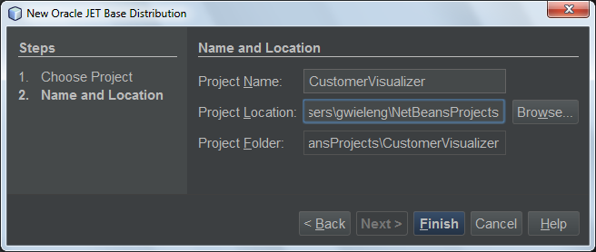
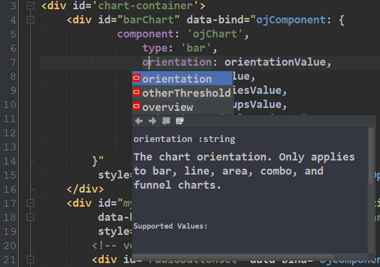
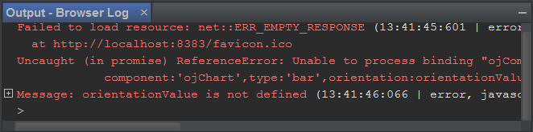

// 
//     Licensed to the Apache Software Foundation (ASF) under one
//     or more contributor license agreements.  See the NOTICE file
//     distributed with this work for additional information
//     regarding copyright ownership.  The ASF licenses this file
//     to you under the Apache License, Version 2.0 (the
//     "License"); you may not use this file except in compliance
//     with the License.  You may obtain a copy of the License at
// 
//       http://www.apache.org/licenses/LICENSE-2.0
// 
//     Unless required by applicable law or agreed to in writing,
//     software distributed under the License is distributed on an
//     "AS IS" BASIS, WITHOUT WARRANTIES OR CONDITIONS OF ANY
//     KIND, either express or implied.  See the License for the
//     specific language governing permissions and limitations
//     under the License.
//

= Getting Started with Oracle JET in NetBeans IDE
:jbake-type: tutorial
:jbake-tags: tutorials 
:jbake-status: published
:icons: font
:syntax: true
:source-highlighter: pygments
:toc: left
:toc-title:
:description: Getting Started with Oracle JET in NetBeans IDE - Apache NetBeans
:keywords: Apache NetBeans, Tutorials, Getting Started with Oracle JET in NetBeans IDE

This document provides a step-by-step set of instructions guiding you through the process of getting started with the link:http://oraclejet.org[+Oracle JavaScript Extension Toolkit (JET)+]. JET empowers developers by providing a modular toolkit based on modern JavaScript, CSS3, and HTML5 design and development principles.

== To complete this tutorial, you will need the following resources.

|===
|Software or Resource |Version Required 

|xref:../../../download/index.adoc[+NetBeans IDE, the HTML5/JavaScript Bundle+] |8.2 
|===

*Notes:*

* This document assumes you have some basic knowledge of, or programming experience with HTML, CSS, and JavaScript.
* Knowledge of the JavaScript frameworks link:http://knockoutjs.com/[+Knockout+] and link:http://requirejs.org/[+Require+] is helpful for working through this tutorial, though not mandatory. However, these two popular open source JavaScript libraries play a central role in JET. Hence, the more you are familiar with them, the easier will be your journey into JET.
* In NetBeans IDE 8.1, you need to install the Oracle JET Support plugin. In NetBeans IDE 8.2, this plugin is pre-installed and so you do not need to look for it or install it yourself. You are recommended to use NetBeans IDE 8.2.
* It is helpful to install the link:https://chrome.google.com/webstore/detail/netbeans-connector/hafdlehgocfcodbgjnpecfajgkeejnaa[+Chrome Connector Plugin for NetBeans+] into the Chrome browser. Using the Chrome browser, together with the plugin, with NetBeans IDE 8.2 adds a number of handy features, such as automatic refresh of the browser when you save a file in NetBeans IDE, as well as the possibility to explore the live DOM from within NetBeans IDE.
* To use the same look and feel in NetBeans IDE as used in this tutorial, install the link:http://plugins.netbeans.org/plugin/62424/darcula-laf-for-netbeans[+Darcula LAF for NetBeans+], which is also available in the Plugin Manager, under Tools | Plugins.

== Setting Up

In this exercise you set up the Oracle JET QuickStart Basic template.

=== Setting Up the Oracle JET QuickStart Basic Template

The Oracle JET QuickStart Basic template provides all the JavaScript libraries and CSS stylesheets that provide the absolute minimum starting point of creating JET applications. In this section, you set up the Oracle JET QuickStart Basic in the IDE as the basis of a new Oracle JET application.

1. In NetBeans IDE, open the New Project dialog (Ctrl-Shift-N), select the *Samples* category, then the *HTML5/JavaScript* category and then select *Oracle JET QuickStart Basic*, as shown below.

image::images/newhtml5project-1.png[]

Click Next.

[start=2]
. Type the name of the application, such as *CustomerVisualizer*, and select a location to store it, as shown below.

Click *Finish* to complete the wizard. 

[start=3]
. When you click Finish, the IDE creates the project, which might take a moment, since several JavaScript libraries are included in the ZIP file. When the unzip process is complete, the IDE displays a node for the project in the Projects window.

You now have a new HTML5/JavaScript project created from the Oracle JET QuickStart Basic template.

image::../../../images_www/articles/82/web/oraclejet-gettingstarted/newhtml5project-7.png[]

Spend some time exploring the project structure of the application. For example, look in *js/libs* and you will see the JavaScript libraries that constitute Oracle JET, while *js/viemodels* contains the JavaScript files, with their matching views in *js/views*.

[start=4]
. Right-click the project and choose Run. The browser opens and displays the template, as shown below.

image::images/newhtml5project-9.png[]

Spend some time exploring the template in the browser. For example, resize the browser and notice that responsive design is built into the template. When the browser is sized for mobile devices, notice the menu along the top disappears and is replaced by a mobile menu instead, as shown below.

image::images/newhtml5project-9a.png[]

=== Creating a Custom JET Module

In this exercise you will configure your application to benefit from the modularity features provided by JET. Then you will create your first JET module and load it into the application.

1. Right-click on the *js/viewModels* folder and go to *New | Other*. The New File dialog opens, showing templates for creating JET modules, as shown below:

image::images/viewmodels-2.png[]

Select "Empty JET Module", as shown above, and click Next. Type the name of the JET module, which by convention starts with a lowecase letter, such as *home*, shown below:

image::images/newhtml5project-2.png[]

Click Finish. Notice that *home.js* is created in *js/viewModels* and that *home.html* is created in *js/views*, as shown below:

image::images/viewmodels-4.png[]

[start=2]
. Open the two files that have been created. The JavaScript file is a *define* block, using Require.js syntax, as shown below:

[source,javascript]
----

/**
 * home module
 */
define(['ojs/ojcore', 'knockout'
], function (oj, ko) {
    /**
     * The view model for the main content view template
     */
    function homeContentViewModel() {
        var self = this;
    }

    return homeContentViewModel;
});
----

The HTML file has the following content:

[source,xml]
----

<h1>home</h1>
----

[start=3]
. Load the JET module into the application by tweaking the Router setup and Navigation setup in the *src/js/appController.js* file, as shown below in bold:

[source,java]
----

// Router setup
self.router = oj.Router.rootInstance;
self.router.configure({
 'dashboard': {label: 'Dashboard', isDefault: true},
 *'home': {label: 'Home'},*
 'incidents': {label: 'Incidents'},
 'customers': {label: 'Customers'},
 'about': {label: 'About'}
});
----

[source,java]
----

// Navigation setup
var navData = [
{name: 'Dashboard', id: 'dashboard',
 iconClass: 'oj-navigationlist-item-icon demo-icon-font-24 demo-chart-icon-24'},
*{name: 'Home', id: 'home',
 iconClass: 'oj-navigationlist-item-icon demo-icon-font-24 demo-fire-icon-24'},*
{name: 'Incidents', id: 'incidents',
 iconClass: 'oj-navigationlist-item-icon demo-icon-font-24 demo-fire-icon-24'},
{name: 'Customers', id: 'customers',
 iconClass: 'oj-navigationlist-item-icon demo-icon-font-24 demo-people-icon-24'},
{name: 'About', id: 'about',
 iconClass: 'oj-navigationlist-item-icon demo-icon-font-24 demo-info-icon-24'}
];
----

You can now run the application and you should see the "home" menu item in the menubar.

Congratulations! Your application is configured correctly and you have created and loaded your first custom module.

== Using JET Components

In this section, you learn about a variety of different ways of creating JET components.

=== Creating Additional JET Modules

Using the steps described in <<creatingAFirstModule,Creating a First Module>>, create some more empty JET modules. Use the "Empty JET Module" wizard, as well as the "Knockout JET Module" wizard:

image::images/viewmodels-5.png[]

Compare the code between the two. In the latter case, you will see the link:http://knockoutjs.com/examples/helloWorld.html[+Hello World sample code from the Knockout.js documentation site+].

In each case, you will need the following when creating a new JET module:

* A JavaScript file that provides a *define* block, in *js/viewModels*.
* An HTML file that has the same name as the JavaScript file, in *js/views*.
* An update to the Router setup and Navigation setup in *src/js/appController.js*, to load the JET module.

Experiment by creating multiple empty JET modules, e.g., a *footer* module and a *header* module.

=== Using the JET Cookbook

In this section, you learn how easy it is to use the Oracle JET Cookbook, which describes all the JET components, while also providing complete code snippets that you can copy/paste into your JET applications.

1. Go to the on-line link:http://www.oracle.com/webfolder/technetwork/jet/jetCookbook.html[+Oracle JET Cookbook+].
2. Browse through the JET components in the Oracle JET Cookbook and get an idea of what's available.
3. Take a look at the link:http://www.oracle.com/webfolder/technetwork/jet/jetCookbook.html?component=barChart&demo=default[+Bar Chart+] component.
4. 
In the lower part of the page, copy the content of the HTML Editor into your application, within the *home.html* file.

[start=5]
. Notice that there is component-specific code-completion, and documentation, press Ctrl-Space within *ojChart* to see it:

image::images/cookbook-1.png[]

Similarly, press Ctrl-Space on a property and you will see code completion, and documentation, too:

*Note:* Notice that the properties shown in the code completion are context-sensitive to the currently used Oracle JET component. For example, instead of *ojChart* above, use a different component and then press Ctrl-Space over the properties and you will see that only properties that are applicable to the currently used Oracle JET component are shown.

[start=6]
. In the Output window (Ctrl-4), notice the error messages, because the *home.js* JavaScript file does not yet define the variables you have referenced in your HTML file, as shown below:

[start=7]
. In *home.js*, below *var self = this;*, copy the body of the code in the JS Editor section, near the end of the Bar Chart page.

[source,java]
----

/* toggle button variables */
self.stackValue = ko.observable('off');
self.orientationValue = ko.observable('vertical');
/* chart data */
var barSeries = [{name: "Series 1", items: [42, 34]},
                 {name: "Series 2", items: [55, 30]},
                 {name: "Series 3", items: [36, 50]},
                 {name: "Series 4", items: [22, 46]},
                 {name: "Series 5", items: [22, 46]}];

var barGroups = ["Group A", "Group B"];
self.barSeriesValue = ko.observableArray(barSeries);
self.barGroupsValue = ko.observableArray(barGroups);
/* toggle buttons*/
self.stackOptions = [
    {id: 'unstacked', label: 'unstacked', value: 'off', icon: 'oj-icon demo-bar-unstack'},
    {id: 'stacked', label: 'stacked', value: 'on', icon: 'oj-icon demo-bar-stack'}
];
self.orientationOptions = [
    {id: 'vertical', label: 'vertical', value: 'vertical', icon: 'oj-icon demo-bar-vert'},
    {id: 'horizontal', label: 'horizontal', value: 'horizontal', icon: 'oj-icon demo-bar-horiz'}
];
----

*Note:* Be careful not to copy everything in the JS Editor, because the JS Editor has code in a *require* block, while your *home.js* contains a *define* block.

[start=8]
. To enable the JET Chart component to be loaded into the application, include the *ojs/ojchart* reference in your *define* block, in your *home.js* file, as shown below:

[source,javascript]
----

define(['ojs/ojcore', 'knockout', *'ojs/ojchart',*
], function (oj, ko) {
----

[start=9]
. 
Open the application in a browser and you should see the following:

image::images/chart-1.png[]

Modify and tweak the page as needed, for example, change the H1 element from *home* to something more meaningful, such as *Chart Data*.

As an exercise, choose some other JET components from the Oracle JET Cookbook and integrate them into your application.

[[template]]
== Setting Up Intermodular Communication

You may need to reference properties across different JET modules. There are three different ways to do so, as outlined below.

1. Use *$root* within an HTML file to access global variables from *main.js*. xref:../../../blogs/geertjan/intermodular_communication_in_oracle_jet.adoc[Details here.]
2. Use *ko.dataFor* within a JavaScript file to access global variables from *main.js*. xref:../../../blogs/geertjan/intermodular_communication_in_oracle_jet1.adoc[Details here.]
3. Use *knockout-postbox* to set up a loosely coupled publish/subscribe mechanism. xref:../../../blogs/geertjan/intermodular_communication_in_oracle_jet2.adoc[Details here.]

xref:../../../community/mailing-lists.adoc[Send Feedback on This Tutorial]

[[seealso]]
== See Also

For more information about support for Oracle JET and a variety of HTML5 applications in the IDE on xref:../../../index.adoc[+netbeans.org+], see the following resources:

* link:http://www.oracle.com/webfolder/technetwork/jet/globalExamples.html[+"Learn" section on the Oracle JET site+]. A set of official Oracle JET learning resources.
* xref:html5-editing-css.adoc[+Working with CSS Style Sheets in HTML5 Applications+]. A document that continues with the application that you created in this tutorial that demonstrates how to use some of the CSS wizards and windows in the IDE and how to use the Inspect mode in the Chrome browser to visually locate elements in your project sources.
* xref:html5-js-support.adoc[+Debugging and Testing JavaScript in HTML5 Applications+]. A document that demonstrates how the IDE provides tools that can help you debug and test JavaScript files in the IDE.
