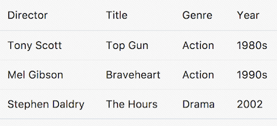

// 
//     Licensed to the Apache Software Foundation (ASF) under one
//     or more contributor license agreements.  See the NOTICE file
//     distributed with this work for additional information
//     regarding copyright ownership.  The ASF licenses this file
//     to you under the Apache License, Version 2.0 (the
//     "License"); you may not use this file except in compliance
//     with the License.  You may obtain a copy of the License at
// 
//       http://www.apache.org/licenses/LICENSE-2.0
// 
//     Unless required by applicable law or agreed to in writing,
//     software distributed under the License is distributed on an
//     "AS IS" BASIS, WITHOUT WARRANTIES OR CONDITIONS OF ANY
//     KIND, either express or implied.  See the License for the
//     specific language governing permissions and limitations
//     under the License.
//

= Interacting with RESTful Web Services in Oracle JET
:jbake-type: tutorial
:jbake-tags: tutorials 
:jbake-status: published
:icons: font
:syntax: true
:source-highlighter: pygments
:toc: left
:toc-title:
:description: Interacting with RESTful Web Services in Oracle JET - Apache NetBeans
:keywords: Apache NetBeans, Tutorials, Interacting with RESTful Web Services in Oracle JET

This document provides a step-by-step set of instructions guiding you through the process of getting started with RESTful Web Services with the link:http://oraclejet.org[+Oracle JavaScript Extension Toolkit (JET)+]. JET empowers web and mobile developers by providing a modular toolkit based on modern JavaScript, CSS3, and HTML5 design and development principles.

== Setting Up an Oracle JET Application

In this exercise you set up an Oracle JET application and explore its default content.

1. Follow the steps described in xref:ojet-settingup.adoc[+Setting Up an Oracle JET Application+].

[start=2]
. Open the project into an editor or IDE of your choice, such as NetBeans IDE, which displays the application as follows:

image::images/navdrawer.png[]

Spend some time browsing through the application structure. In the next section, you'll be introduced to the main concepts of the application structure.

== Scenario 1: Standard jQuery

In this exercise, you use link:http://api.jquery.com/jquery.getjson/[+the standard $.getJSON construction from jQuery+] to access data via a publicly available RESTful web service.

1. In your Oracle JET module's JavaScript file, add the following:

[source,javascript]
----

self.data = ko.observableArray();
$.getJSON("http://movieapp-sitepointdemos.rhcloud.com/api/movies").
        then(function (movies) {
            $.each(movies, function () {
                self.data.push({
                    title: this.title,
                    director: this.director,
                    releaseYear: this.releaseYear,
                    genre: this.genre
                });
            });
        });
self.dataSource = new oj.ArrayTableDataSource(
        self.data, 
        {idAttribute: 'title'}
);
----

Read about link:http://docs.oracle.com/middleware/jet230/jet/reference-jet/oj.ArrayTableDataSource.html[+ArrayTableDataSource+] here.

[start=2]
. In the  ``define``  block, add a reference to  ``ojs/ojtable`` .

[start=3]
. In the matching HTML file, add the following:

[source,xml]
----

<table data-bind="ojComponent: {component: 'ojTable', 
        data: dataSource,
        columns: [
            {headerText: 'Director', field: 'director'},
            {headerText: 'Title', field: 'title'},
            {headerText: 'Genre', field: 'genre'},
            {headerText: 'Year', field: 'releaseYear'}
        ]
    }">
</table>
----

You should now see a table with data in your application:

== Scenario 2: Oracle JET Common Model

In this exercise, you learn about the structure of link:http://www.oracle.com/webfolder/technetwork/jet/jetCookbook.html?component=home&demo=rootFramework_childCommonModel[+Oracle JET Common Model+].

1. The JET Common Model's oj.Model and oj.Collection allow applications to perform CRUD operations (create, read, update, delete) via REST services. Before going further, read about link:http://www.oracle.com/webfolder/technetwork/jet/jetCookbook.html?component=crud&demo=table[+the Oracle JET Common Model here+]. Also read link:http://www.kennethlange.com/posts/oracle_jet.html[+Create a Web App with Oracle JET+].

[start=2]
. In the  ``js``  folder, that is, in the folder where  ``main.js``  is found, create a file named  ``MovieFactory.js``  and add the following to it:

[source,javascript]
----

define(['ojs/ojcore'], function (oj) {
    var MovieFactory = {
        resourceUrl: 'http://movieapp-sitepointdemos.rhcloud.com/api/movies',
        // Create a single movie instance:
        createMovieModel: function () {
            var Movie = oj.Model.extend({
                urlRoot: this.resourceUrl, 
                idAttribute: "_id"
            });
            return new Movie();
        },
        // Create a movie collection:
        createMovieCollection: function () {
            var Movies = oj.Collection.extend({
                url: this.resourceUrl, 
                model: this.createMovieModel()
            });
            return new Movies();
        }
    };
    return MovieFactory;
});
----

To understand the idea behind the code above, think of it is an implementation of link:https://www.martinfowler.com/eaaCatalog/activeRecord.html[+Martin Fowler's "Active Record" pattern+], while its syntax is that of link:http://backbonejs.org/#Model[+Backbone.Model+] and link:http://backbonejs.org/#Collection[+Backbone.Collection+] in link:http://backbonejs.org/[+Backbone.js+]. For background reading on the Oracle JET Common Model, see the link:http://www.oracle.com/webfolder/technetwork/jet/jetCookbook.html?component=home&demo=rootFramework_childCommonModel[+Oracle JET Cookbook section on Common Model+] and the link:https://docs.oracle.com/middleware/jet112/jet/developer/GUID-808434E0-CA80-405C-9450-59E0BF525700.htm#JETDG334[+Using the Oracle JET Common Model and Collection Framework section in the Oracle JET Developer Guide+]. Best of all, take a look at the JsDoc for link:http://docs.oracle.com/middleware/jet112/jet/reference-jet/oj.Model.html[+oj.Model+] and oj.Collection.

[start=3]
. Replace the complete content of the JavaScript file in your Oracle JET module with the following:

[source,javascript]
----

define(['ojs/ojcore', 'knockout', 'MovieFactory', 
    'ojs/ojmodel', 'ojs/ojtable', 'ojs/ojcollectiontabledatasource'],
function (oj, ko, MovieFactory) {
    var viewModel = {
        movieCollection: MovieFactory.createMovieCollection(),
        dataSource: ko.observable(),
        // Called each time the view is shown to the user:
        initialize: function () {
            this.dataSource(new oj.CollectionTableDataSource(this.movieCollection));
            this.movieCollection.fetch();
        }
    };
    return viewModel;
});
----

[start=4]
. 
The HTML side of your Oracle JET module does not need to change. It is exactly the same as in the previous section.

You should now see a table with data in your application.

Congratulations! You have now learned how to get started with REST in your Oracle JET applications.

xref:../../../community/mailing-lists.adoc[Send Feedback on This Tutorial]

[[seealso]]
== See Also

For more information about support for Oracle JET and a variety of HTML5 applications in the IDE on xref:../../../index.adoc[+netbeans.org+], see the following resources:

* link:http://www.oracle.com/webfolder/technetwork/jet/globalExamples.html[+"Learn" section on the Oracle JET site+]. A set of official Oracle JET learning resources.
* xref:html5-editing-css.adoc[+Working with CSS Style Sheets in HTML5 Applications+]. A document that continues with the application that you created in this tutorial that demonstrates how to use some of the CSS wizards and windows in the IDE and how to use the Inspect mode in the Chrome browser to visually locate elements in your project sources.
* xref:html5-js-support.adoc[+Debugging and Testing JavaScript in HTML5 Applications+]. A document that demonstrates how the IDE provides tools that can help you debug and test JavaScript files in the IDE.
