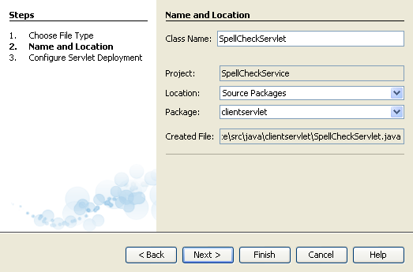
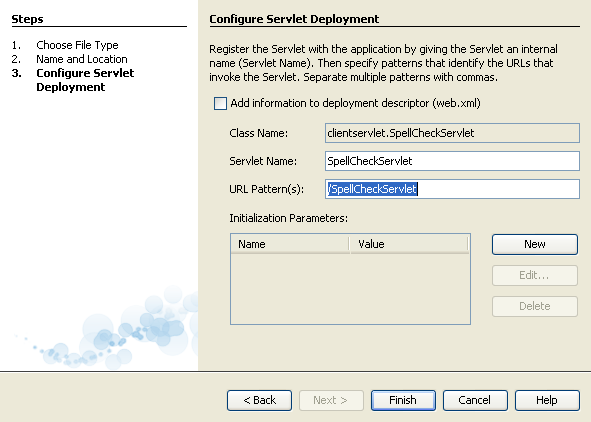
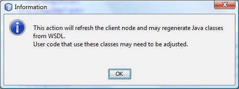

// 
//     Licensed to the Apache Software Foundation (ASF) under one
//     or more contributor license agreements.  See the NOTICE file
//     distributed with this work for additional information
//     regarding copyright ownership.  The ASF licenses this file
//     to you under the Apache License, Version 2.0 (the
//     "License"); you may not use this file except in compliance
//     with the License.  You may obtain a copy of the License at
// 
//       http://www.apache.org/licenses/LICENSE-2.0
// 
//     Unless required by applicable law or agreed to in writing,
//     software distributed under the License is distributed on an
//     "AS IS" BASIS, WITHOUT WARRANTIES OR CONDITIONS OF ANY
//     KIND, either express or implied.  See the License for the
//     specific language governing permissions and limitations
//     under the License.
//

= Разработка клиентов веб-служб JAX-WS
:jbake-type: tutorial
:jbake-tags: tutorials 
:jbake-status: published
:icons: font
:syntax: true
:source-highlighter: pygments
:toc: left
:toc-title:
:description: Разработка клиентов веб-служб JAX-WS - Apache NetBeans
:keywords: Apache NetBeans, Tutorials, Разработка клиентов веб-служб JAX-WS

В этом учебном курсе используются функции веб-служб, предоставленные IDE NetBeans, для анализа веб-службы Spell Checker, после чего создается веб-клиент, взаимодействующий со службой. Клиент использует класс сервлетов и веб-страницу. Пользователь передает информацию сервлету с веб-страницы.

image::images/netbeans-stamp-80-74-73.png[title="Содержимое этой страницы применимо к IDE NetBeans 7.2, 7.3, 7.4 и 8.0"]

*Для работы с этим учебным курсом требуется следующее программное обеспечение и ресурсы.*

|===
|Программное обеспечение или материал |Требуемая версия 

|link:https://netbeans.org/downloads/index.html[+IDE NetBeans+] |Пакетная загрузка Java EE 

|link:http://www.oracle.com/technetwork/java/javase/downloads/index.html[+Комплект для разработчика на языке Java (JDK)+] |версия 7 или 8 

|Веб-сервер или сервер приложений, совместимый с Java EE |Веб-сервер Tomcat 7.0 
GlassFish Server Open Source Edition
Сервер Oracle WebLogic 
|===

*Предостережение. *В случае использования пакета JDK 6 необходим пакет JDK 6 Update 7 или более поздний.

Можно установить и сервер Tomcat, и GlassFish, при распространении IDE NetBeans через Интернет и с помощью Java EE. Также можно воспользоваться link:https://glassfish.java.net/download.html[+страницей загрузок GlassFish Server+] или link:http://tomcat.apache.org/download-60.cgi[+страницей загрузок Apache Tomcat+].

*Важно! *Для работы с проектами Java EE требуются Tomcat 7.x, GlassFish Server или Oracle WebLogic Server 12c.

Ниже представлен внешний вид клиента со всеми данными, полученными от веб-службы:

image::images/jaxwsc-spellchecker-report.png[title="Отчет о работе средства проверки орфографии"]

По окончании данного учебного курса вы обнаружите, что ваш единственный вклад в приложение состоит из предоставления текста на проверку, вызова веб-службы и вывода результата. Весь код, необходимый для взаимодействия с веб-службой и для передачи текста, создается в среде IDE автоматически. Веб-служба проверки орфографии позаботится обо всем остальном. Она определяет неправильно написанные слова и предоставляет список предлагаемых альтернатив.

Используемая в этом учебном курсе веб-служба проверки орфографии предоставлена link:http://www.cdyne.com/account/home.aspx[+CDYNE Corporation.+] Компания CDYNE занимается разработкой, продажей и поддержкой полного набора веб-служб расширения данных, качества данных и анализа данных, а также интеграцию решений по бизнес-информации и аналитике. Веб-служба проверки орфографии является одной из веб-служб, предоставляемых компанией CDYNE. Следует отметить, что стабильность приложений на основе одной или более веб-служб зависит от доступности и надежности веб-служб. Однако в разделе link:http://www.cdyne.com/company/faqs.aspx[+Часто задаваемые вопросы+] CDYNE, указывается, что задана "задача достижения доступности со значением 100%" и что в случае "стихийных бедствий, террористических актов и других катастроф трафик веб-служб передается на дополнительный центр управления данными". NetBeans благодарит CDYNE за возможность написания этого учебного курса и за помощь в его разработке.

== [[Применение веб-службы проверки орфографии]] 

Для использования веб-службы в сети (иначе называемого "потреблением веб-службы") необходимо создать клиент веб-службы. Для создания клиентов веб-служб IDE NetBeans обеспечивает функцию создания клиентов, представляющую собой мастер клиента веб-служб, создающий код для поиска веб-службы. Также предоставляются средства для разработки создаваемого клиента веб-службы – рабочая область, состоящая из узлов в окне "Проекты". Эти функции являются частью комлекта EE установки IDE NetBeans. Они доступны сразу после установки, дополнительные модули не требуются.

=== Создание клиента 

Этот раздел посвящен работе с мастером для создания исходных объектов Java из файла WSDL веб-службы.

1. Выберите 'Файл' > 'Создать проект' (Ctrl-Shift-N в Windows и Linux, ⌘-Shift-N в ОС Mac). В разделе "Категории" выберите "Java Web". В области "Проекты" выберите "Веб-приложение". Нажмите кнопку "Далее". Назовите проект  ``SpellCheckService``  и убедитесь, что в качестве целевого сервера указан соответствующий сервер. (Обратитесь к разделу "Начало работы" для получения дополнительных сведений). Оставьте значения остальных параметров по умолчанию и нажмите кнопку "Готово".
2. В окне 'Проекты' щелкните правой кнопкой мыши узел проекта  ``SpellCheckService``  и выберите Создать > Другие, затем выберите 'Клиент веб-службы' в категории 'Веб-службы' мастера создания файлов. Нажмите кнопку "Далее".
3. Выберите 'URL-адрес WSDL' и укажите следующий URL-адрес веб-службы:

link:http://wsf.cdyne.com/SpellChecker/check.asmx?wsdl[+http://wsf.cdyne.com/SpellChecker/check.asmx?wsdl+]

Если компьютер защищен брандмауэром, то может потребоваться указать прокси-сервер, т.к. в противном случае загрузить файл WSDL будет невозможно. Чтобы указать прокси-сервер, нажмите в мастере кнопку "Настроить прокси". Открывается окно настроек среды IDE, в котором можно указать общий прокси-сервер для среды IDE.

[start=4]
. Название пакета указывать не следует. По умолчанию имя пакета класса клиента берется из WSDL. В данном случае это  ``com.cdyne.ws`` . Нажмите 'Готово'.

[start=5]
. В окне "Проекты" в узле "Web Service References" должно быть представлено следующее: 

image::images/ws-refs.png[title="Окно проекта, в котором показываются ссылки на веб-службу"]

В окне "Проекты" видно, что веб-служба под названием "check" сделала доступными для вашего приложения несколько операций "CheckTextBody" и "CheckTextBodyV2". В этих операциях строка проверяется на ошибки орфографии, и данные возвращаются для обработки клиентом. Версия службы V2 не требует проверки подлинности. В данном учебном курсе будет использоваться операция  ``checkSoap.CheckTextBodyV2`` .

В узле  ``Generated Sources ``  показаны клиентские заглушки, автоматически созданные мастером создания клиента веб-службы JAX-WS.

image::images/gen-files.png[title="Представление файлов, в котором отображается структура пакета узла 'Сборка'"]

Разверните узел "WEB-INF" и нижележащий узел "wsdl". На экран будет выведена локальная копия файла WSDL с именем  ``check.asmx.wsdl`` .

image::images/web-inf.png[]

URL-адрес файла WSDL, используемого для создания клиента, привязан к локальной копии файла WSDL в файле  ``jax-ws-catalog.xml`` . Привязка к локальной копии имеет ряд преимуществ. Удаленная копия файла WSDL не обязательно должна быть доступна для выполнения клиента. Клиент выполняется быстрее, так как отсутствует потребность в анализе удаленного файла WSDL. Кроме того, упрощается переносимость.

image::images/jax-ws-catalog.png[]

=== Разработка клиента 

Существует много способов реализации клиента веб-службы. Файл WSDL веб-службы ограничивает тип данных, отправляемых в веб-службу, а также тип данных, получаемых в ответ. Однако файл WSDL не устанавливает ограничений ни на _способ передачи _ требуемой информации, ни на _компоненты_ пользовательского интерфейса. Эта реализация клиента состоит из веб-страницы, позволяющей пользователю вводить текст для проверки, и сервлета, передающего текст в веб-службу и затем отображающего отчет с результатами.

==== Написание кода веб-страницы 

Создаваемая веб-страница состоит из текстовой области, в которой пользователь может ввести текст, и из кнопки для передачи текста в веб-службу. В зависимости от версии выбранного целевого сервера среда IDE создает либо файл  ``index.html`` , либо файл  ``index.jsp``  в качестве страницы индекса для приложения.

1. В окне 'Проекты' разверните узел 'Веб-страницы' проекта  ``SpellCheckService``  и дважды щелкните страницу индекса ( ``index.html``  или  ``index.jsp`` ), чтобы открыть соответствующий файл в редакторе исходного кода.
2. Скопируйте следующий код и вставьте его на страницу индекса поверх тегов  ``<body>`` :

[source,html]
----

<body>
  <form name="Test" method="post" action="SpellCheckServlet">
     
Enter the text you want to check:

     

     
<textarea rows="7" name="TextArea1" cols="40" ID="Textarea1"></textarea>

     

     <input type="submit" value="Spell Check" name="spellcheckbutton">
  </form>
</body>
----

Описанный выше код указывает, что при нажатии кнопки передачи запроса содержимое области  ``textarea``  передается методом POST в сервлет  ``SpellCheckServlet`` .

==== Создание и написание кода для сервлета 

В этом разделе описано создание сервлета, взаимодействующего с веб-службой. При этом код, выполняющий взаимодействие, предоставляется средой IDE. В результате необходимо работать только с бизнес-логикой, т.е. с подготовкой передаваемого текста и обработкой результата.

1. Щелкните правой кнопкой мыши узел проекта  ``SpellCheckService``  в окне "Проекты", выберите команду "Создать > Прочее", а затем "Веб > Сервлет". Нажмите 'Далее', чтобы открыть мастер создания сервлетов.
2. Назовите сервлет  ``SpellCheckServlet``  и введите  ``clientservlet``  в раскрывающемся списке "Пакет". Нажмите 'Далее'.

[start=3]
. Обратите внимание, что сопоставление URL-адреса на панели 'Настройки развертывания сервлета' для данного сервлета имеет значение  ``/SpellCheckServlet`` . Примите параметры по умолчанию и нажмите кнопку "Готово". Сервлет открывается в редакторе исходного кода. 

[start=4]
. Поместите указатель мыши в тело метода  ``processRequest``  в проекте  ``SpellCheckServlet.java``  и добавьте несколько новых строк прямо в верхней части метода.

[start=5]
. Щелкните правой кнопкой мыши область, созданную в предыдущем действии, и выберите "Вставить код > Вызвать операцию веб-службы". Выберите операцию  ``checkSoap.CheckTextBodyV2``  в диалоговом окне "Выбор вызываемой операции", как указано ниже: 

image::images/insert-ws-ops.png[title="Окно проекта, в котором показываются ссылки на веб-службу"]

Нажмите кнопку "ОК".

*Примечание.* Также можно перетащить узел операции напрямую из окна 'Проекты' в редактор, а не открывать диалоговое окно, показанное выше.

В конце класса  ``SpellCheckServlet``  виден закрытый метод вызова службы SpellCheckerV2 и возвращения объекта  ``com.cdyne.ws.DocumentSummary`` .

[source,java]
----

private DocumentSummary checkTextBodyV2(java.lang.String bodyText) {com.cdyne.ws.CheckSoap port = service.getCheckSoap();return port.checkTextBodyV2(bodyText);}
----

Этого метода вполне достаточно для вызова операций веб-службы. Кроме того, в верхней части класса объявлены следующие строки кода (выделены жирным шрифтом):

[source,java]
----

public class SpellCheckServlet extends HttpServlet {
    *@WebServiceRef(wsdlLocation = "http://wsf.cdyne.com/SpellChecker/check.asmx?WSDL")
    private Check service;*
----

[start=6]
. Замените блок  ``try``  в методе  ``processRequest()``  следующим кодом. Встроенные комментарии в коде объясняют назначение каждой строки.

[source,html]
----

try (PrintWriter out = response.getWriter()) {
*    //Get the TextArea from the web page*String TextArea1 = request.getParameter("TextArea1");*//Initialize WS operation arguments*
    java.lang.String bodyText = TextArea1;

    *//Process result*
    com.cdyne.ws.DocumentSummary doc = checkTextBodyV2(bodyText);
    String allcontent = doc.getBody();

    *//From the retrieved document summary,
    //identify the number of wrongly spelled words:*
    int no_of_mistakes = doc.getMisspelledWordCount();

    *//From the retrieved document summary,
    //identify the array of wrongly spelled words:*
    List allwrongwords = doc.getMisspelledWord();

    out.println("<html>");
    out.println("<head>");

    *//Display the report's name as a title in the browser's titlebar:*
    out.println("<title>Spell Checker Report</title>");
    out.println("</head>");
    out.println("<body>");

    *//Display the report's name as a header within the body of the report:*
    out.println("<h2>Spell Checker Report</h2>");

    *//Display all the content (correct as well as incorrectly spelled) between quotation marks:*
    out.println("
<b>Your text:</b> \"" + allcontent + "\"" + "
");

    *//For every array of wrong words (one array per wrong word),
    //identify the wrong word, the number of suggestions, and
    //the array of suggestions. Then display the wrong word and the number of suggestions and
    //then, for the array of suggestions belonging to the current wrong word, display each
    //suggestion:*
    for (int i = 0; i < allwrongwords.size(); i++) {
        String onewrongword = ((Words) allwrongwords.get(i)).getWord();
        int onewordsuggestioncount = ((Words) allwrongwords.get(i)).getSuggestionCount();
        List allsuggestions = ((Words) allwrongwords.get(i)).getSuggestions();
        out.println("

<b>Wrong word:</b> " + onewrongword + "");
        out.println("
<b>" + onewordsuggestioncount + " suggestions:</b> ");
        for (int k = 0; k < allsuggestions.size(); k++) {
            String onesuggestion = (String) allsuggestions.get(k);
            out.println(onesuggestion);
        }
    }

    *//Display a line after each array of wrong words:*
    out.println("
");

    *//Summarize by providing the number of errors and display them:*
    out.println("<b>Summary:</b> " + no_of_mistakes + " mistakes (");
    for (int i = 0; i < allwrongwords.size(); i++) {
        String onewrongword = ((Words) allwrongwords.get(i)).getWord();
        out.println(onewrongword);
    }

    out.println(").");
    out.println("");
    out.println("</body>");
    out.println("</html>");

} 

----

[start=7]
. Появятся панели ошибок и предупреждающие значки, указывающие на классы, которые не найдены. Чтобы исправить выражения импорта после вставки кода нажмите Ctrl-Shift-I (⌘-Shift-I в Mac) или щелкните правой кнопкой мыши в любом местоположении, после чего откроется контекстное меню и выберите 'Исправить выражения импорта'. Можно выбрать класс из списка классов List для импорта. Примите класс по умолчанию java.util.List. Ниже приведен полный список импортированных классов:

[source,java]
----

import com.cdyne.ws.Check;
import com.cdyne.ws.Words;
import java.io.IOException;
import java.io.PrintWriter;
import java.util.List;
import javax.servlet.ServletException;
import javax.servlet.http.HttpServlet;
import javax.servlet.http.HttpServletRequest;
import javax.servlet.http.HttpServletResponse;
import javax.xml.ws.WebServiceRef;
----

*Примечание. *Если отображается предупреждение, что классы  ``com.cdyne.*``  не могут быть найдены, не беспокойтесь. Эта проблема решается при сборке проекта, когда среда IDE анализирует файлы WSDL и обнаруживает классы.

Следует отметить, что в приведенный выше код не входит обработка ошибок. Дополнительные сведения приведены в документе <<applyingwhatyouhavelearned,Закрепление материала на практике>>.

=== Развертывание клиента 

Для сборки и выполнения веб-приложений в среде IDE используется сценарий сборки Ant. Этот сценарий сборки создается средой IDE на основе параметров, указанных при создании проекта. Можно настроить эти параметры в диалоговом окне 'Свойства проекта' (щелкните правой кнопкой мыши узел проекта в окне 'Проекты' и выберите 'Свойства').

1. Щелкните правой кнопкой мыши узел проекта и выберите "Выполнить". Через некоторое время приложение должно развернуть и отобразить веб-страницу, код которой был написан по инструкциям в предыдущем разделе.
2. Введите произвольный текст, убедившись, что часть текста написана с ошибками: 

image::images/jaxwsc-spellchecker-form.png[title="Страница JSP с текстом для проверки"]

[start=3]
. Нажмите кнопку "Проверка орфографии" и посмотрите результат: 

image::images/jaxwsc-spellchecker-report.png[title="Отчет о работе средства проверки орфографии"]

[[asynch]]
== Асинхронные клиенты веб-служб

По умолчанию клиенты JAX-WS, создаваемые IDE NetBeans являются синхронизированными. Синхронные клиенты посылают запрос в веб-службу и затем приостанавливают обработку до получения ответа. Однако в некоторых случаях необходимо продолжить выполнение каких-либо других действий, а не ожидать ответа. Например, в некоторых случаях для обработки запроса службой требуется значительное время. Клиенты веб-служб, которые продолжают работу без ожидания ответа службы, называются "асинхронными".

Асинхронные клиенты инициируют запрос службы и немедленно продолжают работу, не ожидая получения ответа. Службой обрабатывается запрос клиента, и по истечении некоторого времени отправляется ответ, который затем обрабатывается клиентом.

Асинхронные клиенты используют веб-службы как в режиме опроса, так и в режиме обратного вызова. При использовании метода опроса происходит вызов метода веб-службы и многократно запрашивается результат. Опрос занимает поток вызова и тем самым блокирует работу, что делает нежелательным его использование в приложениях с графическим интерфейсом пользователя. В режиме обратного вызова в момент вызова метода веб-службы в веб-службу передается обработчик обратного вызова. После получения результата вызывается метод обработчика  ``handleResponse()`` . Данный режим подходит для приложений с графическим интерфейсом пользователя, поскольку при этом нет необходимости ожидать ответа. Например, если вызов осуществляется из обработчика событий графического интерфейса пользователя, то управление немедленно возвращается приложению, что позволяет предотвратить "зависание" интерфейса пользователя. Недостатком метода опроса является тот факт, что даже если ответ используется после получения, необходимо запросить его и узнать, что он получен.

В IDE NetBeans добавляется поддержка для асинхронных клиентов к клиентскому приложению веб-служб путем установки флажка в разделе редактирования GUI атрибутов веб-служб для ссылок на веб-службы. Все прочие аспекты разработки клиентов совпадают со случаем синхронных клиентов, за исключением наличия методов опроса веб-служб и методов обратного вызова с ожиданием результата.

В остальной части данного раздела детально описывается создание графических интерфейсов Swing и внедрение в них асинхронных клиентов JAX-WS.

[[asynch-swing]]
=== Создание формы Swing

В этом разделе описывается создание приложения Swing. Можно не выполнять разработку пользовательского графического интерфейса Swing самостоятельно, а просто link:https://netbeans.org/projects/www/downloads/download/webservices%252FAsynchSpellCheckForm.zip[+загрузить предварительно разработанную форму JFrame+] и перейти к разделу <<asynch-creatingtheclient,Создание асинхронного клиента>>.

В клиент Swing передается набираемый на клавиатуре текст, который затем отправляется в службу, которая в свою очередь возвращает количество ошибок и список всех слов с ошибками. Кроме того, этот клиент также выводит каждое неправильно написанное слово и предлагает варианты его замены (слова с ошибками обрабатываются по одному).

image::images/asynch-swing-client.png[]

*Создание клиента Swing:*

1. Создайте новый проект приложения Java. Назовите его  ``AsynchSpellCheckClient``  НЕ создавайте класс  ``Main``  для проекта.
2. В представлении 'Проекты' щелкните правой кнопкой мыши узел проекта  ``AsynchSpellCheckClient``  и выберите 'Создать' > 'Форма JFrame...'
3. Присвойте форме имя  ``MainForm``  и разместите ее в пакете  ``org.me.forms`` .
4. После создания формы JFrame откройте свойства проекта. В категории "Выполнить" укажите  ``MainForm``  в качестве главного класса. 

image::images/asynch-main-class.png[]

[start=5]
. Откройте режим проектирования для  ``MainForm.java``  в редакторе. Перетащите с палитры три элемента "панель прокрутки" на  ``MainForm`` . Задайте положение и размер панелей прокрутки. В них будут размещены поля с набираемым текстом, который требуется проверить, слова с ошибками и предложения по замене очередного неправильно написанного слова.

[start=6]
. Перетащите пять текстовых полей на форму  ``MainForm`` . Три их них разместите на панелях прокрутки. Измените их следующим образом:
|===

|Текстовые поля 

|Имя переменной |На панели прокрутки? |Доступно для редактирования? 

|tfYourText |Да |Да 

|tfNumberMistakes |Нет |Нет 

|tfWrongWords |Да |Нет 

|tfWrongWord1 |Нет |Нет 

|tfSuggestions1 |Да |Нет 
|===

[start=7]
. Перетащите индикатор выполнения на  ``MainForm`` . Назовите переменную  ``pbProgress`` .

[start=8]
. Перетащите две Кнопки на  ``MainForm`` . Назовите первую кнопку  ``btCheck``  и замените ее текст на "Проверить текст" или "Проверить правописание". Назовите вторую кнопку  ``btNextWrongWord`` , измените ее текст на "Следующее слово с ошибкой" и сделайте ее неактивной.

[start=9]
. Перетащите несколько Ярлыков на  ``MainForm`` , чтобы озаглавить ваше приложение и описать текстовые поля.

Настройте внешний вид JFrame в соответствии с предпочтениям и сохраните его. Затем добавьте функциональные возможности клиента веб-службы.

[[asynch-creatingtheclient]]
=== Включение асинхронных клиентов

Добавьте ссылки на веб-службу, как описано в разделе <<creatingtheclient,Создание клиента>>. Затем измените атрибуты веб-служб для включения асинхронных клиентов.

1. В окне 'Проекты', щелкните правой кнопкой мыши узел проекта  ``AsynchSpellCheckClient``  и выберите 'Создать' > 'Другие'. В мастере создания файла выберите "Веб-службы" > "Клиент веб-службы". В мастере "Клиент веб-службы" укажите URL-адрес веб-службы:

link:http://wsf.cdyne.com/SpellChecker/check.asmx?wsdl[+http://wsf.cdyne.com/SpellChecker/check.asmx?wsdl+]. Примите параметры по умолчанию и нажмите кнопку "Готово". Используйте ту же процедуру, что и в разделе <<creatingtheclient,Создание клиента>>, начиная с пункта 2.

[start=2]
. Разверните 'Ссылки на веб-службы' и щелкните правой кнопкой мыши службу  ``check`` . Откроется контекстное меню.

image::images/asynch-edit-ws-attrib.png[]

[start=3]
. В контекстном меню выберите "Правка атрибутов веб-службы". Откроется диалоговое окно "Атрибуты веб-службы".

[start=4]
. Перейдите на вкладку "Настройка WSDL".

[start=5]
. Разверните узел "Операции типа порта". Разверните узел *first*  ``CheckTextBodyV2``  и выберите пункт "Включить асинхронный клиент". 

image::images/enable-async-client.png[]

[start=6]
. Нажмите кнопку "ОК". Диалоговое окно закроется, и появится предупреждение о том, что изменение атрибутов веб-службы приведет к обновлению узла клиента.

[start=7]
. Нажмите кнопку "ОК". Окно предупреждения закроется, и узел клиента будет обновлен. Если развернуть узел  ``check``  в узле "Ссылки на веб-службы", появятся два варианта работы  ``CheckTextBody`` : "Опрос" и "Обратный вызов".

image::images/asynch-ws-refs.png[]

Теперь для приложения включены асинхронные клиенты веб-службы SpellCheck.

[[asynch-addcode]]
=== Добавление кода асинхронного клиента

Теперь, когда есть асинхронные операции веб-служб, добавьте асинхронную операцию к  ``MainForm.java`` .

*Добавление кода асинхронного клиента*

1. В  ``MainForm``  перейдите к представлению исходного кода и добавьте следующий метод перед окончательной закрывающей скобкой. 

[source,java]
----

public void callAsyncCallback(String text){
                 
}
----

[start=2]
. В окне 'Проекты' разверните узел 'Ссылки на веб-службы'  ``AsynchSpellCheckClient``  и найдите операцию  ``checkSoap.CheckTextBodyV2 [Asynch Callback]`` .

[start=3]
. Перетащите операцию  ``CheckTextBodyV2 [Asynch Callback]``  в пустое тело метода  ``callAsyncCallback`` . Создается следующий блок  ``try`` . Сравните этот сгенерированный код с кодом, который генерируется для синхронных клиентов.

[source,java]
----

try { // Call Web Service Operation(async. callback)
      com.cdyne.ws.Check service = new com.cdyne.ws.Check();
      com.cdyne.ws.CheckSoap port = service.getCheckSoap();
      // TODO initialize WS operation arguments here
      java.lang.String bodyText = "";
      javax.xml.ws.AsyncHandler<com.cdyne.ws.CheckTextBodyV2Response> asyncHandler = 
              new javax.xml.ws.AsyncHandler<com.cdyne.ws.CheckTextBodyV2Response>() {
            public void handleResponse(javax.xml.ws.Response<com.cdyne.ws.CheckTextBodyV2Response> response) {
                  try {
                        // TODO process asynchronous response here
                        System.out.println("Result = "+ response.get());
                  } catch(Exception ex) {
                        // TODO handle exception
                  }
            }
      };
      java.util.concurrent.Future<? extends java.lang.Object> result = port.checkTextBodyV2Async(bodyText, asyncHandler);
      while(!result.isDone()) {
            // do something
            Thread.sleep(100);
      }
      } catch (Exception ex) {
      // TODO handle custom exceptions here
}
----

В этом коде, помимо вызова веб-службы, с помощью объекта  ``AsynchHandler``  обрабатывается ответ от службы SpellCheck. В то же время объект  ``Future``  проверяет, был ли возвращен результат, и приостанавливает работу потока до получения результата.

[start=4]
. Перейдите обратно к представлению проектирования. Дважды нажмите кнопку "Проверить правописание". При этом к кнопке автоматически добавляется действие ActionListener, и выполняется переход к представлению "Исходный код", причем курсор устанавливается в пустое тело метода  ``btCheckActionPerformed`` .

[start=5]
. Добавьте следующий код к телу метода  ``btCheckActionPerformed`` . Данный код получает текст, набираемый в поле  ``tfYourText`` , отображает индикатор выполнения и сообщение "ожидание сервера", отключает кнопку  ``btCheck``  и вызывает асинхронный метод с обратным вызовом.

[source,java]
----

private void btCheckActionPerformed(java.awt.event.ActionEvent evt) {                                        
    *String text = tfYourText.getText();
    pbProgress.setIndeterminate(true);
    pbProgress.setString("waiting for server");
    btCheck.setEnabled(false);
    callAsyncCallback(text);*
}
----

[start=6]
. В начале класса  ``MainForm``  используйте закрытое поле  ``ActionListener``  с именем  ``nextWord`` . Данный  ``ActionListener``  предназначено для кнопки "Следующее слово с ошибкой", которая добавляет одно слово в список неправильно написанных слов и отображает возможные варианты его исправления. Создается частное поле, поэтому если действие  ``ActionListener``  уже было определено, можно отменить его регистрацию. В противном случае каждый раз при проверке нового текста потребуется добавлять дополнительный прослушивающий процесс, что в свою очередь приведет к многократному вызову  ``actionPerformed()`` . Приложение будет работать некорректно.

[source,java]
----

public class MainForm extends javax.swing.JFrame {
    
    private ActionListener nextWord;
    ...
----

[start=7]
. Замените весь метод  ``callAsyncCallback`` следующим кодом. Обратите внимание, что крайний снаружи блок  ``try`` удален. В нем нет необходимости, поскольку внутри метода добавлены более конкретные блоки  ``try`` . Другие изменения в коде объяснены в комментариях к коду. 

[source,java]
----

public void callAsyncCallback(String text) {

        
    com.cdyne.ws.Check service = new com.cdyne.ws.Check();
    com.cdyne.ws.CheckSoap port = service.getCheckSoap();
    // initialize WS operation arguments here
    java.lang.String bodyText = text;

    javax.xml.ws.AsyncHandler<com.cdyne.ws.CheckTextBodyV2Response> asyncHandler = new javax.xml.ws.AsyncHandler<com.cdyne.ws.CheckTextBodyV2Response>() {

        public void handleResponse(final javax.xml.ws.Response<com.cdyne.ws.CheckTextBodyV2Response> response) {
            SwingUtilities.invokeLater(new Runnable() {

                public void run() {

                    try {
                        // Create a DocumentSummary object containing the response.
                        // Note that getDocumentSummary() is called from the Response object
                        // unlike the synchronous client, where it is called directly from
                        // com.cdyne.ws.CheckTextBodycom.cdyne.ws.DocumentSummary doc = response.get().getDocumentSummary();
//From the retrieved DocumentSummary,
                        //identify and display the number of wrongly spelled words:
final int no_of_mistakes = doc.getMisspelledWordCount();
                        String number_of_mistakes = Integer.toString(no_of_mistakes);
                        tfNumberMistakes.setText(number_of_mistakes);
// Check to see if there are any mistakes
                        if (no_of_mistakes > 0) {
//From the retrieved document summary,
                            //identify the array of wrongly spelled words, if any:
final List<com.cdyne.ws.Words> allwrongwords = doc.getMisspelledWord();
//Get the first wrong word
                            String firstwrongword = allwrongwords.get(0).getWord();
//Build a string of all wrong words separated by commas, then display this in tfWrongWords
StringBuilder wrongwordsbuilder = new StringBuilder(firstwrongword);

                            for (int i = 1; i < allwrongwords.size(); i++) {
                                String onewrongword = allwrongwords.get(i).getWord();
                                wrongwordsbuilder.append(", ");
                                wrongwordsbuilder.append(onewrongword);
                            }
                            String wrongwords = wrongwordsbuilder.toString();
                            tfWrongWords.setText(wrongwords);
//Display the first wrong word
                            tfWrongWord1.setText(firstwrongword);
//See how many suggestions there are for the wrong word
                            int onewordsuggestioncount = allwrongwords.get(0).getSuggestionCount();
//Check to see if there are any suggestions.
                            if (onewordsuggestioncount > 0) {
//Make a list of all suggestions for correcting the first wrong word, and build them into a String.
                                //Display the string of concactenated suggestions in the tfSuggestions1 text field
List<String> allsuggestions = ((com.cdyne.ws.Words) allwrongwords.get(0)).getSuggestions();

                                String firstsuggestion = allsuggestions.get(0);
                                StringBuilder suggestionbuilder = new StringBuilder(firstsuggestion);
                                for (int i = 1; i < onewordsuggestioncount; i++) {
                                    String onesuggestion = allsuggestions.get(i);
                                    suggestionbuilder.append(", ");
                                    suggestionbuilder.append(onesuggestion);
                                }
                                String onewordsuggestions = suggestionbuilder.toString();
                                tfSuggestions1.setText(onewordsuggestions);

                            } else {
                                // No suggestions for this mistake
                                tfSuggestions1.setText("No suggestions");
                            }
                            btNextWrongWord.setEnabled(true);
// See if the ActionListener for getting the next wrong word and suggestions
                            // has already been defined. Unregister it if it has, so only one action listener
                            // will be registered at one time.
if (nextWord != null) {
                                btNextWrongWord.removeActionListener(nextWord);
                            }
// Define the ActionListener (already instantiated as a private field)
                            nextWord = new ActionListener() {
//Initialize a variable to track the index of the allwrongwords list

                                int wordnumber = 1;

                                public void actionPerformed(ActionEvent e) {
                                    if (wordnumber < no_of_mistakes) {
// get wrong word in index position wordnumber in allwrongwords
                                        String onewrongword = allwrongwords.get(wordnumber).getWord();
//next part is same as code for first wrong word
tfWrongWord1.setText(onewrongword);
                                        int onewordsuggestioncount = allwrongwords.get(wordnumber).getSuggestionCount();
                                        if (onewordsuggestioncount > 0) {
                                            List<String> allsuggestions = allwrongwords.get(wordnumber).getSuggestions();
                                            String firstsuggestion = allsuggestions.get(0);
                                            StringBuilder suggestionbuilder = new StringBuilder(firstsuggestion);
                                            for (int j = 1; j < onewordsuggestioncount; j++) {
                                                String onesuggestion = allsuggestions.get(j);
                                                suggestionbuilder.append(", ");
                                                suggestionbuilder.append(onesuggestion);
                                            }
                                            String onewordsuggestions = suggestionbuilder.toString();
                                            tfSuggestions1.setText(onewordsuggestions);
                                        } else {
                                            tfSuggestions1.setText("No suggestions");
                                        }
// increase i by 1
                                        wordnumber++;
} else {
                                        // No more wrong words! Disable next word button
                                        // Enable Check button
                                        btNextWrongWord.setEnabled(false);
                                        btCheck.setEnabled(true);
                                    }
                                }
                            };
// Register the ActionListener
                            btNextWrongWord.addActionListener(nextWord);
} else {
                            // The text has no mistakes
                            // Enable Check button
                            tfWrongWords.setText("No wrong words");
                            tfSuggestions1.setText("No suggestions");
                            tfWrongWord1.setText("--");
                            btCheck.setEnabled(true);

                        }
                    } catch (Exception ex) {
                        ex.printStackTrace();
                    }
// Clear the progress bar
                    pbProgress.setIndeterminate(false);
                    pbProgress.setString("");
                }
            });

        }
    };

    java.util.concurrent.Future result = port.checkTextBodyV2Async(bodyText, asyncHandler);
    while (!result.isDone()) {
        try {
//Display a message that the application is waiting for a response from the server
            tfWrongWords.setText("Waiting...");
            Thread.sleep(100);
        } catch (InterruptedException ex) {
            Logger.getLogger(MainForm.class.getName()).log(Level.SEVERE, null, ex);
        }
    }
}
----

[start=8]
. Нажмите Ctrl-Shift-I (⌘-Shift-I в Mac) и исправьте выражения импорта. Это приведет к добавлению следующих операторов импорта:

[source,java]
----

import java.awt.event.ActionEvent;
import java.awt.event.ActionListener;
import java.util.List;
import java.util.logging.Level;
import java.util.logging.Logger;
import javax.swing.SwingUtilities;
----

Теперь приложение можно собрать и запустить. По всей вероятности, однако, уследить за событиями в течение ожидания ответа от сервера не удастся, поскольку служба работает достаточно быстро.

== Закрепление материала на практике

Теперь, после завершения создания клиента веб-службы в среде IDE, пришло время приобрести дополнительные навыки и сделать из приложения то, ради чего оно задумывалось. Ниже приведены две подходящие для начала задачи.

* Добавление в сервлет кода обработки ошибок.
* Переработка клиента таким образом, чтобы пользователь мог взаимодействовать с возвращенными из веб-службы данными..

link:/about/contact_form.html?to=3&subject=Feedback:%20JAX-WS%20Clients%20in%20NetBeans%20IDE[+Отправить отзыв по этому учебному курсу+]

== Дополнительные сведения

Дополнительные сведения об использовании IDE NetBeans для разработки приложений Java EE см. следующие ресурсы:

* link:jax-ws.html[+Начало работы с веб-службами JAX-WS+]
* link:rest.html[+Начало работы с веб-службами RESTful+]
* link:wsit.html[+Расширенные возможности взаимодействия веб-служб+]
* link:../../trails/web.html[+Учебная карта по веб-службам+]

Для отправки комментариев и предложений, получения поддержки и новостей о последних разработках, связанных с Java EE IDE NetBeans link:../../../community/lists/top.html[+присоединяйтесь к списку рассылки nbj2ee@netbeans.org+].

