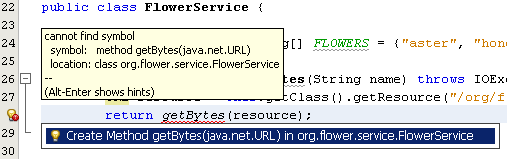

// 
//     Licensed to the Apache Software Foundation (ASF) under one
//     or more contributor license agreements.  See the NOTICE file
//     distributed with this work for additional information
//     regarding copyright ownership.  The ASF licenses this file
//     to you under the Apache License, Version 2.0 (the
//     "License"); you may not use this file except in compliance
//     with the License.  You may obtain a copy of the License at
// 
//       http://www.apache.org/licenses/LICENSE-2.0
// 
//     Unless required by applicable law or agreed to in writing,
//     software distributed under the License is distributed on an
//     "AS IS" BASIS, WITHOUT WARRANTIES OR CONDITIONS OF ANY
//     KIND, either express or implied.  See the License for the
//     specific language governing permissions and limitations
//     under the License.
//

= 端到端二进制 SOAP 附件第 3 部分：对 Web 服务进行编码和测试
:jbake-type: tutorial
:jbake-tags: tutorials 
:jbake-status: published
:icons: font
:syntax: true
:source-highlighter: pygments
:toc: left
:toc-title:
:description: 端到端二进制 SOAP 附件第 3 部分：对 Web 服务进行编码和测试 - Apache NetBeans
:keywords: Apache NetBeans, Tutorials, 端到端二进制 SOAP 附件第 3 部分：对 Web 服务进行编码和测试

在本课中，将学习如何向 Web 服务/会话 Bean 类中添加代码，以将 JPEG 文件转换为字节数组以及将字节数组转换为  ``java.awt.Image``  对象。您还将向公共 Web 服务操作中添加代码以便操作可返回这些  ``Image``  对象。最后，将使用 NetBeans IDE 的 "Test Web Service"（测试 Web 服务）实用程序来在浏览器中对 Web 服务进行测试。

*本教程中的课程*

image::images/netbeans-stamp-80-74-73.png[title="此页上的内容适用于 NetBeans IDE 7.2、7.3、7.4 和 8.0"]

1. link:./flower_overview.html[+概述+]
2. link:flower_ws.html[+创建 Web 服务+]
3. => 对 Web 服务进行编码和测试
4. link:./flower_wsdl_schema.html[+修改方案文件和 WSDL 文件以传递二进制数据+]
5. link:./flower_swing.html[+创建 Swing 客户端+]

*本课内容*
6. <<coding-ws,对 Web 服务进行编码>>

. <<retrieve-jpeg-as-bytes,以字节数组形式获取 JPEG 文件>>
. <<read-bytes-as-image,读取字节数组作为图像>>
. <<implement-getflower,实现 getFlower>>
. <<create-byte-array-list,为所有 JPEG 文件创建字节数组列表>>
. <<implement-getthumbnails,实现 getThumbnails>>

[start=2]
. <<test-ws,测试 Web 服务>>

[[coding-ws]]
== 对 Web 服务进行编码

现在得到了包含一组 JPEG 文件和一个 Web 服务的 Web 应用程序。Web 服务被实现为一个无状态会话 Bean。Web 服务包含两个空 Web 操作。在本课中，您将向 Web 服务中添加代码，以将 JPEG 文件转换为字节数组以及将字节数组转换为  ``java.awt.Image``  对象。您还将向公共 Web 服务操作中添加代码以便操作可返回这些  ``Image``  对象。

[[retrieve-jpeg-as-bytes]]
=== 以字节数组形式获取 JPEG 文件

在此部分，将向  ``FlowerService``  类主体中添加一对私有方法。这些方法采用鲜花的名称，创建到鲜花的 JPEG 文件的路径，并返回 JPEG 文件的二进制表示（字节数组）。在后续部分中，将向公共 Web 服务操作中添加代码以使操作调用这些私有方法。

1. 打开项目的 "Source"（源）视图。需要添加代码，该代码采用图像的名称，基于该名称创建到图像的路径，以及检索图像以作为字节数组。将以下代码键入或粘贴到  ``FlowerService``  类主体中：

[source,java]
----

private byte[] getFlowerBytes(String name) throws IOException {
    URL resource = this.getClass().getResource("/org/flower/resources/"+name+".jpg");
    return getBytes(resource);
}
----

[start=2]
. 随即出现 IDE 无法找到类  ``URL``  的警告。通过手动方式或者按 Ctrl-Shift-I 组合键（在 Mac 上为 ⌘-Shift-I 组合键）为  ``link:http://download.oracle.com/javase/6/docs/api/java/net/URL.html[+java.net.URL+]``  添加一条导入语句。

[start=3]
. 随即出现新的警告。警告表明 IDE 无法找到  ``getBytes``  方法。左键单击警告图标然后单击提示以创建  ``getBytes``  方法。

[start=4]
. 编辑器会将焦点置于刚刚创建的  ``getBytes``  方法上。将以下代码添加到方法中。此代码link:http://download.oracle.com/javase/6/docs/api/java/net/URL.html#openStream%28%29[+打开到 URL 的连接+]，通过  ``getFlowerBytes``  方法传递该 URL 并返回一个  ``link:http://download.oracle.com/javase/6/docs/api/java/io/InputStream.html[+InputStream+]`` 。然后此代码读取输入流（一次 1024 个字节），将字节存储在字节数组缓冲区中，接着再从缓冲区写入  ``link:http://download.oracle.com/javase/6/docs/api/java/io/ByteArrayOutputStream.html[+ByteArrayOutputStream+]`` 。

[source,java]
----

private byte[] getBytes(URL resource) throws IOException {
    InputStream in = resource.openStream();
    ByteArrayOutputStream bos = new ByteArrayOutputStream();
    byte[] buf = new byte[1024];
    for(int read; (read = in.read(buf)) != -1;) {
        bos.write(buf, 0, read);
    }
    return bos.toByteArray();
}
----

[start=5]
. 为  ``java.io.InputStream``  和  ``java.io.ByteArrayOutputStream``  添加导入语句。

[[read-bytes-as-image]]
=== 读取字节数组作为图像

在此部分，将向  ``FlowerService``  类主体中添加一个私有方法。该方法传入一个代表 JPEG 文件的字节数组，并返回  ``java.awt.Image``  对象。请注意，字节数组是由  ``getBytes(URL)``  方法所创建的，该方法在<<retrieve-jpeg-as-bytes,以字节数组形式获取 JPEG 文件>>部分中创建。

1. 在  ``FlowerService``  类主体中，添加以下名为  ``getImage``  的私有方法。 ``getImage``  方法的返回类型为  ``Image`` 。该方法采用两个参数。第一个参数是由  ``getBytes``  方法创建的字节数组。第二个参数是一个布尔值，用于表示该图像是否为缩略图。 ``getImage``  方法抛出一个  ``IOException`` 。

[source,java]
----

private Image getImage(byte[] bytes, boolean isThumbnail) throws IOException {
    }
----

[start=2]
. 在  ``getImage``  方法主体中，添加一行代码，以通过该方法作为参数传入的字节数组来创建  ``link:http://download.oracle.com/javase/6/docs/api/java/io/ByteArrayInputStream.html[+ByteArrayInputStream+]`` 。

[source,java]
----

ByteArrayInputStream bis = new ByteArrayInputStream(bytes);
----

[start=3]
. 添加一行代码，以通过  ``ByteArrayInputStream``  创建一个  ``Object`` 。

[source,java]
----

Object source = bis;
----

[start=4]
. 添加一行代码，以通过通用  ``Object``  创建一个  ``link:http://download.oracle.com/javase/6/docs/api/javax/imageio/stream/ImageInputStream.html[+ImageInputStream+]`` 。

[source,java]
----

ImageInputStream iis = ImageIO.createImageInputStream(source);
----

[start=5]
. 添加一行代码来为所有当前注册的可以解码 JPEG 文件的  ``link:http://download.oracle.com/javase/6/docs/api/javax/imageio/ImageReader.html[+ImageReader+]``  创建一个  ``link:http://download.oracle.com/javase/6/docs/api/java/util/Iterator.html[+Iterator+]`` 。

[source,java]
----

Iterator readers = ImageIO.getImageReadersByFormatName("jpeg");
----

[start=6]
. 添加一行代码，用于通过  ``Iterator``  中的下一个元素创建  ``ImageReader`` 。

[source,java]
----

ImageReader reader = (ImageReader) readers.next();
----

[start=7]
. 添加代码行以创建默认的link:http://download.oracle.com/javase/6/docs/api/javax/imageio/IIOParam.html[+图像读取参数+]，但是如果  ``Image``  代表缩略图，请将四种link:http://download.oracle.com/javase/6/docs/api/javax/imageio/IIOParam.html#setSourceSubsampling%28int,%20int,%20int,%20int%29[+二次采样+]中的一种添加到图像读取参数中。

[source,java]
----

ImageReadParam param = reader.getDefaultReadParam();
if (isThumbnail) {
    param.setSourceSubsampling(4, 4, 0, 0);
}
----

[start=8]
. 最后，添加代码以使用  ``ImageReader``  对象来读取  ``ImageInputStream``  对象，并基于该对象和图像读取参数来返回  ``Image`` 。

[source,java]
----

reader.setInput(iis, true);
return reader.read(0, param);
----

[start=9]
. 按 Ctrl-Shift-I 组合键（在 MacOS 上按 ⌘-Shift-I 组合键）。"Fix All Imports"（修复所有导入）对话框即打开。接受 "Fix All Imports"（修复所有导入）对话框的默认建议，然后单击 "OK"（确定）。 

image::images/fix-getimage-imports.png[]

 ``getImage``  方法现在已完成。

[source,java]
----

private Image getImage(byte[] bytes, boolean isThumbnail) throws IOException {
    ByteArrayInputStream bis = new ByteArrayInputStream(bytes);
    Object source = bis; // File or InputStream
    ImageInputStream iis = ImageIO.createImageInputStream(source);
    Iterator readers = ImageIO.getImageReadersByFormatName("jpeg");
    ImageReader reader = (ImageReader) readers.next();
    ImageReadParam param = reader.getDefaultReadParam();
    if (isThumbnail) {
        param.setSourceSubsampling(4, 4, 0, 0);
    }
    reader.setInput(iis, true);
    return reader.read(0, param);
}
----

[[implement-getflower]]
=== 实现 getFlower

将以下实现代码添加到  ``getFlower()``  方法中以通过花的名称来获取鲜花并返回该花的图像，如下所示。请注意，此代码调用私有的  ``getFlowerBytes(name)``  方法来以字节数组形式获取 JPEG 文件。然后该代码调用私有的  ``getImage``  方法来返回字节数组以作为  ``Image``  对象。

[source,java]
----

@WebMethod(operationName = "getFlower")
public Image getFlower(@WebParam(name = "name") String name) throws IOException {
    byte[] bytes = getFlowerBytes(name);
    return getImage(bytes, false);
}
----

[[create-byte-array-list]]
=== 为所有 JPEG 文件创建字节数组列表

1. 在  ``FlowerService``  类主体的顶部，创建一个用于表示每朵花名称的 String 数组。

[source,java]
----

private static final String[] FLOWERS = {"aster", "honeysuckle", "rose", "sunflower"};
----

[start=2]
. 添加一个方法，该方法创建一个  ``link:http://download.oracle.com/javase/6/docs/api/java/util/ArrayList.html[+ArrayList+]`` ，并将每朵花的字节数组添加到  ``List``  中。

[source,java]
----

private List allFlowers() throws IOException {
    List flowers = new ArrayList();
    for (String flower:FLOWERS) {
        URL resource = this.getClass().getResource("/org/flower/resources/"+flower+".jpg");
        flowers.add(getBytes(resource));
    }
    return flowers;
}
----

[start=3]
. 为  ``java.util.ArrayList``  和  ``java.util.List``  添加导入语句。

[[implement-getthumbnails]]
=== 实现 getThumbnails

按照如下所示更改  ``getThumbnails()``  方法。请注意，添加实现代码并将返回类型从  ``List``  更改为  ``List<Image>`` 。还请注意，将布尔型  ``isThumbnail``  的值  ``true``  传递到  ``getImage``  方法。 ``getThumbnails``  的实现代码调用  ``allFlowers``  方法来<<create-byte-array-list,为所有 JPEG 文件创建字节数组列表>>。然后  ``getThumbnails``  方法创建一个  ``Image``  的  ``List``  并为每朵花调用  ``getImage``  方法，从而将该花的字节数组作为  ``Image``  对象返回，并将该  ``Image``  添加到  ``List``  中。

[source,java]
----

@WebMethod(operationName = "getThumbnails")
public List<Image> getThumbnails() throws IOException {
    List<byte[]> flowers = allFlowers();
    List<Image> flowerList = new ArrayList<Image>(flowers.size());
    for (byte[] flower : flowers) {
        flowerList.add(getImage(flower, true));
    }
    return flowerList;
}
----

结合的 Web 服务/会话 Bean 现在已完成。Web 服务类的最终窗体如下：

[source,java]
----

package org.flower.service;import java.awt.Image;
import java.io.ByteArrayInputStream;
import java.io.ByteArrayOutputStream;
import java.io.IOException;
import java.io.InputStream;
import java.net.URL;
import java.util.ArrayList;
import java.util.Iterator;
import java.util.List;
import javax.jws.WebMethod;
import javax.jws.WebParam;
import javax.jws.WebService;
import javax.ejb.Stateless;
import javax.imageio.ImageIO;
import javax.imageio.ImageReadParam;
import javax.imageio.ImageReader;
import javax.imageio.stream.ImageInputStream;@WebService(serviceName = "FlowerService")
@Stateless()
public class FlowerService {private static final String[] FLOWERS = {"aster", "honeysuckle", "rose", "sunflower"};@WebMethod(operationName = "getFlower")
    public Image getFlower(@WebParam(name = "name") String name) throws IOException {
        byte[] bytes = getFlowerBytes(name);
        return getImage(bytes, false);
    }@WebMethod(operationName = "getThumbnails")
    public List<Image> getThumbnails() throws IOException {
        List flowers = allFlowers();
        List<Image> flowerList = new ArrayList<Image>(flowers.size());
        for (byte[] flower : flowers) {
            flowerList.add(getImage(flower, true));
        }
        return flowerList;
    }private byte[] getFlowerBytes(String name) throws IOException {
        URL resource = this.getClass().getResource("/org/flower/resources/" + name + ".jpg");
        return getBytes(resource);
    }private byte[] getBytes(URL resource) throws IOException {
        InputStream in = resource.openStream();
        ByteArrayOutputStream bos = new ByteArrayOutputStream();
        byte[] buf = new byte[1024];
        for (int read; (read = in.read(buf)) != -1;) {
            bos.write(buf, 0, read);
        }
        return bos.toByteArray();
    }private Image getImage(byte[] bytes, boolean isThumbnail) throws IOException {
        ByteArrayInputStream bis = new ByteArrayInputStream(bytes);
        Iterator readers = ImageIO.getImageReadersByFormatName("jpeg");
        ImageReader reader = (ImageReader) readers.next();
        Object source = bis; // File or InputStream
        ImageInputStream iis = ImageIO.createImageInputStream(source);
        reader.setInput(iis, true);
        ImageReadParam param = reader.getDefaultReadParam();
        if (isThumbnail) {
            param.setSourceSubsampling(4, 4, 0, 0);
        }
        return reader.read(0, param);
    }private List allFlowers() throws IOException {
        List flowers = new ArrayList();
        for (String flower : FLOWERS) {
            URL resource = this.getClass().getResource("/flower/album/resources/" + flower + ".jpg");
            flowers.add(getBytes(resource));
        }
        return flowers;
    }
}
----

[[test-ws]]
== 测试 Web 服务

既然 Web 服务已完成，您可以对其进行部署和测试。

*测试 Web 服务：*

1. 右键单击 "FlowerAlbumService" 节点，然后选择 "Deploy"（部署）。IDE 编译源代码，启动 GlassFish Server，并将项目的 WAR 文件部署到服务器。如果打开 "Services"（服务）窗口，将在服务器的 "Applications"（应用程序）节点中看到已部署的  ``FlowerService`` 。

*重要说明：*GlassFish Server Open Source Edition 的版本必须是 3.1 或更高版本。

image::images/deployed-service.png[]

[start=2]
. 展开项目的 "Web Services"（Web 服务）节点。右键单击 "FlowerService" 然后选择 "Test Web Service"（测试 Web 服务）。 

image::images/test-ws-node.png[]

[start=3]
. Web 服务测试器在浏览器中打开。在  ``getFlower``  参数字段中键入 "rose"。

image::images/ws-tester.png[]

[start=4]
. 按  ``getFlower``  按钮。IDE 在浏览器中显示有关调用的信息。查看“Method Returned”时，会看到乱码。您想要看到一幅图像，而不是一系列的符号。但是，由于  ``java.awt.Image``  不是有效的方案类型，需要手动配置方案文件以返回二进制 image/jpeg 数据。这将在下一个教程中完成。 

image::images/ws-tester-badschema.png[]

[start=5]
. 

== 后续步骤：

link:./flower_wsdl_schema.html[+修改方案文件和 WSDL 文件以传递二进制数据+]

link:/about/contact_form.html?to=3&subject=Feedback:%20Flower%20Coding%20WS%20EE6[+发送有关此教程的反馈意见+]

要发送意见和建议、获得支持以及随时了解 NetBeans IDE Java EE 开发功能的最新开发情况，请link:../../../community/lists/top.html[+加入 nbj2ee@netbeans.org 邮件列表+]。

