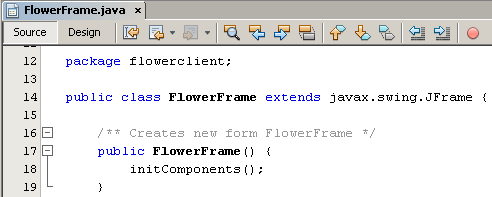

// 
//     Licensed to the Apache Software Foundation (ASF) under one
//     or more contributor license agreements.  See the NOTICE file
//     distributed with this work for additional information
//     regarding copyright ownership.  The ASF licenses this file
//     to you under the Apache License, Version 2.0 (the
//     "License"); you may not use this file except in compliance
//     with the License.  You may obtain a copy of the License at
// 
//       http://www.apache.org/licenses/LICENSE-2.0
// 
//     Unless required by applicable law or agreed to in writing,
//     software distributed under the License is distributed on an
//     "AS IS" BASIS, WITHOUT WARRANTIES OR CONDITIONS OF ANY
//     KIND, either express or implied.  See the License for the
//     specific language governing permissions and limitations
//     under the License.
//

= Web Service Passing Binary Data, pt 5: Creating the Swing Client
:jbake-type: tutorial
:jbake-tags: tutorials 
:jbake-status: published
:icons: font
:syntax: true
:source-highlighter: pygments
:toc: left
:toc-title:
:description: Web Service Passing Binary Data, pt 5: Creating the Swing Client - Apache NetBeans
:keywords: Apache NetBeans, Tutorials, Web Service Passing Binary Data, pt 5: Creating the Swing Client

The goal of this exercise is to create a client for the web service you previously created and deployed, and then add a GUI interface to that client. The interface displays the images that the web service passes as binary data.

You can download a complete version of the client from the link:https://netbeans.org/projects/samples/downloads/download/Samples%252FWeb%2520Services%252FWeb%2520Service%2520Passing%2520Binary%2520Data%2520--%2520EE6%252FFlowerClient.zip[+NetBeans Samples Catalog+].

*Lessons In This Tutorial*

image::images/netbeans-stamp-74-73-72.png[title="Content on this page applies to the NetBeans IDE 7.2, 7.3 and 7.4"]

1. xref:flower_overview.adoc[+Overview+]
2. xref:flower_ws.adoc[+Creating the Web Service+]
3. xref:flower-code-ws.adoc[+Coding and Testing the Web Service+]
4. xref:flower_wsdl_schema.adoc[+Modifying the Schema and WSDL Files to Pass Binary Data+]
5. => Creating the Swing Client

[start=1]
1. <<create-client-app,Creating the Client Application>>

[start=2]
. <<design-jframe,Designing the JFrame>>

[start=3]
. 
<<bind-jframe,Binding the JFrame Components>>

[start=4]
. <<code-main-class,Coding the Main Class>>

==  Creating the Client Application

In this section, you create a web application. Within this application, you create a client that consumes the web service you created and modified in previous tutorials.

*To create the client application: *

1. Choose File > New Project (Ctrl-Shift-N on Linux/Windows, ⌘-Shift-N on MacOS). The New Project wizard appears.
2. Select Java Application from the Java category. Click Next. The New Java Application wizard appears. Type  ``FlowerClient``  in Project Name. Select a location for the project and click Finish. The IDE creates a new Java application project.
3. Right-click the  ``FlowerClient``  project node and choose New > Web Service Client from the context menu. The New Web Service Client wizard opens.
4. Select the WSDL URL radio button and paste the URL of the WSDL file into that field. (By default, the URL is  ``http://localhost:8080/FlowerAlbumService/FlowerServiceService?wsdl`` . Find the URL in the browser by testing the web service and replacing  ``?Tester``  with  ``?wsdl``  at the end of the URL.) Accept all other default values, including a blank package name. 

image::images/ws-client-wiz.png[]

[start=5]
. Click Finish. The IDE downloads the WSDL file, adds client stubs for interacting with the web service, and adds nodes to the Projects window in the Java application project. 

image::images/client-generated-sources.png[title="Projects view showing new web service client"]

[[design-jframe]]
== Designing the JFrame Form

In this section, you add a  ``JFrame``  to the web application and design a GUI interface within it, using Swing components. Finally, you bind the Swing components to the web service client code.

If you do not want to design the JFrame form yourself, you can download a predesigned JFrame Java file link:https://netbeans.org/projects/www/downloads/download/webservices%252FFlowerFrame.java[+here+].

1. Right-click the  ``FlowerClient``  node and select New > JFrame Form. Name the frame  ``FlowerFrame`` . Place it in the  ``flowerclient``  package.
2. The  ``FlowerFrame``  opens in the editor. Open the Palette if it is not open. Extend the bottom boundary of the frame by around one-third.

image::images/opened-flowerform.png[]

[start=3]
. Drag a JPanel from the Swing Containers section of the Palette to the  ``FlowerFrame`` . Expand it to fill the entire  ``FlowerFrame`` . 

image::images/add-panel.png[]

[start=4]
. Right-click the Panel in the Design View. Select Change Variable Name... from the context menu. Name the panel  ``gardenFlowersPanel`` .

[start=5]
. Drag a JLabel from the Palette to the top of the `` gardenFlowersPanel`` . Right-click the label, and change the label's variable name to  ``titleLabel`` . Right-click the  ``titleLabel``  again and select Edit Text. Change the text to Garden Flowers. You may want to explore the  ``titleLabel`` 's properties and give it a prominent font.

[start=6]
. Drag a Button Group into the design view. Accept the button group's default variable name of  ``buttonGroup1`` .

[start=7]
. Drag four Radio Buttons into a horizontal row beneath the  ``titleLabel`` . In the properties of each button, set it as a member of  ``buttonGroup1`` . The buttons' other properties are as follows:
|===
|Radio Buttons in buttonGroup1

|Variable Name |Selected |Text 

|asterRadioButton |true |Aster 

|honeysuckleRadioButton |false |Honeysuckle 

|roseRadioButton |false |Rose 

|sunflowerRadioButton |false |Sunflower 
|===

[start=8]
. Drag a Scroll Pane to below the radio buttons. Expand it to fill all the horizontal space and about two-thirds of the free vertical space. Change the scroll pane's variable name to  ``mainScrollPane`` .

[start=9]
. Drag a Panel into the  ``mainScrollPane`` . Change the Panel's variable name to  ``mainPanel`` .

[start=10]
. In the Design view, right-click the  ``mainPanel``  and select Set Layout > Border Layout.

[start=11]
. Drag a Button into the  ``mainPanel`` . Because the  ``mainPanel``  has border layout, the button automatically fills the entire panel. Change the button's variable name to  ``mainPictureButton``  and change the button's text to "Waiting for picture..."

[start=12]
. Drag another Scroll Pane to the space below the  ``mainScrollPane`` . Expand the new scroll pane to fill up all remaining free space. Change the new scroll pane's variable name to  ``thumbnailScrollPane`` .

[start=13]
. Drag a Panel into the  ``thumbnailScrollPane`` . Change the Panel's variable name to  ``thumbnailPanel`` . Set the  ``thumbnailPanel`` 's layout to Grid Layout.

[start=14]
. Drag four Buttons into the  ``thumbnailPanel`` . Because the  ``thumbnailPanel``  has Grid Layout, the Buttons are automatically of equal size and completely fill the panel. The buttons' properties are as follows: Buttons in the thumbnailPanel
|===

|Variable Name |Text 

|asterButton |Waiting... 

|honeysuckleButton |Waiting... 

|roseButton |Waiting 

|sunflowerButton |Waiting... 
|===

The JFrame Form is now completely designed. At this point, the  ``FlowerFrame``  looks as follows. 

image::images/designed-form.png[title="Completed Flower Frame showing button texts instead of images"]

== Binding the JFrame Components

In this section, you initialize the components in the constructor and bind the components to listeners. The listeners call code that shows the flower images.

=== [[Initializing the Components]] 

[[In this section, you fill in the  ``FlowerFrame``  constructor

]]

1. Change to the Source view of the editor. Locate the beginning of the  ``FlowerFrame``  class body and the  ``FlowerFrame``  constructor.

. At the top of the class body of  ``FlowerFrame`` , before the constructor, create an array of strings of the names of every flower.

[source,java]
----

protected static final String[] FLOWERS = {"aster", "honeysuckle", "rose", "sunflower"};
----
. Between the FLOWERS string array and the constructor, add a line that initializes a  ``link:http://download.oracle.com/javase/6/docs/api/java/util/Map.html[+java.util.Map+]``  named  ``flowers`` . The map takes a  ``String``  and maps it to an  ``Image`` .

[source,java]
----

private Map<String, Image> flowers;
----
. Add import statements for  ``java.util.Map``  and  ``java.awt.Image`` .
. Add code to the  ``FlowerFrame``  constructor to associate a specific  ``Image``  with a specific  ``String``  for a specific instance of the  ``flowers``  map

[source,java]
----

public FlowerFrame(Map<String, Image> flowers) {

    this.flowers = flowers;
    for (String flower:FLOWERS) {
        flowers.put(flower,null);
    }

    initComponents();    
} 
----

[start=3]
. Initialize  ``ItemListener`` s for the radio buttons and  ``ActionListener`` s for the four flower buttons, and set the default title.

[source,java]
----

public FlowerFrame(Map<String, Image> flowers) {

    this.flowers = flowers;
    for (String flower:FLOWERS) {
        flowers.put(flower,null);
    }

    initComponents(); 
    
    setTitle("Garden Flowers [waiting for picture]");
    
    ItemListener rbListener = new RBListener();
    asterRadioButton.addItemListener(rbListener);
    honeysuckleRadioButton.addItemListener(rbListener);
    roseRadioButton.addItemListener(rbListener);
    sunflowerRadioButton.addItemListener(rbListener);
    
    ActionListener bListener = new ButtonListener();
    asterButton.addActionListener(bListener);
    honeysuckleButton.addActionListener(bListener);
    roseButton.addActionListener(bListener);
    sunflowerButton.addActionListener(bListener);
}
----

[start=4]
. Add import statements for  ``link:http://download.oracle.com/javase/6/docs/api/java/awt/event/ItemListener.html[+java.awt.event.ItemListener+]``  and  ``link:http://download.oracle.com/javase/6/docs/api/java/awt/event/ActionListener.html[+java.awt.event.ActionListener+]`` .

The constructor is now complete. You have compile error warnings in the code because the code does not contain the classes  ``RBListener``  and  ``ButtonListener`` . These two classes are custom implementations of  ``ItemListener``  and  ``ActionListener`` , respectively. You write these two classes in the next section.

=== [[Showing the Flowers]] 

[[In this section, you write custom listeners for the radio buttons and the flower buttons. You also write a method that determines which flower is selected by the buttons and gets an  ``Image``  of that flower from the  ``flowers``  map. Lastly, you write a method that is called by the  ``Main``  class and that gets an  ``Image``  for each thumbnail.

]]

1. Find the  ``public static void main(String args[])``  method in the  ``FlowerFrame``  class body. Delete this method and its documentation. (The application uses the  ``Main``  class instead.)
. In place of the  ``main``  method, write a custom  ``ItemListener``  for the radio buttons. This listener shows a new flower image when a radio button is chosen.

[source,java]
----

private class RBListener implements ItemListener {
    public void itemStateChanged(ItemEvent e) {
        showFlower();
    }
}
----
. Add an import statement for  ``link:http://download.oracle.com/javase/6/docs/api/java/awt/event/ItemEvent.html[+java.awt.event.ItemEvent+]`` .
. Below the custom  ``ItemListener`` , write a custom  ``ActionListener``  for the 4 flower buttons. When a button is clicked, the listener selects the related radio button:

[source,java]
----

private class ButtonListener implements ActionListener {

    public void actionPerformed(ActionEvent e) {
        if (e.getSource() == asterButton) asterRadioButton.setSelected(true);
        else if (e.getSource() == honeysuckleButton) honeysuckleRadioButton.setSelected(true);
        else if (e.getSource() == roseButton) roseRadioButton.setSelected(true);
        else if (e.getSource() == sunflowerButton) sunflowerRadioButton.setSelected(true);
    }
}
----

[start=2]
. Add an import statement for  ``link:http://download.oracle.com/javase/6/docs/api/java/awt/event/ActionEvent.html[+java.awt.event.ActionEvent+]`` .

[start=3]
. Below the custom  ``ActionListener`` , write the  ``showFlower``  method. This method determines which radio button is selected and gets an  ``Image``  of the corresponding flower from the  ``flowers``  map.

[source,java]
----

void showFlower() {
    Image img = null;
    if (asterRadioButton.isSelected()) {
        img = flowers.get("aster");
        if (img != null) {
            mainPictureButton.setIcon(new ImageIcon(img));
            setTitle("Garden Flowers [Aster]");
        }
    } else if (honeysuckleRadioButton.isSelected()) {
        img = flowers.get("honeysuckle");
        if (img != null) {
            mainPictureButton.setIcon(new ImageIcon(img));
            setTitle("Garden Flowers [Honeysuckle]");
        }

    } else if (roseRadioButton.isSelected()) {
        img = flowers.get("rose");
        if (img != null) {
            mainPictureButton.setIcon(new ImageIcon(img));
            setTitle("Garden Flowers [Rose]");
        }
    } else if (sunflowerRadioButton.isSelected()) {
        img = flowers.get("sunflower");
        if (img != null) {
            mainPictureButton.setIcon(new ImageIcon(img));
            setTitle("Garden Flowers [Sunflower]");
        }
    }
    if (img == null) {
        mainPictureButton.setIcon(null);
        setTitle("Garden Flowers [waiting for picture]");            
    } else mainPictureButton.setText("");
}
----

[start=4]
. Add an import statement for  ``link:http://download.oracle.com/javase/6/docs/api/javax/swing/ImageIcon.html[+javax.swing.ImageIcon+]`` .

[start=5]
. Write the  ``setThumbnails``  method. This method gets an image for each thumbnail from the  ``flowers``  map. The  ``Main``  class calls this method.

[source,java]
----

void setThumbnails(Map<String, Image> thumbs) {
    Image img = thumbs.get("aster");
    if (img != null) {
        asterButton.setIcon(new ImageIcon(img));
        asterButton.setText("");
    }
    img = thumbs.get("honeysuckle");
    if (img != null) {
        honeysuckleButton.setIcon(new ImageIcon(img));
        honeysuckleButton.setText("");
    }
    img = thumbs.get("rose");
    if (img != null) {
        roseButton.setIcon(new ImageIcon(img));
        roseButton.setText("");
    }
    img = thumbs.get("sunflower");
    if (img != null) {
        sunflowerButton.setIcon(new ImageIcon(img));
        sunflowerButton.setText("");
    }
}
----

[start=6]
. Fix the imports in  ``FlowerFrame`` , if you did not fix them as you pasted in the code. You can fix them all at once by right-clicking in the editor and choosing Fix Imports from the context menu. The complete set of import statements follows:

[source,java]
----

import java.awt.Image;import java.awt.event.ActionEvent;import java.awt.event.ActionListener;import java.awt.event.ItemEvent;import java.awt.event.ItemListener;import java.util.Map;import javax.swing.ImageIcon;
----

The  ``FlowerFrame``  is now complete.

== [[Coding the Main Class]] 

[[In this section, you complete the  ``Main``  class so that is shows the  ``FlowerFrame`` , connects to the web service, and calls the web service operations.

1. Open the  ``Main.java``  class in the editor.

image::images/main-empty.png[]

[start=2]
. In the class body, before the  ``main``  method, initialize an  ``int``  variable for the number of downloaded pictures.

[source,java]
----

 private static int downloadedPictures;
----

[start=3]
. In the  ``main``  method body, create a  ``HashMap``  of four flowers and another  ``HashMap``  of four thumbnails.

[source,java]
----

final Map<String,Image> flowers = new HashMap<String,Image>(4);
final Map<String,Image> thumbs = new HashMap<String,Image>(4);
----

[start=4]
. Add import statements for  ``java.awt.Image`` ,  ``java.util.Map`` , and  ``java.util.HashMap`` .

[start=5]
. In the  ``main``  method body, add code to show the  ``FlowerFrame`` .*// Show the FlowerFrame.*

[source,java]
----

final FlowerFrame frame = new FlowerFrame(flowers);
frame.setVisible(true);  
----

[start=6]
. In the  ``main``  method body, add code to connect the client to the service.*// The client connects to the service with this code.*

[source,java]
----

FlowerServiceService service = new FlowerServiceService();
final FlowerService port = service.getFlowerServicePort();
----

[start=7]
. Add import statements for  ``org.flower.service.FlowerService``  and  ``org.flower.service.FlowerServiceService`` .

[start=8]
. In the  ``main``  method body, add code that creates an array of four  ``Runnable``  threads and calls the web service's  ``getFlower``  operation once in each thread.*// The web service getFlower operation
// is called 4 times, each in a separate thread.
// When the operation finishes the picture is shown in
// a specific button.*

[source,java]
----

Runnable[] tasks = new Runnable[4];

for (int i=0; i<4;i++) {
    final int index = i;
    tasks[i] = new Runnable() {
        public void run() {
            try {
            
                *// Call the getFlower operation
                // on the web service:*
                Image img = port.getFlower(FlowerFrame.FLOWERS[index]);
                System.out.println("picture downloaded: "+FlowerFrame.FLOWERS[index]);
                     
                *// Add strings to the hashmap:*
                flowers.put(FlowerFrame.FLOWERS[index],img);
                        
                *// Call the showFlower operation
                // on the FlowerFrame:*
                frame.showFlower();
                        
            } catch (IOException_Exception ex) {
                ex.printStackTrace();
            }
            downloadedPictures++;
        }
    };
    new Thread(tasks[i]).start();
}
----

[start=9]
. Add an import statement for  ``org.flower.service.IOException_Exception`` .

[start=10]
. In the  ``main``  method body, add code that calls the web service's  ``getThumbnails``  operation in a separate thread.*// The web service getThumbnails operation is called
// in a separate thread, just after the previous four threads finish.
// When the images are downloaded, the thumbnails are shown at 
// the bottom of the frame.*

[source,java]
----

Runnable thumbsTask = new Runnable() {
    public void run() {
        try {
            while (downloadedPictures < 4) {                        
                try {Thread.sleep(100);} catch (InterruptedException ex) {}
            }
                 
            *// Call the getThumbnails operation
            // on the web service:*
            List<Image> images = port.getThumbnails();
            System.out.println("thumbs downloaded");
                    
            if (images != null &amp;&amp; images.size() == 4) {
                for (int i=0;i<4;i++) {
                    thumbs.put(FlowerFrame.FLOWERS[i],images.get(i));
                }
                frame.setThumbnails(thumbs);
            }
        } catch (IOException_Exception ex) {
            ex.printStackTrace();
        }
    }            
};
new Thread(thumbsTask).start();

----

[start=11]
. Fix the imports in  ``Main.java`` , if you did not fix them as you pasted in the code. You can fix them all at once by right-clicking in the editor and choosing Fix Imports from the context menu. You are given a choice of List classes to import; select  ``java.util.List`` . The complete set of import statements follows:

[source,java]
----

import flower.album.FlowerService;import flower.album.FlowerService_Service;import flower.album.IOException_Exception;import java.awt.Image;import java.util.HashMap;import java.util.List;import java.util.Map;
----

The  ``Main``  class is now complete.

[source,java]
----

public class Main {

     private static int downloadedPictures;
    
     public static void main(String[] args) {
    
        final Map<String,Image> flowers = new HashMap<String,Image>(4);
        final Map<String,Image> thumbs = new HashMap<String,Image>(4);
        
        *// Show the FlowerFrame.*
        final FlowerFrame frame = new FlowerFrame(flowers);
        frame.setVisible(true);
        *        // The client connects to the service with this code.*
        FlowerService_Service service = new FlowerService_Service();
        final FlowerService port = service.getFlowerServicePort();
        
        Runnable[] tasks = new Runnable[4];
        
        *// The web service getFlower operation
        // is called 4 times, each in a separate thread.
        // When the operation finishes the picture is shown in
        // a specific button.*
        for (int i=0; i<4;i++) {
            final int index = i;
            tasks[i] = new Runnable() {
                public void run() {
                    try {
                    
                        *// Call the getFlower operation
                        // on the web service:*
                        Image img = port.getFlower(FlowerFrame.FLOWERS[index]);
                        System.out.println("picture downloaded: "+FlowerFrame.FLOWERS[index]);
                        
                        *// Add strings to the hashmap:*
                        flowers.put(FlowerFrame.FLOWERS[index],img);
                        
                        *// Call the showFlower operation
                        // on the FlowerFrame:*
                        frame.showFlower();
                        
                    } catch (IOException_Exception ex) {
                        ex.printStackTrace();
                    }
                    downloadedPictures++;
                }
            };
            new Thread(tasks[i]).start();
        }
        *// The web service getThumbnails operation is called
        // in a separate thread, just after the previous four threads finish.
        // When the images are downloaded, the thumbnails are shown at 
        // the bottom of the frame.*
        Runnable thumbsTask = new Runnable() {
            public void run() {
                try {
                    while (downloadedPictures < 4) {                        
                        try {Thread.sleep(100);} catch (InterruptedException ex) {}
                    }
                    
                    *// Call the getThumbnails operation
                    // on the web service:*
                    List<Image> images = port.getThumbnails();
                    System.out.println("thumbs downloaded");
                    
                    if (images != null &amp;&amp; images.size() == 4) {
                        for (int i=0;i<4;i++) {
                            thumbs.put(FlowerFrame.FLOWERS[i],images.get(i));
                        }
                        frame.setThumbnails(thumbs);
                    }
                } catch (IOException_Exception ex) {
                    ex.printStackTrace();
                }
            }            
        };
        new Thread(thumbsTask).start();
    }

}
----

The client application is now complete, with code that interacts with the web service that delegates to the EJB module to exposes its images. Right-click the client and choose Run. The Swing application starts up and, after a moment, is filled with the images received from the web service. If the images do not all appear, clean and build the FlowerService project and run it again. Note that you can change the image that appears in the main frame either by selecting a radio button or by clicking a thumbnail.

]]

xref:../../../community/mailing-lists.adoc[Send Feedback on This Tutorial]

To send comments and suggestions, get support, and keep informed about the latest developments on the NetBeans IDE Java EE development features, xref:../../../community/mailing-lists.adoc[+join the nbj2ee@netbeans.org mailing list+].

