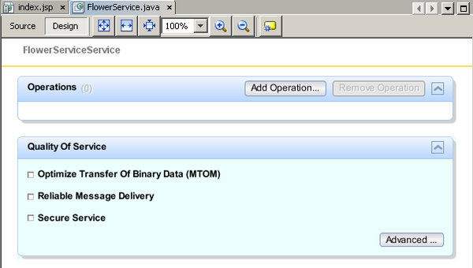

// 
//     Licensed to the Apache Software Foundation (ASF) under one
//     or more contributor license agreements.  See the NOTICE file
//     distributed with this work for additional information
//     regarding copyright ownership.  The ASF licenses this file
//     to you under the Apache License, Version 2.0 (the
//     "License"); you may not use this file except in compliance
//     with the License.  You may obtain a copy of the License at
// 
//       http://www.apache.org/licenses/LICENSE-2.0
// 
//     Unless required by applicable law or agreed to in writing,
//     software distributed under the License is distributed on an
//     "AS IS" BASIS, WITHOUT WARRANTIES OR CONDITIONS OF ANY
//     KIND, either express or implied.  See the License for the
//     specific language governing permissions and limitations
//     under the License.
//

= 端到端二进制 SOAP 附件 2：创建 Web 服务
:jbake-type: tutorial
:jbake-tags: tutorials 
:jbake-status: published
:icons: font
:syntax: true
:source-highlighter: pygments
:toc: left
:toc-title:
:description: 端到端二进制 SOAP 附件 2：创建 Web 服务 - Apache NetBeans
:keywords: Apache NetBeans, Tutorials, 端到端二进制 SOAP 附件 2：创建 Web 服务

本课的目标是创建一个包含 Web 服务的 Web 应用程序。您会将 Web 服务作为一个无状态会话 Bean 来实现。

*本教程中的课程*

image::images/netbeans-stamp-80-74-73.png[title="此页上的内容适用于 NetBeans IDE 7.2、7.3、7.4 和 8.0"]

1. link:./flower_overview.html[+概述+]
2. => 创建 Web 服务
3. link:flower-code-ws.html[+对 Web 服务进行编码和测试+]
4. link:./flower_wsdl_schema.html[+修改方案文件和 WSDL 文件以传递二进制数据+]
5. link:./flower_swing.html[+创建 Swing 客户端+]

*本课内容*

[start=1]
1. <<create-web-app,创建 Web 应用程序>>
2. <<add-ws,添加 Web 服务>>

[[create-web-app]]
== 创建 Web 应用程序

在此部分，您将创建一个 Java EE Web 应用程序。向此应用程序中添加 Web 服务将其作为二进制数据传递的图像。

*创建 Web 应用程序：*

1. 选择 "File"（文件）> "New Project"（新建项目）（在 Linux 和 Windows 上为 Ctrl-Shift-N 组合键，在 MacOS 上为 ⌘-Shift-N 组合键）。此时将打开新建项目向导。从 "Java Web" 类别中选择 "Web Application"（Web 应用程序），然后单击 "Next"（下一步）。"Name and Location"（名称和位置）页打开。
2. 在 "Project Name"（项目名称）字段中键入  ``FlowerAlbumService`` 。为该项目选择所需的位置。保留其他选项为默认设置，然后单击 "Next"（下一步）。"Server and Settings"（服务器和设置）页面打开。
3. 选择 "GlassFish Server"，并选择 Java EE 版本 "Java EE 6 Web" 或 "Java EE 7 Web"。
4. 单击 "Finish"（完成）。将创建  ``FlowerAlbumService``  项目并将其显示在 "Projects"（项目）窗口中。
5. 右键单击 "Source Packages"（源包）节点，然后选择 "New"（新建）> "Java Package"（Java 包）。

也可以选择 "New"（新建）> "Other"（其他），然后在新建文件向导的 "Java" 类别中选择 "Java Package"（Java 包）。

[start=6]
. 将包命名为  ``org.flower.resources`` 。单击 "Finish"（完成）。

image::images/new-package.png[]

[start=7]
. 将以下图像复制到  ``org.flower.resources``  中：
* link:images/rose.jpg[+rose.jpg+]
* link:images/sunflower.jpg[+sunflower.jpg+]
* link:images/aster.jpg[+aster.jpg+]
* link:images/honeysuckle.jpg[+honeysuckle.jpg+]

现在此项目在 "Source Package"（源包）中具有包  ``org.flower.resources`` 。未添加任何其他内容。

image::images/project-w-resources.png[]

[[add-ws]]
== 添加 Web 服务

在此部分，将在 Web 应用程序中创建一个 Web 服务。该服务将作为无状态会话 Bean 来创建。将以下 Web 操作添加到该服务中：

* 获取鲜花名称及其相关  ``Image``  的操作。
* 获取所有鲜花图像的缩略图并将其作为  ``List``  返回的操作。

*添加 Web 服务：*

1. 在 "Projects"（项目）窗口中，右键单击  ``FlowerAlbumService``  项目节点，然后选择 "New"（新建）> "Web Service"（Web 服务）。也可以选择 "New"（新建）> "Other"（其他），然后在新建文件向导中选择 "Web Services"（Web 服务）下的 "Web Service"（Web 服务）。此时将打开新建 Web 服务向导。
2. 在新建 Web 服务向导中，在 "Web Service Name"（Web 服务名称）中键入  ``FlowerService`` ，在 "Package Name"（包名称）中键入  ``org.flower.service`` 。选择 "Create Web Service from Scratch"（从头开始创建 Web 服务）。选中 "Implement Service as Stateless Session Bean"（将 Web 服务作为无状态会话 Bean 实现）。单击 "Finish"（完成）。 

image::images/new-service.png[]

Web 服务出现在 "Projects"（项目）窗口中的项目节点中。"Source Packages"（源包）目录包括了服务包和资源包。

image::images/project-w-service-and-resources.png[]

[start=3]
. 在编辑器中打开  ``FlowerService.java`` 。切换到 "Design"（设计）视图。随即出现一个窗体，在该窗体中可以向 Web 服务中添加操作和服务质量元素。

[start=4]
. 单击 "Add Operation"（添加操作）。此时将打开添加操作向导。

[start=5]
. 将操作命名为  ``getFlower`` 。在 "Return Type"（返回类型）字段中，键入或浏览以找到  ``java.awt.Image`` 。

[start=6]
. 在 "Parameters"（参数）标签中，单击 "Add"（添加）。将参数命名为  ``name``  并接受默认的  ``java.lang.String``  类型。 

image::images/add-getflower-param.png[]

[start=7]
. 打开 "Exceptions"（异常错误）标签。添加一个  ``IOException`` 。

image::images/io-exception.png[]

[start=8]
. 单击 "OK"（确定）并关闭向导。然后再次单击 "Add Operation"（添加操作），并添加带有以下属性的操作：
* *Name（名称）：*getThumbnails
* *Return type（返回类型）：*java.util.List
* *Exception（异常错误）：*IOException

现在 "Design"（设计）视图中显示了  ``getFlower``  和  ``getThumbnails``  操作。切换至这两个操作的“列表视图”，将看到其所有参数。

image::images/flower-service-full-design.png[]

==  

== 后续步骤：

link:./flower-code-ws.html[+对 Web 服务进行编码和测试+]

link:/about/contact_form.html?to=3&subject=Feedback:%20Flower%20Creating%20WS%20EE6[+发送有关此教程的反馈意见+]

要发送意见和建议、获得支持以及随时了解 NetBeans IDE Java EE 开发功能的最新开发情况，请link:../../../community/lists/top.html[+加入 nbj2ee@netbeans.org 邮件列表+]。

