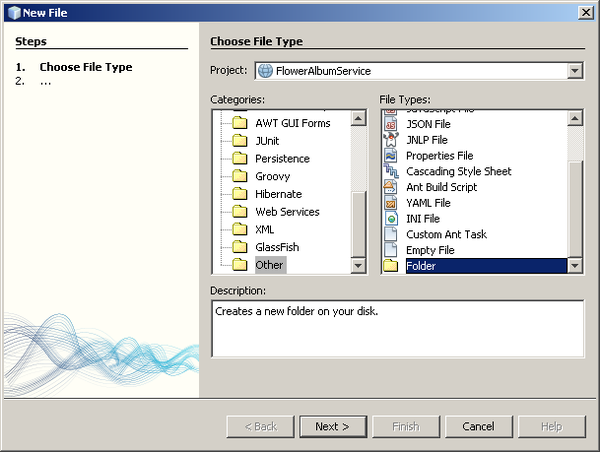
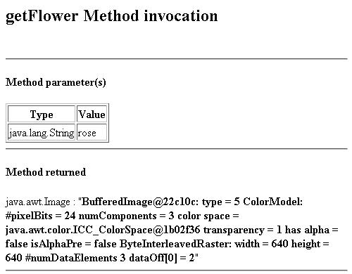

// 
//     Licensed to the Apache Software Foundation (ASF) under one
//     or more contributor license agreements.  See the NOTICE file
//     distributed with this work for additional information
//     regarding copyright ownership.  The ASF licenses this file
//     to you under the Apache License, Version 2.0 (the
//     "License"); you may not use this file except in compliance
//     with the License.  You may obtain a copy of the License at
// 
//       http://www.apache.org/licenses/LICENSE-2.0
// 
//     Unless required by applicable law or agreed to in writing,
//     software distributed under the License is distributed on an
//     "AS IS" BASIS, WITHOUT WARRANTIES OR CONDITIONS OF ANY
//     KIND, either express or implied.  See the License for the
//     specific language governing permissions and limitations
//     under the License.
//

= Web Service Passing Binary Data, pt 4: Modifying the Schema and WSDL Files
:jbake-type: tutorial
:jbake-tags: tutorials 
:jbake-status: published
:icons: font
:syntax: true
:source-highlighter: pygments
:toc: left
:toc-title:
:description: Web Service Passing Binary Data, pt 4: Modifying the Schema and WSDL Files - Apache NetBeans
:keywords: Apache NetBeans, Tutorials, Web Service Passing Binary Data, pt 4: Modifying the Schema and WSDL Files

In this lesson, you add the WSDL file and schema file to the web application. Then you modify the schema file to interpret arrays of bytes as Images. You also edit the web service source code to correctly locate the schema and WSDL file. In the process, you are introduced to various tools in the IDE that help you with WSDL and Schema files.

You can apply the procedure in this section to any JAX-WS web service, to pass any MIME type as binary data. Starting with a web service that passes binary data, as you created in Lessons 2 and 3, you customize the service's WSDL and XML schema. In the customized XML schema file, you add an  ``expectedContentTypes="_mime_type_"``  attribute to the return element for the binary data. This attribute informs the client that it should map the binary data to a Java type (as per MIME > Java type mapping) instead of to an array of bytes. In this tutorial, you map the binary data to  ``java.awt.Image`` , but you can map the binary data to any of the Java types given in the JAXB 2.0 specification, as described in the link:http://jax-ws.dev.java.net/nonav/2.1.4/docs/mtom-swaref.html[+JAX-WS Users Guide+].

You can download a complete sample of the web service from the link:https://netbeans.org/projects/samples/downloads/download/Samples%252FWeb%2520Services%252FWeb%2520Service%2520Passing%2520Binary%2520Data%2520--%2520EE6%252FFlowerAlbumService.zip[+NetBeans Samples Catalog+].

*Lessons In This Tutorial*

image::images/netbeans-stamp-80-74-73.png[title="Content on this page applies to the NetBeans IDE 7.2, 7.3, 7.4 and 8.0"]

1. xref:flower_overview.adoc[+Overview+]
2. xref:flower_ws.adoc[+Creating the Web Service+]
3. xref:flower-code-ws.adoc[+Coding and Testing the Web Service+]
4. => Modifying the Schema and WSDL Files to Pass Binary Data
5. xref:flower_swing.adoc[+ Creating the Swing Client+]

== Modifying the Schema File and WSDL Files to Pass Binary Data

In the following procedure, you create modified WSDL and XML Schema files for the web service that you created in a previous tutorial. The modified WSDL and Schema files enable the web service and the clients that consume it to parse JPEG image data that is passed as binary data.

*To modify the WSDL and Schema files:*

1. In the Projects window, expand the FlowerService web application node until you reach the  ``WEB-INF``  node. Right-click the  ``WEB-INF``  folder and select New > Folder. (You might need to select New > Other, then the Other category). 

[start=2]
. Click Next. The Name and Location page opens. Name the folder  ``wsdl`` .

image::images/wsdl-folder-name-location.png[]

[start=3]
. Click Finish. The folder  ``wsdl``  appears in the Projects Window.

image::images/wsdl-folder.png[]

[start=4]
. Expand the Web Services node and right-click the FlowerService node. Choose Generate and Copy WSDL... 

[start=5]
. The Generate and Copy WSDL dialog opens with a navigation tree. Navigate to the  ``wsdl``  folder you created (FlowerAlbumService > web > WEB-INF > wsdl) and click OK.

You now see  ``FlowerService.wsdl``  and  ``FlowerService_schema1.xsd``  in the  ``wsdl``  node. You also see a new node for Generated Sources (jax-ws).

image::images/generated-wsdl-and-schema.png[]

[start=6]
. Explicitly make the application server use your own version of the WSDL file. Otherwise the application server will generate its own WSDL file. Open  ``FlowerService.java``  and locate the  ``@WebService``  annotation. Add to this annotation the parameter  ``wsdlLocation="WEB-INF/wsdl/FlowerService.wsdl"``  as shown below:

[source,java]
----

@WebService(serviceName = "FlowerService"*, wsdlLocation = "WEB-INF/wsdl/FlowerService.wsdl")*
----

[start=7]
. Modify the schema file  ``FlowerService_schema1.xsd``  so it specifies the expected content type of the return element. To identify the return element in the schema file, open the schema file and find the complex types  ``getThumbnailResponse``  and  ``getFlowerResponse`` :

[source,xml]
----

<xs:complexType name="getThumbnailsResponse"><xs:sequence><xs:element name="return" type="xs:base64Binary" minOccurs="0" maxOccurs="unbounded"/></xs:sequence></xs:complexType>
----

[source,xml]
----

<xs:complexType name="getFlowerResponse"><xs:sequence><xs:element name="return" type="xs:base64Binary" minOccurs="0"/> </xs:sequence></xs:complexType>
----

[start=8]
. Add the following attributes to both return elements ( ``<xs:element name="return".../>):`` .

[source,java]
----

xmime:expectedContentTypes="image/jpeg" xmlns:xmime="http://www.w3.org/2005/05/xmlmime"
----

You should now see the following in the same lines.

[source,xml]
----

<xs:complexType name="getThumbnailsResponse"><xs:sequence><xs:element name="return" type="xs:base64Binary" minOccurs="0" maxOccurs="unbounded"
                xmime:expectedContentTypes="image/jpeg" xmlns:xmime="http://www.w3.org/2005/05/xmlmime"/></xs:sequence></xs:complexType>
----

[source,xml]
----

<xs:complexType name="getFlowerResponse"><xs:sequence><xs:element name="return" type="xs:base64Binary" minOccurs="0"
            xmime:expectedContentTypes="image/jpeg" xmlns:xmime="http://www.w3.org/2005/05/xmlmime"/> </xs:sequence></xs:complexType>
----

[start=9]
. Now, when you redeploy the web service to the Tester application, and invoke one of the operations, you see that an image is correctly returned: 

Now that the Tester application has confirmed that images are correctly being returned, you can create a Swing client to retrieve and display the images.

== Next Step:

xref:flower_swing.adoc[+Creating the Swing Client+]

xref:../../../community/mailing-lists.adoc[Send Feedback on This Tutorial]

To send comments and suggestions, get support, and keep informed about the latest developments on the NetBeans IDE Java EE development features, xref:../../../community/mailing-lists.adoc[+join the nbj2ee@netbeans.org mailing list+].

