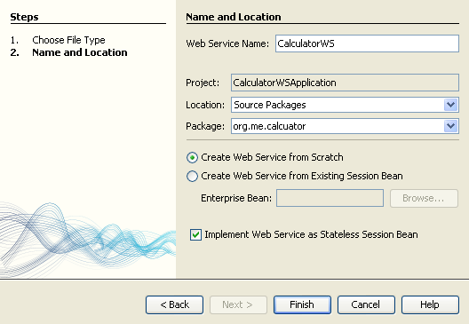
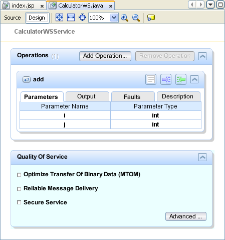
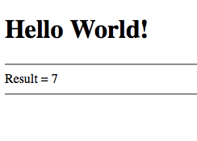

// 
//     Licensed to the Apache Software Foundation (ASF) under one
//     or more contributor license agreements.  See the NOTICE file
//     distributed with this work for additional information
//     regarding copyright ownership.  The ASF licenses this file
//     to you under the Apache License, Version 2.0 (the
//     "License"); you may not use this file except in compliance
//     with the License.  You may obtain a copy of the License at
// 
//       http://www.apache.org/licenses/LICENSE-2.0
// 
//     Unless required by applicable law or agreed to in writing,
//     software distributed under the License is distributed on an
//     "AS IS" BASIS, WITHOUT WARRANTIES OR CONDITIONS OF ANY
//     KIND, either express or implied.  See the License for the
//     specific language governing permissions and limitations
//     under the License.
//

= Getting Started with JAX-WS Web Services
:jbake-type: tutorial
:jbake-tags: tutorials 
:jbake-status: published
:icons: font
:syntax: true
:source-highlighter: pygments
:toc: left
:toc-title:
:description: Getting Started with JAX-WS Web Services - Apache NetBeans
:keywords: Apache NetBeans, Tutorials, Getting Started with JAX-WS Web Services

link:http://www.jcp.org/en/jsr/detail?id=224[+Java API for XML Web Services (JAX-WS), JSR 224+], is an important part of the Java EE platform. A follow-up to the release of Java API for XML-based RPC 1.1(JAX-RPC), JAX-WS simplifies the task of developing web services using Java technology. It addresses some of the issues in JAX-RPC 1.1 by providing support for multiple protocols such as SOAP 1.1, SOAP 1.2, XML, and by providing a facility for supporting additional protocols along with HTTP. JAX-WS uses JAXB 2.0 for data binding and supports customizations to control generated service endpoint interfaces. With its support for annotations, JAX-WS simplifies web service development and reduces the size of runtime JAR files.

This document demonstrates the basics of using the IDE to develop a JAX-WS web service. After you create the web service, you write three different web service clients that use the web service over a network, which is called "consuming" a web service. The three clients are a Java class in a Java SE application, a servlet, and a JSP page in a web application. A more advanced tutorial focusing on clients is xref:client.adoc[+Developing JAX-WS Web Service Clients+].

image::images/netbeans-stamp-80-74-73.png[title="Content on this page applies to the NetBeans IDE 7.2, 7.3, 7.4 and 8.0"]

* Consuming the Web Service in

*To follow this tutorial, you need the following software and resources.*

|===
|Software or Resource |Version Required 

|xref:../../../download/index.adoc[NetBeans IDE] |Java EE download bundle 

|link:http://www.oracle.com/technetwork/java/javase/downloads/index.html[+Java Development Kit (JDK)+] |JDK 7 or JDK 8
 

|Java EE-compliant web or application server |GlassFish Server Open Source Edition 
Oracle WebLogic Server 
|===

*Note: *The GlassFish server can be installed with the Java EE distribution of NetBeans IDE. Alternatively, you can visit the link:https://glassfish.java.net/download.html[+the GlassFish server downloads page+] or the link:http://tomcat.apache.org/download-60.cgi[+Apache Tomcat downloads page+].

*Important: *Java EE projects require GlassFish Server or Oracle WebLogic Server 12c.

[[extschema]]
== Enabling Access to External Schema

You need to enable the IDE and the GlassFish Server to access external schema to parse the WSDL file of the web service. To enable access you need to modify the configuration files of the IDE and the GlassFish Server. For more details, see the FAQ xref:../../../wiki/FaqWSDLExternalSchema.adoc[+How to enable parsing of WSDL with an external schema?+]

=== Configuring the IDE

To generate a web service client in the IDE from a web service or WSDL file you need to modify the IDE configuration file (`netbeans.conf`) to add the following switch to `netbeans_default_options`.

[source,java]
----

-J-Djavax.xml.accessExternalSchema=all
----

For more about locating and modifying the `netbeans.conf` configuration file, see xref:../../../wiki/FaqNetbeansConf.adoc[+Netbeans Conf FAQ+].

=== Configuring the GlassFish Server

If you are deploying to the GlassFish Server you need to modify the configuration file of the GlassFish Server (`domain.xml`) to enable the server to access external schemas to parse the wsdl file and generate the test client. To enable access to external schemas, open the GlassFish configuration file (`_GLASSFISH_INSTALL_/glassfish/domains/domain1/config/domain.xml`) and add the following JVM option element (in *bold*). You will need to restart the server for the change to take effect.

[source,xml]
----

</java-config>
  ...
  *<jvm-options>-Djavax.xml.accessExternalSchema=all</jvm-options>*
</java-config>
----

==   Creating a Web Service

The goal of this exercise is to create a project appropriate to the deployment container that you decide to use. Once you have a project, you will create a web service in it.

=== Choosing a Container

You can either deploy your web service in a web container or in an EJB container. This depends on your choice of implementation. If you are creating a Java EE application, use a web container in any case, because you can put EJBs directly in a web application. For example, if you plan to deploy to the Tomcat Web Server, which only has a web container, create a web application, not an EJB module.

1. Choose File > New Project (Ctrl-Shift-N on Linux and Windows, ⌘-Shift-N on MacOS). Select Web Application from the Java Web category or EJB Module from the Java EE category.

*Note.* You can create a JAX-WS web service in a Maven project. Choose File > New Project (Ctrl-Shift-N on Linux and Windows, ⌘-Shift-N on MacOS) and then Maven Web Application or Maven EJB module from the Maven category. If you haven't used Maven with NetBeans before, see xref:../../../wiki/MavenBestPractices.adoc[+Maven Best Practices+].

[start=2]
. Name the project  ``CalculatorWSApplication`` . Select a location for the project. Click Next.

[start=3]
. Select your server and Java EE version and click Finish.

*Note.* To use the Oracle WebLogic server, xref:../web/jsf-jpa-weblogic.adoc#01[+register the server with the IDE+]. Also, if you are using the WebLogic server, watch the screencast on xref:../javaee/weblogic-javaee-m1-screencast.adoc[+Deploying a Web Application to Oracle WebLogic+].

=== Creating a Web Service from a Java Class

1. Right-click the  ``CalculatorWSApplication``  node and choose New > Web Service.
2. Name the web service  ``CalculatorWS``  and type  ``org.me.calculator``  in Package. Leave Create Web Service from Scratch selected.
3. If you are creating a Java EE project on GlassFish or WebLogic, select Implement Web Service as a Stateless Session Bean. 

[start=4]
. Click Finish. The Projects window displays the structure of the new web service and the source code is shown in the editor area.

==   Adding an Operation to the Web Service

The goal of this exercise is to add to the web service an operation that adds two numbers received from a client. The NetBeans IDE provides a dialog for adding an operation to a web service. You can open this dialog either in the web service visual designer or in the web service context menu.

*Warning:* The visual designer is not available in Maven projects.

*To add an operation to the web service:*

1. Either:
* Change to the Design view in the editor. 

image::images/design-view.png[]

Or:

* Find the web service's node in the Projects window. Right-click that node. A context menu opens.

image::images/add-op-cx-menu-item.png[]

[start=2]
. Click Add Operation in either the visual designer or the context menu. The Add Operation dialog opens.

[start=3]
. In the upper part of the Add Operation dialog box, type  ``add``  in Name and type  ``int``  in the Return Type drop-down list.

[start=4]
. In the lower part of the Add Operation dialog box, click Add and create a parameter of type  ``int``  named  ``i`` .

[start=5]
. Click Add again and create a parameter of type  ``int``  called  ``j`` .

You now see the following:

image::images/jaxws-60-add-operation.png[]

[start=6]
. Click OK at the bottom of the Add Operation dialog box. You return to the editor.

[start=7]
. Remove the default  ``hello``  operation, either by deleting the  ``hello()``  method in the source code or by selecting the  ``hello``  operation in the visual designer and clicking Remove Operation.

The visual designer now displays the following:

[start=8]
. Click Source and view the code that you generated in the previous steps. It differs whether you created the service as an Java EE stateless bean or not. Can you see the difference in the screenshots below? (A Java EE 6 or Java EE 7 service that is not implemented as a stateless bean resembles a Java EE 5 service.)

image::images/jaxws-60-source.png[] image::images/stateless-ejb-code1.png[]

*Note.* In NetBeans IDE 7.3 and 7.4 you will notice that in the generated  ``@WebService``  annotation the service name is specified explicitly:
 ``@WebService(serviceName = "CalculatorWS")`` .

[start=9]
. In the editor, extend the skeleton  ``add``  operation to the following (changes are in bold):

[source,java]
----

    @WebMethod
    public int add(@WebParam(name = "i") int i, @WebParam(name = "j") int j) {
        *int k = i + j;*
        return *k*;
      }
----

As you can see from the preceding code, the web service simply receives two numbers and then returns their sum. In the next section, you use the IDE to test the web service.

== Deploying and Testing the Web Service

After you deploy a web service to a server, you can use the IDE to open the server's test client, if the server has a test client. The GlassFish and WebLogic servers provide test clients.

If you are using the Tomcat Web Server, there is no test client. You can only run the project and see if the Tomcat Web Services page opens. In this case, before you run the project, you need to make the web service the entry point to your application. To make the web service the entry point to your application, right-click the CalculatorWSApplication project node and choose Properties. Open the Run properties and type  ``/CalculatorWS``  in the Relative URL field. Click OK. To run the project, right-click the project node again and select Run.

*To test successful deployment to a GlassFish or WebLogic server:*

1. Right-click the project and choose Deploy. The IDE starts the application server, builds the application, and deploys the application to the server. You can follow the progress of these operations in the CalculatorWSApplication (run-deploy) and the GlassFish server or Tomcat tabs in the Output view.
2. In the IDE's Projects tab, expand the Web Services node of the CalculatorWSApplication project. Right-click the CalculatorWS node, and choose Test Web Service. 

image::images/jax-ws-testws.png[]

The IDE opens the tester page in your browser, if you deployed a web application to the GlassFish server. For the Tomcat Web Server and deployment of EJB modules, the situation is different:

* If you deployed to the GlassFish server, type two numbers in the tester page, as shown below: 

image::images/jax-ws-tester.png[]

The sum of the two numbers is displayed:

image::images/jax-ws-tester2.png[]

== [[Samples]] 

You can open a complete Java EE stateless bean version of the Calculator service by choosing File > New Project (Ctrl-Shift-N on Linux and Windows, ⌘-Shift-N on MacOS) and navigating to Samples > Web Services > Calculator (EE6).

A Maven Calculator Service and a Maven Calculator Client are available in Samples > Maven.

==  Consuming the Web Service

Now that you have deployed the web service, you need to create a client to make use of the web service's  ``add``  method. Here, you create three clients— a Java class in a Java SE application, a servlet, and a JSP page in a web application.

*Note:* A more advanced tutorial focusing on clients is xref:client.adoc[+Developing JAX-WS Web Service Clients+].

=== Client 1: Java Class in Java SE Application

In this section, you create a standard Java application. The wizard that you use to create the application also creates a Java class. You then use the IDE's tools to create a client and consume the web service that you created at the start of this tutorial.

1. Choose File > New Project (Ctrl-Shift-N on Linux and Windows, ⌘-Shift-N on MacOS). Select Java Application from the Java category. Name the project  ``CalculatorWS_Client_Application`` . Leave Create Main Class selected and accept all other default settings. Click Finish.
2. Right-click the  ``CalculatorWS_Client_Application``  node and choose New > Web Service Client. The New Web Service Client wizard opens.
3. Select Project as the WSDL source. Click Browse. Browse to the CalculatorWS web service in the CalculatorWSApplication project. When you have selected the web service, click OK.

image::images/browse-ws.png[]

[start=4]
. Do not select a package name. Leave this field empty.

image::images/javaclient-pkg.png[]

[start=5]
. Leave the other settings at default and click Finish.

The Projects window displays the new web service client, with a node for the  ``add``  method that you created:

image::images/ws-ref-in-client-project.png[]

[start=6]
. Double-click your main class so that it opens in the Source Editor. Drag the  ``add``  node below the  ``main()``  method.

image::images/dnd-add.png[]

You now see the following:

[source,java]
----

public static void main(String[] args) {
    // TODO code application logic here
}
private static int add(int i, int j) {
    org.me.calculator.CalculatorWS_Service service = new org.me.calculator.CalculatorWS_Service();
    org.me.calculator.CalculatorWS port = service.getCalculatorWSPort();
    return port.add(i, j);
}
----

*Note:* Alternatively, instead of dragging the  ``add``  node, you can right-click in the editor and then choose Insert Code > Call Web Service Operation.

[start=7]
. In the  ``main()``  method body, replace the TODO comment with code that initializes values for  ``i``  and  ``j`` , calls  ``add()`` , and prints the result.

[source,java]
----

public static void main(String[] args) {int i = 3;int j = 4;int result = add(i, j);System.out.println("Result = " + result);
}
----

[start=8]
. Surround the  ``main()``  method code with a try/catch block that prints an exception.

[source,java]
----

public static void main(String[] args) {try {int i = 3;int j = 4;int result = add(i, j);System.out.println("Result = " + result);} catch (Exception ex) {System.out.println("Exception: " + ex);}
}
----

[start=9]
. Right-click the project node and choose Run.

The Output window now shows the sum:

[source,java]
----

    compile:
    run:
    Result = 7
      BUILD SUCCESSFUL (total time: 1 second)
----

=== Client 2: Servlet in Web Application

In this section, you create a new web application, after which you create a servlet. You then use the servlet to consume the web service that you created at the start of this tutorial.

1. Choose File > New Project (Ctrl-Shift-N on Linux and Windows, ⌘-Shift-N on MacOS). Select Web Application from the Java Web category. Name the project  ``CalculatorWSServletClient`` . Click Next and then click Finish.
2. Right-click the  ``CalculatorWSServletClient``  node and choose New > Web Service Client.

The New Web Service Client wizard opens.

[start=3]
. Select Project as the WSDL source and click Browse to open the Browse Web Services dialog box.

[start=4]
. Select the CalculatorWS web service in the CalculatorWSApplication project. Click OK to close the Browse Web Services dialog box.

image::images/browse-ws.png[]

[start=5]
. Confirm that the package name is empty in the New Web Service Client wizard and leave the other settings at the default value. Click Finish.

The Web Service References node in the Projects window displays the structure of your newly created client, including the  ``add``  operation that you created earlier in this tutorial.

[start=6]
. Right-click the  ``CalculatorWSServletClient``  project node and choose New > Servlet. Name the servlet  ``ClientServlet``  and place it in a package called  ``org.me.calculator.client`` . Click Finish.

[start=7]
. To make the servlet the entry point to your application, right-click the CalculatorWSServletClient project node and choose Properties. Open the Run properties and type  ``/ClientServlet``  in the Relative URL field. Click OK.

[start=8]
. If there are error icons for  ``ClientServlet.java`` , right-click the project node and select Clean and Build.

[start=9]
. In the  ``processRequest()``  method, add some empty lines after this line:

[source,xml]
----

    out.println("<h1>Servlet ClientServlet at " + request.getContextPath () + "</h1>");
----

[start=10]
. In the Source Editor, drag the  ``add``  operation anywhere in the body of the  ``ClientServlet``  class. The  ``add()``  method appears at the end of the class code.

*Note:* Alternatively, instead of dragging the  ``add``  node, you can right-click in the editor and then choose Insert Code > Call Web Service Operation.

[source,java]
----

private int add(int i, int j) {org.me.calculator.CalculatorWS port = service.getCalculatorWSPort();return port.add(i, j);
}
----

[start=11]
. Add code that initializes values for  ``i``  and  ``j`` , calls  ``add()`` , and prints the result. The added code is in *boldface*:

[source,xml]
----

protected void processRequest(HttpServletRequest request, HttpServletResponse response)
         throws ServletException, IOException {
    response.setContentType("text/html;charset=UTF-8");
    PrintWriter out = response.getWriter();
    try {
        out.println("<html>");
        out.println("<head>");
        out.println("<title>Servlet ClientServlet</title>");
        out.println("</head>");
        out.println("<body>");
        out.println("<h1>Servlet ClientServlet at " + request.getContextPath () + "</h1>");

    *    int i = 3;
int j = 4;
int result = add(i, j);
out.println("Result = " + result);*

        out.println("</body>");
        out.println("</html>");
        
    } finally {            out.close();}}
----

[start=12]
. Surround the added code with a try/catch block that prints an exception.

[source,xml]
----

protected void processRequest(HttpServletRequest request, HttpServletResponse response)
         throws ServletException, IOException {
    response.setContentType("text/html;charset=UTF-8");
    PrintWriter out = response.getWriter();
    try {
        out.println("<html>");
        out.println("<head>");
        out.println("<title>Servlet ClientServlet</title>");
        out.println("</head>");
        out.println("<body>");
        out.println("<h1>Servlet ClientServlet at " + request.getContextPath () + "</h1>");
        *try {*
            int i = 3;int j = 4;int result = add(i, j);out.println("Result = " + result);
        *} catch (Exception ex) {
            out.println("Exception: " + ex);
        }*
        out.println("</body>");
        out.println("</html>");
        
    } finally {            out.close();}}
----

[start=13]
. Right-click the project node and choose Run.

The server starts, the application is built and deployed, and the browser opens, displaying the calculation result, as shown below: 

image::images/jaxws-60-webclient.png[]

=== Client 3: JSP Page in Web Application

In this section, you create a new web application and then consume the web service in the default JSP page that the Web Application wizard creates.

*Note:* If you want to run a JSP web application client on Oracle WebLogic, see xref:../web/jsf-jpa-weblogic.adoc[+Running a Java Server Faces 2.0 Application on WebLogic+].

1. Choose File > New Project (Ctrl-Shift-N on Linux and Windows, ⌘-Shift-N on MacOS). Select Web Application from the Java Web category. Name the project  ``CalculatorWSJSPClient`` . Click Next and then click Finish.
2. Expand the Web Pages node under the project node and delete  ``index.html`` .
3. Right-click the  ``Web Pages``  node and choose New > JSP in the popup menu.

If JSP is not available in the popup menu, choose New > Other and select JSP in the Web category of the New File wizard.

[start=4]
. Type *index* for the name of the JSP file in the New File wizard. Click Finish.

[start=5]
. Right-click the  ``CalculatorWSJSPClient``  node and choose New > Web Service Client.

[start=6]
. Select Project as the WSDL source. Click Browse. Browse to the CalculatorWS web service in the CalculatorWSApplication project. When you have selected the web service, click OK.

image::images/browse-ws.png[]

[start=7]
. Do not select a package name. Leave this field empty.

[start=8]
. Leave the other settings at default and click Finish.

The Projects window displays the new web service client, as shown below:

image::images/ws-ref-in-jsp-client.png[]

[start=9]
. In the Web Service References node, expand the node that represents the web service. The  ``add``  operation, which you will invoke from the client, is now exposed.

[start=10]
. Drag the  ``add``  operation to the client's  ``index.jsp``  page, and drop it below the H1 tags. The code for invoking the service's operation is now generated in the  ``index.jsp``  page, as you can see here:

[source,java]
----

<%
try {
    org.me.calculator.CalculatorWSService service = new org.me.calculator.CalculatorWSService();
    org.me.calculator.CalculatorWS port = service.getCalculatorWSPort();
     // TODO initialize WS operation arguments here
    int i = 0;
    int j = 0;
    // TODO process result here
    int result = port.add(i, j);
    out.println("Result = "+result);
} catch (Exception ex) {
    // TODO handle custom exceptions here
}
%>
----

Change the value for  ``i``  and  ``j``  from 0 to other integers, such as 3 and 4. Replace the commented out TODO line in the catch block with  ``out.println("exception" + ex);`` .

[start=11]
. Right-click the project node and choose Run.

The server starts, if it wasn't running already. The application is built and deployed, and the browser opens, displaying the calculation result:

xref:../../../community/mailing-lists.adoc[Send Feedback on This Tutorial]

== See Also

For more information about using NetBeans IDE to develop Java EE applications, see the following resources:

* xref:client.adoc[+Developing JAX-WS Web Service Clients+]
* xref:rest.adoc[+Getting Started with RESTful Web Services+]
* xref:wsit.adoc[+Advanced Web Service Interoperability+]
* xref:../web.adoc[+Web Services Learning Trail+]

To send comments and suggestions, get support, and keep informed about the latest developments on the NetBeans IDE Java EE development features, xref:../../../community/mailing-lists.adoc[+join the nbj2ee@netbeans.org mailing list+].

