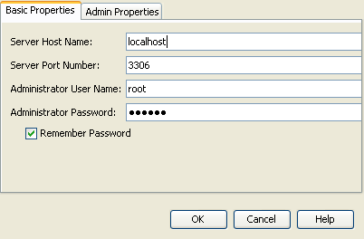
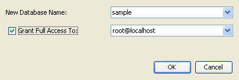
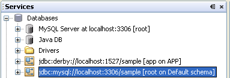

// 
//     Licensed to the Apache Software Foundation (ASF) under one
//     or more contributor license agreements.  See the NOTICE file
//     distributed with this work for additional information
//     regarding copyright ownership.  The ASF licenses this file
//     to you under the Apache License, Version 2.0 (the
//     "License"); you may not use this file except in compliance
//     with the License.  You may obtain a copy of the License at
// 
//       http://www.apache.org/licenses/LICENSE-2.0
// 
//     Unless required by applicable law or agreed to in writing,
//     software distributed under the License is distributed on an
//     "AS IS" BASIS, WITHOUT WARRANTIES OR CONDITIONS OF ANY
//     KIND, either express or implied.  See the License for the
//     specific language governing permissions and limitations
//     under the License.
//

= Getting Started with RESTful Web Services
:jbake-type: tutorial
:jbake-tags: tutorials 
:jbake-status: published
:icons: font
:syntax: true
:source-highlighter: pygments
:toc: left
:toc-title:
:description: Getting Started with RESTful Web Services - Apache NetBeans
:keywords: Apache NetBeans, Tutorials, Getting Started with RESTful Web Services
include::../../../inc/database.adoc[]

REpresentational State Transfer (REST) is an architectural style for distributed hypermedia systems, such as the World Wide Web. Central to the RESTful architecture is the concept of resources identified by universal resource identifiers (URIs). These resources can be manipulated using a standard interface, such as HTTP, and information is exchanged using representations of these resources. In this tutorial, you first learn a bit about REST and then you are shown how NetBeans IDE supports this architectural style.

image::images/netbeans-stamp-80-74-73.png[title="Content on this page applies to the NetBeans IDE 7.2, 7.3, 7.4 and 8.0"]

*To follow this tutorial, you need the following software and resources.*

|===
|Software or Resource |Version Required 

|xref:../../../download/index.adoc[NetBeans IDE] |Java EE download bundle 

|link:http://www.oracle.com/technetwork/java/javase/downloads/index.html[+Java Development Kit (JDK)+] |version 7 or 8 

|Java EE-compliant application server |

link:http://www.oracle.com/technetwork/middleware/weblogic/overview/index.html[+Oracle WebLogic Server 11g-12c+], 
or GlassFish Server Open Source Edition 3.x or 4.x
(Does not work on Tomcat unless EJB support plugin is installed to Tomcat)

 

|The jdbc/sample database on 
Java DB (Derby) database server or MySQL 
database server

 |

On Java DB (Derby), The jdbc/sample database is generated by NetBeans IDE 
when you install the IDE with the GlassFish application server.

On MySQL, the IDE populates the sample database after you create it on the MySQL server from within the IDE.

 
|===

The GlassFish server can be installed with the Web and Java EE distribution of NetBeans IDE. Alternatively, you can visit the link:https://glassfish.java.net/download.html[+the GlassFish server downloads page+].

*Important: *Java EE 6 and Java EE 7 projects require GlassFish Server or Oracle WebLogic Server 12c.

==  Introduction

RESTful web services are services built using the RESTful architectural style. Building web services using the RESTful approach is emerging as a popular alternative to using SOAP-based technologies for deploying services on the internet, due to its lightweight nature and the ability to transmit data directly over HTTP.

The IDE supports rapid development of RESTful web services using JSR 311 - Java API for RESTful Web Services (JAX-RS) and Jersey, the reference implementation for JAX-RS.

For detailed information, refer to the following:

* link:http://jcp.org/en/jsr/detail?id=311[+JSR 311: JAX-RS: The Java API for RESTful Web Services+]
* link:http://jersey.dev.java.net/[+Jersey, the open source JAX-RS (JSR 311) Reference Implementation for building RESTful Web services+]

In addition to building RESTful web services, the IDE also supports testing, building client applications that access RESTful web services, and generating code for invoking web services (both RESTful and SOAP-based.)

Here is the list of RESTful features provided by the IDE:

1. Rapid creation of RESTful web services from JPA entity classes and patterns.
2. Rapid code generation for invoking web services such as Google Map, Yahoo News Search, and StrikeIron web services by drag-and-dropping components from the Web Services manager in the Services window.
3. Generation of RESTful Java Clients for services registered in the Web Services manager.
4. Test client generation for testing RESTful web services.
5. Logical view for easy navigation of RESTful web service implementation classes in your project.

In this tutorial, you will be shown how the IDE supports you in generating, implementing, and testing RESTful web services.

==  RESTful Web Services, Persistence, and Entity Classes

RESTful web services in Java rely on the link:{wikipedia}Java_Persistence_API[Java Persistence API] to communicate with a database. Specifically, RESTful web services rely on _entity classes_ and a _persistence unit_, as defined in the Persistence API. Entity classes are Java classes that map to objects in a relational database. According to link:http://download.oracle.com/javaee/5/tutorial/doc/bnbqa.html[+The Java EE5 Tutorial+], "An entity is a lightweight persistence domain object. Typically an entity represents a table in a relational database, and each entity instance corresponds to a row in that table." A persistence unit consists of the set of entity classes, the data source, the persistence provider, and the persistence unit's own name, as defined in a  ``persistence.xml``  file.

You can use NetBeans IDE either to create entity classes and RESTful web services in the same process, or you can use the IDE to create RESTful web services from existing entity classes. In this tutorial, you use the RESTful Services from Database wizard to generate entity classes and RESTful web services in the same process. The wizard automatically generates the persistence unit.

== Using a MySQL Database Server

If you use the MySQL database server instead of JavaDB (Derby), you need to register the database server with the IDE and add the  ``sample``  database to the server.

*To use a MySQL database server with this tutorial:*

1. Register your MySQL server in the IDE, if the server is not registered. To register a MySQL server, go to the IDE's Services window, right-click the Databases node, and select Register MySQL server. 

image::images/register-mysql-server.png[]

[start=2]
. 
A dialog opens in which you type the configuration details of your MySQL server, including administrator user name and password. See "Configuring MySQL Server Properties" in xref:../ide/install-and-configure-mysql-server.adoc[+Connecting to a MySQL Database+].

[start=3]
. Start the MySQL server and connect to it. See "Starting the MySQL Server" in xref:../ide/install-and-configure-mysql-server.adoc[+Connecting to a MySQL Database+].

[start=4]
. Right-click the MySQL server node and select Create Database. The Create MySQL Database dialog opens. 

image::images/create-database.png[]

[start=5]
. Type  ``sample``  as the new database name. Grant full access to your root user, or a user of your choice.

[start=6]
. Click OK. A dialog opens informing you that  ``sample``  is the name of a sample database, and asking you if you want to create the tables, objects, and data for this database.

image::images/create-sample-contents.png[]

[start=7]
. Click Yes. The IDE creates and populates the database, and adds a connection to the database.

== Creating RESTful Web Services from a Database

The goal of this exercise is to create a project and generate entity classes and RESTful web services from a database.

This section uses the JavaDB (Derby) database and the jdbc/sample data source. JavaDB is included with the SDK. The jdbc/sample data source is generated by NetBeans IDE automatically when you install the IDE together with GlassFish.

=== Creating the Project

To create RESTful web services, you need a Java Web application project.

*To create the project: *

1. Choose File > New Project (Ctrl-Shift-N on Linux and Windows, ⌘-Shift-N on MacOS). Under Categories, select Java Web. Under Projects, select Web Application. Click Next. The New Web Application wizard opens.

Alternatively, you can create a Maven Web Application. Choose File > New Project (Ctrl-Shift-N on Linux and Windows, ⌘-Shift-N on MacOS). Under Categories, select Maven. Under Projects, select Maven Web Application and click Next.

[start=2]
. Under Project Name, enter  ``CustomerDB`` . Click Next.

[start=3]
. Select either Java EE 6 Web or Java EE 7 Web. Under Server, select the server you want to use, but note that Java EE projects require GlassFish server 3.x or 4.x. Click through the remaining options and click Finish.

*Important for Maven Projects:* In NetBeans IDE 7.2 you cannot set the server when you create a Maven web application. However, you need to set the server before you can create a persistence unit. Therefore, after you create the Maven web application, open the project's Properties and set the server in the Run properties. To open the project's Properties, right-click on the Project node and select Properties from the context menu.

=== Generating Entity Classes and RESTful Services

When you have a Java web application, add entity classes and RESTful web services to the project.

*To generate entity classes and RESTful web services: *

1. Right-click the  ``CustomerDB``  node and choose New > Other > Web Services > RESTful Web Services from Database. The New RESTful Web Service wizard opens, on the Database Tables panel.

image::images/open-wizard.png[]

[start=2]
. In the Database Tables panel, if you are using the GlassFish server, select the  ``jdbc/sample``  data source from the Data Source drop-down field.

If you are using Tomcat, select jdbc:derby://localhost:1527/sample. If the Derby database server does not start automatically, you need to start it from the Databases tab in the Services window.

*Note for MySQL users:* You have to create a new data source. Select New Data Source, give it an arbitrary descriptive name, and select the  ``jdbc:mysql://localhost:3306/sample``  database connection. You created this connection when you created the sample database on MySQL. 

image::images/new-mysql-datasource.png[]

[start=3]
. Under Available Tables, select CUSTOMER and then click Add. The DISCOUNT_CODE table, which has a relationship with the CUSTOMER table, is also automatically added to the Selected Tables list. If you are using a MySQL database or some versions of Derby, the MICRO_MARKET table is also added. You now see the following (Derby version): 

image::images/select-tables.png[title="Database Tables panel of New Entity Classes from Database wizard, showing CUSTOMER and DISCOUNT_CODE tables selected"]

[start=4]
. Click Next. The Entity Classes page opens. Type  ``entities``  for the Package name. You now see the following (Derby version).

*Note:* The RESTful Web Services from Database wizard automatically generates JAXB annotations. If you generate entity classes for a Java EE application with the Entity Classes from Database wizard, and you might later want to create RESTful web services from those entity classes, make sure the Generate JAXB Annotations box is checked. You can also add JAXB annotations by hand to entity classes before running the RESTful Web Services from Entity Classes wizard. For more information, see link:http://netbeans.dzone.com/nb-generate-simpler-rest[+NetBeans to Generate Simpler RESTful Web Services+].

image::../../../images_www/articles/71/websvc/rest/entity-classes.png[]

[start=5]
. Click Next. A panel opens in which you can set the name and location of generated service classes and packages. For Java EE projects, you have the option of changing the name and location of the REST application configuration class.

For this tutorial, accept the defaults and click Finish. When you click Finish the IDE generates entity and service classes. In an Java EE project, the IDE also generates an application configuration class, which is a subclass of Application.

image::images/class-name-location.png[]

The IDE now generates the RESTful web services. When the IDE is finished, look in the Projects window. The generated entity classes are in the  ``entities``  package and services are in the  ``service``  package. Java EE RESTful web services from a database instantiate  ``EntityManager``  in each service class. This removes the need for JPA controller classes and generates simpler code.

== Testing the RESTful Web Services

The goal of this exercise is to try out your application. You will create a new web application for the tests and then use a wizard in the IDE to generate the tests in the new project.

1. Choose File > New Project from the main menu.
2. Select the Web Application project type in the Java Web category. Click Next.
3. Type *WebServicesTest* for the project name. Click Next.
4. Select GlassFish Server as the target server and Java EE 6 Web or Java EE 7 Web as the Java EE version. Click Finish.
5. Right-click the  ``CustomerDB``  project node and choose Test RESTful Web Services. A dialog opens asking if you want to generate the test client inside the service project or in another Java web project. This option lets you work around security restrictions in some browsers. You can use any Web project, as long as it is configured to deploy in the same server domain as the CustomerDB project. 

image::../../../images_www/articles/71/websvc/rest/configure-test-client.png[]

[start=6]
. Select *Web Test Client in Project* and click Browse.

[start=7]
. Select the WebServiceTest project in the Select Project dialog box. Click OK.

The IDE generates the file  ``test-resbeans.html``  in the WebServiceTest project. The IDE also automatically starts the server and deploys the CustomerDB application.

If the output window shows an error message that one or more classes fails to exist and the project does not build, add the Jersey libraries to the compile-time libraries. Right-click the project node and select Properties. In the Properties tree menu, select Libraries. Click Add Library and browse for the Jersey libraries.

[start=8]
. Right-click the WebServiceTest and choose Run.

[start=9]
. Open your browser to link:http://localhost:8080/WebServicesTest/test-resbeans.html[+http://localhost:8080/WebServicesTest/test-resbeans.html+] 

image::../../../images_www/articles/71/websvc/rest/test-rest1.png[title="RESTful web service tester landing page in browser"]

On the left-hand side is the set of root resources. Here they are named  ``entities.customer`` ,  ``entities.discountCodes``  and  ``entities.microMarket`` .

[start=10]
. Click the  ``entities.customer``  node. In the "Choose method to test" field, select either GET (application/json) or GET (application/xml). Click Test. The test client sends a request and displays the result in the Test Output section. The test client dispays the Raw View by default. The following image shows the response to an application/xml request.

image::images/test-rest-raw.png[]

There are 5 tabs in the Test Output section.

* The Tabular View is a flattened view that displays all the URIs in the resulting document. Currently this view only displays a warning that Container-Containee relationships are not allowed.
* The Raw View displays the actual data returned. Depending on which mime type you selected ( ``application/xml``  or  ``application/json`` ), the data displayed will be in either XML or JSON format, respectively.
* The Sub Resource tab shows the URLs of the root resource and sub resources. When the RESTful web service is based on database entity classes, the root resource represents the database table, and the sub resources represent the columns.
* The Headers tab displays the HTTP header information.
* The HTTP Monitor tab displays the actual HTTP requests and responses sent and received.

Exit the browser and return to the IDE.

xref:../../../community/mailing-lists.adoc[Send Feedback on This Tutorial]

== See Also

For more information about using NetBeans IDE to develop Java EE applications, see the following resources:

* link:http://netbeans.dzone.com/nb-generate-simpler-rest[+NetBeans to Generate Simpler RESTful Web Services+]
* xref:../web.adoc[+Web Services Learning Trail+]
* YouTube: link:http://www.youtube.com/watch?v=cDdfVMro99s[+RESTful Web Services, Building and Deploying (Part 1)+]
* YouTube: link:http://www.youtube.com/watch?v=_c-CCVy4_Eo[+NetBeans RESTful Testing and Invoking RESTful Resources (Part 2)+]

To send comments and suggestions, get support, and keep informed about the latest developments on the NetBeans IDE Java EE development features, xref:../../../community/mailing-lists.adoc[+join the nbj2ee@netbeans.org mailing list+].

