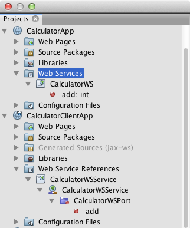
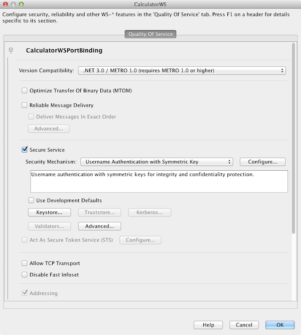
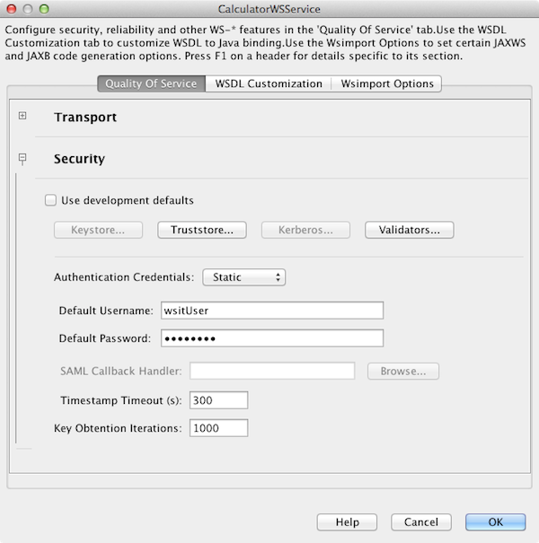

// 
//     Licensed to the Apache Software Foundation (ASF) under one
//     or more contributor license agreements.  See the NOTICE file
//     distributed with this work for additional information
//     regarding copyright ownership.  The ASF licenses this file
//     to you under the Apache License, Version 2.0 (the
//     "License"); you may not use this file except in compliance
//     with the License.  You may obtain a copy of the License at
// 
//       http://www.apache.org/licenses/LICENSE-2.0
// 
//     Unless required by applicable law or agreed to in writing,
//     software distributed under the License is distributed on an
//     "AS IS" BASIS, WITHOUT WARRANTIES OR CONDITIONS OF ANY
//     KIND, either express or implied.  See the License for the
//     specific language governing permissions and limitations
//     under the License.
//

= Advanced Web Service Interoperability
:jbake-type: tutorial
:jbake-tags: tutorials 
:jbake-status: published
:icons: font
:syntax: true
:source-highlighter: pygments
:toc: left
:toc-title:
:description: Advanced Web Service Interoperability - Apache NetBeans
:keywords: Apache NetBeans, Tutorials, Advanced Web Service Interoperability

Advanced Web Service Interoperability (WSIT), also referred to as Web Service "Quality of Service", encompasses components that enable interoperability between Java web services and .Net web services. This document demonstrates some of the support in the IDE for configuring a web service and client that use WSIT. For more information on using WSIT, see link:http://docs.oracle.com/cd/E19159-01/820-1072/ahibn/index.html[+Chapter 3 WSIT Example Using a Web Container and NetBeans IDE+] in link:http://docs.oracle.com/cd/E19159-01/820-1072/index.html[+The WSIT Tutorial+]

image::images/netbeans-stamp-74-73-72.png[title="Content on this page applies to the NetBeans IDE 7.2, 7.3 and 7.4"]

*To follow this tutorial, you need the following software and resources.*

|===
|Software or Resource |Version Required 

|xref:../../../download/index.adoc[NetBeans IDE] |Java EE download bundle 

|link:http://www.oracle.com/technetwork/java/javase/downloads/index.html[+Java Development Kit (JDK)+] |version 6 or version 7 

|Java EE-compliant web or application server |GlassFish Server Open Source Edition 3.1.x, 4.x
or 
link:http://www.oracle.com/technetwork/middleware/weblogic/overview/index.html[+Oracle WebLogic Server+] 11g or 12c 
|===

The GlassFish server can be installed, optionally, with the Java EE distribution of NetBeans IDE. Alternatively, you can visit the link:https://glassfish.java.net/download.html[+the GlassFish server downloads page+] or the link:http://tomcat.apache.org/download-60.cgi[+Apache Tomcat downloads page+].

*Important: *Java EE projects require GlassFish Server 3.1.x, 4.x, or Oracle WebLogic Server 12c.

== Introduction

Components relating to advanced web services interoperability fall into four main categories:

* *Bootstrapping and configuration.* The process that is executed to create a Web service client that can access and consume a Web service.
* *Message security.* The following security configuration options are supported:
* Targets to sign and encrypt options
* Client/service Web services security
* Client/service trust options
* Advanced configuration options
* Keystore configuration options
* *Message optimization.* Ensures that Web services messages are transmitted over the Internet in the most efficient manner. Message optimization is achieved in Web services communication by encoding messages prior to transmission and then de-encoding them when they reach there final destination.
* *Reliable messaging.* Measured by a system's ability to deliver messages from point A to point B without error.

"Quality of service" is configured in the Web Service Attributes Editor, which can be accessed from the node representing the web service or client in the Projects window. In this document you are introduced to two samples that are distributed with the IDE: an unsecured web service sample and a secured web service sample. This document will show some of the differences between the samples and also how to use the IDE to configure security for your own web services and clients.

For a full and complete guide to topics relating to 'Quality of Service', see link:http://download.oracle.com/docs/cd/E17802_01/webservices/webservices/reference/tutorials/wsit/doc/index.html[+The WSIT Tutorial+].  

== Getting to Know the Calculator Sample

The goal of this exercise is to get to know the Calculator sample that is bundled with the IDE. In contrast to the next sample, this sample is not secured, as you will see when you examine the web service.

=== Exploring the Sample

In this exercise you will use the New Project wizard to create the sample, examine the sample in the IDE and deploy the application.

1. Choose File > New Project (Ctrl-Shift-N on Linux and Windows, ⌘-Shift-N on MacOS) to open the New Project wizard.
2. Expand the Samples category and select the Web Services node and then select the Calculator sample. Click Next.

image::images/wsit-newproject.png[title="New Project wizard showing calculator sample"]

[start=3]
. Confirm that a Java EE-compliant server is selected in the Server drop-down list. Click Finish.

When you click Finish the wizard creates two projects:

* *CalculatorApp* provides a web service named CalculatorWS that exposes an operation named 'add'.
* *CalculatorClientApp* provides a client named CalculatorWSService that invokes the web service's 'add' operation.

The CalculatorClientApp service might be badged with an error icon because the IDE cannot find the WSDL for the CalculatorWS service. The error will be resolved after you deploy CalculatorApp and clean and build the CalculatorClientApp.

[start=4]
. Double-click the CalculatorWS web service to open the file in the editor and click the Design tab at the top of the editor to view the web service in the visual designer.

image::images/wsit-design.png[title="CalculatorWS service in Design GUI (Visual Designer) tab"]

*Note:* In the Quality of Service section in the design tab of the service you can see that _no_ options are enabled. As a result, the Quality of Service components have not been applied to this particular web service. You will look at a web service where a Quality of Service component _is_ enabled when you create the secure web service.

For a full tutorial on web services in the IDE, see xref:jax-ws.adoc[+Getting Started with JAX-WS Web Services+].

=== Deploying and Testing the Calculator Sample

1. Right-click the CalculatorApp project and choose Run.

The server starts and the web service is deployed to the server. You will see a page open in your default browser that provides some details of the service.

image::images/wsit-browser1.png[title="CalculatorWS information window in browser"]

[start=2]
. Click on the WSDL link in the page in the browser to see the WSDL file that defines the web service. 

image::images/wsit-browser2.png[title="Calculator WS WSDL in browser"]

*Note.* If the WSDL does not display, check the URL in the browser's location bar. It should point to  ``http://localhost:_your_port_number_/CalculatorApp/CalculatorWSService?WSDL`` .

[start=3]
. In the Projects window of the IDE, right-click CalculatorWS under the Web Services node and choose Test Web Service in the popup menu.

When you test the web service a page for testing the service opens in your browser.

image::images/wsit-browser3.png[title="Calculator WS Tester in browser"]

The IDE can provide a client for testing your web service and open the test application in your browser. In the test application you can enter values for each of the fields defined in the web service. The test application has a button that is labeled after the name of the operation in the service. When you click the button you will see the result of invoking the operation.

[start=4]
. Examine the CalculatorClientApp project in the Projects window for any error badges.

If there are error icons for  ``ClientServlet.java`` , right-click the project node and choose Clean and Build in the popup menu. The errors appeared because the CalculatorWS service was not deployed. Now that it is deployed, the IDE can parse the WSDL and the ClientServlet compiles.

[start=5]
. Right-click the CalculatorClientApp project node and choose Run.

When you run the application an interface for the service opens in your browser.

image::images/wsit-browser4.png[title="Calculator Service client in browser"]

[start=6]
. Enter values in the two fields and click Get Result.

When you click Get Result the result of the operation is retrieved from the web service and displayed in the client.

The web service is functioning correctly and the client retrieves results, but this project does not make use of the Quality of Service components. In the next section, you will see how you can configure Quality of Service components.

==   Getting to Know the Secured Calculator Sample

The goal of this exercise is to examine how a secured web service is set up and how a client interacts with it.

=== Exploring the Sample

In this exercise you use the New Project wizard to create the sample and then examine how Quality of Service is configured for the application.

1. Choose File > New Project (Ctrl-Shift-N on Linux and Windows, ⌘-Shift-N on MacOS) to open the New Project wizard.
2. Expand the Samples category and select the Web Services node and then select the Secure Calculator sample. Click Next.
3. Confirm that a Java EE-compliant server is selected in the Server drop-down list. Click Finish.

When you click Finish the wizard creates two projects:

* *SecureCalculatorApp* provides a web service named CalculatorWS that exposes an operation named 'add'.
* *SecureCalculatorClientApp* provides a client named CalculatorWSService that invokes the web service's 'add' operation.

The SecureCalculatorClientApp service might be badged with an error icon because the IDE cannot find the WSDL for the CalculatorWS service. The error will be resolved after you deploy SecureCalculatorApp and clean and build the SecureCalculatorClientApp.

[start=4]
. Double-click the CalculatorWS web service in the Web Services folder of SecureCalculatorApp to open the file in the editor and click the Design tab at the top of the editor to view the web service in the visual designer.

*Note:* In the Quality of Service section in the design view of the service you can see that the Secure Service option is selected and that the other two options are not selected. The Quality of Service section in the design view specifies which of the Quality of Service components is _enabled_ for the current web service.

[start=5]
. Click Edit Web Service Attributes to open the Web Service Attributes Editor.

In the Quality of Service tab you can see that a Version Compatibility option is selected. You should select the latest version that matches the version of Metro or .NET that is installed.

To enable the version compatibility drop down list, add the latest version of Metro to your project's classpath. To add the latest Metro library, right-click the project's node in the Projects window, open the project's Properties, go to the Libraries category, and browse for and add the latest Metro library.

Notice that the Secure Service option is selected and that a security mechanism is selected in the drop-down list. The security mechanism specifies the approach used for securing the web service.

In this sample application the Username Authentication with Symmetric Keys security mechanism is selected. For a description of options and properties for the Username Authentication with Symmetric Keys security mechanism, see link:http://docs.oracle.com/cd/E19182-01/821-0015/gggsrv/index.html[+Username Authentication with Symmetric Key +]. For a description of other available security mechanisms, see link:http://docs.oracle.com/cd/E19182-01/820-0595/6ncatc2q5/index.html[+Configuring Security Mechanisms+].

[start=6]
. Expand the Input Message and Output Message sections in the Quality of Service tab.

image::images/wsit-quality-dialog2.png[title="Quality of Service page with Message Parts button enabled"]

The Message Parts button is enabled for Input Message and Output Message if you select the Username Authentication with Symmetric Keys as the security mechanism.

*Note:* The Authentication Token drop-down list and the options for Input Message are not enabled for the Username Authentication with Symmetric Keys security mechanism.

[start=7]
. Click the Message Parts button in the Input Message section.

image::images/wsit-messageparts.png[title="Message Parts dialog"]

In the Message Parts dialog box you can see security options for different elements. You can select a checkbox to enable or disable the parts that should be signed, encrypted and required. For each element you can specify the following options:

* Select *Sign* to specify the parts or elements of a message that require integrity protection (digital signature).
* Select *Encrypt* to specify the parts or elements of a message that require confidentiality (encryption).
* Select *Require* to specify the set of parts and/or elements that a message must contain.

Next you will look at how the web service client's Quality of Service is configured.

[start=8]
. In the Projects window, expand the Web Service References node in the *SecureCalculatorClientApp* project.

[start=9]
. Right-click the CalculatorWSService node and choose Edit Web Service Attributes in the popup menu to open the Web Service Attributes dialog box. 

You can see that a default user "wsitUser" and password exist. The default user and password were created in the "file" realm.

If you select the Use Development Defaults option in the Security section the IDE imports certificates into the GlassFish server keystore and truststore, so that they can be used immediately for development.

*Important: * In a production environment, you will probably want to provide your own certificates and user settings, however, in a development environment you may find these defaults useful.

For a more detailed description of how to configure security for a web service client, see link:http://docs.oracle.com/cd/E19159-01/820-1072/6ncp48v3b/index.html[+Chapter 7 Using WSIT Security+] in link:http://docs.oracle.com/cd/E19159-01/820-1072/index.html[+The WSIT Tutorial+].

=== Deploying and Testing the Secured Calculator Sample

1. Right-click the web service project node and choose Run to deploye the web service.
2. Right-click the web service client project node and choose Run.

When you run the client the application is deployed and and the interface for the service opens in the browser.

image::images/wsit-browser-secure1.png[title="Secure web service client in browser"]

[start=3]
. Type a number in each of the fields and click Get Result.

When you click Get Result the page will display a message that the client was authenticated and will display the result of the operation.

image::images/wsit-browser-secure2.png[title="Secure web service client in browser showing results"]

If you get an error message that authentication failed due to an invalid user/password pair, there is either a problem with the default user created by the IDE or there are mismatched credentials set on the client. In this case, you need to create the user/password pair manually. For instructions, please see link:http://docs.oracle.com/cd/E19159-01/820-1072/6ncp48v3b/index.html[+Chapter 7 Using WSIT Security+] in link:http://docs.oracle.com/cd/E19159-01/820-1072/index.html[+The WSIT Tutorial+].

xref:../../../community/mailing-lists.adoc[Send Feedback on This Tutorial]

== See Also

For more information about using NetBeans IDE to develop Web Services, see the following resources:

* xref:client.adoc[+Developing JAX-WS Web Service Clients+]
* xref:jax-ws.adoc[+Getting Started with JAX-WS Web Services+]
* xref:rest.adoc[+Getting Started with RESTful Web Services+]
* xref:flower_overview.adoc[+Web Service Application Passing Binary Data+]
* xref:../../74/websvc/jaxb.adoc[+Binding WSDL to Java with JAXB+]
* xref:../web.adoc[+Web Services Learning Trail+]

To send comments and suggestions, get support, and keep informed about the latest developments on the NetBeans IDE Java EE development features, xref:../../../community/mailing-lists.adoc[+join the nbj2ee@netbeans.org mailing list+].

