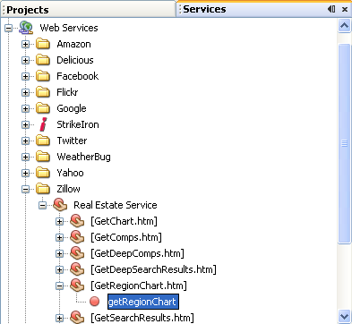
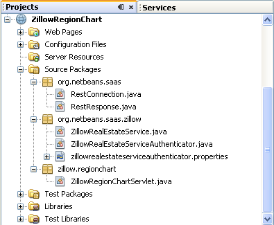

// 
//     Licensed to the Apache Software Foundation (ASF) under one
//     or more contributor license agreements.  See the NOTICE file
//     distributed with this work for additional information
//     regarding copyright ownership.  The ASF licenses this file
//     to you under the Apache License, Version 2.0 (the
//     "License"); you may not use this file except in compliance
//     with the License.  You may obtain a copy of the License at
// 
//       http://www.apache.org/licenses/LICENSE-2.0
// 
//     Unless required by applicable law or agreed to in writing,
//     software distributed under the License is distributed on an
//     "AS IS" BASIS, WITHOUT WARRANTIES OR CONDITIONS OF ANY
//     KIND, either express or implied.  See the License for the
//     specific language governing permissions and limitations
//     under the License.
//

= SaaS (Software as a Service): Zillow Tutorial
:jbake-type: tutorial
:jbake-tags: tutorials 
:jbake-status: published
:icons: font
:syntax: true
:source-highlighter: pygments
:toc: left
:toc-title:
:description: SaaS (Software as a Service): Zillow Tutorial - Apache NetBeans
:keywords: Apache NetBeans, Tutorials, SaaS (Software as a Service): Zillow Tutorial

NetBeans IDE provides a Web Services Manager that supports Software as a Service (SaaS) applications. SaaS refers to a software application delivery model where a software vendor develops a web-native software application and hosts and operates the application for use by its customers over the Internet. SaaS is an increasingly popular model for providing software functionality as it is economical in terms of both cost and customer hardware resources. The IDE now makes it easy for Java developers to access all the popular SaaS services on the web.

This tutorial shows how to use the simple SaaS provided by link:http://www.zillow.com/[+zillow.com+]. Zillow.com is a Seattle, Washington-based online real estate service company founded in 2005 by Rich Barton and Lloyd Frink, former Microsoft executives and founders of Expedia. Zillow allows users to see the value of millions of homes across the United States, not just those up for sale. In addition to giving value estimates of homes, it offers several unique features including value changes of each home in a given time frame (e.g., 1, 5, or 10 years), aerial views of homes and prices of homes in the area. Where it can access appropriate data, it also provides basic information on a given home such as square footage and the number of bedrooms and bathrooms. Users can also get current estimates of homes if there was a significant change made.

In this tutorial, you display a chart showing average house prices in a US region over 12 months. To set this up, first you use the Service Manager to insert the ZillowRealEstateService.GetRegionChart operation into a servlet. The IDE handles the basic infrastructure, but you have to modify the servlet code to extract the Region Chart URL. This tutorial shows you how to use JAXB Objects to extract the URL. This is the simplest approach.

image::images/netbeans-stamp-80-74-73.png[title="Content on this page applies to the NetBeans IDE 7.2, 7.3, 7.4 and 8.0"]

*To follow this tutorial, you need the following software and resources.*

|===
|Software or Resource |Version Required 

|xref:../../../download/index.adoc[NetBeans IDE] |Java EE download bundle 

|link:http://www.oracle.com/technetwork/java/javase/downloads/index.html[+Java Development Kit (JDK)+] |version 7 or 8 

|Java EE-compliant web or application server |Tomcat web server 7.x, 8.x GlassFish Server Open Source Edition 3.1.x, 4.x or link:http://www.oracle.com/technetwork/middleware/weblogic/overview/index.html[+Oracle WebLogic Server 11g-12c+]
*Important:* If you use Tomcat with this Tutorial, see 
xref:../../../wiki/DeployREST2Tomcat55.adoc[the NetBeans Wiki on Tomcat with REST] 
|===

== Registering To Receive the Zillow API Key

Zillow services use API-key authentication. link:http://www.zillow.com/webservice/Registration.htm[+Sign up with Zillow here+] to receive an API key. You will have to fill out a registration form, but registration is free.

Other services use HTTP Authentication, header signing, or user login for authentication. These mechanisms will be covered in upcoming tutorials.

== Creating the Servlet

The IDE lets you insert SaaS operations into servlets, existing RESTful services, JSP pages, or plain Java objects (POJOs). In this tutorial, you create a web application with a servlet.

*To create the servlet:*

1. Choose File > New Project. Under Categories, select Java Web. Under Projects, select Web Application and click Next.
2. In the Project Name field, type  ``ZillowRegionChart`` .
3. Select the GlassFish server or Tomcat server and Java EE 6 or Java EE 7. Click through the remaining options and click Finish.
4. Right-click the ZillowRegionChart project node and select Properties from the context window. The Project Properties dialog opens.
5. Right-click the project node and choose New > Servlet. The New Servlet wizard opens. 

image::images/new-zillow-servlet.png[title="New Servlet wizard with ZillowRegionChartServlet"]

[start=6]
. Name the servlet ZillowRegionChartServlet. Create an arbitrary package for it, such as zillow.regionchart. Keep all other defaults and click Finish.

The servlet opens in an editor tab and the servlet and its parent package are visible in the Projects view, in the Source Packages node of the project.

image::images/zillow-project-new.png[title="Projects tab in IDE showing new servlet"]

== Adding the Zillow GetRegionChart Operation to the Servlet

Use the Service Manager to add Zillow's SaaS functionality to your servlet. The IDE takes care of all the infrastructure for you.

*To add the GetRegionChart operation:*

1. Open the Services tab in the IDE. Expand the Web Services node. Navigate to the Zillow GetRegionChart operation. 

[start=2]
. In the editor, locate the processRequest method in ZillowRegionChartServlet.java. Add an empty line at the beginning of the try block. Drag and drop the getRegionChart operation into the try block of processRequest().

[start=3]
. The Customize GET SaaS dialog box opens. You can enter real US city, state and zip code values or leave them null. (If you leave null values, you will get a chart of average house prices for the entire country.) Click OK.

The IDE generates code for the GET SaaS service. When this is completed, the processRequest() method looks as follows.

image::images/droppedcode.png[title="Code of servlet showing inserted getRegionChart try block"]

The IDE also creates two new packages,  ``org.netbeans.saas``  and  ``org.netbeans.saas.zillow`` , containing RESTful connection and Zillow-specific classes, respectively. The complete package structure is shown below. The IDE also imports the  ``RestConnection``  and  ``ZillowRealEstateService``  classes into your servlet.

== Adding the API Key to the Project

In order for the project to access Zillow services, you have to pass the API key you obtained when you <<get-api-key,registered>>. Open the  ``zillowrealestateserviceauthenticator.properties``  file and copy and paste in the API key you received in the email from Zillow that acknowleged your registration.

== Modifying the Servlet to Return the Chart Graphic

The servlet you have created does not produce any useable output. In order to get the Region Chart graphic to appear in a browser, you have to extract the chart's URL from the String that the Zillow service returns, which is in the form of an XML file. One approach is to parse the XML file and pass the URL to a JSP page. This approach is described in Adam Myatt's link:http://netbeans.dzone.com/news/consuming-zillow-web-services-[+Consuming Zillow Web Services+] article in NetBeans Zone. In this tutorial you use a simpler approach involving JAXB objects.

*To return the chart graphic: *

1. Modify the output line  ``[Code]#//out.println("The SaasService returned: "+result.getDataAsString());#`` . Uncomment the line and change it to produce an HTML  tag instead of text. Be careful to escape the quotation marks that will surround the URL! The line now looks like this.

[source,java]
----

out.println("");
----

[start=2]
. Move the output line to inside the  ``if``  block, at the end. The  ``if``  block now looks like this:

[source,java]
----

if (result.getDataAsObject(zillow.realestateservice.regionchart.Regionchart.class) instanceof
  zillow.realestateservice.regionchart.Regionchart) {
        zillow.realestateservice.regionchart.Regionchart resultObj = result.getDataAsObject(zillow.realestateservice.regionchart.Regionchart.class);
        out.println("");
}
----

[start=3]
. Replace the  ``result.getDataAsString()``  method in the output with  ``resultObj.getResponse().getUrl()`` . You can use code completion to select  ``getResponse()``  from the different  ``resultObj``  methods, as shown below, and then use code completion to select  ``getUrl()``  from the  ``getResponse``  methods. 

image::images/zillow-getresponse-cc.png[title="Editor showing code completion for resultObj methods"]

[start=4]
. Change the catch block to catch  ``JAXBException``  instead of  ``Exception`` . You can also use a  ``Logger.getLogger(...)``  method instead of printing a stack trace. You will have to import the relevant classes. See if you can use code completion and the Fix Imports context menu action to reproduce the following catch block:

[source,java]
----

} catch (JAXBException ex) {
    Logger.getLogger(ZillowRegionChartServlet.class.getName()).log(Level.SEVERE, null, ex);
}
----

[start=5]
. Remove the commented-out output section from the parent try block in the servlet code.

Your modifications to the code are now complete! The final servlet code should look like the following:

[source,java]
----

package zillow.regionchart;

import java.io.IOException;
import java.io.PrintWriter;
import java.util.logging.Level;
import java.util.logging.Logger;
import javax.servlet.ServletException;
import javax.servlet.http.HttpServlet;
import javax.servlet.http.HttpServletRequest;
import javax.servlet.http.HttpServletResponse;
import javax.xml.bind.JAXBException;
import org.netbeans.saas.zillow.ZillowRealEstateService;
import org.netbeans.saas.RestResponse;

/**
 *
 * @author jeff
 */
public class ZillowRegionChartServlet extends HttpServlet {

    /** 
     * Processes requests for both HTTP GET and POST methods.
     * @param request servlet request
     * @param response servlet response
     * @throws ServletException if a servlet-specific error occurs
     * @throws IOException if an I/O error occurs
     */
    protected void processRequest(HttpServletRequest request, HttpServletResponse response)
            throws ServletException, IOException {
        response.setContentType("text/html;charset=UTF-8");
        PrintWriter out = response.getWriter();
        try {

            try {
                String unittype = "dollar";
                String city = null;
                String state = null;
                String zIP = null;
                String width = null;
                String height = null;
                String chartduration = null;

                RestResponse result = ZillowRealEstateService.getRegionChart(
                        unittype, city, state, zIP, width, height, chartduration);
                if (result.getDataAsObject(
                        zillow.realestateservice.regionchart.Regionchart.class) instanceof zillow.realestateservice.regionchart.Regionchart) {
                    zillow.realestateservice.regionchart.Regionchart resultObj =
                            result.getDataAsObject(
                            zillow.realestateservice.regionchart.Regionchart.class);
                    out.println("");

                }
                //TODO - Uncomment the print Statement below to print result.

            } catch (JAXBException ex) {
                Logger.getLogger(ZillowRegionChartServlet.class.getName()).log(Level.SEVERE, null, ex);
            }
        } finally {
            out.close();
        }
    }
----

== Running the Zillow Region Chart Servlet

The simplest way to run the servlet is to right-click the servlet in the Projects view and select Run File. Alternatively, right-click the Project node and select Properties. In the Properties tree, select Run. In the Relative URL field, type /ZillowRegionChartServlet, as shown below. Click OK, and then run the project.

image::images/zillow-run-properties.png[title="Properties dialog for ZillowRegionChart project"]

When you successfully run the project, a browser window opens showing the Region Chart.

image::images/zillow-chart.png[title="Zillow region chart"]

== More Exercises

Here are a few more ideas for you to explore:

* Try different real values for city, state and ZIP code. Run the servlet again.
* Write a client that would let you pass city, state and ZIP to the service and would return the matching Region Chart.
* Use a JSP page instead of JAXB Object to return the chart, as shown in this link:http://netbeans.dzone.com/news/consuming-zillow-web-services-[+NetBeans Zone article+].

xref:../../../community/mailing-lists.adoc[Send Feedback on This Tutorial]

== See Also

For more information about using NetBeans IDE to develop RESTful web services, SaaS, and other Java EE applications, see the following resources:

* xref:rest.adoc[+Getting Started with RESTful Web Sevices+]
* xref:../../../wiki/JavaClientForDeliciousUsingNetBeans.adoc[Creating a Java Client for del.icio.us RESTful Web Services], by Amit Kumar Saha
* xref:../../../wiki/RESTRemoting.adoc[NetBeans Wiki: RESTful Web Service Client Stub]
* xref:../web.adoc[Web Services Learning Trail]
* YouTube: link:https://www.youtube.com/watch?v=cDdfVMro99s[RESTful Web Services, Building and Deploying (Part 1)]
* YouTube: link:https://www.youtube.com/watch?v=_c-CCVy4_Eo[NetBeans RESTful Testing and Invoking RESTful Resources (Part 2)]

To send comments and suggestions, get support, and keep informed about the latest developments on the NetBeans IDE Java EE development features, xref:../../../community/mailing-lists.adoc[+join the nbj2ee@netbeans.org mailing list+].

