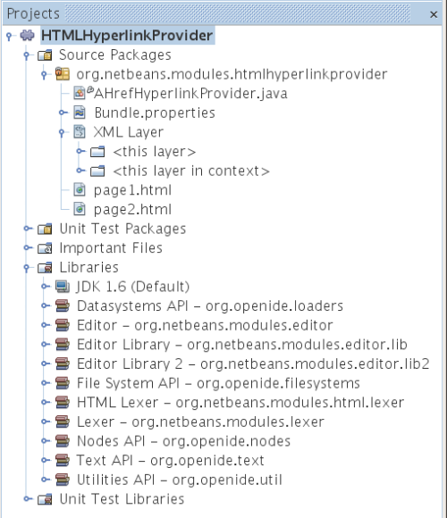

// 
//     Licensed to the Apache Software Foundation (ASF) under one
//     or more contributor license agreements.  See the NOTICE file
//     distributed with this work for additional information
//     regarding copyright ownership.  The ASF licenses this file
//     to you under the Apache License, Version 2.0 (the
//     "License"); you may not use this file except in compliance
//     with the License.  You may obtain a copy of the License at
// 
//       http://www.apache.org/licenses/LICENSE-2.0
// 
//     Unless required by applicable law or agreed to in writing,
//     software distributed under the License is distributed on an
//     "AS IS" BASIS, WITHOUT WARRANTIES OR CONDITIONS OF ANY
//     KIND, either express or implied.  See the License for the
//     specific language governing permissions and limitations
//     under the License.
//

= NetBeans Hyperlink Navigation Tutorial
:jbake-type: platform_tutorial
:jbake-tags: tutorials 
:jbake-status: published
:syntax: true
:source-highlighter: pygments
:toc: left
:toc-title:
:icons: font
:experimental:
:description: NetBeans Hyperlink Navigation Tutorial - Apache NetBeans
:keywords: Apache NetBeans Platform, Platform Tutorials, NetBeans Hyperlink Navigation Tutorial

In this tutorial, you learn how to create hyperlinks in HTML files, programmatically.

Optionally, for troubleshooting purposes, you can  link:http://plugins.netbeans.org/PluginPortal/faces/PluginDetailPage.jsp?pluginid=3797[download the completed sample] and inspect the sources.

== Introduction to Hyperlinks

Hyperlinks in the IDE are created when you implement the NetBeans API  link:https://bits.netbeans.org/dev/javadoc/org-netbeans-modules-editor-lib/org/netbeans/lib/editor/hyperlink/spi/HyperlinkProvider.html[HyperlinkProvider] class. In this case, the hyperlink will let the user navigate from an HREF attribute in an HTML link to the referenced HTML file.

The new hyperlink will appear when the user holds down the Ctrl key and moves the mouse over the value of the HREF attribute, as shown here:

image::images/hyperlink_hyperlink.png[]

When the hyperlink is clicked, the referenced file opens and the cursor lands on the first BODY tag, if one exists.

This is what the completed project will look like in the Projects window:

Though the focus of this tutorial is on hyperlinking from one HTML file to another, the principles shown here could equally be applied to other types of files, such as to Java source files, XML files, and JSP files.

== Creating the Module Project

In this section, we use a wizard to create a module project. We declare dependencies on modules that provide the NetBeans API classes needed by our hyperlink module.

[start=1]
1. Choose File > New Project. In the New Project wizard, choose NetBeans Modules under Categories and Module Project under Projects. Click Next. Type  ``AHrefHyperlink``  in Project Name and set Project Location to an appropriate folder on your disk. If they are not selected, select Standalone Module and Set as Main Project. Click Next.

[start=2]
1. Type  ``org.netbeans.modules.ahrefhyperlink``  in Code Name Base. Type  ``org/netbeans/modules/ahrefhyperlink/layer.xml``  in XML Layer. Click Finish.

[start=3]
1. Right-click the project, choose Properties, click Libraries in the Project Properties dialog box and declare a dependency on the following APIs:

* Datasystems API
* Editor
* Editor Library
* Editor Library 2
* File System API
* HTML Lexer
* Lexer
* Nodes API
* Text API
* Utilities API

== Implementing the HyperlinkProvider Class

The  link:https://bits.netbeans.org/dev/javadoc/org-netbeans-modules-editor-lib/org/netbeans/lib/editor/hyperlink/spi/HyperlinkProvider.html[HyperlinkProvider] class implements three methods, each of which is discussed in detail below, accompanied by a practical example in the context of our module. First we set up the class and then we implement each of the three methods in turn. 

=== Setting Up the HyperlinkProvider Class

Setting up our class means implementing  link:https://bits.netbeans.org/dev/javadoc/org-netbeans-modules-editor-lib/org/netbeans/lib/editor/hyperlink/spi/HyperlinkProvider.html[HyperlinkProvider] and initializing some values that we will need in our implementation.

[start=1]
1. Create a Java class in  ``org.netbeans.modules.ahrefhyperlink`` , and call it AHrefHyperlinkProvider.

[start=2]
1. Change the signature so that HyperlinkProvider is implemented.

[start=3]
1. Note that the following import statements will be needed:

[source,java]
----

import org.openide.util.RequestProcessor;
import java.lang.ref.Reference;
import java.lang.ref.WeakReference;
import javax.swing.text.Document;
import javax.swing.text.JTextComponent;
import javax.swing.text.StyledDocument;
import org.netbeans.api.editor.EditorRegistry;
import org.netbeans.api.html.lexer.HTMLTokenId;
import org.netbeans.api.lexer.Token;
import org.netbeans.api.lexer.TokenHierarchy;
import org.netbeans.api.lexer.TokenSequence;
import org.netbeans.lib.editor.hyperlink.spi.HyperlinkProvider;
----

[start=4]
1. Add the following initial values at the top of the class:

[source,java]
----

private static String AHREF_IDENTIFIER = "href";
private Reference<Document> lastDocument;
private int startOffset;
private int endOffset;
private String identifier;
----

[start=5]
1. Define the Constructor as follows:

[source,java]
----

public AHrefHyperlinkProvider() {
        
  lastDocument = null;
        
}
----

[start=6]
1. Add accessors for the document:

[source,java]
----

private Document getLastDocument() {
    return lastDocument == null ? null : lastDocument.get();
}

private void setLastDocument(Document doc) {
    lastDocument = new WeakReference<Document>(doc);
}
----

=== isHyperlinkPoint(Document doc, int offset)

link:https://bits.netbeans.org/dev/javadoc/org-netbeans-modules-editor-lib/org/netbeans/lib/editor/hyperlink/spi/HyperlinkProvider.html#isHyperlinkPoint(javax.swing.text.Document,%20int)[isHyperlinkPoint(Document doc, int offset)] determines whether there should be a hyperlink at the given offset within the given document. The inline comments in the method below, as well as in the code in the remainder of this tutorial, serve to explain the purpose of the code.

[source,java]
----

public boolean isHyperlinkPoint(Document doc, int offset) {

        JTextComponent target = EditorRegistry.lastFocusedComponent();
        final StyledDocument styledDoc = (StyledDocument) target.getDocument();
        if (styledDoc == null) {
            return false;
        }

        *// Work only with the open editor 
        //and the editor has to be the active component:*
        if ((target == null) || (target.getDocument() != doc)) {
            return false;
        }

        TokenHierarchy hi = TokenHierarchy.get(doc);
        TokenSequence<HTMLTokenId> ts = hi.tokenSequence(HTMLTokenId.language());
        ts.move(offset);
        ts.moveNext();
        Token<HTMLTokenId> tok = ts.token();
        if (tok != null) {
            int tokOffset = ts.offset();
            switch (tok.id()) {
                case VALUE:
                    while (ts.movePrevious()) {
                        Token<HTMLTokenId> prev = ts.token();
                        switch (prev.id()) {
                            case ARGUMENT:
                                if (AHREF_IDENTIFIER.equals(prev.text().toString())) {
                                    identifier = tok.text().toString();
                                    setLastDocument(doc);
                                    startOffset = tokOffset;
                                    endOffset = startOffset + tok.text().length();
                                    return true;
                                }
                            case OPERATOR:
                                continue;
                            case EOL:
                            case ERROR:
                            case WS:
                                continue;
                            default:
                                return false;
                        }
                    }
                    return false;
            }
            return false;
        }
        return false;
}
----

=== getHyperlinkSpan(Document doc, int offset)

 `` link:https://bits.netbeans.org/dev/javadoc/org-netbeans-modules-editor-lib/org/netbeans/lib/editor/hyperlink/spi/HyperlinkProvider.html#getHyperlinkSpan(javax.swing.text.Document,%20int)[getHyperlinkSpan(Document doc, int offset)]``  determines the length of the hyperlink.

[source,java]
----

public int[] getHyperlinkSpan(Document doc, int offset) {

    JTextComponent target = EditorRegistry.lastFocusedComponent();
    final StyledDocument styledDoc = (StyledDocument) target.getDocument();
    if (styledDoc == null) {
        return null;
    }
    
    *// Return the position, which was set in the isHyperlink method:*
    return new int[]{startOffset, endOffset};
}
----

=== performClickAction(Document doc, int offset)

link:https://bits.netbeans.org/dev/javadoc/org-netbeans-modules-editor-lib/org/netbeans/lib/editor/hyperlink/spi/HyperlinkProvider.html#performClickAction(javax.swing.text.Document,%20int)[performClickAction(Document doc, int offset)] determines what happens when the hyperlink is clicked. In general, a document should open, the cursor should move to a certain place in a document, or both.

[source,java]
----

public void performClickAction(Document doc, int offset) {

    JTextComponent target = EditorRegistry.lastFocusedComponent();
    final StyledDocument styledDocdoc = (StyledDocument) target.getDocument();
    if (styledDocdoc == null) {
        return;
    }

    *//Start a new thread for opening the HTML document:*
    OpenHTMLThread run = new OpenHTMLThread(styledDocdoc, identifier);
    RequestProcessor.getDefault().post(run);

}
----

== Opening the Referenced HTML File

Next, you need to create a class that opens an HTML file in a separate thread. Here, the class is called  ``OpenHTMLThread`` .

The token identified in the  ``isHyperlinkPoint``  method is received by this class. Then the token is analyzed to see whether it contains a slash, which indicates that it is a relative link. In that case, the file object is extrapolated from the URL to the file. Otherwise, the file object is created from the token itself. Next, the document with the name of the file object is opened and the cursor is positioned at the BODY tag, if found.

[source,html]
----

public class OpenHTMLThread implements Runnable {

    private StyledDocument doc;
    private String identifier;

    public OpenHTMLThread(StyledDocument doc, String identifier) {

        super();
        this.doc = doc;
        this.identifier = identifier;
    }

    public void run() {
        try {

            String cleanedIdentifier = identifier.replaceAll("\"", "");

            FileObject fo = NbEditorUtilities.getFileObject(doc);
            FileObject foHtml = null;

            *// Here we're working out whether we're dealing with a relative link or not:*
            if (cleanedIdentifier.contains("/")) {
                String fullPath = fo.getPath();
                try {
                    URL f = new File(fullPath).toURI().resolve(cleanedIdentifier).toURL();
                    foHtml = URLMapper.findFileObject(f);
                } catch (MalformedURLException ex) {
                    ex.printStackTrace();
                }
            } else {
                foHtml = fo.getParent().getFileObject(cleanedIdentifier);
            }

            *// Here we're finding our HTML file:*
            DataObject dObject;
            dObject = DataObject.find(foHtml);
            final EditorCookie.Observable ec = (EditorCookie.Observable) dObject.getCookie(EditorCookie.Observable.class);
            if (ec != null) {
                org.netbeans.editor.Utilities.runInEventDispatchThread(new Runnable() {

                    public void run() {
                        final JEditorPane[] panes = ec.getOpenedPanes();

                        *//Here we're positioning the cursor,
                        //if the document isn't open, we need to open it first:*
                        
                        if ((panes != null) &amp;&amp; (panes.length > 0)) {
                            setPosition(panes[0], identifier);
                        } else {
                            ec.addPropertyChangeListener(new PropertyChangeListener() {

                                public void propertyChange(PropertyChangeEvent evt) {
                                    if (EditorCookie.Observable.PROP_OPENED_PANES.equals(evt.getPropertyName())) {
                                        final JEditorPane[] panes = ec.getOpenedPanes();
                                        if ((panes != null) &amp;&amp; (panes.length > 0)) {
                                            setPosition(panes[0], identifier);
                                        }
                                        ec.removePropertyChangeListener(this);
                                    }
                                }
                            });
                            ec.open();
                        }
                    }

                    *//Here we specify where the cursor will land:*
                    private void setPosition(JEditorPane pane, String identifier) {

                        try {
                            *//The whole text:*
                            String text = pane.getDocument().getText(0, pane.getDocument().getLength() - 1);
                            *//The place where we want the cursor to be:*
                            int index = text.indexOf("<body>");
                            /*/If we can find it, we place the cursor there:*
                            if (index > 0) {
                                pane.setCaretPosition(index);
                            }
                        } catch (BadLocationException ex) {
                            ex.printStackTrace();
                        }
                    }
                });
            }
        } catch (DataObjectNotFoundException ex) {
            Exceptions.printStackTrace(ex);
        }
    }
}
----

Make very sure that the following import statements are declared:

[source,java]
----

import java.beans.PropertyChangeEvent;
import java.beans.PropertyChangeListener;
import java.io.File;
import java.net.MalformedURLException;
import java.net.URL;
import javax.swing.JEditorPane;
import javax.swing.text.BadLocationException;
import javax.swing.text.StyledDocument;
import org.netbeans.modules.editor.NbEditorUtilities;
import org.openide.cookies.EditorCookie;
import org.openide.filesystems.FileObject;
import org.openide.filesystems.URLMapper;
import org.openide.loaders.DataObject;
import org.openide.loaders.DataObjectNotFoundException;
import org.openide.util.Exceptions;
----

== Registering the HyperlinkProvider Implementation Class

Finally, you need to register the hyperlink provider implementation class in the module's  ``layer.xml``  file. Do this as follows, while making sure that the line in bold below is the fully qualified class name of the class that implements HyperlinkProvider:

[source,xml]
----

<folder name="Editors">
    <folder name="text">
        <folder name="html">
            <folder name="HyperlinkProviders">
            
                <file name="AHrefHyperlinkProvider.instance">
                    <attr name="instanceClass" 
                          stringvalue="*org.netbeans.modules.ahrefhyperlink.AHrefHyperlinkProvider*"/>
                    <attr name="instanceOf" 
                          stringvalue="org.netbeans.lib.editor.hyperlink.spi.HyperlinkProvider"/>
                </file>
                
            </folder>
        </folder>
    </folder>
</folder>
----

If you create a hyperlink for a different MIME type, you need to change the  ``text/html``  folders above to the appropriate MIME type.

Now that the HyperlinkProvider is registered, you can install the module and try out your new hyperlinks. Hold down the Ctrl key, move the mouse over an HREF attribute as shown at the start of this tutorial:

image::images/hyperlink_hyperlink.png[]

When the hyperlink appears, you can click it and let the IDE navigate to the referenced HTML file. 

link:http://netbeans.apache.org/community/mailing-lists.html[Send Us Your Feedback]

== Next Steps

* Utility method for finding and opening Java source files.
* Working with JSP and XML documents. (Same principle as above.)
* Need to provide for the situation where the referenced HTML file doesn't exist.
* Show hyperlink within same document.
* Implement external links, i.e., http links should go to external browser.
* Provide links to NetBeans sources, such as StrutsHyperlinkProvider, etc.

