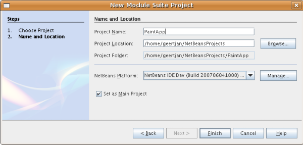
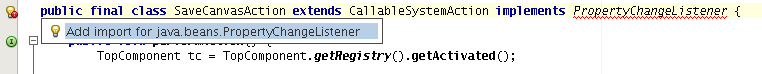

// 
//     Licensed to the Apache Software Foundation (ASF) under one
//     or more contributor license agreements.  See the NOTICE file
//     distributed with this work for additional information
//     regarding copyright ownership.  The ASF licenses this file
//     to you under the Apache License, Version 2.0 (the
//     "License"); you may not use this file except in compliance
//     with the License.  You may obtain a copy of the License at
// 
//       http://www.apache.org/licenses/LICENSE-2.0
// 
//     Unless required by applicable law or agreed to in writing,
//     software distributed under the License is distributed on an
//     "AS IS" BASIS, WITHOUT WARRANTIES OR CONDITIONS OF ANY
//     KIND, either express or implied.  See the License for the
//     specific language governing permissions and limitations
//     under the License.
//

= NetBeans Platform Paint Application Tutorial
:jbake-type: platform_tutorial
:jbake-tags: tutorials 
:jbake-status: published
:syntax: true
:source-highlighter: pygments
:toc: left
:toc-title:
:icons: font
:experimental:
:description: NetBeans Platform Paint Application Tutorial - Apache NetBeans
:keywords: Apache NetBeans Platform, Platform Tutorials, NetBeans Platform Paint Application Tutorial

This tutorial takes you through the basics of using NetBeans IDE to develop rich-client applications on top of the NetBeans Platform. When you develop applications on top of the NetBeans Platform, you are developing on top of the NetBeans IDE's core. All the modules belonging to the IDE that are not relevant to your application are excluded, but those that are useful are kept. By reusing features readily available in IDE's core, you save yourself a lot of time and energy.

NOTE: This is not the latest version of this document. It applies to NetBeans IDE 6.0/6.1 only.  link:../nbm-paintapp.html[Click here] to see the most up to date version.

== Introduction to the Paint Application

This tutorial is designed to get you going as quickly as possible. You will create and install a simple application on the NetBeans Platform. The application allows the user to paint on the screen and save the results:

image::images/paintapp_result-without-menus-60.png[]

This initial version is far from a full fledged paint application, but it demonstrates a very simple case of creating an application on top of the NetBeans Platform.

NOTE:  The  link:nbm-google.html[NetBeans Plugin Quick Start] is a better tutorial for you if, instead of rich-client applications, you want to learn about NetBeans modules.

In this tutorial, we recreate an application that is a sample delivered with the IDE. To see the final product, or to troubleshoot problems while working through this tutorial, get the sample from the New Project wizard, in the location shown below:

image::images/paintapp_sample-in-new-project-60.png[]

== Setting Up the Paint Application

In this section, you create the structure of your application. You first need to create a module suite, which will represent your application. The application depends on a library, so you will create a library wrapper module that will contain the library's JAR file. Finally, you create the module that will contain your code.

=== Creating the Module Suite

A module suite is the equivalent of an application—it is a set of modules that work together to create specific results. It also lets you assign your own splashscreen (branding), application name, and the type and number of NetBeans modules you want to use. You can also take advantage of such actions as creating a ZIP distribution and building a Java WebStart (JNLP) application, which are important tools in making your application available to other users.

[start=1]
1. Choose File > New Project. Under Categories, select NetBeans Modules. Under projects, select Module Suite and click Next.

[start=2]
1. In the Name and Location panel, type  ``PaintApp``  in Project Name. Change the Project Location to any directory on your computer. Leave the Set as Main Project checkbox selected:

Click Finish.

The new module suite opens in the IDE. It contains one node in the Project window. This node, the Modules node, is for manually adding modules and library wrapper modules to the module suite. When you use the Module wizard or the Library Wrapper Module wizard, the module that you create can automatically be added to the module suite.

=== Creating the Library Wrapper Module

A library wrapper module is a module whose JAR file contains no code—it is just a pointer to a library. It turns the library into a NetBeans module, so that all the protections of the NetBeans classloader system apply to it—without modifying the original JAR file. Your application can then depend on the library just as if the library were just another NetBeans module. And, if new versions of the library become available, you can distribute them without needing to distribute anything except a single NetBeans Module (NBM) file for the wrapper library.

NOTE:  One of the benefits of building on the NetBeans Platform is that its user interface is based on Swing—the standard user interface toolkit for Java. Since Swing has been around for a long time, there are a lot of Swing components you can reuse in your application. In this tutorial, you reuse an existing color chooser JavaBean (you can find the source for it in NetBeans CVS under  ``contrib/coloreditor`` ). The JAR file is called  ``ColorChooser.jar`` . You can download the library  link:http://web.archive.org/web/20081119053233/http://colorchooser.dev.java.net/[here]. Save it anywhere in your filesystem. Do the following to create a library wrapper module for the  ``ColorChooser.jar``  file:

[start=1]
1. Choose File > New Project. Under Categories, select NetBeans Modules. Under projects, select Library Wrapper Module and click Next.

[start=2]
1. In the Name and Location panel, for the Library text box, either type in the path to  ``ColorChooser.jar``  or browse to its location.

[start=3]
1. Leave the License text field empty. If you intend to distribute the completed product, you should include the external library's license file.

[start=4]
1. Click Next and you should see this:

image::images/paintapp_newmodulesuite-library-60.png[]

Click Next again, and then click Finish.

=== Creating the Module

Now you need a module to contain the actual code you're going to write.

[start=1]
1. Choose File > New Project. Under Categories, select NetBeans Modules. Under projects, select Module and click Next.

[start=2]
1. In the Name and Location panel, type  ``Paint``  in Project Name. Change the Project Location to any directory on your computer. Ensure that the Add to Module Suite radio button is selected and that the  ``PaintApp``  module suite is selected in the Module Suite drop down list. Select the Set as Main Project checkbox. Click Next.

[start=3]
1. In the Basic Module Configuration panel, change  ``yourorghere``  in Code Name Base to  ``netbeans``  so that the whole name is  ``org.netbeans.paint`` . Leave  ``Paint``  as the Module Display Name. Leave the location of the localizing bundle and XML layer, so that they will be stored in a package with the name  ``org.netbeans.paint`` .

These files do the following:

* *Localizing Bundle.* Specifies language-specific strings for internationalization.
* *XML Layer.* Registers items such as menus and toolbar buttons in the NetBeans system.

Click Finish.

The IDE creates the  ``Paint``  project. The project contains all of your sources and project metadata, such as the project's Ant build script. The project opens in the IDE. You can view its logical structure in the Projects window (Ctrl-1) and its file structure in the Files window (Ctrl-2). For example, the Projects window should look as follows:

image::images/paintapp_initial-proj-window60.png[]

In addition to the localizing bundle and the XML layer, the project also includes the following important files:

* *Module Manifest.* Declares that the project is a module. In addition, it sets some module-specific settings, such as the location of the XML layer, the location of the localizing bundle, and the module version.
* *Build Script.* Provides a place where you can create your own Ant targets and override those that are specified in  ``nbproject/build-impl.xml`` .
* *Project Metadata.* Contains information such as the project's type, contents, platform, classpath, dependencies, and mappings between project commands and targets in Ant scripts.

You will not need to modify any of these files during this tutorial.

=== Specifying the Module's Dependencies

You will need to subclass several classes that belong to the  link:https://bits.netbeans.org/dev/javadoc/[NetBeans APIs]. In addition, the project depends on the  ``ColorChooser.jar``  file. All NetBeans APIs are implemented by modules, so completing both of these tasks really just means adding some modules to the list of modules that our module needs in order to run.

[start=1]
1. In the Projects window, right-click the  ``Paint``  project node and choose Properties. The Project Properties dialog box opens. Under Categories, click Libraries.

[start=2]
1. For each of the API's listed in the table below, click "Add Dependency..." and then, in the Filter text box, start typing the name of the class that you want to subclass.

|===
|*Class* |*API* |*Purpose* 

| ``ColorChooser``  | ``colorchooser``  |Library wrapper module for the color chooser component you created 

| ``DataObject``  | ``Datasystems API``  |The NetBeans module containing the DataObject class 

| ``DialogDisplayer``  | ``Dialogs API``  |This allows the creation of user notification, a dialog's description and permits it to be displayed 

| ``AbstractFile``  | ``File System API``  |This provides a common API to access files in a uniform manner 

| ``AbstractNode``  | ``Nodes API``  |This serves as the main aparatus for visualisation of objects in NetBeans 

| ``StatusDisplayer``  | ``UI Utilities API``  |The StatusDisplayer class used to write the statusbar in the main window 

| ``WeakListeners``  | ``Utilities API``  |This contains the WeakListeners class 

| ``TopComponent``  | ``Window System API``  |This contains the TopComponent JPanel class 
|===

The first column in the table above lists all the classes that you will subclass in this tutorial. In each case, start typing the class name in the Filter and watch the Module list narrow. Use the table's second column to pick the appropriate API (or, in the case of  ``ColorChooser`` , the library) from the narrowed Module list and then click OK to confirm the choice:

image::images/paintapp_libfilter-60.png[]

[start=3]
1. Click OK to exit the Project Properties dialog box.

[start=4]
1. In the Projects window, expand the Paint module's project node if it is not already expanded. Then expand the Important Files node and double-click the Project Metadata node. Note that the API's you selected have been declared as module dependencies.

== Creating and Embedding the Paint Canvas

=== Creating the Canvas

The next step is to create the actual component on which the user can paint. Here, you use a pure Swing component—so, let's skip the details of its implementation and just provide the final version. The color chooser bean, which you created the library wrapper module for, is used in the source code for this panel—when you run the finished application, you will see it in the toolbar of the panel for editing images.

[start=1]
1. In the Projects window, expand the  ``Paint``  node, then expand the Source Packages node, and then right-click the  ``org.netbeans.paint``  node. Choose New > Java Class.

[start=2]
1. Enter  ``PaintCanvas``  as the Class Name. Ensure that  ``org.netbeans.paint``  is listed as the Package. Click Finish.  ``PaintCanvas.java``  opens in the Source editor.

[start=3]
1. Replace the default content of the file with the content found  link:https://netbeans.apache.org/platform/guide/tutorials/paintTutorial/PaintCanvas.java[here]. If you named your package something other than  ``org.netbeans.paint`` , correct the package name in the Source editor.

=== Preparing the TopComponent Class

Now you'll write your first class that touches the  link:https://bits.netbeans.org/dev/javadoc/[NetBeans APIs]. It is a  `` link:https://bits.netbeans.org/dev/javadocorg-openide-windows/org/openide/windows/TopComponent.html[TopComponent]``  class. A  ``TopComponent``  class is just a  ``JPanel``  class which NetBeans' windowing system knows how to talk to—so it can be put inside a tabbed container inside the main window.

[start=1]
1. In the Projects window, expand the  ``Paint``  node, then expand the Source Packages node, and then right-click the  ``org.netbeans.paint``  node. Choose New > Java Class.
Enter ``PaintTopComponent`` as the Class Name. Ensure that ``org.netbeans.paint`` is listed as the Package. Click Finish. ``PaintTopComponent.java`` opens in the Source editor.

[start=2]
1. Near the top of the file, change the class declaration to the following:

[source,java]
----

    public class PaintTopComponent extends TopComponent implements ActionListener, ChangeListener {
----

[start=3]
1. Press Ctrl-Shift-I to fix imports anc click OK in the dialog box. The IDE makes the necessary import package declarations at the top of the file.

Notice the red line under the class declaration that you just entered. Position the cursor in the line and notice that a light bulb appears in the left margin. Click the light bulb (or press Alt-Enter), as shown below:

image::images/paintapp_lightbulb-60.png[]

Select Implement all abstract methods. The IDE generates two method skeletons— ``actionPerformed()``  and  ``stateChanged()`` . You fill these out later in this tutorial.

[start=4]
1. Add the following three variable declarations to the top of the  ``PaintTopComponent``  class and then fix the import statements (Ctrl-Shift-I).

[source,java]
----

    private PaintCanvas canvas = new PaintCanvas(); //The component the user draws on
    private JComponent preview; //A component in the toolbar that shows the paintbrush size
    private static int ct = 0; //A counter you use to provide names for new images
----

[start=5]
1. Now you need to implement two boilerplate methods. The first one tells the windowing system to disregard open windows when the application is shut down; the second provides a base string for a unique string ID for our component. Each  ``TopComponent``  has a unique string ID that is used when saving the  ``TopComponent`` . Insert the following two methods into the  ``PaintTopComponent``  class:

[source,java]
----

    public int getPersistenceType() {
        return PERSISTENCE_NEVER;
    }

    public String preferredID() {
        return "Image";
    }
----

The class should now look as follows:

[source,java]
----

public class PaintTopComponent extends TopComponent implements ActionListener, ChangeListener {
    
    private PaintCanvas canvas = new PaintCanvas(); //The component the user draws on
    private JComponent preview; //A component in the toolbar that shows the paintbrush size
    private static int ct = 0; //A counter you use to provide names for new images
    
    public PaintTopComponent() {
    }
    
    public void actionPerformed(ActionEvent arg0) {
        throw new UnsupportedOperationException("Not supported yet.");
    }
    
    public void stateChanged(ChangeEvent arg0) {
        throw new UnsupportedOperationException("Not supported yet.");
    }
    
    public int getPersistenceType() {
        return PERSISTENCE_NEVER;
    }
    
    public String preferredID() {
        return "Image";
    }
    
}
----

=== Initializing the TopComponent Class

In this section, we add code that initializes the user interface.

[start=1]
1. Fill out the constructor, which the IDE created for you near the top of the class, and then fix the import statements (Ctrl-Shift-I):

[source,java]
----

    public PaintTopComponent() {

        initComponents();

        String displayName = NbBundle.getMessage(
                PaintTopComponent.class,
                "UnsavedImageNameFormat",
                new Object[] { new Integer(ct++) }
        );

        setDisplayName(displayName);

    }
----

The code here is pretty simple. The first call is to a method you haven't written yet,  ``initComponents()`` , which will add a toolbar and a PaintCanvas to your  ``TopComponent`` . Because you haven't written the method yet, a red line appears underneath it here. As before, click the light bulb (or press Alt-Enter) and accept the suggestion:

image::images/paintapp_lightbulb-initcomponents-60.png[]

The  ``initComponents()``  method skeleton is generated for you.

[start=2]
1. Expand the  ``org.netbeans.paint``  package in the Projects window. Double-click the  ``Bundle.properties``  file to open it in the Source editor. Add the following line to the end:

[source,java]
----

    UnsavedImageNameFormat=Image {0}
----

This specifies the text that will be used to identify a new image file in the application prior to being saved by the user. For example, when a user clicks New Canvas for the first time in your completed application, a tab will appear above the Source Editor with the label, 'Image 0'. Make sure that you save the file before continuing.

=== Filling Out the Skeleton Methods

In this section, we code the user interface of our application. We could also use the IDE's GUI Builder to visually design the layout.

[start=1]
1. The  ``initComponents()``  method installs components in your panel, so that the user has something to interact with. You generated its skeleton method during the previous section in the  ``PaintTopComponent.java``  class. Fill it out as follows:

[source,java]
----

    private void initComponents() {

        setLayout(new BorderLayout());
        JToolBar bar = new JToolBar();

        ColorChooser fg = new ColorChooser();
        preview = canvas.createBrushSizeView();

        //Now build our toolbar:

        //Make sure components don't get squished:
        Dimension min = new Dimension(32, 32);
        preview.setMaximumSize(min);
        fg.setPreferredSize(new Dimension(16, 16));
        fg.setMinimumSize(min);
        fg.setMaximumSize(min);

        JButton clear = new JButton(
          	    NbBundle.getMessage(PaintTopComponent.class, "LBL_Clear"));

        JLabel fore = new JLabel(
         	    NbBundle.getMessage(PaintTopComponent.class, "LBL_Foreground"));

        fg.addActionListener(this);
        clear.addActionListener(this);

        JSlider js = new JSlider();
        js.setMinimum(1);
        js.setMaximum(24);
        js.setValue(canvas.getDiam());
        js.addChangeListener(this);

        fg.setColor(canvas.getColor());

        bar.add(clear);
        bar.add(fore);
        bar.add(fg);
        JLabel bsize = new JLabel(
     	    NbBundle.getMessage(PaintTopComponent.class, "LBL_BrushSize"));

        bar.add(bsize);
        bar.add(js);
        bar.add(preview);

        JLabel spacer = new JLabel("   "); //Just a spacer so the brush preview
        //isn't stretched to the end of the
        //toolbar

        spacer.setPreferredSize(new Dimension(400, 24));
        bar.add(spacer);

        //And install the toolbar and the painting component:
        add(bar, BorderLayout.NORTH);
        add(canvas, BorderLayout.CENTER);
        
    }
----

Press Ctrl-Shift-I to generate the required import statements.

[start=2]
1. Fill out the other two methods that you generated. They are used for listening to the  ``PaintTopComponent``  class:

[source,java]
----

    public void actionPerformed(ActionEvent e) {

        if (e.getSource() instanceof JButton) {
           canvas.clear();
        } else if (e.getSource() instanceof ColorChooser) {
           ColorChooser cc = (ColorChooser) e.getSource();
           canvas.setPaint (cc.getColor());
        }
        
        preview.paintImmediately(0, 0, preview.getWidth(), preview.getHeight());
        
    }
----

[source,java]
----

    public void stateChanged(ChangeEvent e) {

        JSlider js = (JSlider) e.getSource();
        canvas.setDiam (js.getValue());
        preview.paintImmediately(0, 0, preview.getWidth(), preview.getHeight());
        
    }
----

[start=3]
1. In the  ``Bundle.properties``  file, add the following key-value pairs to the end of the file:

[source,java]
----

    LBL_Clear = Clear
    LBL_Foreground = Foreground 
    LBL_BrushSize = Brush Size

----

Make sure that you save the file before continuing.

=== Saving the Image to Disk

In your new application, it would be a good idea to allow users to save the images they create. By including the following code into the  ``PaintTopComponent``  class, this functionality will be activated.

[start=1]
1. Insert the following code into the  ``PaintTopComponent``  class:

[source,java]
----

    public void save() throws IOException {

        if (getDisplayName().endsWith(".png")) {
	    doSave(new File(getDisplayName()));
        } else {
	    saveAs();
        }
        
    }
----

[source,java]
----

    public void saveAs() throws IOException {

        JFileChooser ch = new JFileChooser();
        if (ch.showSaveDialog(this) == JFileChooser.APPROVE_OPTION &amp;&amp; ch.getSelectedFile() != null) {

	    File f = ch.getSelectedFile();
            
	    if (!f.getPath().endsWith(".png")) {
	        f = new File(f.getPath() + ".png");
	    }
            
	    if (!f.exists()) {
            
	        if (!f.createNewFile()) {
		    String failMsg = NbBundle.getMessage(
		             PaintTopComponent.class,
			    "MSG_SaveFailed", new Object[] { f.getPath() }
	            );
		    JOptionPane.showMessageDialog(this, failMsg);
		    return;
	        }
                
	    } else {
	        String overwriteMsg = NbBundle.getMessage(
		    PaintTopComponent.class,
                    "MSG_Overwrite", new Object[] { f.getPath() }
	        );
                
	        if (JOptionPane.showConfirmDialog(this, overwriteMsg)
	        != JOptionPane.OK_OPTION) {
		    return;
	        }
                
	    }
            
	    doSave(f);
            
        }
        
    }
----

[source,java]
----

    private void doSave(File f) throws IOException {

        BufferedImage img = canvas.getImage();
        ImageIO.write(img, "png", f);
        String statusMsg = NbBundle.getMessage(PaintTopComponent.class,
            "MSG_Saved", new Object[] { f.getPath() });
        StatusDisplayer.getDefault().setStatusText(statusMsg);
        setDisplayName(f.getName());
        
    }
----

[start=2]
1. Add the following lines to the  ``Bundle.properties``  file:

[source,java]
----

    MSG_SaveFailed = Could not write to file {0}
    MSG_Overwrite = {0} exists.  Overwrite?
    MSG_Saved = Saved image to {0}
----

Make sure that you save the file before continuing.

[start=3]
1. Click Ctrl-Shift-I to fix the import statements. You will notice that there are two fully qualified names for the  ``File``  class. Choose the  ``java.io.File``  option.

== Creating the New Canvas Menu Item

You use the Module Development file templates to create the basis of the module's functionality. When you use a file template, the IDE registers the item that you create in the  ``layer.xml``  file. After using a wizard to create the file template, you use the  link:https://bits.netbeans.org/dev/javadoc/[NetBeans APIs] to continue developing the module.

[start=1]
1. In the Projects window, right-click the Paint module's project node and choose New > Other. In the New File wizard, choose Module Development under Categories and Action under File Types. Click Next.

[start=2]
1. In the Action Type panel, accept the defaults. Click Next.

[start=3]
1. In the GUI Registration panel, select Global Menu Item, and select Global Toolbar Button. Set the following values:

* *Category:* Edit
* *Menu:* File
* *Position:* Anywhere you want it to be!
* *Toolbar:* File
* *Position:* Anywhere you want it to be!

NOTE:  Where you position the action is not important, as long as it is in the File menu and in the File toolbar.

You should now see the following:

image::images/paintapp_newcanvasaction-60.png[]

Click Next.

[start=4]
1. In the Name, Icon, and Location panel, type  ``NewCanvasAction``  in Class Name and type  ``New Canvas``  in Display Name.

In Icon, paste this icon (right-click it here and then save it in the  ``org.netbeans.paint``  folder): 
image::images/paintapp_new_icon.png[]

[start=5]
1. Click Finish.

The IDE creates  ``NewCanvasAction.java``  in  ``org.netbeans.paint``  and opens it in the Source Editor. This is what you should see (click on the links to see the related NetBeans API Javadoc):

[source,java]
----

    package org.netbeans.paint;

    import  link:https://bits.netbeans.org/dev/javadoc/org-openide-util/org/openide/util/HelpCtx.html[org.openide.util.HelpCtx];
    import  link:https://bits.netbeans.org/dev/javadoc/org-openide-util/org/openide/util/NbBundle.html[org.openide.util.NbBundle];
    import  link:https://bits.netbeans.org/dev/javadoc/org-openide-util/org/openide/util/actions/CallableSystemAction.html[org.openide.util.actions.CallableSystemAction];

    public final class NewCanvasAction extends CallableSystemAction {

       public void  link:https://bits.netbeans.org/dev/javadoc/org-openide-util/org/openide/util/actions/CallableSystemAction.html#performAction()[performAction()] {
   	// TODO implement action body
       }

       public String  link:https://bits.netbeans.org/dev/javadoc/org-openide-util/org/openide/util/actions/SystemAction.html#getName()[getName()] {
       	return NbBundle.getMessage(NewCanvasAction.class, "CTL_NewCanvasAction");
       }
    
       protected String  link:https://bits.netbeans.org/dev/javadoc/org-openide-util/org/openide/util/actions/SystemAction.html#iconResource()[iconResource()] {
        return "org/netbeans/paint/new_icon.png";
       }
    
       public HelpCtx  link:https://bits.netbeans.org/dev/javadoc/org-openide-util/org/openide/util/actions/SystemAction.html#getHelpCtx()[getHelpCtx()] {
        return HelpCtx.DEFAULT_HELP;
       }

       protected boolean  link:https://bits.netbeans.org/dev/javadoc/org-openide-util/org/openide/util/actions/CallableSystemAction.html#asynchronous()[asynchronous()] {
        return false;
       }
       
    }
----

As specified in the GUI Registration panel, the IDE registers the action class as a menu item and as a toolbar button in the  ``layer.xml``  file.

[start=6]
1. In the Source Editor, open  ``NewCanvasAction.java``  and fill out the  ``performAction()``  method as follows:

[source,java]
----

    public void performAction() {

        PaintTopComponent tc = new PaintTopComponent();
	tc.open();
	tc.requestActive();       
        
    }
----

What this does is simply to create a new instance of our image editing component, open it, so it appears in the main window, and activate it by sending keyboard focus to it and selecting its tab.

== Creating the Save Canvas Menu Item

As in the previous section, we use the New Action wizard to create a menu item, this time for saving images.

[start=1]
1. In the Projects window, right-click the Paint module's project node and choose New > Other. In the New File wizard, choose Module Development under Categories and Action under File Types. Click Next.

[start=2]
1. In the Action Type panel, accept the defaults. Click Next.

[start=3]
1. In the GUI Registration panel, select Global Menu Item, and select Global Toolbar Button. Set the following values:

* *Category:* Edit
* *Menu:* File
* *Position:* Anywhere you want it to be!
* *Toolbar:* File
* *Position:* Anywhere you want it to be!

NOTE:  Where you position the action is not important, as long as it is in the File menu and in the File toolbar.

Click Next.

[start=4]
1. In the Name, Icon, and Location panel, type  ``SaveCanvasAction``  in Class Name and type  ``Save Canvas``  in Display Name.

In Icon, paste this icon (right-click it here and then save it in the  ``org.netbeans.paint``  folder): 
image::images/paintapp_save_icon.png[]

[start=5]
1. Click Finish.

The IDE creates  ``SaveCanvasAction.java``  in  ``org.netbeans.paint``  and opens it in the Source Editor.

[start=6]
1. In the Source Editor, make sure  ``SaveCanvasAction.java``  is opened and fill out the  ``performAction()``  method as follows:

[source,java]
----

    public void performAction() {

        TopComponent tc = TopComponent.getRegistry().getActivated();
        
        if (tc instanceof PaintTopComponent) {
        
	    try {
	       	((PaintTopComponent) tc).saveAs();
            } catch (IOException ioe) {
                ErrorManager.getDefault().notify (ioe);
            }
            
        } else {
        
            //Theoretically the active component could have changed
            //between the time the menu item or toolbar button was
            //pressed and when the action was invoked.  Not likely,
            //but theoretically possible
            Toolkit.getDefaultToolkit().beep();
            
        }               
        
    }
----

Press Ctrl-Shift-I to generate the required import statements:

image::images/paintapp_fiximports-60.png[]

[start=7]
1. Add a property change listener by modifying the class declaration:

[source,java]
----

    public final class SaveCanvasAction extends CallableSystemAction implements PropertyChangeListener {
----

A red line appears again. Press Alt-Enter to call up the light bulb and select the suggestion:

Again the red line appears. Repeat the process as before and accept the suggestion:

image::images/paintapp_lightbulb-listener2-60.png[]

Fill out the generated  ``propertyChange()``  method as follows:

[source,java]
----

    public void propertyChange(PropertyChangeEvent evt) {

        if (TopComponent.Registry.PROP_ACTIVATED.equals(evt.getPropertyName())){
	    updateEnablement();
        }
        
    }
----

When a red line appears, click Alt + Enter to allow the IDE to create an  ``updateEnablement()``  method in the  ``SaveCanvasAction``  class.

Next, define the  ``updateEnablement()``  method:

[source,java]
----

    private void updateEnablement() {

        setEnabled(TopComponent.getRegistry().getActivated()
        instanceof PaintTopComponent);

    }
----

Finally, define the constructor:

[source,java]
----

    public SaveCanvasAction() {  

        TopComponent.getRegistry().addPropertyChangeListener (
	    WeakListeners.propertyChange(this,
	    TopComponent.getRegistry()));
       
        updateEnablement();
        
    }
----

When a red line appears, click Alt + Enter to allow the IDE to import  ``org.openide.util.WeakListeners`` .

The main code of interest is the adding of the property change listener.  ``TopComponent.Registry``  is a registry of all opened  ``TopComponents``  in the system—all the opened tabs. What we want to do is listen on it for changes, and enable and disable the action depending on what has focus.

NOTE:  Rather than directly attaching a property change listener, you call  ``WeakListeners.propertyChange()`` . What this does is generate a property change listener that weakly references your action. While in practice your action will live as long as the application is open, it's a good practice, and future-proofing, to use a weak listener if you're attaching a listener and there is no code that ever detaches it. Otherwise, you've got a potential memory leak—your action could never be garbage collected because the registry is holding a reference to it in its list of listeners.

This is what you should now see in the Projects window:

image::images/paintapp_final-proj-window-60.png[]

== Wrapping Up

Of course, you want to create an application, not an IDE—so there are a couple of final steps you can perform to exclude the IDE's modules and user interface elements that you do not want or need. First you create a splash screen for your application, then you remove unneeded modules, and finally you create a ZIP distribution and a JNLP application.

[start=1]
1. Run the  ``PaintApp``  project. After the application starts, size the main screen fairly small and draw a splash screen. Use the Save button to save the splash screen.

[start=2]
1. In the original project, right-click the  ``PaintApp``  node, choose Properties, and then click Build in the Project Properties dialog box.

[start=3]
1. Select Create Standalone Application. Now you can specify a branding name (which will be the name of the launcher that the IDE can generate for you) and an application title (which will appear in the application's title bar). By default, you should see the following:

image::images/paintapp_splashscreen1-60.png[]

[start=4]
1. Click Splash Screen. Browse to your Splash Screen. If you do not have one, you can use  link:https://netbeans.apache.org/platform/images/tutorials/paintapp/splash.gif[this one]. Click OK to attach it to your application:

image::images/paintapp_splashscreen-60.png[]

[start=5]
1. Click Libraries, expand the  ``platform8``  node. This is the only cluster that contains modules that will be bundled with your Paint application. Modules that are checked are included, those that are not are excluded. Notice that many are already excluded. There is one that you need to exclude manually:  ``Core UI`` . Do so now, by deselecting it.

Now, in the Paint module's  ``layer.xml``  file, add the following tags within the Menu folder. These tags remove the GoTo and View menus, which your Paint application does not need.

[source,java]
----

<file name="GoTo_hidden"/>
<file name="View_hidden"/>
----

Alternatively, instead of adding the above tags manually, you can delete the folders within the  ``<this layer in context>``  node of the  ``layer.xml``  file. To do this, expand  ``<this layer in context>`` , then expand the Menu Bar node. Choose Delete from the right-click menu of both the GoTo and View nodes.

[start=6]
1. Finally, run the application again and notice the splash screen. Once the application has started up, notice that the title bar displays the title that you specified. Also, there are a lot less menu items, toolbar buttons, and other features:

image::images/paintapp_result-without-menus-60.png[]

== Creating a Distribution

Now it's time to choose the distribution medium. Right click the  ``PaintApp``  node and choose Create ZIP Distribution to package the entire application, with all needed modules and files, as a zip file. You can also choose Build JNLP Application to create a JavaWebStart™ version of the application you can put on a web server and link to directly from a web page (you will need to set a correct URL—the generated descriptor uses file: protocol so you can test your web-startable distribution locally).

That's it! Your first complete application built on top of the NetBeans Platform is finished. Next stop:  link:https://netbeans.apache.org/tutorials/60/nbm-feedreader.html[NetBeans Platform 6.1 Feed Reader Tutorial]. 

link:http://netbeans.apache.org/community/mailing-lists.html[Send Us Your Feedback]

