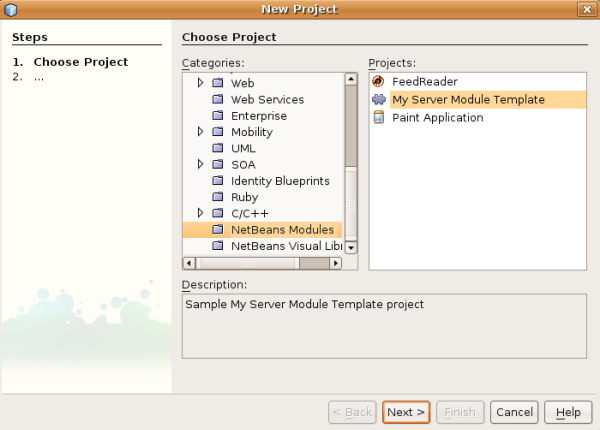
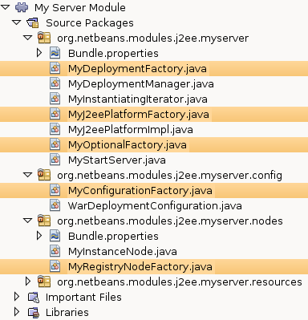
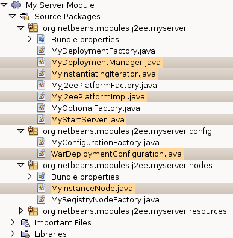

// 
//     Licensed to the Apache Software Foundation (ASF) under one
//     or more contributor license agreements.  See the NOTICE file
//     distributed with this work for additional information
//     regarding copyright ownership.  The ASF licenses this file
//     to you under the Apache License, Version 2.0 (the
//     "License"); you may not use this file except in compliance
//     with the License.  You may obtain a copy of the License at
// 
//       http://www.apache.org/licenses/LICENSE-2.0
// 
//     Unless required by applicable law or agreed to in writing,
//     software distributed under the License is distributed on an
//     "AS IS" BASIS, WITHOUT WARRANTIES OR CONDITIONS OF ANY
//     KIND, either express or implied.  See the License for the
//     specific language governing permissions and limitations
//     under the License.
//

= NetBeans Server-Skeleton Module Tutorial
:jbake-type: platform_tutorial
:jbake-tags: tutorials 
:jbake-status: published
:syntax: true
:source-highlighter: pygments
:toc: left
:toc-title:
:icons: font
:experimental:
:description: NetBeans Server-Skeleton Module Tutorial - Apache NetBeans
:keywords: Apache NetBeans Platform, Platform Tutorials, NetBeans Server-Skeleton Module Tutorial

This tutorial is intended to ease the _initial_ phase of developing NetBeans modules that provide support for web deployment servers, such as the Tomcat Web Server or the Sun Java System Application Server. It provides the code for a skeleton server module, together with a detailed procedure for creating it from scratch and a full description of each of its parts.

Since this is "just" a _skeleton_ module, server-specific features that relate to starting and stopping, deploying, undeploying, and property customization are not covered here. However, after you create and install the skeleton server module, you will have enough functionality to be able to register a new deployment server in the Server Manager and assign it to an application via the New Project wizard and the Project Properties dialog box. And, you will have a working framework on top of which you can build your own server module for the NetBeans IDE.

The following topics are covered below:

* <<gettingtoknowthesample,Getting to Know the Sample>>

* <<installing,Installing the Software>>
* <<installing-sample,Installing the Sample>>
* <<introducing-sample,Introducing the Sample>>
* <<introducing-sources,Introducing the Sources>>
* <<settingupthemoduleproject,Setting Up the module Project>>

* <<creatingthemoduleproject,Creating the module Project>>
* <<specifying,Specifying the module's Dependencies>>
* <<creatingandgettingtoknowthemainfiles,Creating the Factory Classes>>

* <<MyDeploymentFactory, ``MyDeploymentFactory.java`` >>
* <<MyJ2eePlatformFactory, ``MyJ2eePlatformFactory.java`` >>
* <<MyOptionalFactory, ``MyOptionalFactory.java`` >>
* <<MyConfigurationFactory, ``MyConfigurationFactory.java`` >>
* <<MyRegistryNodeFactory, ``MyRegistryNodeFactory.java`` >>
* <<creatingandgettingtoknowtheimplementationfiles,Creating the Implementation Classes>>

* <<MyDeploymentManager, ``MyDeploymentManager.java`` >>
* <<MyInstantiatingIterator, ``MyInstantiatingIterator.java`` >>
* <<MyJ2eePlatformImpl, ``MyJ2eePlatformImpl.java`` >>
* <<MyStartServer, ``MyStartServer.java`` >>
* <<WarDeploymentConfiguration, ``WarDeploymentConfiguration.java`` >>
* <<MyInstanceNode, ``MyInstanceNode.java`` >>
* <<finetuning,Setting Up the Supporting Resources>>
* <<building,Building and Installing the Module>>

For more information on working with NetBeans modules, see the  link:https://netbeans.apache.org/kb/docs/platform.html[ NetBeans Module and Rich-Client Application tutorials page] on the NetBeans website. If you have questions, visit the  link:http://wiki.netbeans.org/wiki/view/NetBeansDeveloperFAQ[ NetBeans Developer FAQ] or use the feedback link at the top of this page.

== Getting to Know the Sample

Before you start writing the module, you have to make sure you have all of the necessary software. In addition, you might want to play with the sample before building it yourself. Getting to know the sample lets you know what you are in for during the rest of this tutorial!

=== Installing the Software

Before you begin, you need to install the following software on your computer:

* The J2SE(TM) Development Kit (JDK), version 5.0 or compatible ( link:https://www.oracle.com/technetwork/java/javase/downloads/index.html[download the most recent JDK]).
* NetBeans IDE 6.0 ( link:https://netbeans.apache.org/download/index.html[download]).

=== Installing the Sample

Take the following steps to install the sample:

[start=1]
1. Download the Server Plugin Template from the Plugin Portal:

link:http://plugins.netbeans.org/PluginPortal/faces/PluginDetailPage.jsp?pluginid=5274[http://plugins.netbeans.org/PluginPortal/faces/PluginDetailPage.jsp?pluginid=5274].

[start=2]
1. In the IDE, choose File > New Project and look in the Samples | NetBeans Modules category. You should see the "My Server Module Template" there:

[start=3]
1. Complete the wizard. You should now see the following module project structure in the Projects window:

image::images/myserver_60-projects-window.png[]

[start=4]
1. In the Projects window, right-click the "My Server Module" project node and choose Install/Reload in Target Platform. The target instance of the IDE opens and the module is installed. Alternatively, if you want to install the module in the current instance of the IDE, choose Install/Reload in Development IDE instead.

The module is now installed. In the next section, we look at the features provided by the server skeleton.

=== Introducing the Sample

In this section, we explore the features provided by the server skeleton plugin. You will see what the framework provides and, in the process, what you will need to add to turn the skeleton into a full server plugin.

[start=1]
1. Choose Tools > Servers, click Add Server, and notice that a new server is available:

image::images/myserver_60-choose-server.png[]

[start=2]
1. Select "My Server" and type a name, such as "Test Server", in the Name field:

image::images/myserver_60-add-server-instance2.png[]

[start=3]
1. Click Next. The basis of an installation form implementation is displayed:

image::images/myserver_60-add-server-instance.png[]

See <<MyInstantiatingIterator, ``MyInstantiatingIterator.java`` >> for related code details.

[start=4]
1. Click Finish. A new node appears in the Servers list and the basis of a customizer implementation is displayed in the main part of the panel:

image::images/myserver_60-add-server-instance3.png[]

See <<MyInstanceNode, ``MyInstanceNode.java`` >> for related code details.

[start=5]
1. Click Close. Open the Services window (Ctrl-5) and notice the new "Test Server" node under the Servers node. When you right-click the node, the basis of your menu implementation is displayed:

image::images/myserver_60-runtime-window.png[]

Even though the skeleton server cannot be started, you can assign it as a target server to an application, as shown in the next step.

[start=6]
1. Assign the server as an application's target server, either while creating the web application or afterwards, while customizing it:

* Choose File > New Project (Ctrl-Shift-N). Under Categories, select Web and under Projects select Web Application. Click Next. In the Name and Location panel, notice that the Server drop-down includes the new server instance:

image::images/myserver_60-name-and-location-panel.png[]

* Right-click an existing web application and choose Properties. The Project Properties dialog box opens. In the Run panel, notice that the Server drop-down includes the new server type:

image::images/myserver_60-run-panel.png[]

Now that you know exactly what functionality the skeleton server provides, let's look at the skeleton server's sources!

=== Introducing the Sources

The sample consists of factory classes, implementation classes, and supporting files.

Below, each are introduced in turn:

* *Factory Classes.* The module uses the Factory pattern to instantiate the implementation classes. The module's factories are highlighted in the illustration below:

The factories are introduced in alphabetical order:

|===
|*File* |*Description* 

| ``<<MyDeploymentFactory,MyDeploymentFactory.java>>``  |An implementation of the  `` link:https://docs.oracle.com/javaee/1.4/api/javax/enterprise/deploy/spi/factories/DeploymentFactory.html[DeploymentFactory]``  interface, which produces instances of  `` link:https://docs.oracle.com/javaee/1.4/api/javax/enterprise/deploy/spi/DeploymentManager.html[DeploymentManager]``  interface implementations, such as <<MyDeploymentManager, ``MyDeploymentManager`` >>. 

| ``<<MyJ2eePlatformFactory,MyJ2eePlatformFactory.java>>``  |An implementation of the  `` link:https://bits.netbeans.org/dev/javadoc/org-netbeans-modules-j2eeserver/org/netbeans/modules/j2ee/deployment/plugins/api/J2eePlatformFactory.html[J2eePlatformFactory]``  abstract class, which produces instances of  `` link:https://bits.netbeans.org/dev/javadocorg-netbeans-modules-j2eeserver/org/netbeans/modules/j2ee/deployment/plugins/api/J2eePlatformImpl.html[J2eePlatformImpl]``  abstract class implementations, such as <<MyJ2eePlatformImpl, ``MyJ2eePlatformImpl`` >>. 

| ``<<MyOptionalFactory,MyOptionalFactory.java>>``  |An implementation of the  `` link:https://bits.netbeans.org/dev/javadoc/org-netbeans-modules-j2eeserver/org/netbeans/modules/j2ee/deployment/plugins/api/OptionalDeploymentManagerFactory.html[OptionalDeploymentManagerFactory]``  abstract class. Although its name implies that it is _optional_, it isn't. You need to at least implement its methods for starting, stopping, and registering the server in the IDE. Therefore, the  ``<<MyOptionalFactory,MyOptionalFactory>>``  class produces instances of the <<MyStartServer, ``MyStartServer`` >> and <<MyInstantiatingIterator, ``MyInstantiatingIterator`` >> implementation classes. 

| ``<<MyConfigurationFactory,MyConfigurationFactory.java>>``  |An implementation of the  ``ModuleConfigurationFactory``  class, which returns deployment-specific instances. For example, here the <<WarDeploymentConfiguration, ``WarDeploymentConfiguration`` >> class is returned, with a specific configuration for the creation and deployment of a WAR archive. 

| ``<<MyRegistryNodeFactory,MyRegistryNodeFactory.java>>``  |An implementation of the  `` link:https://bits.netbeans.org/dev/javadoc/org-netbeans-modules-j2eeserver/org/netbeans/modules/j2ee/deployment/plugins/api/RegistryNodeFactory.html[RegistryNodeFactory]``  interface. The purpose of this factory is to produce one or more registry nodes, which in this case is <<MyInstanceNode, ``MyInstanceNode`` >>, as user interface representations in the Services window. 
|===
* 
*Implementation Classes.* The implementation classes are instantiated by the factories. The module's implementation classes are highlighted in the illustration below:

The implementation classes are introduced in alphabetical order:

|===
|*File* |*Description* 

|<<MyDeploymentManager, ``MyDeploymentManager.java`` >> |A dummy implementation of the  `` link:https://docs.oracle.com/javaee/1.4/api/javax/enterprise/deploy/spi/DeploymentManager.html[DeploymentManager]``  interface, which does nothing. It is up to you to provide the necessary server-specific implementation features. 

|<<MyInstantiatingIterator, ``MyInstantiatingIterator.java`` >> |Creates a wizard for the registration of new server type instances in the IDE. The current implementation lets the user specify the Display Name only; other properties are hardcoded in order to keep the implementation as simple as possible. 

|<<MyJ2eePlatformImpl, ``MyJ2eePlatformImpl.java`` >> |An implementation of  `` link:https://bits.netbeans.org/dev/javadoc/org-netbeans-modules-j2eeserver/org/netbeans/modules/j2ee/deployment/plugins/api/J2eePlatformImpl.html[J2eePlatformImpl]`` , which is used to describe the target environment that J2EE applications are built against and subsequently deployed to. It provides a set of server libraries, supported module types, and J2EE specification versions. 

|<<MyStartServer, ``MyStartServer.java`` >> |An implementation of the  `` link:https://bits.netbeans.org/dev/javadoc/org-netbeans-modules-j2eeserver/org/netbeans/modules/j2ee/deployment/plugins/api/StartServer.html[StartServer]``  abstract class. Its purpose is to provide ability to start, stop, and determine the state of the server. 

|<<WarDeploymentConfiguration, ``WarDeploymentConfiguration.java`` >> |An implementation of several classes which, together, configure deployment-specific instances. For example, here WAR deployment is handled. 

|<<MyInstanceNode, ``MyInstanceNode.java`` >> |Represents the new server in the Services window. The  ``j2eeserver``  module, however, adds to each node a set of default features, such as the capability to display the running status and a default set of menu items. 
|===
* 
*Supporting Resources.* The module's supporting resources are highlighted in the illustration below:

image::images/myserver_60-projects-window-supporting.png[]

The supporting resources in the Java packages are introduced in alphabetical order below:

|===
|*File* |*Description* 

| ``<<Bundle.properties,Bundle.properties>>``  |This is a standard Java properties file, which uses the syntax  ``Key=Value`` . Keys are code names for things that appear in the source code, with values designating those things which will be displayed to the user. This file is useful for localization. For example, by creating a properties file such as  ``Bundle_ja.properties`` , and filling all the values with Japanese, this module will automatically display everything in Japanese, if the user is running the IDE in Japanese mode. 

| ``<<layer.xml,layer.xml>>``  |Registers the new server type in the NetBeans filesystem. 

| ``<<nbdep.xml,nbdep.xml>>``  |Specifies the icon to be used in the Services window, the URL for obtaining the disconnected  ``DeploymentManager``  instance, the  ``container-limitation element``  that specifies what kind of deployments are supported, and the context path. 

| ``<<server.gif,server.gif>>``  |Icon for the new server type's node in the IDE. 
|===

For basic information each of the Important Files, see the  link:https://netbeans.org/kb/articles/quickstart-nbm.html[Introduction to NetBeans Module Development].

We have now looked at the features provided by the server skeleton and at each of the files that you need to create it from scratch. Let's now go through the whole process from start to finish, during which we will recreate the whole server skeleton. At the end, we will look at further resources worth exploring when building your own server implementation on top of the server skeleton.

== Setting Up the module Project

The first step in creating a server module is setting up your project in the IDE. The IDE provides a wizard that sets up the source structure and all the basic files needed when you start creating a module.

=== Creating the Module Project

[start=1]
1. Choose File > New Project. Under Categories, select NetBeans Modules. Under Projects, select Module Project. Click Next.

[start=2]
1. In the Name and Location panel, type  ``My Server Module``  in Project Name. Change the Project Location to any directory on your computer. Leave the Standalone Module radiobutton selected. If not selected, select the Set as Main Project checkbox. Click Next.

[start=3]
1. In the Basic Module Configuration panel, replace  ``org.yourorghere.myservermodule``  in Code Name Base with  ``org.netbeans.modules.j2ee.myservermodule`` . Leave  ``My Server Module``  as the Module Display Name. Change the location of the localizing bundle and XML layer, so that they will be stored in a package with the name  ``org.netbeans.modules.j2ee.myserver.resources`` . Click Finish.

The IDE creates the  ``My Server Module``  project. The project contains all of your sources and project metadata, such as the project's Ant build script. The project opens in the IDE. You can view its logical structure in the Projects window (Ctrl-1) and its file structure in the Files window (Ctrl-2).

For basic information on each of the files created by the New Project wizard, see the  link:https://netbeans.apache.org/tutorials/quickstart-nbm.html[Introduction to NetBeans Module Development].

=== Specifying the Module's Dependencies

You will need to subclass several classes that belong to NetBeans APIs. Each has to be declared as a module dependency. Use the Project Properties dialog box for this purpose, as shown below.

[start=1]
1. In the Projects window, right-click the  ``My Server Module``  project and choose Properties. In the Project Properties dialog box, click Libraries.

[start=2]
1. For each of the APIs displayed in the list below, click "Add..." in the Libraries panel, select the name from the Module list, and then click OK to confirm it:

image::images/myserver_60-libraries-panel.png[]

[start=3]
1. Click OK to exit the Project Properties dialog box.

[start=4]
1. In the Projects window, double-click Project Metadata and note that the APIs you selected have been declared as module dependencies.

== Creating the Factory Classes

The implementation classes are implemented by the factories. In this section, you will create and examine each of them:

* <<MyDeploymentFactory, ``MyDeploymentFactory.java`` >>
* <<MyJ2eePlatformFactory, ``MyJ2eePlatformFactory.java`` >>
* <<MyOptionalFactory, ``MyOptionalFactory.java`` >>
* <<MyConfigurationFactory, ``MyConfigurationFactory.java`` >>
* <<MyRegistryNodeFactory, ``MyRegistryNodeFactory.java`` >>

=== MyDeploymentFactory.java

The  ``MyDeploymentFactory``  class is an implementation of  `` link:https://docs.oracle.com/javaee/1.4/api/javax/enterprise/deploy/spi/factories/DeploymentFactory.html[DeploymentFactory]`` , which produces instances of the <<MyDeploymentManager, ``MyDeploymentManager`` >> implementation class.

The following are the interesting methods in this class:

*  `` link:https://docs.oracle.com/javaee/1.4/api/javax/enterprise/deploy/spi/factories/DeploymentFactory.html#handlesURI(java.lang.String)[handlesURI()].``  Determines whether the given  ``MyDeploymentFactory``  can handle the specifed URI.
*  `` link:https://docs.oracle.com/javaee/1.4/api/javax/enterprise/deploy/spi/factories/DeploymentFactory.html#getDeploymentManager(java.lang.String,%20java.lang.String,%20java.lang.String)[getDeploymentManager()].``  Creates a  ``connected``   ``DeploymentManager``  instance. This instance provides access to J2EE resources.
*  `` link:https://docs.oracle.com/javaee/1.4/api/javax/enterprise/deploy/spi/factories/DeploymentFactory.html#getDisconnectedDeploymentManager(java.lang.String)[getDisconnectedDeploymentManager()].``  Creates a  ``disconnected``   ``DeploymentManager``  instance. This instance provides access to configuration support.

Our new server instance will use the  ``deployer:myserver``  prefix so that the URL used to obtain a connected deployment manager looks like this:  ``deployer:myserver:localhost:8080`` .

Do the following to create the  ``MyDeploymentFactory``  class:

[start=1]
1. Right-click the  ``org.netbeans.modules.j2ee.myserver``  node and choose New > Other. Under Categories, choose Java Classes. Under File Types, choose Java Class. Click Next and type  ``MyDeploymentFactory``  in Class Name. Click Finish. The new Java class opens in the Source Editor.

[start=2]
1. Replace the default code with the code below:

[source,java]
----

package org.netbeans.modules.j2ee.myserver;

import javax.enterprise.deploy.shared.factories.DeploymentFactoryManager;
import javax.enterprise.deploy.spi.DeploymentManager;
import javax.enterprise.deploy.spi.exceptions.DeploymentManagerCreationException;
import javax.enterprise.deploy.spi.factories.DeploymentFactory;
import org.openide.ErrorManager;
import org.openide.util.NbBundle;

public class MyDeploymentFactory implements DeploymentFactory {
    
    public static final String URI_PREFIX = "deployer:myserver"; // NOI18N
    private static DeploymentFactory instance;
    
    public static synchronized DeploymentFactory create() {
        if (instance == null) {
            instance = new MyDeploymentFactory();
            DeploymentFactoryManager.getInstance().registerDeploymentFactory(instance);
        }
        return instance;
    }
    
    public boolean handlesURI(String uri) {
        return uri != null &amp;&amp; uri.startsWith(URI_PREFIX);
    }
    
    public DeploymentManager getDeploymentManager(String uri, String uname, String passwd) throws DeploymentManagerCreationException {
        if (!handlesURI(uri)) {
            throw new DeploymentManagerCreationException("Invalid URI:" + uri); // NOI18N
        }
        return new MyDeploymentManager();
    }
    
    public DeploymentManager getDisconnectedDeploymentManager(String uri) throws DeploymentManagerCreationException {
        if (!handlesURI(uri)) {
            throw new DeploymentManagerCreationException("Invalid URI:" + uri); // NOI18N
        }
        return new MyDeploymentManager();
    }
    
    public String getProductVersion() {
        return "0.1"; // NOI18N
    }
    
    public String getDisplayName() {
        return NbBundle.getMessage(MyDeploymentFactory.class, "TXT_DisplayName"); // NOI18N
    }
}
----

=== MyJ2eePlatformFactory.java

The  ``MyJ2eePlatformFactory``  class is an implementation of the  `` link:https://bits.netbeans.org/dev/javadoc/org-netbeans-modules-j2eeserver/org/netbeans/modules/j2ee/deployment/plugins/api/J2eePlatformFactory.html[J2eePlatformFactory]``  class. The implementation is very simple—it produces instances of the <<MyJ2eePlatformImpl, ``MyJ2eePlatformImpl`` >> class.

Do the following to create the  ``MyJ2eePlatformFactory``  class:

[start=1]
1. Right-click the  ``org.netbeans.modules.j2ee.myserver``  node, choose New > Java Class, and type  ``MyJ2eePlatformFactory``  in Class Name. Click Finish. The new Java class opens in the Source Editor.

[start=2]
1. Replace the default code with the code below:

[source,java]
----

package org.netbeans.modules.j2ee.myserver;

import javax.enterprise.deploy.spi.DeploymentManager;
import org.netbeans.modules.j2ee.deployment.plugins.spi.J2eePlatformFactory;
import org.netbeans.modules.j2ee.deployment.plugins.spi.J2eePlatformImpl;

public class MyJ2eePlatformFactory extends J2eePlatformFactory {    
    public J2eePlatformImpl getJ2eePlatformImpl(DeploymentManager dm) {
        return new MyJ2eePlatformImpl();
    }
}
----

=== MyOptionalFactory.java

The  ``MyOptionalFactory``  class is an implementation of  `` link:https://bits.netbeans.org/dev/javadoc/org-netbeans-modules-j2eeserver/org/netbeans/modules/j2ee/deployment/plugins/api/OptionalDeploymentManagerFactory.html[OptionalDeploymentManagerFactory]`` . Despite its name, this factory class is _not_ optional. At least two methods need to be implemented:

*  `` link:https://bits.netbeans.org/dev/javadoc/org-netbeans-modules-j2eeserver/org/netbeans/modules/j2ee/deployment/plugins/api/OptionalDeploymentManagerFactory.html#getStartServer(javax.enterprise.deploy.spi.DeploymentManager)[getStartServer()].``  Starts and stops the server.
*  `` link:https://bits.netbeans.org/dev/javadoc/org-netbeans-modules-j2eeserver/org/netbeans/modules/j2ee/deployment/plugins/api/OptionalDeploymentManagerFactory.html#getAddInstanceIterator()[getAddInstanceIterator()].``  Creates the wizard for registering the server in the IDE.

The other two methods are not implemented here:

*  `` link:https://bits.netbeans.org/dev/javadoc/org-netbeans-modules-j2eeserver/org/netbeans/modules/j2ee/deployment/plugins/api/OptionalDeploymentManagerFactory.html#getIncrementalDeployment(javax.enterprise.deploy.spi.DeploymentManager)[getIncrementalDeployment()].``  Creates  ``IncrementalDeployment`` , which offers an alternative way, which is more convenient for development..
*  `` link:https://bits.netbeans.org/dev/javadoc/org-netbeans-modules-j2eeserver/org/netbeans/modules/j2ee/deployment/plugins/api/OptionalDeploymentManagerFactory.html#getFindJSPServlet(javax.enterprise.deploy.spi.DeploymentManager)[getFindJSPServlet()].``  Creates  ``FindJSPServlet`` , which lets modules specify the location of servlets generated for JSPs.

Do the following to create the MyOptionalFactory class:

[start=1]
1. Right-click the  ``org.netbeans.modules.j2ee.myserver``  node, choose New > Java Class, and type  ``MyOptionalFactory``  in Class Name. Click Finish. The new Java class opens in the Source Editor.

[start=2]
1. Replace the default code with the code below:

[source,java]
----

package org.netbeans.modules.j2ee.myserver;

import javax.enterprise.deploy.spi.DeploymentManager;
import org.netbeans.modules.j2ee.deployment.plugins.spi.FindJSPServlet;
import org.netbeans.modules.j2ee.deployment.plugins.spi.IncrementalDeployment;
import org.netbeans.modules.j2ee.deployment.plugins.spi.OptionalDeploymentManagerFactory;
import org.netbeans.modules.j2ee.deployment.plugins.spi.StartServer;
import org.openide.WizardDescriptor.InstantiatingIterator;

public class MyOptionalFactory extends OptionalDeploymentManagerFactory {
    
    public StartServer getStartServer(DeploymentManager dm) {
        return new MyStartServer();
    }

    public IncrementalDeployment getIncrementalDeployment(DeploymentManager dm) {
        return null;
    }

    public FindJSPServlet getFindJSPServlet(DeploymentManager dm) {
        return null;
    }

    public InstantiatingIterator getAddInstanceIterator() {
        return new MyInstantiatingIterator();
    }
    
}
----

=== MyConfigurationFactory.java

The  ``MyConfigurationFactory``  class is an implementation of the  `` link:https://bits.netbeans.org/dev/javadoc/org-netbeans-modules-j2eeserver/org/netbeans/modules/j2ee/deployment/plugins/spi/config/ModuleConfigurationFactory.html[ModuleConfigurationFactory]``  class. The implementation is very simple—it produces instances of the <<WarDeploymentConfiguration, ``WarDeploymentConfiguration`` >> class.

Do the following to create the  ``MyConfigurationFactory``  class:

[start=1]
1. Right-click the  ``org.netbeans.modules.j2ee.myserver``  node, choose New > Java Class, and type  ``MyConfigurationFactory``  in Class Name. In the Package field, specify that the class should be created in a new package called  ``org.netbeans.modules.j2ee.myserver.config`` . Click Finish. The new Java class opens in the Source Editor.

[start=2]
1. Replace the default code with the code below:

[source,java]
----

package org.netbeans.modules.j2ee.myserver.config;

import org.netbeans.modules.j2ee.deployment.common.api.ConfigurationException;
import org.netbeans.modules.j2ee.deployment.devmodules.api.J2eeModule;
import org.netbeans.modules.j2ee.deployment.plugins.spi.config.ModuleConfiguration;
import org.netbeans.modules.j2ee.deployment.plugins.spi.config.ModuleConfigurationFactory;

public class MyConfigurationFactory implements ModuleConfigurationFactory {
    
    public ModuleConfiguration create(J2eeModule j2eeModule) throws ConfigurationException {
        if (J2eeModule.WAR == j2eeModule.getModuleType()) {
            return new WarDeploymentConfiguration(j2eeModule);
        }
        // TODO implement config for EAR and EJB, if supported:
        return null;
    }

}
----

=== MyRegistryNodeFactory.java

The  ``MyRegistryNodeFactory``  class is an implementation of  `` link:https://bits.netbeans.org/dev/javadoc/org-netbeans-modules-j2eeserver/org/netbeans/modules/j2ee/deployment/plugins/api/RegistryNodeFactory.html[RegistryNodeFactory]`` . The purpose of this factory is to produce server and target nodes, which are used as user interface representations in the Services window. Since the new server type only has one target and its Admin Server is therefore also a target server, you do not need to implement the target node.

[start=1]
1. Right-click the  ``org.netbeans.modules.j2ee.myserver``  node, choose New > Java Class, and type  ``MyRegistryNodeFactory``  in Class Name. Click Finish. The new Java class opens in the Source Editor.

[start=2]
1. Replace the default code with the code below:

[source,java]
----

package org.netbeans.modules.j2ee.myserver.nodes;

import org.netbeans.modules.j2ee.deployment.plugins.api.RegistryNodeFactory;
import org.openide.nodes.Children;
import org.openide.nodes.Node;
import org.openide.util.Lookup;

public class MyRegistryNodeFactory implements RegistryNodeFactory {
    
    public Node getTargetNode(Lookup lookup) {
        return null;
    }
    
    public Node getManagerNode(Lookup lookup) {
        return new MyInstanceNode(lookup);
    }    
}
----

== Creating the Implementation Classes

The implementation classes are implemented by the factories. In this section, you will create and examine each of them:

* <<MyDeploymentManager, ``MyDeploymentManager.java`` >>
* <<MyInstantiatingIterator, ``MyInstantiatingIterator.java`` >>
* <<MyJ2eePlatformImpl, ``MyJ2eePlatformImpl.java`` >>
* <<MyStartServer, ``MyStartServer.java`` >>
* <<WarDeploymentConfiguration, ``WarDeploymentConfiguration.java`` >>
* <<MyInstanceNode, ``MyInstanceNode.java`` >>

=== MyDeploymentManager.java

A dummy implementation of the  `` link:https://docs.oracle.com/javaee/1.4/api/javax/enterprise/deploy/spi/DeploymentManager.html[DeploymentManager]``  interface, which does nothing. It is up to you to provide the various server-specific implementation features.

[start=1]
1. Right-click the  ``org.netbeans.modules.j2ee.myserver``  node and choose New > Other. Under Categories, choose Java Classes. Under File Types, choose Java Class. Click Next and type  ``MyDeploymentManager``  in Class Name. Click Finish. The new Java class opens in the Source Editor.

[start=2]
1. Replace the default code with the code below:

[source,java]
----

package org.netbeans.modules.j2ee.myserver;

import java.io.File;
import java.io.InputStream;
import java.util.Locale;
import javax.enterprise.deploy.model.DeployableObject;
import javax.enterprise.deploy.shared.DConfigBeanVersionType;
import javax.enterprise.deploy.shared.ModuleType;
import javax.enterprise.deploy.spi.DeploymentConfiguration;
import javax.enterprise.deploy.spi.DeploymentManager;
import javax.enterprise.deploy.spi.Target;
import javax.enterprise.deploy.spi.TargetModuleID;
import javax.enterprise.deploy.spi.exceptions.DConfigBeanVersionUnsupportedException;
import javax.enterprise.deploy.spi.exceptions.InvalidModuleException;
import javax.enterprise.deploy.spi.exceptions.TargetException;
import javax.enterprise.deploy.spi.status.ProgressObject;

public class MyDeploymentManager implements DeploymentManager {

    public ProgressObject distribute(Target[] target, File file, File file2) 
            throws IllegalStateException {
        return null;
    }

    public DeploymentConfiguration createConfiguration(DeployableObject deployableObject) 
            throws InvalidModuleException {
        return null;
    }

    public ProgressObject redeploy(TargetModuleID[] targetModuleID, InputStream 
            inputStream, InputStream inputStream2) 
            throws UnsupportedOperationException, IllegalStateException {
        return null;
    }

    public ProgressObject distribute(Target[] target, InputStream inputStream, 
            InputStream inputStream2) throws IllegalStateException {
        return null;
    }

    public ProgressObject distribute(Target[] target, ModuleType type, 
            InputStream inputStream, InputStream inputStream2) 
            throws IllegalStateException {
        return null;
    }

    public ProgressObject undeploy(TargetModuleID[] targetModuleID) 
            throws IllegalStateException {
        return null;
    }

    public ProgressObject stop(TargetModuleID[] targetModuleID) 
            throws IllegalStateException {
        return null;
    }

    public ProgressObject start(TargetModuleID[] targetModuleID) 
            throws IllegalStateException {
        return null;
    }

    public Target[] getTargets() throws IllegalStateException {
        return null;
    }

    public void release() {
    }

    public boolean isRedeploySupported() {
        return false;
    }

    public TargetModuleID[] getAvailableModules(ModuleType moduleType, 
            Target[] target) throws TargetException, IllegalStateException {
        return null;
    }

    public TargetModuleID[] getNonRunningModules(ModuleType moduleType, 
            Target[] target) throws TargetException, IllegalStateException {
        return null;
    }

    public TargetModuleID[] getRunningModules(ModuleType moduleType, 
            Target[] target) throws TargetException, IllegalStateException {
        return null;
    }

    public ProgressObject redeploy(TargetModuleID[] targetModuleID, 
            File file, File file2) throws UnsupportedOperationException, IllegalStateException {
        return null;
    }

    public void setLocale(Locale locale) throws UnsupportedOperationException {
        throw new UnsupportedOperationException(
                "This method should never be called! No need to implement this."); // NOI18N
    }

    public boolean isLocaleSupported(Locale locale) {
        throw new UnsupportedOperationException(
                "This method should never be called! No need to implement this."); // NOI18N
    }

    public void setDConfigBeanVersion(DConfigBeanVersionType dConfigBeanVersionType) 
            throws DConfigBeanVersionUnsupportedException {
        throw new UnsupportedOperationException(
                "This method should never be called! No need to implement this."); // NOI18N
    }

    public boolean isDConfigBeanVersionSupported(DConfigBeanVersionType dConfigBeanVersionType) {
        throw new UnsupportedOperationException(
                "This method should never be called! No need to implement this."); // NOI18N
    }

    public Locale getCurrentLocale() {
        throw new UnsupportedOperationException(
                "This method should never be called! No need to implement this."); // NOI18N
    }

    public DConfigBeanVersionType getDConfigBeanVersion() {
        throw new UnsupportedOperationException(
                "This method should never be called! No need to implement this."); // NOI18N
    }

    public Locale getDefaultLocale() {
        throw new UnsupportedOperationException(
                "This method should never be called! No need to implement this."); // NOI18N
    }

    public Locale[] getSupportedLocales() {
        throw new UnsupportedOperationException(
                "This method should never be called! No need to implement this."); // NOI18N
    }

}
----

=== MyInstantiatingIterator.java

The  ``MyInstantiatingIterator``  class is used to create a wizard for registration of the new server in the IDE. The implementation described below lets you specify the display name only. Here, all the other properties are hard coded to keep the implementation as simple as possible.

Notice the URL variable used in the  ``instantiate()``  method. It is passed to the  ``InstanceProperties.createInstanceProperties()``  method, which does the actual server registration. The URL parameter is the same as the one used by the  ``DeploymenManager`` . This way we ensure that our server controls the newly created server instance.

[start=1]
1. Right-click the  ``org.netbeans.modules.j2ee.myserver``  node, choose New > Java Class, and type  ``MyInstantiatingIterator``  in Class Name. Click Finish. The new Java class opens in the Source Editor.

[start=2]
1. Replace the default code with the code below:

[source,java]
----

package org.netbeans.modules.j2ee.myserver;

import java.awt.Component;
import java.awt.Label;
import java.io.IOException;
import java.util.HashSet;
import java.util.Set;
import javax.swing.JPanel;
import javax.swing.event.ChangeListener;
import org.openide.WizardDescriptor;
import org.openide.WizardDescriptor.Panel;
import org.openide.util.HelpCtx;
import org.netbeans.modules.j2ee.deployment.plugins.api.InstanceProperties;
import org.openide.DialogDisplayer;
import org.openide.ErrorManager;
import org.openide.NotifyDescriptor;
import org.openide.util.NbBundle;

public class MyInstantiatingIterator implements WizardDescriptor.InstantiatingIterator {
    
    private final static String PROP_DISPLAY_NAME = "ServInstWizard_displayName"; // NOI18N

        
    private InstallPanel panel;
    private WizardDescriptor wizard;
    
    public void removeChangeListener(ChangeListener l) {
    }

    public void addChangeListener(ChangeListener l) {
    }

    public void uninitialize(WizardDescriptor wizard) {
    }

    public void initialize(WizardDescriptor wizard) {
        this.wizard = wizard;
    }

    public void previousPanel() {
    }

    public void nextPanel() {
    }

    public String name() {
        return NbBundle.getMessage(MyInstantiatingIterator.class, "MSG_InstallerName");
    }

    public Set instantiate() throws IOException {
           Set result = new HashSet();       
           String displayName = getDisplayName();
           String url         = "deployer:myserver:localhost:8080"; // NOI18N
           String username    = "username"; // NOI18N
           String password    = "password"; // NOI18N
           try {
               InstanceProperties ip = InstanceProperties.createInstanceProperties(
                       url, username, password, displayName);
               result.add(ip);
           } catch (Exception ex) {
               DialogDisplayer.getDefault().notify(new NotifyDescriptor.Message(
                        NbBundle.getMessage(MyInstantiatingIterator.class, "MSG_CreateFailed", displayName),
                        NotifyDescriptor.ERROR_MESSAGE));
           }
           return result;
    }

    public boolean hasPrevious() {
        return false;
    }

    public boolean hasNext() {
        return false;
    }

    public Panel current() {
        if (panel == null) {
            panel = new InstallPanel();
        }
        return panel;
    }
    
    private String getDisplayName() {
        return (String)wizard.getProperty(PROP_DISPLAY_NAME);
    }
    
    private static class InstallPanel implements WizardDescriptor.Panel {
        public void removeChangeListener(ChangeListener l) {
        }

        public void addChangeListener(ChangeListener l) {
        }

        public void storeSettings(Object settings) {
        }

        public void readSettings(Object settings) {
        }

        public boolean isValid() {
            return true;
        }

        public HelpCtx getHelp() {
            return HelpCtx.DEFAULT_HELP;
        }

        public Component getComponent() {
            JPanel panel = new JPanel();
            panel.add(new Label("< Put your installation form implementation here! >")); // NOI18N
            return panel;
        }
    }
}

----

=== MyJ2eePlatformImpl.java

The  ``MyJ2eePlatformImpl``  class is an implementation of  `` link:https://bits.netbeans.org/dev/javadoc/org-netbeans-modules-j2eeserver/org/netbeans/modules/j2ee/deployment/plugins/api/J2eePlatformImpl.html[J2eePlatformImpl]`` , which is used to describe the target environment that J2EE applications are built against and subsequently deployed to. It provides a set of server libraries, supported module types, and J2EE specification versions.

Note: Since the current implementation of  ``MyJ2eePlatformImpl.java``  does not provide the J2EE API libraries, your Web or EJB project will not compile, unless you provide those explicitly in the Libraries panel of the Project Properties dialog box.

[start=1]
1. Right-click the  ``org.netbeans.modules.j2ee.myserver``  node, choose New > Java Class, and type  ``MyJ2eePlatformImpl``  in Class Name. Click Finish. The new Java class opens in the Source Editor.

[start=2]
1. Replace the default code with the code below:

[source,java]
----

package org.netbeans.modules.j2ee.myserver;

import java.io.File;
import java.util.HashSet;
import java.util.Set;
import org.netbeans.api.java.platform.JavaPlatform;
import org.netbeans.api.java.platform.JavaPlatformManager;
import org.netbeans.modules.j2ee.deployment.devmodules.api.J2eeModule;
import org.netbeans.modules.j2ee.deployment.plugins.spi.J2eePlatformImpl;
import org.netbeans.spi.project.libraries.LibraryImplementation;

import org.openide.util.NbBundle;
import org.openide.util.Utilities;

public class MyJ2eePlatformImpl extends J2eePlatformImpl {
        
    public boolean isToolSupported(String toolName) {
        return false;
    }

    public File[] getToolClasspathEntries(String toolName) {
        return new File[0];
    }

    public Set getSupportedSpecVersions() {
        Set result = new HashSet();
        result.add(J2eeModule.J2EE_14);
        //result.add(J2eeModule.JAVA_EE_5);
        return result;
    }

    public java.util.Set getSupportedModuleTypes() {
        Set result = new HashSet();
        //result.add(J2eeModule.EAR);
        result.add(J2eeModule.WAR);
        //result.add(J2eeModule.EJB);
        return result;
    }

    public java.io.File[] getPlatformRoots() {
        return new File[0];
    }

    public LibraryImplementation[] getLibraries() {
        return new LibraryImplementation[0];
    }

    public java.awt.Image getIcon() {
        return Utilities.loadImage("org/netbeans/modules/j2ee/myserver/resources/server.gif"); // NOI18N

    }

    public String getDisplayName() {
        return NbBundle.getMessage(MyJ2eePlatformImpl.class, "MSG_MyServerPlatform");
    }
    
    public Set getSupportedJavaPlatformVersions() {
        Set versions = new HashSet();
        versions.add("1.4"); // NOI18N
        versions.add("1.5"); // NOI18N
        return versions;
    }
    
    public JavaPlatform getJavaPlatform() {
        return JavaPlatformManager.getDefault().getDefaultPlatform();
    }
    
}
----

=== MyStartServer.java

The  ``MyStartServer``  class is an implementation of the  `` link:https://bits.netbeans.org/dev/javadoc/org-netbeans-modules-j2eeserver/org/netbeans/modules/j2ee/deployment/plugins/api/StartServer.html[StartServer]``  interface. Its purpose is to provide ability to start, stop, and determine the state of the server. The current implementation says that the server is always stopped and it cannot be started. The server-specific implementation is left up to you to complete for the server in question.

[start=1]
1. Right-click the  ``org.netbeans.modules.j2ee.myserver``  node, choose New > Java Class, and type  ``MyStartServer``  in Class Name. Click Finish. The new Java class opens in the Source Editor.

[start=2]
1. Replace the default code with the code below:

[source,java]
----

package org.netbeans.modules.j2ee.myserver;

import javax.enterprise.deploy.spi.Target;
import javax.enterprise.deploy.spi.status.ProgressObject;
import org.netbeans.modules.j2ee.deployment.plugins.api.ServerDebugInfo;
import org.netbeans.modules.j2ee.deployment.plugins.spi.StartServer;

public class MyStartServer extends StartServer {
    
    public ProgressObject [java-layer-method]#startDebugging(Target target) {
        return null;
    }

    public boolean [java-layer-method]#isDebuggable(Target target) {
        return false;
    }

    public boolean [java-layer-method]#isAlsoTargetServer(Target target) {
        return true;
    }

    public ServerDebugInfo [java-layer-method]#getDebugInfo(Target target) {
        return null;
    }

    public boolean [java-layer-method]#supportsStartDeploymentManager() {
        return false;
    }

    public ProgressObject [java-layer-method]#stopDeploymentManager() {
        return null;
    }

    public ProgressObject [java-layer-method]#startDeploymentManager() {
        return null;
    }

    public boolean [java-layer-method]#needsStartForTargetList() {
        return false;
    }

    public boolean [java-layer-method]#needsStartForConfigure() {
        return false;
    }

    public boolean [java-layer-method]#needsStartForAdminConfig() {
        return false;
    }

    public boolean [java-layer-method]#isRunning() {
        return false;
    }
}###########
----

=== WarDeploymentConfiguration.java

The  ``WarDeploymentConfiguration``  class is an implementation of several classes that provide specific deployment functionality for a particular configuration. Here, the configuration in question is WAR deployment. Alternatively, deployment could be in the form of an EJB or EAR archive. In each case, you would need to implement a class similar to the one below.

[start=1]
1. Right-click the  ``org.netbeans.modules.j2ee.myserver.config``  node, choose New > Java Class, and type  ``WarDeploymentConfiguration``  in Class Name. Click Finish. The new Java class opens in the Source Editor.

[start=2]
1. Replace the default code with the code below:

[source,java]
----

package org.netbeans.modules.j2ee.myserver.config;

import java.io.OutputStream;
import org.netbeans.modules.j2ee.deployment.common.api.ConfigurationException;
import org.netbeans.modules.j2ee.deployment.devmodules.api.J2eeModule;
import org.netbeans.modules.j2ee.deployment.plugins.spi.config.ContextRootConfiguration;
import org.netbeans.modules.j2ee.deployment.plugins.spi.config.DeploymentPlanConfiguration;
import org.netbeans.modules.j2ee.deployment.plugins.spi.config.ModuleConfiguration;
import org.openide.util.Lookup;
import org.openide.util.lookup.Lookups;

public class WarDeploymentConfiguration implements ModuleConfiguration, 
        ContextRootConfiguration, DeploymentPlanConfiguration {

    private final J2eeModule module;

    public WarDeploymentConfiguration(J2eeModule module) {
        this.module = module;
        // TODO server specific deployment descriptor 
        //should be created (if neccessary) and loaded
    }

    public J2eeModule getJ2eeModule() {
        return module;
    }

    public Lookup getLookup() {
        return Lookups.fixed(new Object[] {this});
    }

    public void dispose() {

    }

    public String getContextRoot() throws ConfigurationException {
        // TODO implement reading of the context root
        return "/mypath"; // NOI18N
    }

    public void setContextRoot(String arg0) throws ConfigurationException {
        // TODO implement storing of the context root
    }

    public void save(OutputStream os) throws ConfigurationException {
        // TODO implement storing of the deployment plan
    }

}
----

=== MyInstanceNode.java

The  ``MyInstanceNode``  class represents instances of the new server type as a node in the Services window. A default set of features is added to the node—these features display the server's status and provide default menu items such as  ``Start`` ,  ``Refresh`` , and  ``Remove`` . This is done by a standard filter node that exists on top of the node provided by the module. The  ``MyInstanceNode``  class defines a dummy customizer implementation which is displayed in the Tools menu's Server Manager.

[start=1]
1. Right-click the  ``org.netbeans.modules.j2ee.myserver.nodes``  node, choose New > Java Class, and type  ``MyInstanceNode``  in Class Name. Click Finish. The new Java class opens in the Source Editor.

[start=2]
1. Replace the default code with the code below:

[source,java]
----

package org.netbeans.modules.j2ee.myserver.nodes;

import java.awt.Component;
import java.awt.Label;
import javax.swing.JPanel;
import org.openide.nodes.AbstractNode;
import org.openide.nodes.Children;
import org.openide.nodes.Node;
import org.openide.util.Lookup;
import org.openide.util.NbBundle;

public class MyInstanceNode extends AbstractNode implements Node.Cookie {
    
    private static String ICON_BASE = "org/netbeans/modules/j2ee/myserver/resources/server.gif"; [java-block-comment]#// NOI18N
    
    public MyInstanceNode(Lookup lookup) {
        super(new Children.Array());
        getCookieSet().add(this);
        setIconBaseWithExtension(ICON_BASE);
    }
    
    public String getDisplayName() {
        return NbBundle.getMessage(MyInstanceNode.class, "TXT_MyInstanceNode");
    }
    
    public String getShortDescription() {
        return "http://localhost:8080"; // NOI18N
    }
    
    public javax.swing.Action[] getActions(boolean context) {
        return new javax.swing.Action[]{};
    }
    
    public boolean hasCustomizer() {
        return true;
    }
    
    public Component getCustomizer() {
        JPanel panel = new JPanel();
        panel.add(new Label("< Put your customizer implementation here! >")); [java-block-comment]#// NOI18N
        return panel;
    }
}##
----

== Setting Up the Supporting Files

Once you have coded the main files, you must register your module in the  ``layer.xml``  file and in the  ``nbdep.xml``  file. You must also define labels and texts you want to display to the user, using the  ``Bundle.properties``  files.

=== Registering the New Server in the NetBeans Filesystem

Registration involves two XML files: firstly, the layer XML file that all NetBeans modules use to register their features to the NetBeans Platform; secondly, a small XML file that all deployment servers need to specify their functionality to the server infrastructure.

[start=1]
1. Add the following entry between the  ``<filesystem>``  tags in the  ``layer.xml``  file:

[source,xml]
----

<folder name="J2EE">
    <folder name="DeploymentPlugins">
        <folder name="MyServer">

            <file name="Descriptor" url="nbdep.xml"/>

            <file name="Factory.instance">
                <attr name="instanceCreate" methodvalue="org.netbeans.modules.j2ee.myserver.MyDeploymentFactory.create"/>
                <attr name="instanceClass" stringvalue="org.netbeans.modules.j2ee.myserver.MyDeploymentFactory"/>
                <attr name="instanceOf" stringvalue="javax.enterprise.deploy.spi.factories.DeploymentFactory"/>
            </file>

            <file name="RegistryNodeFactory.instance">
                <attr name="instanceClass" stringvalue="org.netbeans.modules.j2ee.myserver.nodes.MyRegistryNodeFactory"/>
                <attr name="instanceOf" stringvalue="org.netbeans.modules.j2ee.deployment.plugins.spi.RegistryNodeFactory"/>
            </file>

            <file name="J2eePlatformFactory.instance">
                <attr name="instanceCreate" newvalue="org.netbeans.modules.j2ee.myserver.MyJ2eePlatformFactory"/>
                <attr name="instanceClass" stringvalue="org.netbeans.modules.j2ee.myserver.MyJ2eePlatformFactory"/>
                <attr name="instanceOf" stringvalue="org.netbeans.modules.j2ee.deployment.plugins.spi.J2eePlatformFactory"/>
            </file>

            <file name="OptionalFactory.instance">
                <attr name="instanceCreate" newvalue="org.netbeans.modules.j2ee.myserver.MyOptionalFactory"/>
                <attr name="instanceClass" stringvalue="org.netbeans.modules.j2ee.myserver.MyOptionalFactory"/>
                <attr name="instanceOf" stringvalue="org.netbeans.modules.j2ee.deployment.plugins.spi.OptionalDeploymentManagerFactory"/>
            </file>

            <file name="ModuleConfigurationFactory.instance">
                <attr name="instanceClass" stringvalue="org.netbeans.modules.j2ee.myserver.config.MyConfigurationFactory"/>
                <attr name="instanceOf" stringvalue="org.netbeans.modules.j2ee.deployment.plugins.spi.config.ModuleConfigurationFactory"/>
            </file>

            <folder name="DeploymentFileNames">
                <folder name="WAR">
                    <file name="WEB-INF\myserver-web.xml"/>
                </folder>
            </folder>

        </folder>

    </folder>

</folder>
----

[start=2]
1. Right-click  ``org.netbeans.modules.j2ee.myserver.resources``  and choose New > Other. Under categories, select XML. Under File Types, select XML Document. Click Next. Type  ``nbdep``  in File Name, click Next and then click Finish. Replace the content of  ``nbdep.xml``  with the following code:

[source,xml]
----

    <netbeans-deployment>
   
        <!--
        The icon element contains a path to the icon to be used to present the server
        in the server registry.
        -->
        <icon>org/netbeans/modules/j2ee/myserver/resources/server</icon>
   
        <!--
        The disconnected-string element contains the String parameter to DeploymentFactory.getDisconnectedDeploymentManager()
        -->
        <disconnected-string>deployer:myserver</disconnected-string>

        <!--
        The container-limitation element modifies a plugin to say that not all j2ee deployments are valid.
        For example, a web-only server would include
        <container-limitation> <war-deploy/> </container-limitation>
        to indicate that only war deployments are accepted.
        If a container-limitation element is not present, all j2ee deployments are assumed valid.
        If a container-limitation element is present, then only j2ee deployment types explicitly
        mentioned are allowed.
        -->
        <container-limitation>
          <war-deploy/>
        </container-limitation>

        <web-context-root>
          <xpath>/</xpath>
          <prop-name>contextRoot</prop-name>
        </web-context-root>
    
    </netbeans-deployment>
----

=== Localizing the module

The module is localized using  ``Bundle.properties``  files. A  ``Bundle.properties``  file provides language-specific strings for the user interface provided by other files in the package. When you used the New Project wizard to create the module, the IDE created a  ``Bundle.properties``  file in the  ``org.netbeans.modules.j2ee.myserver.resources``  package. Now you will add  ``key=value``  pairs to the IDE-generated  ``Bundle.properties``  file and create two additional  ``Bundle.properties``  files for the other packages.

[start=1]
1. In  ``org.netbeans.modules.j2ee.myserver.resources`` , add the following properties to the  ``Bundle.properties``  file:

[source,java]
----

OpenIDE-Module-Name=My Server Module
OpenIDE-Module-Display-Category=J2EE
OpenIDE-Module-Short-Description=My Server Module
OpenIDE-Module-Long-Description=My Server Module
----

[start=2]
1. Right-click  ``org.netbeans.modules.j2ee.myserver``  and choose New > Other. Under Categories, select Other. Under File Types, select Properties File. Click Next. Type  ``Bundle``  in File Name and then click Finish. Add the following properties to the  ``Bundle.properties``  file:

[source,java]
----

TXT_DisplayName=My Server
MSG_InstallerName=My Server Installer
MSG_CreateFailed=Cannot create {0} server instance.
MSG_MyServerPlatform=My Server Platform
----

[start=3]
1. Create another  ``Bundle.properties``  file in the  ``org.netbeans.modules.j2ee.myserver.nodes``  package, and add the following properties to it:

[source,java]
----

TXT_MyInstanceNode=My Server Instance
TXT_MyTargetNode=My Target Instance
----

=== Getting the Icon

Make sure that you have a 16x16 pixel icon named  ``server.gif``  in the  ``org.netbeans.modules.j2ee.myserver.resources``  package.

== Building and Installing the Module

The IDE uses an Ant build script to build and install your module. The build script is created for you when you create the module project.

=== Installing the Server-Skeleton Module

In the Projects window, right-click the  ``My Server Module``  project and choose Install/Reload in Target Platform.

The module is built and installed in the target IDE or Platform. The target IDE or Platform opens so that you can try out your new module. The default target IDE or Platform is the installation used by the current instance of the development IDE. Note that when you run your module, you will be using a temporary test user directory, not the development IDE's user directory.

=== Using the Server-Skeleton Module

Once you have installed your server plugin, use it as outlined below.

[start=1]
1. Choose Tools > Server Manager, click Add Server and notice that a new server is available:

image::images/myserver_60-choose-server.png[]

[start=2]
1. Use the module as described in <<introducing-sample,Introducing the Sample>>.

link:http://netbeans.apache.org/community/mailing-lists.html[Send Us Your Feedback]

== Versioning and Known Issues in this Tutorial

|===
|*Version* |*Date* |*Changes* 

|1 |25 June 2005 |Initial version 

|2 |4 July 2006 |Updated for NetBeans IDE 5.5, using diff from Stepan Herold. Also: changed the download to the new module, changed all screenshots, changed instances of "plugin" and "plug-in", where relevant to "module", cleaned up a lot.

Following files are new or have undergone change for 5.5:

* New: ConfigurationSupportImpl.java and MyConfiguration.java
* Deleted: DeploymentPlanSplitter.java
* Changed: MyDeploymentManager.java, MyJ2eePlatformImpl.java, MyInstanceNode.java, layer.xml, project.xml
 

|3 |10 August 2006 |

* Changed forward slash to backward slash in  ``layer.xml`` 
* Added period at end of his paragraph...
 

|4 |21 January 2008 |

* Began updating to 6.0.
* Put corrected 6.0 server plugin in the Plugin Portal
* Changed pics.
* List of changes from 5.5 to 6.0:
* changed imports (e.g., in  ``MyJ2eePlatformFactory.java``  and in  ``MyOptionalFactory.java``  and  ``MyStartServer.java`` ) and layer.xml (most interfaces moved to spi.*)
* removed  ``ConfigurationSupportImpl.java``  and  ``MyConfiguration.java``  (we don't use this approach anymore)
* added  ``config``  package with  ``MyConfigurationFactory.java``  (configured in layer.xml) and  ``WarDeploymentConfiguration.java``  (this is the new way - providing the cookie through lookup)
* server framework "supports" only WAR modules
* some methods in  ``MyDeploymentManager.java``  marked as not needed to be implemented
* several other minor changes
* Completed everything, only the items under issue 7 below remain open.
 
|===

|===
|*Issue Number* |*Description* |*Status* 

|1 |Code and tutorial itself need to be reviewed. Code needs to be tested on multiple platforms. (Created on Windows XP, tested nowhere else yet. Tried to avoid potential problems by avoiding spaces in names, etc.) |Done. 

|2 |Tutorial needs to be updated once Phase III and IV are complete. |Done. 

|3 |Some APIs used in this tutorial have deprecated methods. This will produce errors in the Output window, but should not impact functioning of module. |Fixed. 

|4 |JSR 88 is helpful in understanding this module. However, this JSR not yet been referred to in this tutorial. |To be fixed. 

|5 |Javadoc links not yet provided for all classes and methods used in this module, although most have been done already. |To be fixed. 

|6 |Open questions, specific to version 2 of this tutorial:

* How to make the server skeleton support Java EE 5? (Annotations, no deployment descriptors?)
* Previous version was possible to select Start/Stop/etc. Why not anymore?
* Migration path?
* Why no more deploymentplansplitter?
* Why now deployment descriptor goes to WEB-INF instead of META-INF?
* Why has DeploymentFileNames in layer.xml moved?
* Picture of JBoss at end to be changed too (does it use MyConfiguration.java, etc?)
 |To be answered. 

|7 |Open questions, specific to the 6.0 version of this tutorial:

* Where is the related Javadoc?
* Why do several methods in MyDeploymentManager.java not need to be implemented?
* Which server implementation in the NetBeans sources can be used as "next steps" screenshot? Put the "Adding Server-Specific Code" back once it is clear what needs to go here.
* Need some kind of diagram to illustrate how all the pieces above fit together.
 |To be answered. 
|===

