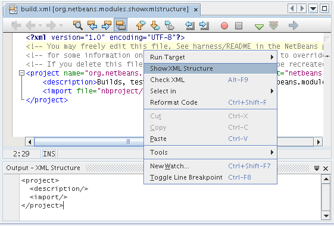

// 
//     Licensed to the Apache Software Foundation (ASF) under one
//     or more contributor license agreements.  See the NOTICE file
//     distributed with this work for additional information
//     regarding copyright ownership.  The ASF licenses this file
//     to you under the Apache License, Version 2.0 (the
//     "License"); you may not use this file except in compliance
//     with the License.  You may obtain a copy of the License at
// 
//       http://www.apache.org/licenses/LICENSE-2.0
// 
//     Unless required by applicable law or agreed to in writing,
//     software distributed under the License is distributed on an
//     "AS IS" BASIS, WITHOUT WARRANTIES OR CONDITIONS OF ANY
//     KIND, either express or implied.  See the License for the
//     specific language governing permissions and limitations
//     under the License.
//

= NetBeans XML Editor Extension Module Tutorial
:jbake-type: platform_tutorial
:jbake-tags: tutorials 
:jbake-status: published
:syntax: true
:source-highlighter: pygments
:toc: left
:toc-title:
:icons: font
:experimental:
:description: NetBeans XML Editor Extension Module Tutorial - Apache NetBeans
:keywords: Apache NetBeans Platform, Platform Tutorials, NetBeans XML Editor Extension Module Tutorial

This tutorial demonstrates how to create a module that extends the functionality offered by one of the IDE's editors. The IDE has several editors—for example, the XML editor, the Java editor, the JSP editor, and the SQL editor. Normally all the IDE's editors are referred to collectively as the Source Editor. However, each of the editors is distinct—its functionality is targeted at the file type for which it exists. In this tutorial, you add an action to the XML editor. After you create and install the module, and you open an XML file, the editor's contextual menu will include a menu item that displays the XML file's tags in the Output Window.

NOTE: This is not the latest version of this document. It applies to NetBeans IDE 6.0/6.1 only.  link:../nbm-xmleditor.html[Click here] to see the most up to date version.

Optionally, for troubleshooting purposes, you can  link:https://netbeans.org/files/documents/4/527/ShowXMLStructure.zip[download the completed sample].

== Setting up the Module Project

Before you start writing the module, you have to make sure you that your project is set up correctly. The IDE provides a wizard that sets up all the basic files needed for a module.

=== Creating the Module Project

[start=1]
1. Choose File > New Project (Ctrl-Shift-N). Under Categories, select NetBeans Modules. Under projects, select Module Project and click Next.

[start=2]
1. In the Name and Location panel, type  ``ShowXMLStructure``  in Project Name. Change the Project Location to any directory on your computer, such as  ``c:\mymodules`` . Leave the Standalone Module radiobutton selected. Select the Set as Main Project checkbox. Click Next.

[start=3]
1. In the Basic Module Configuration panel, replace  ``yourorghere``  in Code Name Base with  ``myorg``  and change  ``ShowXMLStructure``  to  ``xmltree`` , so that the whole code name base is  ``org.netbeans.modules.showxmlstructure`` . Add spaces the the default Module Display Name to change it to  ``Show XML Structure`` . Leave the location of the localizing bundle and XML layer, so that they will be stored in a package with the name  ``org/netbeans/modules/showxmlstructure`` . Click Finish.

The IDE creates the  ``Show XML Structure``  project. The project contains all of your sources and project metadata, such as the project's Ant build script. The project opens in the IDE. You can view its logical structure in the Projects window (Ctrl-1) and its file structure in the Files window (Ctrl-2). For example, the Projects window should now look as follows:

image::images/taghandler_initial-projects-window-60.png[]

=== Specifying the Module's Dependencies

You will need to subclass several classes that belong to NetBeans APIs. Each has to be declared as a module dependency. Use the Project Properties dialog box for this purpose.

[start=1]
1. In the Projects window, right-click the  ``Show XML Structure``  project and choose Properties.

[start=2]
1. For each of the following APIs, click "Add..." in the Libraries panel, select the name from the Module list, and then click OK to confirm it:

*  ``I/O APIs`` 
*  ``Nodes API`` 
*  ``Text API`` 
*  ``Utilities API`` 
*  ``Window System API`` 

Click OK to exit the Project Properties dialog box.

[start=3]
1. In the Projects window, double-click Project Metadata and note that the APIs you selected have been declared as module dependencies.

== Coding the Module

=== Creating the Action

[start=1]
1. Right-click the project node and choose New > Other. Under Categories, select NetBeans Module Development. Under Projects, select Action. Click Next.

[start=2]
1. In the Action Type panel and click Conditionally Enabled. Select  ``EditorCookie`` , which is the name of the class that lets the Source Editor access the action, as shown below:

image::images/taghandler_action1-60.png[]

Click Next.

[start=3]
1. In the GUI Registration panel, select the 'Edit' category in the Category drop-down list. The Category drop-down list controls where an action is shown in the Keyboard Shortcuts editor in the IDE. Next, select Editor Contect Menu Item and then select the  ``text/xml``  MIME type, as shown below:

image::images/taghandler_action2-60.png[]

Notice that you can set the position of the menu item and that you can separate the menu item from the item before it and after it. Click Next.

[start=4]
1. In the Name and Location panel, type  ``ShowXMLStructureAction``  as the Class Name and type  ``Show XML Structure``  as the Display Name. Menu items provided by contextual menus do not display icons. Therefore, click Finish and  ``ShowXMLStructureAction.java``  is added to the package.

[start=5]
1. In the Source Editor, add the following code to the  ``performAction``  method:

[source,java]
----

    public void performAction(Node[] activatedNodes) {
        EditorCookie editorCookie = activatedNodes[0].getCookie(EditorCookie.class); 
        String tabName = NbBundle.getMessage(ShowXMLStructureAction.class,"LBL_tabName");
        
        // "XML Tree" tab is created in output window for writing the list of tags
        InputOutput io = IOProvider.getDefault().getIO(tabName,false);
        io.select(); //XML Tree tab is selected
        OutputWriter writer = io.getOut();
        
        try {
            writer.reset(); //clean the output window
            java.io.InputStream is =  ((org.openide.text.CloneableEditorSupport)editorCookie).getInputStream();
            parse(new InputSource(is));
            is.close();
            for (int i=0;i<tags.length;i++) {
                writer.println(tags[i]); //write tag to output window
            }
        } catch (IOException ex) {
        } catch (SAXException ex){
            writer.println("Parse Error: "+ex.getMessage());
        }
        writer.flush();
        writer.close();
    }
----

[start=6]
1. Add a new method:

[source,java]
----

    /** Parses XML document and creates the list of tags
    */
    private void parse(InputSource is) throws IOException, SAXException {
        XMLReader xmlReader = XMLUtil.createXMLReader();
        TagHandler handler = new TagHandler();
        xmlReader.setContentHandler(handler);
        xmlReader.parse(is);
        tags = handler.getTags(); 
    }
----

[start=7]
1. Declare the  ``tags``  variable at the top of the source file:

[source,java]
----

    private String[] tags;
----

[start=8]
1. Add the display names to the  ``Bundle.properties``  file:

[source,java]
----

ACT_name=Show XML Structure
LBL_tabName=XML Structure
----

=== Creating the Tag Handler

[start=1]
1. In the Projects window, expand the project node, expand the Source Packages node, and then right-click the  ``org.netbeans.modules.showxmlstructure``  node. Choose New > Other. Under Categories, choose Java Classes. Under File Types, choose Java Class. Click Next and type  ``TagHandler``  in Class Name. Click Finish. The new Java class opens in the Source Editor.

[start=2]
1. Replace the default code with the code below:

[source,xml]
----

package org.netbeans.modules.showxmlstructure;

import org.xml.sax.Attributes;
import org.xml.sax.SAXException;

     /** Specific XML handler used for creating list of starting and ending tags, e.g. :
     * <AAA>
     *   <BBB>
     *     <CCC/>
     *   </BBB>
     * </AAA>
     */

    public class TagHandler extends org.xml.sax.helpers.DefaultHandler {
       
	private final int indentLength=2;        
        private java.util.List tagList;
        private String indent;
        private String space;
        private String lastElement;
        
        TagHandler() {
            tagList = new java.util.ArrayList();
            StringBuffer indentBuf = new StringBuffer();
            for (int i=0;i<indentLength;i++) indentBuf.append(' ');
            space=indentBuf.toString();
            indent="";
        }

        public void startElement(String uri, String localName, String qName, Attributes attributes) throws SAXException {
            tagList.add(indent+"<"+qName+">");
            indent+=space;
            lastElement=qName;
            
        }

        public void endElement(String uri, String localName, String qName) throws SAXException {
            indent=indent.substring(indentLength);
            if (qName.equals(lastElement)) {
                int lastIndex = tagList.size()-1;
                String lastInList = (String)tagList.get(lastIndex);
                String replacedString = lastInList.replace(">","/>");
                tagList.set(lastIndex,replacedString);
            } else {     
                tagList.add(indent+"</"+qName+">");
            }
            lastElement=null;
        }
        
        String[] getTags() {
            String[] tags = new String[tagList.size()];
            tagList.toArray(tags);
            return tags;
        }
    }
----

== Building and Installing the Module

The IDE uses an Ant build script to build and install your module. The build script is created for you when you create the module project.

=== Installing the Module

In the Projects window, right-click the  ``Show XML Structure``  project and choose Install/Reload in Target Platform.

The module is built and installed in the target IDE or Platform. The target IDE or Platform opens so that you can try out your new module. The default target IDE or Platform is the installation used by the current instance of the development IDE. Note that when you run your module, you will be using a temporary test user directory, not the development IDE's user directory.

=== Using the Module

[start=1]
1. Choose File > New Project (Ctrl-Shift-N) and create a new project.

[start=2]
1. In the Files window (Ctrl-2), expand the project node and then expand the  ``nbproject``  node. Double-click  ``build-impl.xml``  so that it opens in the Source Editor.

[start=3]
1. Right-click anywhere in the Source Editor and notice the new popup menu item called "Show XML Structure":

Choose the menu item and notice that the tag handler prints all the tags to the Output window, which is at at the bottom of the IDE, as shown below:

[start=4]
1. Open a different file type in the Source Editor. For example, open a Java class. Right-click anywhere in the Source Editor and notice that the new popup menu item is not included in the contextual menu.

=== Creating a Shareable Module Binary

[start=1]
1. In the Projects window, right-click the  ``Show XML Structure``  project and choose Create NBM.

The NBM file is created and you can view it in the Files window (Ctrl-2):

image::images/taghandler_shareable-nbm-60.png[]

[start=2]
1. Make it available to others via, for example, e-mail.

link:http://netbeans.apache.org/community/mailing-lists.html[Send Us Your Feedback]

== Next Steps

For more information about creating and developing NetBeans modules, see the following resources:

*  link:https://netbeans.apache.org/kb/docs/platform.html[Other Related Tutorials]
*  link:https://bits.netbeans.org/dev/javadoc/[NetBeans API Javadoc]

== Versioning

|===
|*Version* |*Date* |*Changes* 

|1 |11 July 2005 |Initial version 

|2 |27 September 2005 |

* Added Action wizard
* Renamed from "NetBeans Tag Handler Plug-in Tutorial" to "NetBeans Source Editor Extension Module Tutorial".
* Added issue 7 below.
 

|3 |28 September 2005 |

* Renamed the tutorial, because 'Source Editor' doesn't cover the SQL editor, which could also be extended using the steps in this tutorial.
* Rewrote the introductory paragraph.
 

|4 |11 June 2007 |Worked through whole tutorial, and cleaned up, for 6.0, also changed screenshots. 

|5 |17 November 2007 |Fixed spacing between steps. Tried out the attached sample, and it works as described. 
|===

|===
|*Issue Number* |*Description* |*Status* 

|1 |Code and tutorial itself need to be reviewed. |To be fixed. 

|2 |Tutorial needs to be updated once Phase III and IV are complete. |Done. 

|3 |Some APIs used in this tutorial have deprecated methods. This will produce errors in the Output window, but should not impact functioning of module. |To be fixed. 

|4 |Clear explanations -- and links to Javadoc -- to be added for all APIs, classes, and methods. Also Javadoc links for each of the dependencies and why they are needed in this tutorial. |To be fixed. 

|5 |Maybe other identifiers for JSP editor, HTML editor, etc. should be mentioned. For example, instead of "xml" (in layer.xml), use "html", "x-properties", "base" etc. |To be fixed. 

|6 |Explain what a cookie is. Explain what a cookie action is. |To be fixed. 

|7 |Need to change downloadable, because currently the tag handler and the show XML action are separate files while in the downloadable code, they're in the same file. For the same reason, must change screenshots where one file instead of two are shown. |To be fixed. 
|===
