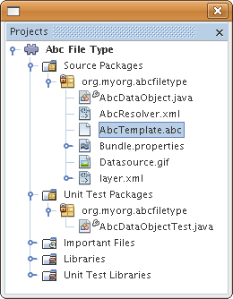
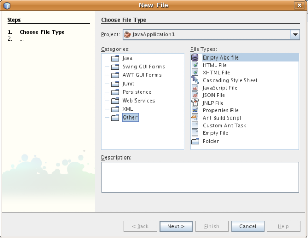

// 
//     Licensed to the Apache Software Foundation (ASF) under one
//     or more contributor license agreements.  See the NOTICE file
//     distributed with this work for additional information
//     regarding copyright ownership.  The ASF licenses this file
//     to you under the Apache License, Version 2.0 (the
//     "License"); you may not use this file except in compliance
//     with the License.  You may obtain a copy of the License at
// 
//       http://www.apache.org/licenses/LICENSE-2.0
// 
//     Unless required by applicable law or agreed to in writing,
//     software distributed under the License is distributed on an
//     "AS IS" BASIS, WITHOUT WARRANTIES OR CONDITIONS OF ANY
//     KIND, either express or implied.  See the License for the
//     specific language governing permissions and limitations
//     under the License.
//

= ファイル�?�種類統�?��?��?ュートリアル
:jbake-type: platform_tutorial
:jbake-tags: tutorials 
:jbake-status: published
:syntax: true
:source-highlighter: pygments
:toc: left
:toc-title:
:icons: font
:experimental:
:description: ファイル�?�種類統�?��?��?ュートリアル - Apache NetBeans
:keywords: Apache NetBeans Platform, Platform Tutorials, ファイル�?�種類統�?��?��?ュートリアル

�?��?��?ュートリアル�?��?��?IDE �?��?��?� NetBeans プラットフォーム上�?�構築�?�れ�?��??�?�他�?�アプリケーション�?��?新�?��?�ファイル�?�種類を�?識�?��?�るモジュールを作�?�?�る方法を示�?��?��?�。

NOTE:  �?��?�ドキュメント�?��?� NetBeans IDE 6.5 リリースを使用�?��?��?�。NetBeans IDE 6.x を使用�?��?��?�る場�?��? link:60/nbm-filetype_ja.html[�?��?�ドキュメント�?� 6.1 �?ージョン]を�?�照�?��?��??�?��?��?�。

*�?��?��?ュートリアルを行�?��?��?��?次�?�表�?�示�?�ソフトウェア�?�よ�?�リソース�?�必�?�?��?�。*

|===
|ソフトウェア�?��?��?�リソース |必須�?ージョン 

| link:https://netbeans.apache.org/download/index.html[NetBeans IDE] |version 6.5 

| link:https://www.oracle.com/technetwork/java/javase/downloads/index.html[Java Developer Kit (JDK)] |version 6 �?��?��?�
version 5 
|===

== ファイル�?�種類統�?��?��?��?��?�

IDE �?��?識�?�れるファイル�?�種類�?��?��?独自�?�アイコン�?メニュー項目�?�?�よ�?�動作�?��?�り�?��?�。表示�?�れる「ファイル�?�?�  ``FileObjects``  �?��?�り�? ``java.io.File``  �?�ラッパー�?��?構�?ファイル�?�場�?��?�通常�?モジュール�?� XML ファイル内�?��?��?�?��?��?�方法�?��?存�?�れ�?�データ�?�ラッパー�?��?�。実際�?�_表示_�?�れ�?��?�るも�?��?�  ``Nodes``  �?��?アクション�?�よ�?��?�機能や�?ファイル�?��?��?�オブジェクト�?�ローカライズ�?�れ�?��??�?を�??供�?��?��?�。 ``Nodes``  �?�  ``FileObjects``  �?�間�?��?�  ``DataObjects``  �?��?�り�?��?�。 ``DataObject``  �?�  ``FileObject``  �?�似�?��?��?��?��?��?�?��?�種類�?�ファイル�?�表示�?�れる�?��?��?�?�り�?��?�ん。通常�?異�?�る拡張�?を�?�?�ファイル�?�異�?�る�??�?空間を�?�?� XML ファイル�?�対�?��?��?異�?�る種類�?�  ``DataObject``  �?��?�り�?��?�。�?�  ``DataObject``  �?�異�?�るモジュール�?�よ�?��?��??供�?�れ�?��?�。�?�実装�?��?1 �?�以上�?�ファイル�?�種類をサ�?ート�?��?��?�。�?��?��?��?��?画�?モジュール�?�  ``.gif``  ファイル�?�よ�?�  ``.png``  ファイルを�?識�?��?開�??�?��?��?��?��??�?��?�。

ファイル�?�種類を�?識�?�るモジュール�?��? ``DataLoader``  (ファイル�?�種類�?�固有�?�  ``DataObject``  用�?�ファクトリ) をインストール�?��?��?�。フォルダを展開�?�る�?��?IDE �?��?�既存�?�  ``DataLoader``  �?�「�?�れ�?�何�?��?�?�り�?��?��?� ?�?�?��?�?��?��?�?��?��?�。最�?�?�「�?��?��?�?�答�?��?� DataLoader �?��?ファイル�?�  ``DataObject``  を作�?�?��?��?�。�?�ファイル�?�何�?�を実際�?�表示�?�る�?��?�?��?システム�?��?�  ``DataObject``  �?�対�?��?�  ``DataObject.getNodeDelegate()``  を呼�?�出�?��?��? ``Nodes``  �?� IDE �?�実際�?�表示�?�れるも�?��?��?�り�?��?�。

次�?�左�?��?�図�?��?�?述�?��?�項目を示�?��?��?��?��?�。

image::images/filetype_diagram-dataobject2.png[]

�?��?��?ュートリアル�?��?��?架空�?�ファイル「Abc�? (ファイル拡張�?�?�  ``.abc`` ) �?��? ``DataLoader``  をインストール�?�るモジュールを作�?�?��?��?�。デフォルト�?��?「abc�?拡張�?を�?�?�ファイル�?��?IDE �?��?識�?��?��?��??�?�他�?�ファイル�?��?��?�扱�?れ�?��?�。�?�れ�?�テキストファイル�?��?��?�扱�?れる�?��?�?IDE �?�テキストファイル�?�場�?��?��?�様�?�機能を�?Abc ファイル�?��??供�?��?��?�。モジュールを作�?�?�る�?��?Abc ファイル�?��?��?�利用�?��??る機能を拡張�?�る方法�?�表示�?�れ�?��?�。開発サイクル�?�完了�?�る�?��?�?��?��?�人�?��??�?�モジュールを簡�?��?�使用�?��?�る�?��?��?��?��??�?��?�。IDE �?��?��?�?��?��?�人�?��?信�?��??る�?イナリを作�?�?��??�?��?�。�?��?��?�人�?��?アップデートセンター�?�ら�??れをインストール�?��??�?��?�。

==  モジュールプロジェクト�?�作�?

�?��?�節�?��?��?ウィザードを使用�?��?��?�?� NetBeans モジュール�?�必�?�?��?�るソース�?�構造を作�?�?��?��?�。ソース�?�構造�?��?特定�?�場所�?��?�る特定�?�フォルダ�?��?常�?�必�?�?�ファイル�?�セット�?�構�?�?�れ�?��?�。�?��?��?��?��?�?��?��?��?� NetBeans モジュール�?��?��?プロジェクト�?�メタデータを�?存�?�る  ``nbproject``  フォルダ�?��?ツール�?ーボタンやウィンドウ�?��?��?�項目を宣言登録�?�る�?��?�?�  ``layer.xml``  ファイル�?�必�?�?��?�。

[start=1]
1. 「ファイル�?>「新�?プロジェクト�?(Ctrl-Shift-N) を�?�択�?��?��?�。「カテゴリ�?�?�「NetBeans モジュール�?を�?�択�?��?��?�。「プロジェクト�?�?�「モジュール�?を�?�択�?��?「次�?��?をクリック�?��?��?�。

[start=2]
1. 「�??�?�?�場所�?パ�?ル�?��?「プロジェクト�??�?�?�「 ``AbcFileType`` �?�?�入力�?��?��?�。「プロジェクト�?�場所�?を�? ``c:\mymodules``  �?��?��?�コンピュータ上�?�任�?�?�ディレクトリ�?�変更�?��?��?�。「スタンドアロンモジュール�?ラジオボタン�?��?�択�?��?��?��?��?��?��?��?��??�?��?�。パ�?ル�?�次�?�よ�?��?��?�り�?��?�。

image::images/filetype_65-projectwizard1.png[]

「次�?��?をクリック�?��?��?�。

[start=3]
1. 「基本モジュール構�?�?パ�?ル�?��?コード�??ベース�?�「 ``org.myorg.abcfiletype`` �?�?�入力�?��?��?�。推奨�?�れるモジュール表示�??�?�空白文字を追加�?��? ``Abc File Type``  �?�変更�?��?��?�。「XML レイヤーを生�?�?�?ェックボックスを�?�択�?��?「ローカライズ版�?ンドル�?�?�「XML レイヤー�?�?�場所�?��??�?��?��?��?��?��?��?��??�?��?�。�?�れら�?�  ``org/myorg/abcfiletype``  �?��?��?��??�?�?�パッケージ�?�格�?�?�れ�?��?�。パ�?ル�?�次�?�よ�?��?��?�り�?��?�。

image::images/filetype_65-projectwizard2.png[]

[start=4]
1. 「完了�?をクリック�?��?��?�。

IDE �?�よ�?��?�  ``Abc File Type``  プロジェクト�?�作�?�?�れ�?��?�。�?��?�プロジェクト�?��?��?ソースや�?プロジェクト�?� Ant 構築スクリプト�?��?��?�プロジェクトメタデータ�?��?��?��?��?��?�れ�?��?�。IDE �?�プロジェクト�?�開�??�?��?�。「プロジェクト�?ウィンドウ (Ctrl-1) �?��?プロジェクト�?�論�?�構造を表示�?��??�?��?�。�?��?��?「ファイル�?ウィンドウ (Ctrl-2) �?��?プロジェクト�?�ファイル構造を表示�?��??�?��?�。�?��?��?��?��?「プロジェクト�?ウィンドウ�?�次�?�よ�?��?�表示�?�れ�?��?�。

image::images/filetype_65-projectswindow1.png[] 

== Abc ファイル�?��?識

�?��?�節�?��?��?ウィザードを使用�?��?��?Abc ファイル�?��?��?��?��?��?��?��?�ファイル�?��?�異�?�る�?��?�を�?識�?�る�?��?�?�必�?�?�クラスを作�?�?��?��?�。�?��?��?ュートリアル�?�最�?�?�説明�?��?��?��?�り�?�?�れを行�?��?��?��?データオブジェクト�?�データローダー�?��?��?��?��?MIME タイプリゾル�?�?�  ``layer.xml``  ファイル�?�登録エントリ�?�必�?�?��?�。「新�?ファイル�?�種類�?ウィザード�?�よ�?��?��??れら�?��?��?��?�作�?�?�れ�?��?�。

[start=1]
1. プロジェクトノードを�?�クリック�?��?「新�?�?>「ファイル�?�種類�?を�?�択�?��?��?�。

[start=2]
1. 「ファイル�?��?識�?パ�?ル�?��?次を行�?��?��?�。

* MIME タイプ�?�編集ボックス�?�「 ``text/x-abc`` �?�?�入力�?��?��?�。
* ファイル�??�?�拡張�?�?�編集ボックス�?�「 ``.abc .ABC`` �?�?�入力�?��?��?�。

�?�れ�?��?「ファイル�?��?識�?パ�?ル�?�次�?�よ�?��?��?�り�?��?�。

image::images/filetype_60-filewizard1.png[]

「ファイル�?��?識�?パ�?ル�?��?��?次�?�フィールド�?��?�り�?��?�。

* *MIME タイプ。*データオブジェクト�?�一�?�?� MIME タイプを指定�?��?��?�。
* �?識方法
* *ファイル�??�?�拡張�?。*1 �?��?��?��?�複数�?�ファイル拡張�?を指定�?��?��?指定�?� MIME タイプ�?�属�?�る�?��?�を IDE �?��?識�?��?��?��?�。任�?�?��?ファイル拡張�?�?��?�?�ピリオドを 1 �?�付�?�る�?��?��?��?��??�?��?�。区切り文字�?�コンマ�?�空白文字�?�?��?��?��??�?�両方�?��?�。�?��?��?��?��?��?次�?�拡張�?�?��?��?��?�有効�?��?�。

*  ``.abc,.def`` 
*  ``.abc .def`` 
*  ``abc def`` 
*  ``abc,.def ghi, .wow`` 

Abc ファイル�?�大文字�?文字を区別�?�る�?��?��?��?�。�??�?�場�?��?�?��?��?ュートリアル�?��?� _2 �?��?�_ MIME タイプ�? ``.abc``  �?�  ``.ABC``  を指定�?��?��?�。

* *XML �?�ルート�?素。*一�?�?��??�?空間を指定�?��?��?XML ファイル�?�種類を�?��?��?��?��?��?��?� XML ファイル�?�種類�?�区別�?��?��?�。多�??�?� XML ファイル�?��?��?�拡張�? ( ``xml`` ) を�?�?��?��?��?IDE �?��??�?� XML ルート�?素を使用�?��?� XML ファイルを区別�?��?��?�。�?�ら�?�具体的�?�言�?��?��?IDE �?��??�?空間�?� XML ファイル�?�最�?�?� XML �?素を区別�?��??�?��?�。�?�れを使用�?�る�?��?�?��?��?��?��?JBoss �?備記述�?�?� WebLogic �?備記述�?を区別�?��??�?��?�。�?��?�区別を行�?��?��?JBoss �?備記述�?�?�コンテキストメニュー�?�追加�?��?�メニュー項目�?��?WebLogic �?備記述�?�?�使用�?��??�?��??�?�り�?��?�。例�?��?��?��?��?��? link:nbm-palette-api2_ja.html[NetBeans コン�?ー�?ントパレットモジュール�?��?ュートリアル]を�?�照�?��?��??�?��?��?�。

「次�?��?をクリック�?��?��?�。

[start=3]
1. 「�??�?�?�場所�?パ�?ル�?��?「クラス�??�?�接頭辞�?�?�「 ``Abc``  �?�?�入力�?��?次�?�示�?�よ�?��?��?任�?�?� 16x16 ピクセル�?�画�?ファイルを新�?��?�ファイル�?�種類�?�アイコン�?��?��?��?�照�?��?��?�。

image::images/filetype_65-filewizard2.png[]

*注: *任�?�?�アイコンを使用�?��??�?��?�。必�?�?�応�?��?��?�?��?�アイコン 
image::images/filetype_Datasource.gif[] をクリック�?��?�ローカル�?��?存�?��?�?述�?�ウィザード�?�手順�?�指定�?��??�?��?�。

[start=4]
1. 「完了�?をクリック�?��?��?�。

「プロジェクト�?ウィンドウ�?�次�?�よ�?��?��?�り�?��?�。

新�?��??生�?�?�れ�?��?�ファイル�?��?��?��?�簡�?��?�説明�?��?��?�。

* *AbcDataObject.java。* ``FileObject``  をラップ�?��?��?�。DataObjects �?� DataLoaders �?�よ�?��?�生�?�?�れ�?��?�。詳細�?��?��?��?��?��? link:https://netbeans.apache.org/wiki/devfaqdataobject[What is a DataObject?] を�?�照�?��?��??�?��?��?�。
* *AbcResolver.xml。* ``.abc``  �?�よ�?�  ``.ABC``  �?�拡張�?を MIME タイプ�?�マップ�?��?��?�。 ``AbcDataLoader``  �?� MIME タイプ�?��?�を�?識�?��?ファイル拡張�?�?��?��?��?��?��?識�?��?��?�ん。
* *AbcTemplate.abc。*「新�?ファイル�?ダイアログ�?�新�?��?�テンプレート�?��?��?�インストール�?�れるよ�?��?��? ``layer.xml``  �?�登録�?�れ�?��?�るファイルテンプレート�?�基盤を�??供�?��?��?�。
* *AbcDataObjectTest.java。* ``DataObject``  �?� JUnit テストクラス。

 ``layer.xml``  ファイル�?��?次�?�よ�?��?�表示�?�れ�?��?�。

[source,xml]
----

<folder name="Loaders">
    <folder name="text">
        <folder name="x-abc">
            <folder name="Actions">
                <file name="org-myorg-abcfiletype-MyAction.shadow">
                    <attr name="originalFile" stringvalue="Actions/Edit/org-myorg-abcfiletype-MyAction.instance"/>
                    <attr name="position" intvalue="600"/>
                </file>
                <file name="org-openide-actions-CopyAction.instance">
                    <attr name="position" intvalue="100"/>
                </file>
                <file name="org-openide-actions-CutAction.instance">
                    <attr name="position" intvalue="200"/>
                </file>
                <file name="org-openide-actions-DeleteAction.instance">
                    <attr name="position" intvalue="300"/>
                </file>
                <file name="org-openide-actions-FileSystemAction.instance">
                    <attr name="position" intvalue="400"/>
                </file>
                <file name="org-openide-actions-OpenAction.instance">
                    <attr name="position" intvalue="500"/>
                </file>
                <file name="org-openide-actions-PropertiesAction.instance">
                    <attr name="position" intvalue="700"/>
                </file>
                <file name="org-openide-actions-RenameAction.instance">
                    <attr name="position" intvalue="800"/>
                </file>
                <file name="org-openide-actions-SaveAsTemplateAction.instance">
                    <attr name="position" intvalue="900"/>
                </file>
                <file name="org-openide-actions-ToolsAction.instance">
                    <attr name="position" intvalue="1000"/>
                </file>
                <file name="sep-1.instance">
                    <attr name="instanceClass" stringvalue="javax.swing.JSeparator"/>
                    <attr name="position" intvalue="1100"/>
                </file>
                <file name="sep-2.instance">
                    <attr name="instanceClass" stringvalue="javax.swing.JSeparator"/>
                    <attr name="position" intvalue="1200"/>
                </file>
                <file name="sep-3.instance">
                    <attr name="instanceClass" stringvalue="javax.swing.JSeparator"/>
                    <attr name="position" intvalue="1300"/>
                </file>
                <file name="sep-4.instance">
                    <attr name="instanceClass" stringvalue="javax.swing.JSeparator"/>
                    <attr name="position" intvalue="1400"/>
                </file>
            </folder>
            <folder name="Factories">
                <file name="AbcDataLoader.instance">
                    <attr name="SystemFileSystem.icon" urlvalue="nbresloc:/org/myorg/abcfiletype/Datasource.gif"/>
                    <attr name="dataObjectClass" stringvalue="org.myorg.abcfiletype.AbcDataObject"/>
                    <attr name="instanceCreate" methodvalue="org.openide.loaders.DataLoaderPool.factory"/>
                    <attr name="mimeType" stringvalue="text/x-abc"/>
                </file>
            </folder>
        </folder>
    </folder>
</folder>
----

== インストール�?�よ�?�機能�?�動作確�?

次�?��?モジュールをインストール�?��?�?�れ�?��?��?�作�?�?��?�基本機能を使用�?��?��?�。IDE �?��?Ant 構築スクリプトを使用�?��?�モジュールを構築�?�よ�?�インストール�?��?��?�。構築スクリプト�?��?プロジェクトを作�?�?�る�?��??�?�作�?�?�れ�?��?�。

[start=1]
1. 「プロジェクト�?ウィンドウ�?�  ``Abc File Type``  プロジェクトを�?�クリック�?��?「開発中 IDE �?��?�インストール/�?読�?�込�?��?を�?�択�?��?��?�。

モジュール�?�構築�?�れ�?�?�在実行中�?� IDE �?�インストール�?�れ�?��?�。

[start=2]
1. IDE �?�任�?�?�アプリケーションを作�?�?��?��?�。

[start=3]
1. アプリケーションノードを�?�クリック�?��?「新�?�?>「�??�?�他�?を�?�択�?��?��?�。「�??�?�他�?カテゴリ�?��?新�?��?�ファイル�?�種類�?�ダミーテンプレート�?�使用�?��??�?��?�。

[start=4]
1. ダミーテンプレートを使用�?��?�デフォルト�?�コードを�??供�?�る場�?��?��?「新�?ファイル�?�種類�?ウィザード�?�作�?�?�れ�?�  ``AbcTemplate.abc``  ファイル�?��??�?�コードを追加�?��?��?�。

== Abc ファイル�?�機能�?�作�?

�?�れ�?��?NetBeans プラットフォーム�?��?Abc ファイル�?��?��?��?�種類�?��?��?��?��?�ファイルを区別�?��??るよ�?��?��?�り�?��?��?�。次�?��?�?�れら�?�種類�?�ファイル�?�特有�?�機能を追加�?��?��?�。�?��?�節�?��?��?「プロジェクト�?ウィンドウ�?��?��?�エクスプローラウィンドウ�?��?ファイル�?�ノードを�?�クリック�?��?�コンテキストメニュー�?�メニュー項目を追加�?��?��?�。�?��?��?ファイルをエディタ�?��?��?��??ウィンドウ�?�開�?�るよ�?��?��?��?��?�。

=== アクション�?�追加

�?��?�サブセクション�?��?��?「新�?アクション�?ウィザードを使用�?��?��?ファイル�?�種類�?�アクションを実行�?�る Java クラスを作�?�?��?��?�。�?��?�ウィザード�?��?��?エクスプローラウィンドウ�?��?�るファイル�?�種類�?�ノード�?��?�?�クリック�?�コンテキストメニュー�?�ら呼�?�出�?��?��??るよ�?��?��?クラスを  ``layer.xml``  ファイル�?�登録�?��?��?�。

[start=1]
1. プロジェクトノードを�?�クリック�?��?「新�?�?>「アクション�?を�?�択�?��?��?�。

[start=2]
1. 「アクション�?�種類�?パ�?ル�?��?「�?�件付�??�?�有効�?をクリック�?��?��?�。次�?�示�?�よ�?��?��?�?�?�「新�?ファイル�?�種類�?ウィザード�?�生�?�?��?�データオブジェクト�?��??�?  ``AbcDataObject``  を入力�?��?��?�。

image::images/filetype_60-action1.png[]

「次�?��?をクリック�?��?��?�。

[start=3]
1. 「GUI 登録�?パ�?ル�?��?「カテゴリ�?ドロップダウンリスト�?�ら「編集�?カテゴリを�?�択�?��?��?�。「カテゴリ�?ドロップダウンリスト�?��?IDE �?�キーボードショートカットエディタ�?�アクション�?�表示�?�れる場所を制御�?��?��?�。

次�?��?「大域メニュー項目�?を�?�択解除�?��?�「ファイル�?�種類�?�メニュー項目�?を�?�択�?��?��?�。「内容�?�種類�?ドロップダウンリスト�?��?次�?�示�?�よ�?��?��?「新�?ファイル�?�種類�?ウィザード�?��?�?�指定�?��?� MIME タイプを�?�択�?��?��?�。

image::images/filetype_60-action2.png[]

メニュー項目�?��?置�?�設定�?�能�?��?�??�?�メニュー項目を�?後�?�項目�?�ら離�?��?��?��?��?��??�?��?�。「次�?��?をクリック�?��?��?�。

[start=4]
1. 「�??�?�?�場所�?パ�?ル�?��?「クラス�??�?�?�「 ``MyAction`` �?�?�入力�?��?「表示�??�?�?�「 ``MyAction`` �?�?�入力�?��?��?�。コンテキストメニュー�?��?�るメニュー項目�?��?��?アイコン�?�表示�?�れ�?��?�ん。�?��?��?��?��?��?「完了�?をクリック�?�る�?�  ``org.myorg.abcfiletype``  パッケージ�?�  ``MyAction.java``  �?�追加�?�れ�?��?�。

[start=5]
1. ソースエディタ�?��?アクション�?�  ``performAction``  メソッド�?��?��??�?��?��?�コードを追加�?��?��?�。

[source,java]
----

protected void performAction(Node[] activatedNodes) {
	AbcDataObject d = (AbcDataObject) activatedNodes[0].getCookie(AbcDataObject.class);
	FileObject f = d.getPrimaryFile();
	String displayName = FileUtil.getFileDisplayName(f);
	String msg = "I am " + displayName + ". Hear me roar!"; 
        NotifyDescriptor nd = new NotifyDescriptor.Message(msg);
        DialogDisplayer.getDefault().notify(nd);
}
----

Ctrl-Shift-I キーを押�?��?��?�。IDE �?�よ�?��?��?イン�?ート文�?�クラス�?�先頭�?�自動�?�追加�?�れ�?��?�。一部�?�コード�?��?��?�?��?�赤�?�下線�?�付�?��?��?��?��?�。�?�れ�?��?クラスパス�?�必�?�?�パッケージ�?��?��?��?��?��?��?��?��?�を示�?��?��?��?��?�。プロジェクトノードを�?�クリック�?��?�「プロパティー�?を�?�択�?��?「プロジェクトプロパティー�?ダイアログ�?�「ライブラリ�?をクリック�?��?��?�。「ライブラリ�?区画�?�上部�?��?�る「追加�?をクリック�?��?「ダイアログ API�?を追加�?��?��?�。

 ``MyAction.java``  クラス�?��?も�?�一度 Ctrl-Shift-I キーを押�?��?��?�。 IDE �?�ダイアログ API �?�必�?�?�パッケージを検出�?��?��?��?�?赤�?�下線�?�消�?��?��?�。

[start=6]
1. 「�?�?�?�ファイル�?ノード�?��?「XML レイヤー�?を展開�?��?��?�。「 ``<�?��?�レイヤー>`` �?�?�「 ``<コンテキスト内�?��?��?�レイヤー>`` �?�?� 2 �?��?�ノード�?��?�??れら�?�サブノード�?��? link:https://netbeans.apache.org/tutorials/nbm-glossary.html[System ファイルシステム]ブラウザを構�?�?��?��?�。「 ``<�?��?�レイヤー>`` �?�?「 ``Loaders`` �?を順�?�展開�?��?�?�?�作�?�?��?�「 ``Action`` �?�?�表示�?�れる�?��?�ノードを展開�?��?��?�。

[start=7]
1.  ``My Action``  をドラッグ＆ドロップ�?�る�?��?次�?�示�?�よ�?��?��? ``開�??`` アクション�?�下�?�表示�?�れ�?��?�。

image::images/filetype_60-action3.png[]

最後�?� 2 �?��?�手順�?�ら分�?�る�?��?�り�?System ファイルシステムブラウザ�?��?System ファイルシステム�?�登録�?�れ�?��?�る項目�?�順�?を�?��?�や�??�?編�?�?�る�?��?�使用�?��??�?��?�。

[start=8]
1. �?�?�節�?�実行�?��?�よ�?��?��?モジュールを�?インストール�?��?��?�。

[start=9]
1. ABC ファイルを作�?�?��?「プロジェクト�?ウィンドウや「�?�気�?�入り�?ウィンドウ�?��?��?�エクスプローラビュー�?� 1 �?��?��?ファイル�?�ノードを�?�クリック�?��?��?�。

Abc ファイル�?��?��?モジュール�?�割り当�?��?�アイコン�?��?�?�クリック�?�コンテキストメニュー�?�ら使用�?��??る�? ``layer.xml``  ファイル�?�定義�?�れ�?��?�るアクション�?�リスト�?��?�り�?��?�。

image::images/filetype_60-dummytemplate.png[]

[start=10]
1. 新�?メニュー項目を�?�択�?�る�?��?Abc ファイル�?��??�?�?�場所�?�次�?�よ�?��?�表示�?�れ�?��?�。

image::images/filetype_60-information.png[]

=== ファイルをウィンドウ�?�開�??

デフォルト�?��?��?�?��?��?ュートリアル�?�定義�?��?�種類�?�ファイルを開�??�?��?�??�?�ファイル�?�基本�?�エディタ�?�開�??�?��?�。�?��?��?��?ファイル�?�視覚表�?�を作�?�?��?��?�場�?��?��?�り�?��?�。ユーザー�?�ウィジェットをドラッグ�?��?�視覚表�?��?�ドロップ�?��?��?�。�?��?�よ�?��?�ユーザーインタフェースを作�?�?�る最�?�?�手順�?��?��?��?ユーザー�?�ファイルをウィンドウ�?�開�??�?��?�。�?��?�サブセクション�?��??�?�方法を説明�?��?��?�。

[start=1]
1. プロジェクトノードを�?�クリック�?��?「新�?�?>「ウィンドウコン�?ー�?ント�?を�?�択�?��?��?�。次�?�設定を使用�?��?��?�。

image::images/filetype_65-topc-1.png[]

[start=2]
1. 「次�?��?をクリック�?��?「クラス�??�?�接頭辞�?�?�「Abc�?�?�入力�?��?��?�。

image::images/filetype_65-topc-2.png[]

[start=3]
1.  ``DataObject``  コンストラクタを次�?�よ�?��?�変更�?��?DataEditorSupport �?�代�?り�?� OpenSupport を使用�?�るよ�?��?�  ``DataObject``  を変更�?��?��?�。

[source,java]
----

public AbcDataObject(FileObject pf, AbcDataLoader loader) 
        throws DataObjectExistsException, IOException {

    super(pf, loader);
    CookieSet cookies = getCookieSet();
    //cookies.add((Node.Cookie) DataEditorSupport.create(this, getPrimaryEntry(), cookies));
    cookies.add((Node.Cookie) new AbcOpenSupport(getPrimaryEntry()));
              
}
----

[start=4]
1. 次�?�  ``OpenSupport``  クラスを作�?�?��?��?�。

[source,java]
----

class AbcOpenSupport extends OpenSupport implements OpenCookie, CloseCookie {

    public AbcOpenSupport(AbcDataObject.Entry entry) {
        super(entry);
    }

    protected CloneableTopComponent createCloneableTopComponent() {
        AbcDataObject dobj = (AbcDataObject) entry.getDataObject();
        AbcTopComponent tc = new AbcTopComponent();
        tc.setDisplayName(dobj.getName());
        return tc;
    }
 
}
----

[start=5]
1. TopComponent を変更�?��?��?TopComponent �?�代�?り�?� CloneableTopComponent を拡張�?��?��?�。TopComponent �?�クラス修飾�?を設定�?��?�??�?�コンストラクタ�?�修飾�?を private �?��?��?��?? public �?�設定�?��?��?�。

モジュールを�?インストール�?�る�?��?次�?� Abc ファイルを開�??�?��??�?��?OpenSupport クラス�?�開�??処�?�を行�?��?��?�。�?��?��?��?��?DataEditorSupport �?��??供�?�る基本エディタ�?�代�?り�?� TopComponent �?�ファイル�?�開�?�れ�?��?�。

image::images/filetype_65-topc-3.png[]

link:https://netbeans.apache.org/tutorials/60/nbm-visual_library.html[NetBeans ビジュアルライブラリ 6.0 �?��?ュートリアル]�?��?TopComponent �?�詳細を開発�?�る方法�?�例�?�説明�?�れ�?��?��?��?�。�?��?��?��?��?�?��?��?ュートリアル�?�定義�?�れ�?�ファイル�?�種類�?�対応�?�るファイル�?�内容を視覚的�?�表示�?��?��?�。

== 共有�?�能�?�モジュール�?イナリ�?�作�?

モジュール�?�完了�?��?��?��?��?�?��?��?�人�?��??�?�モジュールを使用�?��?�る�?��?��?��?��??�?��?�。�??�?��?��?�?��?��?�?イナリ�?�「NBM�? (NetBeans モジュール) ファイルを作�?�?��?�??れを�?布�?�る必�?�?��?�り�?��?�。

[start=1]
1. 「プロジェクト�?ウィンドウ�?��? ``Abc File Type``  プロジェクトを�?�クリック�?��?「NBM を作�?�?を�?�択�?��?��?�。

NBM ファイル�?�作�?�?�れ�?��?�。�?�れ�?�「ファイル�?ウィンドウ (Ctrl-2) �?�確�?�?��??�?��?�。

image::images/filetype_60-shareable-nbm.png[]

[start=2]
1. �?��?��?��?��? link:http://plugins.netbeans.org/PluginPortal/[NetBeans プラグイン�?ータル]を通�?��?��?�?��?��?�人�?��??�?�ファイルを使用�?��??るよ�?��?��?��?��?�。�?�信者�?�「プラグインマ�?ージャー�?(「ツール�?>「プラグイン�?) を使用�?��?��?�??れをインストール�?��?��?�。

link:http://netbeans.apache.org/community/mailing-lists.html[�?��?見を�?�寄�?��??�?��?��?�]

== 次�?�手順

NetBeans モジュール�?�作�?�?�開発�?�詳細�?��?��?��?��?��?次�?�リソースを�?�照�?��?��??�?��?��?�。

*  link:https://netbeans.apache.org/platform/index.html[NetBeans プラットフォーム�?�ホームページ]
*  link:https://bits.netbeans.org/dev/javadoc/[NetBeans API �?�一覧 (�?�行�?�開発�?ージョン)]
*  link:https://netbeans.apache.org/tutorials[�??�?�他�?�関連�?ュートリアル]

