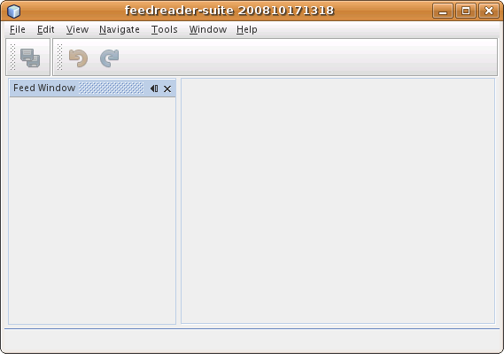

// 
//     Licensed to the Apache Software Foundation (ASF) under one
//     or more contributor license agreements.  See the NOTICE file
//     distributed with this work for additional information
//     regarding copyright ownership.  The ASF licenses this file
//     to you under the Apache License, Version 2.0 (the
//     "License"); you may not use this file except in compliance
//     with the License.  You may obtain a copy of the License at
// 
//       http://www.apache.org/licenses/LICENSE-2.0
// 
//     Unless required by applicable law or agreed to in writing,
//     software distributed under the License is distributed on an
//     "AS IS" BASIS, WITHOUT WARRANTIES OR CONDITIONS OF ANY
//     KIND, either express or implied.  See the License for the
//     specific language governing permissions and limitations
//     under the License.
//

= NetBeans Platform Feed Reader Tutorial
:jbake-type: platform_tutorial
:jbake-tags: tutorials 
:jbake-status: published
:syntax: true
:source-highlighter: pygments
:toc: left
:toc-title:
:icons: font
:experimental:
:description: NetBeans Platform Feed Reader Tutorial - Apache NetBeans
:keywords: Apache NetBeans Platform, Platform Tutorials, NetBeans Platform Feed Reader Tutorial

Welcome to the NetBeans Platform Feed Reader tutorial. The Feed Reader that you build in this tutorial is a simple RSS/Atom feed browser, modeled after the Sage plug-in for Mozilla Firefox. It presents a tree of feeds with subnodes representing individual feed entries that you can open in a browser.

To illustrate the end result, here you see the Feed Reader that you will build in this tutorial, displaying a feed entry from the  link:https://netbeans.org/rss-091.xml[NetBeans Highlights feed]:

image::images/feedreader_65-feedreader.png[]

NOTE: This document uses the NetBeans IDE 6.5 Release. If you are using an earlier version, see  link:60/nbm-feedreader.html[the 6.0/6.1 version of this document].

== Prerequisite Knowledge

You are not required to know anything about NetBeans Platform development to work on this tutorial. It would be helpful if you have some Java programming background, although even this is not essential. However, the following documents could be useful to read prior to beginning this tutorial, to give you helpful background information:

*  link:https://netbeans.apache.org/tutorials/nbm-feedreader_background.html[Preparing to Create the FeedReader Application]. This document provides the background of this tutorial. It walks you through everything you will do in this tutorial, conceptually. It also shows you where you can find the source code of the sample that you build in this tutorial.
*  link:nbm-quick-start.html[NetBeans Platform Quick Start]. This short tutorial guides you through a complete process for building a rich-client application on top of the NetBeans Platform. The major development stages and tools are covered, and an HTML Editor is the result of the tutorial.

==  Setting Up the Application

In NetBeans IDE, building an application on top of NetBeans starts with generating a large number of files which will serve as the foundation of your application. For example, the IDE provides several project wizards that set up all the basic files needed by modules and applications built on the NetBeans Platform.

* *NetBeans Platform Application.* A project that groups a set of module projects and library wrapper module projects that have dependencies on each other, and lets you deploy them together as a unit. Automatically included are a subset of the modules that make up the NetBeans Platform.
* *Module Suite.* Same as above, except that the pre-included modules are more than only those relating to the NetBeans Platform—in this case, all the modules that make up NetBeans IDE are included as well.
* *Library Wrapper Module.* A project that puts a library JAR file on its classpath and exports some or all of the JAR file's packages from the module as public packages.
* *Module.* A project for implementing the functionality, business logic, and user interface of a module or application built on the NetBeans Platform.

=== Creating the Application Skeleton

[start=1]
1. Choose File > New Project (Ctrl-Shift-N). Under Categories, select NetBeans Modules. Under Projects, select NetBeans Platform Application. You should see the following:

image::images/paintapp_paintapp-proj-wiz.png[]

Click Next.

[start=2]
1. In the Name and Location panel, type  `` feedreader-suite``  in Project Name. Change the Project Location to any directory on your computer. Click Finish.

The IDE creates the  `` feedreader-suite``  project, which looks as follows in the Projects window:

image::images/feedreader_65-suite-project.png[]

The project will contain the module project and library wrapper module projects that you will create in the following subsections.

=== Wrapping the Libraries

You could bundle the entire Feed Reader application into a single module. However, the application needs the Rome, Rome Fetcher, and JDom libraries:

* *Rome.* Reads RSS and Atom feeds, using a very simple API.
* *Rome Fetcher.* Allows the retrieval of feeds via HTTP.
* *JDom.* Is an XML parsing API. The only reason the Feed Reader will need it is because the Rome library uses it.

Later, if you want to extend the Feed Reader application with more modules that may use these libraries, it would be better for them to depend on just the library modules, rather than the entire Feed Reader. Also, library modules can be "autoloading", which means that NetBeans will only load them when needed. Until that happens, it won't take up any memory at runtime.

[start=1]
1. Right-click the Modules node in the project in the Projects window, as shown below, and click Add New Library:

image::images/feedreader_65-add-lib0.png[]

When you do so, you should see the following:

image::images/feedreader_65-lib-wiz.png[]

[start=2]
1. In the Select Library panel, shown above, browse to the folder where you downloaded JDom, and then select  `` jdom.jar``  and  `` LICENSE.txt.``  Click Next.

[start=3]
1. In the Name and Location panel, accept all the defaults. You should see the following:

image::images/feedreader_65-lib-wiz3.png[]

NOTE:  The library wrapper module project will be stored within the application project. You could also store it somewhere else, but for versioning purposes it is a good idea to put it within the application project. Therefore, the  `` feedreader-suite``  application project is selected in the Add to Module Suite drop-down.

Click Next.

[start=4]
1. In the Basic Module Configuration panel, type  ``org.myorg``  as the code name base and leave all the other defaults unchanged. You should see the following:

image::images/feedreader_65-lib-wiz4.png[]

Click Finish.

The new library wrapper module project opens in the IDE and displays in the Projects window. You should now see the following in the Projects window:

image::images/feedreader_65-lib-wiz2.png[]

[start=5]
1. Return to step 1 of this section and create a library wrapper module project for Rome. Use code name base "org.rome" and accept all the other defaults.

[start=6]
1. Return to step 1 of this section and create a library wrapper module project for Rome Fetcher. Use code name base "org.fetcher" and accept all the other defaults.

You now have an application skeleton, with three library wrapper module projects, providing many useful Java classes that you will be able to make use of throughout this tutorial.

=== Creating the Module Project

In this section, we create a project for the functionality that our application will provide. The project will make use of the classes made available by the library wrapper modules that we created in the previous section.

[start=1]
1. Right-click the Modules node in the application project in the Projects window, as shown below, and click Add New:

image::images/feedreader_65-module-project.png[]

When you do so, you should see the following:

image::images/feedreader_65-module-wiz.png[]

[start=2]
1. In the Name and Location panel, shown above, type  `` FeedReader``  in Project Name. Accept all the other defaults. Click Next.

[start=3]
1. In the Basic Module Configuration panel, type  ``org.myorg.feedreader``  in Code Name Base.

[start=4]
1. Select "Generate XML Layer". Leave the locations of both the localizing bundle and the XML layer file so that they will be stored in a package with the name  ``org/myorg/feedreader`` . You should now see the following:

image::images/feedreader_65-module-wiz-1.png[]

Click Finish.

The IDE creates the FeedReader project. The project contains all of the module's sources and project metadata, such as the project's Ant build script. The project opens in the IDE. You can view its logical structure in the Projects window (Ctrl-1) and its file structure in the Files window (Ctrl-2). The Projects window should now show the following:

image::images/feedreader_65-module.png[]

You have now created the source structure of your new application. In the next section, we will begin adding some code.

==  Creating the Feed Reader Window

In this section you use the Window Component wizard to generate files that create a custom windowing component and an action to invoke it. The wizard also registers the action as a menu item in the  `` layer.xml ``  configuration file and adds entries for serializing the windowing component. Right after finishing this section, you are shown how to try out the files that the Window Component wizard generates for you.

[start=1]
1. Right-click the  `` FeedReader``  project node and choose New > Other. Under Categories, select Module Development. Under File Types, select Window Component, as shown below:

image::images/feedreader_65-windowcomp-wiz.png[]

Click Next.

[start=2]
1. In the Basic Settings panel, select  `` explorer``  in the drop-down list and click Open on Application Start, as shown below:

image::images/feedreader_65-windowcomp-wiz2.png[]

Click Next.

[start=3]
1. In the Name and Location panel, type Feed as the Class Name Prefix and browse to the location where you saved  `` rss16.gif (
image::images/feedreader_rss16.gif[]).``  The GIF file will be shown in the menu item that invokes the action. You should now see the following:

image::images/feedreader_65-windowcomp-wiz3.png[]

Click Finish.

The following is now shown in the Projects window:

image::images/feedreader_65-windowcomp.png[]

The IDE has created the following new files:

*  `` FeedTopComponent.java.``  Defines the Feed Window.
*  `` FeedTopComponentSettings.xml.``  Specifies all the interfaces of the  `` org.myorg.feedreader``  rich-client application. Enables easy lookup of instances, without the need to instantiate each. Avoids the need to load classes or create objects and therefore improves performance. Registered in the  `` Windows2/Components``  folder of the  `` layer.xml``  file.
*  `` FeedTopComponentWstcref.xml.``  Specifies a reference to the component. Enables the component to belong to more than one mode. Registered in the  ``Windows2/Modes``  folder of the  `` layer.xml``  file.

The IDE has modified the following existing files:

* * * 
 `` project.xml.``  Two module dependencies have been added,  `` Utilities API ``  (click  link:http://bits.netbeans.org/dev/javadoc/org-openide-util/overview-summary.html[here ] for Javadoc) and  `` Window System API ``  (click  link:http://bits.netbeans.org/dev/javadoc/org-openide-windows/overview-summary.html[here] for Javadoc).
*  `` Bundle.properties.``  
 Three key-value pairs have been added:
*  ``CTL_FeedAction.``  Localizes the label of the menu item, defined in the  ``layer.xml``  file.
*  ``CTL_FeedTopComponent.``  Localizes the label of  ``FeedTopComponent.java`` .
*  ``HINT_FeedTopComponent.``  Localizes the tooltip of  ``FeedTopComponent.java`` .

Finally, three folders have been added to the  ``layer.xml``  file:

*  `` <Actions>``  
Registers the action as an action in the Window folder.
*  `` <Menu>``  
Registers the action as a menu item in the Window menu.
*  `` <Windows2> ``  Registers the  ``FeedTopComponentSettings.xml`` , which is used for looking up the windowing component. Registers the component reference file  ``FeedTopComponentWstcref.xml``  in the "explorer" area. 

== Running the Application

Without having typed a single line of code, you can already take your application for a spin. Trying it out means deploying the modules to the NetBeans Platform and then checking to see that the empty Feed Window displays correctly.

[start=1]
1. In the Projects window, right-click the  `` feedreader-suite``  project and choose Clean and Build All.

[start=2]
1. 
In the Projects window, right-click the  `` feedreader-suite``  project and choose Run.

The application starts up. You see a splash screen. Then the application opens and displays the new Feed Window, as an explorer window, shown below:

NOTE:  What you now have is an application consisting of the following modules:

* The modules provided by the NetBeans Platform, for bootstrapping the application, lifecycle management, and other infrastructural concerns.
* The three library wrapper modules that you created in this tutorial.
* The FeedReader functionality module that you created in this tutorial, for providing the Feed window.

In the application's Window menu, you should see the new menu item, which you can use for opening the Feed window, if it is closed.

As you can see, without having done any coding, we have a complete application. It doesn't do much yet, but the entire infrastructure exists and works as one would expect. Next, we begin using some of the NetBeans APIs, to add code to our application.

==  Adding Code to the Application

Now that you have laid the basis for your application, it's time to begin adding your own code. Before doing so, you need to specify the application's dependencies. Dependencies are modules that provide the NetBeans APIs that you will extend or implement. Then, you will use the New File wizard and the Source Editor to create and code the classes that make up the Feed Reader application.

=== Specifying the Application's Dependencies

You need to subclass several classes that belong to the NetBeans APIs. The classes belong to modules that need to be declared as dependencies of your Feed Reader application. Use the Project Properties dialog box for this purpose, as explained in the steps below.

[start=1]
1. In the Projects window, right-click the  ``FeedReader``  project and choose Properties. In the Project Properties dialog box, click Libraries. Notice that some APIs have already been declared as Module Dependencies, shown below:

image::images/feedreader_65-proj-props-1.png[]

The above library registrations were done for you by the Window Component wizard, earlier in this tutorial.

[start=2]
1. Click Add Dependency.

[start=3]
1. Add the following APIs:

[source,java]
----

Actions API
Datasystems API
Dialogs API
Explorer and Property Sheet API
File System API
Nodes API
rome
rome-fetcher
----

You should now see the following:

image::images/feedreader_65-proj-props-2.png[]

Click OK to exit the Project Properties dialog box.

[start=4]
1. Expand the  ``FeedReader``  project's Libraries node and notice the list of modules that are now available to this project:

image::images/feedreader_65-add-lib5.png[]

=== Setting Dependencies Between Library Wrapper Modules

Now that we have set dependencies on the NetBeans API modules that we will use, let's also set dependencies between our library wrapper modules. For example, the Rome JAR makes use of classes from the JDom JAR. Now that these are wrapped in separate library wrapper modules, we need to specify the relationship between the JARs via the library wrapper module's Project Properties dialog box.

[start=1]
1. First, lets make Rome dependent on JDom. Right-click the Rome library wrapper module project in the Projects window and choose Properties. In the Project Properties dialog box, click Libraries and then click Add Dependency. Add  ``jdom`` . You should now see the following:

image::images/feedreader_65-props-jdom.png[]

Click OK to exit the Project Properties dialog box.

[start=2]
1. Finally, since Rome Fetcher depends on both Rome and JDom, you need to make Rome Fetcher dependent on Rome, as shown below:

image::images/feedreader_65-props-rome.png[]

Because Rome already depends on JDom, you do not need to make Rome Fetcher dependent on JDom.

=== Creating the RssFeeds Folder

You will use the IDE's user interface to add a folder to the  ``layer.xml``  file. The folder will contain our RSS feed objects. Later, you will add code to  `` FeedTopComponent.java`` , which was created for you by the Window Component wizard, to view the content of this folder.

[start=1]
1. In the Projects window, expand the  `` FeedReader``  project node and then expand the XML Layer node. You should see the following nodes:

*  `` <this layer>.``  Exposes the folders provided by the current module. For example, as you can see below, the FeedReader module provides folders named Actions, Menu, and Windows2, as discussed earlier in this tutorial:

image::images/feedreader_65-feedfolder-1.png[]

*  `` <this layer in context>. ``  Exposes all the folders available to the entire application. We will look at this node later in this tutorial.

[start=2]
1. Right-click the  `` <this layer>``  node and choose New > Folder.

[start=3]
1. Type  `` RssFeeds``  in the New Folder dialog box. Click OK. You now have a new folder, as shown below:

image::images/feedreader_65-feedfolder-3.png[]

[start=4]
1. Double-click the node for the  `` layer.xml``  file so that it opens in the Source Editor. Notice that this entry has been added: `` <folder name="RssFeeds"/>`` 

=== Creating the Feed Object

Next you create a simple POJO that encapsulates a URL and its associated Rome feed.

[start=1]
1. Right-click the  `` FeedReader``  project node, choose New > Java Class.

[start=2]
1. Name the class  `` Feed``  and select  `` org.myorg.feedreader``  in the Package drop-down. Click Finish.

[start=3]
1. In the Source Editor, replace the default  `` Feed``  class with the following:

[source,java]
----

public class Feed implements Serializable {

    private static final long serialVersionUID = 1L;

    private static final FeedFetcher FEED_FETCHER =
            new HttpURLFeedFetcher(HashMapFeedInfoCache.getInstance());

    private transient SyndFeed syndFeed;
    private final URL url;
    private String name;

    public Feed(URL url) {
        this.url = url;
        name = url.toExternalForm();
    }

    public URL getURL() {
        return url;
    }

    public SyndFeed getSyndFeed() throws IOException {
        if (syndFeed == null) {
            try {
                syndFeed = FEED_FETCHER.retrieveFeed(url);
                String title = syndFeed.getTitle();
                if (title != null) {
                    name = title;
                }
            } catch (Exception ex) {
                throw (IOException) new IOException(ex.toString()).initCause(ex);
            }
        }
        return syndFeed;
    }

    @Override
    public String toString() {
        return name;
    }

}
----

A lot of code is underlined, because you have not declared their packages. You do this in the next steps.

Take the following steps to reformat the file and declare its dependencies:

[start=1]
1. Press Alt-Shift-F to format the code.

[start=2]
1. Press Ctrl-Shift-I and make sure the following import statements are selected:

image::images/feedreader_65-fix-imports-1.png[]

Click OK, and the IDE adds the following import statements to the class:

[source,java]
----

import com.sun.syndication.feed.synd.SyndFeed;
import com.sun.syndication.fetcher.FeedFetcher;
import com.sun.syndication.fetcher.impl.HashMapFeedInfoCache;
import com.sun.syndication.fetcher.impl.HttpURLFeedFetcher;
import java.io.IOException;
import java.io.Serializable;
import java.net.URL;
----

All the red underlining should now have disappeared. If not, do not continue with this tutorial until you have solved the problem.

=== Extending the Feed Window

In this section, we use a NetBeans Swing component called  ``BeanTreeView``  to display a hierarchy of feeds in our  ``TopComponent`` .

[start=1]
1. Double-click  `` FeedTopComponent.java``  and then click the Source button, so that the  ``TopComponent``  opens in the Source Editor.

[start=2]
1. Type  `` implements ExplorerManager.Provider``  at the end of the class declaration.

[start=3]
1. Press Alt-Enter in the line and click on the suggestion. The IDE adds an import statement for the required package  `` org.openide.explorer.ExplorerManager``  .

[start=4]
1. Press Alt-Enter again and click on the suggestion. The IDE implements the abstract method  `` getExplorerManager()``  .

[start=5]
1. Type  `` return manager;``  in the body of the new  `` getExplorerManager() ``  method. Press Alt-Enter in the line and let the IDE create a field called  `` manager``  for you. Replace the default definition with this one:

[source,java]
----

private final ExplorerManager manager = new ExplorerManager();
----

[start=6]
1. Right below the field declaration in the previous step, declare this one:

[source,java]
----

private final BeanTreeView view = new BeanTreeView();
----

[start=7]
1. Finally, add the following code to the end of the constructor:

[source,java]
----

setLayout(new BorderLayout());
add(view, BorderLayout.CENTER);
view.setRootVisible(true);
try {
    manager.setRootContext(new RssNode.RootRssNode());
} catch (DataObjectNotFoundException ex) {
    ErrorManager.getDefault().notify(ex);
}
ActionMap map = getActionMap();
map.put("delete", ExplorerUtils.actionDelete(manager, true));
associateLookup(ExplorerUtils.createLookup(manager, map));
----

Now a lot of code is underlined, because you have not declared their associated packages. You do this in the next steps.

Take the following steps to reformat the file and declare its dependencies:

[start=1]
1. Press Alt-Shift-F to format the code.

[start=2]
1. Press Ctrl-Shift-I, select  ``org.openide.ErrorManager`` , click OK, and the IDE adds several import statements below the package statement. The complete list of import statements should now be as follows:

[source,java]
----

import java.awt.BorderLayout;
import java.io.Serializable;
import javax.swing.ActionMap;
import org.openide.ErrorManager;
import org.openide.explorer.ExplorerManager;
import org.openide.explorer.ExplorerUtils;
import org.openide.explorer.view.BeanTreeView;
import org.openide.loaders.DataObjectNotFoundException;
import org.openide.util.NbBundle;
import org.openide.util.RequestProcessor;
import org.openide.util.Utilities;
import org.openide.windows.TopComponent;
----

[start=3]
1. Note that the line  `` manager.setRootContext(new RssNode.RootRssNode());``  is still underlined in red, because you have not created  `` RssNode.java ``  yet. This you will do in the next subsection. All other red underlining should now have disappeared. If not, do not continue with this tutorial until you have solved the problem.

=== Creating the RssNode Class

The top level node of our Feed Reader is provided by the RssNode class. The class extends  `` link:http://bits.netbeans.org/dev/javadoc/org-openide-nodes/org/openide/nodes/FilterNode.html[FilterNode]`` , which proxies the 'RssFeeds' node. Here we define a display name and we declare two menu items, 'Add' and 'Add Folder', as shown here:

image::images/feedreader_60-actions.png[]

Take the following steps to create this class:

[start=1]
1. Create  `` RssNode.java``  in the  `` org.myorg.feedreader``  package.

[start=2]
1. Replace the default class with the following:

[source,java]
----

public class RssNode extends FilterNode {

    public RssNode(Node folderNode) throws DataObjectNotFoundException {
        super(folderNode, new RssFolderChildren(folderNode));
    }

    @Override
    public Action[] getActions(boolean popup) {
    
        *//Declare our actions
        //and pass along the node's data folder:*
        DataFolder df = getLookup().lookup(DataFolder.class);
        return new Action[]{
            new AddRssAction(df), 
            new AddFolderAction(df)
        };
        
    }

    public static class RootRssNode extends RssNode {

        *//The filter node will serve as a proxy
        //for the 'RssFeeds' node, which we here
        //obtain from the NetBeans user directory:*
        public RootRssNode() throws DataObjectNotFoundException {
            super(DataObject.find(Repository.getDefault().getDefaultFileSystem().
                    getRoot().getFileObject("RssFeeds")).getNodeDelegate());
        }

        *//Set the display name of the node,
        //referring to the bundle file, and
        //a key, which we will define later:*
        @Override
        public String getDisplayName() {
            return NbBundle.getMessage(RssNode.class, "FN_title");
        }
        
    }

}
----

Several red underline markings remain in the class, because we have not created our actions yet, and because the class that defines the node's children is currently also not created.

=== Creating the RssFolderChildren Class

Next, we are concerned with the children of the "RSS/Atom Feeds" node. The children are either folders or they are feeds. That's all that happens in the code below.

Take the following steps to create this class:

[start=1]
1. Create  `` RssFolderChildren.java``  in the  `` org.myorg.feedreader``  package.

[start=2]
1. Replace the default class with the following:

[source,java]
----

public class RssFolderChildren extends FilterNode.Children {

    RssFolderChildren(Node rssFolderNode) {
        super(rssFolderNode);
    }

    @Override
    protected Node[] createNodes(Node key) {
        Node n = key;
        
        *//If we can find a data folder, then we create an RssNode,
        //if not, we look for the feed and then create a OneFeedNode:*
        try {
            if (n.getLookup().lookup(DataFolder.class) != null) {
                return new Node[]{new RssNode(n)};
            } else {
                Feed feed = getFeed(n);
                if (feed != null) {
                    return new Node[]{
                        new OneFeedNode(n, feed.getSyndFeed())
                    };
                } else {
                    // best effort
                    return new Node[]{new FilterNode(n)};
                }
            }
        } catch (IOException ioe) {
            Exceptions.printStackTrace(ioe);
        } catch (IntrospectionException exc) {
            Exceptions.printStackTrace(exc);
        }
        // Some other type of Node (gotta do something)
        return new Node[]{new FilterNode(n)};
    }

    /** Looking up a feed */
    private static Feed getFeed(Node node) {
        InstanceCookie ck = node.getCookie(InstanceCookie.class);
        if (ck == null) {
            throw new IllegalStateException("Bogus file in feeds folder: " + node.getLookup().lookup(FileObject.class));
        }
        try {
            return (Feed) ck.instanceCreate();
        } catch (ClassNotFoundException ex) {
            Exceptions.printStackTrace(ex);
        } catch (IOException ex) {
            Exceptions.printStackTrace(ex);
        }
        return null;
    }
    
}
----

Several red underline markings remain in the class, because we have not created our  ``OneFeedNode``  class yet.

=== Creating the OneFeedNode Class

Here we are concerned with the container for the article nodes, as shown below for the 'NetBeans Highlights' node:

image::images/feedreader_60-actions2.png[]

As can be seen, each of these nodes has a display name, retrieved from the feed, an icon, and a Delete menu item.

Take the following steps to create this class:

[start=1]
1. Create  `` OneFeedNode.java``  in the  `` org.myorg.feedreader``  package.

[start=2]
1. Replace the default class with the following:

[source,java]
----

public class OneFeedNode extends FilterNode {

    OneFeedNode(Node feedFileNode, SyndFeed feed) throws IOException, IntrospectionException {
        super(feedFileNode, 
                new FeedChildren(feed), 
                new ProxyLookup(
                new Lookup[]{Lookups.fixed(
                        new Object[]{feed}), 
                        feedFileNode.getLookup()
        }));
    }

    @Override
    public String getDisplayName() {
        SyndFeed feed = getLookup().lookup(SyndFeed.class);
        return feed.getTitle();
    }

    @Override
    public Image getIcon(int type) {
        return ImageUtilities.loadImage("org/myorg/feedreader/rss16.gif");
    }

    @Override
    public Image getOpenedIcon(int type) {
        return getIcon(0);
    }

    @Override
    public Action[] getActions(boolean context) {
        return new Action[]{SystemAction.get(DeleteAction.class)};
    }
    
}
----

Several red underline markings remain in the class, because we have not created our  ``FeedChildren``  class yet.

=== Creating the FeedChildren Class

In this section, we add code that will provide nodes for each of the articles provided by the feed.

Take the following steps to create this class:

[start=1]
1. Create  `` FeedChildren.java``  in the  `` org.myorg.feedreader``  package.

[start=2]
1. Replace the default class with the following:

[source,java]
----

public class FeedChildren extends Children.Keys {

    private final SyndFeed feed;

    public FeedChildren(SyndFeed feed) {
        this.feed = feed;
    }

    @SuppressWarnings(value = "unchecked")
    @Override
    protected void addNotify() {
        setKeys(feed.getEntries());
    }

    public Node[] createNodes(Object key) {
        
        *//Return new article-level nodes:*
        try {
            return new Node[]{
                new EntryBeanNode((SyndEntry) key)
            };
            
        } catch (final IntrospectionException ex) {
            Exceptions.printStackTrace(ex);
            *//Should never happen, no reason for it to fail above:*
            return new Node[]{new AbstractNode(Children.LEAF) {
                @Override
                public String getHtmlDisplayName() {
                    return "" + ex.getMessage() + "";
                }
            }};
        }
    }
}
----

Several red underline markings remain in the class, because we have not created our  ``EntryBeanNode``  class yet.

=== Creating the EntryBeanNode Class

Finally, we deal with the lowest level nodes, those that represent articles provided by the feed.

To create this class, take the following steps:

[start=1]
1. Create  `` EntryBeanNode.java``  in the  `` org.myorg.feedreader``  package.

[start=2]
1. Replace the default class with the following:

[source,java]
----

public class EntryBeanNode extends FilterNode {

    private SyndEntry entry;

    @SuppressWarnings(value = "unchecked")
    public EntryBeanNode(SyndEntry entry) throws IntrospectionException {
        super(new BeanNode(entry), Children.LEAF, 
                Lookups.fixed(new Object[]{
            entry, 
            new EntryOpenCookie(entry)
        }));
        this.entry = entry;
    }

    */** Using HtmlDisplayName ensures any HTML in RSS entry titles are
     * /**properly handled, escaped, entities resolved, etc. */*
    @Override
    public String getHtmlDisplayName() {
        return entry.getTitle();
    }

    */** Making a tooltip out of the entry's description */*
    @Override
    public String getShortDescription() {
        return entry.getDescription().getValue();
    }

    */** Providing the Open action on a feed entry */*
    @Override
    public Action[] getActions(boolean popup) {
        return new Action[]{SystemAction.get(OpenAction.class)};
    }

    @Override
    public Action getPreferredAction() {
        return (SystemAction) getActions(false) [0];
    }

    */** Specifying what should happen when the user invokes the Open action */*
    private static class EntryOpenCookie implements OpenCookie {

        private final SyndEntry entry;

        EntryOpenCookie(SyndEntry entry) {
            this.entry = entry;
        }

        public void open() {
            try {
                URLDisplayer.getDefault().showURL(new URL(entry.getUri()));
            } catch (MalformedURLException mue) {
                Exceptions.printStackTrace(mue);
            }
        }
        
    }
    
}
----

=== Creating the Add Folder Menu Item

Here we create the menu item for creating folders, that we declared earlier.

To create this class, take the following steps:

[start=1]
1. Create  `` AddFolderAction.java``  in the  `` org.myorg.feedreader``  package.

[start=2]
1. Replace the default class with the following:

[source,java]
----

public class AddFolderAction extends AbstractAction {

    private DataFolder folder;

    public AddFolderAction(DataFolder df) {
        folder = df;
        putValue(Action.NAME, NbBundle.getMessage(RssNode.class, "FN_addfolderbutton"));
    }

    public void actionPerformed(ActionEvent ae) {
        NotifyDescriptor.InputLine nd = 
                new NotifyDescriptor.InputLine(
                NbBundle.getMessage(RssNode.class, "FN_askfolder_msg"), 
                NbBundle.getMessage(RssNode.class, "FN_askfolder_title"), 
                NotifyDescriptor.OK_CANCEL_OPTION, NotifyDescriptor.PLAIN_MESSAGE);
        Object result = DialogDisplayer.getDefault().notify(nd);
        if (result.equals(NotifyDescriptor.OK_OPTION)) {
            final String folderString = nd.getInputText();
            try {
                DataFolder.create(folder, folderString);
            } catch (IOException ex) {
                Exceptions.printStackTrace(ex);
            }
        }
    }
}
----

=== Creating the Add RSS Menu Item

In this section, we create the menu item that adds new feeds.

To create this class, take the following steps:

[start=1]
1. Create  `` AddRssAction.java``  in the  `` org.myorg.feedreader``  package.

[start=2]
1. Replace the default class with the following:

[source,java]
----

public class AddRssAction extends AbstractAction {

    private DataFolder folder;

    public AddRssAction(DataFolder df) {
        folder = df;
        putValue(Action.NAME, NbBundle.getMessage(RssNode.class, "FN_addbutton"));
    }

    public void actionPerformed(ActionEvent ae) {
    
        NotifyDescriptor.InputLine nd = new NotifyDescriptor.InputLine(
                NbBundle.getMessage(RssNode.class, "FN_askurl_msg"),
                NbBundle.getMessage(RssNode.class, "FN_askurl_title"),
                NotifyDescriptor.OK_CANCEL_OPTION,
                NotifyDescriptor.PLAIN_MESSAGE);

        Object result = DialogDisplayer.getDefault().notify(nd);

        if (result.equals(NotifyDescriptor.OK_OPTION)) {
            String urlString = nd.getInputText();
            URL url;
            try {
                url = new URL(urlString);
            } catch (MalformedURLException e) {
                String message = NbBundle.getMessage(RssNode.class, "FN_askurl_err", urlString);
                Exceptions.attachLocalizedMessage(e, message);
                Exceptions.printStackTrace(e);
                return;
            }
            try {
                checkConnection(url);
            } catch (IOException e) {
                String message = NbBundle.getMessage(RssNode.class, "FN_cannotConnect_err", urlString);
                Exceptions.attachLocalizedMessage(e, message);
                Exceptions.printStackTrace(e);
                return;
            }
            Feed f = new Feed(url);
            FileObject fld = folder.getPrimaryFile();
            String baseName = "RssFeed";
            int ix = 1;
            while (fld.getFileObject(baseName + ix, "ser") != null) {
                ix++;
            }
            try {
                FileObject writeTo = fld.createData(baseName + ix, "ser");
                FileLock lock = writeTo.lock();
                try {
                    ObjectOutputStream str = new ObjectOutputStream(writeTo.getOutputStream(lock));
                    try {
                        str.writeObject(f);
                    } finally {
                        str.close();
                    }
                } finally {
                    lock.releaseLock();
                }
            } catch (IOException ioe) {
                Exceptions.printStackTrace(ioe);
            }
        }
    }    
    
    private static void checkConnection(final URL url) throws IOException {
        InputStream is = url.openStream();
        is.close();
    }
    
}
----

=== Localizing the RssNode Class

[start=1]
1. Open the  `` FeedReader``  module's  `` Bundle.properties``  file.

[start=2]
1. Add the following key-value pairs:

[source,java]
----

FN_title=RSS/Atom Feeds
FN_addbutton=Add
FN_askurl_title=New Feed
FN_askurl_msg=Enter the URL of an RSS/Atom Feed
FN_askurl_err=Invalid URL: {0}|
FN_addfolderbutton=Add Folder
FN_askfolder_msg=Enter the folder name
FN_askfolder_title=New Folder
----

Here is an explanation of the new key-value pairs, which localize strings defined in  `` RssNode.java``  :

* * FN_title.* Localizes the label of the highest node in the Feed Window.

Localization of user interface for adding a feed:

* * FN_addbutton.* Localizes the label of the Add menu item that appears in the highest node's pop-up.
* * FN_askurl_title.* Localizes the title of the New Feed dialog box.
* * FN_askurl_msg.* Localizes the message that appears in the New Feed dialog box.
* * FN_askurl_err.* Localizes the error string that is displayed if the URL is invalid.

Localization of user interface for adding a folder:

* * FN_addfolderbutton.* Localizes the label of the Add Folder menu item that appears in the highest node's pop-up.
* * FN_askfolder_msg.* Localizes the message that appears in the Add Folder dialog box.
* * FN_askfolder_title. * Localizes the title of the Add Folder dialog box.

==  Branding the Application

Now that you are at the end of the development cycle, while you are wrapping up the application, you are concerned with the following questions:

* What should the name of the application's executable be?
* What should the user see when starting up my application? A progress bar? A splash screen? Both?
* When my application starts up, what should be displayed in the title bar?
* Do I need all the menus and toolbar buttons that the NetBeans Platform provides by default?

These questions relate to branding, the activity of personalizing an application built on top of the NetBeans Platform. The IDE provides a panel in the Project Properties dialog box of application projects to help you with branding.

[start=1]
1. Right-click the  `` feedreader-suite``  project node (not the  `` FeedReader``  project node) and choose Properties. In the Project Properties dialog box, click Build.

[start=2]
1. In the Build panel, type  `` feedreader``  in Branding Name. Type  `` Feed Reader Application``  in Application Title. The value in branding name sets the executable's name, while the value in application title sets the application's title bar.

[start=3]
1. Click Browse to browse to the  `` rss16.gif``  icon (
image::images/feedreader_rss16.gif[]). The icon will be displayed in the Help > About dialog box.

You should now see the following:

image::images/feedreader_65-brand-1.png[]

[start=4]
1. In the Splash Screen panel, click Browse to browse to  `` splash.gif`` . Optionally, change the color and text size of the progress bar. Or, if you do not want a progress bar, unselect Enabled.

You should now see the following:

image::images/feedreader_65-brand-2.png[]

[start=5]
1. 
In the Window System panel, you can limit the behavior of the windows in your application:

image::images/feedreader_65-brand-3.png[]

Click OK.

[start=6]
1. Right-click the application's "Modules" node and create a new module called "Branding". In the Module Project wizard, make sure to specify that a  ``layer.xml``  file should be created, and then, once the module is created, add these entries to its  ``layer.xml``  file:

[source,xml]
----

<?xml version="1.0" encoding="UTF-8"?>
<!DOCTYPE filesystem PUBLIC "-//NetBeans//DTD Filesystem 1.1//EN" "https://netbeans.org/dtds/filesystem-1_1.dtd">
<!--
This is a `branding' layer. 
In this case, it's just hiding menu items and toolbars we don't want.
-->
<filesystem>

	<!-- hide unused toolbars -->
	<folder name="Toolbars">
		<folder name="File_hidden"/>
		<folder name="Edit_hidden"/>
	</folder>

	<folder name="Menu">
		<folder name="File">
			<file name="org-openide-actions-SaveAction.instance_hidden"/>
			<file name="org-openide-actions-SaveAllAction.instance_hidden"/>
			<file name="org-netbeans-core-actions-RefreshAllFilesystemsAction.instance_hidden"/>            
			<file name="org-openide-actions-PageSetupAction.instance_hidden"/>
			<file name="org-openide-actions-PrintAction.instance_hidden"/>
		</folder>
		<folder name="Edit_hidden"/>
		<folder name="Tools_hidden"/>
	</folder>

</filesystem>
----

Run the application and notice that your title bar, splash screen, menus, and toolbar have all been customized.

== Distributing the Application

The IDE uses an Ant build script to create a distribution of your application. The build script was created for you when you created the project.

[start=1]
1. In the Projects window, right-click the  `` FeedReader Application``  project node and choose Build ZIP Distribution. The Output window (Ctrl-4) shows you where the ZIP distribution is created.

[start=2]
1. In your filesystem, find the  `` feedreader.zip``  distribution in the  `` dist``  folder in your project directory. Unzip it. Launch the application, which you will find in the  `` bin``  folder. During start up, the splash screen is displayed. When the application has started up, go to the Help > About dialog box and notice the icon and splash screen that you specified in the <<branding,Branding the Application>> section.

When it is up and running, the Feed Reader application displays the RSS/Atom Feeds window, containing a node called RSS/Atom Feeds.

Congratulations! You have completed the FeedReader tutorial.

link:http://netbeans.apache.org/community/mailing-lists.html[Send Us Your Feedback]

