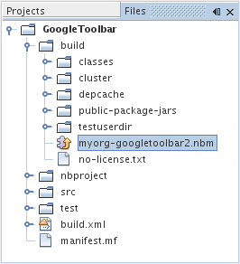

// 
//     Licensed to the Apache Software Foundation (ASF) under one
//     or more contributor license agreements.  See the NOTICE file
//     distributed with this work for additional information
//     regarding copyright ownership.  The ASF licenses this file
//     to you under the Apache License, Version 2.0 (the
//     "License"); you may not use this file except in compliance
//     with the License.  You may obtain a copy of the License at
// 
//       http://www.apache.org/licenses/LICENSE-2.0
// 
//     Unless required by applicable law or agreed to in writing,
//     software distributed under the License is distributed on an
//     "AS IS" BASIS, WITHOUT WARRANTIES OR CONDITIONS OF ANY
//     KIND, either express or implied.  See the License for the
//     specific language governing permissions and limitations
//     under the License.
//

= NetBeans プラグインクイックスタート
:jbake-type: platform_tutorial
:jbake-tags: tutorials 
:jbake-status: published
:syntax: true
:source-highlighter: pygments
:toc: left
:toc-title:
:icons: font
:experimental:
:description: NetBeans プラグインクイックスタート - Apache NetBeans
:keywords: Apache NetBeans Platform, Platform Tutorials, NetBeans プラグインクイックスタート

NetBeans プラグイン開発へようこそ

このチュートリアルでは、新しい NetBeans IDE のツールバーの作成を通して、NetBeans プラグイン開発のワークフローを簡潔に紹介します。このチュートリアルを終了すれば、NetBeans IDE のプラグインを作成、構築、およびインストールする方法に関する全般的な知識が身に付きます。

このチュートリアルを終了したら、 link:https://netbeans.apache.org/kb/docs/platform_ja.html[NetBeans プラットフォームの学習]のチュートリアルに進むことができます。学習の各チュートリアルは、さまざまな種類のアプリケーションに利用できる NetBeans API を幅広く網羅しています。このチュートリアルを省略し、「Hello World」アプリケーションを作成しないで学習のチュートリアルに進んでもかまいません。

NOTE:  このドキュメントでは NetBeans IDE 6.8 リリースを使用します。これ以前のバージョンを使用している場合、 link:67/nbm-google_ja.html[このドキュメントの 6.7 バージョン]を参照してください。

トラブルシューティングのために、 link:http://plugins.netbeans.org/PluginPortal/faces/PluginDetailPage.jsp?pluginid=13794[完了したサンプルをダウンロード]してソースを調べることもできます (任意)。

このチュートリアルで作成するツールバーは、次のようになります。

image::images/google_60_googlebar-2.png[]

ユーザーが上のツールバーで Enter キーを押すと、IDE のデフォルトブラウザが開き、ツールバーのテキストが Google 検索に送られ、開いているブラウザに結果が表示されます。このツールバーを作成するには、 link:http://bits.netbeans.org/dev/javadoc/[NetBeans API] を使用して IDE の機能セットを拡張します。具体的には、ツールバーのボタンによって呼び出されるアクションを作成します。次に、GUI コンポーネントとして  ``JLabel``  および  ``JTextField``  を含む、Swing JPanel を作成します。最後に、JPanel を返すように  link:http://bits.netbeans.org/dev/javadoc/org-openide-util/org/openide/util/actions/Presenter.Toolbar.html[ ``Presenter.Toolbar`` ] を実装して、ボタンの代わりにそれがツールバーに表示されるようにします。  

== モジュールプロジェクトの設定

モジュールの開発時には、プロジェクトの構成が正しく設定されていることを確認する必要があります。NetBeans IDE には、モジュールに必要なすべての基本ファイルを設定するための「モジュールプロジェクト」ウィザードが用意されています。

[start=1]
1. 「ファイル」>「新規プロジェクト」(Ctrl-Shift-N) を選択します。「カテゴリ」で「NetBeans モジュール」を選択します。「プロジェクト」で「モジュール」を選択します。「次へ」をクリックします。

[start=2]
1. 「名前と場所」パネルで、「プロジェクト名」フィールドに「 ``GoogleToolbar`` 」と入力します。「プロジェクトの場所」を使用コンピュータ上の任意のフォルダに変更します。「スタンドアロンモジュール」オプションはそのままにし、「主プロジェクトとして設定」チェックボックスを選択します。「次へ」をクリックします。

[start=3]
1. 「基本モジュール構成」パネルで、コード名ベースに「 ``org.myorg.googletoolbar`` 」と入力します。

[start=4]
1. 「XML レイヤーを生成」を選択します。「ローカライズ版バンドル」と「XML レイヤー」のファイルの場所は両方ともそのままにしておきます。これらは、 ``org/myorg/googletoolbar``  という名前のパッケージに格納されます。「完了」をクリックします。

IDE が  ``GoogleToolbar``  プロジェクトを作成します。このプロジェクトには、ソースや、プロジェクトの Ant 構築スクリプトなどのプロジェクトメタデータがすべて含まれます。IDE でプロジェクトが開きます。「プロジェクト」ウィンドウ (Ctrl-1) で、プロジェクトの論理構造を表示できます。また、「ファイル」ウィンドウ (Ctrl-2) で、プロジェクトのファイル構造を表示できます。

「重要なファイル」ノードを展開すると、次の内容を含む「モジュールのマニフェスト」を表示できます。

[source,java]
----

Manifest-Version: 1.0
OpenIDE-Module: org.myorg.googletoolbar
OpenIDE-Module-Layer: org/myorg/googletoolbar/layer.xml
OpenIDE-Module-Localizing-Bundle: org/myorg/googletoolbar/Bundle.properties
OpenIDE-Module-Specification-Version: 1.0
----

NetBeans に固有のこれらのマニフェストキーの詳細については、 link:http://bits.netbeans.org/dev/javadoc/org-openide-modules/org/openide/modules/doc-files/api.html[NetBeans Modules API] の Javadoc の説明をお読みください。 
 

== モジュールのコーディング

モジュールをコーディングするには、次の手順を完了する必要があります。

* <<creating-action,アクションの作成>>
* <<creating-panel,JPanel の作成>>
* <<resolving-errors,エラーの解決>>
* <<overriding,getToolbarPresenter() のオーバーライド>>

=== アクションの作成

[start=1]
1. プロジェクトノードを右クリックし、「新規」>「アクション」を選択します。「アクション」が表示されない場合は、「その他」を選択し、「新規ファイル」ウィザードの「カテゴリ」で「モジュールの開発」を選択します。「次へ」をクリックします。

[start=2]
1. 「アクションの種類」パネルはデフォルト設定のままにします。IDE は、次に示すような  ``ActionListener``  のサブクラスのアクションを作成します。 
image::images/google_65_action-wiz-1.png[] 「次へ」をクリックします。

[start=3]
1. 「GUI の登録」パネルで、「カテゴリ」ドロップダウンリストから「ファイル」を選択します。「カテゴリ」ドロップダウンリストは、IDE のキーボードショートカットエディタでアクションが表示される場所を制御します。次に、「大域メニュー項目」を選択解除し、「大域ツールバーボタン」を選択します。次に示すように、「ツールバー」ドロップダウンリストで「ファイル」を選択し、「位置」ドロップダウンリストで_ドロップダウンリストの任意の位置_を選択します。 
image::images/google_65_action-wiz-2.png[] 「次へ」をクリックします。

[start=4]
1. 
「名前と場所」パネルで、「クラス名」に「 ``GoogleAction`` 」と入力し、「表示名」に「 ``Google Action`` 」と入力します。16x16 ピクセル寸法のアイコンを参照します。実際は、アイコンは使用せず、その代わりに次の節で作成する JPanel フォームを表示します。ただし、「新規アクション」ウィザードではアイコンの指定を求められます。実際に使用しないので、どの寸法のアイコンでもかまいません。「完了」をクリックします。

NOTE:  「プロジェクト」ウィンドウの  ``org.myorg.googletoolbar``  パッケージに  ``GoogleAction.java``  が追加されます。

=== JPanel の作成

この節では、JPanel を作成します。これは、アプリケーションのメインツールバーの一部として表示されるツールバーです。

[start=1]
1. プロジェクトノードを右クリックし、「新規」>「その他」を選択します。「カテゴリ」で「Swing GUI フォーム」を選択します。「プロジェクト」で「JPanel フォーム」を選択します。「次へ」をクリックします。

[start=2]
1. 「名前と場所」パネルで、「クラス名」に「 ``GooglePanel`` 」と入力し、ドロップダウンリストからパッケージを選択します。「完了」をクリックします。 ``GooglePanel.java``  がパッケージに追加され、ソースエディタの「デザイン」ビューで開きます。

[start=3]
1. JPanel の右下隅にカーソルを置き、JPanel を選択してカーソルをドラッグし、次に示すように、サイズをツールバーの幅と長さに合うように変更します。 
image::images/google_60_jpanel-2.png[]

[start=4]
1. パレット (Ctrl-Shift-8) から、JTextField 項目と JLabel 項目を JPanel に直接ドラッグします。次に、JPanel とほかの 2 つの項目をサイズ変更し、それらがぴったり合うようにします。最後に、JLabel をクリックしてテキストを  ``Google:``  に変更し、JTextField のデフォルトの文字列を削除します。これで、JPanel は次に示す図のようになっているはずです。 
image::images/google_60_jpanel-3.png[]

[start=5]
1. プロパティーのインスペクタが開いていることを確認します (「ウィンドウ」>「ナビゲート」>「インスペクタ」)。次に、JTextField を右クリックし、「イベント」>「Key」>「keyTyped」を選択します。これによって、次に示すように、ソースエディタに表示される  ``GooglePanel.java``  ソースコードに  ``jTextField1KeyTyped()``  メソッドが生成されます。 
image::images/google_60_jpanel-4.png[]

[start=6]
1. ソースエディタの  ``GooglePanel.java``  の「ソース」表示で、 ``jTextField1KeyTyped()``  メソッドに、次のように入力 (*太字*で表示されたテキストを挿入) します。

[source,java]
----

    
private void jTextField1KeyTyped(java.awt.event.KeyEvent evt) {
    *int i = evt.getKeyChar();
    if (i==10){//ENTER キー
        // Ｇoogle URL を表示
        try{
            URLDisplayer.getDefault().showURL
                    (new URL("http://www.google.com/search?hl=en&amp;q="+jTextField1.getText()+"&amp;btnG=Google+Search"));
        } catch (Exception eee){
            return;//何もしない
        }
    }*
}
----

必要がある場合は、ソースエディタを右クリックし、「整形」(Alt-Shift-F) を選択します。

=== エラーの解決

赤いアンダーラインの付いた 1 行のコードは、エラーがあることを示します。これは、必要なパッケージがまだインポートされていないためです。 ``URLDisplayer``  の赤いラインのすぐ左の列に表示された電球アイコンの上に、カーソルを置きます。エラーの理由を示すツールチップが表示されます。 

image::images/google_60_tooltip.png[]

これを解決するためには、プロジェクトにアクセス可能な  link:http://bits.netbeans.org/dev/javadoc/org-openide-awt/org/openide/awt/package-summary.html[ ``org.openide.awt`` ] パッケージに含まれている  `` link:http://bits.netbeans.org/dev/javadoc/org-openide-awt/org/openide/awt/HtmlBrowser.URLDisplayer.html[HtmlBrowser.URLDisplayer]``  クラスを作成する必要があります。これを行うには、次の手順に従います。

[start=1]
1. 「プロジェクト」ウィンドウでプロジェクトのノードを右クリックし、「プロパティー」を選択します。表示される「プロジェクトプロパティー」ダイアログで、「カテゴリ」見出しの下の「ライブラリ」を選択します。「モジュールの依存関係」の下の、「追加」ボタンをクリックします。「モジュールの依存関係を追加」ダイアログが表示されます。

[start=2]
1. 「モジュールの依存関係を追加」ダイアログの最上部に表示された「フィルタ」テキストボックスに「 `` link:http://bits.netbeans.org/dev/javadoc/org-openide-awt/org/openide/awt/HtmlBrowser.URLDisplayer.html[URLDisplayer]`` 」と入力すると、返されるモジュールの選択肢が絞られ、 link:http://bits.netbeans.org/dev/javadoc/org-openide-awt/overview-summary.html[UI ユーティリティー API] のみが表示されます。 
image::images/google_60_add-module-dependency.png[] 「了解」をクリックします。再度「了解」をクリックして「プロジェクトプロパティー」ダイアログを終了します。

[start=3]
1. 「ソースエディタ」を右クリックし、「インポートを修正」(Alt-Shift-F) を選択します。「すべてのインポートを修正」ダイアログが表示され、未知のクラスに対する候補のパスが一覧表示されます。 
image::images/google_60_fix-all-imports.png[] 「了解」をクリックします。IDE によって  ``GooglePanel.java``  に次のインポート文が作成されます。

[source,java]
----

import java.net.URL;
import  link:http://bits.netbeans.org/dev/javadoc/org-openide-awt/org/openide/awt/HtmlBrowser.URLDisplayer.html[org.openide.awt.HtmlBrowser.URLDisplayer];
            
----

また、ソースエディタからすべてのエラーがなくなります。

=== Presenter.Toolbar の実装

作成した JPanel は、Google ツールバーを表示する実際のコンポーネントであるため、これをツールバーに表示するように  `` link:http://bits.netbeans.org/dev/javadoc/org-openide-util/org/openide/util/actions/Presenter.Toolbar.html[Presenter.Toolbar]``  を実装する必要があります。 ``GoogleAction.java``  で、次のことを行います。

[start=1]
1.  ``GoogleAction.java``  を開き、その内容が次のようになっていることを確認します。

[source,java]
----

    
package org.myorg.googletoolbar;

import java.awt.event.ActionEvent;
import java.awt.event.ActionListener;

public final class GoogleAction implements ActionListener {

    public void actionPerformed(ActionEvent e) {
        // TODO implement action body
    }
    
}
----

[start=2]
1. ツールバーに表示されるようにアクションを行うため、署名を変更して、 `` link:http://bits.netbeans.org/dev/javadoc/org-openide-util/org/openide/util/actions/Presenter.Toolbar.html[Presenter.Toolbar]``  も実装されるようにします。

[source,java]
----

package org.myorg.googletoolbar;

import java.awt.event.ActionEvent;
import java.awt.event.ActionListener;

public final class GoogleAction implements Presenter.Toolbar, ActionListener {

    Component comp  = new GooglePanel();

    @Override
    public void actionPerformed(ActionEvent e) {
        // TODO アクション本文を実装
    }

    @Override
    public Component getToolbarPresenter() {
        return comp;
    }

}
----

[start=3]
1.  ``layer.xml``  ファイルを開くと、次のように表示されます。

[source,xml]
----

    
<?xml version="1.0" encoding="UTF-8"?>
<!DOCTYPE filesystem PUBLIC "-//NetBeans//DTD Filesystem 1.2//EN" "https://netbeans.org/dtds/filesystem-1_2.dtd">
<filesystem>
    <folder name="Actions">
        <folder name="File">
            <file name="org-myorg-googletoolbar-GoogleAction.instance">
                <attr name="SystemFileSystem.localizingBundle" stringvalue="org.myorg.googletoolbar.Bundle"/>
                <attr name="delegate" newvalue="org.myorg.googletoolbar.GoogleAction"/>
                <attr name="displayName" bundlevalue="org.myorg.googletoolbar.Bundle#CTL_GoogleAction"/>
                <attr name="iconBase" stringvalue="org/myorg/googletoolbar/icon.png"/>
                <attr name="instanceCreate" methodvalue="org.openide.awt.Actions.alwaysEnabled"/>
                <attr name="noIconInMenu" stringvalue="false"/>
            </file>
        </folder>
    </folder>
    <folder name="Toolbars">
        <folder name="File">
            <file name="org-myorg-googletoolbar-GoogleAction.shadow">
                <attr name="originalFile" stringvalue="Actions/File/org-myorg-googletoolbar-GoogleAction.instance"/>
                <attr name="position" intvalue="0"/>
            </file>
        </folder>
    </folder>
</filesystem>
----

[start=4]
1. 前述の内容は、「新規アクション」ウィザードによって作成されます。ここではアクションクラスのインスタンスを作成しないため、「instanceCreate」属性は削除します。代わりに JPanel をここに表示します。

この節では、JTextField と JLabel を表示する JPanel を作成しました。JTextField で Enter キーを押すと、その内容が Google 検索に送られます。HTML ブラウザが開き、Google 検索の結果が表示されます。 ``layer.xml``  ファイルに登録されているように、アクションクラスは、アプリケーションのツールバー内に JPanel を統合するために使用されます。

== モジュールのコンパイル、インストール、および使用

NetBeans IDE では、Ant 構築スクリプトを使用して、IDE でモジュールをコンパイル、およびインストールします。構築スクリプトは、前述の<<creating-module-project,モジュールプロジェクトの設定>>でのモジュールプロジェクトの作成時に作成されます。これで、モジュールのコンパイルおよび IDE への追加の準備ができました。NetBeans IDE の Ant のサポートを使用して、実行できます。

[start=1]
1. 「プロジェクト」ウィンドウで、「 ``GoogleToolbar`` 」プロジェクトノードを右クリックし、「実行」を選択します。モジュールが構築され、IDE の新しいインスタンス (つまり、ターゲットプラットフォーム) にインストールされます。デフォルトでは、デフォルトターゲットプラットフォームは、現在使用している IDE のバージョンです。ターゲットプラットフォームが開き、新規モジュールを試すことができます。

[start=2]
1. インストールが正しく行われると、モジュールによって IDE の「編集」ツールバーに新しいボタンが追加されます。

*注:* ツールバーボタンにはアイコンが表示されません。代わりに、前述の <<creating-panel,JPanel の作成>>で作成した JPanel が表示されます。 

image::images/google_60_googlebar.png[]

[start=3]
1. テキストフィールドに検索文字列を入力します。 
image::images/google_60_googlebar-2.png[]

[start=4]
1. Enter キーを押します。「オプション」ウィンドウで IDE のデフォルトのブラウザを設定している場合は、そのブラウザが起動します。Google URL と検索文字列がブラウザに送信され、検索が実行されます。検索結果が返されると、その結果をブラウザで見ることができます。

== モジュールの共有

これで IDE を拡張する作業モジュールが構築できました。これをほかの開発者と共有してみましょう。NetBeans IDE には、バイナリ NetBeans Module ファイル (.nbm) を作成するための簡単な方法があります。これは、IDE の独自のバージョンでの実験を他者に許可する汎用的な手段で、具体的には、前述の<<compiling,モジュールのコンパイル、インストール、および使用>>で行なったことです。

モジュールバイナリを作成するには、次の手順に従います。

「プロジェクト」ウィンドウで  ``GoogleToolbar``  プロジェクトのノードを右クリックし、「NBM を作成」を選択します。新規 NBM ファイルが作成され、「ファイル」ウィンドウ (Ctrl-2) で確認できます。 

 

link:http://netbeans.apache.org/community/mailing-lists.html[ ご意見をお寄せください]

== 関連項目

これで NetBeans プラグインクイックスタートを終了します。このドキュメントでは、IDE に Google 検索ツールバーを追加するプラグインの作成方法について説明しました。プラグインの作成と開発の詳細については、次のリソースを参照してください。

*  link:https://netbeans.apache.org/kb/docs/platform_ja.html[NetBeans プラットフォームの学習]

*  link:http://bits.netbeans.org/dev/javadoc/[NetBeans API Javadoc]

* このチュートリアルで使用する NetBeans API クラスは次のとおりです。
*  `` link:http://bits.netbeans.org/dev/javadoc/org-openide-awt/org/openide/awt/HtmlBrowser.URLDisplayer.html[HtmlBrowser.URLDisplayer]`` 
*  `` link:http://bits.netbeans.org/dev/javadoc/org-openide-util/org/openide/util/actions/Presenter.Toolbar.html[Presenter.Toolbar]`` 
