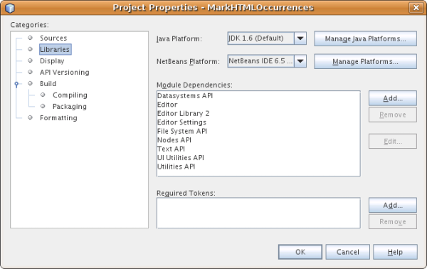

// 
//     Licensed to the Apache Software Foundation (ASF) under one
//     or more contributor license agreements.  See the NOTICE file
//     distributed with this work for additional information
//     regarding copyright ownership.  The ASF licenses this file
//     to you under the Apache License, Version 2.0 (the
//     "License"); you may not use this file except in compliance
//     with the License.  You may obtain a copy of the License at
// 
//       http://www.apache.org/licenses/LICENSE-2.0
// 
//     Unless required by applicable law or agreed to in writing,
//     software distributed under the License is distributed on an
//     "AS IS" BASIS, WITHOUT WARRANTIES OR CONDITIONS OF ANY
//     KIND, either express or implied.  See the License for the
//     specific language governing permissions and limitations
//     under the License.
//

= NetBeans Mark Occurrences Module Tutorial
:jbake-type: platform_tutorial
:jbake-tags: tutorials 
:jbake-status: published
:syntax: true
:source-highlighter: pygments
:toc: left
:toc-title:
:icons: font
:experimental:
:description: NetBeans Mark Occurrences Module Tutorial - Apache NetBeans
:keywords: Apache NetBeans Platform, Platform Tutorials, NetBeans Mark Occurrences Module Tutorial

This tutorial demonstrates how to create a NetBeans module that highlights all instances of a selected word in an HTML file.

Optionally, for troubleshooting purposes, you can  link:http://plugins.netbeans.org/PluginPortal/faces/PluginDetailPage.jsp?pluginid=2761[download the completed sample].

== Introduction to Highlight Layers

In this tutorial, you implement several classes provided by the  link:http://bits.netbeans.org/dev/javadoc/org-netbeans-modules-editor-lib2/org/netbeans/spi/editor/highlighting/package-summary.html[NetBeans Highlighting SPI]. The two principle classes in this context are as follows:

* * link:http://bits.netbeans.org/dev/javadoc/org-netbeans-modules-editor-lib2/org/netbeans/spi/editor/highlighting/HighlightsLayer.html[Highlight Layer]*. Defines a set of highlights used for rendering a document.
* * link:http://bits.netbeans.org/dev/javadoc/org-netbeans-modules-editor-lib2/org/netbeans/spi/editor/highlighting/HighlightsLayerFactory.html[Highlight Layer Factory]*. Defines a MIME-specific factory for creating highlight layers.

The above two classes need to be registered in the module's  ``layer.xml``  file, within the editor folder of the relevant MIME-type.

=== Getting to Know the Sample

Take the following steps to install the sample:

[start=1]
1.  link:http://plugins.netbeans.org/PluginPortal/faces/PluginDetailPage.jsp?pluginid=14144[Download the completed sample] from the Plugin Portal and install it in the IDE.

[start=2]
1. In the New Project wizard, you will find the sample here:

image::images/mark-occs_65-new-project-wizard.png[]

[start=3]
1. Complete the wizard and your project source structure will be as follows:

image::images/mark-occs_65-proj-wiz-final.png[]

[start=4]
1. Right-click the project node and choose Run. A new instance of the IDE opens and the module is installed.

[start=5]
1. Verify that the module is correctly installed by opening an HTML source file. Select a word and notice that all instances of the word are highlighted:

image::images/mark-occs_65-result.png[]

Now that you know what the end result looks like, you will create the module from scratch and learn about each part while creating it.

== Setting up the Module Project

Before you start writing the module, you have to make sure you that your project is set up correctly. The IDE provides a wizard that sets up all the basic files needed for a module.

[start=1]
1. Choose File > New Project (Ctrl+Shift+N). Under Categories, select NetBeans Modules. Under Projects, select Module. Click Next.

[start=2]
1. In the Name and Location panel, type  ``MarkHTMLOccurrences``  in the Project Name field. Change the Project Location to any directory on your computer. Leave the Standalone Module option and Set as Main Project checkbox selected. Click Next.

[start=3]
1. In the Basic Module Configuration panel, type  ``org.netbeans.modules.markhtmloccurrences``  in Code Name Base.

[start=4]
1. Select "Generate XML Layer". Leave the locations of both the localizing bundle and the XML layer file so that they will be stored in a package with the name  ``org/netbeans/modules/markhtmloccurrences`` . Click Finish.

The IDE creates the  ``MarkHTMLOccurrences``  project. The project contains all of your sources and project metadata, such as the project's Ant build script. The project opens in the IDE. You can view its logical structure in the Projects window (Ctrl-1) and its file structure in the Files window (Ctrl-2).

== Creating the Highlight Layer and Factory

Next, we will implement the Highlighting SPI. The SPI's classes are as follows:

|===
|Class |Description 

| link:http://bits.netbeans.org/dev/javadoc/org-netbeans-modules-editor-lib2/org/netbeans/spi/editor/highlighting/HighlightsLayerFactory.html[HighlightsLayerFactory] |Defines the factory for creating highlight layers. 

| link:http://bits.netbeans.org/dev/javadoc/org-netbeans-modules-editor-lib2/org/netbeans/spi/editor/highlighting/HighlightsLayerFactory.Context.html[HighlightsLayerFactory.Context] |Defines the context passed to the factory when the factory is asked to create highlight layers. 

| link:http://bits.netbeans.org/dev/javadoc/org-netbeans-modules-editor-lib2/org/netbeans/spi/editor/highlighting/HighlightsContainer.html[HighlightsContainer] |Defines the container of highlighted areas and related attributes. 

| link:http://bits.netbeans.org/dev/javadoc/org-netbeans-modules-editor-lib2/org/netbeans/spi/editor/highlighting/HighlightsLayer.html[HighlightsLayer] |Defines the highlight layer, consisting of attributes. 

| link:http://bits.netbeans.org/dev/javadoc/org-netbeans-modules-editor-lib2/org/netbeans/spi/editor/highlighting/ZOrder.html[ZOrder] |Defines position of highlight layer in relation to other highlight layers. 

| link:http://bits.netbeans.org/dev/javadoc/org-netbeans-modules-editor-lib2/org/netbeans/spi/editor/highlighting/support/OffsetsBag.html[OffsetsBag] |Defines a set of highlighted areas specified by their offsets in the document. 
|===

=== Specifying the Module's Dependencies

You will need to subclass several classes that belong to  link:http://bits.netbeans.org/dev/javadoc/index.html[NetBeans APIs]. Each has to be declared as a Module dependency. Use the Project Properties dialog box for this purpose.

[start=1]
1. In the Projects window, right-click the  ``MarkHTMLOccurrences``  project node and choose Properties. In the Project Properties dialog box, click Libraries.

[start=2]
1. For each of the following APIs, click "Add...", select the name from the Module list, and then click OK to confirm it:

[start=3]
1. Click OK to exit the Project Properties dialog box.

[start=4]
1. In the Projects window, expand the Important Files node, double-click the Project Metadata node, and note the long list of APIs that you selected have been declared as module dependencies.

=== Creating the Highlight Layer Factory

Highlight layer factories are defined by the  link:http://bits.netbeans.org/dev/javadoc/org-netbeans-modules-editor-lib2/org/netbeans/spi/editor/highlighting/package-summary.html[Highlighting SPI].

To use the Highlighting SPI to create the palette in this tutorial, take the following steps:

[start=1]
1. Right-click the  ``MarkHTMLOccurrences``  project node and choose New > Java Class. Create a Java file called  ``MarkHTMLOccurrencesHighlightsLayerFactory`` .

[start=2]
1. Replace the default content of the  ``MarkHTMLOccurrencesHighlightsLayerFactory.java``  file with the following:

[source,java]
----

import javax.swing.text.Document;
import  link:http://bits.netbeans.org/dev/javadoc/org-netbeans-modules-editor-lib2/org/netbeans/spi/editor/highlighting/HighlightsLayer.html[org.netbeans.spi.editor.highlighting.HighlightsLayer];
import  link:http://bits.netbeans.org/dev/javadoc/org-netbeans-modules-editor-lib2/org/netbeans/spi/editor/highlighting/HighlightsLayerFactory.html[org.netbeans.spi.editor.highlighting.HighlightsLayerFactory];
import  link:http://bits.netbeans.org/dev/javadoc/org-netbeans-modules-editor-lib2/org/netbeans/spi/editor/highlighting/ZOrder.html[org.netbeans.spi.editor.highlighting.ZOrder];

public class MarkHTMLOccurrencesHighlightsLayerFactory implements  link:http://bits.netbeans.org/dev/javadoc/org-netbeans-modules-editor-lib2/org/netbeans/spi/editor/highlighting/HighlightsLayerFactory.html[HighlightsLayerFactory] {

    public static MarkHTMLOccurrencesHighlighter getMarkOccurrencesHighlighter(Document doc) {
        MarkHTMLOccurrencesHighlighter highlighter =
               (MarkHTMLOccurrencesHighlighter) doc.getProperty(MarkHTMLOccurrencesHighlighter.class);
        if (highlighter == null) {
            doc.putProperty(MarkHTMLOccurrencesHighlighter.class,
               highlighter = new MarkHTMLOccurrencesHighlighter(doc));
        }
        return highlighter;
    }

    @Override
    public HighlightsLayer[]  link:http://bits.netbeans.org/dev/javadoc/org-netbeans-modules-editor-lib2/org/netbeans/spi/editor/highlighting/HighlightsLayerFactory.html#createLayers(org.netbeans.spi.editor.highlighting.HighlightsLayerFactory.Context)[createLayers]( link:http://bits.netbeans.org/dev/javadoc/org-netbeans-modules-editor-lib2/org/netbeans/spi/editor/highlighting/HighlightsLayerFactory.Context.html[Context] context) {
        return new HighlightsLayer[]{
link:http://bits.netbeans.org/dev/javadoc/org-netbeans-modules-editor-lib2/org/netbeans/spi/editor/highlighting/HighlightsLayer.html#create(java.lang.String,%20org.netbeans.spi.editor.highlighting.ZOrder,%20boolean,%20org.netbeans.spi.editor.highlighting.HighlightsContainer)[HighlightsLayer.create](
                    MarkHTMLOccurrencesHighlighter.class.getName(),
link:http://bits.netbeans.org/dev/javadoc/org-netbeans-modules-editor-lib2/org/netbeans/spi/editor/highlighting/ZOrder.html[ZOrder.CARET_RACK.forPosition(2000)],
                    true,
link:http://bits.netbeans.org/dev/javadoc/org-netbeans-modules-editor-lib2/org/netbeans/spi/editor/highlighting/HighlightsContainer.html[getMarkOccurrencesHighlighter(context.getDocument()).getHighlightsBag()])
                };
    }

}
----

=== Creating the Highlight Layer

In this...

[source,java]
----

import java.awt.Color;
import java.lang.ref.WeakReference;
import java.util.regex.Matcher;
import java.util.regex.Pattern;
import javax.swing.JEditorPane;
import javax.swing.event.CaretEvent;
import javax.swing.event.CaretListener;
import javax.swing.text.AttributeSet;
import javax.swing.text.Document;
import javax.swing.text.JTextComponent;
import javax.swing.text.StyleConstants;
import  link:http://bits.netbeans.org/dev/javadoc/org-netbeans-modules-editor-settings/org/netbeans/api/editor/settings/AttributesUtilities.html[org.netbeans.api.editor.settings.AttributesUtilities];
import  link:http://bits.netbeans.org/dev/javadoc/org-netbeans-modules-editor/org/netbeans/modules/editor/NbEditorUtilities.html[org.netbeans.modules.editor.NbEditorUtilities];
import  link:http://bits.netbeans.org/dev/javadoc/org-netbeans-modules-editor-lib2/org/netbeans/spi/editor/highlighting/support/OffsetsBag.html[org.netbeans.spi.editor.highlighting.support.OffsetsBag];
import  link:http://bits.netbeans.org/dev/javadoc/org-openide-text/org/openide/cookies/EditorCookie.html[org.openide.cookies.EditorCookie];
import  link:http://bits.netbeans.org/dev/javadoc/org-openide-loaders/org/openide/loaders/DataObject.html[org.openide.loaders.DataObject];
import  link:http://bits.netbeans.org/dev/javadoc/org-openide-util/org/openide/util/RequestProcessor.html[org.openide.util.RequestProcessor];

public class MarkHTMLOccurrencesHighlighter implements CaretListener {

    private static final AttributeSet defaultColors =
            AttributesUtilities.createImmutable(StyleConstants.Background,
            new Color(236, 235, 163));
    private final OffsetsBag bag;
    private JTextComponent comp;
    private final WeakReference<Document> weakDoc;

    private RequestProcessor.Task task = null;
    private final static int DELAY = 100;

    public MarkHTMLOccurrencesHighlighter(Document doc) {
        bag = new OffsetsBag(doc);
        weakDoc = new WeakReference<Document>((Document) doc);
        DataObject dobj = NbEditorUtilities.getDataObject(weakDoc.get());
        EditorCookie pane = dobj.getCookie(EditorCookie.class);
        JEditorPane[] panes = pane.getOpenedPanes();
        if (panes != null &amp;&amp; panes.length > 0) {
            comp = panes[0];
            comp.addCaretListener(this);
        }
    }

    @Override
    public void caretUpdate(CaretEvent e) {
        bag.clear();
        scheduleUpdate();
    }

    public void scheduleUpdate() {
        if (task == null) {
            task = RequestProcessor.getDefault().create(new Runnable() {
                @Override
                public void run() {
                    String selection = comp.getSelectedText();
                    if (selection != null) {
                        Pattern p = Pattern.compile(selection);
                        Matcher m = p.matcher(comp.getText());
                        while (m.find() == true) {
                            int startOffset = m.start();
                            int endOffset = m.end();
                            bag.addHighlight(startOffset, endOffset, defaultColors);
                        }
                    }
                }
            }, true);
            task.setPriority(Thread.MIN_PRIORITY);
        }
        task.cancel();
        task.schedule(DELAY);
    }

    public OffsetsBag getHighlightsBag() {
        return bag;
    }

}
----

== Registering the Highlight Layer

In this section, we register the menu item and code snippets in the  ``layer.xml``  file.

Add the following tags to the  ``layer.xml``  file, between the <filesystem> tags:

[source,xml]
----

<folder name="Editors">
    <folder name="text">
        <folder name="html">
            <file name="org-netbeans-modules-markhtmloccurrences-MarkHTMLOccurrencesHighlightsLayerFactory.instance"/>
        </folder>
        <folder name="xml">
            <file name="org-netbeans-modules-markhtmloccurrences-MarkHTMLOccurrencesHighlightsLayerFactory.instance"/>
        </folder>
    </folder>
</folder>
----

The above tags will result in HTML files, as well as XML files, to have the functionality provided by the above two registered classes—the highlight layer and its factory. 

== Building and Installing the Module

The IDE uses an Ant build script to build and install your module. The build script is created for you when you create the module project.

=== Installing and Using the Module

[start=1]
1. In the Projects window, right-click the  ``MarkHTMLOccurrences``  project and choose Run.

The module is built and installed in the target platform. The target platform opens so that you can try out your new module. The default target platform is the installation used by the current instance of the development IDE.

[start=2]
1. Verify that the module is correctly installed by using it as shown in <<installing-sample,Installing the Sample>>.

=== Creating a Shareable Module Binary

[start=1]
1. In the Projects window, right-click the the project node and choose Create NBM.

The NBM file is created and you can view it in the Files window (Ctrl-2).

[start=2]
1. Make the module available to others by uploading it to the  link:http://plugins.netbeans.org[Plugin Portal].

[start=3]
1. The recipient can install the module by using the Plugin Manager. Choose Tools > Plugins from the main menu.

link:http://netbeans.apache.org/community/mailing-lists.html[Send Us Your Feedback]

== Next Steps

For more information about creating and developing NetBeans modules, see the following resources:

*  link:https://netbeans.apache.org/kb/docs/platform.html[Other Related Tutorials]

*  link:http://bits.netbeans.org/dev/javadoc/index.html[NetBeans API Javadoc]

== Versioning

|===
|*Version* |*Date* |*Changes* |*Open Issues* 

|1 |5 November 2008 |Initial version |... 

|2 |16 November 2008 |Added more details, including more links to Javadoc. |Need to add inline comments for the two classes. 
|===
