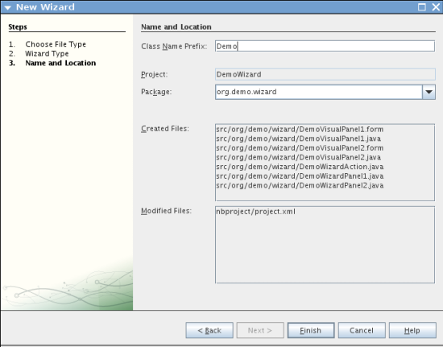

// 
//     Licensed to the Apache Software Foundation (ASF) under one
//     or more contributor license agreements.  See the NOTICE file
//     distributed with this work for additional information
//     regarding copyright ownership.  The ASF licenses this file
//     to you under the Apache License, Version 2.0 (the
//     "License"); you may not use this file except in compliance
//     with the License.  You may obtain a copy of the License at
// 
//       http://www.apache.org/licenses/LICENSE-2.0
// 
//     Unless required by applicable law or agreed to in writing,
//     software distributed under the License is distributed on an
//     "AS IS" BASIS, WITHOUT WARRANTIES OR CONDITIONS OF ANY
//     KIND, either express or implied.  See the License for the
//     specific language governing permissions and limitations
//     under the License.
//

= NetBeans ウィザードモジュールのチュートリアル
:jbake-type: platform_tutorial
:jbake-tags: tutorials 
:jbake-status: published
:syntax: true
:source-highlighter: pygments
:toc: left
:toc-title:
:icons: font
:experimental:
:description: NetBeans ウィザードモジュールのチュートリアル - Apache NetBeans
:keywords: Apache NetBeans Platform, Platform Tutorials, NetBeans ウィザードモジュールのチュートリアル

このチュートリアルでは、 link:http://bits.netbeans.org/dev/javadoc/org-openide-dialogs/org/openide/package-summary.html[NetBeans のダイアログ API] のウィザードクラスが提供する、主な機能の使用方法について学習します。

NetBeans プラットフォームアプリケーションでは、さまざまな種類のウィザードを作成できます。「新規プロジェクト」ダイアログに表示するウィザードを作成する場合は、「 link:https://netbeans.apache.org/tutorials/nbm-projectsamples.html[プロジェクトのサンプルモジュールのチュートリアル]」を参照してください。「新規ファイル」ダイアログに表示するウィザードを作成する場合は、「 link:https://netbeans.apache.org/tutorials/nbm-filetemplates_ja.html[ファイルテンプレートモジュールのチュートリアル]」を参照してください。このチュートリアルでは、ツールバーでボタンをクリックしたときに表示される一般的なウィザードを作成します。

==  モジュールプロジェクトの作成

はじめに、「新規モジュールプロジェクト」ウィザードを実行します。最終的に、すべての NetBeans モジュールに必要な、いくつかのデフォルトファイルを持つ基本的なソース構造を作成します。

[start=1]
1. 「ファイル」>「新規プロジェクト」(Ctrl-Shift-N) を選択します。「カテゴリ」で「NetBeans モジュール」を選択します。「プロジェクト」で「モジュール」を選択します。「次へ」をクリックします。

[start=2]
1. 「名前と場所」パネルで、「プロジェクト名」フィールドに「 ``DemoWizard`` 」と入力します。「プロジェクトの場所」を使用コンピュータ上の任意のフォルダに変更します。「スタンドアロンモジュール」オプションはそのままにし、「主プロジェクトとして設定」チェックボックスを選択します。「次へ」をクリックします。

[start=3]
1. 「基本モジュール構成」パネルで、コード名ベースに「 ``org.demo.wizard`` 」と入力します。

[start=4]
1. 「XML レイヤーを生成」を選択します。「ローカライズ版バンドル」と「XML レイヤー」のファイルの場所は両方ともそのままにしておきます。これらは、 ``org/demo/wizard``  という名前のパッケージに格納されます。「完了」をクリックします。

IDE によって  ``DemoWizard``  プロジェクトが作成されます。このプロジェクトには、ソースや、プロジェクトの Ant 構築スクリプトなどのプロジェクトメタデータがすべて含まれます。IDE でプロジェクトが開きます。「プロジェクト」ウィンドウ (Ctrl-1) で、プロジェクトの論理構造を表示できます。また、「ファイル」ウィンドウ (Ctrl-2) で、プロジェクトのファイル構造を表示できます。

== ウィザードインフラストラクチャーの作成

この節では、「ウィザード」ウィザードを使用して、モジュールにウィザードのスタブを追加します。

[start=1]
1. 「プロジェクト」ウィンドウで「DemoWizard」プロジェクトノードを右クリックし、「新規」>「その他」を選択して、「モジュールの開発」>「ウィザード」を選択します。

image::images/wizard_wizard-wizard.png[]

「次へ」をクリックします。

[start=2]
1. 「ウィザードの種類」パネルで、「ウィザードパネルの数」フィールドに「2」と入力し、その他の値はそのままにします。

image::images/wizard_wizard-wizard-3.png[]

前出のパネルのフィールドは次のようになります。

* *登録の種類。* ユーザーがウィザードにアクセスする場所を指定します。「カスタム」を選択した場合、「ウィザード」ウィザードは新しいアクションクラスを作成します。これは、ウィザードを開いたり、初期化したりするのに使用できます。「新規ファイル」を作成した場合、「ウィザード」ウィザードは、モジュールの  ``layer.xml``  ファイルにウィザードを登録します。
* *ウィザードステップのシーケンス。* ウィザードをリニアにするか、またはウィザードでの選択によって、ウィザードのユーザーがウィザードの手順をスキップできるようにするかを指定します。リニアウィザードは「静的」で、これがデフォルトです。一方、手順をスキップできるウィザードにはカスタム反復子クラスが必要で、これは「動的」を選択した場合に作成されます。
* *ウィザードパネルの数。* 作成するウィザードパネルの数を指定します。ウィザードの各手順で、ビューとコントローラの 2 つの Java ファイルが作成されます。

「次へ」をクリックします。

[start=3]
1. 「名前と場所」パネルで、「クラス名の接頭辞」に「 ``Demo`` 」と入力し、「パッケージ」ドロップダウンリストから主パッケージを選択します。

「完了」をクリックします。

「プロジェクト」ウィンドウは、次のようになっているはずです。

image::images/wizard_projects-window.png[]

== ウィザードのアクションクラスの登録

この節では、アクションクラスを変更し、 ``layer.xml``  ファイルに登録します。

[start=1]
1.  ``DemoWizardAction.java``  ファイルを開き、すべてのコードを次のコードに置き換えます。

[source,java]
----

package org.demo.wizard;

import java.awt.Component;
import java.awt.Dialog;
import java.awt.event.ActionEvent;
import java.awt.event.ActionListener;
import java.text.MessageFormat;
import javax.swing.JComponent;
import org.openide.DialogDisplayer;
import org.openide.WizardDescriptor;

public final class DemoWizardAction implements ActionListener {

    private WizardDescriptor.Panel[] panels;

    public void actionPerformed(ActionEvent e) {
        WizardDescriptor wizardDescriptor = new WizardDescriptor(getPanels());
        // {0} は WizardDesriptor.Panel.getComponent().getName() によって置き換えられる
        wizardDescriptor.setTitleFormat(new MessageFormat("{0}"));
        wizardDescriptor.setTitle("Your wizard dialog title here");
        Dialog dialog = DialogDisplayer.getDefault().createDialog(wizardDescriptor);
        dialog.setVisible(true);
        dialog.toFront();
        boolean cancelled = wizardDescriptor.getValue() != WizardDescriptor.FINISH_OPTION;
        if (!cancelled) {
            // 何らかの処理
        }
    }

    /**
     * 個々のウィザードの手順を表すパネルを初期化し、
      * ウィザードの見た目に影響を与えるプロパティーを設定。
     */
    private WizardDescriptor.Panel[] getPanels() {
        if (panels == null) {
            panels = new WizardDescriptor.Panel[]{
                        new DemoWizardPanel1(),
                        new DemoWizardPanel2()
                    };
            String[] steps = new String[panels.length];
            for (int i = 0; i < panels.length; i++) {
                Component c = panels[i].getComponent();
                // パネルのコンポーネント名に対するデフォルト手順名。
                // 主に、手順のリストに表示するターゲット選択用ダイアログの名前を取得するのに役立つ。
                steps[i] = c.getName();
                if (c instanceof JComponent) { // assume Swing components
                    JComponent jc = (JComponent) c;
                    // コンポーネントの手順の数を設定
                    // TODO org.openide.dialogs >= 7.8 を使用する場合、WizardDescriptor.PROP_*: を使用できる
                    jc.putClientProperty("WizardPanel_contentSelectedIndex", new Integer(i));
                    // パネルの手順の名前を設定
                    jc.putClientProperty("WizardPanel_contentData", steps);
                    // 各手順のサブタイトルの作成をオン
                    jc.putClientProperty("WizardPanel_autoWizardStyle", Boolean.TRUE);
                    // 背景の画像とともに左側に手順を表示
                    jc.putClientProperty("WizardPanel_contentDisplayed", Boolean.TRUE);
                    // すべての手順の番号付けをオン
                    jc.putClientProperty("WizardPanel_contentNumbered", Boolean.TRUE);
                }
            }
        }
        return panels;
    }

    public String getName() {
        return "Start Sample Wizard";
    }

}

----

 ``CallableSystemAction``  の代わりに  ``ActionListener``  を実装している以外は、生成されたのと同じコードを使用します。 ``ActionListener``  は標準の JDK クラスですが、 ``CallableSystemAction``  はそうではないため、このようにしています。NetBeans プラットフォーム 6.5 以降では、より便利でコードが少なくて済む、標準の JDK クラスを代わりに使用できます。

[start=2]
1. 次のように、アクションクラスを  ``layer.xml``  ファイルに登録します。

[source,xml]
----

<filesystem>
    <folder name="Actions">
        <folder name="File">
            <file name="org-demo-wizard-DemoWizardAction.instance">
                <attr name="delegate" newvalue="org.demo.wizard.DemoWizardAction"/>
                <attr name="iconBase" stringvalue="org/demo/wizard/icon.png"/>
                <attr name="instanceCreate" methodvalue="org.openide.awt.Actions.alwaysEnabled"/>
                <attr name="noIconInMenu" stringvalue="false"/>
            </file>
        </folder>
    </folder>
    <folder name="Toolbars">
        <folder name="File">
            <file name="org-demo-wizard-DemoWizardAction.shadow">
                <attr name="originalFile" stringvalue="Actions/File/org-demo-wizard-DemoWizardAction.instance"/>
                <attr name="position" intvalue="0"/>
            </file>
        </folder>
    </folder>
</filesystem>

----

「iconBase」要素は、主パッケージの「icon.png」という画像を指しています。その名前を付けた独自の画像を使用する場合、サイズが 16x16 ピクセルであることを確認してください。または、次の画像を使用してください。
image::images/wizard_icon.png[]

[start=3]
1. モジュールを実行します。アプリケーションが起動し、 ``layer.xml``  ファイルで指定した場所に、ツールバーのボタンが表示されるはずです。

image::images/wizard_result-1.png[]

ボタンをクリックするとウィザードが表示されます。

image::images/wizard_result-2.png[]

「次へ」をクリックすると、最後のパネルで「完了」ボタンが有効になっています。

image::images/wizard_result-3.png[]

これで、ウィザードのインフラストラクチャーが機能するようになりました。次に、内容をいくつか追加してみましょう。

== ウィザードの内容の設計

この節では、ウィザードに内容を追加し、基本的な機能をカスタマイズします。

[start=1]
1.  ``DemoWizardAction.java``  ファイルを開き、さまざまなカスタマイズプロパティーをウィザードに設定できることを確認してください。

image::images/wizard_wizard-tweaking.png[]

これらのプロパティーについては、 link:http://ui.netbeans.org/docs/ui_apis/wide/index.html[ここ]を参照してください。

[start=2]
1.  ``DemoWizardAction.java``  で、 ``wizardDescriptor.setTitle``  を次のように変更します。

[source,java]
----

wizardDescriptor.setTitle("Music Selection");

----

[start=3]
1.  ``DemoVisualPanel1.java``  ファイルと  ``DemoVisualPanel2.java``  ファイルを開き、「Matisse」GUI ビルダーを使用して、次のような Swing コンポーネントをいくつか追加します。

image::images/wizard_panel-1-design.png[]

image::images/wizard_panel-2-design.png[]

ここでは、いくつかの Swing コンポーネントを持つ、 ``DemoVisualPanel1.java``  ファイルと  ``DemoVisualPanel2.java``  ファイルを確認できます。

[start=4]
1. 「ソース」ビューで 2 つのパネルを開き、 ``getName()``  メソッドをそれぞれ「Name and Address」および「Musician Details」に変更します。

[start=5]
1. 
モジュールを再実行します。ウィザードを開くと、追加した Swing コンポーネントと、行なったカスタマイズに応じて、次のようなものが表示されるはずです。

image::images/wizard_result-4.png[]

前出のウィザードにある左サイドバーの画像は、 ``DemoWizardAction.java``  ファイルで次のように設定されています。

[source,java]
----

wizardDescriptor.putProperty("WizardPanel_image", ImageUtilities.loadImage("org/demo/wizard/banner.png", true));

----

これで、ウィザードの内容が設計されました。次に、ユーザーが入力するデータを処理するコードをいくつか追加してみましょう。

== ユーザーデータの処理

この節では、ユーザーのデータをパネル間で受け渡す方法と、「完了」をクリックしたときに結果を表示する方法について学習します。

[start=1]
1.  ``WizardPanel``  クラスで、 ``storeSettings``  メソッドを使用して、ビジュアルパネルに設定されたデータを取得します。たとえば、 ``DemoVisualPanel1.java``  ファイルに取得メソッドを作成し、 ``DemoWizardPanel1.java``  ファイルから次のようにアクセスします。

[source,java]
----

public void storeSettings(Object settings) {
    ((WizardDescriptor) settings).putProperty("name", ((DemoVisualPanel1)getComponent()).getNameField());
    ((WizardDescriptor) settings).putProperty("address", ((DemoVisualPanel1)getComponent()).getAddressField());
}

----

[start=2]
1. 次に、 ``DemoWizardAction.java``  ファイルを使用して、設定したプロパティーを取得し、何か操作を行います。

[source,java]
----

public void actionPerformed(ActionEvent e) {
    WizardDescriptor wizardDescriptor = new WizardDescriptor(getPanels());
    // は次で置き換えられます: WizardDesriptor.Panel.getComponent().getName()
    wizardDescriptor.setTitleFormat(new MessageFormat("{0}"));
    wizardDescriptor.setTitle("Music Selection");
    Dialog dialog = DialogDisplayer.getDefault().createDialog(wizardDescriptor);
    dialog.setVisible(true);
    dialog.toFront();
    boolean cancelled = wizardDescriptor.getValue() != WizardDescriptor.FINISH_OPTION;
    if (!cancelled) {
        *String name = (String) wizardDescriptor.getProperty("name");
        String address = (String) wizardDescriptor.getProperty("address");
        DialogDisplayer.getDefault().notify(new NotifyDescriptor.Message(name + " " + address));*
    }
}

----

 ``NotifyDescriptor``  は、コード補完ボックスに示すように、ほかの方法にも使用できます。

image::images/wizard_notifydescriptor.png[]

これで、ユーザーが入力したデータを処理する方法を学習しました。 

== ユーザーデータの検査

この節では、ウィザードの「次へ」がクリックされたときに、ユーザーの入力を検査する方法を学習します。

[start=1]
1.  ``DemoWizardPanel1``  で、 ``WizardDescriptor.Panel``  の代わりに  ``WizardDescriptor.ValidatingPanel``  を実装して、クラスの署名を変更します。

[source,java]
----

public class DemoWizardPanel1 implements WizardDescriptor.ValidatingPanel

----

[start=2]
1. クラスの最上位で、 ``JComponent``  宣言を型指定宣言に変更します。

[source,java]
----

private DemoVisualPanel1 component;

----

[start=3]
1. 次のように、必要な抽象メソッドを実装します。

[source,java]
----

@Override
public void validate() throws WizardValidationException {

    String name = component.getNameTextField().getText();
    if (name.equals("")){
        throw new WizardValidationException(null, "Invalid Name", null);
    }

}

----

[start=4]
1. モジュールを実行します。「Name」フィールドに何も入力せずに「次へ」をクリックすると、次のような結果が表示されるはずです。検査の結果がエラーであったため、次のパネルに移動することもできません。

image::images/wizard_validation1.png[]

[start=5]
1. 必要に応じて、名前フィールドが空の場合に「次へ」ボタンを無効にすることができます。クラスの最上位で、boolean の宣言から始めます。

[source,java]
----

private boolean isValid = true;

----

次のように、 ``isValid()``  をオーバーライドします。

[source,java]
----

@Override
public boolean isValid() {
    return isValid;
}

----

 ``validate()``  が呼び出されたとき、つまり「次へ」ボタンがクリックされたときに、false を返します。

[source,java]
----

@Override
public void validate() throws WizardValidationException {

    String name = component.getNameTextField().getText();
    if (name.equals("")) {
        *isValid = false;*
        throw new WizardValidationException(null, "Invalid Name", null);
    }

}

----

または、boolean の初期状態を false に設定します。次に  ``DocumentListener``  を実装してフィールドにリスナーを追加し、ユーザーがフィールドに何かを入力したときに boolean を true に設定して  ``isValid()``  を呼び出します。

これで、ユーザーが入力したデータを検査する方法を学習しました。

ユーザー入力の検査の詳細については、このチュートリアルの最後にある Tom Wheeler のサンプルを参照してください。 

== 再起動時のデータ持続

この節では、アプリケーションが閉じるときにデータを格納する方法、および新しく開始したあとでウィザードが開くときにデータを取得する方法を学習します。

[start=1]
1.  ``DemoWizardPanel1.java``  で、 ``readSettings``  メソッドと  ``storeSettings``  メソッドを次のようにオーバーライドします。

[source,java]
----

*JTextField nameField = ((DemoVisualPanel1) getComponent()).getNameTextField();
JTextField addressField = ((DemoVisualPanel1) getComponent()).getAddressTextField();*

@Override
public void readSettings(Object settings) {
    *nameField.setText(NbPreferences.forModule(DemoWizardPanel1.class).get("namePreference", ""));
    addressField.setText(NbPreferences.forModule(DemoWizardPanel1.class).get("addressPreference", ""));*
}

@Override
public void storeSettings(Object settings) {
    ((WizardDescriptor) settings).putProperty("name", nameField.getText());
    ((WizardDescriptor) settings).putProperty("address", addressField.getText());
    *NbPreferences.forModule(DemoWizardPanel1.class).put("namePreference", nameField.getText());
    NbPreferences.forModule(DemoWizardPanel1.class).put("addressPreference", addressField.getText());*
}

----

[start=2]
1. モジュールを再実行し、ウィザードの最初のパネルで名前とアドレスを入力します。

image::images/wizard_nbpref1.png[]

[start=3]
1. アプリケーションを閉じ、「ファイル」ウィンドウを開いて、アプリケーションの  ``build``  フォルダ内のプロパティーファイルを確認します。設定が次のようになっているはずです。

image::images/wizard_nbpref2.png[]

[start=4]
1. アプリケーションを再実行し、次にウィザードを開いたとき、前に指定した設定が、ウィザード内のフィールドの値を定義するために自動的に使用されます。

これで、再起動時にウィザードのデータを持続する方法を学習しました。 

== ウィザードのブランディング

この節では、ウィザードのインフラストラクチャーによって提供される「次へ」ボタンの文字列を、「詳細」にブランディングします。

「ブランディング」という用語は、カスタマイズの意味で使われます。「国際化」や「ローカリゼーション」が別の言語に翻訳することを指すのに対し、通常同じ言語間の小さな変更のことを意味します。NetBeans モジュールのローカリゼーションについては、 link:http://translatedfiles.netbeans.org/index-l10n.html[ここを参照]してください。

[start=1]
1. 「ファイル」ウィンドウで、アプリケーションの  ``branding``  フォルダを展開し、強調表示されているフォルダとファイルを作成します。

image::images/wizard_branding-1.png[]

[start=2]
1. ファイルの内容を次のように定義します。

[source,java]
----

CTL_NEXT=&amp;Advance >

----

そのほかの文字列は次のようにブランディングしてもかまいません。

[source,java]
----

CTL_CANCEL
CTL_PREVIOUS
CTL_FINISH
CTL_ContentName

----

「CTL_ContentName」キーはデフォルトで「Steps」に設定されています。これは、「WizardPanel_autoWizardStyle」プロパティーが「FALSE」に設定されていない場合、ウィザードの左側のパネルで使用されます。

[start=3]
1. アプリケーションを実行すると、「次へ」ボタンが「詳細」にブランディングされます。

image::images/wizard_branding-2.png[]

必要に応じて、前に説明したように「 ``DemoWizardAction.java`` 」ファイルを使用して、次のようにウィザードの左側をすべて削除します。

[source,java]
----

 wizardDescriptor.putProperty("WizardPanel_autoWizardStyle", Boolean.FALSE);

----

この設定を行うと、ウィザードは次のように表示されます。

image::images/wizard_branding-3.png[]

これで、ウィザードのインフラストラクチャーで定義された文字列を、独自のバージョンにブランディングする方法を学習しました。 

== 参考情報

関連情報のいくつかは、オンラインで入手できます。

* Tom Wheeler の NetBeans のサイト (次の画像をクリック):

[.feature]
--
image::images/wizard_tom.png[role="left", link="http://www.tomwheeler.com/netbeans/"]
--

これは NetBeans 5.5 向けに書かれたものですが、前出のサンプルは、JDK 1.6 を使用する Ubuntu Linux 上の NetBeans IDE 6.5.1 でも正しく使用できます。

このサンプルは、特にユーザーデータの検査方法を示す場合に役立ちます。

* Geertjan のブログ:
*  link:http://blogs.oracle.com/geertjan/entry/how_wizards_work[ウィザードの仕組み: パート 1 — はじめに]
*  link:http://blogs.oracle.com/geertjan/entry/how_wizards_work_part_2[ウィザードの仕組み: パート 2 — さまざまなタイプ]
*  link:http://blogs.oracle.com/geertjan/entry/how_wizards_work_part_3[ウィザードの仕組み: パート 3 — 最初のウィザード]
*  link:http://blogs.oracle.com/geertjan/entry/how_wizards_work_part_4[ウィザードの仕組み: パート 4 — 独自の反復子]
*  link:http://blogs.oracle.com/geertjan/entry/how_wizards_work_part_5[ウィザードの仕組み: パート 5 — 既存のパネルの再使用と埋め込み]
*  link:http://blogs.oracle.com/geertjan/entry/creating_a_better_java_class[優れた Java クラスウィザードの作成]

== 変更履歴

|===
|*バージョン* |*日付* |*変更内容* 

|1 |2009 年 3 月 31 日 |初期バージョン。内容

* [.line-through]#ユーザー入力の検査に関する節を追加。#
* [.line-through]#ウィザードからまたはウィザードへのデータの格納および取得に関する節を追加。#
* WizardDescriptor プロパティーをすべてリストした表を追加。
* ウィザードの API クラスをすべてリストおよび説明した表を追加。
* Javadoc へのリンクを追加。
 

|2 |2009 年 4 月 1 日 |検査に関する節を追加。「次へ」ボタンを無効にするコードを追加。持続に関する節も追加。 

|3 |2009 年 4 月 10 日 |Tom Wheeler のコメントを統合し、ローカリゼーションの情報がある場所への参照を追加して、ブランディングの節を実際のブランディングの内容になるよう書き換え。 
|===
