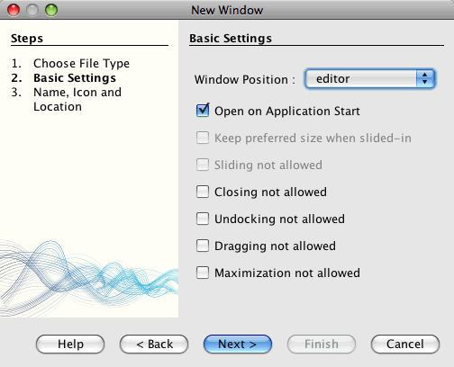
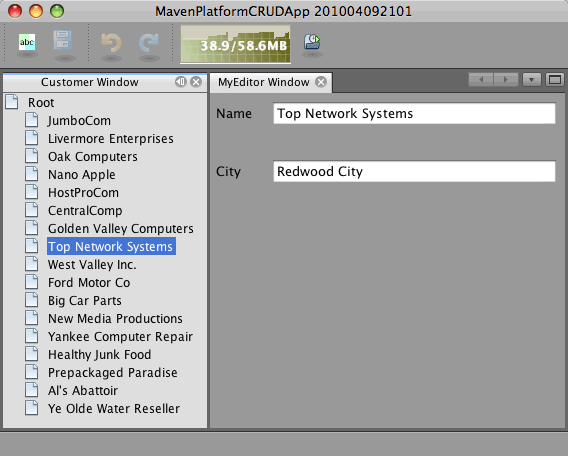

// 
//     Licensed to the Apache Software Foundation (ASF) under one
//     or more contributor license agreements.  See the NOTICE file
//     distributed with this work for additional information
//     regarding copyright ownership.  The ASF licenses this file
//     to you under the Apache License, Version 2.0 (the
//     "License"); you may not use this file except in compliance
//     with the License.  You may obtain a copy of the License at
// 
//       http://www.apache.org/licenses/LICENSE-2.0
// 
//     Unless required by applicable law or agreed to in writing,
//     software distributed under the License is distributed on an
//     "AS IS" BASIS, WITHOUT WARRANTIES OR CONDITIONS OF ANY
//     KIND, either express or implied.  See the License for the
//     specific language governing permissions and limitations
//     under the License.
//

= Creating NetBeans Platform CRUD Application Using Maven
:jbake-type: platform_tutorial
:jbake-tags: tutorials 
:jbake-status: published
:syntax: true
:source-highlighter: pygments
:toc: left
:toc-title:
:icons: font
:experimental:
:description: Creating NetBeans Platform CRUD Application Using Maven - Apache NetBeans
:keywords: Apache NetBeans Platform, Platform Tutorials, Creating NetBeans Platform CRUD Application Using Maven

Welcome to the  link:https://netbeans.apache.org/platform/[*NetBeans Platform*]!

This document demonstrates how to use the Maven build framework to create a simple NetBeans Platform application that can read and write to a database. In this document you will use Maven archetypes to create the NetBeans Platform application and module, and the Swing UI toolkit and "Matisse" GUI Builder to create window components.

This document is based on the Ant-based  link:nbm-crud.html[NetBeans CRUD Application Tutorial for NetBeans Platform] and illustrates some of the differences between using Ant and Maven to develop NetBeans Platform applications. After you understand how Maven is different from Ant, you can easily proceed through other tutorials on the  link:https://netbeans.apache.org/kb/docs/platform.html[NetBeans Platform Learning Trail].

The CRUD Sample Application is one of the Maven samples available in the New Project wizard.

If you are new to the NetBeans Platform, you might want to watch the screencast series  link:https://netbeans.apache.org/tutorials/nbm-10-top-apis.html[Top 10 NetBeans APIs].

NOTE: 

* The JavaDB database server and a sample database is included with the bundled GlassFish Server Open Source Edition 3.0.1.
* You do not need to download a separate version of the NetBeans Platform to develop applications for the NetBeans Platform. Typically, you develop the applications and modules in the NetBeans IDE and then only include the modules that are necessary to run the NetBeans Platform and your application.

Before starting this tutorial you may want to familiarize yourself with the following documentation.

*  link:http://wiki.netbeans.org/MavenBestPractices[Best Practices for Apache Maven in NetBeans 6.x]
*  link:http://www.sonatype.com/books/maven-book/reference/introduction.html[Chapter 1. Introducing Apache Maven] (from  link:http://www.sonatype.com/books/maven-book/reference/public-book.html[Maven: The Definitive Guide])
*  link:https://netbeans.apache.org/kb/docs/java/gui-functionality.html[Introduction to GUI Building]

== Configuring Maven

If this is your first Maven project you will want to check the Maven configuration settings in the Options window. To complete this tutorial you must have Maven installed on your local system. You can download the installer from the  link:http://maven.apache.org/[Maven site].

[start=1]
1. Select the Miscellaneous category in the Options window and click the Maven tab.

[start=2]
1. Specify the location of your local Maven installation (requires 2.0.9 or newer).

[start=3]
1. Check that the location of the local Maven repository is correct.

[start=4]
1. Click OK.

In most cases, if your Maven configuration is typical the information in the Options window should already be correct.

The IDE uses Maven SCM to checkout Maven artifacts. You might want to check that any clients necessary for checking out sources are installed on your local machine and configured correctly.

For details on Maven SCM, see the  link:http://maven.apache.org/scm/index.html[Maven SCM page].

=== Viewing the Maven Repositories

The artifacts that are used by Maven to build all your projects are stored in your local Maven repository. When an artifact is declared as a project dependency, the artifact is downloaded to your local repository from one of the registered remote repositories.

The NetBeans repository and several well-known indexed Maven repositories are registered and listed in the Repository Browser window by default. The NetBeans repository contains most of the public artifacts necessary for you to build your project. You can use the Maven Repository Browser to view the contents of your local and remote repositories. You can expand the Local Repository node to see the artifacts that are present locally. The artifacts listed under the NetBeans repository nodes can be added as project dependencies, but not all of them are present locally. They are only added to the Local Repository when they are declared as project dependencies.

To open the Maven Repository Browser:

* Choose Window > Other > Maven Repository Browser from the main menu.

image::images/maven-quickstart68_maven-nbm-netbeans-repo.png[title="Screenshot of Maven Repository Browser"]

When your cursor is over an artifact, the IDE displays a tooltip with the artifact's coordinates. You can view additional details about an artifact by double-clicking the artifact's JAR file in the browser.

You can search for an artifact by clicking the Find button in the toolbar of the Maven Repository Browser or by using the Quicksearch textfield in the main toolbar.

For more about managing Maven classpath dependencies and working with Maven repositories in the IDE, see the  link:http://wiki.netbeans.org/MavenBestPractices#Dependency_management[Dependency Management] section of  link:http://wiki.netbeans.org/MavenBestPractices[Best Practices for Apache Maven in NetBeans 6.x].

To see a demonstration of using the Artifact Viewer, see the  link:https://netbeans.apache.org/kb/docs/java/maven-dependencies-screencast.html[ Working with Maven Dependencies] screencast.

== Creating the NetBeans Platform Application Project

In this section you use the New Project wizard to create a NetBeans Platform Application from a Maven archetype. The wizard will create the Maven module projects that you need to develop a NetBeans Platform application. You will also use the New Project wizard to create the NetBeans module.

=== Creating the Project

Perform the following steps to create the NetBeans Platform application using the New Project wizard.

[start=1]
1. Choose File > New Project (Ctrl-Shift-N) to open the New Project wizard.

[start=2]
1. Select Maven NetBeans Application from the Maven category. Click Next.

[start=3]
1. Type *MavenPlatformCRUDApp* for the Project Name and set the Project Location. Click Finish.

*Note.* You can click Next and create a module project in the wizard when you create the platform application, but for demonstration purposes in this tutorial you will create the application and module separately.

image::images/maven-crud_mavencrud-new-project.png[title="Screenshot of New Project wizard"]

When you click Finish, by default the IDE creates the following Maven project types.

* *NetBeans Platform Application.* This project is a container project for the Platform application and lists the modules to include and the location of the project's repositories. This project does not contain any sources. The IDE generates the modules containing the sources and resources in sub-directories of this project.
* *NetBeans Platform based application.* This project specifies the artifacts (sources) needed for compiling the application. The required dependencies (IDE artifacts, module artifacts) are specified in the  ``pom.xml``  file of the project.
* *Platform application branding resources.* This project contains the resources used for branding the application.

image::images/maven-crud_mavencrud-projects-window1.png[title="Project structure in Projects window"]

*Notes.*

* If this is your first NetBeans Platform application using Maven, it can take some time to create the projects because the IDE needs to download any necessary artifacts from the NetBeans repository.
* When you create the project, you will see that some of the projects (for example, the NetBeans Platform based application project) are badged because some dependencies declared in the  ``pom.xml``  file (POM) are unavailable.

=== Creating a Module

In this exercise you will use the New Project wizard to create a NetBeans module.

[start=1]
1. Choose File > New Project (Ctrl-Shift-N) to open the New Project wizard.

[start=2]
1. Select Maven NetBeans Module from the Maven category. Click Next.

[start=3]
1. Type *MavenPlatformCRUDApp-dbaccess* for the Project Name.

[start=4]
1. Specify the Project Location by clicking Browse and locating the directory *MavenPlatformCRUDApp*. Click Open.
image::images/maven-crud_mavencrud-select-location.png[title="Select Project Location dialog showing project directory"]

[start=5]
1. Click Finish.

When you click Finish, the wizard creates a NetBeans module project named *MavenPlatformCRUDApp-dbaccess*. The module is automatically configured to be included in the application when you save it in a sub-directory. If you open the POM for the project, you can see that the MavenPlatformCRUDApp is declared as the parent project.

[source,xml]
----

<parent>
    <artifactId>MavenPlatformCRUDApp</artifactId>
    <groupId>com.mycompany</groupId>
    <version>1.0-SNAPSHOT</version>
</parent>
<artifactId>MavenPlatformCRUDApp-dbaccess</artifactId>
<packaging>nbm</packaging>
<version>1.0-SNAPSHOT</version>
<name>MavenPlatformCRUDApp - dbaccess NetBeans Module</name>

----

You can change the display name for the module by editing the  ``<name>``  element in the POM or by modifying the name in the project's Properties window. The default display name is the project's artifactId  ``MavenPlatformCRUDApp-dbaccess`` .

If you look at the POM for the NetBeans Platform Application under the Project Files node in the Projects window, you can see that three modules are listed as modules in the application.

[source,xml]
----

<modules>
   <module>branding</module>
   <module>application</module>
   <module>MavenPlatformCRUDApp-dbaccess</module>
</modules>

----

=== Making the Module a Dependency

You now need to add the module as a dependency of the NetBeans Platform based application. You can add the dependency by editing  ``pom.xml``  in the editor or by using the Add Dependency dialog box.

[start=1]
1. Expand the *NetBeans Platform based application* node in the Projects window.

[start=2]
1. Right-click the Libraries node and choose Add Dependency.

[start=3]
1. Click the Open Projects tab and select *MavenPlatformCRUDApp - dbaccess*. Click OK.
image::images/maven-crud_mavencrud-add-dependency1.png[title="Open Projects tab in Add Dependency dialog"]

If you expand the Libraries node of the NetBeans Platform based application in the Projects window, you can see that MavenPlatformCRUDApp-dbaccess is now listed as a dependency.

If you look at the POM of the NetBeans Platform based application, you can see that the module artifact  ``MavenPlatformCRUDApp-dbaccess``  is listed as a required dependency for compiling the application. The artifact will be available after you build the module project and install the artifact in your local repository.

[source,xml]
----

<dependency>
    <groupId>${project.groupId}</groupId>
    <artifactId>*MavenPlatformCRUDApp-dbaccess*</artifactId>
    <version>${project.version}</version>
</dependency>
----

=== Branding the Application

The branding module specifies the branding resources that are used when building the Platform application. The branding dialog enables you to easily specify the name of the application, the splash screen and the application icon and to modify the values of text elements.

In this exercise you will replace the default splash image. By default the branding module generated by the IDE contains an image that is displayed when the platform application starts. You can replace this with a different image by performing the following steps.

[start=1]
1. Right-click the *Platform application branding resources* module in the Projects window and choose Branding.

[start=2]
1. In the Splash Screen tab, specify an image to use as the splash screen by clicking the Browse button next to the default splash screen image and locating the image you want to use. Click OK.

For example, you can copy the image below to your local system and specify the image in the Branding dialog.

image::images/maven-crud_splash-crud.gif[title="Example of default splash image"]

When you launch the application, the new image will appear during startup.

== Creating the Entity Classes

In this section you will generate some entity classes from tables in the Java DB database. To create the entity classes and to use the Java Persistence API (JPA) in your application, you need to have access to a database server and the JPA persistence provider libraries. This tutorial uses the JavaDB database server, but you can configure the application to use other database servers.

The easiest way to make the resources available is to register an instance of GlassFish Server Open Source Edition 3.0.1 that is bundled with the IDE. The Java DB database server, a sample database and the JPA persistence provider are included with the GlassFish server. Before you create the entity classes, start the Java DB by performing the following steps.

[start=1]
1. In the Services window, expand the Servers node and check that a GlassFish instance is registered.

[start=2]
1. Expand the Database node, right-click the database connection node for the *app* database on Java DB ( ``jdbc:derby://localhost:1527/sample [app on APP]`` ) and choose Connect.

When you choose Connect, the IDE will start the database if not already started.

=== Adding the DerbyClient as a Runtime Dependency

In this section you will add the derbyclient-10.5.3.0_1 library as a dependency.

[start=1]
1. Right-click the Libraries node of the *dbaccess* module and choose Add Dependency.

[start=2]
1. Add the library by typing *org.apache.derby* for the GroupId, *derbyclient* for the ArtifactId and *10.5.3.0_1* for the Version.

[start=3]
1. Select *Runtime* from the Scope dropdown list. Click OK.
image::images/maven-crud_mavencrud-add-dependency-derby.png[title="Adding derbyclient JAR in Add Dependency dialog"]

If you expand the Runtime Libraries node in the Projects window, you can see that the  ``derbyclient``  library is listed as a dependency.

You can also modify the POM in the editor to specify the value of the  ``<scope>``  element of a dependency.

[source,xml]
----

<dependency>
            <groupId>org.apache.derby</groupId>
            <artifactId>derbyclient</artifactId>
            <version>10.5.3.0_1</version>
            <scope>runtime</scope>
        </dependency>
----

=== Generating Entity Classes From the Database

In this section you will use a wizard to generate entity classes in the *dbaccess* module.

[start=1]
1. Right-click the Source Packages of the *dbaccess* module and choose New > Other.

[start=2]
1. Select Entity Classes from Database in the Persistence category. Click Next.

[start=3]
1. Select the Java DB sample database from the Database Connection dropdown list.

[start=4]
1. Select the Customer table from the Available Tables list and click Add. When you click Add, the related table DiscountCode is also added to the list of Selected Tables list. Click Next.

[start=5]
1. Type *com.mycompany.mavenplatformcrudapp.dbaccess* for the Package name. Make sure that Create Perisistence Unit and Generate Named Query Annotations are selected. Click Finish.

When you click Finish, the IDE generates the Customer and DiscountCode entity classes. The IDE also generates the  ``persistence.xml``  file in the  ``META-INF``  package under the Other Sources node in the  ``src/main/resources``  directory.

== READ: Reading and Displaying a Record

In this section you will use a wizard to add a Window Component to the *dbaccess* module. You will enable a tree view in the window component to display the objects as nodes. You can view the data for each record in the node's properties window.

=== Adding a Window Component

In this exercise you will create the window component.

[start=1]
1. Right-click the project node in the Projects window and choose New > Window.

[start=2]
1. Select *editor* in the Window Position dropdown list and select *Open on application startup*. Click Next.

[start=3]
1. Type *Customer* as the Class Name Prefix.

[start=4]
1. Type *com.mycompany.mavenplatformcrudapp.viewer* for the Package. Click Finish.

The wizard displays a list of the files that will be created and the files that will be modified.

When you click Finish, in the Projects window you can see that the IDE generated the class  ``CustomerTopComponent.java``  in  ``com.mycompany.mavenplatformcrudapp.viewer``  under Source Packages. You can view the structure of the project in the Files window. To compile a Maven project, only source files can be located under Source Packages ( ``src/main/java``  directory in the Files window). Resource files (e.g., XML files) need to be located under Other Sources ( ``src/main/resources``  directory in the Files window).

=== Adding a Tree View

You will now modify the window component to display the database records in a tree view. You will add the entity manager to the constructor and enable a bean tree view.

[start=1]
1. Click the Source tab of  ``CustomerTopComponent.java``  to view the source code in the editor.

[start=2]
1. Modify the constructor to add the following.

[source,java]
----

public CustomerTopComponent() {
    initComponents();
    setName(NbBundle.getMessage(CustomerTopComponent.class, "CTL_CustomerTopComponent"));
    setToolTipText(NbBundle.getMessage(CustomerTopComponent.class, "HINT_CustomerTopComponent"));
//        setIcon(ImageUtilities.loadImage(ICON_PATH, true));

    *EntityManager entityManager = Persistence.createEntityManagerFactory("com.mycompany_MavenPlatformCRUDApp-dbaccess_nbm_1.0-SNAPSHOTPU").createEntityManager();
    Query query = entityManager.createQuery("SELECT c FROM Customer c");
    List<Customer> resultList = query.getResultList();*
}
----

Check that the name of the persistence unit in the code is correct by comparing it to the name specified in  ``persistence.xml`` .

[start=3]
1. Modify the class signature to implement  ``ExplorerManager.Provider.`` 

[source,java]
----

public final class CustomerTopComponent extends TopComponent *implements ExplorerManager.Provider*
----

[start=4]
1. Fix your imports to import  ``*javax.persistence.Query*``  and  ``*javax.util.List*`` .

[start=5]
1. Declare and initialize the ExplorerManager:

[source,java]
----

private static ExplorerManager em = new ExplorerManager();
----

[start=6]
1. Implement the abstract methods and modify the  ``getExplorerManager``  method to return  ``em`` .

[source,java]
----

@Override
public ExplorerManager getExplorerManager() {
  return em;
}
----

You can put the insert cursor in the class signature and press Alt+Enter to implement the abstract methods.

[start=7]
1. Add the following to the constructor to enable the tree view.

[source,java]
----

BeanTreeView beanTreeView = new BeanTreeView();
add(beanTreeView, BorderLayout.CENTER);
----

[start=8]
1. In Design view, right-click the component and select Set Layout > Border Layout. Save your changes.

=== Creating a Factory Class

You will now create a new class *CustomerChildFactory* in the  ``com.mycompany.mavenplatformcrudapp.viewer``  package that creates a new BeanNode for each customer in your database.

[start=1]
1. Right-click the  ``*com.mycompany.mavenplatformcrudapp.viewer*``  package and choose New > Java Class.

[start=2]
1. Type *CustomerChildFactory* for the Class Name. Click Finish.

[start=3]
1. Modify the signature to extend  ``ChildFactory<Customer>`` .

[start=4]
1. Declare the field  ``resultList``  for the list of items in the table and add the  ``CustomerChildFactory``  method.

[source,java]
----

private List<Customer> resultList;

public CustomerChildFactory(List<Customer> resultList) {
    this.resultList = resultList;
}
----

[start=5]
1. Implement and then modify the  ``createKeys``  abstract method.

[source,java]
----

@Override
    protected boolean createKeys(List<Customer> list) {
      for (Customer customer : resultList) {
          list.add(customer);
      }
      return true;
    }
----

[start=6]
1. Add a method to create the nodes.

[source,java]
----

@Override
protected Node createNodeForKey(Customer c) {
    try {
        return new BeanNode(c);
    } catch (IntrospectionException ex) {
        Exceptions.printStackTrace(ex);
        return null;
    }
}
----

[start=7]
1. Fix your imports to import  ``org.openide.nodes.Node``  and  ``java.beans.InstrospectionException`` . Save your changes.

The class will look like the following:

[source,java]
----

package com.mycompany.mavenplatformcrudapp.viewer;

import com.mycompany.mavenplatformcrudapp.dbaccess.Customer;
import java.beans.IntrospectionException;
import java.util.List;
import org.openide.nodes.BeanNode;
import org.openide.nodes.ChildFactory;
import org.openide.nodes.Node;
import org.openide.util.Exceptions;

public class CustomerChildFactory extends ChildFactory<Customer> {

    private List<Customer> resultList;

    public CustomerChildFactory(List<Customer> resultList) {
        this.resultList = resultList;
    }

    @Override
    protected boolean createKeys(List<Customer> list) {
        for (Customer customer : resultList) {
            list.add(customer);
        }
        return true;
    }

    @Override
    protected Node createNodeForKey(Customer c) {
        try {
            return new BeanNode(c);
        } catch (IntrospectionException ex) {
            Exceptions.printStackTrace(ex);
            return null;
        }
    }

}
----

You now need to modify the *CustomerTopComponent* to use the ExplorerManager to pass the result list from the JPA query to the Node.

[start=1]
1. Add the following lines to the CustomerTopComponent constructor to set the root context for the nodes and to add the TopComponent's ActionMap and ExplorerManager to the Lookup of the TopComponent.

[source,java]
----

    EntityManager entityManager =  Persistence.createEntityManagerFactory("com.mycompany_MavenPlatformCRUDApp-dbaccess_nbm_1.0-SNAPSHOTPU").createEntityManager();
    Query query = entityManager.createQuery("SELECT c FROM Customer c");
    List<Customer> resultList = query.getResultList();
    *em.setRootContext(new AbstractNode(Children.create(new CustomerChildFactory(resultList), true)));
    associateLookup(ExplorerUtils.createLookup(em, getActionMap()));*
----

This will synchronize properties window and tooltip text for each selected Node.

[start=2]
1. Fix your imports and save your changes.

=== Running the Application

In this exercise you will test the application to confirm that the application is able to access and read the database tables correctly. Before you can build and run the application, you need to modify the POM because the application requires a direct dependency on the  ``org-openide-nodes``  and  ``org-openide-explorer``  JARs. You can modify the dependency in the Projects window.

[start=1]
1. Expand the Libraries node of the *dbaccess* module.

[start=2]
1. Right-click the  ``org-openide-nodes``  JAR and choose Declare as Direct Dependency.

[start=3]
1. Right-click the  ``org-openide-explorer``  JAR and choose Declare as Direct Dependency.

[start=4]
1. Right-click the *MavenPlatformCRUDApp NetBeans Platform based application* and choose Build with Dependencies.

The Output window displays the modules that will be included.

image::images/maven-crud_mavencrud-build-output1.png[title="Output window showing build order"]

The Output window also displays the build status.

image::images/maven-crud_mavencrud-build-output2.png[title="Output window showing build was successfull"]

[start=5]
1. Right-click the application and choose Run.

When the application launches, the Customer window will appear with a node for each of the records in the database table.

image::images/maven-crud_mavencrud-customer-window1.png[title="Customer window in application"]

You can right-click a node in the Customer window tree and choose Properties to view additional details about the item.

image::images/maven-crud_mavencrud-read-properties.png[title="Properties window showing details of selected node"]

== UPDATE: Editing a Record

In this section you will add a window component for editing the details of a record.

=== Creating the Editor Window

In this exercise you will create a new window MyEditor that will contain two text fields for editing the name and city fields of the selected node. You will then modify the  ``layer.xml``  file so that the Customer window opens in the explorer mode instead of the editor mode.

[start=1]
1. Right-click the *dbaccess* module and choose New > Window.

[start=2]
1. Select *editor* in the dropdown list and select *Open on application startup*. Click Next.

[start=3]
1. Type *MyEditor* as the Class Name Prefix.

[start=4]
1. Type *com.mycompany.mavenplatformcrudapp.editor* as the package. Click Finish.

[start=5]
1. Add two JLabels and two JTextFields in the Design view of  ``MyEditorTopComponent`` .

[start=6]
1. Set the texts of the labels to "Name" and "City" and set the variable names of the two JTextFields to  ``*jTextField1*``  and  ``*jTextField2*`` . Save your changes.
image::images/maven-crud_mavencrud-myeditor-window.png[title="Window component in Design view"]

[start=7]
1. Expand the Important Files node in the Projects window and double-click *XML Layer* to open the  ``layer.xml``  file in the editor.

[start=8]
1. Modify  ``layer.xml``  to specify that the CustomerTopComponent window will appear in the explorer mode. Save your changes.

[source,xml]
----

<folder name="Modes">
    <folder name="editor">
        <file name="MyEditorTopComponent.wstcref" url="MyEditorTopComponentWstcref.xml"/>
    </folder>
    *<folder name="explorer">
        <file name="CustomerTopComponent.wstcref" url="CustomerTopComponentWstcref.xml"/>
    </folder>*
</folder>
            
----

You can now test the application to check that the windows open and that they are in the correct location.

Remember to Clean the application before you Build with Dependencies.

You can now start adding code so that when you select a node in the Customer window, the name and city fields of the object are displayed in the editor.

=== Using a LookupListener

In this exercise you will modify the Customer window so that a when a node is selected a new  ``Customer``  object is added to the Lookup of the Node. You will then modify MyEditor so that the window will implement  `` link:http://bits.netbeans.org/dev/javadoc/org-openide-util-lookup/org/openide/util/LookupListener.html[LookupListener]``  to listen for  ``Customer``  objects that are added to the Lookup.

[start=1]
1. Modify the  ``createNodeForKey``  method in *CustomerChildFactory* to create an  ``AbstractNode``  instead of a  ``BeanNode`` .

[source,java]
----

@Override
protected Node createNodeForKey(Customer c) {
  *Node node = new AbstractNode(Children.LEAF, Lookups.singleton(c));
  node.setDisplayName(c.getName());
  node.setShortDescription(c.getCity());
  return node;*
//        try {
//            return new BeanNode(c);
//        } catch (IntrospectionException ex) {
//            Exceptions.printStackTrace(ex);
//            return null;
//        }
}
----

When you select a new node in the Customer window, the selected  ``Customer``  object is added to the window's Lookup.

[start=2]
1. Click the Source tab of *MyEditorTopComponent* and modify the class signature to implement  ``LookupListener`` .

[source,java]
----

public final class MyEditorTopComponent extends TopComponent *implements LookupListener*
----

[start=3]
1. Add a variable for storing the results.

[source,java]
----

private Lookup.Result result = null;
----

[start=4]
1. Implement the required abstract methods to add the  ``resultChanged``  method.

[start=5]
1. Modify the  ``resultChanged``  method to update the jTextFields each time a new  ``Customer``  object is introduced into the Lookup.

[source,java]
----

      @Override
      public void resultChanged(LookupEvent le) {
          Lookup.Result r = (Lookup.Result) le.getSource();
          Collection<Customer> coll = r.allInstances();
          if (!coll.isEmpty()) {
              for (Customer cust : coll) {
                  jTextField1.setText(cust.getName());
                  jTextField2.setText(cust.getCity());
              }
          } else {
              jTextField1.setText("[no name]");
              jTextField2.setText("[no city]");
          }
      }

----

After defining the LookupListener, you can add it to the  ``Lookup.Result``  obtained from the global context. The global context proxies the context of the selected Node. For example, if "Ford Motor Co" is selected in the tree hierarchy, the  ``Customer``  object for "Ford Motor Co" is added to the Lookup of the Node. Because it is the currently selected Node, the  ``Customer``  object for "Ford Motor Co" is now available in the global context. That is what is then passed to the  ``resultChanged`` , causing the text fields to be populated.

[start=6]
1. Modify the  ``componentOpened``  and  ``componentClosed``  methods to make LookupListener active when the editor window is opened.

[source,java]
----

      @Override
      public void componentOpened() {
          result = WindowManager.getDefault().findTopComponent("CustomerTopComponent").getLookup().lookupResult(Customer.class);
          result.addLookupListener(this);
          resultChanged(new LookupEvent(result));
      }

      @Override
      public void componentClosed() {
          result.removeLookupListener(this);
          result = null;
      }
----

Because the editor window is set to open when the application starts, the LookupListener will also be available at the time that the application starts up.

In this example you are using the local Lookup provided by the Customer window. The window is identified explicitly in this case by the string " ``CustomerTopComponent`` ". The string is specified in the source code of  ``CustomerTopComponent``  as the ID of the CustomerTopComponent. This approach only works if the MyEditorTopComponent can find a TopComponent with the ID "CustomerTopComponent".

A more flexible approach that involves rewriting the selection model is described in this  link:http://weblogs.java.net/blog/timboudreau/archive/2007/01/how_to_replace.html[blog entry by Tim Boudreau].

You can run the application again after performing Clean and Build with Dependencies. The editor window is now updated when you select a new Node in the Customer window. No properties are displayed in a node's Properties window because you are now using  ``AbstractNode``  instead of  ``BeanNode`` .

=== Adding Undo and Redo

In this exercise you will enable the Undo and Redo functions by implementing the  `` link:http://bits.netbeans.org/dev/javadoc/org-openide-awt/org/openide/awt/UndoRedo.html[UndoRedo]``  manager. The Undo and Redo buttons in the toolbar and the Undo and Redo menu items will be enabled when a user makes a change to one of the fields in the Editor window.

[start=1]
1. Declare and instantiate a new UndoRedoManager at the top of the MyEditorTopComponent.

[source,java]
----

private UndoRedo.Manager manager = new UndoRedo.Manager();
----

[start=2]
1. Create a  ``getUndoRedo()``  method in the MyEditorTopComponent:

[source,java]
----

@Override
public UndoRedo getUndoRedo() {
  return manager;
}
----

[start=3]
1. Add the following to the constructor.

[source,java]
----

jTextField1.getDocument().addUndoableEditListener(manager);
jTextField2.getDocument().addUndoableEditListener(manager);
----

You can run the application to test that the buttons and menu items for the Undo and Redo functionality are working.

=== Adding the Save Function

In this exercise you will integrate the NetBeans Platform's Save functionality. You will modify the  ``layer.xml``  file to hide the "Save All" button in the toolbar and to add the "Save" button. You will then add listeners to detect changes in the textfields and a  ``fire``  method that is triggered when a change is detected.

[start=1]
1. Open and modify the  ``layer.xml``  file of the *dbaccess* module to add a Toolbar element.

[source,xml]
----

    *<folder name="Toolbars">
      <folder name="File">
          <file name="org-openide-actions-SaveAction.shadow">
              <attr name="originalFile" stringvalue="Actions/System/org-openide-actions-SaveAction.instance"/>
              <attr name="position" intvalue="444"/>
          </file>
          <file name="org-openide-actions-SaveAllAction.shadow_hidden"/>
      </folder>
    </folder>*
</filesystem>
----

[start=2]
1. In the *MyEditorTopComponent* constructor, add the following call to fire a method when a change is detected in the text fields.

[source,java]
----

public MyEditorTopComponent() {

          ...
    jTextField1.getDocument().addUndoableEditListener(manager);
    jTextField2.getDocument().addUndoableEditListener(manager);

    *jTextField1.getDocument().addDocumentListener(new DocumentListener() {
        public void insertUpdate(DocumentEvent arg0) {
          fire(true);
        }
        public void removeUpdate(DocumentEvent arg0) {
          fire(true);
        }
        public void changedUpdate(DocumentEvent arg0) {
          fire(true);
        }
    });

    jTextField2.getDocument().addDocumentListener(new DocumentListener() {
        public void insertUpdate(DocumentEvent arg0) {
          fire(true);
        }
        public void removeUpdate(DocumentEvent arg0) {
          fire(true);
        }
        public void changedUpdate(DocumentEvent arg0) {
          fire(true);
        }
    });

    //Create a new instance of our SaveCookie implementation:
    impl = new SaveCookieImpl();

    //Create a new instance of our dynamic object:
    content = new InstanceContent();

    //Add the dynamic object to the TopComponent Lookup:
    associateLookup(new AbstractLookup(content));*

    ...
}
----

[start=3]
1. Add the  ``fire``  method that is called whenever a change is detected.

[source,java]
----

public void fire(boolean modified) {
  if (modified) {
      //If the text is modified,
      //we add SaveCookie impl to Lookup:
      content.add(impl);
  } else {
      //Otherwise, we remove the SaveCookie impl from the lookup:
      content.remove(impl);
  }
}
----

[start=4]
1. Add the following implementation of  `` link:http://bits.netbeans.org/dev/javadoc/org-openide-nodes/org/openide/cookies/SaveCookie.html[SaveCookie]``  that is added to the  ``InstanceContent``  by the  ``fire``  method.

[source,java]
----

private class SaveCookieImpl implements SaveCookie {

  @Override
  public void save() throws IOException {

     Confirmation message = new NotifyDescriptor.Confirmation("Do you want to save \""
              + jTextField1.getText() + " (" + jTextField2.getText() + ")\"?",
              NotifyDescriptor.OK_CANCEL_OPTION,
              NotifyDescriptor.QUESTION_MESSAGE);

      Object result = DialogDisplayer.getDefault().notify(message);
      //When user clicks "Yes", indicating they really want to save,
      //we need to disable the Save action,
      //so that it will only be usable when the next change is made
      //to the JTextArea:
      if (NotifyDescriptor.YES_OPTION.equals(result)) {
          fire(false);
          //Implement your save functionality here.
      }
  }
}
----

[start=5]
1. Add the following fields to MyEditorTopComponent.

[source,java]
----

private final SaveCookieImpl impl;
private final InstanceContent content;

----

[start=6]
1. Fix your imports and save your changes.

[start=7]
1. Right-click the  ``org-openide-dialogs``  JAR under the Libraries node in the Projects window and choose Declare as Direct Dependency.

You can now clean, build with dependencies and run the application to confirm that the Save button is enabled when you modify a text field.

=== Persisting Changes

In the next exercise you will add code to persist the changes. At the moment, the application correctly recognizes when a change is made to a field and enables the option to save the changes. When you click Save, a dialog appears prompting you to confirm that you want to save the changes. However, the changes are not persisted when you click OK in the dialog. To persist the changes, you need to add some JPA code to handle persistence to the database.

[start=1]
1. Add the following field to *MyEditorTopComponent*.

[source,java]
----

private Customer customer;
----

[start=2]
1. Add the JPA code for persisting changes by modifying the  ``save``  method to replace the comment  ``"//Implement your save functionality here." ``  with the following code.

[source,java]
----

@Override
public void save() throws IOException {
...
    if (NotifyDescriptor.YES_OPTION.equals(result)) {
        fire(false);
        *EntityManager entityManager = Persistence.createEntityManagerFactory("com.mycompany_MavenPlatformCRUDApp-dbaccess_nbm_1.0-SNAPSHOTPU").createEntityManager();
        entityManager.getTransaction().begin();
        Customer c = entityManager.find(Customer.class, customer.getCustomerId());
        c.setName(jTextField1.getText());
        c.setCity(jTextField2.getText());
        entityManager.getTransaction().commit();*
    }
}
----

Check that the name of the peristence unit is correct.

The "customer" in  ``customer.getCustomerId()``  is currently undefined. In the next step you set  ``customer``  to the current  ``Customer``  object used to get the the Customer ID.

[start=3]
1. Add the following line in bold to the  ``resultChanged``  method.

[source,java]
----

@Override
public void resultChanged(LookupEvent le) {
    Lookup.Result r = (Lookup.Result) le.getSource();
    Collection<Customer> coll = r.allInstances();
    if (!coll.isEmpty()) {
      for (Customer cust : coll) {
          *customer = cust;*
          jTextField1.setText(cust.getName());
          jTextField2.setText(cust.getCity());
      }
    } else {
      jTextField1.setText("[no name]");
      jTextField2.setText("[no city]");
    }
}
----

[start=4]
1. Fix your imports and save your changes.

You can run the application and change some data to test if the save function is working correctly and persists the changes. At the moment, the editor does not update the fields to reflect the changed data. To check if the data is persisted you will need to restart the application.

In the next exercise you will add a "Refresh" function that will reload the data from the database and enable you to see the changes in the editor.

=== Adding a Refresh Function

In this exercise you will add functionality for updating the Customer viewer by adding a "Refresh" menu item to the root node in the Customer window.

[start=1]
1. Right-click the  ``*com.mycompany.mavenplatformcrudapp.viewer*``  package and choose New > Java Class and create a class named *CustomerRootNode*.

[start=2]
1. Modify the class to extend  ``AbstractNode``  and add the following methods.

[source,java]
----

public class CustomerRootNode extends AbstractNode {

    *public CustomerRootNode(Children kids) {
      super(kids);
      setDisplayName("Root");
    }

    @Override
    public Action[] getActions(boolean context) {
      Action[] result = new Action[]{
          new RefreshAction()};
      return result;
    }

    private final class RefreshAction extends AbstractAction {

      public RefreshAction() {
          putValue(Action.NAME, "Refresh");
      }

      public void actionPerformed(ActionEvent e) {
          CustomerTopComponent.refreshNode();
      }
    }*

}
----

Note that a "Refresh" action is bound to the new Root node.

[start=3]
1. Fix your imports to import * ``javax.swing.Action`` *. Save your changes.

[start=4]
1. Modify *CustomerTopComponent* to add the following method for refreshing the view:

[source,java]
----

public static void refreshNode() {
    EntityManager entityManager = Persistence.createEntityManagerFactory("com.mycompany_MavenPlatformCRUDApp-dbaccess_nbm_1.0-SNAPSHOTPU").createEntityManager();
    Query query = entityManager.createQuery("SELECT c FROM Customer c");
    List<Customer> resultList = query.getResultList();
    em.setRootContext(new *CustomerRootNode*(Children.create(new CustomerChildFactory(resultList), true)));
}
----

Notice that the method uses *CustomerRootNode* for setting the root context.

In the  ``CustomerRootNode``  class, you can press Alt+Enter in the line containing  ``refreshNode``  if you want the IDE to generate the method skeleton for you.

[start=5]
1. Modify the code in the constructor of the CustomerTopComponent with a call to *CustomerRootNode* instead of *AbstractNode*.

Calling  ``CustomerRootNode``  automatically calls the  ``refreshNode``  method and invokes a "Refresh".

[start=6]
1. Fix your imports and save your changes.

If you run the application you will see that there is a new root node with a "Refresh" action available in the popup menu.

You can reuse the  ``refreshNode``  method and implement an automatic refresh by calling the  ``refreshNode``  method from the  ``save``  method. Alternatively, you could create a separate module containing the refresh action and the module could be shared between the modules.

== CREATE: Adding a New Record

In this section, you allow the user to create a new entry in the database.

=== Adding the Create Action

[start=1]
1. Right-click the *dbaccess* module and choose New > Action.

[start=2]
1. Select Always Enabled. Click Next.

[start=3]
1. Select *File* in the Category dropdown list.

[start=4]
1. Select Global Toolbar Button. Click Next.
image::images/maven-crud_mavencrud-new-action.png[title="GUI Registration in New Action wizard"]

[start=5]
1. Type *NewAction* for the Class Name.

[start=6]
1. Type *My New Action* for the Display Name.

[start=7]
1. Click Browse and select an image that will be used in the toolbar.

You can copy the following image  ``abc16.png``  to your desktop and specify the image in the wizard. ( 
image::images/maven-crud_abc16.png[title="Sample 16 x 16 icon"] )

[start=8]
1. Select the *com.mycompany.mavenplatformcrudapp.editor* package. Click Finish.

[start=9]
1. Modify the  ``NewAction``  class to open the MyEditorTopComponent and clear the fields.

[source,java]
----

import java.awt.event.ActionEvent;
import java.awt.event.ActionListener;

public final class NewAction implements ActionListener {

    public void actionPerformed(ActionEvent e) {
        MyEditorTopComponent tc = MyEditorTopComponent.getDefault();
        tc.resetFields();
        tc.open();
        tc.requestActive();
    }

}
----

The action implements the ActionListener class, which is bound to the application via entries in the layer file, put there by the New Action wizard.

=== Creating and Saving a New Object

[start=1]
1. In the *MyEditorTopComponent*, add the following method for resetting the JTextFields and creating a new  ``Customer``  object.

[source,java]
----

public void resetFields() {
    customer = new Customer();
    jTextField1.setText("");
    jTextField2.setText("");
}
----

In the  ``NewAction``  class you can press Alt+Enter in the call to  ``resetFields``  if you want the IDE to generate a method skeleton in MyEditorTopComponent.

[start=2]
1. In the SaveCookie, ensure that a return of null indicates that a new entry is saved, instead of an existing entry being updated:

[source,java]
----

public void save() throws IOException {

    Confirmation message = new NotifyDescriptor.Confirmation("Do you want to save \""
                  + jTextField1.getText() + " (" + jTextField2.getText() + ")\"?",
                  NotifyDescriptor.OK_CANCEL_OPTION,
                  NotifyDescriptor.QUESTION_MESSAGE);

    Object result = DialogDisplayer.getDefault().notify(msg);

    //When user clicks "Yes", indicating they really want to save,
    //we need to disable the Save button and Save menu item,
    //so that it will only be usable when the next change is made
    //to the text field:
    if (NotifyDescriptor.YES_OPTION.equals(result)) {
        fire(false);
        EntityManager entityManager = Persistence.createEntityManagerFactory("CustomerLibraryPU").createEntityManager();
        entityManager.getTransaction().begin();
        *if (customer.getCustomerId() != null) {*
            Customer c = entityManager.find(Customer.class, cude.getCustomerId());
            c.setName(jTextField1.getText());
            c.setCity(jTextField2.getText());
            entityManager.getTransaction().commit();
        *} else {
            Query query = entityManager.createQuery("SELECT c FROM Customer c");
            List<Customer> resultList = query.getResultList();
            customer.setCustomerId(resultList.size()+1);
            customer.setName(jTextField1.getText());
            customer.setCity(jTextField2.getText());
            //adds more fields that will populate the zip and discountCode columns
            customer.setZip("12345");
            customer.setDiscountCode(entityManager.find(DiscountCode.class, 'H'));

            entityManager.persist(customer);
            entityManager.getTransaction().commit();
        }*
    }

}
----

The code also writes some arbitrary data to DiscountCode because the field cannot be empty.

[start=3]
1. Fix your imports to import  ``*javax.persistence.Query*`` . Save your changes.

== Building and Running the Application

The application now performs three of the CRUD functions: Create, Read and Update. You can now build and run the application to check that all the functions are performing correctly.

[start=1]
1. Right-click the project node of the *MavenPlatformCRUDApp NetBeans Platform based application* and choose Clean.

[start=2]
1. Right-click the project node of the *MavenPlatformCRUDApp NetBeans Platform based application* and choose Build with Dependencies.

[start=3]
1. Right-click the project node of the *MavenPlatformCRUDApp NetBeans Platform based application* and choose Run.

When you click Run, the IDE launches the platform application. The application populates the tree in the Customer window with the names of the customers in the database. When you select a node in the Customer window, the My Editor window displays the name and city of the selected customer. You can modify and save the data in the Name and City fields. To create a new customer, click the My Action button in the toolbar and enter a name in city in the empty text fields in the My Editor window and then click Save.

After you create or modify a customer, you will need to refresh the Root node in the Customer window if you did not implement the Refresh action on Save.

This tutorial demonstrated how creating a NetBeans Platform application using Maven is not very different from creating an application using Ant. The major difference is understanding how the Maven POM controls how the application is assembled. For more examples on how to build NetBeans Platform applications and modules, see the tutorials listed in the  link:https://netbeans.apache.org/kb/docs/platform.html[NetBeans Platform Learning Trail].

link:http://netbeans.apache.org/community/mailing-lists.html[ Send Us Your Feedback]

 

== See Also

This concludes the CRUD Tutorial. This document has described how to use the Maven build framework to create a new NetBeans Platform application with CRUD functionality. For more information about creating and developing applications, see the following resources.

*  link:https://netbeans.apache.org/kb/docs/platform.html[NetBeans Platform Learning Trail]
*  link:http://bits.netbeans.org/dev/javadoc/[NetBeans API Javadoc]

If you have any questions about the NetBeans Platform, feel free to write to the mailing list, dev@platform.netbeans.org, or view the  link:https://mail-archives.apache.org/mod_mbox/netbeans-dev/[NetBeans Platform mailing list archive].

